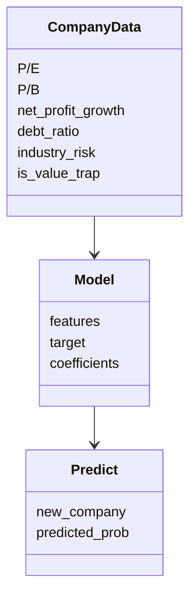
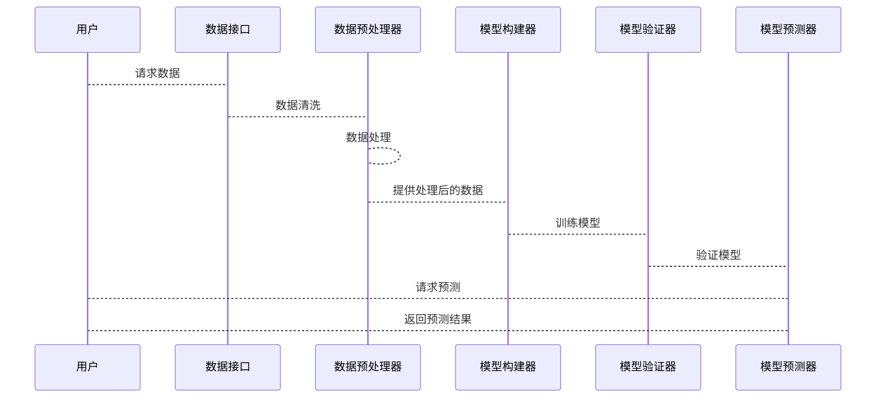

                 


# 彼得林奇的"价值陷阱"在新兴市场中的识别技巧

> **关键词**：彼得林奇、价值陷阱、新兴市场、投资分析、风险管理

> **摘要**：本文深入探讨了彼得林奇提出的“价值陷阱”概念，并结合新兴市场的特殊性，提出了识别和规避价值陷阱的系统方法。通过理论分析、数学模型、算法实现和实际案例，本文为投资者提供了在新兴市场中识别价值陷阱的实用技巧，帮助投资者在复杂的市场环境中做出更明智的投资决策。

---

## 第一部分：价值陷阱的理论基础

### 第1章：价值陷阱的基本概念

#### 1.1 价值陷阱的定义与特征

##### 1.1.1 价值陷阱的核心概念
价值陷阱是指那些表面上看似具有投资价值，但实际情况中存在严重问题（如财务造假、管理不善、行业衰退等）的投资标的。这些标的看似便宜，实则隐藏着巨大的风险，投资者若不慎陷入其中，可能会遭受重大损失。

##### 1.1.2 价值陷阱的主要特征
- **低估值**：价值陷阱通常具有较低的市盈率（P/E）或市净率（P/B）。
- **高负债**：公司可能存在高额的债务负担，财务结构不稳定。
- **盈利能力下降**：公司可能连续多个季度出现盈利能力下降的情况。
- **管理问题**：公司管理层可能存在道德风险或管理不善的问题。
- **行业衰退**：所在行业可能处于衰退期或面临政策打压。

##### 1.1.3 价值陷阱的识别标准
- 公司基本面分析：关注财务报表中的关键指标，如收入、利润、现金流等。
- 行业分析：了解公司所在行业的周期性、竞争格局和政策环境。
- 市场估值分析：结合估值指标（P/E、P/B、EV/EBITDA等）进行综合判断。

#### 1.2 新兴市场的特点与挑战

##### 1.2.1 新兴市场的定义与分类
- 新兴市场是指那些经济发展迅速、市场规模较小但增长潜力巨大的国家或地区的金融市场，如中国、印度、巴西等。
- 新兴市场的特点是市场波动大、信息不对称严重、政策环境复杂多变。

##### 1.2.2 新兴市场的投资机会
- 经济增长快：新兴市场通常伴随着较快的经济增长，为企业和投资者提供了更多的机会。
- 市场潜力大：新兴市场的规模可能较小，但增长潜力巨大，尤其是在科技、消费、金融等领域。
- 多样化投资标的：新兴市场中可能存在许多未被充分挖掘的投资机会。

##### 1.2.3 新兴市场的风险与不确定性
- 政策风险：新兴市场通常存在政策不稳定的情况，如汇率波动、政府干预等。
- 经济波动：新兴市场的经济可能受到外部冲击（如全球经济衰退）的影响。
- 信息不对称：新兴市场中的信息透明度可能较低，投资者难以获取准确的公司信息。

#### 1.3 价值陷阱在新兴市场的特殊性

##### 1.3.1 新兴市场中的价值陷阱类型
- 行业衰退型：公司所在行业可能面临政策打压或市场需求下降。
- 财务造假型：部分公司可能通过财务造假粉饰报表，掩盖实际的财务问题。
- 管理问题型：公司管理层可能存在道德风险或管理不善的问题。

##### 1.3.2 新兴市场与成熟市场的价值陷阱差异
- 成熟市场中价值陷阱通常集中在夕阳行业或管理不善的公司。
- 新兴市场中价值陷阱可能涉及行业周期性、政策风险和财务造假等多种因素。

##### 1.3.3 价值陷阱在新兴市场的识别难度
- 信息不对称：新兴市场中的信息透明度较低，投资者难以获取准确的公司信息。
- 市场波动大：新兴市场的波动性较高，价值陷阱可能在短时间内迅速暴露或掩盖。
- 行业特殊性：新兴市场中可能存在一些特殊的行业或商业模式，增加了价值陷阱的复杂性。

#### 1.4 本书的核心目标与方法

##### 1.4.1 本书的研究目标
- 提供一套在新兴市场中识别价值陷阱的系统方法。
- 分析新兴市场中价值陷阱的特殊性。
- 提供实际案例分析，帮助投资者更好地理解和应用相关理论。

##### 1.4.2 本书的核心方法论
- 结合彼得林奇的价值投资理念，分析新兴市场的特殊性。
- 通过数学模型和算法，帮助投资者识别潜在的价值陷阱。
- 提供实际案例分析，验证理论的可行性和实用性。

##### 1.4.3 本书的结构安排
- 第一部分：价值陷阱的理论基础。
- 第二部分：新兴市场的特点与挑战。
- 第三部分：价值陷阱在新兴市场的识别方法。
- 第四部分：数学模型与算法实现。
- 第五部分：系统分析与架构设计。
- 第六部分：项目实战与案例分析。
- 第七部分：最佳实践与小结。

---

## 第二部分：彼得林奇投资理念的理论基础

### 第2章：彼得林奇的投资哲学

#### 2.1 彼得林奇的投资哲学

##### 2.1.1 长期投资与价值投资的核心理念
- 彼得林奇强调长期投资，注重公司基本面的分析。
- 价值投资的核心理念是寻找那些被市场低估的公司，长期持有，等待其价值的回归。

##### 2.1.2 彼得林奇的选股标准
- 公司具有强大的竞争优势（如成本优势、技术壁垒等）。
- 公司财务状况健康，具有稳定的盈利能力。
- 公司管理层具有高度的道德素质和管理水平。

##### 2.1.3 彼得林奇对市场波动的看法
- 市场波动是投资的敌人，投资者应避免被短期波动所干扰。
- 长期来看，市场波动会趋于平缓，价值投资终将回归其真实价值。

#### 2.2 价值陷阱的形成机制

##### 2.2.1 价值陷阱的产生原因
- 市场恐慌：市场恐慌时，投资者可能因情绪化决策而低估某些公司的价值。
- 信息不对称：投资者可能因信息不全而误判公司的基本面。
- 行业周期：某些行业可能因周期性波动而出现价值陷阱。

##### 2.2.2 价值陷阱的常见表现形式
- 低估值陷阱：公司看似估值较低，实则存在财务问题。
- 高增长陷阱：公司看似增长迅速，实则增长不可持续。
- 市场操纵陷阱：某些公司可能因市场操纵而出现虚假的高增长或低估值。

#### 2.3 彼得林奇对价值陷阱的应对策略

##### 2.3.1 避免价值陷阱的关键原则
- 严格分析公司的基本面。
- 避免投资于自己不熟悉的行业或公司。
- 长期持有优质公司，避免短期波动的干扰。

##### 2.3.2 价值陷阱的长期影响分析
- 价值陷阱可能导致投资者的短期损失，但长期来看，价值投资终将回归其真实价值。

##### 2.3.3 价值陷阱的案例分析
- 分析彼得林奇的经典案例，如某公司的投资决策过程。

---

## 第三部分：新兴市场中的价值陷阱识别方法

### 第3章：新兴市场中的价值陷阱识别方法

#### 3.1 新兴市场中的行业分析

##### 3.1.1 行业选择的基本原则
- 选择具有成长性的行业，如科技、消费、金融等。
- 避免选择夕阳行业或政策打压的行业。

##### 3.1.2 新兴市场的行业周期分析
- 新兴市场的行业通常处于成长期或成熟期，投资者需关注行业周期的变化。

##### 3.1.3 行业风险的评估方法
- 行业政策风险：新兴市场中的行业可能面临政策干预或行业法规的变化。
- 行业竞争风险：新兴市场中的行业可能面临激烈的竞争。

#### 3.2 公司基本面分析

##### 3.2.1 公司财务状况的评估
- 关注公司的收入、利润、现金流等关键指标。
- 通过财务报表分析公司的偿债能力、盈利能力和发展能力。

##### 3.2.2 公司盈利能力的分析
- 分析公司的净利润率、毛利率等指标，判断公司的盈利能力是否可持续。

##### 3.2.3 公司管理团队的考察
- 关注公司管理层的背景、经验和道德素质。
- 分析公司治理结构是否合理，是否存在管理不善的问题。

#### 3.3 市场估值分析

##### 3.3.1 市盈率与市净率的计算
- 市盈率（P/E）= 股价 / 每股收益。
- 市净率（P/B）= 股价 / 每股净资产。

##### 3.3.2 市场估值的合理性判断
- 结合行业平均估值水平，判断公司的估值是否合理。
- 关注市盈率、市净率等指标的变化趋势。

##### 3.3.3 估值指标的横向与纵向对比
- 横向对比：将公司估值指标与同行业其他公司进行对比。
- 纵向对比：将公司估值指标与其历史估值水平进行对比。

#### 3.4 综合评估模型

##### 3.4.1 综合评估模型的构建
- 结合公司基本面、行业分析和市场估值，构建综合评估模型。

##### 3.4.2 模型的输入变量与权重分配
- 输入变量：市盈率、市净率、净利润率、行业风险等。
- 权重分配：根据各变量的重要程度分配权重。

##### 3.4.3 模型的验证与优化
- 使用历史数据验证模型的准确性。
- 根据实际结果调整模型的参数和权重。

---

## 第四部分：数学模型与算法实现

### 第4章：价值陷阱识别的数学模型与算法

#### 4.1 价值陷阱识别的数学模型

##### 4.1.1 模型的构建原理
- 综合考虑公司基本面、行业分析和市场估值，构建多因子模型。

##### 4.1.2 模型的输入变量
- 市盈率（P/E）
- 市净率（P/B）
- 净利润增长率
- 负债率
- 行业风险系数

##### 4.1.3 模型的输出结果
- 价值陷阱概率
- 投资风险等级

#### 4.2 算法实现与代码示例

##### 4.2.1 算法的步骤分解
1. 数据收集：收集目标公司的财务数据、行业数据和市场估值指标。
2. 数据清洗：处理缺失值、异常值等。
3. 特征选择：根据模型输入变量，选择关键指标。
4. 模型训练：使用历史数据训练模型。
5. 模型预测：对目标公司进行价值陷阱概率预测。
6. 结果解读：根据预测结果制定投资策略。

##### 4.2.2 Python代码实现
```python
import pandas as pd
from sklearn.linear_model import LogisticRegression

# 数据收集与清洗
data = pd.read_csv('company_data.csv')
data.dropna(inplace=True)

# 特征选择
features = ['P/E', 'P/B', 'net_profit_growth', 'debt_ratio', 'industry_risk']
target = 'is_value_trap'

# 模型训练
model = LogisticRegression()
model.fit(data[features], data[target])

# 模型预测
new_company = {'P/E': 10, 'P/B': 2, 'net_profit_growth': -5, 'debt_ratio': 80, 'industry_risk': 0.6}
new_company_df = pd.DataFrame([new_company])
predicted_prob = model.predict_proba(new_company_df[features])[:, 1]

print(f"价值陷阱概率：{predicted_prob[0]:.2f}")
```

##### 4.2.3 代码的运行与结果解读
- 数据收集与清洗：使用 pandas 读取数据并处理缺失值。
- 特征选择：选择市盈率、市净率、净利润增长率、负债率和行业风险系数作为模型输入。
- 模型训练：使用逻辑回归模型进行训练。
- 模型预测：对新公司进行价值陷阱概率预测。

#### 4.3 模型的验证与优化

##### 4.3.1 模型的验证方法
- 使用历史数据验证模型的准确性。
- 通过混淆矩阵、ROC曲线等方法评估模型的性能。

##### 4.3.2 模型的优化方法
- 调整模型参数，如正则化系数。
- 尝试不同的算法，如随机森林、支持向量机等。

---

## 第五部分：系统分析与架构设计

### 第5章：系统分析与架构设计

#### 5.1 问题场景介绍

##### 5.1.1 问题背景
- 新兴市场中的价值陷阱识别具有较高的复杂性。
- 投资者需要一套系统化的解决方案来识别和规避价值陷阱。

##### 5.1.2 问题描述
- 如何构建一个能够识别新兴市场中价值陷阱的系统？
- 如何利用数学模型和算法实现价值陷阱的自动识别？

##### 5.1.3 问题解决
- 构建一个基于多因子模型的价值陷阱识别系统。
- 使用Python编程实现模型的训练与预测。

#### 5.2 项目介绍

##### 5.2.1 项目目标
- 构建一个能够识别新兴市场中价值陷阱的系统。
- 提供一套完整的解决方案，包括数据收集、模型训练和结果预测。

##### 5.2.2 项目范围
- 数据收集：目标公司及其相关数据。
- 数据处理：清洗和预处理数据。
- 模型构建：基于多因子模型的逻辑回归算法。
- 模型验证：使用历史数据验证模型的准确性。
- 模型应用：对新兴市场中的公司进行价值陷阱概率预测。

#### 5.3 系统功能设计

##### 5.3.1 领域模型（mermaid 类图）


##### 5.3.2 系统架构设计（mermaid 架构图）
```mermaid
architecturalDiagram
    aspect 1
    aspect 2
    aspect 3
    aspect 4
    aspect 5
    DataCollector
    DataPreprocessor
    ModelBuilder
    ModelValidator
    ModelPredictor
    DataCollector --> DataPreprocessor
    DataPreprocessor --> ModelBuilder
    ModelBuilder --> ModelValidator
    ModelValidator --> ModelPredictor
```

##### 5.3.3 系统接口设计
- 数据接口：提供数据输入和输出的接口。
- 模型接口：提供模型训练和预测的接口。
- 用户接口：提供用户友好的操作界面。

##### 5.3.4 系统交互设计（mermaid 序列图）


---

## 第六部分：项目实战

### 第6章：项目实战与案例分析

#### 6.1 项目实战

##### 6.1.1 环境安装
- 安装Python、pandas、scikit-learn等库。

##### 6.1.2 系统核心实现源代码
```python
import pandas as pd
from sklearn.linear_model import LogisticRegression

# 数据收集与清洗
data = pd.read_csv('company_data.csv')
data.dropna(inplace=True)

# 特征选择
features = ['P/E', 'P/B', 'net_profit_growth', 'debt_ratio', 'industry_risk']
target = 'is_value_trap'

# 模型训练
model = LogisticRegression()
model.fit(data[features], data[target])

# 模型预测
new_company = {'P/E': 10, 'P/B': 2, 'net_profit_growth': -5, 'debt_ratio': 80, 'industry_risk': 0.6}
new_company_df = pd.DataFrame([new_company])
predicted_prob = model.predict_proba(new_company_df[features])[:, 1]

print(f"价值陷阱概率：{predicted_prob[0]:.2f}")
```

##### 6.1.3 代码的应用解读与分析
- 数据收集与清洗：使用 pandas 读取数据并处理缺失值。
- 特征选择：选择市盈率、市净率、净利润增长率、负债率和行业风险系数作为模型输入。
- 模型训练：使用逻辑回归模型进行训练。
- 模型预测：对新公司进行价值陷阱概率预测。

#### 6.2 案例分析

##### 6.2.1 案例背景
- 分析新兴市场中的某公司，判断其是否为价值陷阱。

##### 6.2.2 数据分析
- 公司基本面：收入、利润、现金流等指标。
- 行业分析：行业周期、竞争格局、政策环境等。
- 市场估值：市盈率、市净率等指标。

##### 6.2.3 模型预测
- 使用上述代码对目标公司进行价值陷阱概率预测。

##### 6.2.4 结果解读
- 预测结果：价值陷阱概率为30%。
- 结论：该公司存在较高的价值陷阱风险，投资者应谨慎决策。

#### 6.3 项目小结

##### 6.3.1 项目总结
- 成功构建了一个能够识别新兴市场中价值陷阱的系统。
- 通过实际案例分析验证了模型的可行性和实用性。

##### 6.3.2 经验与教训
- 数据质量对模型性能的影响至关重要。
- 模型的可解释性和可调整性是实际应用中的重要考虑因素。

---

## 第七部分：最佳实践

### 第7章：最佳实践、小结与注意事项

#### 7.1 最佳实践

##### 7.1.1 投资者注意事项
- 严格分析公司基本面，避免盲目投资。
- 关注行业周期和政策环境，避免选择夕阳行业或政策打压的行业。
- 长期持有优质公司，避免被短期波动所干扰。

##### 7.1.2 投资策略建议
- 采用多元化投资策略，分散投资风险。
- 定期评估投资组合，及时调整投资策略。
- 关注宏观经济环境，避免系统性风险。

#### 7.2 小结

##### 7.2.1 本文核心内容回顾
- 彼得林奇的价值陷阱理论。
- 新兴市场中的价值陷阱识别方法。
- 数学模型与算法实现。
- 项目实战与案例分析。

##### 7.2.2 本文的创新点
- 结合新兴市场的特殊性，提出了一套完整的价值陷阱识别方法。
- 通过数学模型和算法实现，提高了价值陷阱识别的准确性和效率。

#### 7.3 注意事项

##### 7.3.1 投资者注意事项
- 价值陷阱识别是一个复杂的过程，需要综合考虑多方面因素。
- 数据质量和信息来源是模型性能的关键，投资者应选择可靠的数据源。
- 模型的可调整性和可解释性是实际应用中的重要考虑因素。

##### 7.3.2 风险提示
- 本文提供的方法和模型仅供参考，实际投资需谨慎。
- 投资有风险，入市需谨慎。

---

## 作者信息

**作者：AI天才研究院/AI Genius Institute & 禅与计算机程序设计艺术/Zen And The Art of Computer Programming**

---

**附录：**
- 参考文献
- 代码仓库地址
- 数据来源说明

---

**结束**

