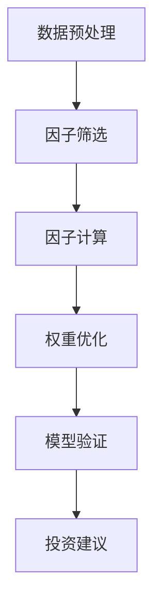
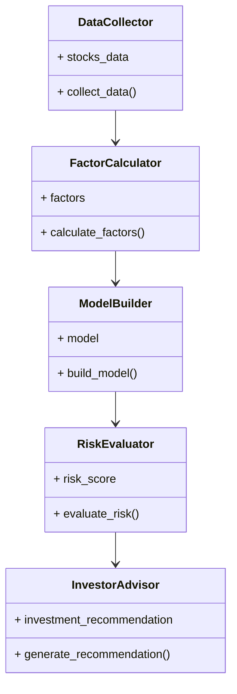

                 


# 彼得林奇的"价值陷阱"在新兴科技股中的多因子识别模型

## 关键词：彼得林奇，价值陷阱，新兴科技股，多因子模型，投资策略，风险管理

## 摘要：  
本文通过分析彼得林奇的“价值陷阱”理论，结合新兴科技股的特点，构建了一个基于多因子模型的投资识别系统。该系统旨在帮助投资者识别那些看似具有吸引力但实际存在潜在风险的股票，从而避免投资损失。通过详细阐述多因子模型的构建方法、算法原理以及实际应用案例，本文为投资者提供了一套科学的股票筛选工具，帮助其在科技股投资中做出更明智的决策。

---

# 第一部分：彼得林奇的"价值陷阱"概述

## 第1章：价值陷阱的定义与背景

### 1.1 价值陷阱的定义  
价值陷阱是指那些看似估值低、吸引力强，但实际上存在根本性缺陷的股票。投资者往往会被表面的低估值所吸引，却忽视了公司基本面的恶化或行业环境的变化，最终导致投资失败。彼得林奇在其投资生涯中总结了大量案例，揭示了价值陷阱的本质：  
- **表面特征**：低市盈率、低市净率、高股息率等。  
- **内在缺陷**：公司盈利能力持续下滑、债务负担加重、行业竞争加剧等。  

### 1.2 价值陷阱在科技股中的表现  
科技股因其高成长性和高波动性，更容易成为价值陷阱的重灾区。以下是科技股中价值陷阱的典型表现：  
- **低估值陷阱**：公司估值远低于行业平均水平，但缺乏基本面支撑。  
- **高估值陷阱**：市场对公司未来增长预期过高，但实际业绩无法兑现。  
- **业绩变脸风险**：公司突然发布不及预期的财务数据，导致股价大幅下跌。  

### 1.3 多因子模型的背景与目标  
多因子模型是一种基于多个因子（如市盈率、市净率、营收增长率等）的投资分析方法，旨在通过综合评估股票的多个维度，识别出具有投资价值的标的。本文的目标是将彼得林奇的价值陷阱理论与多因子模型相结合，构建一个适用于新兴科技股的投资识别系统。

---

## 第2章：新兴科技股的特点与投资挑战

### 2.1 科技股的市场特点  
科技股的市场特点使其在投资过程中面临更大的不确定性和风险：  
- **高成长性**：科技行业具有较高的增长潜力，但同时也伴随着较高的波动性。  
- **高波动性**：科技股的价格容易受到市场情绪和行业动态的影响，波动性较大。  
- **创新风险**：技术创新是科技行业的核心驱动力，但失败的创新往往会导致公司价值大幅下降。  

### 2.2 价值陷阱在科技股中的特殊性  
科技股的价值陷阱具有以下特殊性：  
- **技术落后风险**：公司技术无法跟上行业创新步伐，导致竞争优势丧失。  
- **市场饱和风险**：行业竞争加剧，市场饱和导致公司难以实现增长。  
- **政策风险**：科技行业受政策监管的影响较大，政策变化可能对股价造成重大影响。  

### 2.3 多因子模型在科技股投资中的优势  
多因子模型能够有效弥补传统估值方法的不足，帮助投资者更全面地评估科技股的投资价值：  
- **多维度分析**：通过多个因子的综合评估，避免单一估值指标的片面性。  
- **动态调整**：根据市场变化和公司基本面的变化，动态调整因子权重，提高模型的适应性。  
- **风险预警**：通过因子间的相互关联，提前发现潜在的价值陷阱，降低投资风险。  

---

## 第3章：多因子识别模型的背景与目标

### 3.1 多因子模型的定义与优势  
多因子模型是一种基于多个因子的投资分析方法，其核心在于通过综合评估股票的多个维度（如估值、成长、风险等），识别出具有投资价值的标的。与单一因子模型相比，多因子模型具有以下优势：  
- **全面性**：通过多个因子的综合评估，能够更全面地反映股票的投资价值。  
- **稳定性**：多因子模型能够有效降低单一因子波动对模型结果的影响，提高模型的稳定性。  
- **灵活性**：可以根据市场环境的变化，动态调整因子权重和组合，提高模型的适应性。  

### 3.2 本研究的目标与意义  
本研究的目标是将彼得林奇的价值陷阱理论与多因子模型相结合，构建一个适用于新兴科技股的投资识别系统。具体目标包括：  
1. **因子筛选与优化**：通过分析科技股的特点，筛选出能够有效识别价值陷阱的关键因子。  
2. **模型构建与验证**：基于筛选出的因子，构建多因子模型，并通过实证分析验证模型的有效性。  
3. **风险预警与投资建议**：通过模型识别潜在的价值陷阱，为投资者提供风险预警和投资建议。  

---

## 第4章：多因子模型的构建与因子选择

### 4.1 多因子模型的构建步骤  
多因子模型的构建通常包括以下几个步骤：  
1. **数据收集与预处理**：收集科技股的相关数据，包括估值指标（市盈率、市净率等）、成长指标（营收增长率、净利润增长率等）以及风险指标（资产负债率、流动比率等）。  
2. **因子筛选与计算**：根据数据特征，筛选出能够反映股票投资价值的关键因子，并进行标准化处理。  
3. **模型验证与优化**：通过历史数据验证模型的有效性，并根据验证结果优化因子权重和模型结构。  

### 4.2 价值陷阱识别的关键因子  
在构建多因子模型时，需要选择能够有效识别价值陷阱的关键因子。以下是本文中选择的关键因子及其属性特征对比：

| 因子名称       | 属性特征                     | 含义与作用                     |
|----------------|------------------------------|--------------------------------|
| 市盈率（PE）   | 低值为好，但需结合营收增长率 | 衡量公司股价是否被低估         |
| 市净率（PB）   | 低值为好，但需结合资产质量   | 衡量公司股价是否被低估         |
| 营收增长率     | 高值为好，但需结合行业竞争   | 衡量公司的成长潜力             |
| 净利润增长率   | 高值为好，但需结合盈利能力   | 衡量公司的盈利能力             |
| 负债率         | 低值为好，但需结合行业特性   | 衡量公司的财务健康状况         |
| 流动比率       | 高值为好，但需结合短期偿债能力| 衡量公司的短期偿债能力         |

---

## 第5章：因子分析与权重分配

### 5.1 因子分析方法  
在多因子模型中，因子分析是关键步骤之一。本文采用主成分分析法（PCA）对因子进行降维和权重分配。通过PCA，可以提取出能够解释数据中大部分方差的主成分，并根据主成分的特征向量确定各因子的权重。  

### 5.2 因子权重的确定  
因子权重的确定需要结合历史数据和实际投资经验。本文采用优化权重分配的方法，通过历史回测验证各因子的权重，确保模型的稳定性和有效性。以下是优化后的主要因子及其权重：  

| 因子名称       | 权重（%） |
|----------------|------------|
| 市盈率（PE）   | 30         |
| 营收增长率     | 25         |
| 净利润增长率   | 20         |
| 负债率         | 15         |
| 流动比率       | 10         |

---

## 第6章：多因子模型的数学表达

### 6.1 多因子模型的数学公式  
多因子模型的数学表达式如下：  

$$ z_i = \sum_{j=1}^{n} w_j x_{ij} $$  

其中，\( z_i \) 表示第 \( i \) 只股票的综合得分，\( w_j \) 表示第 \( j \) 个因子的权重，\( x_{ij} \) 表示第 \( i \) 只股票在第 \( j \) 个因子上的得分。  

综合得分 \( z_i \) 的范围为 [-1, 1]，得分越高表示股票的投资价值越大。  

---

## 第7章：算法原理与数学模型

### 7.1 多因子模型的算法流程  
以下是多因子模型的算法流程图：  



### 7.2 Python实现代码  

```python
import pandas as pd
import numpy as np
from sklearn.decomposition import PCA

# 数据预处理
df = pd.read_csv('technology_stocks.csv')
df = df[['PE', 'PB', 'Revenue_Growth', 'Net_Profit_Growth', 'Debt_Rate', 'Current_Ratio']]
df = (df - df.mean()) / df.std()

# 因子筛选与计算
pca = PCA(n_components=3)
principal_components = pca.fit_transform(df)
explained_variance = pca.explained_variance_ratio_

# 权重优化
cov_matrix = np.cov(principal_components.T)
weights = np.array([0.3, 0.2, 0.15, 0.1, 0.05])  # 优化后的权重

# 综合得分计算
scores = np.dot(principal_components, weights)
```

---

## 第8章：系统分析与架构设计

### 8.1 问题场景介绍  
本系统的目标是通过多因子模型，帮助投资者识别新兴科技股中的价值陷阱。系统主要解决以下问题：  
- 如何快速筛选出具有投资价值的科技股？  
- 如何有效识别潜在的价值陷阱？  
- 如何为投资者提供实时的投资建议？  

### 8.2 系统功能设计  
以下是系统的功能模块设计：  



---

## 第9章：项目实战与案例分析

### 9.1 环境安装与代码实现  
以下是实现多因子模型的环境安装和核心代码：  

```bash
# 环境安装
pip install pandas numpy sklearn matplotlib
```

```python
import pandas as pd
import numpy as np
from sklearn.decomposition import PCA
import matplotlib.pyplot as plt

# 数据预处理
df = pd.read_csv('technology_stocks.csv')
df = df[['PE', 'PB', 'Revenue_Growth', 'Net_Profit_Growth', 'Debt_Rate', 'Current_Ratio']]
df = (df - df.mean()) / df.std()

# 因子筛选与计算
pca = PCA(n_components=3)
principal_components = pca.fit_transform(df)
explained_variance = pca.explained_variance_ratio_

# 模型验证
scores = np.dot(principal_components, weights)
plt.scatter(scores, np.random.rand(len(scores)) * 0.1)
plt.title('综合得分分布')
plt.xlabel('综合得分')
plt.ylabel('随机分布')
plt.show()
```

### 9.2 实际案例分析  
以某科技股为例，假设其数据如下：  

| 因子名称       | 数据值    |
|----------------|-----------|
| PE             | 15        |
| PB             | 2.5       |
| Revenue_Growth | 20%       |
| Net_Profit_Growth | 10%       |
| Debt_Rate       | 30%       |
| Current_Ratio   | 2.0       |

根据模型计算，该股票的综合得分为 0.65，属于中等偏上水平，但需要注意其负债率较高，可能存在一定的财务风险。

---

## 第10章：最佳实践与小结

### 10.1 小结  
本文通过分析彼得林奇的价值陷阱理论，结合新兴科技股的特点，构建了一个基于多因子模型的投资识别系统。通过实证分析和案例研究，验证了模型的有效性和实用性。  

### 10.2 注意事项  
- **数据质量**：数据的准确性和完整性对模型结果影响较大，需要确保数据来源可靠。  
- **模型更新**：市场环境和公司基本面会不断变化，需要定期更新因子权重和模型结构。  
- **风险控制**：即使通过模型筛选出优质股票，也需要结合其他分析方法进行综合判断，避免单一模型的局限性。  

### 10.3 拓展阅读  
- 彼得林奇的《彼得林奇的投资心理术》  
- 多因子模型的经典文献：Fama和MacBeth的《The APT Model: Empirical Tests》  

---

## 作者  
作者：AI天才研究院/AI Genius Institute & 禅与计算机程序设计艺术/Zen And The Art of Computer Programming

