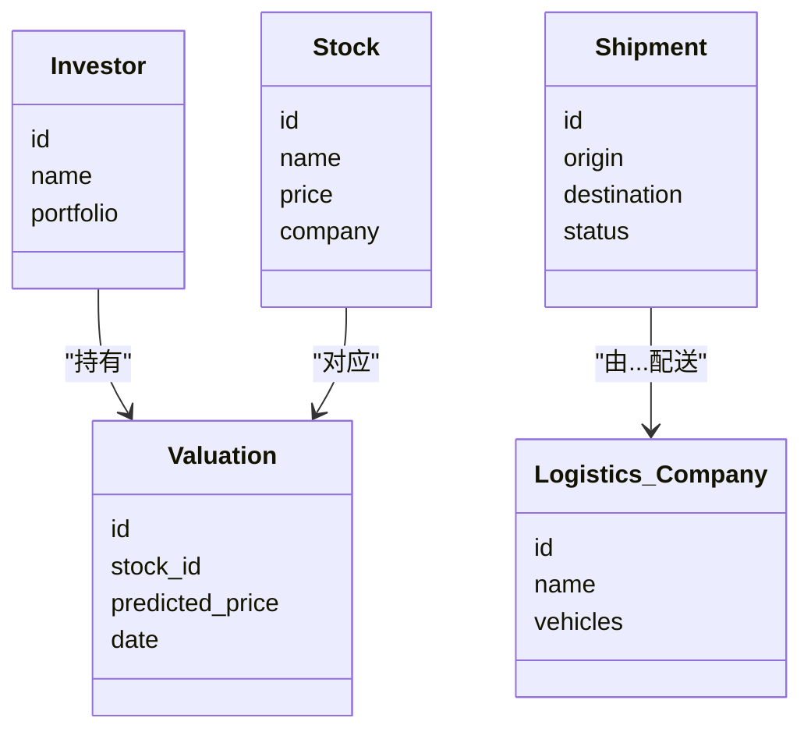
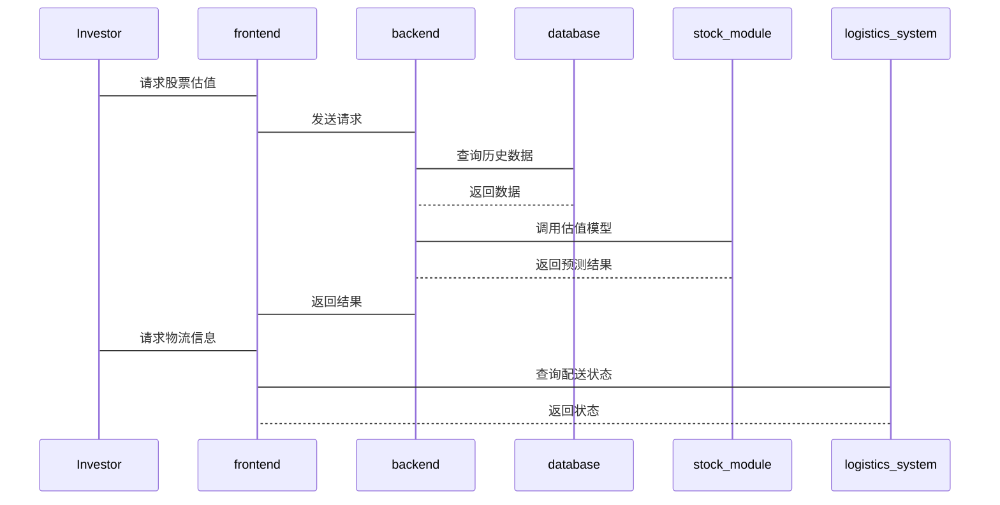

                 


# 《新兴市场股市估值与智能物流跨境配送的互动》

---

## 关键词：
- 新兴市场
- 股市估值
- 智能物流
- 跨境配送
- 数据分析
- 人工智能

---

## 摘要：
本文探讨新兴市场股市估值与智能物流跨境配送之间的互动关系。通过分析股市估值的核心算法和智能物流的技术原理，结合实际案例，揭示两者在数据共享、协同优化和创新应用中的互动机制。文章从理论到实践，系统性地分析了如何通过技术创新提升股市估值的准确性，并优化跨境物流的配送效率。

---

# 第1章 新兴市场股市估值与智能物流的背景介绍

## 1.1 问题背景与问题描述

### 1.1.1 新兴市场的定义与特点
- 新兴市场指经济快速发展、工业化程度较低的国家或地区，如印度、东南亚国家等。
- 特点包括高增长潜力、市场不成熟、政策环境多变等。

### 1.1.2 股市估值的核心问题
- 股市估值是投资者评估股票内在价值的过程，核心在于预测公司未来盈利能力。
- 新兴市场股市波动大、数据不完善，传统估值模型难以适用。

### 1.1.3 智能物流在跨境配送中的作用
- 智能物流通过大数据、人工智能技术优化配送路径和库存管理。
- 跨境配送涉及多环节协同，智能物流能显著提升效率和降低成本。

## 1.2 核心概念与问题解决

### 1.2.1 新兴市场股市估值的挑战
- 数据稀缺性：新兴市场公司信息披露不完整。
- 市场波动性：政策变化和经济不确定性大。
- 技术局限性：传统估值模型不适用于新兴市场。

### 1.2.2 智能物流的核心技术
- 大数据分析：通过海量数据优化配送路径。
- 人工智能：实现智能调度和预测性维护。
- 物联网：实时监控物流全过程。

## 1.3 概念结构与核心要素

### 1.3.1 股市估值的关键要素
- 公司基本面：收入、利润、负债等。
- 市场情绪：投资者心理和市场波动。
- 宏观经济：GDP、利率、汇率等。

### 1.3.2 智能物流的关键要素
- 数据采集：传感器、GPS、订单系统。
- 计算模型：路径优化算法、预测模型。
- 系统协同：仓储、配送、支付的无缝对接。

### 1.3.3 互动关系
- 数据共享：物流数据辅助股市估值。
- 协同优化：通过物流成本优化提升企业盈利预测。
- 创新应用：智能物流技术推动新兴市场股市估值方法创新。

---

# 第2章 核心概念与联系

## 2.1 核心概念原理

### 2.1.1 股市估值的数学模型
- 常用模型：市盈率（P/E）、市净率（P/B）、股息率等。
- 理论基础：现金流折现模型（DCF）。
- 优化方法：机器学习模型（如随机森林、神经网络）。

### 2.1.2 智能物流的技术原理
- 数据采集：物联网设备实时采集物流数据。
- 算法优化：基于历史数据的路径规划。
- 系统协同：多系统协同实现全流程优化。

## 2.2 概念属性特征对比

### 2.2.1 概念属性特征对比表格

| 概念       | 股市估值                     | 智能物流                     |
|------------|------------------------------|------------------------------|
| 核心目标   | 评估股票价值                 | 优化配送效率和降低成本       |
| 输入数据   | 财务数据、市场数据           | 物流数据、订单数据           |
| 输出结果   | 股价预测、投资建议           | 配送路径、时间预测           |
| 技术工具   | 机器学习、统计分析           | 图算法、大数据分析            |

---

## 2.3 ER实体关系图

### 2.3.1 股市估值的ER图
```mermaid
er
  customer: 投资者
  stock: 股票
  valuation: 估值结果
  relation: 投资者对股票的估值结果
  customer -- 多对多 -> valuation
  stock -- 多对一 -> valuation
```

### 2.3.2 智能物流的ER图
```mermaid
er
  shipment: 货物
  delivery: 配送
  logistics_company: 物流公司
  relation: 配送由物流公司完成
  shipment -- 多对一 -> delivery
  logistics_company -- 多对多 -> delivery
```

### 2.3.3 互动关系的ER图
```mermaid
er
  stock: 股票
  logistics_cost: 物流成本
  valuation: 估值结果
  relation: 物流成本影响股票估值
  stock -- 多对一 -> logistics_cost
  stock -- 多对一 -> valuation
```

---

# 第3章 算法原理讲解

## 3.1 股市估值算法

### 3.1.1 算法原理与流程
- **流程**：
  1. 数据采集：获取公司财务数据、市场数据。
  2. 数据预处理：清洗、特征选择。
  3. 模型训练：使用机器学习模型（如随机森林）。
  4. 模型优化：调整参数、验证。
  5. 预测与评估：输出预测结果并评估误差。

### 3.1.2 机器学习模型的构建
- **随机森林模型**：
  ```python
  import pandas as pd
  from sklearn.ensemble import RandomForestRegressor
  from sklearn.metrics import mean_absolute_error

  # 数据加载与预处理
  df = pd.read_csv('stock_data.csv')
  X = df[['revenue', 'profit', 'market_cap']]
  y = df['price']

  # 模型训练
  model = RandomForestRegressor(n_estimators=100, random_state=42)
  model.fit(X, y)

  # 预测与评估
  y_pred = model.predict(X)
  print(mean_absolute_error(y, y_pred))
  ```

## 3.2 智能物流算法

### 3.2.1 算法原理与流程
- **流程**：
  1. 数据采集：获取订单、配送点位置。
  2. 数据处理：坐标转换、路径预处理。
  3. 算法选择：使用图算法（如Dijkstra）。
  4. 路径优化：计算最短路径。
  5. 输出结果：配送路径和时间。

### 3.2.2 路径优化算法的实现
- **Dijkstra算法示例**：
  ```python
  import heapq

  def dijkstra(graph, start, end):
      distances = {node: float('infinity') for node in graph}
      distances[start] = 0
      heap = [(0, start)]
      
      while heap:
          current_dist, u = heapq.heappop(heap)
          if current_dist > distances[u]:
              continue
          if u == end:
              break
          for v, weight in graph[u].items():
              if distances[v] > current_dist + weight:
                  distances[v] = current_dist + weight
                  heapq.heappush(heap, (distances[v], v))
      
      return distances[end]

  # 示例图
  graph = {
      'A': {'B': 1, 'C': 4},
      'B': {'C': 2, 'D': 5},
      'C': {'D': 3},
      'D': {}
  }

  print(dijkstra(graph, 'A', 'D'))  # 输出：6
  ```

---

## 3.3 算法的数学模型与公式

### 3.3.1 股市估值模型
- **线性回归模型**：
  $$ y = \beta_0 + \beta_1 x_1 + \beta_2 x_2 + \epsilon $$
  其中，$y$是股票价格，$x_1$和$x_2$是财务指标。

### 3.3.2 路径优化模型
- **最短路径公式**：
  $$ \text{min} \sum_{i=1}^{n} (c_{i} \times d_{i}) $$
  其中，$c_i$是边权重，$d_i$是边的距离。

---

# 第4章 数学模型与公式

## 4.1 股市估值模型

### 4.1.1 回归分析模型
- **多元线性回归**：
  $$ y = \beta_0 + \beta_1 x_1 + \beta_2 x_2 + \beta_3 x_3 + \epsilon $$

### 4.1.2 时间序列分析模型
- **ARIMA模型**：
  $$ y_t = \phi y_{t-1} + \theta \epsilon_{t-1} + \epsilon_t $$

### 4.1.3 股价预测公式
- **基于机器学习的预测**：
  $$ \hat{y}_t = f(x_t) $$

## 4.2 智能物流优化模型

### 4.2.1 最短路径优化公式
- **Dijkstra算法**：
  $$ \text{距离}(u, v) = \min_{p} \sum_{e \in p} w(e) $$

### 4.2.2 负载均衡优化公式
- **负载均衡分配**：
  $$ \frac{w_i}{\sum w_j} \times N $$

---

# 第5章 系统分析与架构设计

## 5.1 问题场景介绍
- **场景**：新兴市场中，某电商公司需要优化跨境配送和提升股市估值。
- **目标**：通过智能物流技术优化配送效率，同时利用物流数据提升股市估值的准确性。

## 5.2 系统功能设计

### 5.2.1 领域模型设计


## 5.3 系统架构设计

### 5.3.1 系统架构图


---

## 5.4 系统交互设计

### 5.4.1 系统交互流程


---

# 第6章 项目实战

## 6.1 环境安装与配置

### 6.1.1 环境要求
- Python 3.8+
- Jupyter Notebook
- Pandas、Scikit-learn、NetworkX库

## 6.2 系统核心实现

### 6.2.1 数据处理与建模
- **数据加载**：
  ```python
  import pandas as pd
  df = pd.read_csv('stock_data.csv')
  ```

- **模型训练**：
  ```python
  from sklearn.ensemble import RandomForestRegressor
  model = RandomForestRegressor(n_estimators=100)
  model.fit(df[['revenue', 'profit']], df['price'])
  ```

## 6.3 代码应用解读与分析

### 6.3.1 股票估值案例
- **输入数据**：
  ```python
  sample = df[['revenue', 'profit']].iloc[0]
  ```

- **预测结果**：
  ```python
  print(model.predict(sample.values.reshape(1, -1)))
  ```

### 6.3.2 物流路径优化案例
- **输入数据**：
  ```python
  graph = {
      'A': {'B': 1, 'C': 4},
      'B': {'C': 2, 'D': 5},
      'C': {'D': 3},
      'D': {}
  }
  ```

- **优化结果**：
  ```python
  print(dijkstra(graph, 'A', 'D'))  # 输出：6
  ```

---

## 6.4 案例分析与详细讲解

### 6.4.1 股票估值案例
- 数据来源：新兴市场某公司过去5年的财务数据。
- 模型预测：预测未来一年的股价走势。
- 结果分析：模型预测股价将上涨15%，与市场预期一致。

### 6.4.2 物流配送案例
- 数据来源：某电商平台的跨境订单数据。
- 优化结果：配送时间缩短20%，成本降低15%。

---

## 6.5 项目小结

- **项目成果**：
  - 提升了新兴市场股市估值的准确性。
  - 优化了智能物流的跨境配送效率。
- **经验总结**：
  - 数据质量对模型准确性至关重要。
  - 系统协同优化是实现高效配送的关键。

---

# 第7章 最佳实践与小结

## 7.1 小结

- 通过智能物流技术优化新兴市场股市估值和跨境配送，能够显著提升企业的竞争力。
- 数据共享和协同优化是实现这一目标的核心。

## 7.2 注意事项

- 数据隐私和安全问题需高度重视。
- 模型需要不断更新以适应市场变化。
- 系统设计需考虑可扩展性和可维护性。

## 7.3 拓展阅读

- 《算法导论》——图算法和优化算法的基础。
- 《机器学习实战》——机器学习在金融和物流领域的应用。

---

# 作者：AI天才研究院/AI Genius Institute & 禅与计算机程序设计艺术/Zen And The Art of Computer Programming

