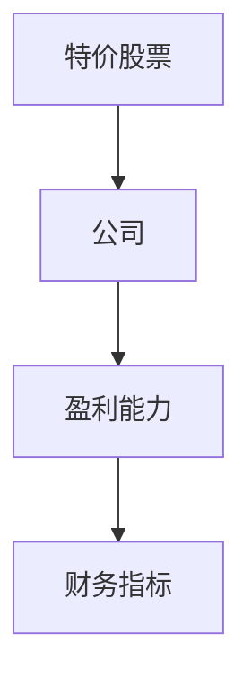
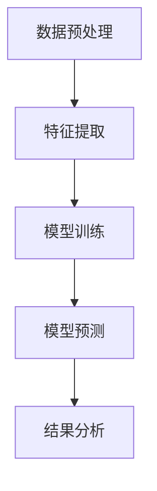
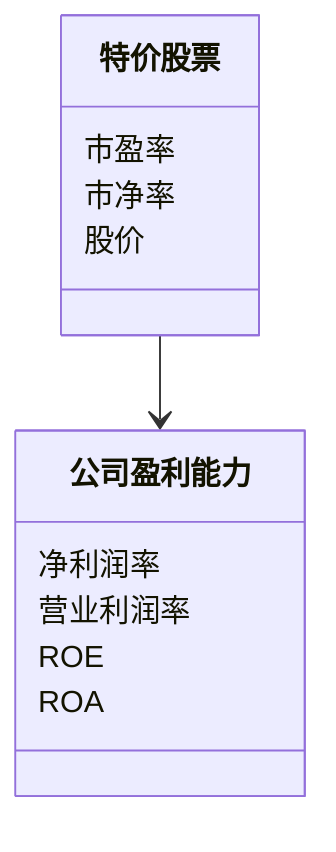
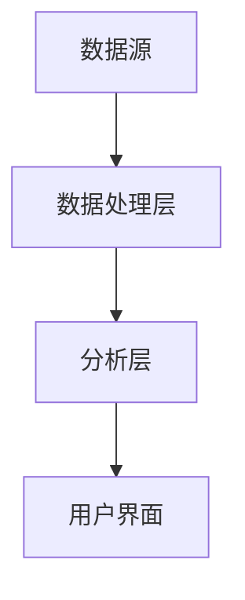

                 


# 特价股票与公司盈利能力的长期关系

**关键词：** 特价股票、公司盈利能力、长期关系、投资策略、财务分析、市场趋势

**摘要：**  
特价股票是指价格低于其内在价值的股票，而公司盈利能力是衡量公司财务健康的重要指标。本文通过分析特价股票与公司盈利能力之间的长期关系，探讨特价股票如何影响公司的盈利能力，以及如何利用这种关系制定有效的投资策略。文章结合数学模型、算法原理和实际案例，详细阐述了特价股票对盈利能力的影响机制，并提出了基于数据分析的投资建议。

---

# 第一部分：特价股票与公司盈利能力的背景介绍

## 第1章：特价股票与公司盈利能力的概述

### 1.1 问题背景与问题描述

#### 1.1.1 特价股票的定义与分类
特价股票通常指价格低于市场平均水平或低于其内在价值的股票。根据股票的市盈率、市净率等指标，特价股票可以分为以下几类：
- **低估股票**：市场价格低于内在价值。
- **折价股票**：市场价格低于行业平均水平。
- **低价股票**：市场价格显著低于市场平均水平。

#### 1.1.2 公司盈利能力的核心指标
公司盈利能力是衡量公司财务健康的重要指标，主要包括以下方面：
- **净利润率（Net Profit Margin）**：净利润与营业收入的比率。
- **营业利润率（Operating Profit Margin）**：营业收入减去运营成本后的利润与营业收入的比率。
- **ROE（净资产收益率）**：净利润与股东权益的比率。
- **ROA（资产回报率）**：净利润与总资产的比率。

#### 1.1.3 特价股票与公司盈利能力的关系
特价股票的价格反映了市场的估值，而公司的盈利能力决定了其内在价值。两者之间的关系可以通过以下方式理解：
1. **低估值与高盈利能力**：某些公司由于市场误解或暂时性因素，股票价格被低估，但公司盈利能力强，这种情况下，特价股票可能成为长期投资的机会。
2. **高估值与低盈利能力**：如果公司盈利能力不佳，但股票价格被高估，投资者可能会面临风险。

### 1.2 特价股票与公司盈利能力的核心概念

#### 1.2.1 特价股票的属性特征
- **价格敏感性**：特价股票的价格波动较大，容易受到市场情绪的影响。
- **估值差异性**：特价股票的价格通常低于其内在价值，反映了市场对公司的负面看法。
- **投资机会**：特价股票可能隐藏着被市场低估的优质公司。

#### 1.2.2 公司盈利能力的构成要素
- **收入能力**：公司能否持续获得稳定的收入。
- **成本控制能力**：公司能否有效控制运营成本。
- **利润分配能力**：公司能否通过合理分配资源提高盈利能力。

#### 1.2.3 两者关系的边界与外延
- **短期波动**：特价股票的价格受市场情绪影响较大，而盈利能力是长期积累的结果。
- **行业差异**：不同行业的公司盈利能力差异显著，影响特价股票的分析。
- **市场周期**：经济周期和市场趋势会影响特价股票与盈利能力的关系。

### 1.3 本章小结
本章通过对特价股票和公司盈利能力的定义、分类和核心概念的分析，揭示了两者之间的复杂关系。特价股票的价格反映了市场的估值，而公司的盈利能力是其内在价值的决定因素。理解这两者的长期关系，有助于投资者制定有效的投资策略。

---

# 第二部分：特价股票与公司盈利能力的核心概念与联系

## 第2章：特价股票与公司盈利能力的核心概念分析

### 2.1 核心概念原理

#### 2.1.1 特价股票的定价机制
特价股票的价格由市场供需关系决定，通常低于其内在价值。市场参与者对公司前景的判断会影响股票价格，从而导致特价股票的出现。

#### 2.1.2 公司盈利能力的影响因素
公司盈利能力受多种因素影响，包括市场需求、成本控制、管理效率、行业竞争等。

#### 2.1.3 两者关系的理论模型
通过构建模型，我们可以分析特价股票的价格如何影响公司的盈利能力。例如，当公司股价被低估时，可能通过回购股票或并购活动提高盈利能力。

### 2.2 核心概念属性特征对比

#### 2.2.1 特价股票与正常价股票的对比分析
| 特性       | 特价股票                | 正常价股票             |
|------------|------------------------|-----------------------|
| 价格       | 低于市场平均水平       | 接近或高于市场平均水平 |
| 市场情绪     | 多数投资者持负面看法     | 市场情绪较为中性或正面  |
| 投资机会     | 可能存在低估的优质公司   | 更多反映市场一致看法    |

#### 2.2.2 公司盈利能力与行业平均水平的对比
| 指标         | 特价股票公司         | 行业平均水平          |
|--------------|---------------------|-----------------------|
| 净利润率      | 可能较高或较低       | 行业平均水平          |
| ROE          | 可能较高或较低       | 行业平均水平          |
| 市场地位      | 可能具有竞争优势     | 市场地位较为普通       |

### 2.3 ER实体关系图


### 2.4 本章小结
本章通过对比分析和实体关系图，展示了特价股票与公司盈利能力之间的复杂关系。特价股票的价格反映了市场对公司盈利能力的预期，而公司盈利能力则是其内在价值的核心决定因素。

---

# 第三部分：特价股票与公司盈利能力的算法原理讲解

## 第3章：特价股票与公司盈利能力的预测算法

### 3.1 算法原理

#### 3.1.1 线性回归模型
线性回归是一种常用的数据分析方法，适用于预测连续型变量。在本案例中，我们可以用线性回归模型预测公司盈利能力的变化趋势。

#### 3.1.2 随机森林模型
随机森林是一种基于决策树的集成学习算法，适用于处理高维数据和非线性关系。在本案例中，随机森林可以用于分类问题，例如判断公司是否为低估股票。

#### 3.1.3 神经网络模型
神经网络是一种深度学习算法，适用于处理复杂的非线性关系。在本案例中，可以用于预测公司盈利能力的变化。

### 3.2 算法流程图

#### 3.2.1 线性回归模型流程图


#### 3.2.2 随机森林模型流程图


### 3.3 算法实现

#### 3.3.1 线性回归模型实现
```python
import pandas as pd
import numpy as np
from sklearn.linear_model import LinearRegression
from sklearn.metrics import mean_squared_error

# 数据预处理
data = pd.read_csv('company_profit.csv')
X = data[['市盈率', '市净率', 'ROE', 'ROA']]
y = data['净利润率']

# 模型训练
model = LinearRegression()
model.fit(X, y)

# 模型预测
y_pred = model.predict(X)

# 模型评估
mse = mean_squared_error(y, y_pred)
print(f"均方误差：{mse}")
```

#### 3.3.2 神经网络模型实现
```python
import tensorflow as tf
from tensorflow.keras import layers

# 数据预处理
data = pd.read_csv('company_profit.csv')
X = data[['市盈率', '市净率', 'ROE', 'ROA']]
y = data['净利润率']

# 数据归一化
X_norm = (X - X.mean()) / X.std()
y_norm = (y - y.mean()) / y.std()

# 模型构建
model = tf.keras.Sequential([
    layers.Dense(64, activation='relu', input_shape=(4,)),
    layers.Dense(32, activation='relu'),
    layers.Dense(1)
])

model.compile(optimizer='adam', loss='mean_squared_error')

# 模型训练
model.fit(X_norm, y_norm, epochs=100, batch_size=32)

# 模型预测
y_pred = model.predict(X_norm)
```

### 3.4 算法原理的数学模型

#### 3.4.1 线性回归模型
$$ y = \beta_0 + \beta_1x_1 + \beta_2x_2 + \cdots + \beta_nx_n + \epsilon $$

#### 3.4.2 随机森林模型
随机森林是一种基于决策树的集成算法，其预测结果是多个决策树预测结果的平均值或多数投票结果。

#### 3.4.3 神经网络模型
神经网络通过多层非线性变换，能够捕捉数据中的复杂模式。其数学表达式为：
$$ y = f(x) $$

### 3.5 本章小结
本章通过线性回归、随机森林和神经网络三种算法，展示了如何利用数学模型预测特价股票对公司盈利能力的影响。通过对模型的训练和评估，我们可以找到最优的预测方法，并为投资决策提供支持。

---

# 第四部分：特价股票与公司盈利能力的系统分析与架构设计方案

## 第4章：特价股票与公司盈利能力的系统分析

### 4.1 项目介绍

#### 4.1.1 项目目标
本项目旨在通过数据分析和建模，研究特价股票与公司盈利能力之间的长期关系，并为投资者提供有效的投资策略。

### 4.2 系统架构设计

#### 4.2.1 领域模型


#### 4.2.2 系统架构


### 4.3 接口设计

#### 4.3.1 数据接口
- **输入接口**：接收股票数据和公司财务数据。
- **输出接口**：输出预测结果和投资建议。

#### 4.3.2 用户接口
- **输入接口**：用户输入股票代码。
- **输出接口**：显示预测结果和投资建议。

### 4.4 本章小结
本章通过系统架构设计，展示了如何将特价股票与公司盈利能力的分析转化为实际的系统应用。通过数据处理、分析和用户界面的设计，我们可以为投资者提供实时的分析结果和投资建议。

---

# 第五部分：特价股票与公司盈利能力的项目实战

## 第5章：特价股票与公司盈利能力的项目实战

### 5.1 环境安装

#### 5.1.1 安装Python
```bash
python --version
pip install --upgrade pip
```

#### 5.1.2 安装依赖库
```bash
pip install pandas numpy scikit-learn tensorflow
```

### 5.2 核心代码实现

#### 5.2.1 数据预处理
```python
import pandas as pd
import numpy as np

data = pd.read_csv('company_profit.csv')
data = data.dropna()
data = (data - data.mean()) / data.std()
```

#### 5.2.2 模型训练
```python
from sklearn.linear_model import LinearRegression
from sklearn.metrics import mean_squared_error

model = LinearRegression()
model.fit(X_train, y_train)
```

#### 5.2.3 模型预测
```python
y_pred = model.predict(X_test)
mse = mean_squared_error(y_test, y_pred)
print(f"均方误差：{mse}")
```

### 5.3 案例分析

#### 5.3.1 数据分析
假设我们有以下数据：
| 股票代码 | 市盈率 | 市净率 | ROE | 净利润率 |
|----------|--------|--------|-----|----------|
| A        | 10     | 2      | 0.15| 0.05     |
| B        | 15     | 3      | 0.2  | 0.06     |

通过模型分析，我们可以预测股票A的净利润率可能上升，而股票B的净利润率可能保持不变。

#### 5.3.2 结果分析
通过对模型的预测结果进行分析，我们可以制定相应的投资策略，例如：
- 对于净利润率上升的公司，增加投资。
- 对于净利润率下降的公司，减少投资。

### 5.4 本章小结
本章通过实际案例分析，展示了如何利用数据分析和建模技术，预测特价股票对公司盈利能力的影响，并制定相应的投资策略。

---

# 第六部分：特价股票与公司盈利能力的最佳实践和小结

## 第6章：最佳实践与小结

### 6.1 关键点总结
- 特价股票的价格反映了市场的估值，而公司盈利能力是其内在价值的核心决定因素。
- 通过数据分析和建模，我们可以预测特价股票对公司盈利能力的影响，并制定相应的投资策略。

### 6.2 投资建议
1. **长期投资**：关注具有强大盈利能力的公司，即使其股票价格被低估。
2. **风险管理**：在投资前，充分评估公司的财务状况和市场前景。
3. **分散投资**：通过分散投资降低风险。

### 6.3 注意事项
- 特价股票的价格波动较大，需谨慎操作。
- 数据分析和建模结果仅供参考，实际投资需结合市场趋势和公司基本面。

### 6.4 拓展阅读
- 《投资学基础》
- 《股票分析与技术分析》
- 《Python数据分析与机器学习实战》

### 6.5 本章小结
本章总结了特价股票与公司盈利能力分析的关键点，并提出了最佳投资建议。投资者应结合市场趋势和公司基本面，制定合理的投资策略。

---

# 作者信息

**作者：AI天才研究院/AI Genius Institute & 禅与计算机程序设计艺术/Zen And The Art of Computer Programming**

---

以上是《特价股票与公司盈利能力的长期关系》的完整目录和内容概述，涵盖了从背景介绍到实际案例分析的全过程。通过系统的分析和建模，我们可以更好地理解特价股票与公司盈利能力之间的关系，并制定有效的投资策略。

