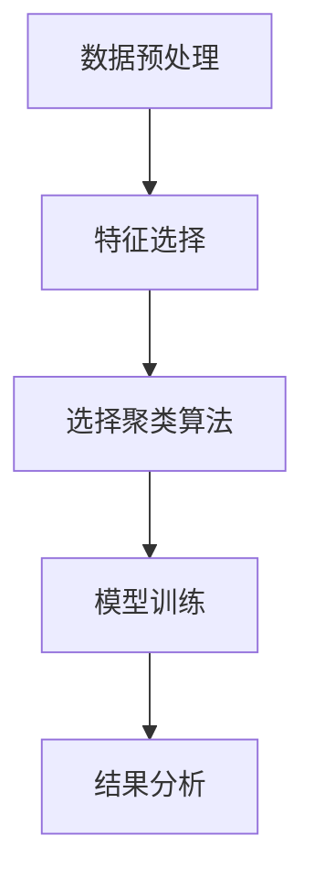
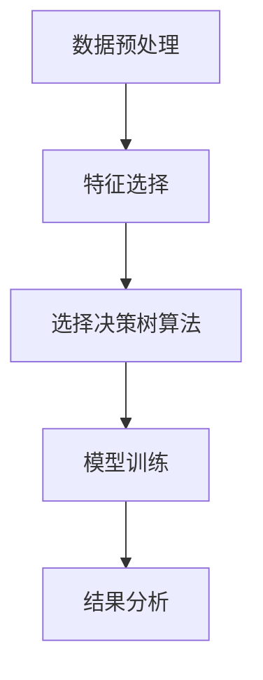
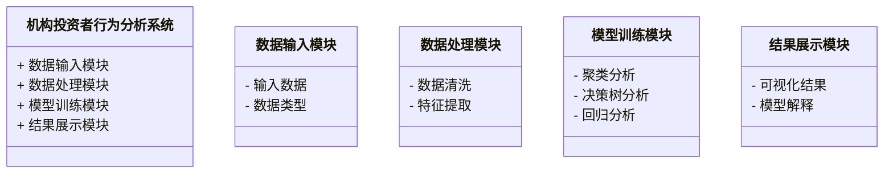
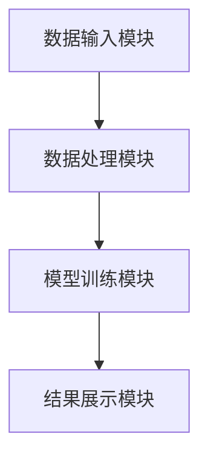
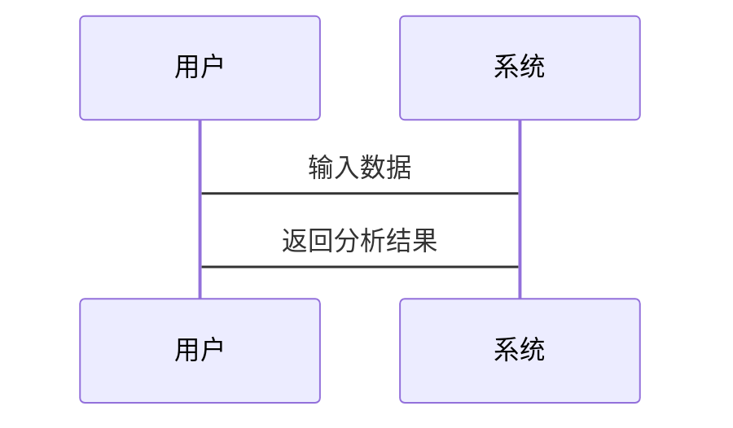

                 


# 特价股票投资中的机构投资者行为分析

> 关键词：特价股票、机构投资者、行为分析、投资策略、市场波动、数据挖掘

> 摘要：本文深入分析了特价股票市场中机构投资者的行为模式及其对市场的影响。通过背景介绍、核心概念、算法原理、数学模型、系统架构和项目实战等多维度的探讨，揭示了机构投资者在特价股票投资中的策略和行为特征，并提供了相应的分析方法和实践案例。

---

# 第一部分: 特价股票与机构投资者行为概述

## 第1章: 特价股票与机构投资者行为概述

### 1.1 特价股票的定义与特点

#### 1.1.1 特价股票的定义
特价股票是指在特定市场条件下，价格被低估或存在较大折扣的股票。这类股票通常属于中小型企业或处于市场周期性低谷的行业，具有较高的增长潜力或价值重估空间。

#### 1.1.2 特价股票的核心特点
- **低估值**：市盈率、市净率等估值指标远低于行业平均水平。
- **高波动性**：价格波动较大，容易受市场情绪影响。
- **潜在高回报**：存在较大的上涨空间，吸引投资者关注。

#### 1.1.3 特价股票与普通股票的区别
| 特性 | 特价股票 | 普通股票 |
|------|----------|----------|
| 估值 | 通常低估值 | 估值合理或高估 |
| 波动性 | 高波动性 | 波动性适中 |
| 投资门槛 | 较低 | 较高 |
| 风险 | 高风险 | 中低风险 |

### 1.2 机构投资者的定义与特点

#### 1.2.1 机构投资者的定义
机构投资者是指以机构为投资主体，利用专业团队和资金优势进行股票、债券等金融资产投资的投资者。常见的机构投资者包括基金公司、保险公司、证券公司、私募基金等。

#### 1.2.2 机构投资者的核心特点
- **资金规模大**：通常管理资金规模较大，具备较强的市场影响力。
- **专业性高**：拥有专业的投研团队，能够进行深入的市场分析和个股研究。
- **投资策略多元化**：采用多种投资策略，如价值投资、趋势投资等。

#### 1.2.3 机构投资者与个人投资者的区别
| 特性 | 机构投资者 | 个人投资者 |
|------|------------|------------|
| 资金规模 | 大额资金 | 小额资金 |
| 投资期限 | 长期为主 | 短期为主 |
| 风险承受能力 | 较强 | 较弱 |
| 分析能力 | 强 | 弱 |

### 1.3 特价股票与机构投资者行为的关系

#### 1.3.1 特价股票市场中的机构投资者行为
- 机构投资者通常会通过基本面分析寻找低估的特价股票。
- 在市场下跌周期，机构投资者可能大量买入特价股票，寻求长期收益。

#### 1.3.2 机构投资者对特价股票市场的影响
- 机构投资者的买入行为通常会带动市场情绪，推动股价上涨。
- 机构投资者的卖出行为可能导致市场恐慌，加剧股价下跌。

#### 1.3.3 特价股票投资中的机构投资者策略
- **价值发现策略**：通过深入研究发现被低估的特价股票。
- **市场套利策略**：利用市场短期波动进行套利。
- **长期持有策略**：投资于具有长期增长潜力的特价股票。

### 1.4 本章小结
本章从特价股票和机构投资者的基本概念出发，分析了两者的特点及其关系，为后续的深入分析奠定了基础。

---

# 第二部分: 机构投资者行为分析的核心概念与联系

## 第2章: 机构投资者行为的核心概念

### 2.1 机构投资者行为的定义与分类

#### 2.1.1 机构投资者行为的定义
机构投资者行为是指机构投资者在股票市场中的投资决策和交易行为，包括选股、交易时机、仓位调整等。

#### 2.1.2 机构投资者行为的分类
- **主动型行为**：积极选股、频繁交易。
- **被动型行为**：指数化投资，跟踪市场表现。

#### 2.1.3 不同类型机构投资者行为的对比
| 类型 | 主动型 | 被动型 |
|------|--------|--------|
| 投资策略 | 积极选股 | 指数化投资 |
| 交易频率 | 高 | 低 |
| 风险承受 | 高 | 中 |

### 2.2 特价股票市场中的机构投资者行为特征

#### 2.2.1 特价股票市场中的机构投资者行为特征
- **集中度高**：机构投资者倾向于集中投资于少数具有潜力的特价股票。
- **敏感性强**：对市场信息反应迅速，容易受市场情绪影响。

#### 2.2.2 机构投资者行为与市场波动的关系
机构投资者的大量买入或卖出行为会导致市场波动加剧，尤其是在市场不确定性较高的情况下。

#### 2.2.3 机构投资者行为与股票价格的关系
机构投资者的交易行为直接影响股票价格，尤其是在短期内。

### 2.3 机构投资者行为的分析方法

#### 2.3.1 定量分析方法
- **数据挖掘**：通过大数据分析机构投资者的交易行为。
- **统计建模**：利用回归分析等方法预测机构投资者的行为。

#### 2.3.2 定性分析方法
- **案例分析**：通过具体案例分析机构投资者的行为模式。
- **专家访谈**：通过与机构投资者的交流了解其投资策略。

#### 2.3.3 综合分析方法
结合定量和定性分析方法，全面评估机构投资者的行为。

### 2.4 本章小结
本章分析了机构投资者行为的核心概念及其在特价股票市场中的特征，为后续的分析提供了理论基础。

---

# 第三部分: 机构投资者行为分析的算法原理

## 第3章: 机构投资者行为分析的算法原理

### 3.1 聚类分析

#### 3.1.1 聚类分析的定义
聚类分析是一种无监督学习方法，用于将数据点分成若干组，每组内的数据点具有相似性。

#### 3.1.2 聚类分析在机构投资者行为分析中的应用
- **识别投资者类型**：通过聚类分析将机构投资者分为不同类型。
- **预测投资行为**：基于聚类结果预测投资者的未来行为。

#### 3.1.3 聚类分析的实现步骤
1. **数据预处理**：清洗数据，处理缺失值。
2. **特征选择**：选择影响投资者行为的关键特征。
3. **选择聚类算法**：如K-means、层次聚类等。
4. **模型训练**：训练聚类模型。
5. **结果分析**：分析聚类结果，解释其含义。

#### 3.1.4 聚类分析的代码实现
```python
from sklearn.cluster import KMeans
from sklearn.preprocessing import StandardScaler
import pandas as pd

# 数据预处理
data = pd.read_csv('institutional_trading.csv')
features = data[['volume', 'price_change', 'market_cap']]
scaler = StandardScaler()
scaled_features = scaler.fit_transform(features)

# 选择聚类算法
model = KMeans(n_clusters=3, random_state=42)
model.fit(scaled_features)

# 预测聚类结果
labels = model.predict(scaled_features)
print(labels)
```

#### 3.1.5 聚类分析的流程图


### 3.2 决策树分析

#### 3.2.1 决策树分析的定义
决策树是一种基于树状结构的分类方法，用于预测数据的分类或回归。

#### 3.2.2 决策树分析在机构投资者行为分析中的应用
- **预测投资行为**：基于历史数据预测机构投资者的未来行为。
- **识别关键特征**：通过决策树分析确定影响投资者行为的关键特征。

#### 3.2.3 决策树分析的实现步骤
1. **数据预处理**：清洗数据，处理缺失值。
2. **特征选择**：选择影响投资者行为的关键特征。
3. **选择决策树算法**：如ID3、C4.5、CART等。
4. **模型训练**：训练决策树模型。
5. **结果分析**：分析决策树结构，解释其含义。

#### 3.2.4 决策树分析的代码实现
```python
from sklearn.tree import DecisionTreeClassifier
from sklearn.model_selection import train_test_split
import pandas as pd

# 数据预处理
data = pd.read_csv('institutional_trading.csv')
features = data[['volume', 'price_change', 'market_cap']]
target = data['behavior']

# 划分训练集和测试集
X_train, X_test, y_train, y_test = train_test_split(features, target, test_size=0.2, random_state=42)

# 选择决策树算法
model = DecisionTreeClassifier(random_state=42)
model.fit(X_train, y_train)

# 预测结果
y_pred = model.predict(X_test)
print(y_pred)
```

#### 3.2.5 决策树分析的流程图


### 3.3 本章小结
本章详细介绍了聚类分析和决策树分析在机构投资者行为分析中的应用，通过代码和流程图展示了算法的实现步骤。

---

# 第四部分: 数学模型和公式

## 第4章: 数学模型和公式

### 4.1 机构投资者行为预测模型

#### 4.1.1 多元回归分析
多元回归分析是一种统计方法，用于预测一个因变量与多个自变量之间的关系。

#### 4.1.2 回归模型的数学公式
$$ y = \beta_0 + \beta_1x_1 + \beta_2x_2 + \cdots + \beta_nx_n + \epsilon $$

其中：
- \( y \) 是因变量（机构投资者行为）。
- \( x_i \) 是自变量（如交易量、价格变化等）。
- \( \beta_i \) 是回归系数。
- \( \epsilon \) 是误差项。

#### 4.1.3 回归模型的实现步骤
1. **数据预处理**：清洗数据，处理缺失值。
2. **特征选择**：选择影响投资者行为的关键特征。
3. **模型训练**：训练多元回归模型。
4. **模型评估**：评估模型的拟合优度和预测能力。

#### 4.1.4 回归模型的代码实现
```python
import statsmodels.api as sm

# 数据预处理
data = pd.read_csv('institutional_trading.csv')
features = data[['volume', 'price_change', 'market_cap']]
target = data['behavior']

# 添加截距项
X = sm.add_constant(features)

# 训练模型
model = sm.OLS(target, X)
result = model.fit()

# 输出结果
print(result.summary())
```

### 4.2 本章小结
本章通过多元回归分析构建了机构投资者行为预测模型，展示了数学模型在行为分析中的应用。

---

# 第五部分: 系统分析与架构设计

## 第5章: 系统分析与架构设计

### 5.1 问题场景介绍
本系统旨在通过分析机构投资者的行为数据，预测其在特价股票市场中的投资行为，帮助投资者做出更明智的投资决策。

### 5.2 系统功能设计

#### 5.2.1 领域模型


### 5.3 系统架构设计

#### 5.3.1 系统架构图


### 5.4 系统接口设计
- **输入接口**：接收机构投资者的行为数据。
- **输出接口**：输出分析结果，包括聚类结果、决策树结构和回归模型的预测结果。

### 5.5 系统交互流程

#### 5.5.1 系统交互序列图


### 5.6 本章小结
本章通过系统分析和架构设计，展示了如何将机构投资者行为分析应用于实际系统中。

---

# 第六部分: 项目实战

## 第6章: 项目实战

### 6.1 环境安装

#### 6.1.1 安装Python环境
- 安装Python 3.8及以上版本。
- 安装Jupyter Notebook。

#### 6.1.2 安装依赖库
```bash
pip install numpy pandas scikit-learn statsmodels
```

### 6.2 系统核心实现

#### 6.2.1 数据处理模块
```python
import pandas as pd
from sklearn.preprocessing import StandardScaler

# 数据预处理
data = pd.read_csv('institutional_trading.csv')
features = data[['volume', 'price_change', 'market_cap']]
target = data['behavior']

# 数据标准化
scaler = StandardScaler()
scaled_features = scaler.fit_transform(features)
```

#### 6.2.2 模型训练模块
```python
from sklearn.cluster import KMeans
from sklearn.tree import DecisionTreeClassifier
from sklearn.ensemble import RandomForestClassifier

# 聚类分析
model_cluster = KMeans(n_clusters=3, random_state=42)
model_cluster.fit(scaled_features)

# 决策树分析
model_tree = DecisionTreeClassifier(random_state=42)
model_tree.fit(scaled_features, target)

# 随机森林分析
model_forest = RandomForestClassifier(random_state=42)
model_forest.fit(scaled_features, target)
```

#### 6.2.3 结果展示模块
```python
import matplotlib.pyplot as plt

# 可视化结果
clusters = model_cluster.labels_
plt.scatter(scaled_features[:, 0], scaled_features[:, 1], c=clusters)
plt.title('Cluster Analysis')
plt.show()
```

### 6.3 项目小结
本章通过实际项目实战，展示了如何将机构投资者行为分析应用于实际投资决策中。

---

# 第七部分: 最佳实践

## 第7章: 最佳实践

### 7.1 小结
- 机构投资者行为分析对于理解特价股票市场的波动具有重要意义。
- 通过聚类分析、决策树分析和多元回归分析，可以有效预测机构投资者的行为。

### 7.2 注意事项
- 数据质量和完整性是分析的基础。
- 模型的选择和优化需要结合实际场景。

### 7.3 拓展阅读
- 《机构投资者行为分析》
- 《大数据与金融投资》
- 《算法交易与量化投资》

---

# 作者：AI天才研究院/AI Genius Institute & 禅与计算机程序设计艺术 /Zen And The Art of Computer Programming

---

感谢您的阅读，希望本文对您理解特价股票投资中的机构投资者行为有所帮助！

