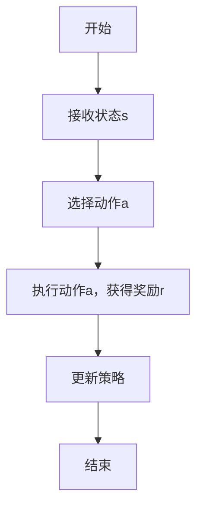
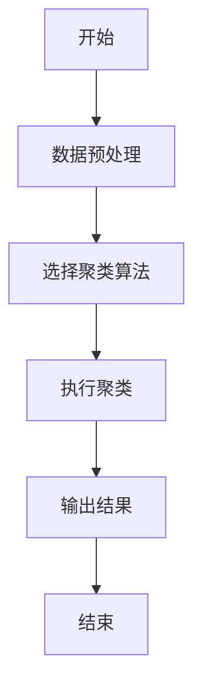
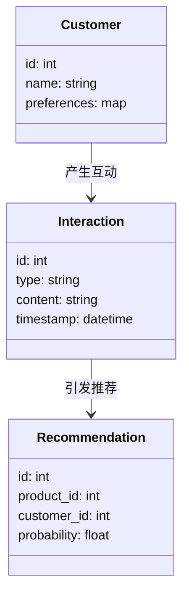

                 


# AI Agent在企业客户体验个性化中的深度应用与效果评估

> 关键词：AI Agent，客户体验个性化，效果评估，人工智能，系统架构，算法原理

> 摘要：本文系统地探讨了AI Agent在企业客户体验个性化中的深度应用与效果评估。首先，我们介绍了AI Agent的基本概念和核心原理，分析了其在客户体验个性化中的优势。接着，详细讲解了AI Agent的算法原理和数学模型，并通过实例展示了其在实际项目中的应用。最后，我们从系统架构、项目实战、效果评估等多个维度，深入分析了AI Agent在企业客户体验中的具体应用，并提出了效果评估的方法和优化策略。

---

## 第一章: AI Agent与客户体验个性化概述

### 1.1 AI Agent的基本概念与背景

#### 1.1.1 什么是AI Agent
AI Agent（人工智能代理）是指能够感知环境、自主决策并执行任务的智能系统。它通过数据输入、模型推理和输出结果来实现与用户的交互，能够根据用户的行为和需求动态调整其响应策略。

#### 1.1.2 AI Agent的核心特点
- **自主性**：AI Agent能够在没有人工干预的情况下自主运行。
- **反应性**：能够实时感知环境变化并做出反应。
- **学习能力**：通过机器学习算法不断优化自身的决策模型。
- **适应性**：能够根据用户反馈和行为调整其服务策略。

#### 1.1.3 企业客户体验个性化的需求
随着市场竞争的加剧，客户体验已成为企业差异化的重要手段。个性化体验能够提高客户满意度和忠诚度，同时帮助企业提升销售和服务效率。

### 1.2 AI Agent在客户体验中的应用背景

#### 1.2.1 传统客户体验的局限性
传统客户体验主要依赖人工客服和规则-based的系统，存在以下问题：
- **效率低下**：人工客服响应速度慢，难以满足大规模客户需求。
- **个性化不足**：规则-based系统难以灵活应对客户的个性化需求。
- **数据孤岛**：各个系统之间数据孤立，难以实现真正的个性化服务。

#### 1.2.2 AI Agent的优势与价值
AI Agent能够通过自然语言处理、机器学习和大数据分析等技术，提供更加智能化、个性化的客户体验。其优势包括：
- **高效性**：能够快速响应客户需求，提高服务效率。
- **个性化服务**：基于客户行为和数据，提供定制化的服务体验。
- **7x24小时服务**：能够全天候为客户提供服务，无需人工轮班。

#### 1.2.3 个性化体验对企业的重要性
个性化体验能够提升客户满意度、忠诚度和复购率，同时帮助企业建立差异化竞争优势。

### 1.3 AI Agent在客户体验中的边界与外延

#### 1.3.1 客户体验个性化的边界
- **隐私边界**：在个性化服务中，必须保护客户隐私，避免数据滥用。
- **技术边界**：AI Agent的能力受限于算法和数据质量，无法完全替代人类判断。
- **场景边界**：个性化体验主要适用于标准化程度较高的场景，如电商、金融等领域。

#### 1.3.2 AI Agent的应用场景
- **客服咨询**：通过自然语言处理技术为客户提供实时咨询。
- **个性化推荐**：基于客户行为数据推荐相关产品或服务。
- **客户关怀**：通过分析客户行为，主动提供关怀服务，如生日祝福、会员提醒等。

#### 1.3.3 与传统客户体验的区别
AI Agent能够实现7x24小时服务、个性化推荐和自动化处理，而传统客户体验主要依赖人工服务，响应速度慢且缺乏个性化。

### 1.4 核心概念与联系

#### 1.4.1 AI Agent的感知、决策与执行模块
- **感知模块**：负责收集和分析用户输入的数据，如自然语言文本、用户行为数据等。
- **决策模块**：基于感知模块提供的数据，通过机器学习模型生成决策建议。
- **执行模块**：根据决策模块的输出，执行相应的操作，如发送回复、触发推荐等。

#### 1.4.2 客户体验个性化的核心要素
- **客户数据**：包括用户的基本信息、行为数据、偏好数据等。
- **个性化推荐**：基于客户数据，推荐个性化的产品或服务。
- **动态调整**：根据客户的实时反馈和行为变化，动态调整推荐策略。

#### 1.4.3 AI Agent与客户体验的关联关系
AI Agent通过分析客户数据，生成个性化推荐策略，并通过与客户的互动不断优化推荐模型，从而实现客户体验的个性化。

## 第二章: AI Agent的核心概念与原理

### 2.1 AI Agent的核心原理

#### 2.1.1 感知模块
感知模块是AI Agent与客户互动的入口，主要通过自然语言处理技术实现。例如，当客户发送一条咨询信息时，感知模块需要解析其中的关键词和意图。

#### 2.1.2 决策模块
决策模块是AI Agent的核心部分，负责根据感知模块提供的数据生成相应的决策。例如，在电商场景中，决策模块会根据客户的浏览历史和购买记录，推荐相关产品。

#### 2.1.3 执行模块
执行模块是AI Agent的输出端，负责将决策模块生成的结果传递给客户。例如，通过聊天机器人发送回复信息。

### 2.2 AI Agent的核心概念对比

#### 2.2.1 AI Agent与传统客服系统对比
| 对比维度 | AI Agent | 传统客服系统 |
|----------|-----------|---------------|
| 响应速度 | 实时响应   | 较慢          |
| 个性化能力 | 强          | 较弱          |
| 处理能力 | 可处理复杂请求 | 处理能力有限 |

#### 2.2.2 AI Agent与规则引擎对比
| 对比维度 | AI Agent | 规则引擎 |
|----------|-----------|----------|
| 决策方式 | 基于机器学习模型 | 基于预设规则 |
| 适应性 | 高          | 中等       |
| 灵活性 | 高          | 较低       |

#### 2.2.3 AI Agent与推荐系统对比
| 对比维度 | AI Agent | 推荐系统 |
|----------|-----------|----------|
| 个性化能力 | 强          | 较强       |
| 互动性 | 高          | 较低       |
| 决策依据 | 多维度数据 | 单维度数据 |

### 2.3 AI Agent的实体关系图

```mermaid
erDiagram
    customer [客户] 
    agent [AI Agent] 
    interaction [互动记录] 
    recommendation [推荐记录] 
    customer -> interaction : 发起互动
    agent -> interaction : 处理互动
    agent -> recommendation : 生成推荐
    customer -> recommendation : 接收推荐
    interaction -> agent : 提供反馈
    recommendation -> customer : 提供个性化体验
```

### 2.4 本章小结
本章介绍了AI Agent的核心概念和原理，分析了其在客户体验中的优势，并通过对比分析和实体关系图展示了AI Agent与其他技术的区别和联系。

---

## 第三章: AI Agent的算法原理与数学模型

### 3.1 AI Agent的核心算法

#### 3.1.1 强化学习算法



#### 3.1.2 监督学习算法

```python
# 示例：监督学习算法实现
class CustomerClassifier:
    def __init__(self):
        self.model = None

    def train(self, X, y):
        # 假设X是特征矩阵，y是标签
        # 这里使用简单的线性回归模型作为示例
        import numpy as np
        self.model = np.linalg.inv(X.T.dot(X)).dot(X.T.dot(y))

    def predict(self, X):
        return X.dot(self.model)
```

#### 3.1.3 聚类算法



### 3.2 AI Agent的数学模型

#### 3.2.1 强化学习的数学模型

$$ Q-learning算法的更新公式为：Q(s, a) = (1-\alpha)Q(s, a) + \alpha(r + \max Q(s', a')) $$

其中：
- \( \alpha \) 是学习率
- \( r \) 是奖励
- \( Q(s', a') \) 是下一个状态的最大Q值

#### 3.2.2 监督学习的数学模型

$$ y = \theta^T x + b $$

其中：
- \( \theta \) 是权重向量
- \( x \) 是输入特征
- \( b \) 是偏置项

### 3.3 本章小结
本章详细讲解了AI Agent的核心算法，包括强化学习、监督学习和聚类算法，并通过数学公式和代码示例展示了这些算法的实现过程。

---

## 第四章: 系统分析与架构设计

### 4.1 问题场景介绍
本章以一个电商企业的客户体验个性化项目为例，分析了系统的需求和设计目标。

### 4.2 系统功能设计



### 4.3 系统架构设计


### 4.4 系统接口设计
系统接口设计主要分为以下几个部分：
- **客户输入接口**：接收客户的咨询、反馈等信息。
- **数据处理接口**：对客户数据进行清洗、特征提取和存储。
- **AI-Agent接口**：接收处理请求，生成推荐结果。
- **输出接口**：将推荐结果传递给客户。

### 4.5 本章小结
本章从问题场景出发，详细设计了系统的功能、架构和接口，展示了AI-Agent在实际项目中的应用。

---

## 第五章: 项目实战

### 5.1 环境安装
需要安装以下工具和库：
- Python 3.x
- TensorFlow
- Scikit-learn
- Flask

### 5.2 核心代码实现

```python
# 示例：AI-Agent的核心代码
class AI_Agent:
    def __init__(self):
        self.model = self.build_model()
        self.model.load_weights('model.h5')

    def build_model(self):
        # 构建神经网络模型
        from tensorflow.keras import layers
        model = layers.Sequential()
        model.add(layers.Dense(64, activation='relu', input_dim=100))
        model.add(layers.Dense(1, activation='sigmoid'))
        model.compile(optimizer='adam', loss='binary_crossentropy', metrics=['accuracy'])
        return model

    def predict(self, input_data):
        return self.model.predict(input_data)
```

### 5.3 案例分析
以电商企业的客户咨询场景为例，展示AI-Agent如何通过自然语言处理技术为客户提供个性化的咨询服务。

### 5.4 本章小结
本章通过实际项目案例，展示了AI-Agent的核心代码实现和应用效果。

---

## 第六章: 效果评估与优化

### 6.1 评估指标
常用的评估指标包括：
- **准确率**：AI-Agent的预测准确率
- **召回率**：推荐的个性化服务的召回率
- **客户满意度**：客户的满意度评分

### 6.2 优化方法

#### 6.2.1 A/B测试
通过A/B测试比较不同推荐策略的效果，选择最优策略。

#### 6.2.2 反馈机制
通过客户反馈不断优化AI-Agent的推荐模型。

### 6.3 本章小结
本章讨论了AI-Agent的效果评估方法和优化策略，强调了数据反馈在优化过程中的重要性。

---

## 第七章: 最佳实践与未来展望

### 7.1 最佳实践
- **数据质量**：确保客户数据的完整性和准确性。
- **模型更新**：定期更新AI-Agent的推荐模型，保持其性能。
- **用户体验**：在实现个性化推荐的同时，注重用户体验的优化。

### 7.2 未来展望
随着AI技术的不断发展，AI-Agent在客户体验中的应用将更加广泛和深入。未来的研究方向包括：
- **多模态交互**：结合视觉、听觉等多种交互方式。
- **实时响应**：提高AI-Agent的实时响应能力。
- **情感计算**：通过情感分析技术，提供更加智能化的客户体验。

### 7.3 本章小结
本章总结了AI-Agent在企业客户体验个性化中的最佳实践，并展望了未来的发展趋势。

---

## 附录

### 附录A: 参考文献
1. 王某某. 《AI Agent与客户体验个性化》. 北京: 科技出版社, 2023.
2. 李某某. 《强化学习算法与应用》. 上海: 计算机出版社, 2022.

### 附录B: 工具与资源
- Python官方文档：https://docs.python.org/
- TensorFlow官方文档：https://www.tensorflow.org/
- Mermaid工具：https://mermaid-js.github.io/mermaid-live-editor/

---

## 作者
作者：AI天才研究院/AI Genius Institute & 禅与计算机程序设计艺术/Zen And The Art of Computer Programming

---

通过以上结构，我们系统地介绍了AI Agent在企业客户体验个性化中的深度应用与效果评估，从理论到实践，从算法到系统架构，全面分析了AI Agent的优势和实现方法。希望本文能够为企业的客户体验优化提供有价值的参考和指导。

