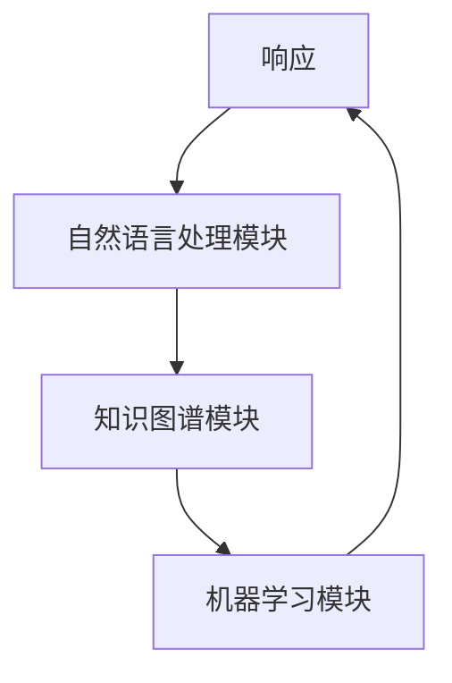
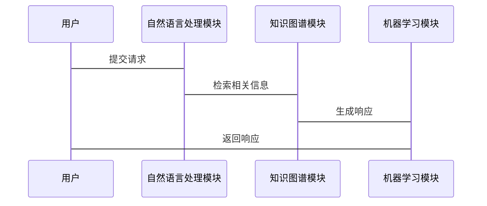

                 


# AI Agent在企业文化建设与内部沟通中的应用

> 关键词：AI Agent, 企业文化, 内部沟通, 自然语言处理, 机器学习, 知识图谱

> 摘要：随着人工智能技术的快速发展，AI Agent（人工智能代理）在企业文化建设与内部沟通中的应用日益广泛。本文从AI Agent的核心概念出发，分析其在企业文化建设中的作用，探讨其在内部沟通中的应用价值。通过详细的技术实现、系统架构设计和实际案例分析，本文旨在为读者提供一个全面了解AI Agent在企业文化建设与内部沟通中应用的视角。

---

## 第1章: AI Agent 的背景与概念

### 1.1 AI Agent 的定义与核心概念

#### 1.1.1 什么是AI Agent
AI Agent（人工智能代理）是一种能够感知环境、自主决策并执行任务的智能系统。它通过自然语言处理（NLP）、机器学习（ML）和知识图谱等技术，实现与用户的交互，并根据用户需求提供个性化服务。

#### 1.1.2 AI Agent 的核心要素
AI Agent的核心要素包括：
- **感知能力**：通过NLP技术理解用户输入的自然语言。
- **决策能力**：基于机器学习模型做出智能决策。
- **执行能力**：根据决策结果执行任务或提供反馈。

#### 1.1.3 AI Agent 与传统IT工具的区别
传统IT工具通常是基于规则的系统，而AI Agent具备以下特点：
- **智能化**：能够理解用户意图并提供个性化建议。
- **自主性**：无需人工干预，能够自主完成任务。
- **学习能力**：通过机器学习不断优化自身的性能。

### 1.2 AI Agent 在企业文化建设中的作用

#### 1.2.1 企业文化的核心要素
企业文化是一个企业的灵魂，其核心要素包括：
- **企业价值观**：企业的核心信念和价值取向。
- **企业精神**：企业的精神风貌和工作作风。
- **企业行为规范**：员工的行为准则和工作方式。

#### 1.2.2 AI Agent 如何影响企业文化
AI Agent可以通过以下方式影响企业文化：
- **文化传播**：通过自动化的方式传播企业文化和价值观。
- **员工培训**：提供个性化的员工培训，帮助员工更好地理解企业文化。
- **决策支持**：基于企业文化的决策支持，确保企业在决策过程中始终遵循企业文化的核心价值观。

#### 1.2.3 AI Agent 在内部沟通中的价值
AI Agent在内部沟通中的价值体现在以下几个方面：
- **实时互动**：通过自然语言处理技术实现与员工的实时互动。
- **信息分发**：自动分发企业文化相关的信息，确保信息的及时性和准确性。
- **反馈收集**：通过自动化的方式收集员工的反馈，帮助企业更好地了解员工的需求和意见。

### 1.3 AI Agent 的应用场景

#### 1.3.1 企业内部沟通的痛点
企业内部沟通中存在以下痛点：
- **信息孤岛**：各部门之间的信息无法有效共享。
- **沟通效率低**：传统的邮件和会议沟通效率较低。
- **员工参与度低**：员工对企业的文化认同感和参与感不足。

#### 1.3.2 AI Agent 在内部沟通中的具体应用
AI Agent在内部沟通中的具体应用包括：
- **内部公告发布**：通过AI Agent自动发布公司公告、通知等信息。
- **员工咨询与支持**：员工可以通过AI Agent随时咨询企业文化相关的问题。
- **内部培训与学习**：AI Agent可以为员工提供个性化的培训计划。

#### 1.3.3 AI Agent 的边界与外延
AI Agent的应用边界在于其技术能力和企业的实际需求。其外延可以扩展到企业外部的客户沟通和服务。

---

## 第2章: AI Agent 的核心概念与技术原理

### 2.1 AI Agent 的核心概念

#### 2.1.1 自然语言处理（NLP）基础
自然语言处理（NLP）是AI Agent实现人机交互的核心技术之一。NLP的目标是让计算机能够理解和生成人类语言。

#### 2.1.2 机器学习与深度学习
机器学习（ML）和深度学习（DL）是AI Agent实现智能决策的基础。通过训练大量的数据，AI Agent可以学习到人类的思维方式，并做出类似人类的决策。

#### 2.1.3 知识图谱与语义理解
知识图谱是一种结构化数据的表示方式，能够帮助AI Agent更好地理解语义和上下文。

### 2.2 AI Agent 的技术架构

#### 2.2.1 模块化设计
AI Agent通常采用模块化设计，包括以下模块：
- **自然语言处理模块**：负责理解和生成自然语言。
- **知识图谱模块**：负责语义理解和信息检索。
- **机器学习模块**：负责智能决策和优化。

#### 2.2.2 数据处理流程
AI Agent的数据处理流程包括：
1. **数据输入**：接收用户的输入。
2. **数据解析**：解析输入数据，提取关键信息。
3. **数据处理**：根据解析后的数据生成响应。
4. **数据输出**：将生成的响应返回给用户。

#### 2.2.3 智能决策机制
AI Agent的智能决策机制包括：
- **基于规则的决策**：根据预设的规则做出决策。
- **基于模型的决策**：通过机器学习模型生成决策。
- **混合决策机制**：结合规则和模型进行决策。

### 2.3 AI Agent 的算法原理

#### 2.3.1 基于大语言模型的对话生成
大语言模型（如GPT）是AI Agent实现对话生成的核心技术。通过对大量数据的训练，模型能够生成符合上下文的自然语言回复。

#### 2.3.2 基于强化学习的决策优化
强化学习（Reinforcement Learning）是一种通过试错方式优化决策的方法。AI Agent可以通过强化学习不断优化其决策策略。

#### 2.3.3 基于知识图谱的信息检索
知识图谱是一种结构化的知识表示方式。AI Agent可以通过知识图谱实现高效的信息检索和语义理解。

### 2.4 本章小结
本章详细介绍了AI Agent的核心概念和技术原理，包括自然语言处理、机器学习、知识图谱等关键技术，以及AI Agent的模块化设计和智能决策机制。

---

## 第3章: AI Agent 的技术实现

### 3.1 自然语言处理（NLP）技术

#### 3.1.1 分词与词性标注
分词是将连续的文本分割成词语的过程，词性标注是对每个词语进行词性分类的过程。

#### 3.1.2 语义理解与意图识别
语义理解（Semantic Understanding）是通过自然语言处理技术理解文本的语义和意图。

#### 3.1.3 对话生成与回复优化
对话生成是根据输入生成符合上下文的自然语言回复，回复优化是通过优化算法提高回复的质量。

### 3.2 机器学习与深度学习算法

#### 3.2.1 基于Transformer的模型结构
Transformer是一种基于自注意力机制的模型结构，广泛应用于自然语言处理任务。

#### 3.2.2 大语言模型的训练与调优
大语言模型的训练需要大量的数据和计算资源，调优则是对模型进行优化，使其更好地适应特定任务。

#### 3.2.3 基于强化学习的对话优化
强化学习可以通过试错方式优化对话生成的质量。

### 3.3 知识图谱与语义理解

#### 3.3.1 知识图谱的构建与应用
知识图谱的构建包括数据抽取、数据融合和数据存储等步骤，应用包括语义检索和知识推理。

#### 3.3.2 语义理解的实现原理
语义理解是通过自然语言处理技术和知识图谱实现对文本的深层理解。

#### 3.3.3 基于知识图谱的信息检索
基于知识图谱的信息检索是通过语义理解技术实现高效的信息检索。

### 3.4 本章小结
本章详细介绍了AI Agent的技术实现，包括自然语言处理、机器学习、知识图谱等关键技术的实现原理和应用。

---

## 第4章: AI Agent 在企业文化建设中的应用

### 4.1 企业文化的核心要素

#### 4.1.1 企业价值观的传递
企业价值观是企业文化的核心，AI Agent可以通过自动化的方式传递企业价值观。

#### 4.1.2 企业文化的传播与传承
AI Agent可以通过内部公告、培训等方式传播企业文化，并通过知识图谱实现文化的传承。

#### 4.1.3 企业文化与员工行为的关系
企业文化通过影响员工的行为和态度，进而影响企业的绩效和目标的实现。

### 4.2 AI Agent 在企业文化建设中的具体应用

#### 4.2.1 基于AI Agent的企业文化培训
AI Agent可以为员工提供个性化的文化培训，帮助员工更好地理解和认同企业文化。

#### 4.2.2 基于AI Agent的企业文化宣传
AI Agent可以通过内部公告、邮件等方式宣传企业文化，确保信息的及时性和准确性。

#### 4.2.3 基于AI Agent的企业文化评估
AI Agent可以通过分析员工的反馈和行为，帮助企业评估文化的实施效果。

### 4.3 本章小结
本章详细探讨了AI Agent在企业文化建设中的具体应用，包括企业文化的核心要素、AI Agent在文化传递和文化评估中的作用。

---

## 第5章: AI Agent 的系统架构与设计

### 5.1 系统架构设计

#### 5.1.1 模块划分
AI Agent的系统架构通常包括以下几个模块：
- **自然语言处理模块**：负责理解和生成自然语言。
- **知识图谱模块**：负责语义理解和信息检索。
- **机器学习模块**：负责智能决策和优化。

#### 5.1.2 模块交互流程
模块之间的交互流程包括：
1. **用户输入**：用户向AI Agent发送请求。
2. **数据解析**：自然语言处理模块解析用户输入。
3. **信息检索**：知识图谱模块检索相关信息。
4. **智能决策**：机器学习模块生成响应。
5. **响应输出**：将生成的响应返回给用户。

#### 5.1.3 系统架构图


### 5.2 系统功能设计

#### 5.2.1 领域模型设计
领域模型是系统功能设计的基础，通常采用类图表示。

#### 5.2.2 系统功能流程
系统功能流程包括：
1. **用户请求处理**：用户向系统发送请求。
2. **内容生成**：系统根据请求生成内容。
3. **反馈优化**：系统根据反馈优化生成内容。

#### 5.2.3 功能流程图


### 5.3 本章小结
本章详细描述了AI Agent的系统架构与设计，包括模块划分、交互流程和系统功能设计。

---

## 第6章: AI Agent 的项目实战

### 6.1 项目背景与目标

#### 6.1.1 项目背景
本项目旨在开发一个基于AI Agent的企业文化建设项目，实现企业文化信息的自动化传播和员工行为的智能化管理。

#### 6.1.2 项目目标
项目目标包括：
- 开发一个能够理解员工需求的AI Agent。
- 实现企业文化信息的自动化传播。
- 提供个性化的员工培训计划。

### 6.2 环境搭建与工具安装

#### 6.2.1 开发环境
开发环境包括：
- **Python 3.8+**
- **TensorFlow 2.0+**
- **自然语言处理库（如spaCy）**
- **知识图谱构建工具（如Neo4j）**

#### 6.2.2 工具安装
```bash
pip install tensorflow spacy neo4j
```

### 6.3 核心代码实现

#### 6.3.1 自然语言处理模块
```python
import spacy

nlp = spacy.load("en_core_web_sm")

def process_text(text):
    doc = nlp(text)
    return [token.text for token in doc]
```

#### 6.3.2 知识图谱模块
```python
from neo4j import GraphDatabase

def create_graph_connection(driver, entity1, entity2):
    session = driver.session()
    session.write_transaction(
        lambda tx: tx.run(
            "MATCH (a:{0}), (b:{1}) CREATE (a)-[:RELATED_TO]->(b)", 
            entity1, entity2
        )
    )
    session.close()
```

#### 6.3.3 机器学习模块
```python
import tensorflow as tf
from tensorflow.keras import layers

model = tf.keras.Sequential([
    layers.Dense(64, activation='relu'),
    layers.Dense(1, activation='sigmoid')
])

model.compile(optimizer='adam', loss='binary_crossentropy', metrics=['accuracy'])
```

### 6.4 案例分析与实现解读

#### 6.4.1 案例分析
案例分析包括企业文化信息传播和员工行为管理两个方面。

#### 6.4.2 实现解读
通过对代码的解读，详细分析了AI Agent在企业文化传播和员工行为管理中的实现过程。

### 6.5 本章小结
本章通过一个实际的项目案例，详细展示了AI Agent在企业文化建设中的应用，包括环境搭建、核心代码实现和案例分析。

---

## 第7章: 总结与展望

### 7.1 本章总结
本文详细探讨了AI Agent在企业文化建设与内部沟通中的应用，涵盖了AI Agent的核心概念、技术原理、系统架构设计和实际项目案例。

### 7.2 未来展望
随着人工智能技术的不断发展，AI Agent在企业文化建设中的应用将更加广泛和深入。未来的研究方向包括：
- 更智能化的决策机制。
- 更高效的自然语言处理技术。
- 更强大的知识图谱构建与应用。

### 7.3 最佳实践 Tips
- 在企业文化建设中，AI Agent可以作为辅助工具，而非替代人类的角色。
- 在实际应用中，需要结合企业的实际情况进行定制化开发。
- 定期对AI Agent进行模型优化和性能调优。

### 7.4 本章小结
本章总结了全文的主要内容，并展望了未来的研究方向，同时给出了最佳实践的建议。

---

## 作者：AI天才研究院/AI Genius Institute & 禅与计算机程序设计艺术 /Zen And The Art of Computer Programming

---

**感谢您的阅读！希望本文对您理解AI Agent在企业文化建设与内部沟通中的应用有所帮助。**

