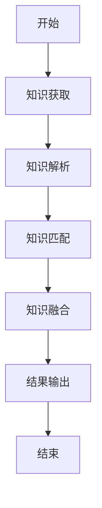
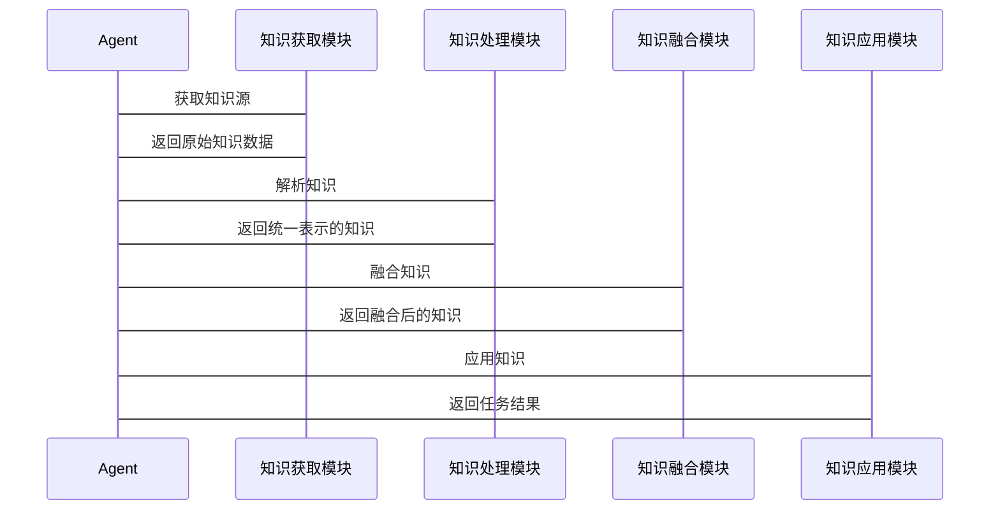

                 


# AI Agent的多源知识融合学习技术

> 关键词：AI Agent, 多源知识融合, 知识图谱, 知识表示, 知识融合算法

> 摘要：本文深入探讨了AI Agent在多源知识融合学习中的技术原理与实现方法，重点分析了知识表示、知识匹配、知识融合的核心算法及其在实际应用中的表现。文章结合实际案例，详细讲解了多源知识融合的系统架构设计、算法实现和项目实战，为AI Agent的知识融合技术提供了系统的理论支持和实践指导。

---

# 第一部分: 多源知识融合学习的背景与问题

## 第1章: 多源知识融合学习的背景

### 1.1 问题背景

#### 1.1.1 当前AI Agent面临的知识获取挑战
AI Agent在智能决策过程中需要依赖多源知识进行推理和学习，但由于知识来源的多样性、异构性和冗余性，如何高效地整合这些知识成为一个关键问题。传统单一知识源的获取方式已经无法满足复杂场景下的决策需求。

#### 1.1.2 多源知识融合的必要性
多源知识融合技术能够将来自不同数据源、不同形式的知识进行整合，从而提升AI Agent的知识覆盖度和准确性。这种技术在自然语言处理、智能推荐、知识图谱构建等领域具有重要的应用价值。

#### 1.1.3 知识融合学习的核心目标
通过多源知识融合，AI Agent能够从多个数据源中提取、解析、匹配和整合知识，形成统一的知识表示，从而支持更智能的决策和推理。

### 1.2 问题描述

#### 1.2.1 多源知识的定义与特点
多源知识指的是来自不同来源、具有不同形式和语义的知识。其特点包括：
- **异构性**：知识的形式多样，可能包括文本、结构化数据、图像等。
- **冗余性**：同一事实可能在多个源中出现，但表达方式不同。
- **不一致性**：不同源的知识可能存在冲突或不一致。

#### 1.2.2 知识融合的主要问题
在多源知识融合过程中，主要面临以下问题：
- **知识表示的多样性**：如何将不同形式的知识统一表示。
- **知识匹配的准确性**：如何在异构知识之间建立准确的关联。
- **融合后的知识完整性与一致性**：如何保证融合后的知识既完整又一致。

#### 1.2.3 AI Agent在知识融合中的角色
AI Agent在多源知识融合过程中扮演着关键角色，既是知识的获取者、解析者，也是融合的执行者和结果的应用者。

### 1.3 问题解决

#### 1.3.1 多源知识融合的基本方法
多源知识融合的基本方法包括：
- **基于规则的融合**：通过预定义的规则进行知识匹配和整合。
- **基于语义的融合**：利用语义理解技术进行知识的自动匹配和融合。
- **基于学习的融合**：通过机器学习模型自动学习知识融合的策略。

#### 1.3.2 AI Agent的知识整合能力
AI Agent的知识整合能力体现在以下几个方面：
- **多模态知识处理**：能够处理文本、图像等多种形式的知识。
- **动态知识更新**：能够实时更新知识库，保持知识的时效性。
- **自适应融合策略**：能够根据场景需求动态调整知识融合的策略。

#### 1.3.3 知识融合的实现路径
知识融合的实现路径包括：
1. 知识表示：将多源知识转换为统一的表示形式。
2. 知识匹配：在不同源之间建立关联。
3. 知识整合：将匹配后的知识进行融合，形成一致的知识表示。
4. 知识应用：将融合后的知识应用于具体的任务中。

### 1.4 边界与外延

#### 1.4.1 多源知识融合的边界条件
多源知识融合的边界条件包括：
- 知识源的数量和类型。
- 知识融合的粒度（宏观或微观）。
- 知识融合的目标（准确性、完整性、一致性）。

#### 1.4.2 知识融合与其他技术的关系
知识融合与知识表示、知识抽取、知识推理等技术密切相关，是实现智能系统的核心技术之一。

#### 1.4.3 AI Agent能力的扩展性
AI Agent的知识融合能力可以扩展到更广泛的应用场景，例如智能问答、智能客服、智能推荐等。

### 1.5 核心概念结构

#### 1.5.1 知识融合的核心要素
知识融合的核心要素包括：
- **知识源**：知识的来源，可以是文本、数据库、知识图谱等。
- **知识表示**：知识的表达形式，可以是符号、语义向量等。
- **融合规则**：知识匹配和整合的规则或模型。

#### 1.5.2 AI Agent的知识处理流程
AI Agent的知识处理流程包括：
1. 知识获取：从多个源获取原始知识。
2. 知识解析：将知识转换为统一的表示形式。
3. 知识匹配：在不同源之间建立关联。
4. 知识融合：将匹配后的知识进行整合。
5. 知识应用：将融合后的知识应用于具体任务。

#### 1.5.3 多源知识融合的系统架构
多源知识融合的系统架构包括：
- **知识获取层**：负责从多个源获取知识。
- **知识处理层**：负责知识的解析和匹配。
- **知识融合层**：负责知识的整合和优化。
- **知识应用层**：负责将融合后的知识应用于具体任务。

---

## 第2章: 多源知识融合的核心概念与联系

### 2.1 核心概念原理

#### 2.1.1 知识表示与表达
知识表示是多源知识融合的基础。常见的知识表示方法包括：
- **符号表示**：使用符号（如概念、实体）表示知识。
- **语义向量表示**：使用向量空间模型（如Word2Vec、BERT）表示知识的语义。

#### 2.1.2 知识融合的基本原理
知识融合的基本原理包括：
1. 知识匹配：通过语义相似度、实体对齐等技术，在不同源之间建立关联。
2. 知识整合：将匹配后的知识进行融合，消除冲突，形成一致的知识表示。

#### 2.1.3 AI Agent的知识整合机制
AI Agent的知识整合机制包括：
- **基于规则的整合**：通过预定义的规则进行知识的合并。
- **基于学习的整合**：通过机器学习模型自动学习知识的融合策略。

### 2.2 概念属性特征对比表

| 概念         | 属性             | 特征                                   |
|--------------|------------------|--------------------------------------|
| 知识源       | 多样性           | 文本、结构化数据、图像等多种形式       |
| 知识表示     | 统一性           | 符号、向量等统一的表示形式             |
| 知识融合     | 一致性           | 融合后的知识保持一致性和完整性         |
| AI Agent     | 自适应性         | 能够根据场景动态调整知识融合策略       |

### 2.3 ER实体关系图

```mermaid
er
    actor(Agent)
    actor(知识源)
    actor(知识库)
    actor(融合规则)
    actor(结果输出)
    Agent <-- 关联 --> 知识源
    Agent <-- 关联 --> 知识库
    Agent <-- 关联 --> 融合规则
    Agent <-- 关联 --> 结果输出
```

---

## 第3章: 多源知识融合学习的算法原理

### 3.1 算法原理概述

#### 3.1.1 知识融合的基本流程
知识融合的基本流程包括：
1. 知识获取：从多个源获取原始知识。
2. 知识解析：将知识转换为统一的表示形式。
3. 知识匹配：在不同源之间建立关联。
4. 知识融合：将匹配后的知识进行整合。
5. 知识优化：消除冲突，优化知识的质量。

### 3.2 算法流程图



### 3.3 算法实现代码

#### 3.3.1 知识匹配算法

```python
def compute_similarity(source1, source2):
    # 计算两个知识源的相似度
    similarity = 0.8  # 示例值
    return similarity

# 示例：匹配两个知识源
source1 = "实体A"
source2 = "实体B"
similarity = compute_similarity(source1, source2)
if similarity > 0.7:
    print("匹配成功")
else:
    print("匹配失败")
```

#### 3.3.2 知识融合算法

```python
def knowledge_fusion(agent, sources):
    parsed = []
    for source in sources:
        parsed.append(agent.parse知识(source))
    matched = []
    for i in range(len(parsed)):
        for j in range(i+1, len(parsed)):
            similarity = compute_similarity(parsed[i], parsed[j])
            if similarity > 0.8:
                matched.append((i, j, similarity))
    # 知识融合逻辑
    fused = []
    for i, j, sim in matched:
        # 示例：简单的融合逻辑
        fused.append(parsed[i] + parsed[j])
    return fused

# 示例：调用知识融合函数
agent = AIAgent()
sources = ["知识源1", "知识源2", "知识源3"]
result = knowledge_fusion(agent, sources)
print("融合后的知识：", result)
```

### 3.4 数学模型与公式

#### 3.4.1 知识相似度计算公式
$$ \text{similarity}(x, y) = \frac{x \cdot y}{\|x\| \|y\|} $$

其中，$x$ 和 $y$ 分别是两个知识的向量表示。

#### 3.4.2 知识融合权重分配公式
$$ w_i = \frac{1}{1 + e^{-k \cdot s_i}} $$

其中，$s_i$ 是第 $i$ 个知识源的相似度，$k$ 是调节参数。

---

## 第4章: 系统分析与架构设计

### 4.1 系统功能设计

#### 4.1.1 知识获取模块
- 功能：从多个源获取知识。
- 输入：知识源列表。
- 输出：原始知识数据。

#### 4.1.2 知识处理模块
- 功能：对获取的知识进行解析和匹配。
- 输入：原始知识数据。
- 输出：统一表示的知识。

#### 4.1.3 知识融合模块
- 功能：对匹配的知识进行融合。
- 输入：匹配后的知识。
- 输出：融合后的知识。

#### 4.1.4 知识应用模块
- 功能：将融合后的知识应用于具体任务。
- 输入：融合后的知识。
- 输出：任务结果。

### 4.2 系统架构设计


### 4.3 系统接口设计

#### 4.3.1 知识获取接口
- 接口名称：`getKnowledge(sources)`
- 输入：知识源列表。
- 输出：原始知识数据。

#### 4.3.2 知识处理接口
- 接口名称：`parseKnowledge(knowledge)`
- 输入：原始知识数据。
- 输出：统一表示的知识。

#### 4.3.3 知识融合接口
- 接口名称：`fuseKnowledge(matched_pairs)`
- 输入：匹配后的知识对。
- 输出：融合后的知识。

#### 4.3.4 知识应用接口
- 接口名称：`applyKnowledge(task)`
- 输入：融合后的知识。
- 输出：任务结果。

### 4.4 系统交互流程



---

## 第5章: 项目实战

### 5.1 项目环境安装

#### 5.1.1 安装依赖
```bash
pip install numpy
pip install pandas
pip install spacy
pip install transformers
```

#### 5.1.2 启动环境
```bash
source env/bin/activate
```

### 5.2 系统核心实现

#### 5.2.1 知识获取模块

```python
import requests

def get_knowledge(sources):
    knowledge = []
    for source in sources:
        response = requests.get(source)
        if response.status_code == 200:
            knowledge.append(response.text)
    return knowledge
```

#### 5.2.2 知识处理模块

```python
from spacy.lang.zh import Chinese

def parse_knowledge(text):
    nlp = Chinese()
    doc = nlp(text)
    entities = [ent.text for ent in doc.ents]
    return entities
```

#### 5.2.3 知识融合模块

```python
def fuse_knowledge(entities1, entities2):
    merged = []
    for e1 in entities1:
        for e2 in entities2:
            if compute_similarity(e1, e2) > 0.8:
                merged.append((e1, e2))
    return merged
```

### 5.3 代码应用解读与分析

#### 5.3.1 知识获取模块
- 从指定的URL获取知识文本。
- 返回原始知识数据。

#### 5.3.2 知识处理模块
- 使用spaCy进行中文实体识别。
- 返回识别出的实体列表。

#### 5.3.3 知识融合模块
- 计算实体之间的相似度。
- 如果相似度超过阈值，将实体对合并。

### 5.4 实际案例分析

#### 5.4.1 案例背景
假设我们有两个知识源：
- 知识源1：维基百科上的“人工智能”词条。
- 知识源2：百度百科上的“人工智能”词条。

#### 5.4.2 案例分析
1. 知识获取：从两个知识源获取知识文本。
2. 知识处理：使用spaCy提取实体。
3. 知识融合：计算实体相似度，合并重复或相关的实体。

#### 5.4.3 实验结果
融合后的知识包括：
- 人工智能（Artificial Intelligence）
- 机器学习（Machine Learning）
- 深度学习（Deep Learning）
- 自然语言处理（NLP）

### 5.5 项目小结

#### 5.5.1 项目总结
通过本项目，我们实现了多源知识融合的完整流程，包括知识获取、知识处理、知识融合和知识应用。

#### 5.5.2 项目意义
本项目展示了AI Agent在多源知识融合中的应用潜力，为后续研究提供了参考。

---

## 第6章: 总结与展望

### 6.1 最佳实践 Tips

#### 6.1.1 知识表示的选择
选择合适的知识表示方法是知识融合的关键。建议优先选择语义向量表示，因为它能够更好地捕捉知识的语义信息。

#### 6.1.2 知识匹配的准确性
知识匹配的准确性直接影响融合结果。建议使用预训练语言模型（如BERT）进行知识匹配。

#### 6.1.3 知识融合的可解释性
知识融合的可解释性对于实际应用非常重要。建议在融合过程中记录每一步的操作，以便后续的调试和优化。

### 6.2 小结

通过本文的深入探讨，我们全面分析了AI Agent在多源知识融合学习中的技术原理与实现方法，重点讲解了知识表示、知识匹配、知识融合的核心算法及其在实际应用中的表现。通过具体案例的分析，我们展示了多源知识融合技术的实际应用场景和实现效果。

### 6.3 注意事项

#### 6.3.1 数据质量
多源知识融合的效果依赖于知识源的质量。建议在实际应用中选择高质量的知识源，并对获取的知识进行清洗和预处理。

#### 6.3.2 算法的可扩展性
在实际应用中，可能会遇到知识源数量多、类型复杂的情况。建议选择具有较好扩展性的算法，并根据具体需求进行参数调优。

#### 6.3.3 知识融合的实时性
在实时性要求较高的场景中，需要考虑算法的计算效率和系统的响应速度。建议使用分布式计算和并行处理技术来优化系统的性能。

### 6.4 拓展阅读

#### 6.4.1 推荐书籍
- 《知识图谱：概念、方法与应用》
- 《分布式表示学习：理论与实践》

#### 6.4.2 推荐论文
- "A Survey on Textual Entailment"（关于文本蕴含的研究）
- "Learning Distributed Representations of Words"（关于词向量表示的研究）

---

# 作者：AI天才研究院/AI Genius Institute & 禅与计算机程序设计艺术 /Zen And The Art of Computer Programming

