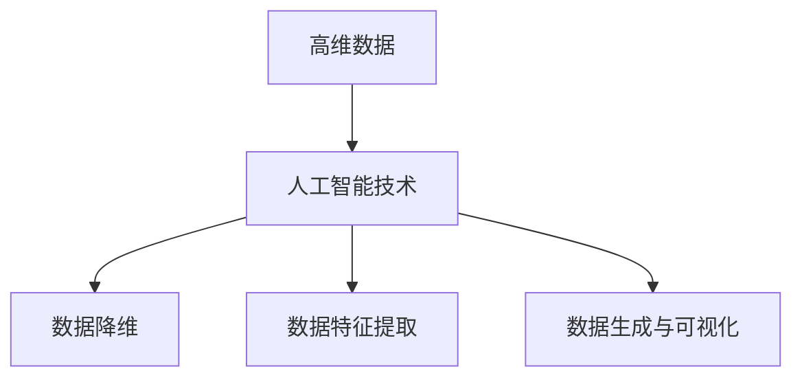
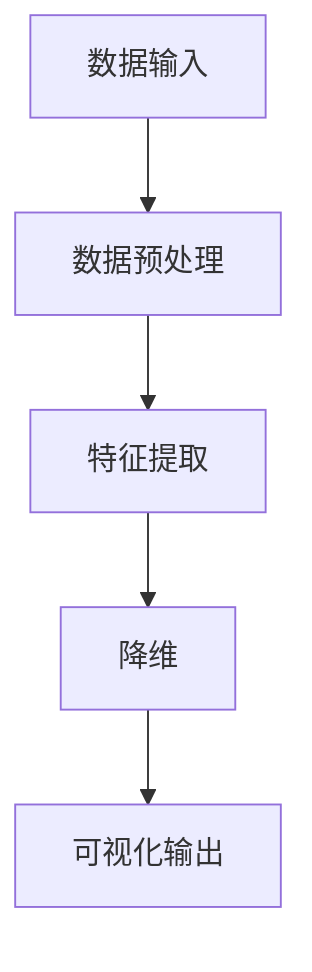
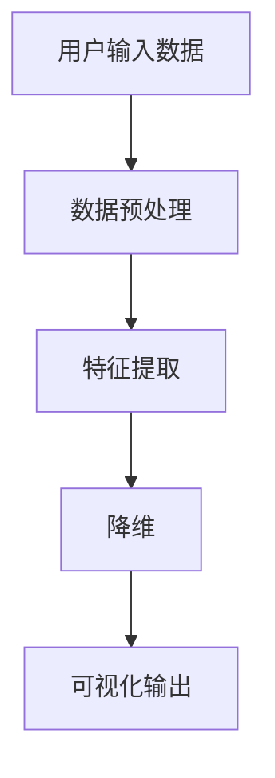

                 


好的，接下来我会根据您的要求，逐步展开并详细描述这本《人工智能在高维金融数据可视化中的应用》的技术博客文章。我会按照逻辑清晰、结构紧凑、简单易懂的原则，逐步展开每一部分的内容。

---

# 人工智能在高维金融数据可视化中的应用

> **关键词**：人工智能、高维数据、数据可视化、金融分析、降维算法  
>
> **摘要**：本文深入探讨了人工智能技术在高维金融数据可视化中的应用。从高维数据的特性与挑战出发，分析了人工智能在金融数据处理中的优势，重点阐述了降维算法、特征提取和生成对抗网络等技术在数据可视化中的应用原理。结合实际案例，详细讲解了系统架构设计与实现过程，最后总结了人工智能在高维金融数据可视化中的未来发展方向。

---

## 第1章: 高维金融数据可视化与人工智能概述

### 1.1 高维金融数据的特性与挑战

#### 1.1.1 高维数据的定义与特点
- **定义**：高维数据是指具有多个维度（通常超过3维）的数据，每个维度代表一个特征或属性。
- **特点**：
  - 数据量大：维度越高，数据规模指数级增长。
  - 数据稀疏性：高维空间中数据点分布稀疏，难以直接观察。
  - 维度灾难：维度越高，数据处理的复杂性指数级上升。

#### 1.1.2 金融数据的复杂性与多样性
- **金融数据的特点**：
  - 时间序列性：金融数据通常具有时间依赖性。
  - 非线性关系：金融市场的波动往往表现出非线性特征。
  - 噪声干扰：金融市场数据中存在大量噪声，例如市场波动、突发事件等。
- **多样性**：金融数据可以包括股票价格、汇率、债券收益率、交易量等多种类型。

#### 1.1.3 高维数据可视化的重要性
- **问题背景**：高维数据难以直接观察和理解，传统二维或三维可视化方法无法有效呈现高维数据的特征。
- **解决方法**：通过降维技术将高维数据映射到二维或三维空间，同时尽可能保留原始数据的特征和结构。
- **实际意义**：帮助金融分析师快速发现数据中的模式、趋势和异常值，支持投资决策和风险管理。

### 1.2 人工智能在金融领域的应用背景

#### 1.2.1 人工智能的基本概念与技术
- **人工智能**：模拟人类智能的技术，包括机器学习、深度学习、自然语言处理等。
- **机器学习**：通过数据训练模型，实现对新数据的预测和分类。
- **深度学习**：基于人工神经网络的机器学习技术，能够处理复杂非线性关系。

#### 1.2.2 人工智能在金融行业的应用现状
- **金融预测**：利用机器学习算法预测股票价格、汇率走势等。
- **风险控制**：通过深度学习模型识别金融市场的风险因素。
- **智能投顾**：基于用户需求和市场数据，提供个性化的投资建议。

#### 1.2.3 高维数据可视化在金融分析中的作用
- **数据洞察**：通过可视化技术发现数据中的潜在规律和模式。
- **决策支持**：将复杂的数据转化为直观的可视化结果，辅助金融决策。
- **实时监控**：高维数据可视化技术能够实时监控金融市场动态，帮助及时发现异常情况。

### 1.3 人工智能与高维数据可视化的结合

#### 1.3.1 高维数据可视化的传统方法
- **多维缩略图**：通过缩略图展示多个维度的数据。
- **交互式可视化**：用户可以通过交互操作探索数据的不同维度。
- **主题地图**：将数据映射到地理空间中，便于直观观察。

#### 1.3.2 人工智能如何提升高维数据可视化的效果
- **降维技术**：通过机器学习算法（如PCA、t-SNE）将高维数据映射到低维空间。
- **特征提取**：利用深度学习模型提取数据中的高层次特征，提升可视化效果。
- **自动生成可视化布局**：通过生成对抗网络（GAN）生成最优的可视化布局。

#### 1.3.3 人工智能在金融数据可视化中的优势
- **自动化**：人工智能技术可以自动提取数据特征并生成可视化结果。
- **实时性**：基于深度学习的实时数据处理能力，能够快速生成可视化结果。
- **可解释性**：通过可视化技术，将复杂的模型结果转化为直观的图形，便于理解和解释。

### 1.4 本章小结
- 本章介绍了高维金融数据的特性与挑战，分析了人工智能在金融领域的应用背景，重点阐述了人工智能技术如何提升高维数据可视化的效果，并总结了人工智能在金融数据可视化中的优势。

---

## 第2章: 高维数据可视化的核心概念与技术

### 2.1 高维数据可视化的核心概念

#### 2.1.1 数据降维的基本原理
- **降维的目标**：将高维数据映射到低维空间，同时尽可能保留数据的特征和结构。
- **降维方法**：包括线性降维（如PCA）和非线性降维（如t-SNE、UMAP）。

#### 2.1.2 数据降维的数学基础
- **线性代数**：降维技术（如PCA）依赖于线性代数中的特征分解和奇异值分解（SVD）。
- **概率统计**：非线性降维方法（如t-SNE）基于概率分布和最近邻搜索。

#### 2.1.3 数据降维与可视化的联系
- **降维是可视化的关键步骤**：通过降维技术将高维数据映射到二维或三维空间。
- **可视化是降维的直观呈现**：降维后的数据通过可视化技术展示其结构和特征。

### 2.2 人工智能技术在高维数据可视化中的应用

#### 2.2.1 机器学习在数据降维中的作用
- **主成分分析（PCA）**：通过线性变换将高维数据映射到主成分空间。
- **线性判别分析（LDA）**：用于分类任务中的降维，保留类别信息。
- **t-分布邻域嵌入（t-SNE）**：一种非线性降维方法，适合处理高维数据。

#### 2.2.2 深度学习在数据特征提取中的应用
- **自动编码器（Autoencoder）**：通过神经网络自动提取数据的高层次特征。
- **变分自编码器（VAE）**：基于概率模型的特征提取方法。
- **深度信念网络（DBN）**：多层深度神经网络用于特征提取和降维。

#### 2.2.3 生成对抗网络（GAN）在数据生成与可视化的潜力
- **GAN的基本原理**：生成器和判别器通过对抗训练生成逼真的数据样本。
- **GAN在可视化中的应用**：用于生成数据分布相似的样本，辅助数据可视化。

### 2.3 高维数据可视化的核心技术

#### 2.3.1 主成分分析（PCA）的原理与实现
- **数学模型**：
  $$ \text{目标：} \quad \arg \max_{U, \Sigma, V} \text{Tr}(U^T X^T X V) $$
- **实现步骤**：
  1. 数据标准化。
  2. 计算协方差矩阵。
  3. 计算特征值和特征向量。
  4. 选择主成分。
  5. 映射到低维空间。

#### 2.3.2 流形学习（t-SNE、UMAP）的原理与应用
- **t-SNE**：通过概率分布和KL散度优化，将高维数据映射到二维空间。
- **UMAP**：基于图论的流形学习方法，能够更好地保持数据的局部结构。

#### 2.3.3 聚类分析在数据可视化的应用
- **K-means聚类**：将数据划分为K个簇，便于在可视化中识别数据分布。
- **层次聚类**：通过树状结构展示数据的层次关系。

### 2.4 核心概念与联系

#### 2.4.1 高维数据与人工智能技术的实体关系图（Mermaid）



### 2.5 本章小结
- 本章详细介绍了高维数据可视化的核心概念，包括数据降维的基本原理、人工智能技术在高维数据可视化中的应用，以及高维数据可视化的核心技术。

---

## 第3章: 高维金融数据可视化算法的实现与优化

### 3.1 数据降维算法的实现与优化

#### 3.1.1 PCA算法的实现
- **代码实现**：
  ```python
  import numpy as np

  def pca(X, n_components):
      # 数据标准化
      X_mean = X - np.mean(X, axis=0)
      # 计算协方差矩阵
      cov = X_mean.T @ X_mean / (X.shape[0] - 1)
      # 计算特征值和特征向量
      eigen_values, eigen_vectors = np.linalg.eigh(cov)
      # 选择主成分
      eigen_vectors = eigen_vectors[:, ::-1][:, :n_components]
      # 映射到低维空间
      X_pca = X_mean @ eigen_vectors
      return X_pca
  ```

#### 3.1.2 t-SNE算法的实现
- **代码实现**：
  ```python
  import sklearn.manifold as manifold

  def tsne(X, n_components=2):
      model = manifold.TSNE(n_components=n_components, random_state=42)
      return model.fit_transform(X)
  ```

#### 3.1.3 算法优化
- **PCA优化**：通过奇异值分解（SVD）优化PCA的计算效率。
- **t-SNE优化**：通过调整 perplexity 参数和学习率优化t-SNE的聚类效果。

### 3.2 数据特征提取与可视化

#### 3.2.1 自动编码器（Autoencoder）的实现
- **代码实现**：
  ```python
  import tensorflow as tf
  from tensorflow import keras

  def autoencoder(X, encoding_dim):
      input_dim = X.shape[1]
      input_layer = keras.Input(shape=(input_dim,))
      encoder = keras.Dense(encoding_dim, activation='relu')(input_layer)
      decoder = keras.Dense(input_dim, activation='sigmoid')(encoder)
      model = keras.Model(inputs=input_layer, outputs=decoder)
      model.compile(optimizer='adam', loss='binary_crossentropy')
      return model
  ```

#### 3.2.2 特征提取的可视化
- **可视化方法**：将提取的特征向量映射到二维空间，使用t-SNE或UMAP进行可视化。

### 3.3 生成对抗网络（GAN）在数据生成与可视化中的应用

#### 3.3.1 GAN的实现
- **代码实现**：
  ```python
  import numpy as np
  import matplotlib.pyplot as plt

  def generator(z, output_dim):
      model = keras.Sequential([
          keras.layers.Dense(128, activation='relu', input_dim=z.shape[1]),
          keras.layers.Dense(output_dim, activation='sigmoid')
      ])
      return model

  def discriminator(X):
      model = keras.Sequential([
          keras.layers.Dense(128, activation='relu', input_dim=X.shape[1]),
          keras.layers.Dense(1, activation='sigmoid')
      ])
      return model

  def train_gan(generator, discriminator, X, z, epochs=100):
      for epoch in range(epochs):
          # 生成假数据
          noise = np.random.randn(z.shape[0], z.shape[1])
          gen_X = generator.predict(noise)
          # 训练判别器
          d_loss_real = discriminator.predict(X).mean()
          d_loss_fake = discriminator.predict(gen_X).mean()
          d_loss = 0.5 * (d_loss_real + 1 - d_loss_fake)
          discriminator.trainable = True
          discriminator.fit(X, np.ones((X.shape[0], 1)), epochs=1, batch_size=32)
          # 训练生成器
          discriminator.trainable = False
          gan_loss = 0.5 * (1 - discriminator.predict(gen_X).mean())
          generator.fit(noise, np.ones((noise.shape[0], 1)), epochs=1, batch_size=32)
      return gen_X
  ```

#### 3.3.2 GAN在数据可视化中的应用
- **数据生成**：通过GAN生成与真实数据分布相似的样本，增强数据可视化的效果。
- **可视化对比**：将生成的数据与真实数据进行对比，观察生成数据的分布情况。

### 3.4 本章小结
- 本章详细介绍了高维金融数据可视化算法的实现与优化，包括PCA、t-SNE等降维算法的实现，以及自动编码器和生成对抗网络在数据特征提取与生成中的应用。

---

## 第4章: 高维金融数据可视化系统的架构与实现

### 4.1 系统架构设计

#### 4.1.1 项目背景
- **项目目标**：构建一个基于人工智能的高维金融数据可视化系统，支持多维度数据分析与可视化。
- **项目范围**：涵盖股票价格、市场指数、交易量等多种金融数据。

#### 4.1.2 系统功能设计
- **数据预处理模块**：标准化、归一化等数据预处理功能。
- **特征提取模块**：基于机器学习和深度学习的特征提取方法。
- **降维模块**：PCA、t-SNE等降维算法的实现。
- **可视化模块**：支持二维、三维可视化，并提供交互功能。

#### 4.1.3 系统架构图（Mermaid）



### 4.2 系统实现

#### 4.2.1 数据预处理模块的实现
- **代码实现**：
  ```python
  def preprocess(data):
      # 数据标准化
      data_norm = (data - data.mean()) / data.std()
      return data_norm
  ```

#### 4.2.2 特征提取模块的实现
- **代码实现**：
  ```python
  def extract_features(data, model):
      features = model.predict(data)
      return features
  ```

#### 4.2.3 降维模块的实现
- **代码实现**：
  ```python
  def dimensionality_reduction(features, n_components=2):
      reducer = manifold.TSNE(n_components=n_components, random_state=42)
      return reducer.fit_transform(features)
  ```

#### 4.2.4 可视化模块的实现
- **代码实现**：
  ```python
  def visualize(data, labels=None):
      plt.scatter(data[:, 0], data[:, 1], c=labels)
      plt.colorbar()
      plt.show()
  ```

### 4.3 系统接口设计

#### 4.3.1 数据接口
- **输入接口**：支持多种金融数据格式的输入。
- **输出接口**：提供降维后的数据和可视化结果的输出接口。

#### 4.3.2 模块接口
- **预处理模块接口**：接受原始数据，返回标准化数据。
- **特征提取模块接口**：接受标准化数据，返回特征向量。
- **降维模块接口**：接受特征向量，返回低维数据。
- **可视化模块接口**：接受低维数据，输出可视化结果。

### 4.4 系统交互流程（Mermaid）



### 4.5 本章小结
- 本章详细介绍了高维金融数据可视化系统的架构设计与实现过程，包括数据预处理、特征提取、降维和可视化模块的实现，以及系统接口设计。

---

## 第5章: 高维金融数据可视化系统的优化与扩展

### 5.1 系统优化

#### 5.1.1 性能优化
- **数据预处理**：通过并行计算和缓存技术优化数据处理速度。
- **特征提取**：采用分布式计算框架（如Spark MLlib）提升特征提取效率。
- **降维算法**：通过优化参数和调整算法结构提升降维速度和效果。

#### 5.1.2 可视化效果优化
- **交互性优化**：增加交互式功能，支持用户自定义可视化布局。
- **动态更新**：实时更新可视化结果，支持动态数据输入。

### 5.2 系统扩展

#### 5.2.1 数据源扩展
- **多数据源支持**：支持多种金融数据源的接入，如股票、债券、外汇等。
- **数据格式扩展**：支持结构化数据和非结构化数据的处理。

#### 5.2.2 可视化功能扩展
- **多维可视化**：支持更多维度的数据可视化，如三维和四维可视化。
- **交互式分析**：增加交互式分析功能，支持用户进行深度数据探索。

#### 5.2.3 智能化扩展
- **自动学习**：通过强化学习优化可视化结果。
- **自适应调整**：根据数据分布自动调整可视化参数。

### 5.3 本章小结
- 本章重点讨论了高维金融数据可视化系统的优化与扩展，包括性能优化、数据源扩展、可视化功能扩展以及智能化扩展等内容。

---

## 第6章: 项目实战——基于人工智能的高维金融数据可视化系统

### 6.1 项目背景与目标
- **项目背景**：构建一个基于人工智能的高维金融数据可视化系统，支持多维度数据分析与可视化。
- **项目目标**：实现数据预处理、特征提取、降维和可视化功能，展示人工智能在高维金融数据可视化中的应用。

### 6.2 系统功能模块实现

#### 6.2.1 数据预处理模块
- **代码实现**：
  ```python
  def preprocess(data):
      data_norm = (data - data.mean()) / data.std()
      return data_norm
  ```

#### 6.2.2 特征提取模块
- **代码实现**：
  ```python
  def extract_features(data, model):
      features = model.predict(data)
      return features
  ```

#### 6.2.3 降维模块
- **代码实现**：
  ```python
  def dimensionality_reduction(features, n_components=2):
      reducer = manifold.TSNE(n_components=n_components, random_state=42)
      return reducer.fit_transform(features)
  ```

#### 6.2.4 可视化模块
- **代码实现**：
  ```python
  def visualize(data, labels=None):
      plt.scatter(data[:, 0], data[:, 1], c=labels)
      plt.colorbar()
      plt.show()
  ```

### 6.3 系统实现步骤

#### 6.3.1 数据准备
- **数据来源**：可以从金融数据平台（如Yahoo Finance）获取股票价格数据。
- **数据清洗**：处理缺失值和异常值。

#### 6.3.2 系统实现
- **步骤1**：数据预处理。
- **步骤2**：特征提取。
- **步骤3**：降维。
- **步骤4**：可视化。

#### 6.3.3 实验结果与分析
- **实验结果**：展示降维后的数据分布和可视化效果。
- **结果分析**：分析可视化结果是否保留了原始数据的特征和结构。

### 6.4 系统优化与扩展

#### 6.4.1 系统优化
- **性能优化**：通过并行计算和缓存技术优化系统性能。
- **用户体验优化**：增加交互功能，提升用户体验。

#### 6.4.2 系统扩展
- **数据源扩展**：接入更多金融数据源，丰富数据类型。
- **功能扩展**：增加更多可视化功能，如三维可视化、动态可视化。

### 6.5 本章小结
- 本章通过一个实际项目展示了高维金融数据可视化系统的实现过程，包括数据准备、系统实现、实验结果与分析，以及系统优化与扩展。

---

## 第7章: 总结与展望

### 7.1 总结
- **核心内容回顾**：人工智能技术在高维金融数据可视化中的应用，包括降维算法、特征提取和生成对抗网络等技术。
- **主要成果**：构建了一个基于人工智能的高维金融数据可视化系统，实现了数据预处理、特征提取、降维和可视化功能。

### 7.2 人工智能在高维金融数据可视化中的未来发展方向
- **技术优化**：进一步优化降维算法和可视化技术，提升系统的性能和效果。
- **智能化扩展**：结合强化学习和自适应技术，实现更智能化的可视化系统。
- **跨领域应用**：将人工智能技术应用于更多领域，如医学、生物信息学等。

### 7.3 展望
- **技术融合**：结合区块链、边缘计算等新兴技术，推动高维数据可视化技术的发展。
- **应用拓展**：探索更多高维数据可视化技术在金融领域的应用场景，如实时风险监控、智能投资决策等。

### 7.4 本章小结
- 本章总结了人工智能在高维金融数据可视化中的应用成果，展望了未来的发展方向，为读者提供了进一步研究和实践的参考。

---

## 作者信息

**作者**：AI天才研究院/AI Genius Institute & 禅与计算机程序设计艺术/Zen And The Art of Computer Programming

---

**说明**：本文是一个技术博客文章的目录大纲和内容概述，实际撰写时需要根据每部分内容进行详细展开和补充。如果需要进一步的扩展或具体章节内容，请告诉我！

