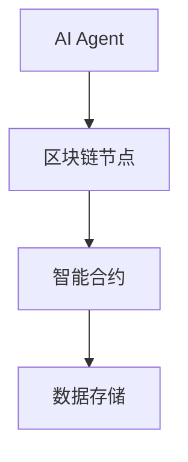
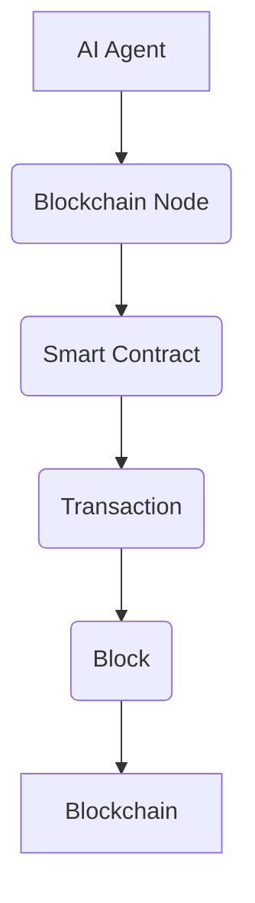

                 


# 企业AI Agent的区块链集成策略

> 关键词：企业AI Agent，区块链，智能合约，共识机制，数据安全

> 摘要：随着企业智能化转型的加速，AI Agent作为一种智能化的软件代理，正在成为企业数字化转型的重要工具。然而，AI Agent的应用场景通常涉及多方协作、数据共享和信任建立，这些都需要强大的信任机制和安全机制来支持。区块链技术作为一种去中心化、不可篡改的分布式账本技术，为企业AI Agent的集成提供了天然的信任支持。本文将从企业AI Agent与区块链的核心概念出发，详细分析两者结合的必要性、实现方式以及实际应用场景，探讨企业AI Agent的区块链集成策略，为企业智能化转型提供新的思路和解决方案。

---

# 第1章: 企业AI Agent与区块链概述

## 1.1 企业AI Agent的基本概念

### 1.1.1 AI Agent的定义与特点

AI Agent（人工智能代理）是一种能够感知环境、自主决策并执行任务的智能实体。它通常具备以下特点：

- **自主性**：能够在没有人工干预的情况下自主运行。
- **反应性**：能够根据环境变化实时调整行为。
- **学习能力**：能够通过数据和经验不断优化自身性能。
- **协作性**：能够与其他系统、设备或AI Agent进行协作。

AI Agent在企业中的应用非常广泛，例如自动化处理订单、管理供应链、优化资源配置等。

### 1.1.2 企业AI Agent的应用场景

企业在实际应用中，AI Agent通常用于以下场景：

- **智能客服**：通过自然语言处理技术为用户提供个性化服务。
- **供应链管理**：实时监控供应链状态，优化库存管理。
- **智能决策支持**：基于大数据分析为企业提供决策支持。
- **自动化操作**：自动处理重复性任务，提高效率。

### 1.1.3 区块链技术的基本原理

区块链是一种去中心化的分布式账本技术，其核心特点包括：

- **去中心化**：数据不依赖于单个中心节点，而是分布在网络的各个节点上。
- **不可篡改**：数据一旦写入区块链，就无法被修改或删除。
- **透明性**：所有交易记录对所有参与者公开，但用户身份可以匿名。
- **共识机制**：通过特定算法确保所有节点达成一致。

区块链的这些特点使其在企业信任机制、数据安全等方面具有独特优势。

---

## 1.2 企业AI Agent与区块链的结合意义

### 1.2.1 区块链对企业AI Agent的信任机制支持

在企业应用中，AI Agent往往需要与多个系统、设备或人员进行交互，这需要高度的信任机制。区块链的去中心化和不可篡改特性，能够有效解决信任问题，确保AI Agent的行为可追溯、可验证。

### 1.2.2 AI Agent在区块链中的潜在价值

AI Agent可以作为区块链中的智能节点，负责执行特定任务或智能合约。通过区块链的分布式特性，AI Agent能够实现更加灵活和高效的应用。

### 1.2.3 企业AI Agent与区块链结合的应用前景

企业AI Agent与区块链的结合，不仅能够提升企业的智能化水平，还能够推动区块链技术在企业级应用中的落地。例如，在金融、物流、医疗等领域，AI Agent与区块链的结合将带来更大的创新空间。

---

## 1.3 本章小结

本章主要介绍了企业AI Agent和区块链的基本概念，并探讨了两者结合的重要性和潜在价值。通过区块链的技术特性，企业AI Agent能够在复杂的环境中实现高效、安全的协作。

---

# 第2章: 企业AI Agent的区块链集成背景

## 2.1 当前企业智能化转型的趋势

### 2.1.1 数字化转型的现状与挑战

随着数字经济的快速发展，企业正面临着越来越复杂的数字化转型挑战。如何高效利用数据、实现智能化运营，成为企业转型的核心问题。

### 2.1.2 AI技术在企业中的应用现状

AI技术已经在企业中得到了广泛应用，例如智能客服、智能推荐、智能风控等领域。然而，AI技术的应用仍然面临数据孤岛、信任缺失等问题。

### 2.1.3 区块链技术对企业数字化转型的支持

区块链技术能够有效解决企业数字化转型中的信任问题，为企业构建安全、可靠的数字化基础设施。

---

## 2.2 区块链对企业AI Agent的信任支持

### 2.2.1 区块链的信任机制对企业AI Agent的重要性

在企业环境中，AI Agent需要与多个系统或人员进行交互，信任机制是确保其安全运行的关键。区块链的去中心化和不可篡改特性，为AI Agent提供了可靠的信任支持。

### 2.2.2 区块链在数据安全与隐私保护中的作用

区块链通过加密技术和权限控制，能够有效保护数据的安全和隐私。这为AI Agent的运行提供了更高的安全性。

### 2.2.3 区块链对企业AI Agent的协作支持

通过区块链的智能合约功能，AI Agent可以与其他系统或人员进行自动化协作，实现高效的业务流程。

---

## 2.3 本章小结

本章从企业智能化转型的趋势出发，探讨了区块链技术对企业AI Agent的信任支持。通过区块链技术，企业能够构建更加安全、可靠的智能化系统。

---

# 第3章: 企业AI Agent的区块链集成核心概念

## 3.1 AI Agent与区块链的核心概念对比

### 3.1.1 AI Agent的核心概念

AI Agent的核心概念包括感知、决策、执行和学习能力。它需要能够感知环境、做出决策并执行任务，同时通过学习不断优化自身性能。

### 3.1.2 区块链的核心概念

区块链的核心概念包括去中心化、不可篡改、透明性和共识机制。这些特性使其成为构建信任机制的理想选择。

### 3.1.3 两者的对比与联系

| 特性 | AI Agent | 区块链 |
|------|-----------|--------|
| 自主性 | 高         | 无       |
| 可信性 | 依赖环境   | 高       |
| 数据共享 | 依赖中心化存储 | 去中心化存储 |
| 协作性 | 依赖信任机制 | 去中心化信任机制 |

从上表可以看出，AI Agent在信任和协作方面依赖于外部机制，而区块链能够提供这种机制。

---

## 3.2 AI Agent与区块链的实体关系图



从上图可以看出，AI Agent通过区块链节点与智能合约进行交互，最终实现数据的存储和管理。

---

## 3.3 本章小结

本章通过对比AI Agent与区块链的核心概念，分析了两者的联系与区别，并通过实体关系图展示了它们的协作关系。

---

# 第4章: 企业AI Agent的区块链集成算法原理

## 4.1 AI Agent与区块链交互的算法流程



从上图可以看出，AI Agent通过区块链节点调用智能合约，生成交易并将其写入区块链。

---

## 4.2 区块链智能合约的AI Agent调用流程

### 4.2.1 智能合约的定义与特点

智能合约是区块链上的自动执行程序，能够根据预设条件自动执行相应操作。它的特点包括：

- **自动执行**：无需人工干预。
- **不可篡改**：一旦部署，无法修改。
- **透明性**：所有操作记录可追溯。

### 4.2.2 AI Agent调用智能合约的流程

1. AI Agent向区块链节点发送请求。
2. 区块链节点验证AI Agent的权限。
3. AI Agent调用智能合约。
4. 智能合约执行相应操作。
5. 操作结果返回给AI Agent。

### 4.2.3 调用流程的详细说明

以下是一个简单的智能合约调用流程：

1. AI Agent通过API向区块链节点发送请求。
2. 区块链节点验证AI Agent的签名和权限。
3. AI Agent调用智能合约接口。
4. 智能合约执行相应逻辑。
5. 智能合约返回结果给AI Agent。

---

## 4.3 区块链共识机制在AI Agent中的应用

### 4.3.1 共识机制的基本原理

共识机制是区块链的核心技术之一，用于确保所有节点达成一致。常见的共识机制包括PoW（工作量证明）、PoS（权益证明）、Raft等。

### 4.3.2 共识机制在AI Agent中的应用

AI Agent可以通过共识机制确保数据的一致性和可靠性。例如，在供应链管理中，AI Agent可以通过共识机制确保所有节点的库存数据一致。

### 4.3.3 共识机制的优缺点分析

- **优点**：确保数据一致性，增强信任。
- **缺点**：可能增加计算开销，影响性能。

---

## 4.4 本章小结

本章详细讲解了企业AI Agent与区块链交互的算法流程，包括智能合约的调用和共识机制的应用。

---

# 第5章: 企业AI Agent的区块链集成系统分析

## 5.1 系统功能设计

### 5.1.1 领域模型设计

```mermaid
classDiagram
    class AI Agent {
        +id: string
        +name: string
        +status: string
        -tasks: List<Task>
        +executeTask(): void
        +learnFromData(): void
    }
    class Task {
        +id: string
        +description: string
        +status: string
        +deadline: Date
    }
    AI Agent o- Task
```

从上图可以看出，AI Agent与Task的关系是拥有关系，AI Agent可以拥有多个任务。

---

## 5.2 系统架构设计

### 5.2.1 架构图


从上图可以看出，AI Agent通过区块链节点与智能合约进行交互，最终实现数据的存储和管理。

---

## 5.3 系统接口设计

### 5.3.1 AI Agent与区块链节点的接口

1. **请求接口**：AI Agent向区块链节点发送请求。
2. **响应接口**：区块链节点返回操作结果。

### 5.3.2 智能合约与数据存储的接口

1. **调用接口**：智能合约调用数据存储接口。
2. **返回接口**：数据存储返回操作结果。

---

## 5.4 本章小结

本章通过系统分析，设计了企业AI Agent的区块链集成系统，包括领域模型、系统架构和接口设计。

---

# 第6章: 企业AI Agent的区块链集成项目实战

## 6.1 环境安装

### 6.1.1 安装区块链框架

选择一个适合的区块链框架，例如Hyperledger Fabric。

### 6.1.2 安装AI框架

选择一个适合的AI框架，例如TensorFlow或Keras。

---

## 6.2 核心代码实现

### 6.2.1 AI Agent代码实现

```python
class AI-Agent:
    def __init__(self, id, name):
        self.id = id
        self.name = name
        self.status = "idle"
        self.tasks = []
    
    def executeTask(self):
        # 执行任务
        pass
    
    def learnFromData(self):
        # 学习数据
        pass
```

### 6.2.2 区块链节点代码实现

```python
class Blockchain-Node:
    def __init__(self, id):
        self.id = id
        self.connected_agents = []
    
    def verifyAgent(self, agent):
        # 验证AI Agent的身份
        pass
    
    def invokeSmartContract(self, contract):
        # 调用智能合约
        pass
```

---

## 6.3 案例分析与详细解读

### 6.3.1 案例分析

假设我们正在开发一个供应链管理AI Agent，它需要与区块链节点进行交互，实时更新库存数据。

### 6.3.2 代码应用解读

1. **AI Agent初始化**：创建一个AI Agent实例，并设置其初始状态。
2. **调用智能合约**：AI Agent通过区块链节点调用智能合约，更新库存数据。
3. **数据存储**：智能合约将数据写入区块链，确保数据的安全性和一致性。

---

## 6.4 本章小结

本章通过实际案例，详细讲解了企业AI Agent的区块链集成项目的实现过程。

---

# 第7章: 总结与展望

## 7.1 最佳实践 tips

- **数据安全**：确保数据的安全性和隐私性。
- **性能优化**：优化AI Agent与区块链的交互效率。
- **智能合约设计**：确保智能合约的安全性和可靠性。

## 7.2 小结

企业AI Agent的区块链集成是一种创新的解决方案，能够为企业智能化转型提供强大的技术支持。

## 7.3 注意事项

- **信任机制**：确保区块链的信任机制能够满足企业需求。
- **数据一致性**：确保AI Agent与区块链的数据一致性。
- **性能优化**：优化AI Agent与区块链的交互性能。

## 7.4 拓展阅读

- 《区块链技术进阶与实战》
- 《AI Agent与分布式系统》
- 《智能合约开发指南》

---

# 作者

作者：AI天才研究院/AI Genius Institute & 禅与计算机程序设计艺术/Zen And The Art of Computer Programming

---

以上就是《企业AI Agent的区块链集成策略》的完整目录大纲和文章内容。希望这篇文章能够为读者提供清晰的思路和实用的解决方案，帮助企业更好地实现智能化转型。

