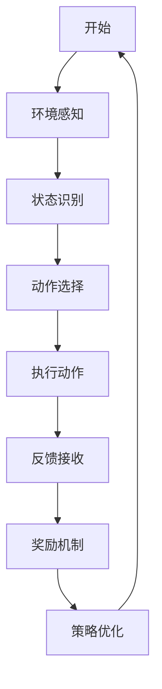
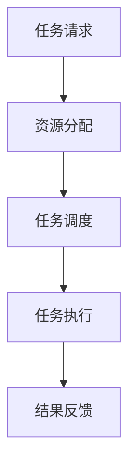
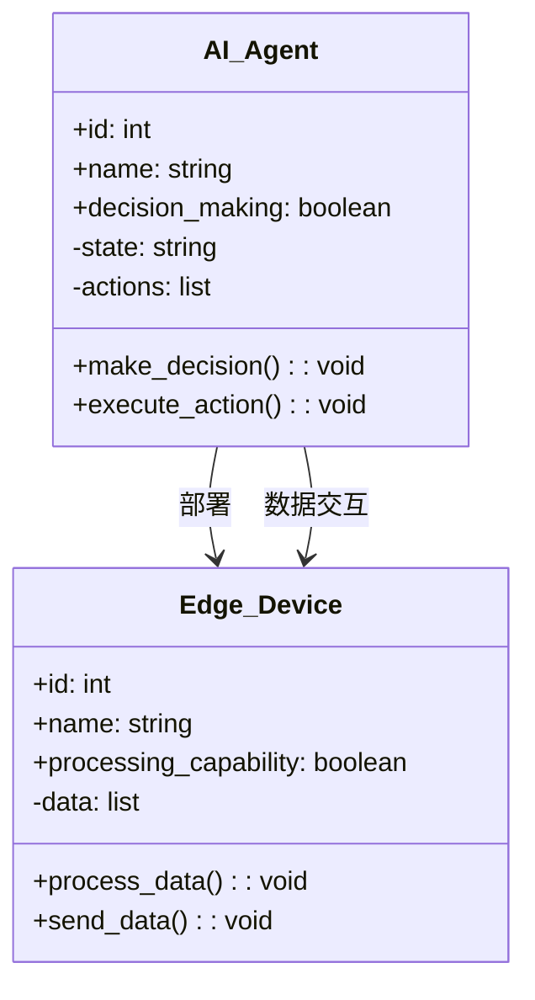
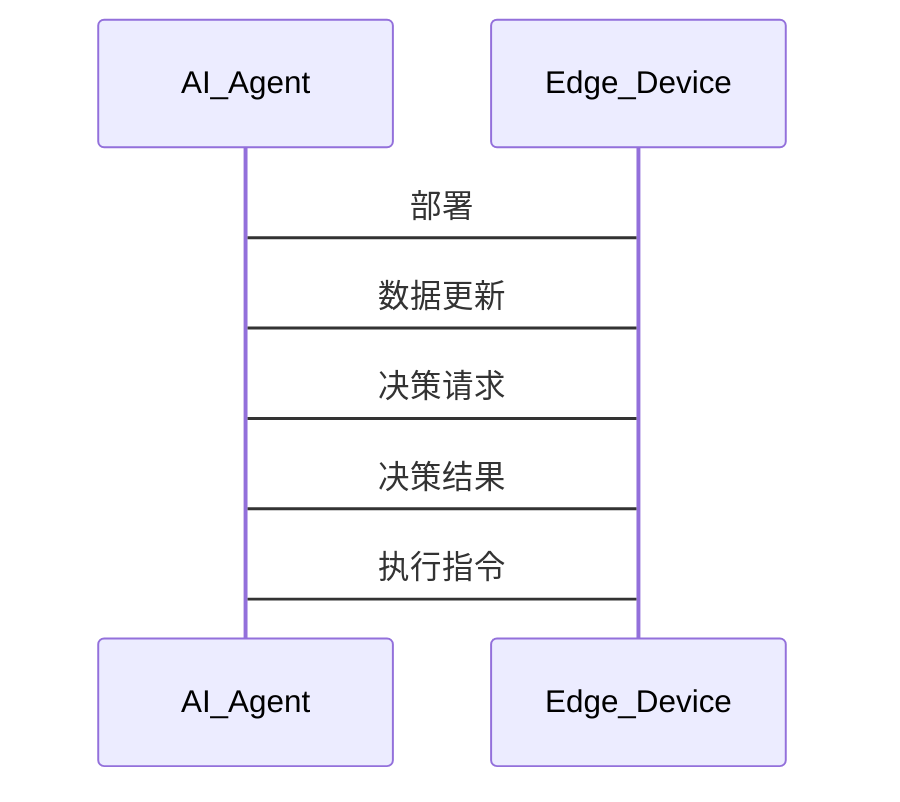
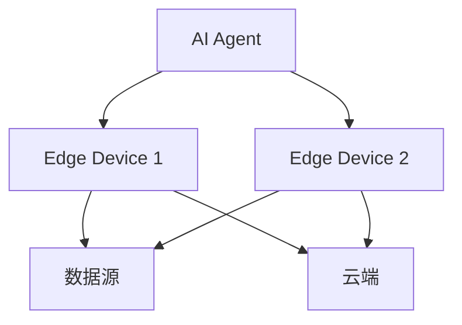
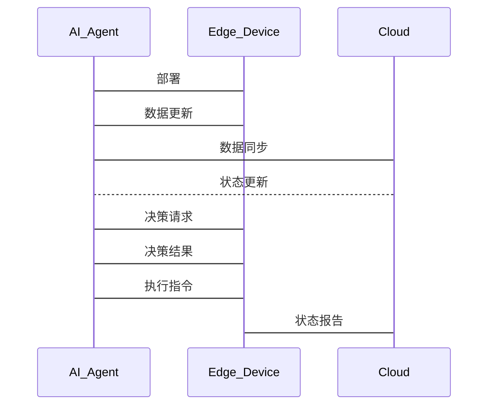

                 


# 企业AI Agent的边缘计算应用：提升响应速度

## 关键词：企业AI Agent，边缘计算，响应速度，分布式架构，算法优化

## 摘要：  
在数字化转型的浪潮中，企业AI Agent与边缘计算的结合为企业提供了更快的响应速度和更高效的决策能力。本文从AI Agent和边缘计算的核心概念出发，详细探讨了它们的协同工作原理，并通过实际案例展示了如何通过边缘计算优化AI Agent的响应速度。文章内容涵盖背景介绍、核心概念与联系、算法原理、系统架构设计、项目实战及最佳实践，旨在为企业技术决策者提供深度的技术洞察和实践指导。

---

## 第一部分: 企业AI Agent的边缘计算应用概述

### 第1章: 企业AI Agent与边缘计算的背景介绍

#### 1.1 AI Agent的基本概念

##### 1.1.1 什么是AI Agent
AI Agent（人工智能代理）是一种能够感知环境、自主决策并执行任务的智能实体。它通过传感器获取信息，利用算法处理数据，并通过执行器与外部环境交互。AI Agent的核心在于其智能性和自主性，能够根据任务需求动态调整行为。

##### 1.1.2 AI Agent的核心特征
- **自主性**：AI Agent能够自主决策，无需人工干预。
- **反应性**：能够实时感知环境变化并做出反应。
- **学习能力**：通过机器学习算法不断优化自身行为。
- **协作性**：能够与其他AI Agent或系统协同工作。

##### 1.1.3 AI Agent在企业中的应用场景
- **智能客服**：通过自然语言处理（NLP）技术为用户提供实时支持。
- **供应链管理**：优化库存调度和物流路径。
- **智能监控**：实时监控设备运行状态，预测故障。

#### 1.2 边缘计算的基本概念

##### 1.2.1 边缘计算的定义
边缘计算是一种分布式计算范式，数据在靠近数据源的边缘设备上进行处理，而非将所有数据传输到云端。这种架构能够减少延迟，提高数据处理的实时性。

##### 1.2.2 边缘计算的核心优势
- **低延迟**：数据在本地处理，减少了网络传输的延迟。
- **高可用性**：边缘设备能够独立处理任务，避免了云端依赖。
- **隐私保护**：在边缘处理数据可以减少敏感信息的传输风险。

##### 1.2.3 边缘计算与云计算的区别
- **数据处理位置**：边缘计算在靠近数据源的地方处理数据，而云计算则将数据传输到云端处理。
- **延迟**：边缘计算的延迟较低，云计算的延迟较高。
- **带宽使用**：边缘计算减少了对网络带宽的需求。

#### 1.3 AI Agent与边缘计算的结合

##### 1.3.1 AI Agent在边缘计算中的作用
AI Agent可以作为边缘计算架构中的智能决策单元，负责处理边缘设备产生的数据，并根据这些数据做出实时决策。

##### 1.3.2 边缘计算如何提升AI Agent的响应速度
通过将AI Agent部署在边缘设备上，数据无需传输到云端，从而大幅降低了延迟。此外，边缘计算的分布式架构能够并行处理多个任务，进一步提高了响应速度。

##### 1.3.3 企业AI Agent边缘计算应用的前景
随着5G网络和物联网技术的普及，AI Agent与边缘计算的结合将为企业带来更快的响应速度和更高效的决策能力。未来的应用场景将更加广泛，包括智能制造、智慧城市等领域。

#### 1.4 本章小结
本章介绍了AI Agent和边缘计算的基本概念，分析了它们的核心特征和应用场景，并探讨了AI Agent与边缘计算结合的优势和前景。

---

## 第2章: AI Agent与边缘计算的核心概念与联系

### 2.1 AI Agent的核心原理

#### 2.1.1 AI Agent的决策机制
AI Agent的决策机制基于感知、推理和行动。感知阶段通过传感器获取环境信息，推理阶段利用机器学习算法进行数据分析，行动阶段通过执行器采取相应行动。

#### 2.1.2 AI Agent的学习机制
AI Agent可以通过监督学习、无监督学习和强化学习等方法不断优化自身的决策能力。强化学习是一种常用的学习方法，通过奖励机制引导AI Agent做出最优决策。

#### 2.1.3 AI Agent的执行机制
AI Agent的执行机制包括任务调度、资源分配和状态跟踪。通过高效的执行机制，AI Agent能够快速响应环境变化并完成任务。

### 2.2 边缘计算的核心原理

#### 2.2.1 边缘计算的分布式架构
边缘计算采用分布式架构，数据在靠近数据源的边缘设备上进行处理。这种架构能够减少对中心化云端的依赖，提高系统的可用性和响应速度。

#### 2.2.2 边缘计算的数据处理机制
边缘计算的数据处理机制包括数据采集、预处理和分析。通过边缘设备的数据处理，可以减少云端的数据传输压力，提高系统的实时性。

#### 2.2.3 边缘计算的资源管理机制
边缘计算需要对计算资源、存储资源和网络资源进行有效管理。通过资源调度算法，可以最大化边缘设备的计算效率。

### 2.3 AI Agent与边缘计算的关系

#### 2.3.1 AI Agent在边缘计算中的角色
AI Agent在边缘计算中扮演智能决策单元的角色。通过部署AI Agent在边缘设备上，可以实现本地智能决策，减少对云端的依赖。

#### 2.3.2 边缘计算对AI Agent性能的提升
边缘计算通过分布式架构和本地数据处理，显著提升了AI Agent的响应速度和处理效率。同时，边缘计算的资源管理机制也为AI Agent的优化提供了支持。

#### 2.3.3 AI Agent与边缘计算的协同工作流程
AI Agent与边缘计算的协同工作流程包括数据采集、数据处理、决策制定和行动执行。通过这种协同工作，AI Agent能够快速响应环境变化，提高系统的整体性能。

### 2.4 核心概念对比表格

| **核心概念** | **AI Agent** | **边缘计算** |
|--------------|--------------|--------------|
| **数据处理位置** | 云端或边缘 | 边缘设备 |
| **延迟** | 较高 | 较低 |
| **实时性** | 较低 | 较高 |
| **应用场景** | 智能决策、预测分析 | 实时监控、边缘设备管理 |

### 2.5 ER实体关系图

```mermaid
erDiagram
    actor AI_Agent {
        id : integer
        name : string
        decision_making : boolean
    }
    actor Edge_Device {
        id : integer
        name : string
        processing_capability : boolean
    }
    AI_Agent -> Edge_Device : 部署
    AI_Agent -> Edge_Device : 数据交互
```

---

## 第3章: AI Agent边缘计算应用的算法原理

### 3.1 AI Agent的决策算法

#### 3.1.1 强化学习算法

##### 强化学习算法流程



##### 强化学习数学模型

状态空间：$$ S \in \mathbb{R}^n $$

动作空间：$$ A \in \mathbb{R}^m $$

奖励函数：$$ R: S \times A \rightarrow \mathbb{R} $$

策略函数：$$ \pi: S \rightarrow A $$

价值函数：$$ V: S \rightarrow \mathbb{R} $$

### 3.2 边缘计算中的分布式算法

#### 3.2.1 分布式一致性算法

##### 分布式一致性算法流程

```mermaid
graph TD
    A[节点1] --> B[节点2] : 传输数据
    B --> C[节点3] : 同步数据
    C --> D[节点4] : 同步数据
    D --> A : 完成一致性
```

#### 3.2.2 分布式任务调度算法

##### 分布式任务调度算法流程



#### 3.2.3 分布式数据同步算法

##### 分布式数据同步算法流程

```mermaid
graph TD
    A[主节点] --> B[从节点1] : 同步数据
    B --> C[从节点2] : 同步数据
    C --> D[从节点3] : 同步数据
    D --> A : 完成同步
```

### 3.3 算法原理的数学模型

#### 3.3.1 强化学习的数学模型

状态转移概率：$$ P(a|s) = \text{argmax}_a \pi(s,a) $$

奖励函数：$$ R(s,a) = \text{奖励值} $$

策略优化：$$ \theta \leftarrow \text{argmax} \sum_{s} \gamma V(s) $$

#### 3.3.2 分布式一致性算法的数学模型

一致性检查：$$ \text{value}_i = \text{value}_j \quad \forall i,j \in \text{nodes} $$

同步过程：$$ \text{value}_i = \text{median}(\text{value}_i, \text{value}_j) $$

---

## 第4章: 系统分析与架构设计方案

### 4.1 问题场景介绍

在智能制造领域，企业需要实时监控生产线上的设备运行状态。通过部署AI Agent在边缘设备上，可以实现设备的实时监控和故障预测。

### 4.2 系统功能设计

#### 4.2.1 系统功能模块



#### 4.2.2 系统交互流程



### 4.3 系统架构设计

#### 4.3.1 系统架构图



#### 4.3.2 系统接口设计

- AI Agent与Edge Device的接口：数据传输和指令执行。
- Edge Device与云端的接口：数据同步和状态报告。

### 4.4 系统交互流程



---

## 第5章: 项目实战

### 5.1 环境安装

#### 5.1.1 系统环境
- 操作系统：Linux
- 网络环境：局域网
- 开发工具：Python、Docker、Kubernetes

### 5.2 系统核心实现源代码

#### 5.2.1 AI Agent核心代码

```python
class AI_Agent:
    def __init__(self):
        self.id = 0
        self.name = "AI Agent"
        self.decision_making = True
        self.state = "idle"
        self.actions = []

    def make_decision(self, data):
        # 简单的决策逻辑，可以根据实际情况扩展
        if data['temperature'] > 50:
            self.actions.append('alarm')
        else:
            self.actions.append('no_action')

    def execute_action(self, action):
        print(f"执行动作：{action}")
```

#### 5.2.2 边缘设备核心代码

```python
class Edge_Device:
    def __init__(self):
        self.id = 0
        self.name = "Edge Device"
        self.processing_capability = True
        self.data = []

    def process_data(self, data):
        self.data.append(data)
        self.send_data()

    def send_data(self):
        # 模拟数据传输到AI Agent
        print(f"发送数据：{self.data}")
```

### 5.3 代码应用解读与分析

AI Agent通过订阅边缘设备的数据更新事件，实时获取设备状态。当设备温度超过阈值时，AI Agent触发报警机制。边缘设备在本地处理数据后，将数据传输到云端进行同步。

### 5.4 实际案例分析

以智能制造为例，AI Agent部署在生产线上的边缘设备中，实时监控设备运行状态。当检测到设备异常时，AI Agent立即触发报警，并指导边缘设备执行相应的维护操作。通过这种方式，企业能够实现设备的实时监控和快速响应。

### 5.5 项目小结

本项目通过将AI Agent部署在边缘设备上，实现了设备的实时监控和快速响应。通过边缘计算的分布式架构，显著提升了系统的响应速度和处理效率。

---

## 第6章: 最佳实践 tips、小结、注意事项、拓展阅读

### 6.1 最佳实践 tips

- **算法优化**：选择适合场景的算法，优化模型参数，提升决策效率。
- **资源管理**：合理分配计算资源，确保边缘设备的高效运行。
- **数据安全**：加强数据加密和访问控制，确保数据隐私和安全。
- **系统监控**：实时监控系统运行状态，及时发现和解决问题。

### 6.2 小结

本文详细探讨了企业AI Agent与边缘计算的结合，分析了它们的核心概念、协同工作原理和实际应用场景。通过边缘计算的分布式架构，AI Agent能够实现快速响应，为企业带来更高的效率和更好的用户体验。

### 6.3 注意事项

- **延迟优化**：选择合适的边缘设备和算法，确保系统的低延迟。
- **数据一致性**：通过分布式一致性算法，确保数据的准确性和一致性。
- **系统扩展性**：设计灵活的架构，方便系统的扩展和升级。

### 6.4 拓展阅读

- **边缘计算**：深入学习边缘计算的理论和实践。
- **AI Agent**：研究AI Agent的最新技术和应用案例。
- **分布式系统**：学习分布式系统的设计与优化。

---

## 作者：AI天才研究院/AI Genius Institute & 禅与计算机程序设计艺术 /Zen And The Art of Computer Programming

