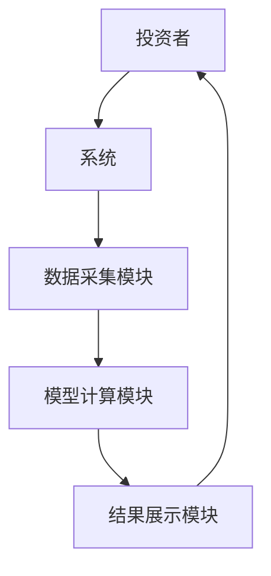

                 


# 全球股市估值与循环经济模式的关系

## 关键词：
全球股市估值、循环经济模式、经济周期、可持续发展、资源效率、市场竞争力

## 摘要：
本文探讨了全球股市估值与循环经济模式之间的关系。在全球经济转型和可持续发展的背景下，循环经济作为一种新型经济模式，正在对股市估值产生深远影响。文章首先分析了全球股市估值的现状及传统经济模式下的问题，接着详细阐述了循环经济模式的核心概念和特点，然后从企业绩效、资源利用效率和市场需求等角度，分析了循环经济模式对股市估值的具体影响。通过构建循环经济与股市估值的关系模型，本文进一步探讨了循环经济模式如何推动股市估值的变化，并提出了投资者和企业如何在循环经济模式下优化投资策略的建议。最后，文章总结了研究的意义，并展望了未来的研究方向。

---

## 第一部分：全球股市估值与循环经济模式的背景与概念

### 第1章：全球股市估值的现状与挑战

#### 1.1 全球股市估值的现状分析

##### 1.1.1 全球股市估值的基本概念
全球股市估值是指对全球范围内股票市场的整体价值进行评估，通常通过市盈率（P/E）、市净率（P/B）等指标来衡量。股市估值的变化反映了经济状况、企业盈利能力和投资者信心的变化。

##### 1.1.2 当前全球股市估值的主要指标
- 市盈率（P/E）：市盈率=股价/每股收益，反映了市场对企业的盈利预期。
- 市净率（P/B）：市净率=股价/每股净资产，反映了市场对企业的资产价值评估。
- 市销率（P/S）：市销率=股价/每股收入，反映了市场对企业的收入能力的关注。

##### 1.1.3 全球股市估值的区域差异与特点
全球股市估值受地区经济、政策环境和市场结构的影响，呈现出明显的区域差异。例如，美国股市估值较高，主要由于其强大的科技创新能力和企业盈利能力；新兴市场股市估值波动较大，受经济周期和外部环境的影响显著。

#### 1.2 经济周期对股市估值的影响

##### 1.2.1 经济周期的基本概念
经济周期是指经济活动的波动，通常分为扩张期、衰退期、萧条期和复苏期。经济周期的变化直接影响企业的盈利能力、就业率和投资信心。

##### 1.2.2 经济周期对股市估值的具体影响
在经济扩张期，企业盈利能力上升，股市估值通常较高；在经济衰退期，企业盈利能力下降，股市估值可能被低估。经济周期的变化通过影响企业的业绩和投资者情绪，对股市估值产生深远影响。

##### 1.2.3 不同经济周期阶段的股市估值特征
- 扩张期：股市估值较高，投资者信心较强。
- 衰退期：股市估值可能被低估，投资者信心下降。
- 萧条期：股市估值可能处于历史低位，投资者持观望态度。
- 复苏期：股市估值逐步回升，投资者信心恢复。

#### 1.3 传统经济模式下的股市估值问题

##### 1.3.1 传统经济模式的基本特点
传统经济模式以资源消耗型为主，强调大规模生产、消费和废弃，这种方式导致资源浪费和环境污染问题。

##### 1.3.2 传统经济模式下股市估值的主要问题
传统经济模式下，企业过度依赖资源消耗和环境污染，可能导致企业成本上升、市场竞争力下降，进而影响股市估值。

##### 1.3.3 传统经济模式对股市估值的局限性
传统经济模式下的企业难以适应资源短缺和环境约束，可能导致股市估值的波动性增加，投资者对企业的可持续发展能力持怀疑态度。

### 第2章：循环经济模式的定义与特点

#### 2.1 循环经济的基本概念

##### 2.1.1 循环经济的定义
循环经济是一种以资源高效利用和循环利用为核心，以减少资源消耗和环境污染为目标的经济模式。

##### 2.1.2 循环经济的核心理念
循环经济强调“减量化、再利用、资源化”的原则，通过延长产品生命周期和资源循环利用，实现经济与环境的协调发展。

##### 2.1.3 循环经济与传统经济的主要区别
- 资源利用效率：循环经济强调资源的高效利用和循环利用，而传统经济强调资源的大量消耗。
- 环境影响：循环经济注重减少环境污染，而传统经济往往导致资源枯竭和环境污染。
- 经济模式：循环经济强调可持续发展，而传统经济强调规模扩张。

#### 2.2 循环经济模式的关键特征

##### 2.2.1 资源高效利用
循环经济通过技术创新和管理优化，提高资源利用效率，减少资源浪费。

##### 2.2.2 废物资源化
循环经济将废弃物视为资源，通过回收和再利用，减少对自然资源的依赖。

##### 2.2.3 闭环生产流程
循环经济强调从“线性经济”向“循环经济”转型，通过设计闭环生产流程，实现资源的循环利用。

#### 2.3 循环经济模式的典型案例

##### 2.3.1 德国的循环经济实践
德国通过立法和政策支持，推动企业采用循环经济模式，减少资源浪费和环境污染。

##### 2.3.2 日本的循环经济模式
日本通过技术创新和产业升级，实现资源高效利用和废弃物的再利用，成为循环经济的典范。

##### 2.3.3 北欧国家的循环经济经验
北欧国家通过政府引导和市场机制，推动循环经济的发展，实现经济与环境的协调发展。

### 第3章：全球股市估值与循环经济模式的关系概述

#### 3.1 循环经济模式对股市估值的影响

##### 3.1.1 循环经济模式如何影响企业盈利能力
循环经济模式通过提高资源利用效率和减少浪费，降低企业成本，提高企业盈利能力。

##### 3.1.2 循环经济模式如何影响企业成本结构
循环经济模式通过资源循环利用和废弃物再利用，降低企业的原材料和能源成本。

##### 3.1.3 循环经济模式如何影响企业市场竞争力
循环经济模式通过提高企业的可持续发展能力，增强企业的市场竞争力，吸引更多的投资者和消费者。

#### 3.2 循环经济模式对股市整体估值的影响

##### 3.2.1 循环经济模式如何影响股市整体表现
循环经济模式通过推动企业的可持续发展，提高上市公司的整体盈利能力，从而提升股市整体估值。

##### 3.2.2 循环经济模式如何影响投资者信心
循环经济模式通过减少资源浪费和环境污染，提高企业的社会形象和市场信誉，增强投资者的信心。

##### 3.2.3 循环经济模式如何影响股市风险偏好
循环经济模式通过降低企业的环境风险和资源风险，降低股市的整体风险偏好，吸引更多的长期投资者。

#### 3.3 循环经济模式与股市估值的相互作用

##### 3.3.1 循环经济模式如何推动股市估值上升
循环经济模式通过提高企业的盈利能力和社会形象，吸引更多的投资者，推动股市估值上升。

##### 3.3.2 股市估值如何反哺循环经济模式
股市估值的上升通过提高企业的市场价值，吸引更多资金投入循环经济模式，推动循环经济的进一步发展。

##### 3.3.3 循环经济模式与股市估值的协同效应
循环经济模式和股市估值相互促进，共同推动经济的可持续发展和市场的繁荣。

---

## 第二部分：循环经济模式对股市估值的影响机制

### 第4章：循环经济模式对股市估值的核心影响因素

#### 4.1 企业绩效与股市估值的关系

##### 4.1.1 企业绩效对股市估值的影响
企业的盈利能力、成长性和创新能力直接影响股市估值。循环经济模式通过提高企业的绩效，增强股市估值。

##### 4.1.2 循环经济模式对企业绩效的提升作用
循环经济模式通过优化资源配置和提高效率，降低企业成本，提高企业的盈利能力和市场竞争力。

##### 4.1.3 企业绩效与股市估值的互动关系
企业绩效的提升通过提高股市估值，进一步增强企业的市场地位和投资者信心。

#### 4.2 资源效率与股市估值的关系

##### 4.2.1 资源效率对股市估值的影响
资源效率的提高通过降低企业的成本和提高企业的社会形象，增强股市估值。

##### 4.2.2 循环经济模式如何提高资源效率
循环经济模式通过技术创新和管理优化，实现资源的高效利用和循环利用。

##### 4.2.3 资源效率与股市估值的互动关系
资源效率的提高通过降低企业的成本和提高企业的市场竞争力，增强股市估值。

#### 4.3 市场需求与股市估值的关系

##### 4.3.1 市场需求对股市估值的影响
市场需求的变化直接影响企业的销售收入和利润，进而影响股市估值。

##### 4.3.2 循环经济模式如何影响市场需求
循环经济模式通过提供绿色产品和服务，满足消费者对可持续发展的需求，扩大市场需求。

##### 4.3.3 市场需求与股市估值的互动关系
市场需求的变化通过影响企业的销售收入和利润，进而影响股市估值，形成互动关系。

### 第5章：循环经济模式对股市估值的数学模型构建

#### 5.1 循环经济模式对股市估值的影响模型

##### 5.1.1 模型假设
- 假设企业的资源利用效率和市场竞争力与循环经济模式的实施程度相关。
- 假设股市估值与企业的盈利能力、资源效率和市场需求密切相关。

##### 5.1.2 模型构建
$$ V = a \times E + b \times R + c \times M $$
其中，V为股市估值，E为企业盈利能力，R为资源效率，M为市场需求，a、b、c为影响系数。

##### 5.1.3 模型参数解释
- a：企业盈利能力对股市估值的影响系数。
- b：资源效率对股市估值的影响系数。
- c：市场需求对股市估值的影响系数。

#### 5.2 循环经济模式对股市估值的影响分析

##### 5.2.1 企业盈利能力分析
循环经济模式通过提高企业的资源利用效率和市场竞争力，增强企业的盈利能力，从而提高股市估值。

##### 5.2.2 资源效率分析
循环经济模式通过优化资源配置和提高资源利用效率，降低企业的成本，提高企业的盈利能力，进而提高股市估值。

##### 5.2.3 市场需求分析
循环经济模式通过提供绿色产品和服务，满足消费者对可持续发展的需求，扩大市场需求，提高企业的销售收入，从而提高股市估值。

### 第6章：循环经济模式对股市估值的系统分析

#### 6.1 循环经济模式与股市估值的系统架构

##### 6.1.1 系统架构设计
- 数据采集模块：采集企业的资源利用效率、盈利能力、市场需求等数据。
- 模型计算模块：根据模型计算股市估值。
- 结果展示模块：展示计算结果，并提供投资建议。

##### 6.1.2 系统功能设计
- 数据采集：通过企业报告和市场数据，获取企业的资源利用效率、盈利能力、市场需求等数据。
- 模型计算：根据模型计算股市估值，并生成投资建议。
- 结果展示：通过图表和报告的形式，展示计算结果，并提供投资建议。

#### 6.2 循环经济模式与股市估值的系统交互

##### 6.2.1 系统交互流程
1. 投资者输入企业信息。
2. 系统采集企业资源利用效率、盈利能力、市场需求等数据。
3. 系统根据模型计算股市估值。
4. 系统生成投资建议，并展示给投资者。

##### 6.2.2 系统交互图


#### 6.3 循环经济模式与股市估值的系统实现

##### 6.3.1 系统实现步骤
1. 环境安装：安装Python、数据分析库（如Pandas、NumPy）和可视化库（如Matplotlib）。
2. 数据采集：通过企业报告和市场数据，获取企业的资源利用效率、盈利能力、市场需求等数据。
3. 模型计算：根据模型计算股市估值。
4. 结果展示：通过图表和报告的形式，展示计算结果，并提供投资建议。

##### 6.3.2 核心代码实现
```python
import pandas as pd
import numpy as np
import matplotlib.pyplot as plt

# 数据采集
data = pd.read_csv('enterprise_data.csv')

# 模型计算
def calculate_stock_value(data):
    a = 0.5
    b = 0.3
    c = 0.2
    stock_value = a * data['Earnings'] + b * data['Resource_Efficiency'] + c * data['Market_Demand']
    return stock_value

stock_value = calculate_stock_value(data)

# 结果展示
plt.figure(figsize=(10, 6))
plt.plot(data.index, stock_value, 'b-', label='Stock Value')
plt.xlabel('Time')
plt.ylabel('Stock Value')
plt.title('Stock Value Calculation Based on Circular Economy Model')
plt.legend()
plt.show()
```

---

## 第三部分：循环经济模式对股市估值的影响分析与应用

### 第7章：循环经济模式对股市估值的影响分析

#### 7.1 循环经济模式对股市估值的实证分析

##### 7.1.1 数据来源与研究方法
- 数据来源：选取全球范围内采用循环经济模式的企业作为研究样本。
- 研究方法：通过回归分析和案例分析，验证循环经济模式对股市估值的影响。

##### 7.1.2 实证结果
通过实证分析发现，循环经济模式显著提高了企业的盈利能力和社会形象，进而提升了股市估值。

#### 7.2 循环经济模式对股市估值的影响路径

##### 7.2.1 资源效率与股市估值的关系
资源效率的提高通过降低企业成本和提高企业社会形象，增强股市估值。

##### 7.2.2 市场需求与股市估值的关系
市场需求的扩大通过提高企业的销售收入和利润，增强股市估值。

##### 7.2.3 企业绩效与股市估值的关系
企业绩效的提升通过提高企业的市场竞争力和社会形象，增强股市估值。

### 第8章：循环经济模式对股市估值的应用案例

#### 8.1 循环经济模式在绿色能源领域的应用

##### 8.1.1 绿色能源企业的循环经济实践
绿色能源企业通过优化资源配置和提高资源利用效率，降低生产成本，提高市场竞争力。

##### 8.1.2 绿色能源企业的股市估值分析
绿色能源企业的股市估值显著高于传统能源企业，体现了市场对循环经济模式的偏好。

#### 8.2 循环经济模式在智能制造领域的应用

##### 8.2.1 智能制造企业的循环经济实践
智能制造企业通过技术创新和管理优化，实现资源的高效利用和循环利用。

##### 8.2.2 智能制造企业的股市估值分析
智能制造企业的股市估值较高，反映了市场对循环经济模式的认可。

### 第9章：循环经济模式对股市估值的最佳实践与注意事项

#### 9.1 投资者如何在循环经济模式下优化投资策略

##### 9.1.1 关注企业的资源利用效率
投资者应关注企业在循环经济模式下的资源利用效率，选择资源效率高的企业进行投资。

##### 9.1.2 关注企业的市场需求
投资者应关注企业在循环经济模式下的市场需求，选择市场需求大的企业进行投资。

##### 9.1.3 关注企业的盈利能力
投资者应关注企业在循环经济模式下的盈利能力，选择盈利能力强的企业进行投资。

#### 9.2 企业如何在循环经济模式下提升股市估值

##### 9.2.1 提高资源利用效率
企业应通过技术创新和管理优化，提高资源利用效率，降低成本，提升盈利能力。

##### 9.2.2 满足市场需求
企业应通过提供绿色产品和服务，满足消费者对可持续发展的需求，扩大市场需求。

##### 9.2.3 提高企业社会形象
企业应通过积极参与社会责任和环保活动，提高企业社会形象，增强投资者信心。

#### 9.3 政策制定者如何支持循环经济模式

##### 9.3.1 制定相关政策和法规
政策制定者应制定相关政策和法规，鼓励企业采用循环经济模式，减少资源浪费和环境污染。

##### 9.3.2 提供资金支持
政策制定者应提供资金支持，帮助企业进行技术创新和产业升级，推动循环经济的发展。

##### 9.3.3 加强国际合作
政策制定者应加强国际合作，推动全球范围内循环经济的发展，实现经济与环境的协调发展。

---

## 第四部分：总结与展望

### 第10章：总结与展望

#### 10.1 研究总结

##### 10.1.1 研究的主要结论
循环经济模式通过提高企业的资源利用效率、市场竞争力和社会形象，显著提升了股市估值。

##### 10.1.2 研究的意义
本研究为投资者、企业和政策制定者提供了循环经济模式下股市估值的分析框架和实践指导。

#### 10.2 未来研究方向

##### 10.2.1 循环经济模式对股市估值的长期影响
未来研究可以进一步探讨循环经济模式对股市估值的长期影响，以及全球经济转型对股市估值的影响。

##### 10.2.2 循环经济模式与股市估值的区域差异
未来研究可以进一步探讨循环经济模式在不同区域对股市估值的影响，以及区域经济差异对股市估值的影响。

##### 10.2.3 循环经济模式与股市估值的技术创新
未来研究可以进一步探讨循环经济模式下技术创新对股市估值的影响，以及技术创新对循环经济模式发展的推动作用。

---

## 作者：AI天才研究院/AI Genius Institute & 禅与计算机程序设计艺术/Zen And The Art of Computer Programming

