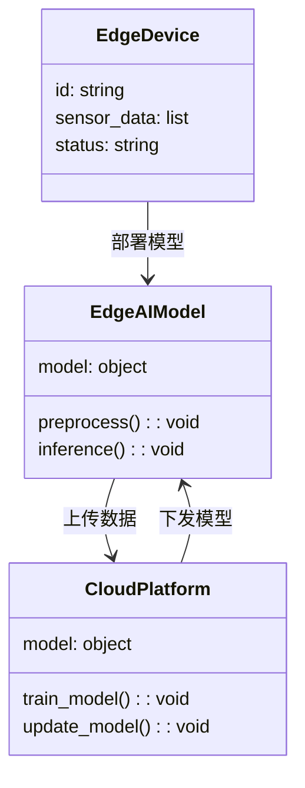
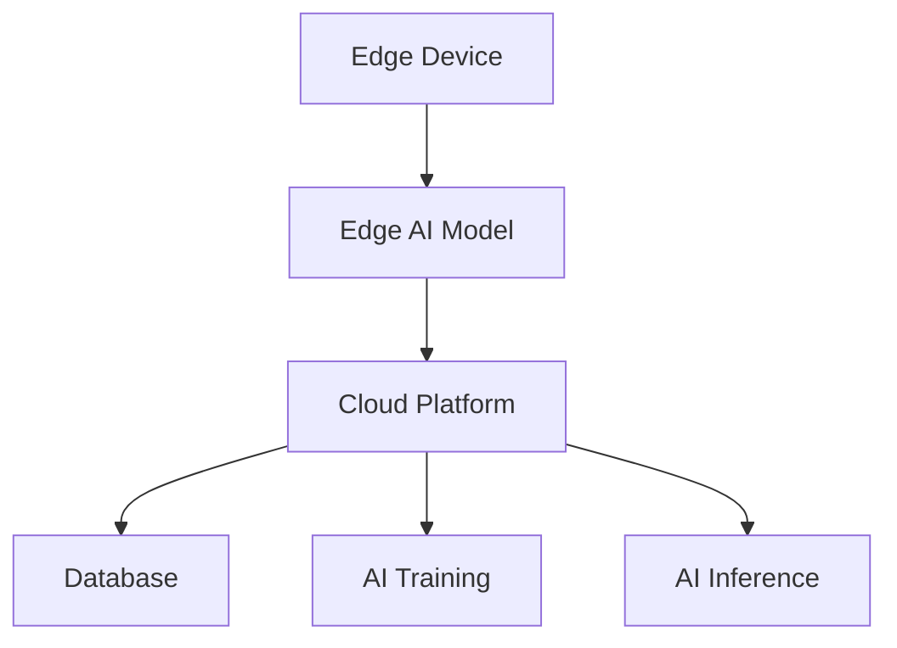
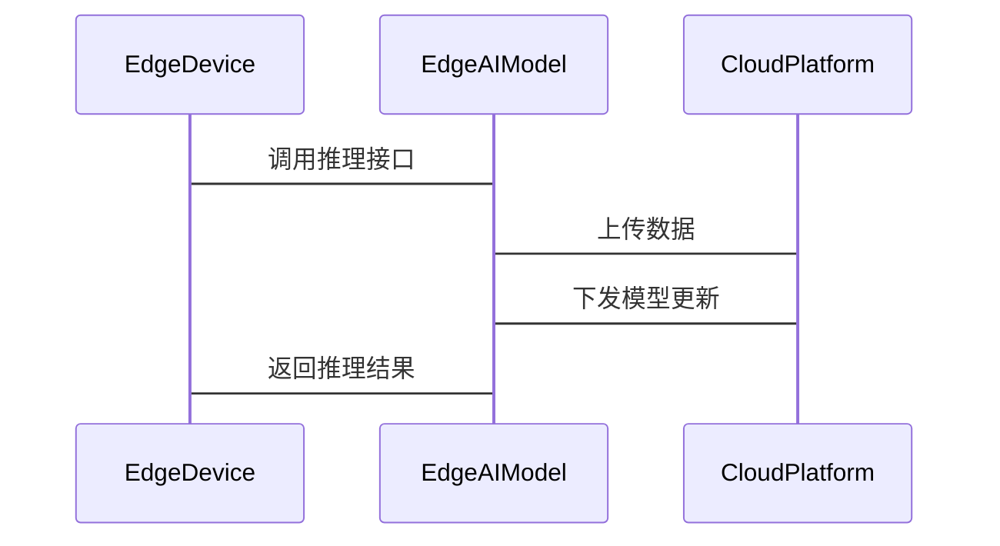

                 


# 如何识别企业的边缘AI计算优势

> 关键词：边缘AI计算，企业优势，系统架构，算法原理，项目实战

> 摘要：边缘AI计算作为一种新兴的技术架构，正在逐步成为企业数字化转型的重要推动力。本文通过详细分析边缘AI计算的核心概念、算法原理、系统架构以及实际应用场景，帮助企业识别和挖掘边缘AI计算的优势，并通过实际案例分析和项目实战，为企业在边缘AI计算领域的应用提供指导和建议。

---

# 第一部分: 企业边缘AI计算的背景与概念

# 第1章: 边缘AI计算的背景与定义

## 1.1 边缘AI计算的定义与特征

### 1.1.1 边缘AI计算的定义

边缘AI计算（Edge AI）是指在靠近数据源的边缘设备上直接进行人工智能计算的技术。与传统的云计算模式不同，边缘AI计算将AI模型部署在边缘端，能够在本地完成数据的实时处理、分析和决策。

**关键术语说明：**
- **边缘设备**：包括但不限于传感器、摄像头、智能终端、嵌入式设备等。
- **边缘计算**：在靠近数据源的地方进行数据处理和分析，减少数据传输的延迟和带宽消耗。
- **AI模型**：经过训练的机器学习模型，用于在边缘设备上进行推理和决策。

### 1.1.2 边缘AI计算的核心特征

- **实时性**：边缘AI计算能够在数据生成的瞬间完成处理和反馈，极大地降低了延迟。
- **本地化**：数据在边缘设备上直接处理，减少了对云端依赖，提高了系统的鲁棒性和安全性。
- **分布式**：边缘AI计算通常采用分布式架构，能够同时处理多个边缘设备的数据。

### 1.1.3 边缘AI计算与云计算的对比

| 特性            | 边缘AI计算               | 云计算                     |
|-----------------|--------------------------|---------------------------|
| 数据处理位置    | 边缘设备                 | 云端服务器                 |
| 延迟             | 极低（几毫秒级别）       | 较高（百毫秒级别）         |
| 网络依赖         | 较低                     | 较高                       |
| 数据隐私         | 更高                     | 较低                       |

---

## 1.2 边缘AI计算的优势与应用场景

### 1.2.1 边缘AI计算的优势

- **低延迟**：边缘AI计算能够实时处理数据，适用于需要快速响应的场景，如自动驾驶、工业自动化等。
- **带宽优化**：通过在边缘设备上进行数据处理，可以减少需要传输到云端的数据量，从而节省带宽。
- **隐私与安全**：边缘AI计算能够在本地处理敏感数据，减少数据在传输过程中被截获的风险。

### 1.2.2 边缘AI计算的应用场景

- **智能制造**：在工业生产线上，边缘AI计算可以实时监控设备状态，预测故障，优化生产流程。
- **智慧城市**：通过边缘AI计算，可以实时分析交通流量、环境监测数据，优化城市管理。
- **医疗健康**：在医疗设备中部署边缘AI模型，可以实时分析患者的生理数据，辅助医生进行诊断。

### 1.2.3 边缘AI计算的潜在价值

- **提升效率**：通过实时数据处理，企业能够更快地做出决策，提高运营效率。
- **降低成本**：边缘AI计算减少了对云端资源的依赖，降低了企业的运营成本。
- **增强用户体验**：通过实时响应，用户能够获得更流畅、更个性化的服务体验。

---

## 1.3 边缘AI计算的挑战与解决方案

### 1.3.1 边缘AI计算的主要挑战

- **计算资源限制**：边缘设备通常计算能力有限，难以支持复杂的AI模型。
- **数据一致性**：边缘设备的数据可能存在不一致或不完整的情况，影响模型的准确性。
- **安全性问题**：边缘设备容易成为攻击目标，数据在本地处理可能面临更多的安全风险。

### 1.3.2 边缘AI计算的解决方案

- **模型优化**：通过模型压缩、剪枝、量化等技术，降低模型的计算复杂度，使其能够在边缘设备上运行。
- **边缘协同计算**：通过多设备协同计算，分担单个设备的计算压力，提升整体性能。
- **安全增强**：采用加密技术、访问控制等手段，确保边缘设备的数据安全。

### 1.3.3 边缘AI计算的未来趋势

- **智能化升级**：随着AI技术的不断进步，边缘AI计算将更加智能化，能够处理更复杂的任务。
- **边缘云融合**：边缘AI计算将与云计算结合，形成更加灵活的计算架构，实现资源的最优利用。
- **生态化发展**：边缘AI计算的生态系统将更加完善，涵盖硬件、软件、服务等多个方面。

---

## 1.4 本章小结

本章从边缘AI计算的基本概念出发，详细介绍了其定义、核心特征以及与云计算的对比。接着，分析了边缘AI计算的优势与应用场景，并讨论了其面临的挑战与解决方案。最后，展望了边缘AI计算的未来发展趋势。

---

# 第2章: 边缘AI计算的核心概念

## 2.1 边缘AI计算的核心概念

### 2.1.1 边缘计算的定义与特点

边缘计算是一种分布式计算范式，强调在靠近数据源的地方进行数据处理和分析。其特点包括低延迟、高实时性、本地化数据处理等。

### 2.1.2 AI计算的核心原理

AI计算通过机器学习模型对数据进行分析、推理和预测。核心步骤包括数据预处理、模型训练、模型部署和模型推理。

### 2.1.3 边缘AI计算的系统架构

边缘AI计算的系统架构通常包括以下几个部分：
1. **边缘设备**：数据采集和初步处理的设备。
2. **边缘计算平台**：负责对边缘设备的数据进行处理、分析和存储。
3. **云端平台**：提供模型训练、数据存储和管理功能。

---

## 2.2 边缘AI计算的关键技术

### 2.2.1 边缘计算的关键技术

- **数据采集与处理**：通过传感器、摄像头等设备采集数据，并进行预处理。
- **数据通信**：通过边缘网关将数据传输到云端或在边缘设备之间进行通信。

### 2.2.2 AI计算的关键技术

- **模型训练**：使用深度学习框架（如TensorFlow、PyTorch）对模型进行训练。
- **模型部署**：将训练好的模型部署到边缘设备上，进行实时推理。

### 2.2.3 边缘AI计算的融合技术

- **模型压缩**：通过剪枝、量化等技术减少模型的大小和计算复杂度。
- **轻量化设计**：优化模型结构，使其能够在资源受限的设备上运行。

---

## 2.3 边缘AI计算的实体关系图

以下是一个简单的实体关系图（ER图），展示了边缘AI计算系统中的核心实体及其关系：

```mermaid
er
    actor: 用户
    device: 边缘设备
    model: AI模型
    cloud: 云端平台

    actor --> device: 使用
    device --> model: 部署
    model --> cloud: 训练
    device --> cloud: 上传数据
```

---

## 2.4 本章小结

本章详细介绍了边缘AI计算的核心概念，包括边缘计算和AI计算的定义与特点，以及边缘AI计算的系统架构。通过实体关系图，展示了边缘AI计算系统中各实体之间的关系。

---

# 第3章: 边缘AI计算的算法原理与数学模型

## 3.1 边缘AI计算的算法概述

### 3.1.1 边缘AI计算的算法特点

- **实时性**：算法需要在边缘设备上快速完成推理。
- **轻量化**：算法需要在计算资源有限的设备上运行。
- **鲁棒性**：算法需要能够处理噪声、缺失数据等问题。

### 3.1.2 边缘AI计算的算法分类

- **分类算法**：如支持向量机（SVM）、随机森林（Random Forest）、卷积神经网络（CNN）等。
- **回归算法**：如线性回归、逻辑回归、梯度下降等。
- **聚类算法**：如K-means、DBSCAN等。

---

## 3.2 边缘AI计算的数学模型

### 3.2.1 边缘AI计算的基本数学模型

**线性回归模型**：
$$ y = \beta_0 + \beta_1 x + \epsilon $$
其中，$y$ 是目标变量，$x$ 是自变量，$\beta_0$ 和 $\beta_1$ 是模型参数，$\epsilon$ 是误差项。

**逻辑回归模型**：
$$ P(Y=1|X) = \frac{1}{1 + e^{-\beta X}} $$
其中，$X$ 是输入特征，$\beta$ 是模型参数。

### 3.2.2 边缘AI计算的优化数学模型

**模型压缩**：
- 剪枝：通过去除冗余的神经网络节点，减少模型的大小。
- 量化：将模型的权重和激活值从浮点数转换为更小的整数类型，降低存储和计算成本。

**模型轻量化**：
- 知识蒸馏：通过将复杂的模型（教师模型）的知识迁移到简单的模型（学生模型）中，提升学生的性能。
- 模型剪枝：通过去除对模型性能影响较小的神经网络节点，减少模型的计算复杂度。

---

## 3.3 边缘AI计算的算法实现

### 3.3.1 模型压缩与轻量化设计

以下是一个简单的模型剪枝示例代码：

```python
import tensorflow as tf
from tensorflow.keras import layers

# 创建一个简单的卷积神经网络
model = tf.keras.Sequential([
    layers.Conv2D(32, (3,3), activation='relu', input_shape=(28, 28, 1)),
    layers.MaxPooling2D((2,2)),
    layers.Conv2D(64, (3,3), activation='relu'),
    layers.MaxPooling2D((2,2)),
    layers.Flatten(),
    layers.Dense(128, activation='relu'),
    layers.Dense(10, activation='softmax')
])

# 编译模型
model.compile(optimizer='adam', loss='sparse_categorical_crossentropy', metrics=['accuracy'])

# 训练模型
model.fit(x_train, y_train, epochs=5, batch_size=32)

# 模型剪枝：去除最后一层Dense层
pruned_model = tf.keras.Sequential([
    layers.Conv2D(32, (3,3), activation='relu', input_shape=(28, 28, 1)),
    layers.MaxPooling2D((2,2)),
    layers.Conv2D(64, (3,3), activation='relu'),
    layers.MaxPooling2D((2,2)),
    layers.Flatten(),
    layers.Dense(64, activation='relu')
])

# 将pruned_model的输出层替换为与原模型相同的输出层
pruned_model.add(layers.Dense(10, activation='softmax'))
```

### 3.3.2 模型优化与部署

以下是一个模型优化的代码示例：

```python
import tensorflow.lite as tflite

# 将Keras模型转换为TFLite模型
converter = tf.lite.TFLiteConverter.from_keras_model(model)
tflite_model = converter.convert()

# 保存TFLite模型
with open('edge_model.tflite', 'wb') as f:
    f.write(tflite_model)
```

---

## 3.4 本章小结

本章详细介绍了边缘AI计算的算法原理，包括算法的特点、分类以及数学模型。通过具体的代码示例，展示了如何在边缘设备上实现模型压缩和轻量化设计，以适应资源受限的计算环境。

---

# 第4章: 边缘AI计算的系统架构设计

## 4.1 问题场景介绍

### 4.1.1 问题背景

在智能制造领域，企业需要实时监控生产线上的设备状态，预测可能的故障，并及时进行维护。传统的云计算模式由于延迟较高，难以满足实时性的要求。

### 4.1.2 问题描述

- 数据量大：生产线上的设备会产生大量的传感器数据。
- 实时性要求高：需要快速完成数据处理和决策。
- 数据隐私性高：设备状态数据属于企业核心数据，需要在本地处理。

---

## 4.2 系统功能设计

### 4.2.1 领域模型设计

以下是一个简单的领域模型类图：



---

## 4.3 系统架构设计

### 4.3.1 系统架构图

以下是一个边缘AI计算系统的架构图：



---

## 4.4 系统接口设计

### 4.4.1 接口设计

- **设备与模型接口**：设备调用模型进行推理。
- **模型与云端接口**：模型从云端获取更新和训练数据。
- **云端与数据库接口**：云端将数据存储到数据库中。

### 4.4.2 交互序列图

以下是一个设备、模型和云端的交互序列图：



---

## 4.5 本章小结

本章通过一个智能制造的实际案例，介绍了边缘AI计算系统的架构设计，包括领域模型设计、系统架构图以及接口设计。通过交互序列图，展示了系统中各组件之间的协作关系。

---

# 第5章: 边缘AI计算的项目实战

## 5.1 项目环境安装

### 5.1.1 安装Python环境

```bash
python --version
pip install --upgrade pip
```

### 5.1.2 安装TensorFlow和Keras

```bash
pip install tensorflow==2.10.0
pip install keras==2.11.0
```

---

## 5.2 系统核心实现

### 5.2.1 边缘设备上的模型部署

```python
import tensorflow.lite as tflite

# 加载TFLite模型
interpreter = tflite.Interpreter(model_path="edge_model.tflite")
interpreter.allocate_tensors()

# 获取输入和输出张量
input_tensor = interpreter.get_input_details()[0]
output_tensor = interpreter.get_output_details()[0]

# 执行推理
input_data = ...  # 输入数据
interpreter.set_tensor(input_tensor['index'], input_data)
interpreter.invoke()
output_data = interpreter.get_tensor(output_tensor['index'])
```

---

## 5.3 代码实现与分析

### 5.3.1 模型训练代码

```python
import tensorflow as tf
from tensorflow.keras import layers

# 创建简单的卷积神经网络
model = tf.keras.Sequential([
    layers.Conv2D(32, (3,3), activation='relu', input_shape=(28, 28, 1)),
    layers.MaxPooling2D((2,2)),
    layers.Conv2D(64, (3,3), activation='relu'),
    layers.MaxPooling2D((2,2)),
    layers.Flatten(),
    layers.Dense(128, activation='relu'),
    layers.Dense(10, activation='softmax')
])

# 编译模型
model.compile(optimizer='adam', loss='sparse_categorical_crossentropy', metrics=['accuracy'])

# 训练模型
model.fit(x_train, y_train, epochs=5, batch_size=32)
```

### 5.3.2 模型压缩代码

```python
# 将Keras模型转换为TFLite模型
converter = tf.lite.TFLiteConverter.from_keras_model(model)
tflite_model = converter.convert()

# 保存TFLite模型
with open('edge_model.tflite', 'wb') as f:
    f.write(tflite_model)
```

---

## 5.4 实际案例分析

### 5.4.1 案例背景

某制造企业需要实时监控生产线上的设备状态，预测可能的故障。

### 5.4.2 案例分析

通过在边缘设备上部署轻量化的AI模型，企业能够实时分析设备状态数据，预测可能的故障，并在第一时间进行维护，避免生产中断。

---

## 5.5 本章小结

本章通过一个实际案例，详细介绍了边缘AI计算项目的环境安装、核心实现以及代码分析。通过案例分析，展示了如何在实际应用中部署和优化边缘AI模型。

---

# 第6章: 边缘AI计算的总结与展望

## 6.1 本章总结

本文详细介绍了边缘AI计算的核心概念、算法原理、系统架构以及实际应用场景。通过具体的代码示例和案例分析，展示了如何在企业中识别和挖掘边缘AI计算的优势。

---

## 6.2 未来展望

随着AI技术的不断进步，边缘AI计算将在更多领域得到广泛应用。未来的研究方向包括：
1. **模型优化**：进一步提升模型的轻量化和计算效率。
2. **安全性增强**：加强边缘设备的安全防护，防止数据泄露和攻击。
3. **智能化升级**：通过自适应算法，使边缘AI系统更加智能和灵活。

---

## 6.3 最佳实践 Tips

- **模型选择**：根据实际需求选择合适的模型，避免过度复杂的模型。
- **资源优化**：合理分配计算资源，确保模型能够在边缘设备上高效运行。
- **安全防护**：加强边缘设备的安全措施，保护数据隐私。

---

## 6.4 本章小结

本章总结了全文的主要内容，并展望了边缘AI计算的未来发展方向。同时，提出了在实际应用中的最佳实践建议，帮助企业更好地识别和利用边缘AI计算的优势。

---

# 作者：AI天才研究院/AI Genius Institute & 禅与计算机程序设计艺术/Zen And The Art of Computer Programming

---

**本文通过详细分析边缘AI计算的核心概念、算法原理、系统架构以及实际应用场景，帮助企业识别和挖掘边缘AI计算的优势，并通过实际案例分析和项目实战，为企业在边缘AI计算领域的应用提供指导和建议。**

