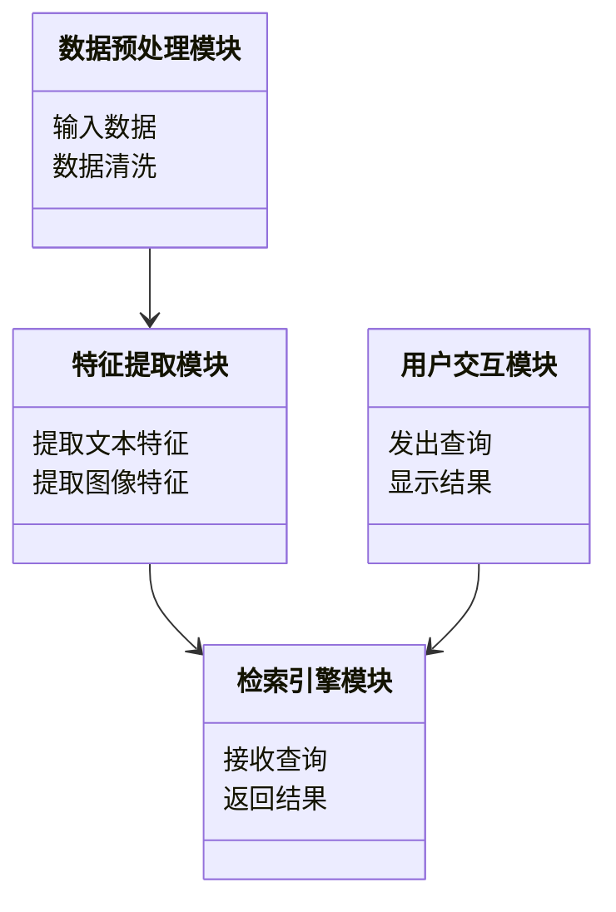
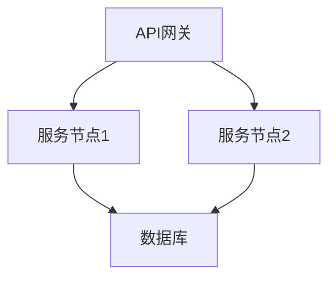
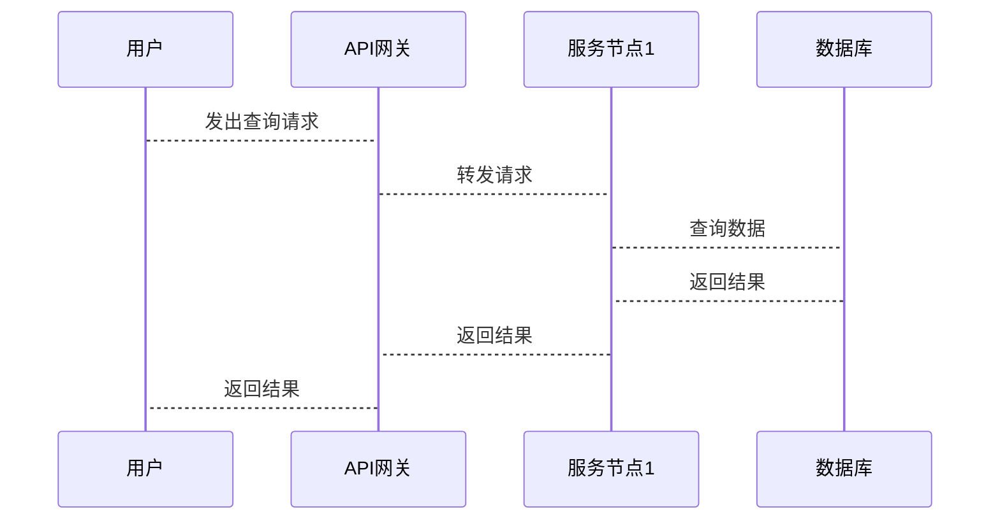

                 


# 实现AI Agent的跨模态检索能力

> 关键词：AI Agent，跨模态检索，多模态数据，对比学习，机器学习，深度学习

> 摘要：本文详细探讨了实现AI Agent的跨模态检索能力的关键技术，包括跨模态检索的核心概念、算法原理、系统架构设计、项目实战以及最佳实践。通过理论与实践的结合，深入分析了AI Agent在跨模态检索中的实现路径，为读者提供了从基础到应用的全面指导。

---

## 第1章：AI Agent与跨模态检索的背景介绍

### 1.1 问题背景

#### 1.1.1 跨模态检索的定义与问题背景

跨模态检索是指在不同数据类型（如文本、图像、音频、视频等）之间进行信息检索的过程。传统的信息检索技术主要针对单模态数据（如文本或图像），而跨模态检索则需要处理多种数据类型之间的关联与转换。

AI Agent是一种能够自主感知环境、执行任务并做出决策的智能实体。为了使AI Agent具备强大的信息处理能力，跨模态检索技术是不可或缺的。例如，用户可以通过语音指令让AI Agent检索相关图像或文档，这种能力依赖于跨模态检索的支持。

#### 1.1.2 AI Agent的核心概念与应用场景

AI Agent的核心能力包括感知、推理、决策和执行。在跨模态检索中，AI Agent需要能够理解多种数据类型，并将其转化为可检索的形式。应用场景包括智能助手、智能客服、智能推荐系统等。

#### 1.1.3 跨模态检索在AI Agent中的重要性

跨模态检索能够提升AI Agent的用户体验和功能扩展性。通过跨模态检索，AI Agent可以更全面地理解用户需求，并提供更精准的结果。

### 1.2 问题描述

#### 1.2.1 跨模态检索的核心问题

跨模态检索的核心问题是如何在不同数据类型之间建立有效的关联，并实现高效检索。这需要解决数据表示、特征提取和检索策略等问题。

#### 1.2.2 AI Agent在跨模态检索中的目标与挑战

AI Agent的目标是通过跨模态检索技术，实现对多种数据类型的信息整合与检索。挑战包括如何处理数据异构性、如何提高检索效率以及如何保证检索结果的准确性。

#### 1.2.3 跨模态检索的实际应用场景

实际应用场景包括图像搜索、语音搜索、多模态问答系统等。例如，用户可以通过输入文本查询相关图像，或者通过图像查询相关文本。

### 1.3 问题解决

#### 1.3.1 跨模态检索的解决方案概述

跨模态检索的解决方案包括多模态编码器、对比学习、检索增强等技术。这些技术能够帮助AI Agent在不同数据类型之间建立有效的关联。

#### 1.3.2 AI Agent在跨模态检索中的实现路径

实现路径包括数据预处理、特征提取、检索模型训练以及系统集成。通过这些步骤，AI Agent可以实现跨模态检索能力。

#### 1.3.3 跨模态检索的技术选型与实现策略

技术选型需要考虑数据类型、检索效率和准确性。实现策略包括使用预训练模型、优化检索算法以及提升系统可扩展性。

### 1.4 边界与外延

#### 1.4.1 跨模态检索的边界条件

跨模态检索的边界条件包括数据类型、检索范围和检索精度。AI Agent需要在特定范围内进行检索，并保证结果的准确性。

#### 1.4.2 AI Agent的跨模态检索能力的外延

跨模态检索能力的外延包括多模态数据处理、检索结果优化和用户体验提升。AI Agent需要能够处理多种数据类型，并提供高质量的检索结果。

#### 1.4.3 跨模态检索与其他相关技术的区分

跨模态检索与单模态检索的主要区别在于处理数据类型的多样性。跨模态检索涉及多种数据类型，而单模态检索仅处理单一数据类型。

### 1.5 概念结构与核心要素

#### 1.5.1 跨模态检索的核心要素

跨模态检索的核心要素包括数据表示、特征提取、检索算法和结果优化。这些要素共同构成了跨模态检索的能力。

#### 1.5.2 AI Agent的跨模态检索能力的组成

AI Agent的跨模态检索能力由感知模块、推理模块和执行模块组成。感知模块负责数据采集，推理模块负责关联分析，执行模块负责检索操作。

#### 1.5.3 跨模态检索与AI Agent的协同关系

跨模态检索为AI Agent提供了多模态数据处理能力，而AI Agent则通过跨模态检索技术实现更智能的信息检索与处理。

---

## 第2章：跨模态检索的核心概念与联系

### 2.1 跨模态检索的基本原理

#### 2.1.1 跨模态数据的定义与特点

跨模态数据是指来自不同数据类型的多源数据，例如文本、图像、音频等。跨模态数据的特点是异构性和多样性。

#### 2.1.2 跨模态检索的实现原理

跨模态检索的实现原理包括数据表示、特征提取和检索策略。通过将不同数据类型转换为统一的表示形式，可以实现跨模态检索。

#### 2.1.3 跨模态检索与单模态检索的对比分析

单模态检索仅处理单一数据类型，而跨模态检索能够处理多种数据类型。跨模态检索在数据处理和检索结果方面更具挑战性。

### 2.2 跨模态检索的核心算法与模型

#### 2.2.1 多模态编码器的原理

多模态编码器通过将不同数据类型映射到统一的特征空间，实现跨模态检索。编码器通常包括文本编码器和图像编码器。

#### 2.2.2 对比学习在跨模态检索中的应用

对比学习通过最大化不同数据类型之间的相似性，提升跨模态检索的效果。对比学习广泛应用于图像-文本检索任务中。

#### 2.2.3 跨模态检索模型的实现

跨模态检索模型通常包括编码器、检索器和优化器。编码器负责特征提取，检索器负责匹配，优化器负责模型训练。

---

### 2.3 跨模态检索与AI Agent的结合

#### 2.3.1 AI Agent利用跨模态检索技术的核心优势

AI Agent通过跨模态检索技术，能够实现多模态数据的高效处理与检索。这使得AI Agent在智能问答、智能推荐等领域更具竞争力。

#### 2.3.2 跨模态检索在AI Agent中的具体应用场景

应用场景包括图像搜索、语音搜索、多模态问答系统等。AI Agent可以通过跨模态检索技术，为用户提供更丰富的信息检索方式。

#### 2.3.3 跨模态检索与AI Agent的协同关系

跨模态检索为AI Agent提供了多模态数据处理能力，而AI Agent则通过跨模态检索技术实现更智能的信息检索与处理。

---

## 第3章：跨模态检索算法原理与数学模型

### 3.1 多模态编码器的实现原理

#### 3.1.1 多模态编码器的基本结构

多模态编码器通常包括文本编码器和图像编码器。文本编码器将文本转换为向量表示，图像编码器将图像转换为向量表示。

#### 3.1.2 多模态编码器的训练策略

多模态编码器的训练策略包括对比学习和任务驱动学习。对比学习通过最大化不同数据类型之间的相似性，提升编码器的性能。

---

#### 3.1.3 多模态编码器的数学模型

文本编码器的数学模型可以表示为：

$$ f_{text}(x) = g(x) $$

其中，$x$ 表示输入文本，$g$ 表示编码函数，$f_{text}(x)$ 表示文本的向量表示。

图像编码器的数学模型可以表示为：

$$ f_{image}(x) = h(x) $$

其中，$x$ 表示输入图像，$h$ 表示编码函数，$f_{image}(x)$ 表示图像的向量表示。

---

### 3.2 对比学习算法

#### 3.2.1 对比学习的核心思想

对比学习的核心思想是通过最大化正样本之间的相似性，同时最小化负样本之间的相似性，提升模型的区分能力。

#### 3.2.2 对比学习的数学模型

对比学习的损失函数可以表示为：

$$ L = -\log \frac{\exp(s(x_i, x_j))}{\sum_{k} \exp(s(x_i, x_k))} $$

其中，$s(x_i, x_j)$ 表示样本 $i$ 和样本 $j$ 之间的相似性得分。

---

### 3.3 跨模态检索的数学模型

#### 3.3.1 跨模态检索的核心公式

跨模态检索的核心公式可以表示为：

$$ \text{score}(x_i, y_j) = f(x_i) \cdot f(y_j) $$

其中，$x_i$ 表示文本查询，$y_j$ 表示图像结果，$f$ 表示编码函数，$\text{score}$ 表示匹配分数。

---

## 第4章：系统分析与架构设计

### 4.1 问题场景与项目介绍

#### 4.1.1 问题场景介绍

问题场景是一个AI Agent需要通过跨模态检索技术，为用户提供多模态数据的检索服务。用户可以通过文本或图像进行查询，系统返回相关结果。

#### 4.1.2 项目介绍

项目目标是实现一个支持跨模态检索的AI Agent系统。系统需要具备文本-图像检索、图像-文本检索等功能。

---

### 4.2 系统功能设计

#### 4.2.1 系统功能模块

系统功能模块包括数据预处理模块、特征提取模块、检索引擎模块和用户交互模块。

#### 4.2.2 系统功能的领域模型

领域模型可以用Mermaid类图表示：



---

### 4.3 系统架构设计

#### 4.3.1 系统架构的总体设计

系统架构采用微服务架构，包括API网关、服务节点和数据库。API网关负责接收请求，服务节点负责处理请求，数据库负责存储数据。

#### 4.3.2 系统架构的详细设计

系统架构可以用Mermaid架构图表示：



---

### 4.4 系统接口设计

#### 4.4.1 系统接口的设计

系统接口采用RESTful API设计，例如：

- POST /search
- 参数：查询内容、数据类型
- 返回：检索结果

---

### 4.5 系统交互流程

#### 4.5.1 系统交互的流程图

系统交互流程可以用Mermaid序列图表示：



---

## 第5章：项目实战与实现

### 5.1 环境搭建

#### 5.1.1 环境需求

- Python 3.8+
- TensorFlow 2.0+
- Keras 2.4+
- numpy 1.20+

安装命令：

```bash
pip install python>=3.8
pip install tensorflow>=2.0
pip install keras>=2.4
pip install numpy>=1.20
```

---

### 5.2 核心功能实现

#### 5.2.1 数据预处理模块

数据预处理模块负责将文本和图像数据转换为统一的向量表示。代码示例：

```python
import tensorflow as tf
from tensorflow.keras.layers import Dense, Input
from tensorflow.keras.models import Model

def text_encoder():
    input_text = Input(shape=(None, 128))
    x = Dense(128, activation='relu')(input_text)
    x = Dense(64, activation='relu')(x)
    x = Dense(32, activation='relu')(x)
    return Model(inputs=input_text, outputs=x)

text_model = text_encoder()
```

---

#### 5.2.2 特征提取模块

特征提取模块负责提取文本和图像的特征向量。代码示例：

```python
import tensorflow as tf
from tensorflow.keras.layers import Dense, Input
from tensorflow.keras.models import Model

def image_encoder():
    input_image = Input(shape=(224, 224, 3))
    x = tf.keras.applications.vgg16.VGG16(weights='imagenet', include_top=False)(input_image)
    x = Dense(128, activation='relu')(x)
    x = Dense(64, activation='relu')(x)
    x = Dense(32, activation='relu')(x)
    return Model(inputs=input_image, outputs=x)

image_model = image_encoder()
```

---

#### 5.2.3 检索引擎模块

检索引擎模块负责接收查询并返回结果。代码示例：

```python
import numpy as np

def search(query, data):
    query_vec = query_encoder(query)
    scores = np.dot(data, query_vec)
    return np.argsort(scores)[::-1]

query_vec = text_model.predict(new_query)
results = search(query_vec, image_features)
```

---

### 5.3 实际案例分析

#### 5.3.1 案例介绍

用户输入文本查询“猫”，系统返回相关图像结果。

#### 5.3.2 系统处理流程

1. 用户输入查询“猫”。
2. 文本编码器将查询转换为向量。
3. 图像编码器将图像数据转换为向量。
4. 检索引擎计算相似性得分。
5. 系统返回相关图像结果。

---

## 第6章：最佳实践与总结

### 6.1 性能优化技巧

- 使用分布式索引优化检索效率。
- 采用缓存机制减少重复查询。
- 定期更新特征库以保持准确性。

---

### 6.2 小结与总结

本文详细探讨了实现AI Agent的跨模态检索能力的关键技术，包括核心概念、算法原理、系统架构设计和项目实战。通过理论与实践的结合，为读者提供了从基础到应用的全面指导。

---

### 6.3 注意事项

- 在处理大数据时，需要注意内存和计算资源的限制。
- 在模型调参时，需要进行充分的实验和验证。

---

### 6.4 拓展阅读

- 推荐阅读相关论文：《Contrastive Learning for Cross-Modal Retrieval》。
- 推荐学习工具：TensorFlow官方文档、Keras官方文档。

---

## 作者：AI天才研究院/AI Genius Institute & 禅与计算机程序设计艺术 /Zen And The Art of Computer Programming

