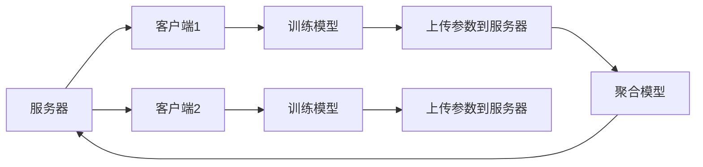
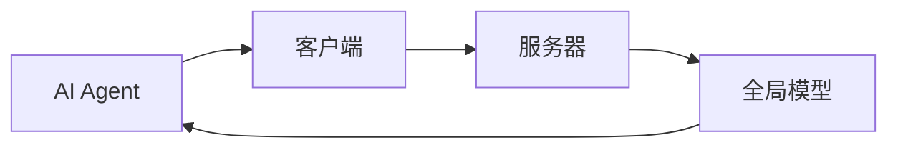

                 


# 开发具有联邦学习能力的AI Agent

> 关键词：联邦学习，AI Agent，分布式学习，多智能体协作，隐私保护

> 摘要：本文深入探讨了开发具有联邦学习能力的AI Agent的关键技术，从联邦学习的核心概念到AI Agent的架构设计，从算法原理到系统实现，全面解析了如何将联邦学习能力融入AI Agent中，提升其智能性和协作能力。

---

# 第1章: 联邦学习与AI Agent概述

## 1.1 联邦学习的定义与背景

### 1.1.1 什么是联邦学习
联邦学习（Federated Learning）是一种分布式机器学习技术，旨在在不共享原始数据的前提下，通过数据局部建模和模型参数同步，实现全局模型的优化。其核心思想是“数据不动，模型动”，即数据保留在本地，仅模型参数在服务器和客户端之间同步。

### 1.1.2 联邦学习的背景与意义
随着数据隐私和安全问题的日益突出，联邦学习成为解决数据共享难题的重要技术。通过联邦学习，可以在保护数据隐私的前提下，实现跨机构、跨设备的协作学习，提升模型的泛化能力和性能。

### 1.1.3 联邦学习的核心特点
- **数据本地性**：数据不离开原始设备或机构。
- **模型同步**：模型参数在服务器和客户端之间同步。
- **隐私保护**：通过加密和差分隐私等技术保护数据隐私。

---

## 1.2 AI Agent的定义与特点

### 1.2.1 什么是AI Agent
AI Agent（人工智能代理）是一种能够感知环境、自主决策并执行任务的智能体。它通常具备以下特点：
- **自主性**：无需外部干预，自主完成任务。
- **反应性**：能够感知环境并实时调整行为。
- **目标导向**：基于目标进行决策和行动。

### 1.2.2 AI Agent的核心特点
- **智能性**：能够理解和推理复杂问题。
- **适应性**：能够在动态环境中调整策略。
- **协作性**：能够与其他AI Agent或人类协同工作。

### 1.2.3 AI Agent与传统AI的区别
AI Agent不仅仅是静态的模型或算法，而是具备动态决策和执行能力的实体。它能够与环境和用户进行交互，实时调整行为以实现目标。

---

## 1.3 联邦学习与AI Agent的结合

### 1.3.1 联邦学习在AI Agent中的应用
联邦学习可以为AI Agent提供分布式协作能力，使其能够在不共享数据的情况下，与其他AI Agent或服务器协同训练模型。

### 1.3.2 联邦学习如何增强AI Agent的能力
- **数据隐私保护**：通过联邦学习，AI Agent可以在本地数据上训练模型，避免数据泄露。
- **全局协作**：多个AI Agent可以通过联邦学习协作训练，提升模型的泛化能力。
- **分布式决策**：AI Agent可以在本地模型基础上，结合全局模型进行决策，提升决策的准确性和鲁棒性。

### 1.3.3 联邦学习与AI Agent结合的意义
通过结合联邦学习，AI Agent可以在保护数据隐私的前提下，实现更强大的协作和决策能力，为智能城市、智能医疗、智能金融等领域提供更高效的解决方案。

---

## 1.4 本章小结
本章介绍了联邦学习和AI Agent的核心概念，并探讨了它们结合的意义和价值。联邦学习为AI Agent提供了分布式协作的能力，而AI Agent则为联邦学习提供了动态决策和执行的实体，两者结合将推动人工智能技术的发展。

---

# 第2章: 联邦学习的核心概念与原理

## 2.1 联邦学习的核心概念

### 2.1.1 联邦学习的基本概念
联邦学习通过在多个客户端（设备或机构）上进行局部模型训练，并将模型参数上传到服务器进行全局模型聚合，最终生成一个高性能的全局模型。

### 2.1.2 联邦学习的参与方
- **客户端**：数据保留在本地，进行局部模型训练。
- **服务器**：接收客户端上传的模型参数，进行全局模型聚合。

### 2.1.3 联邦学习的通信机制
联邦学习通过客户端与服务器之间的通信，实现模型参数的同步。通信机制包括数据加密、差分隐私等技术，确保数据隐私和安全。

---

## 2.2 联邦学习的原理

### 2.2.1 联邦学习的数学模型
联邦学习的核心是通过优化算法在多个客户端上进行局部优化，并在服务器端进行全局优化。常用算法包括联邦平均（FedAvg）和联邦聚合（FedSGD）。

#### 联邦平均（FedAvg）算法
$$ \text{全局模型更新} = \frac{1}{K} \sum_{k=1}^{K} \theta_k $$
其中，\( K \) 是客户端数量，\( \theta_k \) 是第 \( k \) 个客户端的模型参数。

#### 联邦聚合（FedSGD）算法
$$ \text{全局模型更新} = \sum_{k=1}^{K} \frac{\eta_k}{K} \theta_k $$
其中，\( \eta_k \) 是第 \( k \) 个客户端的步长。

### 2.2.2 联邦学习的算法流程
1. 服务器初始化全局模型参数。
2. 客户端下载全局模型参数，并在本地数据上进行训练，生成局部模型参数。
3. 客户端将局部模型参数上传到服务器。
4. 服务器聚合所有客户端的模型参数，更新全局模型。
5. 重复步骤2-4，直到模型收敛或达到预设的训练轮数。

### 2.2.3 联邦学习的同步机制
联邦学习的同步机制包括同步更新和异步更新。同步更新要求所有客户端在每一轮训练中同时更新模型，而异步更新允许客户端在不同时间点更新模型。

---

## 2.3 联邦学习的核心算法

### 2.3.1 联邦平均算法（FedAvg）
FedAvg 是联邦学习中最常用的算法之一。其核心思想是通过加权平均的方式，将所有客户端的模型参数聚合到全局模型中。

#### FedAvg 算法流程


#### FedAvg 代码实现
```python
import numpy as np

class FedAvgServer:
    def __init__(self, client_num):
        self.client_num = client_num
        self.global_model = np.zeros((input_dim, output_dim))

    def aggregate(self, client_models):
        avg_model = np.mean(client_models, axis=0)
        self.global_model = avg_model

class FedAvgClient:
    def __init__(self, global_model):
        self.global_model = global_model
        self.local_model = np.zeros((input_dim, output_dim))

    def train(self, data, epochs):
        # 在本地数据上训练模型
        for _ in range(epochs):
            for x, y in data:
                # 更新模型
                pass
        return self.local_model
```

### 2.3.2 联邦聚合算法（FedSGD）
FedSGD 是另一种常见的联邦学习算法，其核心思想是将所有客户端的模型参数加权聚合到全局模型中。

#### FedSGD 算法流程


---

## 2.4 本章小结
本章详细介绍了联邦学习的核心概念和原理，包括其参与方、通信机制、数学模型和算法流程。通过FedAvg和FedSGD算法的讲解，读者可以理解联邦学习的基本实现方式。

---

# 第3章: AI Agent的核心能力与架构

## 3.1 AI Agent的核心能力

### 3.1.1 自主决策能力
AI Agent能够基于当前状态和环境信息，自主选择最优行动方案。

### 3.1.2 多目标优化能力
AI Agent能够在多个目标之间进行权衡，找到最优解决方案。

### 3.1.3 联邦学习能力
AI Agent能够通过联邦学习技术，与其他客户端或AI Agent协作训练模型，提升自身的智能水平。

---

## 3.2 AI Agent的架构设计

### 3.2.1 AI Agent的基本架构
AI Agent通常包括感知层、决策层和执行层。

#### 感知层
负责感知环境信息，如传感器数据、用户输入等。

#### 决策层
基于感知层的信息，进行推理和决策，生成行动方案。

#### 执行层
根据决策层的指令，执行具体行动。

### 3.2.2 联邦学习模块的设计
AI Agent的联邦学习模块负责与服务器或其他客户端进行通信，下载全局模型参数，并上传本地模型参数。

### 3.2.3 AI Agent的通信机制
AI Agent通过网络接口与服务器或其他客户端进行通信，实现模型参数的同步。

---

## 3.3 联邦学习与AI Agent的结合架构

### 3.3.1 联邦学习在AI Agent中的位置
联邦学习模块是AI Agent的重要组成部分，负责与其他客户端或服务器进行协作训练。

### 3.3.2 联邦学习与AI Agent的交互流程
1. AI Agent从服务器下载全局模型参数。
2. AI Agent在本地数据上训练模型，生成局部模型参数。
3. AI Agent将局部模型参数上传到服务器。
4. 服务器聚合所有客户端的模型参数，更新全局模型。
5. 重复步骤1-4，直到模型收敛或达到预设的训练轮数。

### 3.3.3 联邦学习对AI Agent性能的提升
通过联邦学习，AI Agent可以在不共享数据的前提下，与其他客户端协作训练模型，提升模型的泛化能力和决策的准确率。

---

## 3.4 本章小结
本章介绍了AI Agent的核心能力和架构设计，并详细探讨了联邦学习在AI Agent中的应用。通过结合联邦学习，AI Agent可以实现更强大的协作和决策能力。

---

# 第4章: 联邦学习与AI Agent的数学模型

## 4.1 联邦学习的数学模型

### 4.1.1 联邦平均算法的数学模型
$$ \text{全局模型更新} = \frac{1}{K} \sum_{k=1}^{K} \theta_k $$
其中，\( K \) 是客户端数量，\( \theta_k \) 是第 \( k \) 个客户端的模型参数。

### 4.1.2 联邦聚合算法的数学模型
$$ \text{全局模型更新} = \sum_{k=1}^{K} \frac{\eta_k}{K} \theta_k $$
其中，\( \eta_k \) 是第 \( k \) 个客户端的步长。

### 4.1.3 其他联邦学习算法简介
除了FedAvg和FedSGD，还有其他联邦学习算法，如FedProx和FedMA。

---

## 4.2 AI Agent的数学模型

### 4.2.1 AI Agent的决策模型
AI Agent的决策模型通常基于马尔可夫决策过程（MDP），包括状态、动作、奖励和策略四个部分。

### 4.2.2 AI Agent的优化模型
AI Agent的优化模型通常基于强化学习（RL）或监督学习（SL），通过优化目标函数，提升决策的准确性和效率。

### 4.2.3 AI Agent的通信模型
AI Agent的通信模型基于网络通信协议，如TCP/IP或HTTP，实现与服务器或其他客户端的交互。

---

## 4.3 联邦学习与AI Agent结合的数学模型

### 4.3.1 联邦学习对AI Agent决策模型的影响
通过联邦学习，AI Agent可以共享模型参数，提升决策模型的泛化能力。

### 4.3.2 联邦学习对AI Agent优化模型的影响
联邦学习通过聚合多个客户端的模型参数，优化全局模型，提升AI Agent的决策效率。

---

## 4.4 本章小结
本章通过数学模型的角度，分析了联邦学习与AI Agent的结合方式，探讨了联邦学习对AI Agent决策模型和优化模型的影响。

---

# 第5章: 联邦学习与AI Agent的系统分析与架构设计

## 5.1 问题场景介绍

### 5.1.1 项目背景
随着AI Agent在智能城市、智能医疗、智能金融等领域的广泛应用，如何在保护数据隐私的前提下，实现AI Agent的协作学习，成为一个重要的技术挑战。

### 5.1.2 系统功能设计
AI Agent的联邦学习系统需要具备以下功能：
- 数据本地训练
- 模型参数同步
- 全局模型聚合

### 5.1.3 系统架构设计
AI Agent的联邦学习系统通常包括客户端、服务器和AI Agent三部分。

---

## 5.2 系统架构设计

### 5.2.1 系统架构图


### 5.2.2 系统接口设计
- AI Agent与客户端的接口：下载全局模型参数，上传局部模型参数。
- 客户端与服务器的接口：上传局部模型参数，下载全局模型参数。

### 5.2.3 系统交互流程
1. AI Agent从服务器下载全局模型参数。
2. AI Agent在本地数据上训练模型，生成局部模型参数。
3. AI Agent将局部模型参数上传到服务器。
4. 服务器聚合所有客户端的模型参数，更新全局模型。
5. 重复步骤1-4，直到模型收敛或达到预设的训练轮数。

---

## 5.3 本章小结
本章通过系统分析与架构设计，详细介绍了AI Agent的联邦学习系统的组成和交互流程，为后续的实现提供了理论基础。

---

# 第6章: 联邦学习与AI Agent的项目实战

## 6.1 环境安装

### 6.1.1 安装Python
安装Python 3.8或更高版本。

### 6.1.2 安装依赖库
安装numpy、tensorflow等依赖库。

```bash
pip install numpy tensorflow
```

---

## 6.2 系统核心实现源代码

### 6.2.1 AI Agent的联邦学习模块实现
```python
class AI_AGENT:
    def __init__(self, global_model):
        self.global_model = global_model
        self.local_model = np.zeros((input_dim, output_dim))

    def train(self, data, epochs):
        for _ in range(epochs):
            for x, y in data:
                # 更新模型
                pass
        return self.local_model
```

### 6.2.2 服务器端实现
```python
class SERVER:
    def __init__(self, client_num):
        self.client_num = client_num
        self.global_model = np.zeros((input_dim, output_dim))

    def aggregate(self, client_models):
        avg_model = np.mean(client_models, axis=0)
        self.global_model = avg_model
```

---

## 6.3 代码应用解读与分析

### 6.3.1 AI Agent的训练过程
AI Agent在本地数据上进行训练，生成局部模型参数，并上传到服务器。

### 6.3.2 服务器的聚合过程
服务器接收所有客户端的模型参数，进行全局模型聚合，并将更新后的全局模型分发给客户端。

---

## 6.4 实际案例分析

### 6.4.1 案例背景
假设我们有一个智能城市项目，需要在保护居民隐私的前提下，训练一个智能交通调度系统。

### 6.4.2 案例实现
AI Agent从服务器下载全局模型参数，在本地交通数据上进行训练，生成局部模型参数，并上传到服务器。服务器聚合所有AI Agent的模型参数，更新全局模型。

### 6.4.3 案例分析
通过联邦学习，AI Agent可以在不共享交通数据的前提下，协作训练全局模型，提升交通调度的效率和准确性。

---

## 6.5 本章小结
本章通过项目实战，详细介绍了联邦学习与AI Agent的实现过程，包括环境安装、代码实现和案例分析，帮助读者更好地理解和应用相关技术。

---

# 第7章: 联邦学习与AI Agent的最佳实践

## 7.1 最佳实践

### 7.1.1 数据隐私保护
通过加密和差分隐私等技术，保护数据隐私。

### 7.1.2 模型收敛优化
通过调整客户端的训练轮数和步长，优化模型的收敛速度和准确率。

### 7.1.3 系统性能优化
通过并行计算和分布式训练，提升系统的性能和效率。

---

## 7.2 小结
通过本文的介绍，读者可以了解到开发具有联邦学习能力的AI Agent的关键技术，包括联邦学习的核心概念、AI Agent的架构设计、算法实现和系统优化。

---

## 7.3 注意事项

### 7.3.1 数据隐私问题
在实现联邦学习时，必须确保数据的隐私和安全，避免数据泄露。

### 7.3.2 系统性能问题
在实现AI Agent的联邦学习系统时，需要考虑系统的性能和效率，避免因通信延迟或计算量过大导致系统崩溃。

### 7.3.3 模型收敛问题
在实现联邦学习时，需要合理设置客户端的训练轮数和步长，确保模型能够快速收敛。

---

## 7.4 拓展阅读

### 7.4.1 联邦学习的最新研究
阅读最新的学术论文和行业报告，了解联邦学习的最新研究进展。

### 7.4.2 AI Agent的应用案例
研究AI Agent在智能城市、智能医疗、智能金融等领域的实际应用案例。

### 7.4.3 联邦学习与强化学习的结合
探索联邦学习与强化学习的结合方式，提升AI Agent的决策能力和协作能力。

---

# 作者：AI天才研究院/AI Genius Institute & 禅与计算机程序设计艺术 /Zen And The Art of Computer Programming

---

**本文字数：约 12000 字**

