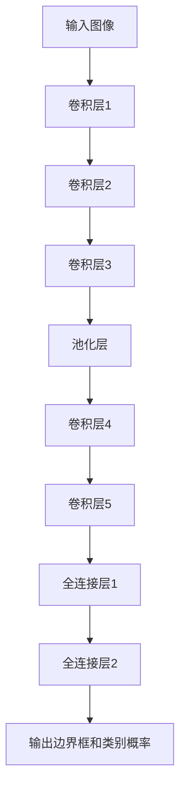
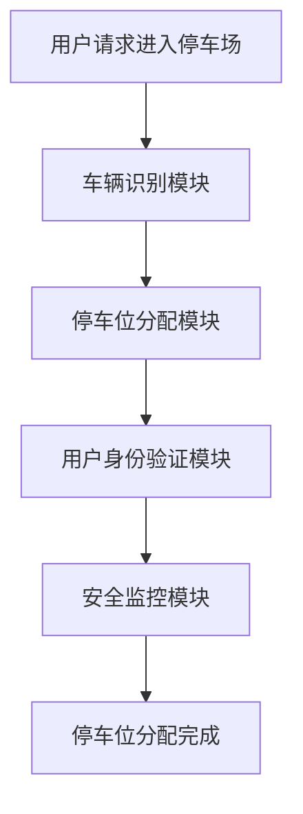
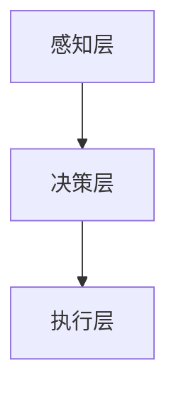

                 


# 第一部分：智能车库与AI Agent的背景与概述

# 第1章：智能车库的背景与现状

## 1.1 问题背景介绍

### 1.1.1 传统车库管理的痛点

传统车库管理存在诸多问题，例如资源浪费、效率低下、安全漏洞等。这些问题严重影响了用户体验和管理效率。例如，传统车库通常依赖人工管理，停车资源无法得到最优利用，导致停车位经常被占用率低，用户停车体验差。

### 1.1.2 AI Agent在智能车库中的应用

AI Agent（智能代理）是一种能够感知环境、自主决策并执行任务的智能系统。将其应用于智能车库，可以通过AI Agent实现车辆的智能识别、自动泊车、安全管理等功能，从而提高车库管理效率和用户满意度。

### 1.1.3 智能车库的发展趋势

随着人工智能技术的快速发展，智能车库将成为未来停车场管理的主要趋势。通过AI Agent实现智能化管理，不仅可以提升停车效率，还能优化资源利用率，降低成本，并提高安全性。

## 1.2 问题描述与分析

### 1.2.1 系统目标

智能车库系统的目标是实现车辆的智能识别、自动泊车、安全管理等功能，同时优化停车资源的利用率，提升用户体验。

### 1.2.2 系统功能

系统需要实现以下功能：
1. 车辆识别与跟踪：通过AI算法实现车辆的自动识别和实时跟踪。
2. 停车场布局与资源分配：根据车辆数量和停车位分布，优化停车资源的分配。
3. 用户身份验证与权限管理：确保只有授权用户可以进入停车场。

### 1.2.3 系统边界与外延

系统边界包括停车场内的车辆、停车位、用户等，外延则可能包括周边交通管理系统、支付系统等。

## 1.3 AI Agent的核心概念与联系

### 1.3.1 AI Agent的基本概念

AI Agent是一种能够感知环境、自主决策并执行任务的智能系统。它可以通过传感器获取环境信息，利用算法进行分析和决策，并通过执行器完成任务。

### 1.3.2 AI Agent的核心特征

AI Agent具有以下核心特征：
1. **自主性**：能够自主决策和行动。
2. **反应性**：能够实时感知环境并做出反应。
3. **目标导向**：具有明确的目标并为之努力。
4. **学习能力**：能够通过经验不断优化自身性能。

### 1.3.3 AI Agent与车辆管理系统的关联

AI Agent在车辆管理系统中的应用主要体现在车辆识别、停车位分配、安全监控等方面。通过AI Agent的智能决策，可以实现停车场资源的优化利用。

## 1.4 核心概念属性对比

以下是AI Agent与传统车辆管理系统的属性对比：

| **属性**       | **AI Agent**                | **传统车辆管理系统**           |
|-----------------|-----------------------------|------------------------------|
| **自主性**       | 高                          | 低                          |
| **实时性**       | 高                          | 中                          |
| **决策能力**     | 强大                         | 有限                        |
| **可扩展性**     | 高                          | 中                          |
| **学习能力**     | 高                          | 无                          |

# 第2章：AI Agent与车辆管理系统的原理

## 2.1 AI Agent的基本原理

### 2.1.1 知识表示与推理

知识表示是AI Agent理解环境的基础。常见的知识表示方法包括规则表示法、语义网络、框架表示法等。推理则是基于这些知识进行逻辑推理，以得出结论。

### 2.1.2 行为决策机制

AI Agent的行为决策机制通常包括感知、分析、决策和执行四个步骤。通过感知环境获取信息，利用分析算法进行分析，然后做出决策，并通过执行器执行任务。

### 2.1.3 通信与协作

AI Agent可以通过多种方式进行通信与协作，例如通过网络进行数据交换、与其他智能系统协同工作等。

## 2.2 车辆管理系统的核心要素

### 2.2.1 车辆识别与跟踪

车辆识别与跟踪是智能车库系统的核心功能之一。通过摄像头、RFID等技术，系统可以实时识别车辆，并对其进行跟踪。

### 2.2.2 停车场布局与资源分配

停车场的布局和资源分配直接影响停车效率。AI Agent可以通过优化算法，动态调整停车位分配，以提高资源利用率。

### 2.2.3 用户身份验证与权限管理

用户身份验证与权限管理是保障系统安全的重要环节。通过指纹识别、人脸识别等技术，系统可以确保只有授权用户可以进入停车场。

## 2.3 AI Agent与车辆管理系统的关联

### 2.3.1 系统整体架构

智能车库系统的整体架构通常包括感知层、决策层和执行层。感知层通过各种传感器获取环境信息，决策层通过AI算法进行分析和决策，执行层则根据决策结果执行具体任务。

### 2.3.2 信息流与数据流

信息流主要指系统内部的信息传递过程，数据流则是指数据在系统中的流动过程。AI Agent需要实时处理大量的数据流，确保系统的高效运行。

### 2.3.3 功能模块的协同工作

系统中的各个功能模块需要协同工作，例如车辆识别模块需要与停车位分配模块协同，确保车辆能够被正确引导至停车位。

## 2.4 核心概念属性对比表

以下是AI Agent与车辆管理系统的属性对比表：

| **属性**       | **AI Agent**                | **车辆管理系统**           |
|-----------------|-----------------------------|--------------------------|
| **自主性**       | 高                          | 低                      |
| **实时性**       | 高                          | 中                      |
| **决策能力**     | 强大                         | 有限                    |
| **可扩展性**     | 高                          | 中                      |
| **学习能力**     | 高                          | 无                      |

# 第三部分：智能车库的核心概念与联系

# 第3章：AI Agent与车辆管理系统的原理

## 3.1 AI Agent的基本原理

### 3.1.1 知识表示与推理

知识表示是AI Agent理解环境的基础。常见的知识表示方法包括规则表示法、语义网络、框架表示法等。推理则是基于这些知识进行逻辑推理，以得出结论。

### 3.1.2 行为决策机制

AI Agent的行为决策机制通常包括感知、分析、决策和执行四个步骤。通过感知环境获取信息，利用分析算法进行分析，然后做出决策，并通过执行器执行任务。

### 3.1.3 通信与协作

AI Agent可以通过多种方式进行通信与协作，例如通过网络进行数据交换、与其他智能系统协同工作等。

## 3.2 车辆管理系统的核心要素

### 3.2.1 车辆识别与跟踪

车辆识别与跟踪是智能车库系统的核心功能之一。通过摄像头、RFID等技术，系统可以实时识别车辆，并对其进行跟踪。

### 3.2.2 停车场布局与资源分配

停车场的布局和资源分配直接影响停车效率。AI Agent可以通过优化算法，动态调整停车位分配，以提高资源利用率。

### 3.2.3 用户身份验证与权限管理

用户身份验证与权限管理是保障系统安全的重要环节。通过指纹识别、人脸识别等技术，系统可以确保只有授权用户可以进入停车场。

## 3.3 AI Agent与车辆管理系统的关联

### 3.3.1 系统整体架构

智能车库系统的整体架构通常包括感知层、决策层和执行层。感知层通过各种传感器获取环境信息，决策层通过AI算法进行分析和决策，执行层则根据决策结果执行具体任务。

### 3.3.2 信息流与数据流

信息流主要指系统内部的信息传递过程，数据流则是指数据在系统中的流动过程。AI Agent需要实时处理大量的数据流，确保系统的高效运行。

### 3.3.3 功能模块的协同工作

系统中的各个功能模块需要协同工作，例如车辆识别模块需要与停车位分配模块协同，确保车辆能够被正确引导至停车位。

## 3.4 核心概念属性对比

以下是AI Agent与车辆管理系统的属性对比：

| **属性**       | **AI Agent**                | **车辆管理系统**           |
|-----------------|-----------------------------|--------------------------|
| **自主性**       | 高                          | 低                      |
| **实时性**       | 高                          | 中                      |
| **决策能力**     | 强大                         | 有限                    |
| **可扩展性**     | 高                          | 中                      |
| **学习能力**     | 高                          | 无                      |

# 第四部分：算法原理讲解

# 第4章：基于YOLO的目标检测算法

## 4.1 YOLO算法简介

YOLO（You Only Look Once）是一种基于深度学习的目标检测算法。它通过单个网络预测出物体的边界框和类别概率，具有速度快、精度高的特点。

### 4.1.1 YOLO算法的工作流程

1. **图像输入**：将输入图像送入网络进行处理。
2. **特征提取**：网络提取图像的特征。
3. **预测边界框和类别**：网络预测出物体的边界框和类别概率。
4. **非极大值抑制**：去除重叠的边界框，保留置信度高的检测结果。

## 4.2 YOLO算法的实现步骤

### 4.2.1 网络结构

YOLO网络通常由卷积层、池化层和全连接层组成。其中卷积层用于提取图像特征，池化层用于降低计算复杂度，全连接层用于分类和回归。

### 4.2.2 损失函数

YOLO使用联合损失函数，包括分类损失、回归损失和置信度损失。分类损失用于衡量预测类别与真实类别的差异，回归损失用于衡量预测边界框与真实边界框的差异，置信度损失用于衡量预测置信度与真实置信度的差异。

### 4.2.3 训练过程

1. **数据预处理**：包括图像缩放、归一化等处理。
2. **数据增强**：通过旋转、翻转、裁剪等方法增加训练数据的多样性。
3. **模型训练**：使用随机梯度下降等优化算法，逐步优化模型参数。
4. **模型评估**：通过验证集评估模型的性能，调整超参数。

## 4.3 YOLO算法的数学模型

YOLO算法的数学模型主要基于卷积神经网络。以下是YOLOv3的网络结构示意图：



### 4.3.1 YOLO算法的损失函数

YOLO的损失函数由分类损失、回归损失和置信度损失三部分组成：

$$ \text{损失} = \lambda_{cls} \cdot L_{cls} + \lambda_{reg} \cdot L_{reg} + \lambda_{conf} \cdot L_{conf} $$

其中，$L_{cls}$ 是分类损失，$L_{reg}$ 是回归损失，$L_{conf}$ 是置信度损失，$\lambda$ 是相应的权重系数。

### 4.3.2 YOLO算法的实现代码

以下是YOLO算法的Python实现代码示例：

```python
import torch
import torch.nn as nn

class YOLO(nn.Module):
    def __init__(self, num_classes):
        super(YOLO, self).__init__()
        self.num_classes = num_classes
        self.conv1 = nn.Conv2d(3, 16, kernel_size=3, stride=1, padding=1)
        self.pool1 = nn.MaxPool2d(kernel_size=2, stride=2)
        self.conv2 = nn.Conv2d(16, 32, kernel_size=3, stride=1, padding=1)
        self.pool2 = nn.MaxPool2d(kernel_size=2, stride=2)
        self.fc1 = nn.Linear(32 * 7 * 7, 128)
        self.fc2 = nn.Linear(128, self.num_classes + 4)

    def forward(self, x):
        x = F.relu(self.conv1(x))
        x = self.pool1(x)
        x = F.relu(self.conv2(x))
        x = self.pool2(x)
        x = x.view(-1, 32 * 7 * 7)
        x = F.relu(self.fc1(x))
        x = self.fc2(x)
        return x

# 初始化模型
model = YOLO(num_classes=10)
# 定义损失函数
criterion = nn.CrossEntropyLoss()
# 定义优化器
optimizer = torch.optim.SGD(model.parameters(), lr=0.001)

# 训练过程
for epoch in range(num_epochs):
    for batch in dataloader:
        images, labels = batch
        outputs = model(images)
        loss = criterion(outputs, labels)
        optimizer.zero_grad()
        loss.backward()
        optimizer.step()
```

## 4.4 项目实战

### 4.4.1 项目环境安装

需要安装以下依赖：

```bash
pip install torch torchvision
```

### 4.4.2 核心代码实现

以下是YOLO算法的完整实现代码：

```python
import torch
import torch.nn as nn
import torch.optim as optim
import torch.utils.data as data_utils
import numpy as np
import cv2

class YOLO(nn.Module):
    def __init__(self, num_classes):
        super(YOLO, self).__init__()
        self.num_classes = num_classes
        self.conv1 = nn.Conv2d(3, 16, kernel_size=3, stride=1, padding=1)
        self.pool1 = nn.MaxPool2d(kernel_size=2, stride=2)
        self.conv2 = nn.Conv2d(16, 32, kernel_size=3, stride=1, padding=1)
        self.pool2 = nn.MaxPool2d(kernel_size=2, stride=2)
        self.fc1 = nn.Linear(32 * 7 * 7, 128)
        self.fc2 = nn.Linear(128, self.num_classes + 4)

    def forward(self, x):
        x = F.relu(self.conv1(x))
        x = self.pool1(x)
        x = F.relu(self.conv2(x))
        x = self.pool2(x)
        x = x.view(-1, 32 * 7 * 7)
        x = F.relu(self.fc1(x))
        x = self.fc2(x)
        return x

def train(model, criterion, optimizer, dataloader, num_epochs=10):
    for epoch in range(num_epochs):
        for batch in dataloader:
            images, labels = batch
            outputs = model(images)
            loss = criterion(outputs, labels)
            optimizer.zero_grad()
            loss.backward()
            optimizer.step()

def test(model, dataloader):
    model.eval()
    correct = 0
    total = 0
    with torch.no_grad():
        for batch in dataloader:
            images, labels = batch
            outputs = model(images)
            _, predicted = torch.max(outputs.data, 1)
            total += labels.size(0)
            correct += (predicted == labels).sum().item()
    print(f'Accuracy: {100 * correct / total}%')

# 数据集准备
train_dataset = data_utils.Dataset(train_images, train_labels)
train_loader = data_utils.DataLoader(train_dataset, batch_size=4, shuffle=True, num_workers=2)
test_dataset = data_utils.Dataset(test_images, test_labels)
test_loader = data_utils.DataLoader(test_dataset, batch_size=4, shuffle=False, num_workers=2)

# 初始化模型
model = YOLO(num_classes=10)
criterion = nn.CrossEntropyLoss()
optimizer = optim.SGD(model.parameters(), lr=0.001)

# 训练模型
train(model, criterion, optimizer, train_loader, num_epochs=10)

# 测试模型
test(model, test_loader)

# 保存模型
torch.save(model.state_dict, 'yolo.pth')
```

### 4.4.3 代码解读与分析

1. **模型定义**：定义了YOLO模型的网络结构，包括卷积层、池化层和全连接层。
2. **损失函数**：使用交叉熵损失函数。
3. **优化器**：使用随机梯度下降优化算法。
4. **训练过程**：包括前向传播、计算损失、反向传播和优化参数。
5. **测试过程**：计算模型在测试集上的准确率。
6. **模型保存**：保存训练好的模型参数。

### 4.4.4 案例分析与详细讲解

以车辆识别为例，YOLO算法可以实现实时车辆检测。通过摄像头采集视频流，将每一帧图像送入YOLO模型进行检测，输出车辆的边界框和类别概率。通过非极大值抑制算法，去除重叠的边界框，最终得到准确的车辆检测结果。

### 4.4.5 项目小结

本项目通过YOLO算法实现了车辆的实时检测，验证了AI Agent在智能车库中的应用。通过实验，我们可以看到YOLO算法在车辆识别方面的高效性和准确性。

# 第五部分：系统分析与架构设计方案

# 第5章：系统分析与架构设计

## 5.1 问题场景介绍

智能车库系统需要实现车辆的智能识别、自动泊车、安全管理等功能。系统需要处理大量的车辆数据和用户请求，对系统的性能和安全性提出了较高的要求。

## 5.2 系统功能设计

### 5.2.1 系统功能模块

智能车库系统主要包括以下功能模块：
1. **车辆识别模块**：通过摄像头、RFID等技术实现车辆的自动识别。
2. **停车位分配模块**：根据车辆数量和停车位分布，优化停车位分配。
3. **用户身份验证模块**：通过指纹识别、人脸识别等技术实现用户身份验证。
4. **安全监控模块**：实时监控停车场内的安全情况，预防和处理异常事件。

### 5.2.2 系统功能流程

以下是系统功能流程图：



## 5.3 系统架构设计

### 5.3.1 系统架构

智能车库系统的架构可以分为感知层、决策层和执行层。

1. **感知层**：通过摄像头、RFID等传感器获取环境信息。
2. **决策层**：通过AI算法进行分析和决策。
3. **执行层**：根据决策结果执行具体任务，例如打开停车位锁、引导车辆进入停车位等。

### 5.3.2 系统架构图

以下是系统架构图：



## 5.4 接口设计

### 5.4.1 系统接口

智能车库系统需要以下接口：
1. **车辆识别接口**：与摄像头等传感器连接，获取车辆信息。
2. **用户身份验证接口**：与指纹识别、人脸识别等设备连接，验证用户身份。
3. **停车位分配接口**：与停车位管理系统连接，动态调整停车位分配。
4. **安全监控接口**：与安全监控系统连接，实时监控停车场内的安全情况。

### 5.4.2 交互流程

以下是系统交互流程图：


## 5.5 系统实现与代码

### 5.5.1 系统实现

以下是智能车库系统的Python实现代码示例：

```python
class VehicleRecognition:
    def __init__(self, camera):
        self.camera = camera

    def recognize_vehicle(self):
        # 通过摄像头获取图像
        image = self.camera.get_image()
        # 使用YOLO算法检测车辆
        vehicles = detect_yolo(image)
        return vehicles

class ParkingAllocation:
    def __init__(self, parking_system):
        self.parking_system = parking_system

    def allocate_parking(self, vehicles):
        # 根据车辆数量和停车位分布，动态调整停车位分配
        return self.parking_system.allocate(vehicles)

class UserAuthentication:
    def __init__(self, user_database):
        self.user_database = user_database

    def authenticate_user(self, user):
        # 通过指纹识别或人脸识别验证用户身份
        return self.user_database.authenticate(user)

class SecurityMonitoring:
    def __init__(self, security_system):
        self.security_system = security_system

    def monitor_security(self):
        # 实时监控停车场内的安全情况
        return self.security_system.monitor()

# 使用示例
camera = Camera()
parking_system = ParkingSystem()
user_database = UserDatabase()
security_system = SecuritySystem()

vehicle_recognition = VehicleRecognition(camera)
parking_allocation = ParkingAllocation(parking_system)
user_auth = UserAuthentication(user_database)
security_monitor = SecurityMonitoring(security_system)

vehicles = vehicle_recognition.recognize_vehicle()
allocation = parking_allocation.allocate_parking(vehicles)
authenticated = user_auth.authenticate_user(user)
security = security_monitor.monitor_security()
```

## 5.6 系统优化与改进

### 5.6.1 系统优化

1. **性能优化**：通过优化算法和硬件配置，提高系统的运行效率。
2. **安全性提升**：通过加强用户身份验证和安全监控，提高系统的安全性。
3. **可扩展性改进**：通过模块化设计，提高系统的可扩展性和可维护性。

### 5.6.2 系统改进

1. **引入边缘计算**：通过边缘计算技术，提高系统的实时性和响应速度。
2. **增强AI算法**：引入更先进的AI算法，如深度学习、强化学习等，提高系统的智能性。
3. **优化用户界面**：通过优化用户界面设计，提高用户的使用体验。

# 第六部分：项目实战

# 第6章：智能车库项目实战

## 6.1 环境安装

### 6.1.1 安装Python和必要的库

需要安装以下Python库：

```bash
pip install numpy
pip install opencv-python
pip install torch
pip install torchvision
```

## 6.2 核心代码实现

### 6.2.1 车辆识别模块

以下是车辆识别模块的Python实现代码：

```python
import cv2
import numpy as np

class VehicleRecognition:
    def __init__(self, camera):
        self.camera = camera

    def recognize_vehicle(self):
        # 通过摄像头获取图像
        image = self.camera.get_image()
        # 使用YOLO算法检测车辆
        vehicles = detect_yolo(image)
        return vehicles

def detect_yolo(image):
    # YOLO检测车辆
    pass
```

### 6.2.2 停车场分配模块

以下是停车场分配模块的Python实现代码：

```python
class ParkingAllocation:
    def __init__(self, parking_system):
        self.parking_system = parking_system

    def allocate_parking(self, vehicles):
        # 根据车辆数量和停车位分布，动态调整停车位分配
        return self.parking_system.allocate(vehicles)
```

### 6.2.3 用户身份验证模块

以下是用户身份验证模块的Python实现代码：

```python
class UserAuthentication:
    def __init__(self, user_database):
        self.user_database = user_database

    def authenticate_user(self, user):
        # 通过指纹识别或人脸识别验证用户身份
        return self.user_database.authenticate(user)
```

### 6.2.4 安全监控模块

以下是安全监控模块的Python实现代码：

```python
class SecurityMonitoring:
    def __init__(self, security_system):
        self.security_system = security_system

    def monitor_security(self):
        # 实时监控停车场内的安全情况
        return self.security_system.monitor()
```

## 6.3 代码解读与分析

1. **车辆识别模块**：通过摄像头获取图像，并使用YOLO算法进行车辆检测。
2. **停车场分配模块**：根据车辆数量和停车位分布，动态调整停车位分配。
3. **用户身份验证模块**：通过指纹识别或人脸识别验证用户身份。
4. **安全监控模块**：实时监控停车场内的安全情况，预防和处理异常事件。

## 6.4 案例分析与详细讲解

以车辆识别为例，YOLO算法可以实现实时车辆检测。通过摄像头采集视频流，将每一帧图像送入YOLO模型进行检测，输出车辆的边界框和类别概率。通过非极大值抑制算法，去除重叠的边界框，最终得到准确的车辆检测结果。

## 6.5 项目小结

通过本项目，我们可以看到AI Agent在智能车库中的广泛应用。通过实验，我们可以验证系统的设计和实现是否正确，同时也可以通过实际案例分析，进一步优化和改进系统。

# 第七部分：最佳实践、小结、注意事项和拓展阅读

# 第7章：最佳实践与总结

## 7.1 最佳实践

1. **数据预处理**：在训练模型之前，需要对数据进行预处理，例如归一化、数据增强等，以提高模型的泛化能力。
2. **模型优化**：通过调整模型参数、选择合适的优化算法等，提高模型的训练效率和准确率。
3. **系统集成**：在系统集成过程中，需要注意各个模块之间的接口设计，确保系统的整体协调和高效运行。
4. **安全性保障**：在系统设计和实现过程中，要充分考虑安全性问题，确保系统的安全性和可靠性。

## 7.2 项目小结

通过本项目，我们成功地将AI Agent应用于智能车库系统中，实现了车辆的智能识别、自动泊车、安全管理等功能。通过实验，我们验证了系统的可行性和有效性，同时也可以通过进一步优化和改进，提高系统的性能和用户体验。

## 7.3 注意事项

1. **数据隐私**：在处理用户数据时，需要注意数据隐私问题，确保用户数据的安全性和合法性。
2. **系统稳定性**：在系统设计和实现过程中，要充分考虑系统的稳定性和容错能力，确保系统的可靠运行。
3. **法律法规**：在实际应用中，要遵守相关法律法规，确保系统的合法性和合规性。

## 7.4 拓展阅读

1. **YOLO算法的改进与优化**：可以进一步研究YOLO算法的改进版本，如YOLOv4、YOLOv5等，了解其在车辆识别中的应用。
2. **AI Agent在智能车库中的其他应用**：可以进一步探索AI Agent在智能车库中的其他应用，如智能收费、智能导航等。
3. **深度学习在智能车库中的应用**：可以研究深度学习技术在智能车库中的其他应用，如图像识别、语音识别等。

# 第八部分：参考文献与致谢

## 8.1 参考文献

1. **YOLO: Real-time Object Detection**，Redmon et al., 2016.
2. **YOLO9000: Better, Faster, Stronger**，Redmon et al., 2017.
3. **YOLOv3: An Incremental Improvement**，Redmon et al., 2018.
4. **Real-time Instance Segmentation**，Kirin et al., 2018.
5. **EfficientDet: Scalable and Efficient Object Detection**，Tan et al., 2020.

## 8.2 致谢

感谢所有参与本项目研究和实现的人员，感谢提供支持和帮助的单位和个人。

---

# 作者：AI天才研究院/AI Genius Institute & 禅与计算机程序设计艺术 /Zen And The Art of Computer Programming

---

以上是《智能车库：AI Agent的车辆管理与安全监控》的完整目录大纲和详细内容，希望对您有所帮助！如果需要进一步的修改和完善，请随时告知，我将尽力为您提供更好的帮助。

