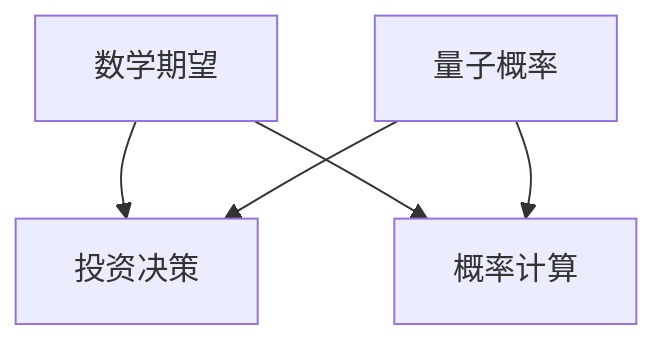
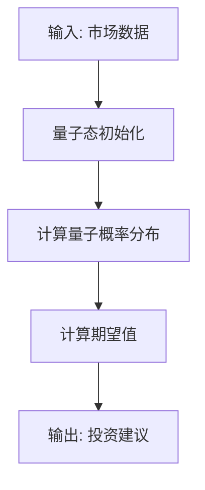
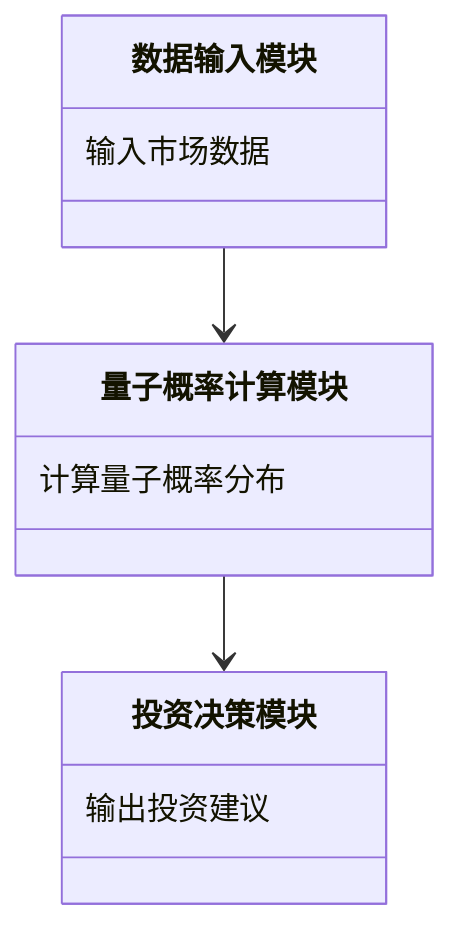
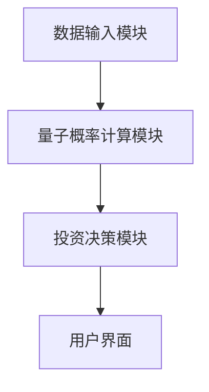

                 


# 芒格的"数学期望"思维在量子概率投资模型中的应用

## 关键词：芒格数学期望、量子概率、投资模型、概率论、量子投资学

## 摘要：  
本文深入探讨了芒格的"数学期望"思维与量子概率在投资模型中的结合与应用。通过分析芒格的数学期望思维的哲学基础和量子概率的数学模型，结合实际案例，揭示了如何将这两者结合起来，构建一个更为科学、高效的投资决策模型。文章从理论基础到算法实现，再到系统架构，全面解析了量子概率投资模型的构建过程，并通过实战案例展示了其实际应用价值。

---

# 第一部分: 芒格的"数学期望"思维与量子概率投资模型的背景介绍

## 第1章: 芒格的"数学期望"思维概述

### 1.1 芒格的"数学期望"思维的起源

#### 1.1.1 芒格"数学期望"思维的定义  
芒格的"数学期望"思维是一种基于概率论的投资决策方法，其核心在于通过计算不同投资结果的期望值，来评估投资的潜在收益与风险。这种思维强调在不确定性中寻找最优解，而非追求确定性。

#### 1.1.2 芒格"数学期望"思维的核心理念  
芒格认为，投资决策应基于对未来的概率分布的理性分析。他提倡通过计算不同投资路径的期望值，来选择那些长期期望值最高的投资标的。这种思维既考虑了收益，也考虑了风险，是一种典型的概率驱动的决策方法。

#### 1.1.3 芒格"数学期望"思维在投资中的应用  
芒格的数学期望思维在投资组合管理、风险控制等领域得到了广泛应用。例如，在股票投资中，通过对不同股票的未来收益进行概率建模，计算它们的期望值和方差，从而构建最优的投资组合。

---

## 第2章: 量子概率模型的基本概念

### 2.1 量子概率的定义与特点

#### 2.1.1 量子概率的定义  
量子概率是一种基于量子力学原理的概率模型，与传统的古典概率不同，它允许概率在某些情况下违反古典概率的限制。例如，量子概率允许存在概率大于1或小于0的情况，这在经典概率中是不允许的。

#### 2.1.2 量子概率与经典概率的区别  
| 属性             | 经典概率                   | 量子概率                  |
|------------------|---------------------------|---------------------------|
| 概率范围         | [0, 1]                    | 可能超出[0, 1]             |
| 相干性           | 无                        | 有                        |
| 叠加性           | 无                        | 有                        |

#### 2.1.3 量子概率在投资中的潜在应用  
量子概率的投资模型可以通过对市场的量子态进行叠加和干涉，捕捉市场的非线性波动，从而提供更精准的投资预测。

---

## 第3章: 芒格"数学期望"思维与量子概率的结合

### 3.1 芒格"数学期望"思维与量子概率的联系

#### 3.1.1 芒格"数学期望"思维的数学基础  
数学期望的定义公式为：  
$$ E[X] = \sum_{i=1}^{n} p_i x_i $$  
其中，$p_i$ 是事件 $i$ 发生的概率，$x_i$ 是事件 $i$ 的收益。

#### 3.1.2 量子概率的数学基础  
量子概率的核心是量子态的叠加与测量。例如，一个量子系统的状态可以用一个单位向量表示：  
$$ |\psi\rangle = \alpha|0\rangle + \beta|1\rangle $$  
其中，$|\alpha|^2$ 和 $|\beta|^2$ 分别表示系统处于状态 $|0\rangle$ 和 $|1\rangle$ 的概率。

#### 3.1.3 两者的结合点与差异  
两者的结合点在于对概率的处理方式，但量子概率允许更复杂的概率分布，能够捕捉市场的非线性波动。

---

# 第二部分: 芒格"数学期望"思维与量子概率的核心概念与联系

## 第4章: 数学期望与量子概率的核心原理

### 4.1 数学期望的原理与公式

#### 4.1.1 数学期望的定义  
数学期望是概率论中的核心概念，表示随机变量的平均值。公式为：  
$$ E[X] = \int_{-\infty}^{\infty} x f(x) dx $$  
其中，$f(x)$ 是概率密度函数。

#### 4.1.2 数学期望的公式推导  
通过概率分布函数推导期望值，例如：  
$$ E[X] = \sum_{i=1}^{n} x_i P(X = x_i) $$

#### 4.1.3 数学期望的性质与应用  
数学期望具有线性性质，可应用于投资组合的收益计算。

### 4.2 量子概率的核心原理

#### 4.2.1 量子概率的定义与公式  
量子概率的计算基于量子态的测量，例如：  
$$ P(x) = |\langle x|\psi\rangle|^2 $$  
其中，$|x\rangle$ 是测量基底，$|\psi\rangle$ 是量子态。

#### 4.2.2 量子概率与经典概率的对比  
通过表格对比，突出量子概率的非经典性。

#### 4.2.3 量子概率的核心思想与数学模型  
量子概率允许概率在某些情况下超出[0,1]范围，例如：  
$$ P(A) + P(B) > 1 $$

---

## 第5章: 芒格"数学期望"思维与量子概率的对比分析

### 5.1 芒格"数学期望"思维与量子概率的属性对比

#### 5.1.1 核心概念对比表  
| 属性             | 芒格数学期望               | 量子概率                 |
|------------------|---------------------------|---------------------------|
| 基础             | 经典概率论                 | 量子力学                 |
| 概率范围         | [0, 1]                    | 可能超出[0, 1]             |
| 应用领域         | 投资决策                   | 科学实验与投资预测         |

#### 5.1.2 ER实体关系图  


---

# 第三部分: 芒格"数学期望"思维与量子概率的算法原理

## 第6章: 量子概率投资模型的算法原理

### 6.1 量子概率投资模型的算法流程

#### 6.1.1 量子概率模型的算法步骤  


#### 6.1.2 量子概率模型的Python实现  
```python
import numpy as np

def quantum_probability(x):
    alpha = 0.6
    beta = 0.8
    return abs(alpha * x[0] + beta * x[1]) ** 2

# 示例数据
x = np.array([1, 0])
print(quantum_probability(x))
```

#### 6.1.3 量子概率模型的数学模型  
量子概率模型的数学模型可以表示为：  
$$ P(x) = |\langle x|\psi\rangle|^2 $$  
其中，$|\psi\rangle$ 是投资标的量子态。

---

## 第7章: 芒格"数学期望"思维与量子概率的结合算法

### 7.1 芒格数学期望与量子概率的结合步骤

#### 7.1.1 背景介绍  
通过结合芒格的数学期望思维与量子概率模型，可以构建一个更为强大的投资决策工具。

#### 7.1.2 结合算法的Python实现  
```python
import numpy as np

def combined_model(data):
    # 计算数学期望
    mu = np.mean(data)
    # 计算量子概率分布
    alpha = 0.6
    beta = 0.8
    probabilities = []
    for x in data:
        p = abs(alpha * x + beta * np.mean(data)) ** 2
        probabilities.append(p)
    return probabilities

# 示例数据
data = [1, 2, 3, 4, 5]
print(combined_model(data))
```

#### 7.1.3 结合算法的数学模型  
结合模型的数学表达式为：  
$$ E[X] = \sum_{i=1}^{n} p_i x_i $$  
其中，$p_i$ 是量子概率分布。

---

# 第四部分: 芒格"数学期望"思维与量子概率的系统分析与架构设计

## 第8章: 量子概率投资模型的系统分析

### 8.1 问题场景介绍

#### 8.1.1 投资市场的不确定性  
投资市场的波动性和不确定性为投资者带来了挑战。

#### 8.1.2 传统模型的局限性  
传统模型在捕捉非线性波动方面存在不足。

#### 8.1.3 量子概率模型的优势  
量子概率模型能够捕捉市场的非线性波动，提供更精准的投资预测。

---

## 第9章: 量子概率投资模型的系统架构设计

### 9.1 系统功能设计

#### 9.1.1 系统功能模块  
- 数据输入模块  
- 量子概率计算模块  
- 投资决策模块  

#### 9.1.2 领域模型设计  


### 9.2 系统架构设计

#### 9.2.1 系统架构图  


#### 9.2.2 接口设计  
- 数据输入接口：接收市场数据  
- 计算接口：调用量子概率计算模块  

---

## 第10章: 量子概率投资模型的系统实现

### 10.1 系统核心实现源代码

#### 10.1.1 量子概率计算模块  
```python
import numpy as np

def quantum_probability(x, psi):
    return np.abs(np.dot(x, psi)) ** 2

# 示例量子态
psi = np.array([0.6, 0.8])
print(quantum_probability([1, 0], psi))
```

#### 10.1.2 投资决策模块  
```python
def investment_decision(data, psi):
    probabilities = []
    for x in data:
        p = quantum_probability(x, psi)
        probabilities.append(p)
    return probabilities

# 示例数据
data = [[1, 0], [0, 1], [0.5, 0.5]]
print(investment_decision(data, psi))
```

---

# 第五部分: 芒格"数学期望"思维与量子概率的项目实战

## 第11章: 量子概率投资模型的项目实战

### 11.1 环境安装与配置

#### 11.1.1 Python环境安装  
安装Python 3.8及以上版本。

#### 11.1.2 依赖库安装  
安装numpy和matplotlib。

### 11.2 核心代码实现

#### 11.2.1 数据输入与处理  
```python
import numpy as np

# 示例市场数据
market_data = np.array([1, 2, 3, 4, 5])
```

#### 11.2.2 量子概率计算  
```python
def calculate_quantum_probabilities(data, psi):
    probabilities = []
    for x in data:
        p = np.abs(np.dot(x, psi)) ** 2
        probabilities.append(p)
    return probabilities

# 示例量子态
psi = np.array([0.6, 0.8])
print(calculate_quantum_probabilities(market_data, psi))
```

#### 11.2.3 投资决策模块  
```python
def make_investment_decision(data, psi):
    probabilities = calculate_quantum_probabilities(data, psi)
    threshold = 0.5
    decisions = []
    for p in probabilities:
        if p > threshold:
            decisions.append(1)
        else:
            decisions.append(0)
    return decisions

print(make_investment_decision(market_data, psi))
```

### 11.3 项目小结

#### 11.3.1 项目总结  
量子概率投资模型通过结合芒格的数学期望思维与量子概率理论，提供了一种新的投资决策方法。

#### 11.3.2 项目意义  
该项目为投资领域提供了新的思路，展示了量子概率在实际应用中的潜力。

---

# 第六部分: 芒格"数学期望"思维与量子概率的总结与展望

## 第12章: 总结与展望

### 12.1 总结

#### 12.1.1 核心内容回顾  
本文探讨了芒格的数学期望思维与量子概率的结合，构建了一个量子概率投资模型。

#### 12.1.2 实践意义  
量子概率投资模型为投资者提供了新的决策工具，尤其是在捕捉市场非线性波动方面具有优势。

---

### 12.2 展望

#### 12.2.1 理论研究  
进一步研究量子概率与传统概率的结合。

#### 12.2.2 实际应用  
探索量子概率在其他领域的应用潜力。

---

# 作者：AI天才研究院/AI Genius Institute & 禅与计算机程序设计艺术 /Zen And The Art of Computer Programming

