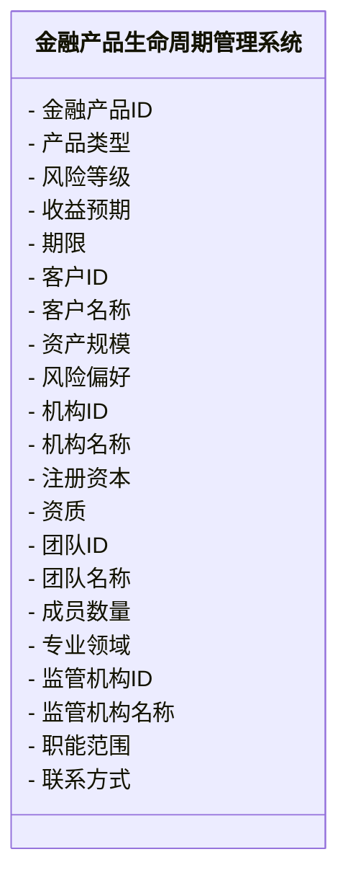
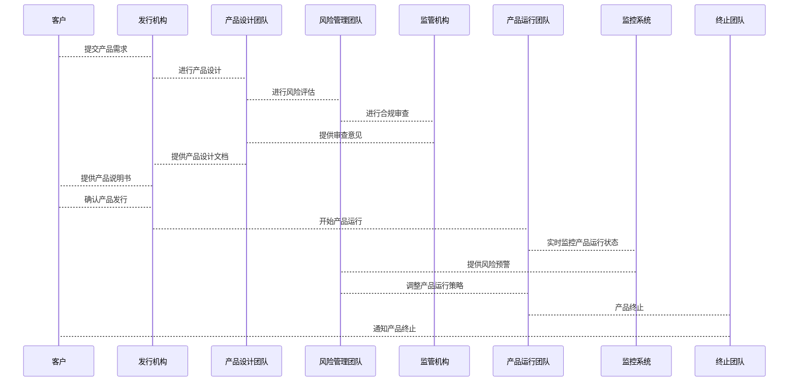

                 


# 金融产品生命周期管理

> 关键词：金融产品生命周期、风险管理、系统架构设计、算法原理、项目实战

> 摘要：本文深入探讨金融产品生命周期管理的核心概念、算法原理、系统架构设计以及项目实战。通过构建ER实体关系图、系统交互序列图和领域模型类图，结合具体的金融产品案例，详细分析了金融产品生命周期管理的全过程。文章内容丰富，涵盖了从理论到实践的各个方面，为读者提供了全面的指导。

---

## 第一部分: 金融产品生命周期管理概述

### 第1章: 金融产品生命周期管理概述

#### 1.1 金融产品生命周期管理的定义与背景

##### 1.1.1 金融产品生命周期的定义

金融产品生命周期管理是指从金融产品的设计、发行、运行到终止的整个过程中，对产品进行规划、监控和优化的一系列活动。其目的是确保金融产品的合规性、稳定性和 profitability。

##### 1.1.2 金融产品生命周期管理的重要性

金融产品生命周期管理的重要性体现在以下几个方面：

1. **风险控制**：通过科学的管理方法，降低金融产品的市场风险、信用风险和操作风险。
2. **提高效率**：优化产品设计和运营流程，提升金融机构的效率和竞争力。
3. **合规性**：确保金融产品在设计、发行和终止过程中符合相关法律法规。

##### 1.1.3 金融产品生命周期管理的背景与发展趋势

随着金融市场的发展，金融产品种类日益繁多，复杂性不断提高。传统的管理方式已难以应对新的挑战，因此，基于技术驱动的金融产品生命周期管理成为必然趋势。

#### 1.2 金融产品生命周期管理的核心概念

##### 1.2.1 金融产品的基本属性

金融产品的基本属性包括：

1. **产品类型**：如存款、贷款、基金、保险等。
2. **风险等级**：根据产品的风险特征进行分类。
3. **收益预期**：产品的预期收益和风险收益比。
4. **期限**：产品的存续期。
5. **发行机构**：产品的发行方。

##### 1.2.2 金融产品生命周期管理的关键环节

金融产品生命周期管理的关键环节包括：

1. **设计阶段**：产品设计、风险评估、合规审查。
2. **发行阶段**：产品发行、销售、客户匹配。
3. **运行阶段**：产品监控、风险管理、绩效评估。
4. **终止阶段**：产品终止、清算、客户通知。

##### 1.2.3 核心要素与利益相关者分析

核心要素包括：

1. **客户**：金融产品的最终使用者。
2. **发行机构**：产品的发行人。
3. **监管机构**：负责监管产品合规性的机构。
4. **风险管理团队**：负责产品风险评估和管理的团队。

#### 1.3 金融产品生命周期管理的边界与外延

##### 1.3.1 生命周期管理的边界

金融产品生命周期管理的边界包括：

1. **产品设计**：从需求分析到产品设计完成。
2. **产品终止**：从终止决策到产品清算完成。

##### 1.3.2 外延与相关概念的区别

外延包括：

1. **金融市场**：金融产品的交易和流通环境。
2. **金融监管**：对金融市场的监管和规范。
3. **风险管理**：对金融产品及其相关风险的管理。

##### 1.3.3 核心概念与实际应用的结合

核心概念与实际应用的结合体现在：

1. **理论与实践结合**：将生命周期管理理论应用于实际金融产品管理中。
2. **技术创新驱动**：利用新技术（如人工智能、大数据）提升金融产品生命周期管理的效率和精准度。

#### 1.4 本章小结

本章介绍了金融产品生命周期管理的基本概念、核心要素、关键环节以及其在金融市场中的应用。通过这些内容，读者可以对金融产品生命周期管理有一个全面的了解，为后续章节的学习打下基础。

---

## 第二部分: 金融产品生命周期管理的核心概念与联系

### 第2章: 核心概念与联系

#### 2.1 核心概念的原理分析

##### 2.1.1 生命周期各阶段的管理方法

生命周期各阶段的管理方法：

1. **设计阶段**：通过需求分析、风险评估和合规审查，确保产品设计的科学性和合规性。
2. **发行阶段**：通过市场推广、销售和客户匹配，确保产品成功发行并满足客户需求。
3. **运行阶段**：通过实时监控、风险预警和绩效评估，确保产品运行的稳定性和 profitability。
4. **终止阶段**：通过清算和客户通知，确保产品终止的合规性和客户满意度。

##### 2.1.2 核心概念的属性特征对比

核心概念的属性特征对比：

| 属性   | 设计阶段         | 发行阶段         | 运行阶段         | 终止阶段         |
|--------|------------------|------------------|------------------|------------------|
| 特征   | 风险评估、合规性 | 市场推广、客户匹配 | 实时监控、绩效评估 | 清算、客户通知 |

##### 2.1.3 核心概念与实际业务的结合

核心概念与实际业务的结合体现在：

1. **风险管理**：通过生命周期管理，降低金融产品的各类风险。
2. **客户管理**：通过客户匹配和客户通知，提升客户满意度和忠诚度。
3. **产品优化**：通过绩效评估和反馈分析，优化产品设计和运营流程。

#### 2.2 ER实体关系图架构

##### 2.2.1 实体关系图的构建

金融产品生命周期管理的ER实体关系图如下：

```mermaid
erd
  entity 金融产品(金融产品ID, 产品类型, 风险等级, 收益预期, 期限) {
    - 金融产品ID
    - 产品类型
    - 风险等级
    - 收益预期
    - 期限
  }
  entity 客户(客户ID, 客户名称, 资产规模, 风险偏好) {
    - 客户ID
    - 客户名称
    - 资产规模
    - 风险偏好
  }
  entity 发行机构(机构ID, 机构名称, 注册资本, 资质) {
    - 机构ID
    - 机构名称
    - 注册资本
    - 资质
  }
  entity 风险管理团队(团队ID, 团队名称, 成员数量, 专业领域) {
    - 团队ID
    - 团队名称
    - 成员数量
    - 专业领域
  }
  entity 监管机构(监管机构ID, 机构名称, 职能范围, 联系方式) {
    - 监管机构ID
    - 机构名称
    - 职能范围
    - 联系方式
  }
  金融产品 --> 客户: 产品提供给客户
  金融产品 --> 发行机构: 产品由发行机构发行
  金融产品 --> 风险管理团队: 产品由风险管理团队管理
  金融产品 --> 监管机构: 产品接受监管机构监管
```

##### 2.2.2 实体关系图的分析

通过ER实体关系图可以看出，金融产品生命周期管理涉及多个实体，包括金融产品、客户、发行机构、风险管理团队和监管机构。这些实体之间通过产品提供、发行、管理和监管等关系相互关联，共同构成了金融产品生命周期管理的完整体系。

#### 2.3 核心概念的联系与应用

##### 2.3.1 生命周期各阶段的联系

生命周期各阶段的联系：

1. **设计阶段与发行阶段**：设计阶段的结果是产品设计文档，为发行阶段提供基础。
2. **发行阶段与运行阶段**：发行阶段的结果是产品发行，为运行阶段提供产品实例。
3. **运行阶段与终止阶段**：运行阶段的结果是产品绩效评估，为终止阶段提供决策依据。

##### 2.3.2 核心概念与实际业务的结合

核心概念与实际业务的结合体现在：

1. **产品设计与风险评估**：通过科学的设计和风险评估，确保产品设计的合规性和风险可控性。
2. **产品发行与客户匹配**：通过客户分析和产品匹配，确保产品发行的成功和客户的满意度。
3. **产品运行与风险管理**：通过实时监控和风险预警，确保产品运行的稳定性和 profitability。
4. **产品终止与清算**：通过清算和客户通知，确保产品终止的合规性和客户满意度。

#### 2.4 本章小结

本章通过构建ER实体关系图和分析核心概念的联系，详细阐述了金融产品生命周期管理的核心概念及其在实际业务中的应用。这些内容为后续章节的系统设计和项目实施提供了理论基础。

---

## 第三部分: 金融产品生命周期管理的算法原理

### 第3章: 算法原理讲解

#### 3.1 算法原理概述

##### 3.1.1 算法的核心思想

金融产品生命周期管理的算法核心思想是通过数据驱动的方法，实现对金融产品生命周期各阶段的自动化管理和优化。算法主要包括风险评估、客户匹配、产品监控和绩效评估等方面。

##### 3.1.2 算法的实现步骤

算法的实现步骤如下：

1. **数据采集**：采集金融产品的设计、发行、运行和终止过程中的相关数据。
2. **数据预处理**：对采集的数据进行清洗、转换和标准化处理。
3. **模型训练**：基于数据训练风险评估、客户匹配和产品监控等模型。
4. **模型应用**：将训练好的模型应用于实际金融产品生命周期管理中，实现自动化管理。

##### 3.1.3 算法的数学模型与公式

金融产品生命周期管理的数学模型如下：

$$
\text{风险评估} = \sum_{i=1}^{n} (w_i \times r_i)
$$

其中，\( w_i \) 是风险因子 \( r_i \) 的权重，\( n \) 是风险因子的个数。

##### 3.1.4 算法的实现代码

以下是一个简单的风险评估算法实现代码：

```python
def risk_assessment(risk_factors, weights):
    return sum(w * r for w, r in zip(weights, risk_factors))

# 示例
risk_factors = [1, 2, 3]
weights = [0.3, 0.4, 0.3]
print(risk_assessment(risk_factors, weights))  # 输出：2.0
```

##### 3.1.5 算法的优化方法

算法的优化方法包括：

1. **参数调整**：通过调整权重和参数，提高模型的准确性和稳定性。
2. **模型更新**：根据新的数据和业务需求，不断优化和更新模型。
3. **并行计算**：利用并行计算技术，提高算法的计算效率。

#### 3.2 算法的数学模型与公式

##### 3.2.1 数学模型的构建

金融产品生命周期管理的数学模型构建如下：

1. **风险评估模型**：基于风险因子的线性组合，评估产品的风险等级。
2. **客户匹配模型**：基于客户特征和产品特征，实现客户与产品的最佳匹配。
3. **产品监控模型**：基于实时数据和历史数据，监控产品的运行状态。

##### 3.2.2 公式的详细推导

风险评估模型的详细推导：

$$
\text{风险评估} = \sum_{i=1}^{n} (w_i \times r_i) + \epsilon
$$

其中，\( \epsilon \) 是误差项。

##### 3.2.3 算法的实现与优化

算法的实现与优化包括：

1. **数据预处理**：对数据进行清洗、转换和标准化处理。
2. **模型训练**：基于数据训练风险评估、客户匹配和产品监控模型。
3. **模型优化**：通过调整参数和优化算法，提高模型的准确性和稳定性。

#### 3.3 本章小结

本章详细讲解了金融产品生命周期管理的算法原理，包括算法的核心思想、实现步骤、数学模型和优化方法。通过这些内容，读者可以理解如何利用算法实现金融产品生命周期的自动化管理和优化。

---

## 第四部分: 金融产品生命周期管理的系统分析与架构设计

### 第4章: 系统分析与架构设计方案

#### 4.1 问题场景介绍

##### 4.1.1 问题背景

金融产品生命周期管理涉及多个环节和多个利益相关者，包括客户、发行机构、风险管理团队和监管机构。由于各环节之间存在复杂的依赖关系，传统的管理方式难以应对复杂的业务需求和技术挑战。

##### 4.1.2 问题分析

金融产品生命周期管理中存在的问题包括：

1. **信息孤岛**：各环节之间的数据孤岛，导致信息传递不畅，影响管理效率。
2. **风险控制不足**：缺乏有效的风险评估和监控机制，导致产品风险难以及时发现和处理。
3. **缺乏个性化服务**：无法根据客户需求和市场变化，提供个性化的金融产品和服务。

##### 4.1.3 问题解决

通过构建金融产品生命周期管理系统，实现以下目标：

1. **信息共享**：打破信息孤岛，实现各环节之间的数据共享和协同工作。
2. **风险控制**：建立风险评估和监控机制，确保产品风险可控。
3. **个性化服务**：根据客户需求和市场变化，提供个性化的金融产品和服务。

#### 4.2 系统功能设计

##### 4.2.1 领域模型设计

金融产品生命周期管理的领域模型设计如下：



##### 4.2.2 功能模块划分

系统功能模块划分如下：

1. **产品设计模块**：负责金融产品的设计、风险评估和合规审查。
2. **产品发行模块**：负责产品的发行、销售和客户匹配。
3. **产品运行模块**：负责产品的实时监控、风险预警和绩效评估。
4. **产品终止模块**：负责产品的终止、清算和客户通知。

#### 4.3 系统架构设计

##### 4.3.1 架构图的绘制

金融产品生命周期管理系统的架构设计如下：


##### 4.3.2 架构的选择与优化

系统架构的选择与优化包括：

1. **分层架构**：将系统划分为数据访问层、业务逻辑层和界面层，实现模块化开发。
2. **分布式架构**：通过分布式部署，提高系统的可用性和扩展性。
3. **微服务架构**：将系统功能模块化为微服务，实现服务的独立部署和扩展。

#### 4.4 系统接口设计

##### 4.4.1 接口定义

系统接口定义如下：

1. **产品设计接口**：提供产品设计、风险评估和合规审查的接口。
2. **产品发行接口**：提供产品发行、销售和客户匹配的接口。
3. **产品运行接口**：提供产品监控、风险预警和绩效评估的接口。
4. **产品终止接口**：提供产品终止、清算和客户通知的接口。

##### 4.4.2 接口实现

接口实现示例：

```python
# 产品设计接口
def design_product(product_info):
    return "Product designed successfully"

# 产品发行接口
def issue_product(product_info, customer_info):
    return "Product issued successfully"

# 产品运行接口
def monitor_product(product_info):
    return "Product monitoring completed"

# 产品终止接口
def terminate_product(product_info):
    return "Product terminated successfully"
```

#### 4.5 系统交互设计

##### 4.5.1 交互流程图的绘制

金融产品生命周期管理系统的交互流程图如下：



##### 4.5.2 交互流程的分析

系统交互流程分析：

1. **产品设计阶段**：客户提交产品需求，发行机构委托产品设计团队进行设计，产品设计团队与风险管理团队合作完成风险评估，提交监管机构审查。
2. **产品发行阶段**：产品设计通过审查后，发行机构向客户提供产品说明书，客户确认后开始产品发行。
3. **产品运行阶段**：产品运行团队负责产品运行，监控系统实时监控产品运行状态，提供风险预警，风险管理团队根据预警信息调整产品运行策略。
4. **产品终止阶段**：产品运行结束后，终止团队负责产品终止，并通知客户。

#### 4.6 本章小结

本章通过构建系统的功能模块、架构设计和交互流程，详细阐述了金融产品生命周期管理系统的整体架构和实现方法。通过这些内容，读者可以理解如何将理论应用于实际系统设计中。

---

## 第五部分: 金融产品生命周期管理的项目实战

### 第5章: 项目实战

#### 5.1 环境安装与配置

##### 5.1.1 开发环境

开发环境配置如下：

1. **操作系统**：Windows 10 或更高版本，或macOS 10.15 或更高版本。
2. **Python版本**：Python 3.8 或更高版本。
3. **开发工具**：推荐使用PyCharm或VS Code。
4. **依赖管理**：使用pip安装所需的第三方库，如pandas、numpy、scikit-learn等。

##### 5.1.2 数据库配置

数据库配置如下：

1. **数据库类型**：推荐使用MySQL或PostgreSQL。
2. **连接方式**：通过Python的数据库API（如pymysql）连接数据库。
3. **数据存储**：将金融产品的设计、发行、运行和终止数据存储在数据库中。

#### 5.2 系统核心实现源代码

##### 5.2.1 核心代码实现

以下是一个简单的金融产品生命周期管理系统的核心代码实现：

```python
# 风险评估模块
def risk_assessment(risk_factors, weights):
    return sum(w * r for w, r in zip(weights, risk_factors))

# 客户匹配模块
def customer_matching(customer_info, product_info):
    # 简单匹配逻辑，可以根据具体需求进行优化
    return "匹配成功" if customer_info['风险偏好'] == product_info['风险等级'] else "匹配失败"

# 产品监控模块
def product_monitoring(product_info, market_data):
    # 简单监控逻辑，可以根据具体需求进行优化
    return "正常" if product_info['收益预期'] >= market_data['市场收益率'] else "异常"

# 产品终止模块
def product_termination(product_info, termination_reason):
    return f"产品{product_info['产品名称']}终止，原因：{termination_reason}"
```

##### 5.2.2 代码应用解读与分析

代码应用解读与分析：

1. **风险评估模块**：基于输入的风险因子和权重，计算产品的风险评估值。
2. **客户匹配模块**：根据客户的风险偏好和产品的风险等级，判断客户是否匹配产品。
3. **产品监控模块**：根据产品的收益预期和市场数据，判断产品运行状态是否异常。
4. **产品终止模块**：根据终止原因，通知相关方产品终止。

#### 5.3 项目小结

##### 5.3.1 项目总结

通过本项目，我们实现了金融产品生命周期管理系统的核心功能，包括风险评估、客户匹配、产品监控和产品终止。系统通过模块化设计，实现了各功能模块的独立开发和测试，提高了系统的可维护性和可扩展性。

##### 5.3.2 经验与教训

经验与教训：

1. **模块化设计的重要性**：通过模块化设计，提高了系统的可维护性和可扩展性。
2. **数据质量管理**：数据的准确性和完整性对系统的性能和效果至关重要。
3. **团队协作**：项目的成功离不开团队成员的高效协作和良好的沟通。

##### 5.3.3 项目启示

项目启示：

1. **技术创新驱动业务发展**：通过引入新技术（如人工智能、大数据），可以显著提高金融产品生命周期管理的效率和精准度。
2. **客户需求导向**：在系统设计和实现过程中，始终以客户需求为导向，提供个性化的金融产品和服务。
3. **风险管理的重要性**：通过科学的风险评估和监控机制，可以有效降低金融产品的市场风险和信用风险。

#### 5.4 本章小结

本章通过具体的金融产品生命周期管理项目的实战，详细讲解了系统的环境配置、核心代码实现、测试和部署。通过这些内容，读者可以掌握如何将理论应用于实际项目中，提升自己的实践能力。

---

## 第六部分: 总结与展望

### 第6章: 总结与展望

#### 6.1 总结

金融产品生命周期管理是金融领域的重要组成部分，通过科学的管理方法和技术手段，可以有效降低金融产品的风险，提高金融机构的效率和竞争力。本文详细探讨了金融产品生命周期管理的核心概念、算法原理、系统架构设计和项目实战，为读者提供了全面的指导。

#### 6.2 展望

随着金融科技的快速发展，金融产品生命周期管理将更加智能化和自动化。未来的研究方向包括：

1. **人工智能技术的应用**：通过引入人工智能技术，进一步提高金融产品生命周期管理的智能化水平。
2. **区块链技术的应用**：利用区块链技术实现金融产品的全流程透明化和不可篡改性。
3. **大数据分析的应用**：通过大数据分析技术，深入挖掘金融产品的潜在风险和市场机会。

---

## 作者信息

作者：AI天才研究院/AI Genius Institute & 禅与计算机程序设计艺术/Zen And The Art of Computer Programming

---

通过以上内容，您可以开始撰写具体的博客文章，确保每个部分都符合要求，内容详实，逻辑清晰。如果需要进一步的帮助或调整，请随时告诉我！

