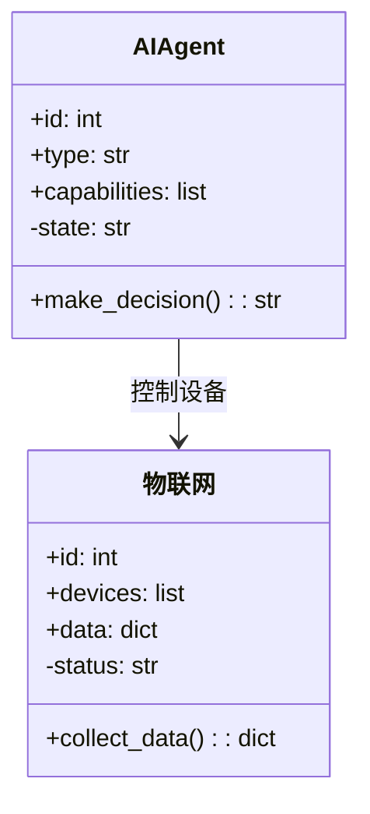
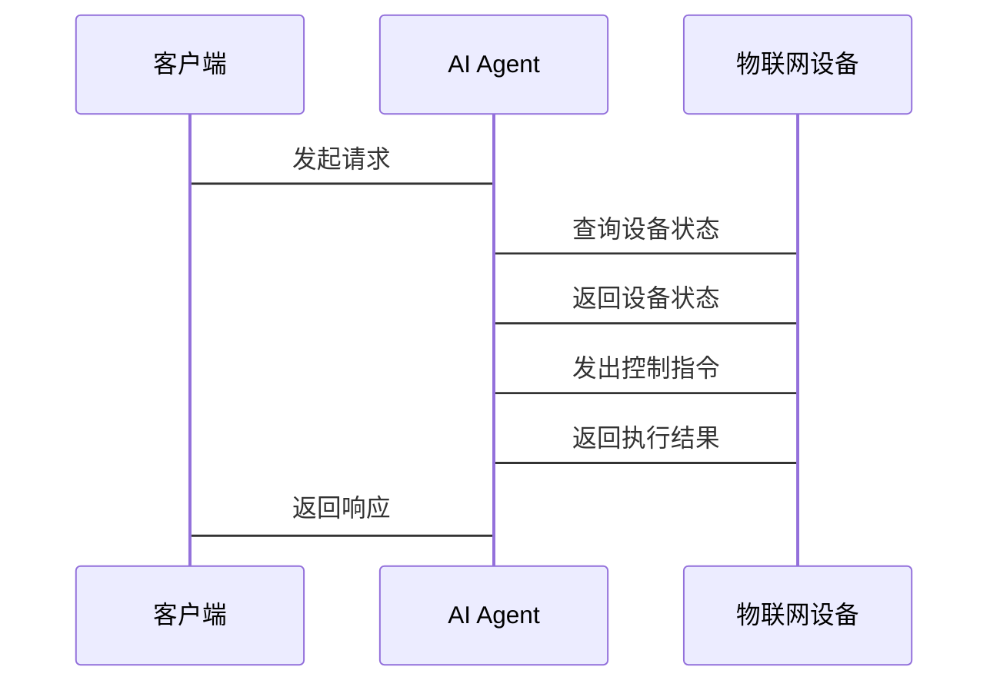

                 


# AI Agent与物联网的结合应用

> 关键词：AI Agent，物联网，多智能体系统，边缘计算，实时决策，联合推理

> 摘要：本文将详细探讨AI Agent与物联网的结合应用，从背景介绍、核心概念、算法原理到系统架构设计、项目实战及最佳实践，全面解析两者的结合对智能系统的影响和应用价值。文章内容涵盖AI Agent与物联网的核心概念对比、算法原理分析、系统架构设计以及实际项目案例，旨在为读者提供一个全面而深入的技术视角。

---

# 第一章: AI Agent与物联网的背景介绍

## 1.1 AI Agent的基本概念

### 1.1.1 AI Agent的定义
AI Agent（人工智能代理）是指能够感知环境、自主决策并执行任务的智能实体。它能够根据环境输入的信息，通过内部算法进行推理和学习，从而做出最优决策。AI Agent的核心在于其自主性和智能性。

### 1.1.2 AI Agent的核心属性
AI Agent具有以下核心属性：
1. **自主性**：能够在无外部干预的情况下独立运作。
2. **反应性**：能够实时感知环境并做出响应。
3. **目标导向**：基于目标进行决策和行动。
4. **学习能力**：能够通过经验改进性能。

### 1.1.3 AI Agent的分类与特点
AI Agent可以根据智能水平和应用场景分为以下几类：
1. **反应式AI Agent**：基于当前感知做出反应，适用于实时任务。
2. **认知式AI Agent**：具备复杂推理和规划能力，适用于复杂场景。
3. **协作式AI Agent**：能够与其他AI Agent或人类协同工作。

---

## 1.2 物联网的基本概念

### 1.2.1 物联网的定义
物联网（Internet of Things, IoT）是指通过各种信息传感设备，如传感器、RFID技术、红外感应器等，按约定的协议，把任何物品与互联网相连接，实现智能化识别、定位、跟踪、监控和管理的网络。

### 1.2.2 物联网的核心技术
物联网的核心技术包括：
1. **感知层**：通过传感器、RFID等技术采集数据。
2. **网络层**：通过有线或无线网络传输数据。
3. **应用层**：对数据进行处理、分析并提供决策支持。

### 1.2.3 物联网的应用场景
物联网的应用场景广泛，包括智能家居、智慧城市、工业物联网（IIoT）、医疗物联网等领域。

---

## 1.3 AI Agent与物联网的结合意义

### 1.3.1 AI Agent在物联网中的作用
AI Agent能够为物联网提供智能决策和自动化能力，例如：
1. **智能设备控制**：通过AI Agent实现设备的自主控制。
2. **数据智能分析**：利用AI Agent对物联网数据进行实时分析和预测。

### 1.3.2 物联网为AI Agent提供的应用场景
物联网提供了丰富的数据来源和应用场景，例如：
1. **实时监控**：AI Agent可以通过物联网实时监控设备状态。
2. **智能调度**：AI Agent可以优化物联网资源的调度。

### 1.3.3 两者的结合对智能系统的影响
AI Agent与物联网的结合将推动智能系统的发展，例如：
1. **提升系统效率**：通过AI Agent优化物联网系统的运行效率。
2. **增强决策能力**：AI Agent能够为物联网提供更智能的决策支持。

---

## 1.4 本章小结
本章从AI Agent和物联网的基本概念出发，分析了两者的核心属性和应用场景，并探讨了它们结合的意义和影响。接下来，我们将深入探讨AI Agent与物联网的核心概念与联系。

---

# 第二章: AI Agent与物联网的核心概念与联系

## 2.1 AI Agent与物联网的核心概念对比

### 2.1.1 AI Agent的核心概念
AI Agent的核心概念包括自主性、反应性、目标导向和学习能力。

### 2.1.2 物联网的核心概念
物联网的核心概念包括感知层、网络层和应用层。

### 2.1.3 两者的核心概念对比
通过对比AI Agent和物联网的核心概念，我们可以发现：
1. AI Agent注重智能性和自主性，而物联网注重数据采集和网络传输。
2. AI Agent能够为物联网提供智能决策支持，而物联网为AI Agent提供丰富的数据来源。

---

## 2.2 AI Agent与物联网的属性特征对比

### 2.2.1 AI Agent的属性特征
1. **自主性**：独立运作。
2. **反应性**：实时感知和响应。
3. **目标导向**：基于目标进行决策。
4. **学习能力**：通过经验改进性能。

### 2.2.2 物联网的属性特征
1. **感知性**：通过传感器采集数据。
2. **网络性**：通过网络传输数据。
3. **应用性**：通过应用层提供服务。

### 2.2.3 两者属性特征的对比分析
通过对比分析，我们可以发现AI Agent和物联网在属性特征上既有相似之处，也有互补性。

---

## 2.3 AI Agent与物联网的ER实体关系图

```mermaid
er
    entity AI Agent {
        id
        type
        capabilities
    }
    entity 物联网 {
        id
        devices
        data
    }
    AI Agent -- 物联网: 服务与控制
```

---

## 2.4 本章小结
本章通过对比分析AI Agent和物联网的核心概念和属性特征，揭示了两者之间的联系与互补性。接下来，我们将深入探讨AI Agent与物联网的算法原理。

---

# 第三章: AI Agent与物联网的算法原理

## 3.1 AI Agent的核心算法

### 3.1.1 多智能体系统算法
多智能体系统算法是一种用于协调多个AI Agent协同工作的算法，例如：

$$ \text{联合推理算法} = \sum_{i=1}^{n} \text{Agent}_i \text{的状态} $$

### 3.1.2 强化学习算法
强化学习算法是一种通过试错学习来优化决策的算法，例如：

$$ Q(s,a) = r + \gamma \max_{a'} Q(s',a') $$

### 3.1.3 联合推理算法
联合推理算法是一种用于多个AI Agent协同推理的算法，例如：

$$ P(\text{联合决策} | \text{输入}) = \prod_{i=1}^{n} P(\text{Agent}_i \text{的决策} | \text{输入}) $$

---

## 3.2 物联网中的AI Agent算法

### 3.2.1 数据采集与处理算法
数据采集与处理算法用于从物联网设备中采集数据并进行预处理，例如：

```python
import numpy as np

def preprocess(data):
    # 数据清洗
    cleaned_data = data.dropna()
    # 数据标准化
    normalized_data = (cleaned_data - cleaned_data.mean()) / cleaned_data.std()
    return normalized_data
```

### 3.2.2 实时决策算法
实时决策算法用于根据实时数据做出决策，例如：

```python
def decide(action_space, state):
    # 基于强化学习的决策
    return np.argmax(action_space.model.predict(state))
```

### 3.2.3 自适应优化算法
自适应优化算法用于优化物联网系统的性能，例如：

$$ \text{优化目标} = \min_{x} \text{cost}(x) + \lambda \text{constraint}(x) $$

---

## 3.3 算法原理的数学模型

### 3.3.1 联合推理算法的数学模型
联合推理算法的数学模型可以表示为：

$$ P(\text{联合决策} | \text{输入}) = \prod_{i=1}^{n} P(\text{Agent}_i \text{的决策} | \text{输入}) $$

### 3.3.2 边缘计算优化算法的数学模型
边缘计算优化算法的数学模型可以表示为：

$$ \text{优化目标} = \min_{x} \text{cost}(x) + \lambda \text{constraint}(x) $$

---

## 3.4 本章小结
本章详细介绍了AI Agent和物联网中的核心算法，包括多智能体系统算法、强化学习算法和联合推理算法。接下来，我们将探讨AI Agent与物联网的系统架构设计。

---

# 第四章: AI Agent与物联网的系统分析与架构设计

## 4.1 问题场景介绍

### 4.1.1 问题背景
我们假设一个智能家居场景，需要通过AI Agent和物联网实现设备的智能控制。

### 4.1.2 问题描述
在智能家居场景中，AI Agent需要通过物联网设备实时采集数据并做出决策。

### 4.1.3 问题解决
通过AI Agent与物联网的结合，实现设备的智能控制和优化。

---

## 4.2 系统功能设计

### 4.2.1 领域模型设计
领域模型设计可以表示为：



---

## 4.3 系统架构设计

### 4.3.1 系统架构图
系统架构图可以表示为：


---

## 4.4 系统接口设计

### 4.4.1 系统接口描述
1. **AI Agent接口**：
   - 输入：设备状态数据
   - 输出：控制指令

2. **物联网设备接口**：
   - 输入：控制指令
   - 输出：设备状态反馈

### 4.4.2 系统交互流程
系统交互流程可以表示为：



---

## 4.5 本章小结
本章通过智能家居场景，详细设计了AI Agent与物联网的系统架构和接口设计。接下来，我们将通过一个实际项目案例，进一步探讨AI Agent与物联网的结合应用。

---

# 第五章: 项目实战——智能家居场景

## 5.1 环境安装与配置

### 5.1.1 系统环境
- 操作系统：Linux/Windows/MacOS
- Python版本：3.6+

### 5.1.2 工具安装
1. 安装Python依赖：
   ```bash
   pip install numpy pandas scikit-learn
   ```

2. 安装物联网设备驱动。

---

## 5.2 系统核心实现

### 5.2.1 数据采集与处理模块
```python
import pandas as pd
from sklearn.preprocessing import StandardScaler

def preprocess(data):
    # 数据清洗
    cleaned_data = data.dropna()
    # 数据标准化
    scaler = StandardScaler()
    normalized_data = scaler.fit_transform(cleaned_data)
    return normalized_data
```

### 5.2.2 AI Agent决策模块
```python
from sklearn import tree

class AI_Agent:
    def __init__(self):
        self.model = tree.DecisionTreeClassifier()

    def train(self, X, y):
        self.model.fit(X, y)

    def decide(self, X):
        return self.model.predict(X)
```

### 5.2.3 物联网设备控制模块
```python
import serial

class IoT_Device:
    def __init__(self, port, baudrate):
        self.port = port
        self.baudrate = baudrate
        self.ser = serial.Serial(port, baudrate)

    def send_command(self, command):
        self.ser.write(command.encode())

    def read_response(self):
        return self.ser.readline().decode()
```

---

## 5.3 项目实战与案例分析

### 5.3.1 案例分析
在智能家居场景中，AI Agent通过物联网设备实时采集温度数据，并根据预设的阈值做出是否开启空调的决策。

### 5.3.2 项目实现
1. 数据采集与处理：
   ```python
   data = pd.read_csv('temperature.csv')
   normalized_data = preprocess(data)
   ```

2. AI Agent训练与决策：
   ```python
   agent = AI_Agent()
   agent.train(normalized_data, labels)
   ```

3. 设备控制：
   ```python
   device = IoT_Device('COM3', 9600)
   device.send_command('set_temp=25')
   ```

---

## 5.4 项目总结
本项目通过AI Agent与物联网的结合，实现了智能家居场景中的智能设备控制。AI Agent能够根据实时数据做出决策，而物联网设备则负责数据的采集与执行。

---

# 第六章: 总结与展望

## 6.1 总结
本文详细探讨了AI Agent与物联网的结合应用，从核心概念到算法原理，再到系统架构设计和项目实战，全面解析了两者的结合对智能系统的影响。

## 6.2 未来展望
随着AI技术的不断发展，AI Agent与物联网的结合将更加紧密，未来可能会在以下几个方面取得突破：
1. **更高效的协同算法**：开发更高效的多智能体协同算法。
2. **更智能的决策系统**：通过深度学习和强化学习提升决策能力。
3. **更广泛的应用场景**：AI Agent与物联网将应用于更多领域，如智慧城市、工业自动化等。

## 6.3 最佳实践Tips

### 6.3.1 小结
AI Agent与物联网的结合将推动智能系统的发展，为各行业带来更多的创新机遇。

### 6.3.2 注意事项
1. 在设计系统时，需要充分考虑系统的实时性和可靠性。
2. 在实现AI Agent时，需要选择合适的算法和模型。
3. 在物联网设备的部署中，需要考虑设备的兼容性和安全性。

### 6.3.3 拓展阅读
1. 《Multi-Agent Systems: Complexity Decomposition and Its Applications》
2. 《Deep Learning for IoT: A Comprehensive Survey》

---

# 作者：AI天才研究院/AI Genius Institute & 禅与计算机程序设计艺术 /Zen And The Art of Computer Programming

---

通过本文的详细分析，我们希望能够为读者提供一个全面而深入的技术视角，帮助读者更好地理解AI Agent与物联网的结合应用。

