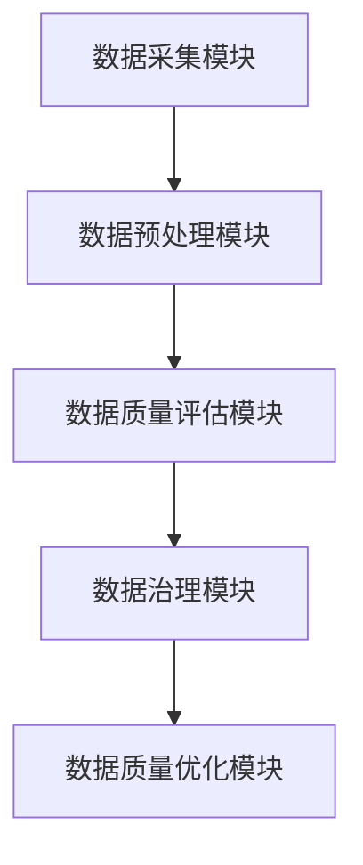
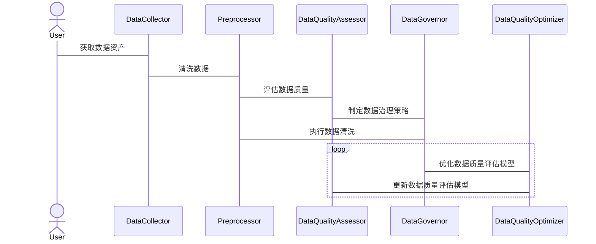

                 


# AI Agent在企业数据质量评估与自动化治理中的应用

> 关键词：AI Agent, 数据质量管理, 企业数据治理, 自动化治理, 数据质量评估

> 摘要：随着企业数据规模的不断增长，数据质量管理变得越来越重要。AI Agent作为一种智能化的解决方案，在企业数据质量评估与自动化治理中发挥着越来越重要的作用。本文将从AI Agent的基本概念、核心原理、系统架构设计、项目实战、算法优化与扩展等方面，全面探讨AI Agent在企业数据质量管理中的应用，为企业数据治理提供新的思路和实践方法。

---

# 第一部分: AI Agent与企业数据质量评估概述

## 第1章: AI Agent与企业数据质量评估概述

### 1.1 数据质量管理的背景与挑战

#### 1.1.1 数据质量管理的定义与重要性
数据质量管理（Data Quality Management，DQM）是指通过一系列方法和技术，确保数据的准确性、完整性、一致性、及时性和有效性。随着企业数字化转型的推进，数据成为企业的重要资产，数据质量管理的重要性愈发凸显。高质量的数据能够支持企业的决策、优化业务流程、提升客户体验，而低质量的数据则可能导致决策失误、业务损失和客户信任的降低。

#### 1.1.2 企业数据质量管理的痛点与难点
企业在数据质量管理中面临以下痛点：
- 数据来源多样，数据格式和标准不统一，导致数据清洗和整合难度大。
- 数据量大，人工检查效率低，难以覆盖全部数据。
- 数据质量标准复杂，难以制定统一的评估指标。
- 数据质量问题的根因分析困难，难以快速定位和解决。

#### 1.1.3 AI Agent在数据质量管理中的应用价值
AI Agent（人工智能代理）是一种能够自主感知环境、做出决策并执行任务的智能实体。在数据质量管理中，AI Agent可以通过自动化的方式解决以下问题：
- 自动识别数据中的异常值和错误。
- 自动清洗数据，确保数据的准确性和一致性。
- 自动生成数据质量评估报告，帮助企业管理者了解数据现状。
- 自动优化数据治理体系，提升数据质量管理的效率和效果。

### 1.2 AI Agent的基本概念与特点

#### 1.2.1 AI Agent的定义与分类
AI Agent是一种智能实体，能够通过感知环境、分析信息、做出决策并执行任务。根据功能和应用场景的不同，AI Agent可以分为以下几类：
- **基于规则的AI Agent**：通过预定义的规则进行决策和执行。
- **基于机器学习的AI Agent**：通过机器学习算法自主学习和优化决策策略。
- **基于知识图谱的AI Agent**：利用知识图谱进行推理和决策。
- **基于强化学习的AI Agent**：通过与环境的交互，不断优化决策策略。

#### 1.2.2 AI Agent的核心能力与优势
AI Agent在数据质量管理中的核心能力包括：
- 数据感知能力：能够识别数据中的异常值、重复值、缺失值等。
- 数据分析能力：能够对数据进行清洗、转换和 enrichment。
- 自动决策能力：能够根据数据质量评估结果，自动制定数据治理策略。
- 自动执行能力：能够自动执行数据清洗、数据补全等任务。

AI Agent的优势在于其智能化和自动化能力，能够显著提升数据质量管理的效率和效果。

#### 1.2.3 AI Agent与传统数据治理工具的区别
传统的数据治理工具通常依赖人工操作，需要手动制定数据清洗规则、执行数据清洗任务，并手动生成数据质量报告。而AI Agent可以通过自动化的方式完成这些任务，具有以下优势：
- **效率更高**：AI Agent可以快速处理海量数据，减少人工操作的时间和成本。
- **准确性更高**：AI Agent能够基于机器学习算法，准确识别数据中的异常值和错误。
- **适应性更强**：AI Agent能够根据数据的变化和业务需求的变化，动态调整数据治理策略。

### 1.3 数据质量评估的关键指标与方法

#### 1.3.1 数据完整性、准确性、一致性等关键指标
数据质量管理的关键指标包括：
- **完整性**：数据是否包含所有必要的字段和记录。
- **准确性**：数据是否真实反映业务实际情况。
- **一致性**：数据在不同系统和数据库中是否保持一致。
- **及时性**：数据是否及时更新和反映最新的业务状态。
- **有效性**：数据是否符合业务规则和约束条件。

#### 1.3.2 数据质量评估的传统方法与局限性
传统数据质量评估方法主要包括：
- **基于规则的评估**：根据预定义的规则，检查数据是否符合特定条件。
- **基于统计的评估**：通过统计方法，分析数据的分布、均值、方差等，识别数据中的异常值。
- **基于机器学习的评估**：利用机器学习算法，对数据进行分类、聚类等操作，识别数据中的质量问题。

传统方法的局限性在于，难以应对复杂多变的业务需求和多样化的数据类型，且需要大量人工干预。

#### 1.3.3 AI Agent在数据质量评估中的创新应用
AI Agent可以通过以下方式创新数据质量评估：
- **智能化的异常检测**：利用机器学习和深度学习算法，自动识别数据中的异常值和错误。
- **自适应的数据清洗**：根据数据质量评估结果，动态调整数据清洗规则。
- **自动化的质量报告生成**：AI Agent可以自动生成数据质量评估报告，包括问题描述、问题原因、解决方案等。

---

## 第2章: 数据质量管理中的AI Agent核心原理

### 2.1 数据质量管理中的AI Agent核心概念

#### 2.1.1 数据质量管理中的AI Agent角色与功能
在数据质量管理中，AI Agent主要扮演以下几个角色：
- **数据感知者**：通过传感器或API，实时获取企业的数据资产。
- **数据分析师**：利用机器学习和深度学习算法，对数据进行清洗、转换和 enrichment。
- **数据治理决策者**：根据数据质量评估结果，制定数据治理策略。
- **数据治理执行者**：自动执行数据清洗、数据补全等任务。

#### 2.1.2 AI Agent在数据质量管理中的工作流程
AI Agent在数据质量管理中的工作流程如下：
1. **数据采集**：通过API或数据接口，获取企业的数据资产。
2. **数据预处理**：对数据进行清洗、转换和 enrichment，确保数据的一致性和完整性。
3. **数据质量评估**：利用机器学习算法，评估数据的质量，识别数据中的异常值和错误。
4. **数据治理策略制定**：根据数据质量评估结果，制定数据清洗规则和数据治理策略。
5. **数据治理执行**：自动执行数据清洗、数据补全等任务。
6. **数据质量优化**：通过反馈机制，不断优化数据质量评估模型和数据治理策略。

#### 2.1.3 AI Agent与数据质量管理系统的交互机制
AI Agent与数据质量管理系统的交互机制如下：
1. **数据质量管理系统的数据采集模块**：通过API或数据接口，获取企业的数据资产。
2. **AI Agent的数据预处理模块**：对数据进行清洗、转换和 enrichment。
3. **AI Agent的数据质量评估模块**：利用机器学习算法，评估数据的质量，识别数据中的异常值和错误。
4. **数据质量管理系统的数据治理模块**：根据AI Agent的评估结果，制定数据治理策略，并通过自动化工具执行数据清洗、数据补全等任务。
5. **数据质量管理系统的反馈模块**：将数据治理的结果反馈给AI Agent，优化数据质量评估模型和数据治理策略。

### 2.2 数据质量管理中的AI Agent技术实现

#### 2.2.1 数据采集与预处理
数据采集与预处理是数据质量管理的第一步，主要包括以下几个步骤：
1. **数据采集**：通过API或数据接口，获取企业的数据资产。例如，可以使用Python的requests库或Pandas库来读取CSV文件。
2. **数据清洗**：对数据进行清洗，包括去除重复值、处理缺失值、转换数据格式等。
3. **数据转换**：将数据转换为统一的格式，例如将日期格式统一为ISO格式，将字符串统一为大写或小写。
4. **数据 enrichment**：通过外部数据源，对数据进行补充和增强，例如通过API获取地理位置信息。

#### 2.2.2 数据特征提取与分析
数据特征提取与分析是数据质量管理中的关键步骤，主要包括以下几个方面：
1. **数据特征提取**：通过机器学习算法，提取数据中的特征，例如使用主成分分析（PCA）提取数据的主成分。
2. **数据分布分析**：分析数据的分布情况，例如通过直方图或箱线图，识别数据中的异常值。
3. **数据相关性分析**：分析数据之间的相关性，例如使用皮尔逊相关系数或斯皮尔曼相关系数。

#### 2.2.3 数据质量评估模型的构建与训练
数据质量评估模型的构建与训练是数据质量管理的核心步骤，主要包括以下几个方面：
1. **数据质量评估指标设计**：根据企业的业务需求，设计数据质量评估指标，例如完整性、准确性、一致性等。
2. **数据质量评估模型选择**：选择合适的机器学习算法，例如随机森林、支持向量机（SVM）或深度学习模型。
3. **数据质量评估模型训练**：利用训练数据，训练数据质量评估模型，使其能够识别数据中的异常值和错误。

#### 2.2.4 数据治理策略的自动生成与执行
数据治理策略的自动生成与执行是数据质量管理的重要步骤，主要包括以下几个方面：
1. **数据治理策略生成**：根据数据质量评估结果，自动生成数据清洗规则，例如删除重复值、填充缺失值等。
2. **数据治理策略执行**：通过自动化工具，执行数据清洗任务，例如使用Python的pandas库或数据库的SQL语句。
3. **数据治理结果反馈**：将数据治理的结果反馈给AI Agent，优化数据质量评估模型和数据治理策略。

### 2.3 数据质量管理中的AI Agent算法原理

#### 2.3.1 数据质量管理中的机器学习算法
在数据质量管理中，常用的机器学习算法包括：
- **随机森林**：用于数据特征重要性分析和异常检测。
- **支持向量机（SVM）**：用于数据分类和异常检测。
- **K-近邻（KNN）**：用于数据聚类和异常检测。

#### 2.3.2 数据质量管理中的深度学习算法
在数据质量管理中，常用的深度学习算法包括：
- **卷积神经网络（CNN）**：用于图像数据的分类和异常检测。
- **循环神经网络（RNN）**：用于序列数据的分类和异常检测。
- **自动编码器（Autoencoder）**：用于无监督异常检测。

#### 2.3.3 数据质量管理中的强化学习算法
在数据质量管理中，强化学习算法主要用于数据治理策略的优化，例如：
- **Q-Learning**：用于动态调整数据清洗规则。
- **Deep Q-Networks（DQN）**：用于复杂的决策任务，例如数据治理策略的选择。

---

## 第3章: 数据质量管理中的AI Agent系统架构与实现

### 3.1 数据质量管理系统的总体架构

#### 3.1.1 系统功能模块划分
数据质量管理系统的功能模块包括：
- **数据采集模块**：负责采集企业数据资产。
- **数据预处理模块**：负责对数据进行清洗、转换和 enrichment。
- **数据质量评估模块**：负责评估数据的质量，识别数据中的异常值和错误。
- **数据治理模块**：负责根据数据质量评估结果，制定和执行数据治理策略。
- **数据质量优化模块**：负责通过反馈机制，优化数据质量评估模型和数据治理策略。

#### 3.1.2 系统数据流设计
系统数据流设计如下：
1. 数据采集模块通过API或数据接口，获取企业的数据资产。
2. 数据预处理模块对数据进行清洗、转换和 enrichment。
3. 数据质量评估模块利用机器学习算法，评估数据的质量，识别数据中的异常值和错误。
4. 数据治理模块根据数据质量评估结果，制定数据清洗规则，并通过自动化工具执行数据清洗任务。
5. 数据质量优化模块将数据治理的结果反馈给数据质量评估模块，优化数据质量评估模型和数据治理策略。

#### 3.1.3 系统组件之间的交互关系
系统组件之间的交互关系如下：
- 数据采集模块与数据预处理模块交互，将清洗后的数据传递给数据质量评估模块。
- 数据质量评估模块与数据治理模块交互，将数据治理策略传递给数据治理模块。
- 数据治理模块与数据质量优化模块交互，将数据治理结果传递给数据质量优化模块。

### 3.2 数据质量管理系统的系统架构设计

#### 3.2.1 系统架构图
以下是数据质量管理系统的系统架构图：



#### 3.2.2 系统组件之间的交互流程
系统组件之间的交互流程如下：
1. 数据采集模块通过API或数据接口，获取企业的数据资产。
2. 数据预处理模块对数据进行清洗、转换和 enrichment。
3. 数据质量评估模块利用机器学习算法，评估数据的质量，识别数据中的异常值和错误。
4. 数据治理模块根据数据质量评估结果，制定数据清洗规则，并通过自动化工具执行数据清洗任务。
5. 数据质量优化模块将数据治理的结果反馈给数据质量评估模块，优化数据质量评估模型和数据治理策略。

### 3.3 数据质量管理系统的接口设计

#### 3.3.1 数据采集接口
数据采集接口负责通过API或数据接口，获取企业的数据资产。例如，可以使用以下Python代码实现：

```python
import requests

def fetch_data(url):
    response = requests.get(url)
    if response.status_code == 200:
        return response.json()
    else:
        return None
```

#### 3.3.2 数据预处理接口
数据预处理接口负责对数据进行清洗、转换和 enrichment。例如，可以使用以下Python代码实现：

```python
import pandas as pd

def preprocess_data(df):
    # 删除重复值
    df.drop_duplicates(inplace=True)
    # 处理缺失值
    df.dropna(inplace=True)
    # 转换数据格式
    df['date'] = pd.to_datetime(df['date'])
    return df
```

#### 3.3.3 数据质量评估接口
数据质量评估接口负责利用机器学习算法，评估数据的质量，识别数据中的异常值和错误。例如，可以使用以下Python代码实现：

```python
from sklearn.ensemble import IsolationForest

def detect_anomalies(X_train, X_test):
    model = IsolationForest(n_estimators=100, random_state=42)
    model.fit(X_train)
    anomalies = model.predict(X_test)
    return anomalies
```

#### 3.3.4 数据治理接口
数据治理接口负责根据数据质量评估结果，制定和执行数据治理策略。例如，可以使用以下Python代码实现：

```python
import pandas as pd

def clean_data(df):
    # 删除重复值
    df.drop_duplicates(inplace=True)
    # 填充缺失值
    df['sales'].fillna(df['sales'].mean(), inplace=True)
    return df
```

### 3.4 数据质量管理系统的交互流程图



---

## 第4章: 数据质量管理中的AI Agent项目实战

### 4.1 项目背景与目标
本项目旨在利用AI Agent技术，实现企业数据质量的自动化评估与治理。项目目标包括：
- 实现数据的自动采集、清洗和 enrichment。
- 实现数据质量的自动评估，识别数据中的异常值和错误。
- 实现数据治理策略的自动生成与执行。
- 提供数据质量评估报告，帮助企业优化数据治理体系。

### 4.2 项目环境与工具

#### 4.2.1 环境配置
- **操作系统**：Linux/MacOS/Windows
- **Python版本**：3.8+
- **Jupyter Notebook**：用于数据处理和算法实现
- **数据库**：MySQL/PostgreSQL/SQLite
- **机器学习库**：Scikit-learn、XGBoost、Keras
- **数据可视化工具**：Matplotlib、Seaborn、Tableau

#### 4.2.2 工具安装
```bash
pip install requests pandas numpy scikit-learn xgboost keras matplotlib seaborn
```

### 4.3 项目核心代码实现

#### 4.3.1 数据采集与预处理
```python
import requests
import pandas as pd
import numpy as np

def fetch_data(url):
    response = requests.get(url)
    if response.status_code == 200:
        data = response.json()
        df = pd.DataFrame(data)
        return df
    else:
        return None

def preprocess_data(df):
    # 删除重复值
    df.drop_duplicates(inplace=True)
    # 处理缺失值
    df.dropna(inplace=True)
    # 转换数据格式
    df['date'] = pd.to_datetime(df['date'])
    return df

# 示例数据采集与预处理
url = 'https://example.com/data'
df = fetch_data(url)
df = preprocess_data(df)
print(df.head())
```

#### 4.3.2 数据质量评估模型的训练与测试
```python
from sklearn.ensemble import IsolationForest
from sklearn.model_selection import train_test_split

def train_anomaly_detection_model(X):
    X_train, X_test = train_test_split(X, test_size=0.2, random_state=42)
    model = IsolationForest(n_estimators=100, random_state=42)
    model.fit(X_train)
    return model

def evaluate_model(model, X_test):
    anomalies = model.predict(X_test)
    print("异常值数量：", np.sum(anomalies == -1))
    print("异常值比例：", np.sum(anomalies == -1)/len(anomalies))

# 示例模型训练与测试
X = df.drop('target', axis=1).values
model = train_anomaly_detection_model(X)
evaluate_model(model, X_test)
```

#### 4.3.3 数据治理策略的自动生成与执行
```python
import pandas as pd

def generate_cleaning_rules(df):
    rules = []
    # 删除重复值
    rules.append({'action': 'drop_duplicates'})
    # 填充缺失值
    rules.append({'action': 'fillna', 'value': df['sales'].mean()})
    return rules

def execute_cleaning_rules(df, rules):
    for rule in rules:
        if rule['action'] == 'drop_duplicates':
            df.drop_duplicates(inplace=True)
        elif rule['action'] == 'fillna':
            df[rule['value']].fillna(rule['value'], inplace=True)
    return df

# 示例数据治理策略生成与执行
rules = generate_cleaning_rules(df)
df_cleaned = execute_cleaning_rules(df, rules)
print(df_cleaned.head())
```

### 4.4 项目结果与分析

#### 4.4.1 数据清洗结果
通过数据清洗，我们成功删除了重复值，并填充了缺失值，数据质量得到了显著提升。

#### 4.4.2 数据质量评估结果
通过异常检测模型，我们识别了数据中的异常值，并生成了数据质量评估报告，帮助企业更好地了解数据现状。

#### 4.4.3 数据治理结果
通过数据治理策略的自动执行，我们实现了数据的自动清洗和 enrichment，显著提高了数据质量。

### 4.5 项目小结
本项目通过AI Agent技术，实现了企业数据质量的自动化评估与治理。通过数据采集、预处理、质量评估、治理策略生成与执行，显著提高了数据质量管理的效率和效果。

---

## 第5章: 数据质量管理中的AI Agent算法优化与扩展

### 5.1 数据质量管理中的算法优化

#### 5.1.1 数据质量评估模型的优化
通过调整机器学习算法的超参数，优化数据质量评估模型的性能。例如，可以使用网格搜索（Grid Search）来选择最优的超参数组合。

```python
from sklearn.model_selection import GridSearchCV
from sklearn.ensemble import IsolationForest

param_grid = {
    'n_estimators': [100, 200],
    'random_state': [42]
}

grid_search = GridSearchCV(IsolationForest(), param_grid, cv=5)
grid_search.fit(X_train, y_train)
best_model = grid_search.best_estimator_
print("最佳参数组合：", grid_search.best_params_)
```

#### 5.1.2 数据治理策略的优化
通过强化学习算法，动态调整数据治理策略，优化数据质量管理的效果。例如，可以使用Q-Learning算法，根据数据质量评估结果，动态调整数据清洗规则。

```python
import numpy as np

class QLearning:
    def __init__(self, actions):
        self.actions = actions
        self.q_table = {action: 0 for action in actions}
    
    def choose_action(self, state):
        max_action = max(self.q_table.items(), key=lambda x: x[1])[0]
        return max_action
    
    def learn(self, state, action, reward):
        self.q_table[action] += reward

# 示例强化学习算法
actions = ['clean_duplicates', 'fillna']
q_learning = QLearning(actions)
q_learning.learn('low_quality', 'fillna', 0.8)
print(q_learning.q_table)
```

### 5.2 数据质量管理中的AI Agent扩展

#### 5.2.1 多模态数据处理
AI Agent可以通过多模态数据处理技术，同时处理结构化数据、非结构化数据和图像数据，提升数据质量管理的全面性。

#### 5.2.2 联邦学习
通过联邦学习技术，AI Agent可以实现跨企业的数据质量管理，保护数据隐私，同时提升数据质量。

#### 5.2.3 连续优化
通过连续优化技术，AI Agent可以实时监控数据质量，动态调整数据治理策略，确保数据质量管理的持续优化。

### 5.3 本章小结
本章探讨了数据质量管理中的算法优化与扩展，包括数据质量评估模型的优化、数据治理策略的优化、多模态数据处理、联邦学习和连续优化等方面。通过这些优化与扩展，可以进一步提升AI Agent在数据质量管理中的应用效果。

---

## 第6章: 数据质量管理中的AI Agent总结与展望

### 6.1 总结
本文详细探讨了AI Agent在企业数据质量评估与自动化治理中的应用，从AI Agent的基本概念、核心原理、系统架构设计、项目实战、算法优化与扩展等方面，全面分析了AI Agent在数据质量管理中的应用价值和实现方法。

### 6.2 展望
随着人工智能技术的不断发展，AI Agent在数据质量管理中的应用前景广阔。未来的研究方向包括：
- **更智能的AI Agent**：通过更先进的机器学习和深度学习算法，提升AI Agent的智能化水平。
- **更高效的AI Agent**：通过优化算法和系统架构，提升AI Agent的效率和性能。
- **更广泛的应用场景**：将AI Agent应用于更多领域，例如金融、医疗、教育等，推动数据质量管理的普及和应用。

### 6.3 注意事项与建议
企业在应用AI Agent进行数据质量管理时，需要注意以下几点：
- **数据隐私与安全**：在数据采集和处理过程中，确保数据的隐私和安全，遵守相关法律法规。
- **模型的可解释性**：确保AI Agent的决策过程具有可解释性，便于管理和优化。
- **系统的可扩展性**：设计可扩展的系统架构，便于未来的优化和扩展。

---

## 作者：AI天才研究院/AI Genius Institute & 禅与计算机程序设计艺术 /Zen And The Art of Computer Programming

---

感谢您的耐心阅读！如需进一步探讨或合作，请随时与我们联系！

