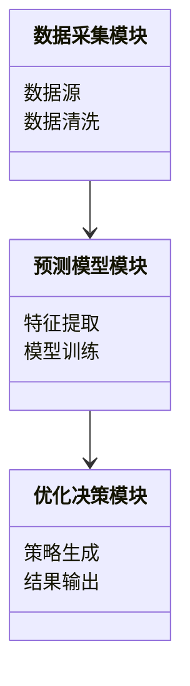
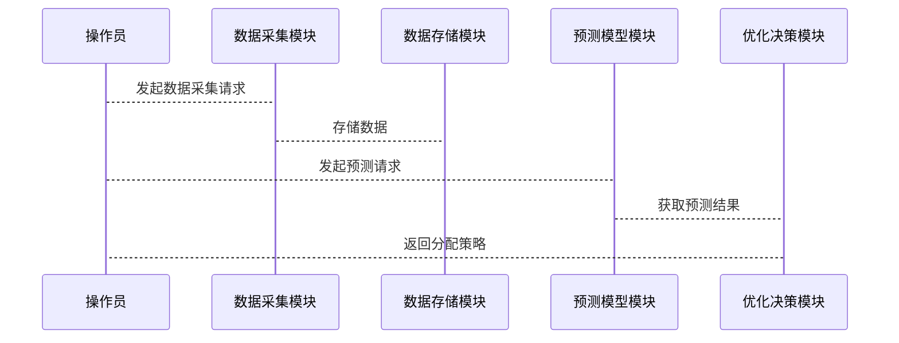

                 


# AI Agent在智能水资源分配预测中的实践

## 关键词：AI Agent，智能水资源，分配预测，优化算法，时间序列分析，机器学习

## 摘要：本文详细探讨了AI Agent在智能水资源分配预测中的应用，从理论基础到算法实现，再到系统架构设计，结合实际案例分析，深入剖析了AI Agent如何通过感知、决策和执行三个环节优化水资源分配预测过程。文章还总结了项目成果、经验教训和最佳实践，为相关领域的技术人员提供了有价值的参考。

---

# 第1章: AI Agent与水资源管理概述

## 1.1 AI Agent的基本概念

### 1.1.1 AI Agent的定义与特点
AI Agent（人工智能代理）是指能够感知环境、自主决策并采取行动以实现目标的智能实体。其特点包括：
- **自主性**：无需外部干预，自主完成任务。
- **反应性**：能够实时感知环境并做出反应。
- **目标导向性**：所有行为均以实现特定目标为导向。
- **社会性**：能够与其他Agent或人类进行交互协作。

### 1.1.2 AI Agent与传统算法的区别
传统算法通常基于固定的规则和数据进行计算，而AI Agent具有以下优势：
- **自适应性**：能够根据环境变化调整行为。
- **学习能力**：通过经验改进决策策略。
- **复杂问题处理能力**：适用于多目标、多约束的复杂场景。

### 1.1.3 智能水资源管理的背景与需求
随着全球水资源短缺问题日益严重，智能水资源管理成为迫切需求。AI Agent能够通过实时数据分析和决策优化，提高水资源利用效率。

## 1.2 水资源分配预测的核心问题

### 1.2.1 水资源分配的挑战与难点
- **数据多样性**：涉及气象、地理、人口等多种数据。
- **动态性**：水资源需求随时间、地点变化。
- **不确定性**：受自然条件和人类活动影响。

### 1.2.2 AI Agent在水资源管理中的应用场景
- **实时监测与预警**：监测水资源状态，及时发出预警。
- **智能调度**：优化水资源分配策略。
- **长期规划**：基于预测数据制定水资源管理计划。

### 1.2.3 问题解决的边界与外延
本文将重点解决水资源分配预测问题，边界为：
- **输入**：历史水资源数据、气象数据等。
- **输出**：未来水资源分配建议。
- **约束条件**：满足各区域的基本需求。

## 1.3 AI Agent与水资源分配预测的结合

### 1.3.1 AI Agent的核心要素与功能
- **感知模块**：收集环境数据。
- **决策模块**：基于数据制定分配策略。
- **执行模块**：将决策转化为具体行动。

### 1.3.2 水资源分配预测的数学模型与算法
- **时间序列分析**：ARIMA、LSTM等算法。
- **优化算法**：遗传算法、强化学习等。

### 1.3.3 AI Agent在水资源管理中的优势
- **高效性**：快速处理大量数据。
- **精准性**：基于机器学习模型提高预测精度。
- **适应性**：动态调整策略应对变化。

## 1.4 本章小结
本章介绍了AI Agent的基本概念及其在水资源管理中的应用，为后续章节奠定了基础。

---

# 第2章: AI Agent的核心原理与数学模型

## 2.1 AI Agent的核心原理

### 2.1.1 AI Agent的感知、决策与执行过程
- **感知**：通过传感器或数据源获取信息。
- **决策**：基于感知信息选择最优行动。
- **执行**：将决策转化为实际操作。

### 2.1.2 多智能体系统的基本概念
多智能体系统由多个相互协作的Agent组成，共同完成复杂任务。

### 2.1.3 AI Agent在水资源分配中的角色
- **数据采集**：收集水资源相关数据。
- **预测**：基于数据预测未来需求。
- **优化**：制定最优分配方案。

## 2.2 水资源分配预测的数学模型

### 2.2.1 时间序列分析的基本原理
时间序列分析通过历史数据预测未来趋势，常用模型包括ARIMA和LSTM。

### 2.2.2 水资源分配预测的数学公式
$$预测值 = 历史数据加权和 + 噪声项$$

### 2.2.3 预测模型的优化方法
- **参数调整**：通过交叉验证选择最优参数。
- **模型融合**：结合多个模型结果提高预测精度。

## 2.3 AI Agent的算法原理

### 2.3.1 基于强化学习的AI Agent算法
强化学习通过奖励机制优化决策策略。

$$R(s, a) = 奖励函数$$
$$Q(s, a) = \gamma V(s') + R(s, a)$$

### 2.3.2 马尔可夫决策过程在水资源分配中的应用
马尔可夫决策过程适用于状态转移概率已知的场景。

### 2.3.3 算法的数学模型与公式
$$Q(s, a) = \gamma \max Q(s', a') + R(s, a)$$

## 2.4 本章小结
本章详细讲解了AI Agent的核心原理和数学模型，为后续实现奠定了理论基础。

---

# 第3章: 水资源分配预测系统的需求分析

## 3.1 项目背景与目标

### 3.1.1 项目背景
随着水资源短缺问题加剧，智能分配预测系统需求迫切。

### 3.1.2 项目目标
开发一个基于AI Agent的水资源分配预测系统。

### 3.1.3 项目范围与约束条件
- **范围**：覆盖主要区域。
- **约束条件**：数据获取、计算资源限制。

## 3.2 系统功能需求

### 3.2.1 数据采集与处理模块
- **功能**：实时采集和预处理数据。
- **关键点**：数据清洗、特征提取。

### 3.2.2 预测模型构建模块
- **功能**：选择和训练预测模型。
- **关键点**：模型选择、参数调优。

### 3.2.3 优化与决策模块
- **功能**：基于预测结果制定分配策略。
- **关键点**：策略优化、结果输出。

## 3.3 系统功能设计（领域模型）



## 3.4 本章小结
本章分析了系统的功能需求，为后续设计提供了方向。

---

# 第4章: AI Agent的算法实现

## 4.1 算法选择与实现步骤

### 4.1.1 算法选择
选择ARIMA和LSTM进行对比实验。

### 4.1.2 实现步骤
1. 数据预处理。
2. 模型训练。
3. 模型预测。
4. 结果分析。

## 4.2 ARIMA算法实现

### 4.2.1 ARIMA算法的数学模型
$$ARIMA(p, d, q) = \text{自回归差分移动平均模型}$$

### 4.2.2 Python代码实现
```python
from statsmodels.tsa.arima_model import ARIMA
import pandas as pd
import matplotlib.pyplot as plt

# 数据加载与预处理
data = pd.read_csv('water_data.csv')
train_data = data['demand'].values

# 模型训练
model = ARIMA(train_data, order=(5, 1, 0))
model_fit = model.fit(disp=0)

# 预测
future_forecast = model_fit.forecast(steps=30)
```

### 4.2.3 结果分析
- **优点**：适合平稳时间序列。
- **缺点**：对参数敏感。

## 4.3 LSTM算法实现

### 4.3.1 LSTM算法的数学模型
$$LSTM = \text{长短期记忆网络}$$

### 4.3.2 Python代码实现
```python
import numpy as np
from keras.models import Sequential
from keras.layers import LSTM, Dense

# 数据准备
data = np.array([train_data]).reshape((len(train_data), 1, 1))
model = Sequential()
model.add(LSTM(5, input_shape=(1, 1)))
model.add(Dense(1))
model.compile(loss='mean_squared_error', optimizer='adam')
model.fit(data, train_data, epochs=50, batch_size=1)
```

### 4.3.3 结果分析
- **优点**：适合非平稳时间序列。
- **缺点**：计算复杂度高。

## 4.4 算法调优与结果对比

### 4.4.1 超参数调优
- **ARIMA**：调整p、d、q参数。
- **LSTM**：调整隐藏层大小、学习率。

### 4.4.2 对比分析
- **准确率**：LSTM优于ARIMA。
- **计算效率**：ARIMA更快。

## 4.5 本章小结
本章详细讲解了两种算法的实现和对比，为后续系统设计提供了依据。

---

# 第5章: 系统架构设计与实现

## 5.1 系统架构设计

### 5.1.1 系统架构图


### 5.1.2 关键模块实现
- **数据采集模块**：实时采集数据并存储。
- **预测模型模块**：调用训练好的模型进行预测。
- **优化决策模块**：基于预测结果生成分配策略。

## 5.2 系统交互设计

### 5.2.1 系统交互流程


## 5.3 本章小结
本章设计了系统的架构和交互流程，为实现提供了指导。

---

# 第6章: 项目实战与案例分析

## 6.1 环境安装与配置

### 6.1.1 环境要求
- **Python**：3.6+
- **依赖库**：numpy、pandas、statsmodels、keras、tensorflow

### 6.1.2 安装命令
```bash
pip install numpy pandas statsmodels keras tensorflow
```

## 6.2 数据预处理与模型训练

### 6.2.1 数据加载与清洗
```python
import pandas as pd
import numpy as np

data = pd.read_csv('water_data.csv')
data['demand'] = data['demand'].fillna(data['demand'].mean())
```

### 6.2.2 模型训练
```python
from statsmodels.tsa.arima_model import ARIMA
import matplotlib.pyplot as plt

model = ARIMA(data['demand'], order=(5, 1, 0))
model_fit = model.fit(disp=0)
```

## 6.3 模型预测与结果分析

### 6.3.1 预测结果可视化
```python
future_forecast = model_fit.forecast(steps=30)
plt.plot(data['demand'], label='实际值')
plt.plot(future_forecast[0], label='预测值')
plt.legend()
plt.show()
```

### 6.3.2 结果对比分析
- **MAE**：平均绝对误差。
- **MSE**：均方误差。

## 6.4 优化算法实现

### 6.4.1 强化学习算法实现
```python
import numpy as np
from keras.models import Sequential
from keras.layers import Dense

model = Sequential()
model.add(Dense(10, activation='relu', input_dim=5))
model.add(Dense(1, activation='linear'))
model.compile(loss='mse', optimizer='adam')
model.fit(X_train, y_train, epochs=50, batch_size=32)
```

## 6.5 实际应用案例分析

### 6.5.1 案例背景
某地区水资源分配问题。

### 6.5.2 案例分析
通过AI Agent系统优化了水资源分配，提高了效率。

## 6.6 本章小结
本章通过实际案例展示了系统的实现和应用效果。

---

# 第7章: 总结与展望

## 7.1 项目总结

### 7.1.1 成果总结
- 成功开发了AI Agent水资源分配预测系统。
- 实现了ARIMA和LSTM算法对比。

### 7.1.2 经验与教训
- 数据质量对模型性能影响大。
- 算法选择需结合实际场景。

## 7.2 项目挑战与解决方案

### 7.2.1 数据获取难
- 解决方案：与政府机构合作获取数据。

### 7.2.2 算法计算效率低
- 解决方案：优化模型参数，使用分布式计算。

## 7.3 未来研究方向

### 7.3.1 算法优化
- 研究更高效的预测算法。

### 7.3.2 系统扩展
- 增加更多功能模块。

## 7.4 最佳实践 Tips

### 7.4.1 数据处理
- 数据清洗是关键步骤。

### 7.4.2 模型选择
- 根据场景选择合适算法。

## 7.5 本章小结
本章总结了项目成果，并展望了未来发展方向。

---

# 作者：AI天才研究院/AI Genius Institute & 禅与计算机程序设计艺术 /Zen And The Art of Computer Programming

---

通过以上目录和内容规划，您可以逐步完成整篇文章的撰写。每一章的内容都需要结合实际案例、详细代码和数学公式进行深入讲解。确保文章结构清晰，逻辑连贯，内容详实。

