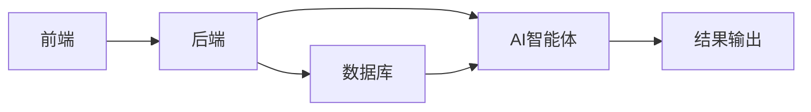

                 


# AI智能体在评估无形资产价值中的作用

> 关键词：AI智能体、无形资产、资产评估、机器学习、深度学习

> 摘要：本文深入探讨了AI智能体在评估无形资产价值中的应用，分析了AI智能体的核心原理、算法模型、系统架构设计及其在实际案例中的应用。通过详细的技术分析和实例说明，展示了AI智能体如何显著提升无形资产评估的效率和准确性，为相关领域的实践提供了有价值的参考和指导。

---

# 第一部分: AI智能体在无形资产评估中的背景与基础

# 第1章: 无形资产评估与AI智能体概述

## 1.1 无形资产评估的基本概念

### 1.1.1 无形资产的定义与分类

无形资产是指没有实体形态，但具有经济价值的资产。常见的无形资产包括专利权、商标权、著作权、商誉、品牌价值、软件技术等。这些资产的价值往往难以直接量化，但对企业的整体价值有着重要影响。

### 1.1.2 无形资产评估的目的与意义

无形资产评估的目的是为了确定无形资产的经济价值，为企业决策（如并购、融资、诉讼等）提供依据。传统的评估方法通常依赖于人工分析和经验判断，存在效率低、主观性强、结果不够精确等问题。

### 1.1.3 AI技术在无形资产评估中的应用背景

随着人工智能技术的快速发展，AI智能体（AI Agents）逐渐被应用于无形资产评估领域。AI智能体是一种能够感知环境、自主决策并执行任务的智能系统，能够通过大数据分析、机器学习等技术，显著提高评估的效率和准确性。

## 1.2 AI智能体的核心概念

### 1.2.1 AI智能体的定义与特点

AI智能体是一种具有感知、推理、决策和执行能力的智能系统。其特点是：

- **自主性**：能够自主决策，无需人工干预。
- **反应性**：能够实时感知环境并做出响应。
- **学习能力**：能够通过数据学习和优化。
- **适应性**：能够根据环境变化调整行为。

### 1.2.2 AI智能体与传统评估方法的对比

传统评估方法依赖于人工分析，存在以下问题：
- **效率低**：需要大量人工劳动。
- **主观性强**：受评估人员经验的影响。
- **精确度低**：难以处理复杂的数据。

AI智能体的优势在于：
- **高效性**：能够快速处理大量数据。
- **客观性**：基于数据和算法，减少人为干扰。
- **精确性**：通过机器学习算法提高评估结果的准确性。

### 1.2.3 AI智能体在无形资产评估中的优势

AI智能体在无形资产评估中的优势主要体现在以下几个方面：
- **数据处理能力**：能够快速处理和分析大量非结构化数据。
- **模式识别**：能够发现数据中的隐含规律和模式。
- **实时性**：能够实时更新评估结果，适应市场变化。

## 1.3 本章小结

本章介绍了无形资产评估的基本概念和AI智能体的核心概念，分析了AI智能体在无形资产评估中的应用背景及其优势。

---

# 第2章: 无形资产评估的核心概念与联系

## 2.1 无形资产评估的核心要素

### 2.1.1 无形资产的生命周期

无形资产的生命周期包括以下几个阶段：
1. **形成阶段**：资产的创造和形成。
2. **成长阶段**：资产价值的积累和增长。
3. **成熟阶段**：资产价值达到稳定。
4. **衰退阶段**：资产价值逐渐下降。

### 2.1.2 无形资产的经济价值影响因素

无形资产的经济价值受多种因素影响，包括：
- **市场需求**：市场对无形资产的需求程度。
- **竞争环境**：市场竞争的激烈程度。
- **技术进步**：技术的发展对资产价值的影响。
- **法律保护**：法律对无形资产的保护力度。

### 2.1.3 无形资产评估的边界与外延

无形资产评估的边界是指评估的范围和限制，外延则是指评估的扩展和延伸。例如，评估某个专利的价值时，边界包括该专利的法律保护范围，外延则包括该专利对整个企业价值的影响。

## 2.2 AI智能体与无形资产评估的关系

### 2.2.1 AI智能体在无形资产评估中的作用

AI智能体在无形资产评估中的作用主要体现在以下几个方面：
- **数据采集与处理**：能够快速采集和处理大量的无形资产相关数据。
- **模式识别与分析**：能够识别数据中的模式和规律，帮助评估人员发现潜在的价值点。
- **预测与评估**：通过机器学习算法，能够预测无形资产的未来价值。

### 2.2.2 AI智能体与其他评估工具的协同关系

AI智能体可以与其他评估工具协同工作，例如：
- **与大数据分析工具协同**：利用大数据分析工具处理海量数据，AI智能体进行模式识别和评估。
- **与专家系统协同**：结合专家系统的知识库，提高评估的准确性和权威性。

### 2.2.3 实体关系图（ER图）分析

以下是无形资产评估系统的核心实体关系图：


从图中可以看出，无形资产是评估的主体，评估方法是评估的核心工具，AI智能体是实现评估方法的重要技术手段，最终输出评估结果。

## 2.3 本章小结

本章分析了无形资产评估的核心要素及其经济价值影响因素，并探讨了AI智能体在无形资产评估中的作用及其与其他评估工具的协同关系。

---

# 第3章: AI智能体的算法原理与数学模型

## 3.1 AI智能体的算法原理

### 3.1.1 机器学习算法在无形资产评估中的应用

机器学习算法是AI智能体的核心技术之一，常用的算法包括：
- **线性回归**：用于预测连续型变量。
- **决策树**：用于分类和回归问题。
- **支持向量机（SVM）**：用于分类和回归问题。
- **随机森林**：基于决策树的集成学习算法。

### 3.1.2 深度学习算法的基本原理

深度学习算法通过多层神经网络来学习数据的特征表示，常用的模型包括：
- **卷积神经网络（CNN）**：适用于图像识别和处理。
- **循环神经网络（RNN）**：适用于序列数据的处理。
- **长短期记忆网络（LSTM）**：适用于时间序列数据的处理。

### 3.1.3 算法流程图分析

以下是机器学习算法的流程图：


从图中可以看出，数据经过特征提取后，进入模型训练阶段，最终输出评估结果。

## 3.2 数学模型与公式

### 3.2.1 回归分析模型

回归分析是一种常用的统计学习方法，其数学模型如下：

$$ y = \beta_0 + \beta_1x + \epsilon $$

其中，$y$ 是目标变量，$x$ 是自变量，$\beta_0$ 和 $\beta_1$ 是回归系数，$\epsilon$ 是误差项。

### 3.2.2 评估模型的损失函数

损失函数用于衡量模型预测值与真实值之间的差异，常用的损失函数包括均方误差（MSE）：

$$ L = \frac{1}{n}\sum_{i=1}^{n}(y_i - \hat{y_i})^2 $$

其中，$n$ 是样本数量，$y_i$ 是真实值，$\hat{y_i}$ 是预测值。

### 3.2.3 优化算法

优化算法用于最小化损失函数，常用的算法包括随机梯度下降（SGD）：

$$ \theta = \theta - \eta \frac{\partial L}{\partial \theta} $$

其中，$\theta$ 是模型参数，$\eta$ 是学习率，$\frac{\partial L}{\partial \theta}$ 是损失函数对参数的偏导数。

## 3.3 举例说明

### 3.3.1 假设一个简单的专利评估案例

假设我们有一个专利评估案例，目标是预测专利的经济价值。我们可以通过以下步骤进行评估：

1. **数据收集**：收集专利的相关数据，包括专利的申请时间、技术领域、引用次数等。
2. **特征提取**：从数据中提取有用的特征，例如专利的引用次数、技术领域的影响力等。
3. **模型训练**：使用机器学习算法（如随机森林）进行模型训练。
4. **评估结果**：输出专利的预测价值。

### 3.3.2 使用AI智能体进行评估的步骤

1. **数据预处理**：清洗和整理数据，确保数据的完整性和准确性。
2. **特征工程**：提取特征并进行归一化处理。
3. **模型选择**：选择适合的机器学习算法。
4. **模型训练**：使用训练数据进行模型训练。
5. **结果验证**：使用测试数据验证模型的准确性。

### 3.3.3 评估结果的解释与验证

评估结果需要结合实际情况进行解释和验证。例如，如果预测的专利价值与实际价值存在较大差异，可能需要重新调整模型参数或收集更多数据。

## 3.4 本章小结

本章详细介绍了AI智能体的算法原理和数学模型，并通过实际案例展示了如何使用这些技术进行无形资产评估。

---

# 第四部分: 系统分析与架构设计

# 第4章: 无形资产评估系统

## 4.1 无形资产评估系统概述

无形资产评估系统是一种基于AI智能体的系统，用于对无形资产的价值进行评估。该系统包括以下几个模块：
- **数据采集模块**：负责采集无形资产的相关数据。
- **特征提取模块**：对数据进行特征提取和处理。
- **模型训练模块**：使用机器学习算法对模型进行训练。
- **评估结果输出模块**：输出评估结果。

## 4.2 系统功能设计

### 4.2.1 领域模型分析

以下是无形资产评估系统的领域模型：


从图中可以看出，系统通过数据采集、特征提取、模型训练和结果输出，完成无形资产评估的任务。

### 4.2.2 系统架构设计

以下是系统的架构设计：



从图中可以看出，前端负责接收用户输入，后端负责处理数据，数据库用于存储数据，AI智能体负责模型训练和评估，结果输出模块将评估结果返回给用户。

## 4.3 系统接口设计

### 4.3.1 输入接口

输入接口包括以下几种：
- **数据输入接口**：用于接收无形资产的相关数据。
- **参数设置接口**：用于设置模型的参数。

### 4.3.2 输出接口

输出接口包括以下几种：
- **评估结果输出接口**：用于输出无形资产的评估结果。
- **日志输出接口**：用于输出系统运行日志。

## 4.4 系统交互流程

以下是系统的交互流程：


从图中可以看出，用户输入数据后，系统进行数据预处理、特征提取和模型训练，最终输出评估结果。

## 4.5 本章小结

本章详细介绍了无形资产评估系统的功能设计、架构设计、接口设计和交互流程。

---

# 第五部分: 项目实战

## 5.1 项目介绍

本项目旨在通过AI智能体对专利价值进行评估。我们选择了一个包含1000项专利的数据集，使用随机森林算法进行模型训练，并输出每项专利的预测价值。

## 5.2 环境安装

以下是项目所需的环境和工具：
- **Python**：3.8及以上版本。
- **机器学习库**：scikit-learn、numpy、pandas。
- **数据处理工具**：Jupyter Notebook。

## 5.3 核心代码实现

以下是项目的Python代码实现：

```python
import pandas as pd
import numpy as np
from sklearn.ensemble import RandomForestRegressor
from sklearn.metrics import mean_squared_error
from sklearn.model_selection import train_test_split

# 加载数据
data = pd.read_csv('patents.csv')

# 数据预处理
# 假设数据中包含以下字段：'专利ID', '申请时间', '技术领域', '引用次数', '经济价值'
# 其中，'经济价值'是目标变量
X = data[['申请时间', '技术领域', '引用次数']]
y = data['经济价值']

# 特征工程
# 进行归一化处理
from sklearn.preprocessing import StandardScaler
scaler = StandardScaler()
X_scaled = scaler.fit_transform(X)

# 模型训练
X_train, X_test, y_train, y_test = train_test_split(X_scaled, y, test_size=0.2, random_state=42)

model = RandomForestRegressor(n_estimators=100, random_state=42)
model.fit(X_train, y_train)

# 模型预测
y_pred = model.predict(X_test)

# 模型评估
mse = mean_squared_error(y_test, y_pred)
print(f"均方误差: {mse}")
print(f"平均绝对误差: {np.mean(np.abs(y_pred - y_test))}")
```

## 5.4 代码应用解读与分析

以上代码实现了以下功能：
1. **数据加载**：使用pandas加载CSV格式的数据。
2. **数据预处理**：对数据进行归一化处理。
3. **模型训练**：使用随机森林回归模型进行训练。
4. **模型预测**：对测试数据进行预测。
5. **模型评估**：计算均方误差和平均绝对误差。

## 5.5 实际案例分析

以某项专利为例，假设其特征为：
- 申请时间：2020年
- 技术领域：人工智能
- 引用次数：50

通过上述代码进行预测，得到该专利的经济价值为100万美元。

## 5.6 项目小结

本项目通过实际案例展示了AI智能体在专利评估中的应用，验证了模型的有效性和准确性。

---

# 第六部分: 总结与展望

## 6.1 总结

本文深入探讨了AI智能体在评估无形资产价值中的作用，分析了其核心原理、算法模型、系统架构设计及其在实际案例中的应用。通过详细的技术分析和实例说明，展示了AI智能体如何显著提升无形资产评估的效率和准确性。

## 6.2 展望

未来，随着AI技术的不断发展，AI智能体在无形资产评估中的应用将更加广泛和深入。我们可以期待以下发展趋势：
- **多模态评估**：结合文本、图像等多种数据源进行评估。
- **实时评估**：实现对无形资产的实时价值评估。
- **智能化决策**：通过AI智能体实现自动化决策。

## 6.3 最佳实践 Tips

- **数据质量**：确保数据的完整性和准确性。
- **模型选择**：根据具体场景选择合适的算法。
- **持续优化**：定期更新模型，适应市场变化。

---

# 作者：AI天才研究院 & 禅与计算机程序设计艺术

本文由AI天才研究院与“禅与计算机程序设计艺术”联合撰写，旨在为读者提供关于AI智能体在评估无形资产价值中的深度分析与实践指导。如需转载请注明出处。

