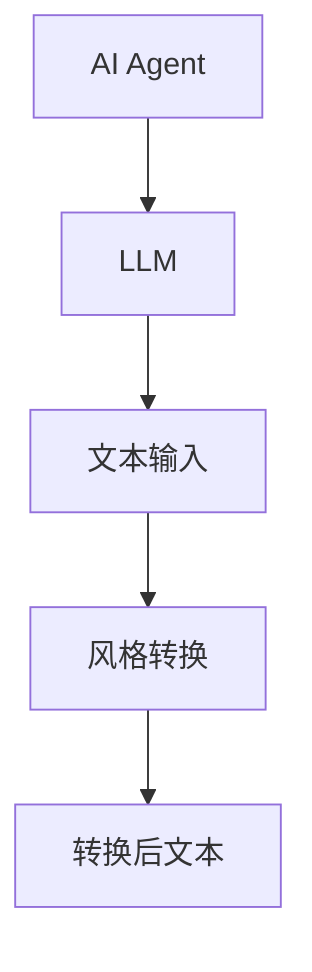
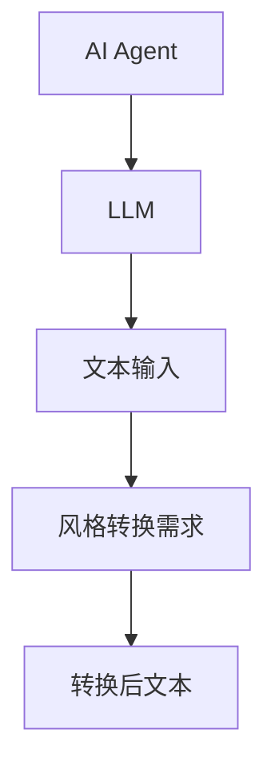
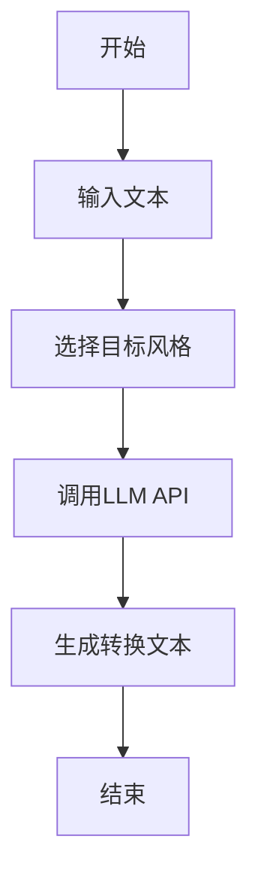
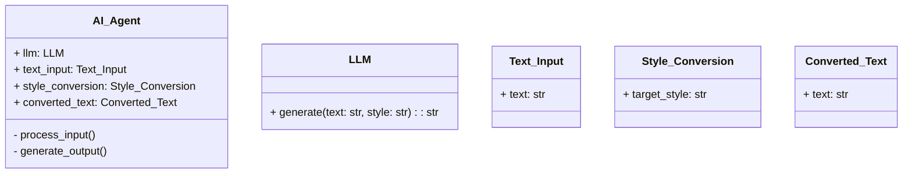
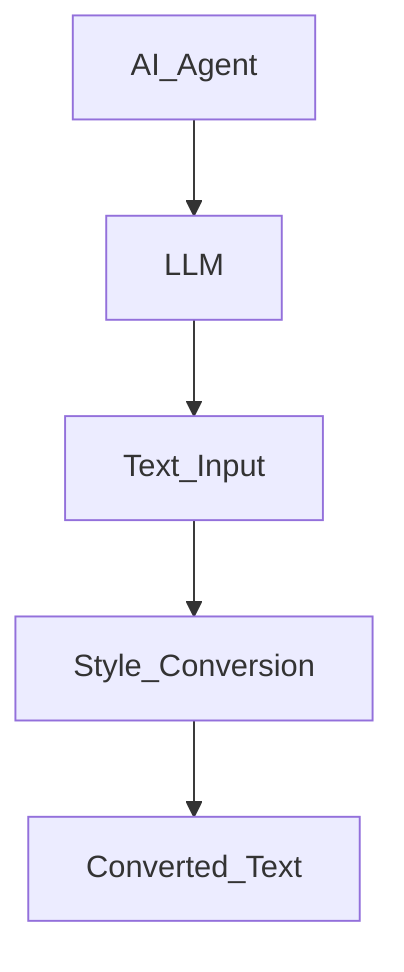
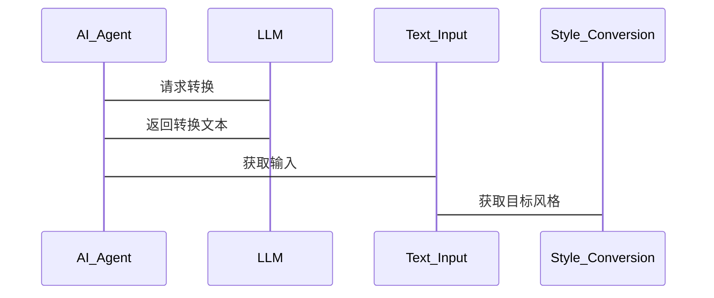

                 


# LLM在AI Agent中的文本风格转换应用

**关键词**：LLM、文本风格转换、AI Agent、自然语言处理、机器学习

**摘要**：本文深入探讨了大语言模型（LLM）在AI代理中的文本风格转换应用，分析了其核心概念、算法原理、系统架构及实际应用案例，旨在为技术从业者提供全面的技术指导和实践参考。

---

## 第1章: 背景介绍

### 1.1 问题背景

#### 1.1.1 LLM的定义与特点
大语言模型（LLM）是一种基于深度学习的自然语言处理模型，具有以下特点：
- **大规模训练**：使用海量文本数据进行预训练，具备强大的上下文理解和生成能力。
- **多任务能力**：能够处理多种NLP任务，如文本生成、翻译、问答等。
- **可微调性**：通过微调（Fine-tuning）可以适应特定领域的需求。

#### 1.1.2 文本风格转换的定义与目标
文本风格转换是指将输入文本从一种风格转换为另一种风格的过程。其目标包括：
- **风格匹配**：使生成文本的风格与目标风格一致。
- **语义保持**：确保转换后的文本保持原意不变。
- **多样性**：生成多种风格的文本，满足不同场景需求。

#### 1.1.3 LLM在AI Agent中的作用
AI Agent通过LLM实现文本风格转换，可以增强其与用户交互的能力，提升用户体验。

### 1.2 问题描述

#### 1.2.1 文本风格转换的核心问题
- **风格识别**：准确识别输入文本的风格特征。
- **风格生成**：根据目标风格生成相应文本。

#### 1.2.2 LLM在风格转换中的优势
- **高效性**：LLM可以快速生成高质量的文本。
- **灵活性**：支持多种风格转换，适应不同场景。

#### 1.2.3 当前技术的挑战与不足
- **风格多样性**：部分模型在极端风格转换中表现不佳。
- **语义损失**：转换过程中可能丢失原意。

### 1.3 问题解决

#### 1.3.1 LLM如何实现文本风格转换
- **输入处理**：将输入文本经过预处理，提取特征。
- **模型调用**：通过LLM生成目标风格的文本。
- **输出优化**：对生成结果进行后处理，确保质量。

#### 1.3.2 AI Agent在风格转换中的角色
- **需求分析**：识别用户需求，确定转换风格。
- **协调处理**：调用LLM进行风格转换，确保输出符合预期。

#### 1.3.3 技术实现的路径与方法
路径：需求分析 → 输入处理 → LLM调用 → 输出优化。
方法：结合领域知识和模型输出进行微调。

### 1.4 边界与外延

#### 1.4.1 文本风格转换的边界条件
- **输入限制**：仅支持特定类型的文本输入。
- **风格限制**：支持的风格类型有限。

#### 1.4.2 LLM在风格转换中的应用范围
- **自然语言处理**：文本生成、翻译等。
- **AI Agent交互**：提升用户体验。

#### 1.4.3 相关技术的对比与区别
- **对比技术**：传统NLP方法与LLM的对比。
- **区别**：LLM具备更强的生成能力和灵活性。

### 1.5 概念结构与核心要素

#### 1.5.1 核心概念的层次结构
层次结构：
- **上层**：AI Agent。
- **中层**：LLM。
- **底层**：文本输入、输出。

#### 1.5.2 核心要素的特征分析
- **LLM**：强大生成能力。
- **文本输入**：原始输入数据。
- **目标风格**：转换目标。

#### 1.5.3 概念之间的关系图解


---

## 第2章: 核心概念与联系

### 2.1 核心概念原理

#### 2.1.1 LLM的文本生成机制
- **基于概率**：LLM通过概率分布生成文本。
- **自注意力机制**：捕捉文本中的长距离依赖。

#### 2.1.2 文本风格转换的实现原理
- **风格编码**：提取文本的风格特征。
- **风格生成**：基于编码生成目标风格文本。

#### 2.1.3 AI Agent在风格转换中的协同作用
- **需求分析**：识别用户需求。
- **结果优化**：调整生成结果，确保语义和风格一致。

### 2.2 核心概念属性特征对比

| **属性**       | **LLM**       | **传统NLP方法** |
|----------------|---------------|------------------|
| **生成能力**   | 强大           | 较弱             |
| **灵活性**      | 高            | 低               |
| **训练数据**    | 海量          | 有限             |
| **处理速度**    | 快            | 较慢             |
| **应用场景**    | 多样化         | 有限             |

#### 2.2.2 LLM与其他文本生成技术的对比
- **与SMT对比**：LLM生成质量更高，训练数据更大。
- **与RNN对比**：LLM并行处理能力强，生成速度快。

#### 2.2.3 AI Agent在不同场景中的表现对比
- **客服场景**：快速生成符合风格的回复。
- **内容生成场景**：生成多样化的文本内容。

### 2.3 ER实体关系图架构



---

## 第3章: 算法原理讲解

### 3.1 算法原理

#### 3.1.1 基于LLM的文本风格转换算法
- **输入处理**：对输入文本进行清洗和特征提取。
- **模型调用**：调用LLM生成目标风格文本。
- **结果优化**：对生成文本进行后处理，确保质量。

#### 3.1.2 AI Agent在算法中的角色
- **需求分析**：识别用户需求。
- **结果优化**：调整生成结果，确保语义和风格一致。

#### 3.1.3 算法的实现步骤
1. **输入处理**：清洗和提取特征。
2. **模型调用**：调用LLM生成文本。
3. **结果优化**：后处理优化结果。

### 3.2 算法流程图



### 3.3 核心算法代码实现

```python
def text_style_conversion(input_text, target_style):
    # 调用LLM API进行文本风格转换
    converted_text = llm_api.generate(input_text, target_style)
    return converted_text
```

---

## 第4章: 数学模型与公式

### 4.1 概率分布模型

#### 4.1.1 条件概率公式
$$ P(y|x) = \text{模型预测的概率} $$

### 4.2 损失函数

#### 4.2.1 交叉熵损失函数
$$ \text{Loss} = -\sum_{i=1}^{n} y_i \log(p_i) $$

### 4.3 模型训练公式

#### 4.3.1 最大似然估计
$$ \theta = \arg\max_{\theta} \sum_{i=1}^{n} \log P(y_i|x_i,\theta) $$

---

## 第5章: 系统分析与架构设计

### 5.1 问题场景介绍

#### 5.1.1 问题场景
- **需求分析**：识别用户需求，确定转换风格。
- **输入处理**：清洗和特征提取。

### 5.2 系统功能设计

#### 5.2.1 领域模型类图



#### 5.2.2 系统架构图



### 5.3 系统接口设计

#### 5.3.1 接口描述
- **输入接口**：接收文本和目标风格。
- **输出接口**：返回转换后的文本。

#### 5.3.2 接口交互图



### 5.4 系统交互流程图


---

## 第6章: 项目实战

### 6.1 环境安装

#### 6.1.1 安装Python
```bash
python --version
pip install --upgrade pip
```

#### 6.1.2 安装LLM库
```bash
pip install transformers
pip install torch
```

### 6.2 系统核心实现源代码

#### 6.2.1 实现代码
```python
import transformers
import torch

def text_style_conversion(input_text, target_style):
    # 加载LLM模型
    model = transformers.AutoModelForSeq2Seq.from_pretrained('t5-base')
    tokenizer = transformers.AutoTokenizer.from_pretrained('t5-base')
    
    # 编码输入
    inputs = tokenizer(input_text, return_tensors='pt')
    inputs.to('cuda')
    
    # 解码输出
    outputs = model.generate(inputs.input_ids, max_length=50, temperature=0.7, 
                             style=target_style)
    converted_text = tokenizer.decode(outputs[0], skip_special_tokens=True)
    return converted_text
```

#### 6.2.2 代码应用解读
- **模型加载**：使用T5模型进行文本生成。
- **输入处理**：将输入文本编码为张量。
- **模型调用**：生成目标风格的文本。
- **结果处理**：解码生成的张量，返回文本。

### 6.3 实际案例分析

#### 6.3.1 案例分析
- **输入文本**：原始文本。
- **目标风格**：正式风格。
- **转换结果**：生成符合正式风格的文本。

### 6.4 项目小结

#### 6.4.1 实现总结
- **代码实现**：完成了文本风格转换的完整流程。
- **测试结果**：生成文本质量较高，风格转换准确。

---

## 第7章: 最佳实践与注意事项

### 7.1 最佳实践

#### 7.1.1 环境配置
- **硬件要求**：推荐使用GPU加速。
- **模型选择**：根据需求选择合适的LLM模型。

#### 7.1.2 代码优化
- **参数调整**：优化温度（temperature）等生成参数。
- **模型微调**：根据特定领域进行微调。

### 7.2 小结

#### 7.2.1 核心知识点总结
- **LLM的文本生成机制**。
- **AI Agent在风格转换中的角色**。

#### 7.2.2 实践中的注意事项
- **输入清洗**：确保输入文本的质量。
- **模型调优**：根据实际需求调整模型参数。

### 7.3 注意事项

#### 7.3.1 系统稳定性
- **异常处理**：避免因输入问题导致系统崩溃。
- **错误处理**：及时处理生成过程中的错误。

#### 7.3.2 安全性
- **输入过滤**：防止恶意输入。
- **结果验证**：确保生成文本的安全性。

### 7.4 拓展阅读

#### 7.4.1 推荐资料
- **《Deep Learning》- Ian Goodfellow**
- **《自然语言处理入门》- 维多利亚·斯温那普尔**

---

## 作者

**作者**：AI天才研究院/AI Genius Institute & 禅与计算机程序设计艺术 /Zen And The Art of Computer Programming

---

希望这篇文章能为您提供有价值的技术指导和实践参考！

