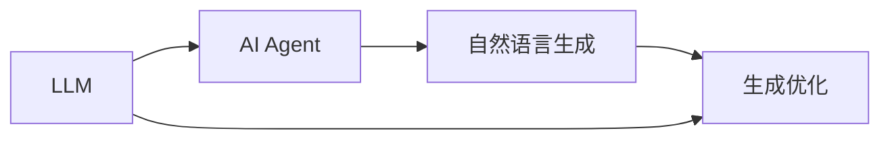
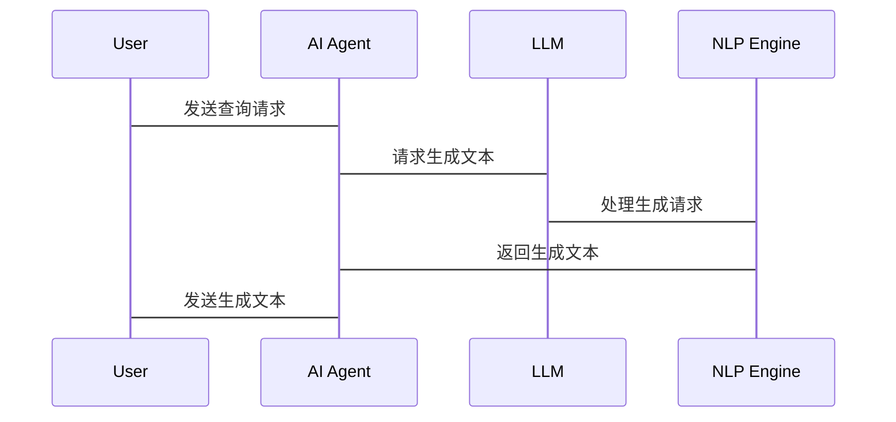

                 


# LLM驱动的AI Agent自然语言生成优化

> **关键词**: 大语言模型, AI Agent, 自然语言生成, 生成优化, 深度学习

> **摘要**: 本文探讨了如何利用大语言模型（LLM）优化AI代理（AI Agent）的自然语言生成过程。通过对LLM与AI Agent的结合、生成优化的算法原理、系统架构设计以及项目实战的详细分析，本文旨在提供一个全面的技术指南，帮助读者理解并实现高效的自然语言生成优化。文章从背景介绍、核心概念、算法原理、系统架构到项目实战，层层深入，结合数学模型、代码实现和实际案例，为读者提供丰富的理论和实践知识。

---

## 第一部分: LLM驱动的AI Agent自然语言生成优化背景介绍

### 第1章: LLM驱动的AI Agent概述

#### 1.1 AI Agent的基本概念
- **1.1.1 AI Agent的定义**
  AI Agent是一种能够感知环境、执行任务并做出决策的智能体，通常用于自动化处理和问题解决。
  
- **1.1.2 AI Agent的核心特征**
  - 感知环境：通过传感器或接口获取输入信息。
  - 内部推理：基于知识库和逻辑推理能力，进行问题分析。
  - 行动决策：根据推理结果，选择最优动作并执行。

- **1.1.3 AI Agent的应用场景**
  - 电子商务：推荐系统、客服助手。
  - 智能家居：设备控制、信息查询。
  - 医疗健康：疾病诊断、健康建议。

#### 1.2 LLM在AI Agent中的作用
- **1.2.1 LLM的定义与特点**
  LLM（Large Language Model）是一种基于Transformer架构的大规模预训练模型，具有强大的上下文理解和生成能力。
  
- **1.2.2 LLM与AI Agent的结合**
  LLM作为AI Agent的核心模块，负责处理自然语言输入、理解意图，并生成自然语言输出。

- **1.2.3 LLM驱动AI Agent的优势**
  - 高效性：快速生成高质量文本。
  - 智能性：能够理解复杂语境并做出合理决策。
  - 可扩展性：适用于多种应用场景。

#### 1.3 自然语言生成优化的必要性
- **1.3.1 自然语言生成的基本概念**
  自然语言生成（NLG）是将结构化数据转换为自然语言文本的过程。

- **1.3.2 生成优化的目标与意义**
  优化目标：提高生成文本的质量、准确性和可读性。
  意义：提升用户体验，增强AI Agent的交互能力。

- **1.3.3 优化在AI Agent中的重要性**
  - 提升用户满意度。
  - 增强系统智能化水平。
  - 提高任务执行效率。

#### 1.4 本章小结
本章介绍了AI Agent的基本概念、LLM在AI Agent中的作用以及自然语言生成优化的必要性，为后续内容奠定了基础。

---

## 第二部分: 核心概念与联系

### 第2章: LLM与自然语言生成优化的核心概念

#### 2.1 LLM与自然语言生成的关系
- **2.1.1 LLM作为生成器的原理**
  LLM通过自注意力机制捕捉上下文信息，生成连贯的文本。
  
- **2.1.2 自然语言生成的流程**
  输入 → 解码器 → 上下文理解 → 文本生成。

- **2.1.3 LLM在生成优化中的角色**
  LLM不仅生成文本，还能通过微调和优化提升生成质量。

#### 2.2 核心概念对比分析
- **2.2.1 LLM与传统NLP模型的对比**
  | 特性        | LLM                     | 传统NLP模型             |
  |-------------|--------------------------|--------------------------|
  | 数据量       | 大规模数据              | 小规模数据              |
  | 模型复杂度   | 高复杂度                | 较低复杂度              |
  | 生成能力     | 强大生成能力             | 较弱生成能力             |

- **2.2.2 生成优化与传统文本优化的对比**
  - 生成优化：基于模型生成文本，注重质量。
  - 传统优化：基于规则或模板优化，注重效率。

- **2.2.3 AI Agent与传统NLP应用的对比**
  - AI Agent：具备自主决策能力，可交互。
  - 传统NLP应用：单向处理，无自主决策能力。

#### 2.3 实体关系图


---

### 第3章: 核心概念的数学模型与公式

#### 3.1 LLM的数学基础
- **3.1.1 Transformer模型的数学公式**
  输入序列：$X = (x_1, x_2, ..., x_n)$。
  输出序列：$Y = (y_1, y_2, ..., y_m)$。
  注意力机制：$A = \text{softmax}(\frac{QK^T}{\sqrt{d}})$，其中$Q$是查询向量，$K$是键向量，$d$是向量维度。

- **3.1.2 注意力机制的数学推导**
  $$ \text{Attention}(Q, K, V) = \text{softmax}\left(\frac{QK^T}{\sqrt{d}}\right)V $$

- **3.1.3 激活函数的作用与公式**
  ReLU激活函数：$f(x) = \max(0, x)$。

#### 3.2 自然语言生成的优化算法
- **3.2.1 梯度下降法的优化公式**
  参数更新：$\theta_{t+1} = \theta_t - \eta \frac{\partial L}{\partial \theta_t}$，其中$\eta$是学习率，$L$是损失函数。

- **3.2.2 贝叶斯推断的生成概率公式**
  $$ P(y|x) = \frac{P(x,y)}{P(x)} $$

- **3.2.3 前缀树的生成路径公式**
  前缀树的生成概率：$P(y) = \prod_{i=1}^{n} P(y_i|y_{<i})$。

#### 3.3 优化目标的数学表达
- **3.3.1 最大似然估计的公式**
  $$ \theta^* = \arg\max \prod_{i=1}^{N} P(y_i|x_i) $$

- **3.3.2 最小化生成误差的公式**
  $$ L = \frac{1}{N}\sum_{i=1}^{N} \text{CE}(y_i, \hat{y}_i) $$，其中CE是交叉熵损失。

- **3.3.3 用户满意度的优化目标公式**
  $$ \text{满意度} = 1 - \frac{\text{错误率}}{\text{总次数}} $$

---

## 第三部分: 算法原理讲解

### 第4章: LLM驱动的生成优化算法

#### 4.1 基于Transformer的生成算法
- **4.1.1 Transformer模型的结构图**
  ```mermaid
  graph LR
      Input -> Encoder -> Decoder -> Output
  ```

- **4.1.2 解码器的生成流程**
  1. 输入初始向量。
  2. 解码器生成初步预测。
  3. 基于注意力机制优化生成结果。
  4. 输出最终生成文本。

- **4.1.3 多层感知机的生成原理**
  多层感知机通过非线性变换，增强模型的生成能力。

#### 4.2 优化算法的实现
- **4.2.1 梯度下降的优化步骤**
  ```python
  def gradient_descent(theta, learning_rate):
      theta = theta - learning_rate * compute_gradient(theta)
      return theta
  ```

- **4.2.2 动量优化的实现方法**
  ```python
  def momentum_optimizer(theta, learning_rate, momentum):
      velocity = momentum * velocity + learning_rate * compute_gradient(theta)
      theta = theta - velocity
      return theta
  ```

- **4.2.3 Adam优化器的参数调整**
  ```python
  def adam_optimizer(theta, learning_rate, beta1, beta2):
      m = beta1 * m + (1 - beta1) * compute_gradient(theta)
      v = beta2 * v + (1 - beta2) * (compute_gradient(theta))**2
      theta = theta - learning_rate * (m / (1 - beta1) + v / (1 - beta2))
      return theta
  ```

#### 4.3 生成优化算法的数学模型
- **交叉熵损失函数**
  $$ \text{CE}(y, \hat{y}) = -\sum_{i=1}^{n} y_i \log \hat{y}_i $$

- **生成概率最大化**
  $$ \arg\max_{\theta} \sum_{i=1}^{n} \log P(y_i|x_i) $$

---

### 第5章: 系统分析与架构设计方案

#### 5.1 项目背景与目标
- **项目背景**：提升AI Agent的自然语言生成能力。
- **项目目标**：优化生成算法，提高生成质量。

#### 5.2 系统功能设计
- **领域模型设计**
  ```mermaid
  classDiagram
      class LLM {
          generate(text: str) -> str
      }
      class AI Agent {
          receive_input(text: str) -> void
          process() -> void
          output(text: str) -> void
      }
      LLM --> AI Agent
  ```

- **系统架构设计**
  ```mermaid
  graph LR
      Agent --> LLM
      LLM --> NLP Engine
      NLP Engine --> Output
  ```

- **系统接口设计**
  - 输入接口：接收用户输入。
  - 输出接口：生成并输出文本。
  - 管理接口：监控和优化生成过程。

#### 5.3 系统交互流程


---

## 第六部分: 项目实战

### 第6章: 项目实战

#### 6.1 环境安装
- 安装Python和相关库：
  ```bash
  pip install torch transformers
  ```

#### 6.2 系统核心实现
- **生成优化代码**
  ```python
  import torch
  import torch.nn as nn

  class LLMGenerator(nn.Module):
      def __init__(self, vocab_size):
          super(LLMGenerator, self).__init__()
          self.embedding = nn.Embedding(vocab_size, 512)
          self.transformer = nn.Transformer(d_model=512, nhead=8)
          self.decoder = nn.Linear(512, vocab_size)

      def forward(self, input_ids):
          embedded = self.embedding(input_ids)
          output = self.transformer(embedded, embedded)
          output = self.decoder(output)
          return output

  model = LLMGenerator(vocab_size=10000)
  ```

- **优化算法实现**
  ```python
  def compute_loss(logits, labels):
      return nn.CrossEntropyLoss()(logits, labels)

  def optimize(theta, loss, learning_rate):
      optimizer = torch.optim.Adam(theta.parameters(), lr=learning_rate)
      optimizer.zero_grad()
      loss.backward()
      optimizer.step()
      return theta
  ```

#### 6.3 实际案例分析
- **案例背景**：优化客服AI Agent的生成能力。
- **优化过程**：
  1. 数据预处理：清洗和标注数据。
  2. 模型训练：基于LLM进行微调。
  3. 生成优化：调整生成参数，提升文本质量。
  4. 测试评估：收集反馈，持续优化。

#### 6.4 项目小结
本章通过实际案例展示了如何实现并优化LLM驱动的AI Agent自然语言生成系统，强调了理论与实践的结合。

---

## 第七部分: 总结与展望

### 第7章: 总结与展望

#### 7.1 总结
本文详细探讨了LLM驱动的AI Agent自然语言生成优化的背景、核心概念、算法原理、系统架构及项目实战。通过理论分析和实践案例，展示了如何利用LLM提升生成质量。

#### 7.2 最佳实践Tips
- 确保数据质量，进行充分的预处理。
- 根据具体场景调整生成参数。
- 定期收集用户反馈，持续优化模型。

#### 7.3 注意事项
- 避免过度依赖生成模型，结合规则和人工校验。
- 注意模型的计算资源消耗，优化部署环境。

#### 7.4 未来展望
- 深度学习技术的进一步发展。
- 多模态生成模型的应用。
- 更高效优化算法的探索。

#### 7.5 拓展阅读
- 《Deep Learning》—— Ian Goodfellow
- 《Attention is All You Need》—— Vaswani et al.
- 《Large Language Models for Question Answering》—— OpenAI

---

## 作者：AI天才研究院/AI Genius Institute & 禅与计算机程序设计艺术 /Zen And The Art of Computer Programming

