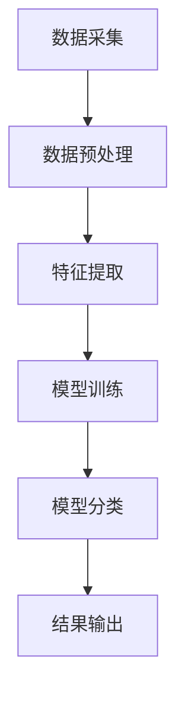
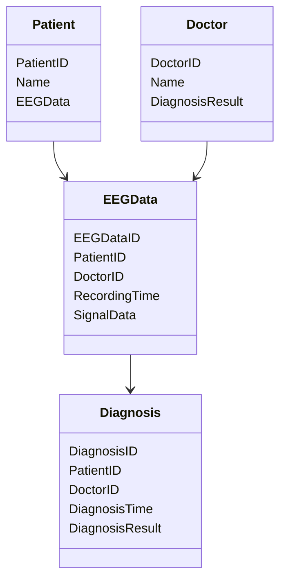
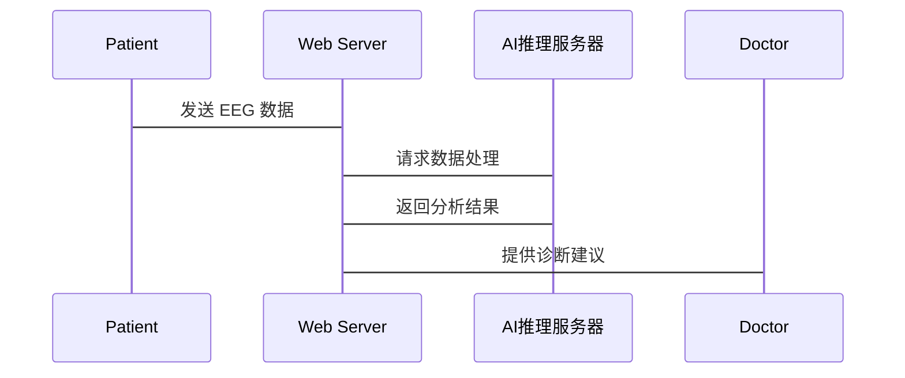

                 


# 《价值投资中的脑机接口医疗应用前景》

---

## 关键词：
脑机接口、医疗应用、价值投资、神经康复、机器学习、投资分析、技术趋势

---

## 摘要：
脑机接口（BCI）技术在医疗领域的应用前景广阔，特别是在神经康复和疾病诊断方面展现出了巨大的潜力。本文从技术背景、核心概念、算法原理、系统架构等多个维度分析了脑机接口在医疗中的应用，并结合价值投资的理论，探讨了该领域的投资机会和策略。通过详细的技术分析和案例研究，本文为投资者提供了基于脑机接口技术的医疗应用的投资建议，并展望了该领域的未来发展趋势。

---

# 第1章：脑机接口技术与医疗应用背景

## 1.1 脑机接口的基本概念

### 1.1.1 脑机接口的定义与核心原理
脑机接口（Brain-Computer Interface，BCI）是一种能够直接连接人脑与外部设备的技术，通过采集、处理和分析脑电信号（EEG），实现人脑与计算机或其他设备之间的信息交互。其核心原理包括：
- **数据采集**：通过电极采集大脑皮层的神经信号。
- **信号处理**：对采集到的信号进行滤波、降噪和特征提取。
- **模式识别**：利用机器学习算法识别特定的神经模式。
- **人机交互**：将识别结果转化为控制指令，驱动外部设备。

### 1.1.2 脑机接口的技术发展史
脑机接口技术起源于20世纪60年代，经历了从实验室研究到实际应用的逐步发展。近年来，随着人工智能和神经科学的进步，脑机接口技术在医疗、康复和人机交互领域的应用取得了显著进展。

### 1.1.3 脑机接口的分类与应用场景
脑机接口主要分为侵入式和非侵入式两类：
- **侵入式**：需要在脑内植入电极，适用于严重的神经损伤患者。
- **非侵入式**：通过外部设备采集脑电信号，适用于康复训练和辅助设备控制。

应用场景包括：
- 神经康复：帮助中风或脊髓损伤患者恢复运动功能。
- 疾病诊断：辅助诊断癫痫、帕金森病等神经疾病。
- 辅助通信：帮助无法言语的患者实现交流。

## 1.2 脑机接口在医疗中的应用前景

### 1.2.1 医疗领域中的脑机接口技术
脑机接口在医疗中的应用主要集中在以下几个方面：
- **神经康复**：通过实时反馈训练，帮助患者恢复运动功能。
- **疾病诊断**：利用脑电信号辅助诊断神经系统疾病。
- **辅助治疗**：结合康复设备，提供个性化的治疗方案。

### 1.2.2 脑机接口在神经康复中的应用
神经康复是脑机接口技术的重要应用领域。通过采集患者的脑电信号，分析其意图，并驱动康复设备（如机器人）进行运动训练，能够显著提高康复效果。

### 1.2.3 脑机接口在疾病诊断中的潜力
脑机接口技术能够实时监测脑电信号，帮助医生更准确地诊断神经系统疾病。例如，在癫痫诊断中，脑机接口可以捕捉异常放电信号，提高诊断的准确性。

## 1.3 价值投资的基本概念

### 1.3.1 价值投资的定义与核心理念
价值投资是一种长期投资策略，强调以低于内在价值的价格买入优质资产。其核心理念是寻找市场低估的公司，长期持有，分享其成长带来的收益。

### 1.3.2 价值投资与技术趋势的关系
价值投资不仅关注公司的财务状况，还关注其所在行业的技术发展趋势。医疗行业作为技术驱动型行业，其技术创新往往能带来显著的市场机会。

### 1.3.3 医疗行业投资的基本逻辑
医疗行业的投资逻辑包括：
- **需求驱动**：人口老龄化带来医疗需求的增长。
- **技术创新**：新技术的应用能够提升医疗服务的效率和质量。
- **政策支持**：政府对医疗健康的政策支持为行业提供了发展动力。

## 1.4 脑机接口医疗应用的价值投资机会

### 1.4.1 脑机接口技术的市场潜力
脑机接口技术在医疗领域的市场规模正在快速增长。根据市场研究机构的预测，到2030年，全球脑机接口市场规模将超过百亿美元。

### 1.4.2 医疗行业中的投资机会
在医疗行业，脑机接口技术的应用主要集中在神经康复和疾病诊断领域。这些领域的市场需求大，技术门槛高，具备较大的投资潜力。

### 1.4.3 脑机接口技术对医疗投资的影响
脑机接口技术的引入能够提升医疗设备的性能和医疗服务的效果。对于投资者来说，选择具备技术优势和市场潜力的公司，能够带来超额收益。

---

## 第2章：脑机接口技术的核心概念与联系

## 2.1 脑机接口技术的核心原理

### 2.1.1 神经信号的采集与处理
神经信号的采集是脑机接口技术的第一步。通过 EEG 电极采集大脑皮层的电信号，然后对其进行滤波和降噪处理，提取有用的特征。

### 2.1.2 数据分析与模式识别
利用机器学习算法（如支持向量机、随机森林）对信号进行分类，识别特定的神经模式。例如，识别患者的运动意图。

### 2.1.3 人机交互的实现机制
将识别的神经模式转化为控制指令，驱动外部设备（如机械臂）进行动作。

## 2.2 脑机接口技术的属性特征对比

### 2.2.1 不同类型脑机接口的对比分析
| 类型          | 侵入式            | 非侵入式          |
|---------------|-------------------|-------------------|
| 数据采集精度 | 高                | 较低              |
| 适用场景      | 严重神经损伤患者  | 康复训练、辅助设备 |
| 风险          | 高（手术风险）    | 低                |

### 2.2.2 技术参数与性能指标
| 参数          | 描述             |
|---------------|------------------|
| 采样率        | 影响信号处理的精度 |
| 信噪比        | 反映信号质量     |
| 分类准确率     | 决定系统的实用性 |

### 2.2.3 市场需求与应用潜力
脑机接口技术在医疗领域的市场需求主要集中在神经康复和疾病诊断。随着技术的成熟，其应用潜力将进一步扩大。

## 2.3 脑机接口技术的ER实体关系图

```mermaid
er
  actor Patient {
    <外键,标识符> PatientID
    <字符串> Name
    <日期> BirthDate
  }
  actor Doctor {
    <外键,标识符> DoctorID
    <字符串> Name
    <字符串> Qualification
  }
  entity EEGData {
    <标识符> EEGDataID
    <外键> PatientID
    <外键> DoctorID
    <日期时间> RecordingTime
    <二进制> SignalData
  }
  entity Diagnosis {
    <标识符> DiagnosisID
    <外键> PatientID
    <外键> DoctorID
    <日期时间> DiagnosisTime
    <字符串> DiagnosisResult
  }
```

---

## 第3章：脑机接口医疗应用的算法原理

## 3.1 脑机接口信号处理算法

### 3.1.1 数据采集与预处理
数据采集是脑机接口系统的第一步。通过 EEG 电极采集大脑皮层的电信号，然后进行滤波和降噪处理。

### 3.1.2 基于机器学习的信号分类
利用机器学习算法对 EEG 信号进行分类。例如，使用支持向量机（SVM）对信号进行分类，识别患者的运动意图。

### 3.1.3 算法流程图（Mermaid）



### 3.1.4 分类准确率的计算
分类准确率是评估脑机接口系统性能的重要指标。其计算公式为：
$$ \text{准确率} = \frac{\text{正确分类的样本数}}{\text{总样本数}} $$

### 3.1.5 代码实现（Python）
```python
import numpy as np
from sklearn import svm

# 假设X为训练数据，y为标签
model = svm.SVC()
model.fit(X, y)

# 预测测试数据
y_pred = model.predict(X_test)
print("分类准确率：", np.mean(y_pred == y_test))
```

## 3.2 基于深度学习的脑机接口模型

### 3.2.1 深度学习模型的构建
基于深度学习的脑机接口模型通常采用卷积神经网络（CNN）或循环神经网络（RNN）进行特征提取和分类。

### 3.2.2 模型训练与优化
通过大量 EEG 数据训练模型，并使用交叉验证进行优化。例如，使用 K-Fold 交叉验证评估模型的泛化能力。

### 3.2.3 模型评估与应用
模型的评估指标包括准确率、召回率和 F1 分数。例如，使用混淆矩阵分析模型的性能。

### 3.2.4 代码实现（Python）
```python
import tensorflow as tf
from tensorflow import keras

model = keras.Sequential([
    keras.layers.Conv2D(32, (3,3), activation='relu', input_shape=(64, 64, 1)),
    keras.layers.MaxPooling2D((2,2)),
    keras.layers.Flatten(),
    keras.layers.Dense(128, activation='relu'),
    keras.layers.Dense(num_classes, activation='softmax')
])

model.compile(optimizer='adam', loss='sparse_categorical_crossentropy', metrics=['accuracy'])
model.fit(X_train, y_train, epochs=10, batch_size=32)
```

---

## 第4章：脑机接口医疗应用的系统分析与架构设计

## 4.1 问题场景介绍
本章将从系统架构的角度分析脑机接口医疗应用的实现方案。通过构建一个完整的系统框架，展示如何将脑机接口技术应用于实际的医疗场景。

## 4.2 系统功能设计（领域模型 Mermaid 类图）



## 4.3 系统架构设计（Mermaid 架构图）


## 4.4 系统接口设计
系统接口设计主要涉及以下几个方面：
- **数据采集接口**：与 EEG 设备进行数据交互。
- **数据处理接口**：与 AI 推理服务器进行数据传输。
- **用户界面接口**：为医生和患者提供交互界面。

## 4.5 系统交互设计（Mermaid 序列图）



---

## 第5章：脑机接口医疗应用的项目实战

## 5.1 环境配置与数据收集

### 5.1.1 环境配置
- **硬件**：EEG 采集设备（如 NeuroNode 脑电采集器）。
- **软件**：Python 环境，安装必要的库（如 numpy, scipy, scikit-learn, tensorflow）。

### 5.1.2 数据收集
通过 EEG 采集设备收集患者的脑电信号，保存为 CSV 格式文件。

## 5.2 系统核心实现

### 5.2.1 数据预处理
对 EEG 数据进行滤波和降噪处理，提取有用的特征。

### 5.2.2 模型训练与优化
使用机器学习算法训练分类模型，并通过交叉验证优化模型性能。

### 5.2.3 系统集成
将训练好的模型集成到医疗系统中，实现实时数据采集、处理和分类。

## 5.3 代码实现与解读

### 5.3.1 数据预处理代码
```python
import numpy as np
import pandas as pd

# 读取数据
data = pd.read_csv('eeg_data.csv')

# 删除噪声
data = data[data['Frequency'] > 5]

# 标准化数据
data = (data - data.mean()) / data.std()
```

### 5.3.2 模型训练代码
```python
from sklearn.svm import SVC
from sklearn.model_selection import train_test_split

# 划分训练集和测试集
X_train, X_test, y_train, y_test = train_test_split(data.drop('Label', axis=1), data['Label'], test_size=0.2)

# 训练模型
model = SVC()
model.fit(X_train, y_train)

# 模型评估
print("分类准确率：", model.score(X_test, y_test))
```

## 5.4 案例分析与解读

### 5.4.1 案例背景
假设我们有一家专注于神经康复的医疗公司，计划引入脑机接口技术提升其康复设备的性能。

### 5.4.2 技术评估
- **技术可行性**：公司已具备 EEG 采集设备和数据处理能力。
- **市场潜力**：神经康复市场规模持续增长，技术应用前景广阔。

### 5.4.3 投资建议
- **短期目标**：优化脑机接口算法，提升系统稳定性。
- **长期目标**：拓展应用场景，进入国际市场。

## 5.5 项目小结
通过本项目，我们展示了如何将脑机接口技术应用于医疗场景，并通过价值投资的视角分析了其市场潜力和投资机会。

---

## 第6章：总结与展望

## 6.1 总结
本文从技术背景、核心概念、算法原理、系统架构等多个维度分析了脑机接口在医疗中的应用，并结合价值投资的理论，探讨了该领域的投资机会和策略。通过详细的技术分析和案例研究，为投资者提供了基于脑机接口技术的医疗应用的投资建议。

## 6.2 展望
随着人工智能和神经科学的进一步发展，脑机接口技术在医疗领域的应用前景将更加广阔。未来，我们需要进一步优化算法，提升系统性能，并拓展更多的应用场景。

## 6.3 投资建议
- **关注技术创新**：选择具备核心技术优势的公司。
- **分析市场需求**：重点关注神经康复和疾病诊断领域。
- **长期持有**：医疗行业的技术驱动型公司具备长期增长潜力。

---

## 作者：AI天才研究院 & 禅与计算机程序设计艺术

---

通过本文的分析，我们深入探讨了脑机接口技术在医疗中的应用前景，并结合价值投资的视角，为投资者提供了具有参考价值的分析和建议。希望本文能够为读者提供有价值的洞见，并激发更多的思考和探索。

