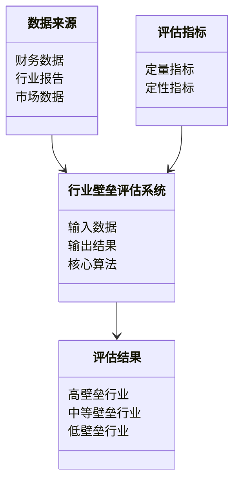
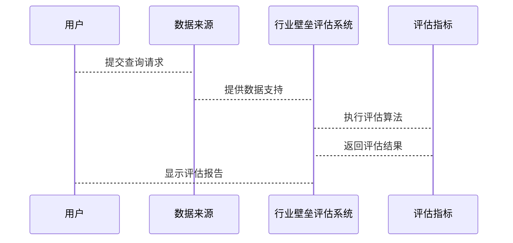

                 

<think>
好的，我将按照您的要求，逐步构建《价值投资中的行业壁垒评估》这篇文章的详细内容。为了确保内容的完整性和专业性，我会逐步深入，每一部分都详细阐述。

# 价值投资中的行业壁垒评估

## 关键词
- 价值投资
- 行业壁垒
- 核心竞争力
- 定量评估
- 定性分析

## 摘要
价值投资的核心在于识别具备强大行业壁垒的企业，这些壁垒能为企业提供长期的竞争优势和超额回报。本文从行业壁垒的基本概念入手，分析核心竞争力、行业集中度、定量与定性评估方法，并通过案例和系统架构设计，帮助企业投资者构建完整的行业壁垒评估体系，实现长期稳健的投资收益。

---

## 第一部分: 价值投资中的行业壁垒评估基础

## 第1章: 价值投资与行业壁垒概述

### 1.1 价值投资的起源与发展

#### 1.1.1 价值投资的定义与核心理念
价值投资是一种以基本面分析为基础的投资策略，核心理念是寻找市场价格低于其内在价值的股票。其核心理念包括：
- **安全边际**：购买价格远低于内在价值，以降低投资风险。
- **长期视角**：关注企业的长期竞争优势和价值增长。

#### 1.1.2 巴菲特与格雷厄姆的价值投资理论
巴菲特继承并发展了格雷厄姆的价值投资理论，强调：
- **企业内在价值**：通过分析企业的财务状况、行业地位和竞争优势来评估其内在价值。
- **长期持有**：买入并长期持有优质企业股票，获得复利增长。

#### 1.1.3 行业分析在价值投资中的重要性
行业分析是价值投资的重要环节，通过分析行业景气度、竞争格局和企业市场地位，识别具备竞争优势的企业。

### 1.2 行业壁垒的基本概念

#### 1.2.1 行业壁垒的定义
行业壁垒是指行业内竞争者进入某一市场所面临的障碍，包括技术、资金、品牌、政策等。

#### 1.2.2 行业壁垒的核心要素
- 技术壁垒
- 资金壁垒
- 品牌壁垒
- 政策壁垒
- 人才壁垒

#### 1.2.3 行业壁垒与企业竞争优势的关系
行业壁垒是企业竞争优势的重要来源，高壁垒行业更容易形成稳定的竞争优势和超额利润。

### 1.3 价值投资中的行业分析方法

#### 1.3.1 行业分析的基本步骤
1. **行业背景分析**：分析行业的发展历史、当前状况和未来趋势。
2. **行业生命周期分析**：判断行业所处的生命周期阶段（导入期、成长期、成熟期、衰退期）。
3. **行业竞争结构分析**：使用五力模型分析行业竞争格局。

#### 1.3.2 行业生命周期分析
- **导入期**：市场需求不足，竞争较小，企业投资风险高。
- **成长期**：市场需求快速增长，行业壁垒逐步形成。
- **成熟期**：市场需求稳定，行业壁垒高，竞争激烈。
- **衰退期**：市场需求萎缩，行业壁垒降低，企业盈利能力下降。

#### 1.3.3 行业竞争结构分析
- **供应商的议价能力**：供应商是否集中，是否具备替代产品。
- **买家的议价能力**：买家是否集中，是否对价格敏感。
- **新进入者的威胁**：行业壁垒高低，新进入者的难易程度。
- **替代品的威胁**：替代品是否存在，是否具备价格或性能优势。
- **现有竞争者之间的竞争程度**：行业内竞争者数量及市场份额分布。

---

## 第2章: 行业壁垒的核心竞争力分析

### 2.1 核心竞争力的定义与特征

#### 2.1.1 核心竞争力的定义
核心竞争力是指企业在市场上独特的优势，使其能够在竞争中脱颖而出。

#### 2.1.2 核心竞争力的三大特征
1. **独特性**：具备独特的优势或资源。
2. **可持续性**：能够长期保持竞争优势。
3. **可扩展性**：能够支持企业规模扩张和市场拓展。

#### 2.1.3 核心竞争力与企业长期价值的关系
核心竞争力是企业长期价值的基石，能够为企业创造持续的超额收益。

### 2.2 护城河的五种类型

#### 2.2.1 成本优势
- **成本领先**：企业通过规模效应、技术创新等方式降低成本，具备价格竞争优势。
- **成本结构分析**：固定成本与变动成本的比例，影响企业的盈利能力和抗风险能力。

#### 2.2.2 品牌优势
- **品牌价值**：强大的品牌能够提高客户忠诚度和产品溢价能力。
- **品牌影响力**：品牌在市场中的认知度和影响力，影响企业的市场份额和定价能力。

#### 2.2.3 技术优势
- **技术创新**：企业具备领先的技术研发能力，能够不断推出新产品。
- **技术壁垒**：通过专利、技术标准等方式形成进入壁垒。

#### 2.2.4 政策优势
- **政策支持**：政府政策对企业发展的支持，如税收优惠、行业准入等。
- **政策壁垒**：通过政策限制，防止竞争对手进入市场。

#### 2.2.5 客户粘性
- **客户关系**：企业与客户之间形成的长期合作关系，客户对企业的依赖程度。
- **客户忠诚度**：客户对企业产品的认可和忠诚度，影响客户的转换成本。

### 2.3 核心竞争力的评估指标

#### 2.3.1 市场占有率
市场占有率是企业核心竞争力的重要指标，高市场占有率表明企业在行业中具备强大的竞争优势。

#### 2.3.2 盈利能力
盈利能力包括净利润率、ROE（净资产收益率）等指标，反映了企业的盈利能力和管理效率。

#### 2.3.3 技术研发投入占比
技术研发投入占比是衡量企业技术创新能力的重要指标，高研发投入表明企业具备技术优势和未来竞争力。

#### 2.3.4 产品差异化程度
产品差异化程度反映了企业在市场中的独特性和竞争力，差异化程度高意味着企业具备更强的核心竞争力。

---

## 第3章: 行业集中度与竞争格局分析

### 3.1 行业集中度的定义与衡量

#### 3.1.1 行业集中度的定义
行业集中度是指行业内主要企业的市场份额集中程度。

#### 3.1.2 常用衡量指标（CR4、CR8）
- **CR4**：行业内前4大企业的市场份额之和。
- **CR8**：行业内前8大企业的市场份额之和。

#### 3.1.3 行业集中度与市场结构的关系
- **高集中度**：市场由少数几家企业主导，竞争较为激烈。
- **低集中度**：市场分散，竞争较为温和。

### 3.2 行业竞争格局的分析方法

#### 3.2.1 五力模型（波特竞争分析）
- **潜在进入者的威胁**：行业壁垒高低，新进入者的难易程度。
- **替代品的威胁**：替代品是否存在，是否具备价格或性能优势。
- **供应商的议价能力**：供应商是否集中，是否具备替代产品。
- **买家的议价能力**：买家是否集中，是否对价格敏感。
- **现有竞争者之间的竞争程度**：行业内竞争者数量及市场份额分布。

#### 3.2.2 行业价值链分析
- **价值链分解**：从原材料采购、生产、销售到最终用户的整个价值链。
- **关键环节分析**：分析价值链中哪些环节是企业的核心竞争力所在。

#### 3.2.3 主要竞争对手分析
- **竞争对手分析**：分析主要竞争对手的市场份额、产品策略、竞争优势等。
- **竞争策略分析**：分析竞争对手的定价策略、市场推广策略、技术研发策略等。

### 3.3 行业集中度与壁垒的关系

#### 3.3.1 高集中度行业的壁垒特征
高集中度行业通常具有较高的进入壁垒，如技术壁垒、品牌壁垒、政策壁垒等。

#### 3.3.2 低集中度行业的壁垒挑战
低集中度行业通常进入壁垒较低，竞争较为分散，企业难以形成稳定的竞争优势。

#### 3.3.3 行业集中度变化对企业壁垒的影响
行业集中度的变化直接影响企业的市场地位和竞争优势，高集中度行业更容易形成稳定的竞争优势。

---

## 第4章: 行业壁垒的定量评估方法

### 4.1 定量评估的核心指标

#### 4.1.1 净资产收益率（ROE）
ROE = 净利润 / 平均净资产
ROE越高，表明企业的盈利能力越强。

#### 4.1.2 资产回报率（ROA）
ROA = 净利润 / 平均总资产
ROA越高，表明企业的资产利用效率越高。

#### 4.1.3 毛利率与净利率
- **毛利率** = (销售收入 - 销售成本) / 销售收入
- **净利率** = 净利润 / 营业收入
毛利率和净利率越高，表明企业的盈利能力和成本控制能力越强。

#### 4.1.4 市盈率与市净率
- **市盈率（P/E）** = 每股市价 / 每股净利润
- **市净率（P/B）** = 每股市价 / 每股净资产
市盈率和市净率反映了市场的估值水平，高市盈率可能意味着高增长，低市盈率可能意味着低估。

### 4.2 行业壁垒

---

## 第5章: 行业壁垒的定性评估方法

### 5.1 行业政策与法规分析

#### 5.1.1 行业政策的影响
行业政策对企业的发展和竞争格局具有重要影响，如税收政策、行业准入政策等。

#### 5.1.2 法规风险分析
分析行业相关的法律法规，评估企业面临的法律风险和合规成本。

### 5.2 技术与创新分析

#### 5.2.1 技术发展现状
分析行业内技术的发展现状，判断是否存在技术瓶颈或技术突破。

#### 5.2.2 创新能力评估
评估企业的技术创新能力，包括研发投入、专利数量、技术领先性等。

### 5.3 品牌与市场影响力分析

#### 5.3.1 品牌知名度
品牌知名度是企业市场影响力的重要指标，高知名度品牌具备更强的市场竞争力。

#### 5.3.2 市场推广能力
评估企业的市场推广能力，包括广告投入、销售渠道、客户服务等。

### 5.4 供应链与成本分析

#### 5.4.1 供应链稳定性
供应链的稳定性和成本控制能力是企业核心竞争力的重要组成部分。

#### 5.4.2 成本优势
分析企业的成本结构，判断是否存在成本优势，如规模化生产、原材料采购优势等。

---

## 第6章: 行业壁垒评估的系统架构设计

### 6.1 问题场景介绍
在价值投资中，行业壁垒评估是一个复杂的系统工程，需要结合定量与定性分析，构建完整的评估体系。

### 6.2 系统功能设计（领域模型）



### 6.3 系统架构设计


### 6.4 系统接口设计

#### 6.4.1 数据接口
- 数据输入接口：接收财务数据、行业报告、市场数据等。
- 数据输出接口：输出行业壁垒评估结果，包括高、中、低壁垒行业分类。

#### 6.4.2 用户接口
- 用户输入接口：接收用户的查询请求。
- 用户输出接口：显示评估结果，包括行业壁垒分析报告、投资建议等。

### 6.5 系统交互设计



---

## 第7章: 项目实战与案例分析

### 7.1 项目环境安装

#### 7.1.1 系统环境要求
- 操作系统：Windows 10 或更高版本，或 Linux 系统。
- 开发工具：Python 3.8 或更高版本，Jupyter Notebook，PyCharm。
- 数据库：MySQL 或其他关系型数据库。
- 依赖库：pandas、numpy、scikit-learn、matplotlib。

### 7.2 系统核心实现源代码

#### 7.2.1 数据预处理

```python
import pandas as pd

# 读取数据
data = pd.read_csv('industry_barricade.csv')

# 数据清洗
data = data.dropna()
data = data.drop_duplicates()
```

#### 7.2.2 行业壁垒评估算法

```python
from sklearn.metrics import pairwise_distances

# 计算行业集中度（CR4）
def calculate_cr4(revenues):
    cr4 = revenues.nlargest(4).sum() / revenues.sum()
    return cr4

# 计算净资产收益率（ROE）
def calculate_roe(net_income, equity):
    roe = net_income / equity
    return roe

# 行业壁垒综合评估
def industry_barricade_assessment(data):
    cr4 = calculate_cr4(data['revenue'])
    roe = calculate_roe(data['net_income'], data['equity'])
    barricade_score = (cr4 + roe) / 2
    return barricade_score
```

#### 7.2.3 评估结果可视化

```python
import matplotlib.pyplot as plt

# 绘制行业壁垒分布图
barricade_scores = [0.8, 0.6, 0.5, 0.7, 0.4]
plt.bar(range(len(barricade_scores)), barricade_scores)
plt.title('行业壁垒分布图')
plt.xlabel('行业')
plt.ylabel('壁垒评分')
plt.show()
```

### 7.3 实际案例分析

#### 7.3.1 案例背景
以科技行业为例，分析行业内主要企业的行业壁垒。

#### 7.3.2 数据分析
- 收购数据：企业的研发投入、市场占有率、品牌影响力等。
- 竞争分析：行业内主要竞争对手的市场份额、技术优势、成本结构等。

#### 7.3.3 评估结果
- 高壁垒企业：具备强大技术优势和市场占有率。
- 中等壁垒企业：具备一定的竞争优势，但面临较大的竞争压力。
- 低壁垒企业：竞争优势不明显，市场地位不稳定。

### 7.4 项目小结
通过实际案例分析，验证行业壁垒评估模型的有效性，总结经验教训，优化评估方法。

---

## 第8章: 行业壁垒评估的最佳实践与注意事项

### 8.1 最佳实践 tips

#### 8.1.1 数据来源的可靠性
确保数据来源可靠，选择权威的行业报告和财务数据。

#### 8.1.2 定量与定性分析的结合
定量分析提供数据支持，定性分析提供深度洞察，两者结合才能全面评估行业壁垒。

#### 8.1.3 风险管理
投资有风险，需合理分散投资组合，避免过度集中。

### 8.2 小结
行业壁垒评估是价值投资的重要环节，需结合定量与定性分析，综合评估企业的竞争优势和市场地位。

---

## 结语
通过系统化的行业壁垒评估，投资者可以更好地识别具备长期竞争优势的企业，实现稳健的投资收益。未来，随着技术的进步和市场的变化，行业壁垒评估方法也将不断创新，为投资者提供更有力的支持。

---

## 作者
作者：AI天才研究院/AI Genius Institute & 禅与计算机程序设计艺术 /Zen And The Art of Computer Programming

---

以上是《价值投资中的行业壁垒评估》的详细内容，涵盖了从基础概念到实际应用的各个方面，适合投资者和研究人员参考学习。

