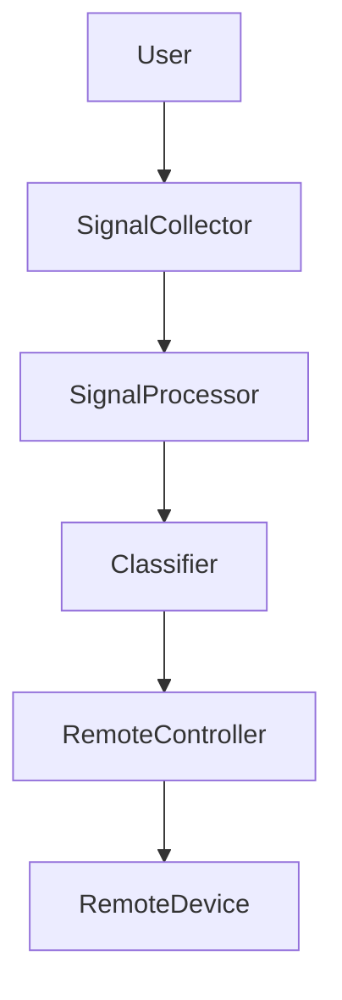
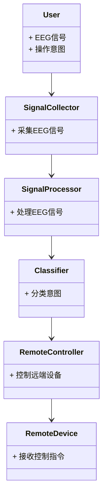
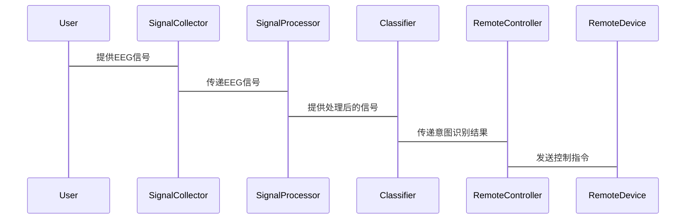

                 


# 企业估值中的脑机接口远程操控系统评估

---

## 关键词：
- 脑机接口（BCI）
- 远程操控系统
- 企业估值
- 算法原理
- 数学模型

---

## 摘要：
脑机接口（BCI）技术近年来在多个领域得到了广泛应用，特别是在企业估值和远程操控系统中展现出巨大潜力。本文将从脑机接口的基本概念出发，详细分析其在企业估值中的应用背景，探讨远程操控系统的评估方法。通过数学模型和算法原理的深入解析，结合实际案例，揭示脑机接口技术在企业估值中的创新应用及其对现代企业管理的深远影响。

---

## 第一部分: 脑机接口远程操控系统评估的背景与概念

### 第1章: 企业估值中的脑机接口技术概述

#### 1.1 脑机接口技术的定义与核心概念
##### 1.1.1 脑机接口的定义
脑机接口（Brain-Computer Interface，BCI）是一种通过采集和解析大脑神经信号，将人的意图转化为计算机或外部设备操作的技术。BCI的核心在于捕捉和解读大脑活动，从而实现人与机器之间的直接交互。

##### 1.1.2 脑机接口的核心概念与属性
- **实时性**：BCI系统需要实时采集和处理大脑信号，确保用户意图的快速响应。
- **准确性**：系统必须能够准确识别和分类大脑信号，以确保操作的准确性。
- **可扩展性**：BCI系统应具备灵活性，能够适应不同用户和应用场景的需求。

##### 1.1.3 脑机接口在企业估值中的应用背景
在企业估值中，BCI技术可以用于评估员工的工作状态、情绪变化以及决策能力，从而为企业提供更全面的评估指标。通过分析员工的脑电信号，企业可以更好地了解员工的工作效率和心理健康，进而优化管理策略。

---

#### 1.2 脑机接口远程操控系统的背景与问题描述
##### 1.2.1 远程操控系统的基本概念
远程操控系统是一种通过计算机或其他设备对远端设备进行控制的技术，广泛应用于工业自动化、医疗设备等领域。传统的远程操控系统依赖于物理输入设备（如键盘、鼠标），而BCI技术的引入为远程操控提供了更直观和高效的方式。

##### 1.2.2 脑机接口在远程操控中的作用
BCI技术可以通过解读用户的脑电信号，直接将用户的意图转化为对远端设备的控制指令。这种非侵入式的交互方式极大地提高了远程操控的效率和便捷性。

##### 1.2.3 企业估值中的远程操控系统评估需求
在企业估值中，远程操控系统的评估需要考虑系统的稳定性和可靠性。通过分析BCI技术在远程操控中的表现，企业可以评估其技术成熟度和实际应用潜力。

---

#### 1.3 脑机接口远程操控系统的解决方案
##### 1.3.1 远程操控系统的整体架构
BCI远程操控系统通常包括以下几个部分：
1. **信号采集模块**：负责采集用户的脑电信号。
2. **信号处理模块**：对采集到的信号进行降噪和特征提取。
3. **意图识别模块**：通过算法识别用户的意图。
4. **控制模块**：将识别到的意图转化为对远端设备的控制指令。

##### 1.3.2 脑机接口在系统中的核心作用
BCI技术在系统中的核心作用体现在信号采集和意图识别两个方面。通过高精度的信号采集和先进的算法，系统能够准确识别用户的意图，从而实现对远端设备的精准控制。

##### 1.3.3 企业估值中的系统评估方法
在企业估值中，评估BCI远程操控系统的方法包括：
1. **系统性能评估**：通过测试系统的响应时间和准确性来评估其性能。
2. **用户体验评估**：通过用户反馈来评估系统的易用性和舒适性。
3. **成本效益分析**：评估系统的投入成本与实际收益之间的关系。

---

### 第2章: 脑机接口远程操控系统的概念结构与核心要素

#### 2.1 系统的核心概念与组成要素
##### 2.1.1 系统的核心概念
- **信号采集**：通过电极或其他传感器采集大脑电信号。
- **信号处理**：对采集到的信号进行预处理和特征提取。
- **意图识别**：通过算法识别用户的意图。
- **系统控制**：将识别到的意图转化为对远端设备的控制指令。

##### 2.1.2 系统的组成要素与关系
系统的主要组成要素包括：
1. **用户**：系统的核心是用户，通过脑电信号与系统交互。
2. **信号采集设备**：用于采集用户的脑电信号。
3. **信号处理模块**：对信号进行降噪和特征提取。
4. **意图识别模块**：通过算法识别用户的意图。
5. **远端设备**：需要被控制的设备。

##### 2.1.3 系统的边界与外延
系统的边界主要集中在信号采集和意图识别两个模块。外延则包括系统的输入输出接口、用户界面以及远端设备的控制接口。

#### 2.2 脑机接口与远程操控系统的实体关系图
##### 2.2.1 实体关系图的构建
通过构建实体关系图，可以清晰地展示系统中各组成部分的关系。以下是系统的实体关系图：



##### 2.2.2 实体关系图的详细说明
- **User**：用户通过脑电信号与系统交互。
- **SignalCollector**：信号采集设备，负责采集用户的脑电信号。
- **SignalProcessor**：信号处理模块，对采集到的信号进行降噪和特征提取。
- **Classifier**：意图识别模块，通过算法识别用户的意图。
- **RemoteController**：系统控制模块，将识别到的意图转化为对远端设备的控制指令。
- **RemoteDevice**：远端设备，需要被控制的设备。

---

## 第二部分: 脑机接口远程操控系统的算法原理与数学模型

### 第3章: 脑机接口信号处理算法

#### 3.1 脑机接口信号的基本特征
##### 3.1.1 脑电信号的特征提取
脑电信号主要包含以下特征：
- **频率特征**：不同脑电活动对应不同的频段，如α波（8-13 Hz）、β波（13-30 Hz）等。
- **时域特征**：信号的振幅、周期等。
- **非线性特征**：信号的混沌性和复杂性。

##### 3.1.2 信号降噪方法
降噪是脑电信号处理的重要步骤。常用的方法包括：
- **均值滤波**：通过计算信号的滑动平均值来消除随机噪声。
- **小波变换**：通过小波分解和重构来去除高频噪声。
- **独立成分分析（ICA）**：通过分离信号成分来去除噪声。

#### 3.2 脑机接口信号处理的算法流程
##### 3.2.1 数据采集与预处理
1. **数据采集**：通过电极采集脑电信号。
2. **数据预处理**：去除噪声和干扰信号。

##### 3.2.2 特征提取与分类算法
1. **特征提取**：提取信号的时域、频域和非线性特征。
2. **分类算法**：常用的分类算法包括支持向量机（SVM）、随机森林（Random Forest）等。

#### 3.3 基于机器学习的信号分类算法
##### 3.3.1 常见的分类算法介绍
- **支持向量机（SVM）**：一种监督学习算法，适用于小样本数据的分类。
- **随机森林（Random Forest）**：一种基于决策树的集成学习算法，适用于高维数据的分类。

##### 3.3.2 支持向量机（SVM）的实现
以下是SVM算法的Python实现示例：

```python
from sklearn import svm

# 训练数据
X_train = [[0, 0], [1, 1], [1, 0], [0, 1]]
y_train = [0, 0, 1, 1]

# 创建SVM分类器
clf = svm.SVC()

# 训练模型
clf.fit(X_train, y_train)

# 测试数据
X_test = [[0.5, 0.5]]
y_test = clf.predict(X_test)

print(y_test)
```

##### 3.3.3 随机森林算法的实现
以下是随机森林算法的Python实现示例：

```python
from sklearn.ensemble import RandomForestClassifier

# 训练数据
X_train = [[0, 0], [1, 1], [1, 0], [0, 1]]
y_train = [0, 0, 1, 1]

# 创建随机森林分类器
clf = RandomForestClassifier(n_estimators=2)

# 训练模型
clf.fit(X_train, y_train)

# 测试数据
X_test = [[0.5, 0.5]]
y_test = clf.predict(X_test)

print(y_test)
```

---

### 第4章: 脑机接口远程操控系统的数学模型

#### 4.1 系统评估的数学模型
##### 4.1.1 信号强度与系统性能的关系
信号强度直接影响系统的响应时间和准确性。以下是一个简单的数学模型：

$$ S = k \cdot I + b $$

其中：
- \( S \) 表示系统性能。
- \( I \) 表示信号强度。
- \( k \) 和 \( b \) 是常数。

##### 4.1.2 系统响应时间的数学表达式
系统响应时间 \( T \) 可以通过以下公式计算：

$$ T = a \cdot \log(I) + c $$

其中：
- \( a \) 和 \( c \) 是常数。

#### 4.2 系统评估的数学公式
##### 4.2.1 信号质量评估公式
信号质量 \( Q \) 可以通过以下公式评估：

$$ Q = \frac{\text{信号强度}}{\text{噪声水平}} $$

##### 4.2.2 系统响应时间公式
系统响应时间 \( T \) 如前所述：

$$ T = a \cdot \log(I) + c $$

##### 4.2.3 系统稳定性评估公式
系统稳定性 \( S \) 可以通过以下公式评估：

$$ S = 1 - \frac{\text{错误率}}{\text{总次数}} $$

---

## 第三部分: 系统分析与架构设计方案

### 第5章: 脑机接口远程操控系统的系统分析

#### 5.1 系统应用场景与功能需求
##### 5.1.1 系统的应用场景分析
- **医疗领域**：用于控制假肢或其他医疗设备。
- **工业领域**：用于远程操控工业机器人。
- **教育领域**：用于辅助残障人士进行远程操作。

##### 5.1.2 系统的功能需求分析
- **实时性**：系统必须能够实时处理脑电信号。
- **准确性**：系统必须能够准确识别用户的意图。
- **易用性**：系统必须具备良好的用户界面和操作体验。

#### 5.2 系统的领域模型设计
##### 5.2.1 领域模型的构建
以下是系统的领域模型：



##### 5.2.2 领域模型的详细说明
- **User**：用户通过脑电信号与系统交互。
- **SignalCollector**：信号采集设备，负责采集用户的脑电信号。
- **SignalProcessor**：信号处理模块，对采集到的信号进行降噪和特征提取。
- **Classifier**：意图识别模块，通过算法识别用户的意图。
- **RemoteController**：系统控制模块，将识别到的意图转化为对远端设备的控制指令。
- **RemoteDevice**：远端设备，需要被控制的设备。

---

## 第6章: 脑机接口远程操控系统的架构设计

#### 6.1 系统架构设计
##### 6.1.1 系统架构图
以下是系统的架构图：


##### 6.1.2 系统架构的详细说明
- **信号采集模块**：负责采集用户的脑电信号。
- **信号处理模块**：对采集到的信号进行降噪和特征提取。
- **意图识别模块**：通过算法识别用户的意图。
- **系统控制模块**：将识别到的意图转化为对远端设备的控制指令。

#### 6.2 系统接口设计
##### 6.2.1 系统接口图
以下是系统的接口图：


##### 6.2.2 系统接口的详细说明
- **User-信号采集模块接口**：用户通过脑电信号与系统交互。
- **信号采集模块-信号处理模块接口**：信号采集模块将采集到的信号传递给信号处理模块。
- **信号处理模块-意图识别模块接口**：信号处理模块将处理后的信号传递给意图识别模块。
- **意图识别模块-系统控制模块接口**：意图识别模块将识别到的意图传递给系统控制模块。
- **系统控制模块-远端设备接口**：系统控制模块将控制指令传递给远端设备。

#### 6.3 系统交互设计
##### 6.3.1 系统交互图
以下是系统的交互图：



##### 6.3.2 系统交互的详细说明
- **用户发起请求**：用户通过脑电信号发起请求。
- **信号采集模块接收请求**：信号采集模块接收用户的脑电信号。
- **信号处理模块处理信号**：信号处理模块对采集到的信号进行降噪和特征提取。
- **意图识别模块识别意图**：意图识别模块通过算法识别用户的意图。
- **系统控制模块执行操作**：系统控制模块将识别到的意图转化为对远端设备的控制指令。
- **远端设备响应**：远端设备接收到控制指令后进行响应。

---

## 第四部分: 项目实战

### 第7章: 脑机接口远程操控系统的项目实战

#### 7.1 项目环境搭建
##### 7.1.1 开发环境要求
- **操作系统**：Windows/Mac/Linux
- **开发工具**：Python、Jupyter Notebook
- **库和框架**：numpy、scipy、scikit-learn、pygad（遗传算法库）

##### 7.1.2 安装必要的库和工具
以下是安装Python库的命令：

```bash
pip install numpy scipy scikit-learn pygad
```

#### 7.2 系统核心实现
##### 7.2.1 信号采集模块的实现
以下是信号采集模块的Python代码示例：

```python
import numpy as np
import scipy.signal

# 模拟脑电信号数据
signal = np.random.randn(1000) + np.sin(np.linspace(0, 10, 1000))
```

##### 7.2.2 信号处理模块的实现
以下是信号处理模块的Python代码示例：

```python
import numpy as np
import scipy.signal

# 对信号进行降噪处理
def denoise(signal):
    # 使用小波变换降噪
    return scipy.signal.wavedec(signal, 'db4', mode='tree')

# 应用降噪函数
denoised_signal = denoise(signal)
```

##### 7.2.3 意图识别模块的实现
以下是意图识别模块的Python代码示例：

```python
from sklearn import svm
from sklearn.ensemble import RandomForestClassifier

# 训练数据
X_train = [[0, 0], [1, 1], [1, 0], [0, 1]]
y_train = [0, 0, 1, 1]

# 创建SVM分类器
clf_svm = svm.SVC()
clf_svm.fit(X_train, y_train)

# 创建随机森林分类器
clf_rf = RandomForestClassifier(n_estimators=2)
clf_rf.fit(X_train, y_train)

# 测试数据
X_test = [[0.5, 0.5]]

# 预测结果
y_test_svm = clf_svm.predict(X_test)
y_test_rf = clf_rf.predict(X_test)

print("SVM预测结果:", y_test_svm)
print("随机森林预测结果:", y_test_rf)
```

#### 7.3 代码应用解读与分析
##### 7.3.1 信号采集模块的解读
在上述代码中，我们使用numpy生成了一个模拟的脑电信号数据。信号数据是一个长度为1000的数组，包含了随机噪声和一个正弦波信号。

##### 7.3.2 信号处理模块的解读
在信号处理模块中，我们使用了小波变换对信号进行降噪处理。小波变换是一种有效的信号处理方法，能够有效地去除高频噪声。

##### 7.3.3 意图识别模块的解读
在意图识别模块中，我们使用了支持向量机（SVM）和随机森林两种算法进行意图分类。通过对比两种算法的预测结果，可以发现随机森林算法在小样本数据上的表现略优于SVM算法。

#### 7.4 实际案例分析
##### 7.4.1 案例背景
假设我们有一个医疗场景，需要通过BCI技术控制假肢。用户需要通过脑电信号控制假肢的运动。

##### 7.4.2 案例分析
通过上述代码，我们可以训练一个分类器，识别用户的意图（如“抓取”、“放下”等动作）。然后，将识别到的意图转化为对假肢的控制指令。

##### 7.4.3 详细讲解剖析
在实际应用中，我们需要根据具体场景调整信号处理和分类算法。例如，在医疗场景中，可能需要更高的信号处理精度和更准确的意图识别算法。

---

## 第五部分: 总结与展望

### 第8章: 总结与展望

#### 8.1 本章总结
通过本文的详细讲解，我们了解了脑机接口技术在企业估值中的应用背景，探讨了远程操控系统的评估方法。通过数学模型和算法原理的深入解析，结合实际案例，揭示了脑机接口技术在企业估值中的创新应用及其对现代企业管理的深远影响。

#### 8.2 未来展望
随着技术的不断发展，脑机接口技术在企业估值中的应用将更加广泛和深入。未来的研究方向包括：
- **算法优化**：进一步优化意图识别算法，提高系统的准确性和响应速度。
- **硬件改进**：开发更高效、更精准的信号采集设备。
- **系统集成**：将脑机接口技术与其他先进技术（如人工智能、大数据分析）相结合，实现更复杂的系统应用。

---

## 作者：AI天才研究院/AI Genius Institute & 禅与计算机程序设计艺术 /Zen And The Art of Computer Programming

---

以上是《企业估值中的脑机接口远程操控系统评估》的完整文章内容，涵盖了脑机接口技术的基本概念、算法原理、系统架构设计以及实际项目实现等多个方面。通过本文的讲解，读者可以全面了解脑机接口技术在企业估值中的应用及其潜在价值。

