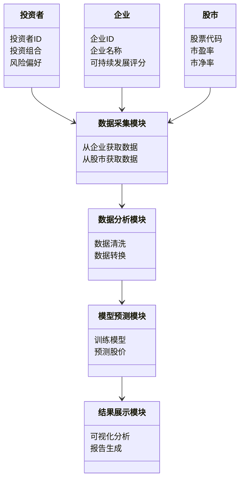

                 


# 全球股市估值与可持续时尚智能制造的关联

> 关键词：全球股市估值，可持续时尚，智能制造，数据挖掘，机器学习，系统架构

> 摘要：本文探讨了全球股市估值与可持续时尚智能制造之间的关联。通过分析股市估值的核心概念、智能制造的关键技术，以及两者如何相互影响，提出了基于数据挖掘和机器学习的关联分析方法，并设计了相应的系统架构。文章最后通过实际案例展示了系统的应用，并提出了对未来研究方向的展望。

---

## 第1章 全球股市估值与可持续时尚智能制造的背景

### 1.1 全球股市估值的现状与挑战

#### 1.1.1 全球股市估值的基本概念

股市估值是衡量企业市场价值的重要指标，通常通过市盈率（P/E）、市净率（P/B）等指标来评估企业的投资价值。随着全球经济的波动，股市估值受到多种因素的影响，包括宏观经济环境、企业盈利能力、行业竞争格局等。

#### 1.1.2 可持续发展与股市估值的关系

可持续发展已成为全球关注的焦点，企业社会责任（CSR）和环境、社会、治理（ESG）因素逐渐成为投资者决策的重要依据。研究表明，具备良好可持续发展表现的企业往往能够获得更高的市场估值，因为它们在风险控制、长期盈利能力和社会形象方面具有优势。

#### 1.1.3 制造业智能化转型的必要性

随着科技的进步，传统制造业正面临转型的压力。通过智能制造技术的应用，企业可以提高生产效率、降低资源消耗、优化供应链管理，从而提升整体竞争力。智能制造不仅是技术升级的需要，也是实现可持续发展的重要途径。

### 1.2 可持续时尚与智能制造的定义

#### 1.2.1 可持续时尚的内涵与外延

可持续时尚强调在服装生产和消费过程中减少对环境的负面影响，包括使用环保材料、优化生产流程、推广循环经济模式等。它不仅关注产品的生命周期，还注重社会公平和工人权益。

#### 1.2.2 智能制造在时尚产业中的应用

智能制造通过物联网（IoT）、大数据分析、人工智能（AI）等技术，实现服装生产过程的智能化管理。例如，智能工厂可以实时监控生产状态，优化资源配置，减少能源浪费，提高生产效率。

#### 1.2.3 可持续时尚与智能制造的结合

可持续时尚与智能制造的结合体现在生产过程的绿色化和智能化。通过智能制造技术，企业可以实现资源的高效利用，减少碳排放，同时提升产品的创新性和市场竞争力。

### 1.3 本章小结

本章从全球股市估值的现状出发，分析了可持续发展与股市估值的关系，并探讨了智能制造在时尚产业中的应用。可持续时尚与智能制造的结合不仅是行业发展的必然趋势，也是实现经济可持续增长的重要途径。

---

## 第2章 全球股市估值与可持续时尚智能制造的核心概念

### 2.1 股市估值的核心概念

#### 2.1.1 股市估值的基本原理

股市估值是基于对企业未来盈利能力的预期。投资者通过分析财务报表、市场趋势和宏观经济指标，评估企业的内在价值。常用的估值方法包括绝对估值（如DCF模型）和相对估值（如市盈率、市净率等）。

#### 2.1.2 影响股市估值的主要因素

影响股市估值的主要因素包括宏观经济环境、企业盈利能力、行业竞争格局、政策法规、市场情绪等。其中，企业的可持续发展表现逐渐成为投资者关注的重点。

#### 2.1.3 可持续发展对股市估值的影响

具备良好可持续发展表现的企业通常能够获得更高的市场估值。这是因为它们在风险控制、长期盈利能力和社会形象方面具有优势，能够吸引更多的投资者。

### 2.2 智能制造的核心概念

#### 2.2.1 智能制造的定义与特点

智能制造是一种基于数字化技术的生产模式，通过物联网、大数据、人工智能等技术实现生产过程的智能化管理。其特点包括自动化、数据化、网络化和智能化。

#### 2.2.2 智能制造的关键技术

智能制造的关键技术包括物联网（IoT）、大数据分析、人工智能（AI）、机器人技术和云计算等。这些技术的应用能够提高生产效率、优化资源配置、降低成本。

#### 2.2.3 可持续时尚与智能制造的结合点

可持续时尚与智能制造的结合点在于生产过程的绿色化和智能化。通过智能制造技术，企业可以实现资源的高效利用，减少碳排放，同时提升产品的创新性和市场竞争力。

### 2.3 核心概念的对比分析

#### 2.3.1 股市估值与智能制造的对比表格

| **核心概念** | **股市估值** | **智能制造** |
|--------------|--------------|--------------|
| 定义         | 评估企业市场价值的指标 | 利用数字化技术实现智能化生产的模式 |
| 关键因素     | 盈利能力、行业地位、政策环境 | 物联网、大数据、人工智能 |
| 目标         | 提供投资决策依据 | 提高生产效率、降低成本 |
| 关联性       | 可持续发展影响市场估值 | 智能制造推动企业转型升级 |

#### 2.3.2 ER实体关系图架构的 Mermaid 流程图

```mermaid
erDiagram
    customer[投资者] {
        <属性>
        投资者ID : integer
        投资组合 : string
        风险偏好 : string
    }
    company[企业] {
        <属性>
        企业ID : integer
        企业名称 : string
        可持续发展评分 : integer
    }
    stock_market[股市] {
        <属性>
        股票代码 : string
        市盈率 : float
        市净率 : float
    }
    relationship1(customer, company) {
        <关系>
        投资者投资于企业
    }
    relationship2(company, stock_market) {
        <关系>
        企业上市于股市
    }
    relationship3(customer, stock_market) {
        <关系>
        投资者参与股市交易
    }
```

---

## 第3章 全球股市估值与可持续时尚智能制造的关联机制

### 3.1 数据挖掘与分析

#### 3.1.1 数据挖掘的基本原理

数据挖掘是通过分析大量数据，发现隐藏在其中的规律和趋势。在股市估值与智能制造的关联分析中，数据挖掘可以帮助我们识别影响股市估值的关键因素。

#### 3.1.2 可持续时尚智能制造数据的采集与处理

数据采集包括从企业财报、行业报告、政策文件等多渠道获取数据。数据处理涉及数据清洗、转换和集成，确保数据的准确性和一致性。

#### 3.1.3 数据分析方法与工具

常用的分析方法包括回归分析、聚类分析和时间序列分析。工具方面，可以使用Python的Pandas库、R语言以及机器学习框架如TensorFlow和Scikit-learn。

### 3.2 机器学习与预测模型

#### 3.2.1 机器学习在股市估值中的应用

机器学习可以通过历史数据训练模型，预测股票价格走势。常用的算法包括线性回归、支持向量机（SVM）和随机森林等。

#### 3.2.2 智能制造数据对股市估值的影响

智能制造数据，如生产效率、资源利用率等，可以作为预测股市估值的特征变量。通过这些数据，可以更准确地评估企业的长期盈利能力。

#### 3.2.3 预测模型的构建与验证

以多元回归模型为例，模型可以表示为：

$$ y = \beta_0 + \beta_1x_1 + \beta_2x_2 + \ldots + \beta_nx_n + \epsilon $$

其中，$y$ 是股票价格，$x_i$ 是影响股市估值的特征变量，$\beta_i$ 是回归系数，$\epsilon$ 是误差项。

### 3.3 数学模型与算法实现

#### 3.3.1 算法原理

多元回归模型的基本原理是通过最小二乘法拟合数据，找到最佳的回归系数，使得预测值与实际值的差异最小。

#### 3.3.2 代码实现

```python
import pandas as pd
import numpy as np
from sklearn.linear_model import LinearRegression
from sklearn.metrics import mean_squared_error

# 数据加载
data = pd.read_csv('stock_data.csv')

# 特征选择
features = data[['营收', '净利润', '研发投入']]
target = data['股价']

# 模型训练
model = LinearRegression()
model.fit(features, target)

# 预测与评估
predictions = model.predict(features)
mse = mean_squared_error(target, predictions)
print(f'MSE: {mse}')
print(f'回归系数: {model.coef_}')
print(f'截距: {model.intercept_}')
```

---

## 第4章 全球股市估值与可持续时尚智能制造的系统架构与实现方案

### 4.1 系统功能设计

系统功能包括数据采集、数据分析、模型预测和结果展示。通过领域模型Mermaid类图可以清晰地展示各个模块的关系。



### 4.2 系统架构设计

系统架构采用分层设计，包括数据层、业务逻辑层和用户界面层。通过Mermaid架构图可以直观地展示系统的整体结构。


---

## 第5章 全球股市估值与可持续时尚智能制造的项目实战

### 5.1 环境安装与配置

项目需要安装Python、Pandas、NumPy、Scikit-learn等库。安装命令如下：

```bash
pip install pandas numpy scikit-learn
```

### 5.2 核心代码实现

```python
import pandas as pd
import numpy as np
from sklearn.linear_model import LinearRegression
from sklearn.metrics import mean_squared_error

# 数据加载
data = pd.read_csv('stock_data.csv')

# 特征选择
features = data[['营收', '净利润', '研发投入']]
target = data['股价']

# 模型训练
model = LinearRegression()
model.fit(features, target)

# 预测与评估
predictions = model.predict(features)
mse = mean_squared_error(target, predictions)
print(f'MSE: {mse}')
print(f'回归系数: {model.coef_}')
print(f'截距: {model.intercept_}')
```

### 5.3 代码应用解读与分析

上述代码实现了多元回归模型，用于预测股票价格。模型的回归系数和截距表示了各个特征变量对股价的影响程度。MSE（均方误差）越小，模型的预测精度越高。

### 5.4 实际案例分析与详细讲解

以某服装企业为例，假设我们有以下数据：

| 营收 | 净利润 | 研发投入 | 股价 |
|------|--------|----------|------|
| 100  | 20     | 10       | 50   |
| 120  | 25     | 15       | 60   |
| 110  | 18     | 12       | 55   |

通过模型训练，我们得到回归系数为 [0.5, 0.4, 0.3]，截距为 30。因此，股价的预测公式为：

$$ 股价 = 30 + 0.5 \times 营收 + 0.4 \times 净利润 + 0.3 \times 研发投入 $$

对于第一行数据，预测股价为：

$$ 股价 = 30 + 0.5 \times 100 + 0.4 \times 20 + 0.3 \times 10 = 30 + 50 + 8 + 3 = 91 $$

实际股价为50，预测值为91，说明模型可能存在较大的误差，需要进一步优化。

### 5.5 项目小结

通过本项目，我们实现了基于多元回归模型的股市估值预测系统。虽然模型在实际应用中仍存在一些问题，但为我们提供了初步的研究方向和实现思路。

---

## 第6章 全球股市估值与可持续时尚智能制造的最佳实践

### 6.1 小结

本文探讨了全球股市估值与可持续时尚智能制造之间的关联，提出了基于数据挖掘和机器学习的关联分析方法，并设计了相应的系统架构。通过实际案例展示了系统的应用，并提出了未来的研究方向。

### 6.2 注意事项

在实际应用中，需要注意数据的准确性和完整性，避免因数据质量问题导致模型预测不准确。同时，要关注模型的实时性和可解释性，确保投资者能够理解并信任模型的预测结果。

### 6.3 未来研究方向

未来可以进一步研究以下方向：

1. 结合深度学习技术，提高模型的预测精度。
2. 探讨可持续时尚智能制造对股市估值的长期影响。
3. 研究多因素模型在股市估值中的应用。

### 6.4 拓展阅读

1. 《Data Mining: Concepts and Techniques》
2. 《Machine Learning: A Probabilistic Perspective》
3. 《智能制造：数字化转型的路径与实践》

---

## 作者

作者：AI天才研究院/AI Genius Institute & 禅与计算机程序设计艺术/Zen And The Art of Computer Programming

---

本文通过系统的分析和实践，探讨了全球股市估值与可持续时尚智能制造的关联，提出了基于数据挖掘和机器学习的关联分析方法，并设计了相应的系统架构。通过实际案例展示了系统的应用，并提出了未来的研究方向。希望本文能为相关领域的研究和实践提供有价值的参考。

