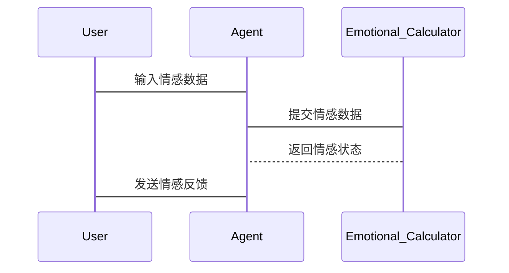

                 


# 开发具有情感计算与个性化交互能力的AI Agent

> 关键词：情感计算，个性化交互，AI Agent，人工智能，机器学习

> 摘要：情感计算与个性化交互能力是AI Agent发展的关键方向，本文将从背景、核心概念、算法实现、系统设计、项目实战等多个维度，详细探讨如何开发具有情感计算与个性化交互能力的AI Agent。通过理论分析与实践案例结合的方式，帮助读者全面掌握相关技术的核心原理与实现方法。

---

# 第一部分: 情感计算与个性化交互AI Agent的背景与概述

## 第1章: 情感计算与AI Agent的概述
### 1.1 情感计算的定义与背景
#### 1.1.1 情感计算的基本概念
情感计算（Affective Computing）是一种通过计算机技术来识别、理解和模拟人类情感的科学。它研究如何通过计算机系统来识别、分析和处理人类的情感状态，从而实现更加智能化和个性化的交互体验。情感计算的核心目标是让计算机能够理解人类的情感，并根据情感状态提供相应的反馈或服务。

#### 1.1.2 情感计算的发展历程
情感计算的概念最早可以追溯到20世纪60年代，但真正的发展始于20世纪90年代。随着人工智能技术的进步，情感计算逐渐从理论研究走向实际应用。近年来，随着深度学习和自然语言处理技术的快速发展，情感计算在AI Agent中的应用取得了显著进展。

#### 1.1.3 情感计算在AI Agent中的作用
情感计算在AI Agent中的作用主要体现在以下几点：
1. **情感识别与分析**：通过分析用户的语言、表情、语调等信息，识别用户的情感状态。
2. **个性化交互**：根据用户的情感状态，动态调整交互策略，提供更加个性化的服务。
3. **情感反馈**：通过情感生成技术，模拟人类的情感表达，增强交互的真实性和自然性。

### 1.2 AI Agent的基本概念与分类
#### 1.2.1 AI Agent的定义
AI Agent（人工智能代理）是指能够感知环境、自主决策并执行任务的智能实体。它可以是一个软件程序、一个机器人，或者任何能够与环境交互的智能系统。AI Agent的核心特征是具有自主性、反应性、目标导向性和社会性。

#### 1.2.2 AI Agent的分类与特点
AI Agent可以根据不同的标准进行分类，常见的分类方式包括：
1. **按智能水平**：
   - **反应式Agent**：基于当前感知做出反应，没有内部状态。
   - **认知式Agent**：具有复杂的知识表示和推理能力，能够处理复杂任务。
2. **按应用场景**：
   - **服务型Agent**：用于提供特定服务，如智能助手。
   - **社交型Agent**：用于社交交互，如虚拟助手、社交机器人。

#### 1.2.3 情感计算AI Agent的独特性
情感计算AI Agent的独特性体现在以下几个方面：
1. **情感感知能力**：能够识别和理解用户的情感状态。
2. **个性化交互**：根据用户情感动态调整交互策略。
3. **情感反馈能力**：能够模拟人类情感，提供更自然的交互体验。

### 1.3 情感计算与个性化交互的结合
#### 1.3.1 情感计算的核心目标
情感计算的核心目标是通过技术手段，让计算机能够理解和模拟人类情感，从而实现更智能化和个性化的交互体验。

#### 1.3.2 个性化交互的实现方式
个性化交互的实现方式主要包括：
1. **用户建模**：通过分析用户的行为、偏好和情感状态，构建用户画像。
2. **动态交互策略**：根据用户情感状态，实时调整交互内容和方式。
3. **情感反馈**：通过情感生成技术，提供更自然的交互反馈。

#### 1.3.3 情感计算在AI Agent中的应用价值
情感计算在AI Agent中的应用价值主要体现在以下几个方面：
1. **提升用户体验**：通过个性化交互，提高用户满意度和使用体验。
2. **增强交互自然性**：通过情感反馈，使交互更加自然和真实。
3. **拓展应用场景**：情感计算技术可以应用于教育、医疗、社交等多个领域，推动AI Agent的广泛应用。

---

## 第2章: 情感计算与个性化交互的技术基础
### 2.1 情感计算的关键技术
#### 2.1.1 情感识别技术
情感识别技术主要包括以下几种：
1. **文本情感分析**：通过分析文本内容，识别文本的情感倾向。
2. **语音情感分析**：通过分析语音特征，识别语音中的情感信息。
3. **面部表情识别**：通过分析面部表情特征，识别用户的情感状态。

#### 2.1.2 情感分析技术
情感分析技术的核心目标是将文本、语音或面部表情等情感信息转化为可计算的数学模型。常用的情感分析方法包括：
1. **基于规则的方法**：通过预定义的情感词典，分析文本中的情感倾向。
2. **基于机器学习的方法**：通过训练情感分类模型，对文本进行情感分类。
3. **基于深度学习的方法**：利用神经网络模型（如LSTM、Transformer）进行情感分析。

#### 2.1.3 情感生成技术
情感生成技术的核心目标是根据输入的情感信息，生成相应的文本、语音或面部表情。常用的情感生成方法包括：
1. **基于模板的方法**：通过预定义模板生成情感表达。
2. **基于生成模型的方法**：利用生成对抗网络（GAN）生成情感表达。

### 2.2 个性化交互的核心技术
#### 2.2.1 用户建模技术
用户建模技术的核心目标是通过分析用户的行为、偏好和情感状态，构建用户画像。常用的技术包括：
1. **基于机器学习的用户建模**：通过训练用户行为数据，构建用户特征模型。
2. **基于知识图谱的用户建模**：通过构建用户知识图谱，分析用户关系和属性。

#### 2.2.2 个性化推荐技术
个性化推荐技术的核心目标是根据用户的特征和偏好，推荐相关内容。常用的技术包括：
1. **基于协同过滤的推荐**：通过用户行为数据，推荐相似用户的偏好内容。
2. **基于内容过滤的推荐**：通过分析内容特征，推荐与用户兴趣相符的内容。
3. **基于深度学习的推荐**：利用神经网络模型进行推荐。

#### 2.2.3 动态交互策略
动态交互策略的核心目标是根据用户情感状态，实时调整交互内容和方式。常用策略包括：
1. **基于情感反馈的交互调整**：根据用户情感反馈，动态调整交互内容。
2. **基于上下文的交互调整**：根据交互场景和上下文信息，调整交互策略。

### 2.3 情感计算与个性化交互的关联
#### 2.3.1 情感计算与个性化交互的关系
情感计算与个性化交互密切相关。情感计算提供情感识别和生成能力，为个性化交互提供情感数据和反馈机制。个性化交互则通过动态调整交互策略，提升情感计算的实用性和用户体验。

#### 2.3.2 情感数据在个性化交互中的应用
情感数据在个性化交互中的应用主要体现在以下几个方面：
1. **用户画像构建**：通过情感数据，构建更加精准的用户画像。
2. **交互策略优化**：根据情感数据，动态调整交互内容和方式。
3. **情感反馈生成**：根据情感数据，生成相应的反馈信息。

#### 2.3.3 个性化交互对情感计算的反馈作用
个性化交互对情感计算的反馈作用主要体现在以下几个方面：
1. **情感数据收集**：通过交互反馈，收集用户情感数据。
2. **情感模型优化**：根据交互反馈，优化情感计算模型。
3. **情感生成改进**：通过交互反馈，改进情感生成技术。

---

## 第3章: 情感计算的核心概念与原理
### 3.1 情感计算的核心概念与原理
#### 3.1.1 情感计算的核心概念
情感计算的核心概念包括情感识别、情感分析和情感生成。情感识别是情感计算的基础，情感分析是对情感信息的深度理解，情感生成则是情感计算的应用。

#### 3.1.2 情感计算的原理
情感计算的原理主要包括以下几个步骤：
1. **情感数据采集**：通过传感器、摄像头、麦克风等设备采集情感数据。
2. **情感特征提取**：对情感数据进行特征提取，提取有用的特征信息。
3. **情感模型训练**：通过机器学习或深度学习方法，训练情感分类模型。
4. **情感状态识别**：根据训练好的模型，识别情感状态。
5. **情感反馈生成**：根据情感识别结果，生成相应的反馈信息。

#### 3.1.3 情感计算的关键要素
情感计算的关键要素包括情感数据、情感特征、情感模型和情感反馈。情感数据是输入，情感特征是核心，情感模型是关键，情感反馈是输出。

### 3.2 情感计算的数学模型与算法
#### 3.2.1 情感分类算法
情感分类算法主要包括以下几种：
1. **基于机器学习的情感分类**：如支持向量机（SVM）、随机森林（Random Forest）等。
2. **基于深度学习的情感分类**：如卷积神经网络（CNN）、循环神经网络（RNN）、Transformer模型等。

#### 3.2.2 情感强度计算算法
情感强度计算算法的主要目标是量化情感的强度，如情感的正负程度。常用的情感强度计算方法包括：
1. **基于情感词典的情感强度计算**：通过预定义的情感词典，计算情感强度。
2. **基于情感分类模型的情感强度计算**：通过情感分类模型，计算情感强度。

#### 3.2.3 情感生成算法
情感生成算法的主要目标是根据输入的情感信息，生成相应的文本、语音或面部表情。常用的情感生成方法包括：
1. **基于生成对抗网络的情感生成**：利用生成对抗网络（GAN）生成情感表达。
2. **基于变体自编码器的情感生成**：利用变体自编码器（VAE）生成情感表达。

---

## 第4章: 情感计算的算法实现
### 4.1 情感分类算法的实现
#### 4.1.1 基于机器学习的情感分类
- **支持向量机（SVM）**：
  SVM是一种常用的分类算法，适用于小规模数据集的情感分类。
  $$ \text{SVM的目标是找到一个超平面，使得正负类样本能够被正确分类} $$

- **随机森林（Random Forest）**：
  随机森林是一种基于树的集成算法，适用于高维数据的情感分类。
  $$ \text{随机森林通过构建多棵决策树，并取多数投票结果作为最终分类结果} $$

#### 4.1.2 基于深度学习的情感分类
- **卷积神经网络（CNN）**：
  CNN适用于文本情感分类，通过卷积操作提取文本特征。
  $$ \text{CNN的卷积层用于提取局部特征，池化层用于降维} $$

- **循环神经网络（RNN）**：
  RNN适用于序列数据的情感分类，通过循环结构捕捉序列信息。
  $$ \text{RNN通过循环结构处理序列数据，捕捉序列中的时序信息} $$

- **Transformer模型**：
  Transformer模型是一种基于注意力机制的深度学习模型，适用于大规模文本情感分类。
  $$ \text{Transformer模型通过自注意力机制捕捉文本中的长距离依赖关系} $$

#### 4.1.3 情感分类的评估指标
情感分类的评估指标主要包括准确率、召回率、F1值和AUC值。其中，F1值是准确率和召回率的调和平均数，适用于类别不平衡的数据集。

### 4.2 情感强度计算的实现
#### 4.2.1 情感强度计算的数学模型
情感强度计算的数学模型可以表示为：
$$ \text{情感强度} = \sum_{i=1}^{n} w_i \cdot f_i $$
其中，\( w_i \) 是特征 \( f_i \) 的权重，\( n \) 是特征的总数。

#### 4.2.2 情感强度计算的实现步骤
1. **特征提取**：从情感数据中提取特征。
2. **权重计算**：计算每个特征的权重。
3. **情感强度计算**：根据特征和权重，计算情感强度。

### 4.3 情感生成的实现
#### 4.3.1 情感生成的数学模型
情感生成的数学模型可以表示为：
$$ P(y|x) = \text{生成模型}(x) $$
其中，\( x \) 是输入情感信息，\( y \) 是生成的情感表达。

#### 4.3.2 情感生成的实现步骤
1. **输入情感信息**：输入需要生成情感表达的情感信息。
2. **特征提取**：从输入情感信息中提取特征。
3. **生成模型训练**：训练生成模型。
4. **情感表达生成**：根据训练好的生成模型，生成情感表达。

---

## 第5章: 个性化交互的核心概念与算法实现
### 5.1 个性化交互的核心概念
#### 5.1.1 个性化交互的定义
个性化交互是指根据用户的情感、偏好和行为，动态调整交互内容和方式，提供更加个性化的服务。

#### 5.1.2 个性化交互的核心要素
个性化交互的核心要素包括用户建模、个性化推荐和动态交互策略。

### 5.2 个性化交互的算法实现
#### 5.2.1 用户建模的实现
- **基于机器学习的用户建模**：
  使用聚类算法（如K-means）或因子分析方法，构建用户特征模型。
  $$ \text{聚类算法将用户分成不同的群组，每个群组代表一类用户特征} $$

- **基于知识图谱的用户建模**：
  通过构建用户知识图谱，分析用户关系和属性。
  $$ \text{知识图谱通过实体和关系表示用户之间的关联性} $$

#### 5.2.2 个性化推荐的实现
- **基于协同过滤的推荐**：
  使用用户-物品矩阵，通过相似度计算推荐内容。
  $$ \text{协同过滤通过用户相似度或物品相似度推荐相关内容} $$

- **基于内容过滤的推荐**：
  通过分析内容特征，推荐与用户兴趣相符的内容。
  $$ \text{内容过滤通过文本挖掘或特征提取技术分析内容特征} $$

- **基于深度学习的推荐**：
  使用神经网络模型（如深度学习推荐模型DIN、BERT）进行推荐。
  $$ \text{深度学习推荐模型通过端到端训练捕捉用户行为和内容特征} $$

#### 5.2.3 动态交互策略的实现
- **基于情感反馈的交互调整**：
  根据用户情感反馈，动态调整交互内容和方式。
  $$ \text{情感反馈通过情感计算技术获取用户情感状态} $$

- **基于上下文的交互调整**：
  根据交互场景和上下文信息，调整交互策略。
  $$ \text{上下文信息包括时间、地点、用户行为等} $$

---

## 第6章: 情感计算与个性化交互的系统架构设计
### 6.1 情感计算与个性化交互的系统架构
#### 6.1.1 系统整体架构
情感计算与个性化交互的系统架构主要包括以下几个模块：
1. **情感数据采集模块**：负责采集用户的情感数据。
2. **情感特征提取模块**：负责提取情感特征。
3. **情感模型训练模块**：负责训练情感分类模型。
4. **情感状态识别模块**：负责识别用户情感状态。
5. **情感反馈生成模块**：负责生成情感反馈。

#### 6.1.2 系统功能模块
1. **用户建模模块**：
   - 负责构建用户画像，分析用户特征。
2. **个性化推荐模块**：
   - 根据用户特征，推荐相关内容。
3. **动态交互策略模块**：
   - 根据用户情感状态，调整交互内容和方式。

#### 6.1.3 系统接口设计
系统接口设计主要包括以下几个方面：
1. **情感数据接口**：提供情感数据采集和传输接口。
2. **情感计算接口**：提供情感特征提取和情感分类接口。
3. **个性化交互接口**：提供个性化推荐和动态交互策略接口。

### 6.2 情感计算与个性化交互的系统交互设计
#### 6.2.1 系统交互流程
1. **用户输入**：用户输入情感数据或触发交互请求。
2. **情感数据采集**：系统采集用户情感数据。
3. **情感特征提取**：系统提取情感特征。
4. **情感状态识别**：系统识别用户情感状态。
5. **情感反馈生成**：系统生成情感反馈。
6. **个性化交互**：系统根据情感反馈调整交互策略。

#### 6.2.2 系统交互的Mermaid序列图


---

## 第7章: 情感计算与个性化交互的项目实战
### 7.1 项目背景与目标
#### 7.1.1 项目背景
本项目旨在开发一个具有情感计算与个性化交互能力的AI Agent，能够通过情感识别、分析和生成技术，提供更加智能化和个性化的交互体验。

#### 7.1.2 项目目标
1. 实现情感计算功能，包括情感识别和情感生成。
2. 实现个性化交互功能，包括用户建模和动态交互策略。
3. 开发一个实际应用，展示情感计算与个性化交互的能力。

### 7.2 项目环境与工具
#### 7.2.1 环境配置
- 操作系统：Linux/Windows/MacOS
- Python版本：3.8及以上
- 需要安装的库：numpy、pandas、scikit-learn、tensorflow、pytorch、transformers

#### 7.2.2 开发工具
- IDE：PyCharm、VS Code
- 版本控制工具：Git
- 代码托管平台：GitHub

### 7.3 项目核心实现
#### 7.3.1 情感计算实现
- **情感识别模块**：
  使用预训练的情感分类模型（如BERT、SVM）进行情感识别。
  ```python
  from transformers import BertTokenizer, BertModel
  tokenizer = BertTokenizer.from_pretrained('bert-base-uncased')
  model = BertModel.from_pretrained('bert-base-uncased')
  def get_emotion(text):
      inputs = tokenizer(text, return_tensors='np')
      outputs = model(**inputs)
      return outputs.last_hidden_state
  ```

- **情感生成模块**：
  使用生成对抗网络（GAN）生成情感表达。
  ```python
  import torch
  class Generator(torch.nn.Module):
      def __init__(self):
          super(Generator, self).__init__()
          self.fc = torch.nn.Linear(100, 512)
          self.relu = torch.nn.ReLU()
          self.dropout = torch.nn.Dropout(0.2)
          self.output = torch.nn.Linear(512, 256)
  ```

#### 7.3.2 个性化交互实现
- **用户建模模块**：
  使用聚类算法构建用户画像。
  ```python
  from sklearn.cluster import KMeans
  import numpy as np
  user_features = np.array([[1, 2, 3], [4, 5, 6], [7, 8, 9]])
  kmeans = KMeans(n_clusters=3)
  kmeans.fit(user_features)
  labels = kmeans.labels_
  ```

- **个性化推荐模块**：
  使用协同过滤算法推荐相关内容。
  ```python
  from sklearn.metrics.pairwise import cosine_similarity
  user_similarity = cosine_similarity(user_features)
  ```

- **动态交互策略模块**：
  根据用户情感反馈调整交互策略。
  ```python
  def adjust_interaction_strategy(emotion_state):
      if emotion_state == 'happy':
          return 'positive_response'
      elif emotion_state == 'sad':
          return 'sympathy_response'
      else:
          return 'neutral_response'
  ```

### 7.4 项目实战案例分析
#### 7.4.1 案例背景
假设我们开发了一个智能助手AI Agent，能够通过情感计算技术识别用户情感状态，并根据情感状态动态调整交互策略。

#### 7.4.2 案例实现
1. **情感识别**：
   ```python
   def get_emotion(text):
       # 返回情感状态，如'positive', 'negative', 'neutral'
       pass
   ```

2. **动态交互策略**：
   ```python
   def adjust_strategy(emotion):
       if emotion == 'positive':
           return 'smile'
       elif emotion == 'negative':
           return 'apologize'
       else:
           return 'neutral'
   ```

3. **情感反馈生成**：
   ```python
   def generate_feedback(emotion):
       if emotion == 'positive':
           return "I'm glad to hear that!"
       elif emotion == 'negative':
           return "I'm sorry for the inconvenience."
       else:
           return "How can I help you today?"
   ```

#### 7.4.3 案例分析
通过上述实现，智能助手可以根据用户情感状态动态调整交互策略，提供更加个性化的服务。例如，当用户处于负面情感时，智能助手会生成同情的反馈，缓解用户的负面情绪。

### 7.5 项目总结与优化
#### 7.5.1 项目总结
本项目通过情感计算与个性化交互技术，实现了具有情感识别、情感生成和动态交互策略的AI Agent。项目实现了以下几个目标：
1. 实现情感计算功能，包括情感识别和情感生成。
2. 实现个性化交互功能，包括用户建模和动态交互策略。
3. 开发一个实际应用，展示情感计算与个性化交互的能力。

#### 7.5.2 项目优化
1. **优化情感计算模型**：引入更先进的深度学习模型（如GPT-3、BERT）提升情感识别和生成的准确性和自然性。
2. **优化个性化交互策略**：通过引入强化学习技术，优化动态交互策略，提升用户体验。
3. **扩展应用场景**：将情感计算与个性化交互技术应用于更多领域，如教育、医疗、社交等，推动AI Agent的广泛应用。

---

## 第8章: 情感计算与个性化交互的扩展与展望
### 8.1 情感计算与个性化交互的技术前沿
#### 8.1.1 情感计算的前沿技术
1. **情感迁移学习**：通过迁移学习技术，提升情感计算模型的泛化能力。
2. **多模态情感计算**：结合文本、语音、图像等多种模态信息，提升情感计算的准确性和鲁棒性。

#### 8.1.2 个性化交互的前沿技术
1. **基于强化学习的个性化交互**：通过强化学习技术，优化动态交互策略，提升用户体验。
2. **基于知识图谱的个性化交互**：通过构建知识图谱，实现更加智能化和个性化的交互。

### 8.2 情感计算与个性化交互的挑战与解决方案
#### 8.2.1 情感计算的挑战
1. **情感数据的多样性**：情感数据具有多样性，如何处理多样化的数据是情感计算的一个重要挑战。
2. **情感计算的实时性**：在实时交互场景中，如何实现高效的情感计算是一个技术难点。

#### 8.2.2 个性化交互的挑战
1. **用户隐私保护**：个性化交互需要收集大量用户数据，如何保护用户隐私是一个重要挑战。
2. **交互的自然性**：如何实现更加自然和真实的交互反馈，是个性化交互的一个重要挑战。

#### 8.2.3 解决方案
1. **基于联邦学习的情感计算**：通过联邦学习技术，实现数据隐私保护下的情感计算。
2. **基于生成对抗网络的个性化交互**：通过生成对抗网络技术，实现更加自然和真实的交互反馈。

### 8.3 情感计算与个性化交互的未来发展趋势
#### 8.3.1 情感计算的未来发展趋势
1. **多模态情感计算**：结合多种模态信息，提升情感计算的准确性和鲁棒性。
2. **情感计算的实时性优化**：通过优化算法和硬件，提升情感计算的实时性。

#### 8.3.2 个性化交互的未来发展趋势
1. **基于强化学习的个性化交互**：通过强化学习技术，优化动态交互策略，提升用户体验。
2. **基于知识图谱的个性化交互**：通过构建知识图谱，实现更加智能化和个性化的交互。

---

## 第9章: 总结与展望
### 9.1 总结
情感计算与个性化交互是AI Agent发展的关键方向。通过情感计算技术，AI Agent能够识别和理解人类情感，通过个性化交互技术，AI Agent能够根据用户情感状态动态调整交互策略，提供更加智能化和个性化的服务。

### 9.2 展望
未来，随着人工智能技术的不断发展，情感计算与个性化交互技术将更加成熟和广泛应用。情感计算技术将更加精准和自然，个性化交互技术将更加智能化和个性化。AI Agent将在更多领域得到应用，为人类带来更加智能化和个性化的服务体验。

---

## 作者：AI天才研究院/AI Genius Institute & 禅与计算机程序设计艺术 /Zen And The Art of Computer Programming

