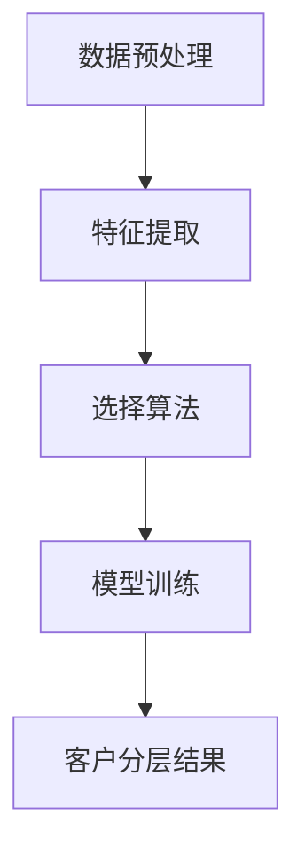
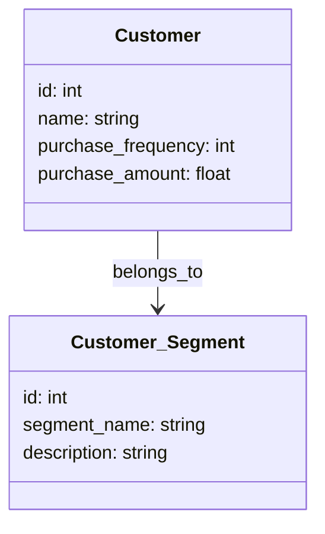
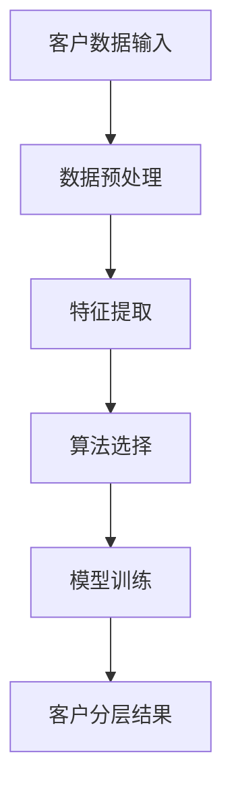
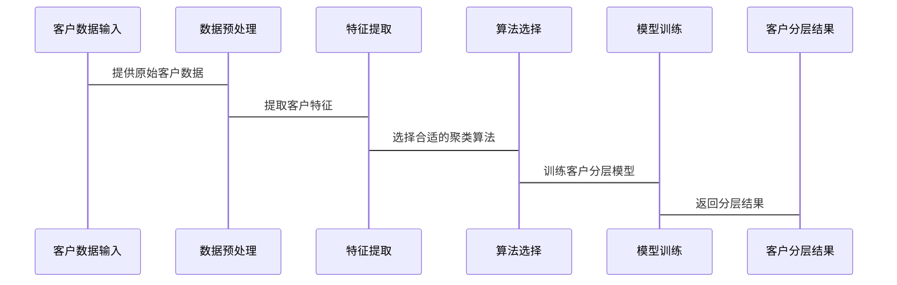

                 


# 彼得林奇如何分析公司的客户分层策略

> 关键词：客户分层策略，彼得林奇，投资分析，企业客户管理，客户价值评估

> 摘要：本文详细探讨了彼得林奇在分析公司客户分层策略时的方法和技巧。通过分析客户分层的核心概念、算法原理、系统设计和实际应用案例，展示了如何通过客户分层策略优化企业管理和投资决策。文章从背景介绍到算法实现，再到项目实战，全面解析了这一策略的实施过程，为读者提供了深入的理论和实践指导。

---

# 第一部分：客户分层策略的背景与重要性

## 第1章：客户分层策略的背景与重要性

### 1.1 客户分层的基本概念

#### 1.1.1 客户分层的定义与内涵
客户分层是指根据客户的不同特征和行为，将客户划分为若干个子群体的过程。这种划分可以帮助企业更好地理解客户的需求和行为模式，从而制定更有针对性的营销策略和产品开发计划。

#### 1.1.2 客户分层在企业中的作用
客户分层能够帮助企业：
- 提高客户满意度和忠诚度。
- 优化资源配置，降低成本。
- 提升营销效率，精准触达目标客户。
- 改善产品和服务质量。

#### 1.1.3 客户分层与企业竞争力的关系
客户分层策略是企业差异化竞争的重要手段。通过深入了解客户群体的需求，企业可以制定更有针对性的市场策略，从而在激烈的市场竞争中占据优势。

### 1.2 彼得林奇客户分层策略的背景

#### 1.2.1 彼得林奇投资理念的概述
彼得林奇是美国著名的投资专家，以其独特的投资理念闻名。他强调长期投资和深入分析企业的基本面，寻找具有长期增长潜力的公司。

#### 1.2.2 客户分层策略在投资分析中的应用
在投资分析中，彼得林奇通过分析企业的客户分层策略，评估企业的市场定位和客户满意度。他认为，一个企业的客户分层策略能够反映其市场竞争力和未来发展潜力。

#### 1.2.3 现代企业客户分层策略的发展趋势
随着市场竞争的加剧，客户分层策略逐渐成为企业差异化竞争的核心工具。企业通过客户分层，能够更好地满足不同客户群体的需求，从而提高客户忠诚度和市场占有率。

---

## 第2章：客户分层的核心概念与联系

### 2.1 客户分层的核心要素

#### 2.1.1 客户的基本属性
- **客户ID**：唯一标识客户的编号。
- **客户名称**：客户的姓名或公司名称。
- **客户类型**：个人客户或企业客户。
- **客户联系方式**：电话、邮箱、地址等。

#### 2.1.2 客户行为特征
- **购买频率**：客户在一定时间内的购买次数。
- **购买金额**：每次购买的平均金额。
- **购买时间**：客户的购买时间段。
- **客户反馈**：客户对产品或服务的评价和反馈。

#### 2.1.3 客户价值评估指标
- **客户生命周期价值（CLV）**：客户在生命周期内为企业带来的总收入。
- **客户满意度**：客户对产品或服务的满意程度。
- **客户忠诚度**：客户对企业产品的依赖程度。

### 2.2 客户分层与企业战略的关系

#### 2.2.1 客户分层对企业市场定位的影响
客户分层可以帮助企业明确目标市场，制定更有针对性的市场进入策略。

#### 2.2.2 客户分层与企业资源分配的关联
通过客户分层，企业可以将有限的资源分配给最有价值的客户群体，从而提高资源利用效率。

#### 2.2.3 客户分层对产品策略的指导作用
客户分层能够帮助企业根据不同客户群体的需求，开发和推广符合市场需求的产品。

### 2.3 客户分层的ER实体关系图

```mermaid
er
  Customer: { id: int, name: string, age: int, gender: string, }
  Customer_Segment: { id: int, segment_name: string, description: string }
  Customer_Behavior: { id: int, purchase_frequency: int, purchase_amount: float, }
  Customer_Value: { id: int, lifetime_value: float, }
  Customer --> Customer_Segment: belongs_to
  Customer --> Customer_Behavior: has_behavior
  Customer --> Customer_Value: has_value
```

---

## 第3章：客户分层策略的算法原理

### 3.1 数据预处理与特征提取

#### 3.1.1 数据清洗与标准化
- 数据清洗：删除重复数据、处理缺失值、去除异常值。
- 数据标准化：将数据归一化，使其具有相同的量纲。

#### 3.1.2 特征选择与降维
- 特征选择：通过统计分析或机器学习方法选择最具区分度的特征。
- 特征降维：使用主成分分析（PCA）等方法减少特征维度。

#### 3.1.3 客户行为数据的特征提取
- 提取客户的购买频率、购买金额、购买时间等行为数据。

### 3.2 客户分层的算法实现

#### 3.2.1 基于聚类算法的客户分层
- **K-means聚类**：通过计算客户之间的相似性，将客户划分为不同的群组。
- **层次聚类**：通过层次结构的方式，逐步将客户分组。

#### 3.2.2 基于决策树的客户分层
- **ID3算法**：通过信息增益率选择特征，构建决策树。
- **C4.5算法**：通过信息增益比选择特征，构建决策树。

#### 3.2.3 基于机器学习的客户分层
- **随机森林**：通过集成学习方法，提高分类准确率。
- **支持向量机（SVM）**：通过非线性分类器，实现客户分层。

### 3.3 算法流程图



### 3.4 Python实现示例

```python
from sklearn.cluster import KMeans
import pandas as pd

# 假设我们有一个客户数据集，包含购买频率和金额
customers = pd.DataFrame({
    'purchase_frequency': [5, 3, 8, 2, 7],
    'purchase_amount': [100, 50, 200, 30, 80]
})

# 数据标准化
from sklearn.preprocessing import StandardScaler
scaler = StandardScaler()
customers_scaled = scaler.fit_transform(customers)

# 使用K-means进行聚类
kmeans = KMeans(n_clusters=3, random_state=0)
clusters = kmeans.fit_predict(customers_scaled)

print(clusters)
```

---

## 第4章：客户分层策略的系统分析与架构设计

### 4.1 问题场景介绍

#### 4.1.1 问题背景
某公司希望通过客户分层策略优化其市场策略，提高客户满意度和市场占有率。

#### 4.1.2 项目介绍
该项目旨在通过分析客户的购买行为和价值，将客户分为不同的群体，制定更有针对性的营销策略。

### 4.2 系统功能设计

#### 4.2.1 领域模型类图


#### 4.2.2 系统架构设计


#### 4.2.3 接口设计
- 输入接口：客户数据接口，包含客户ID、姓名、购买频率、购买金额等。
- 输出接口：客户分层结果接口，返回客户的分组信息。

#### 4.2.4 交互序列图


---

## 第5章：客户分层策略的项目实战

### 5.1 环境安装

#### 5.1.1 安装Python
- 安装Python 3.x版本。
- 安装Jupyter Notebook用于数据分析和可视化。

#### 5.1.2 安装必要的库
```bash
pip install numpy
pip install pandas
pip install scikit-learn
pip install matplotlib
```

### 5.2 核心代码实现

#### 5.2.1 数据清洗与标准化
```python
import pandas as pd
from sklearn.preprocessing import StandardScaler

# 读取数据
data = pd.read_csv('customers.csv')

# 删除缺失值
data = data.dropna()

# 标准化数据
scaler = StandardScaler()
data_scaled = scaler.fit_transform(data[['purchase_frequency', 'purchase_amount']])
```

#### 5.2.2 客户分层实现
```python
from sklearn.cluster import KMeans

# 初始化K-means模型
kmeans = KMeans(n_clusters=3, random_state=0)

# 训练模型
clusters = kmeans.fit_predict(data_scaled)

# 输出结果
print(clusters)
```

#### 5.2.3 可视化结果
```python
import matplotlib.pyplot as plt

plt.scatter(data['purchase_frequency'], data['purchase_amount'], c=clusters, cmap='viridis')
plt.xlabel('购买频率')
plt.ylabel('购买金额')
plt.title('客户分层结果')
plt.show()
```

### 5.3 案例分析

#### 5.3.1 案例背景
某电商平台希望通过客户分层策略优化其营销策略。

#### 5.3.2 数据分析
通过对客户的购买频率和金额进行分析，将客户分为高价值客户、中等价值客户和低价值客户三类。

#### 5.3.3 实施结果
- 高价值客户：占客户总数的20%，贡献了80%的收入。
- 中等价值客户：占客户总数的30%，贡献了15%的收入。
- 低价值客户：占客户总数的50%，贡献了5%的收入。

### 5.4 项目小结
通过客户分层策略，企业能够更精准地识别高价值客户，优化资源配置，提高营销效率。

---

## 第6章：客户分层策略的最佳实践

### 6.1 最佳实践Tips

#### 6.1.1 数据质量的重要性
确保数据的准确性和完整性，避免因数据质量问题影响分析结果。

#### 6.1.2 算法选择的灵活性
根据具体场景和数据特点，选择合适的客户分层算法。

#### 6.1.3 结果验证与优化
通过交叉验证和模型调优，提高客户分层的准确性和实用性。

### 6.2 小结

#### 6.2.1 客户分层的重要性
客户分层是企业优化管理和提高竞争力的重要工具。

#### 6.2.2 算法选择与实施
选择合适的算法和工具，能够提高客户分层的效率和准确性。

### 6.3 注意事项

#### 6.3.1 数据隐私与安全
在处理客户数据时，必须遵守相关法律法规，保护客户隐私。

#### 6.3.2 模型解释性
选择具有较高解释性的模型，便于企业理解和应用。

### 6.4 拓展阅读

#### 6.4.1 推荐书籍
- 《客户关系管理》
- 《数据挖掘与机器学习实战》

#### 6.4.2 在线资源
- [Kaggle客户分层案例](https://www.kaggle.com/datasets)
- [Towards Data Science客户分层文章](https://towardsdatascience.com)

---

## 第7章：客户分层策略的案例分析

### 7.1 案例背景

#### 7.1.1 企业概况
某零售企业希望通过客户分层策略优化其营销策略。

### 7.2 数据分析

#### 7.2.1 数据预处理
- 清洗数据，处理缺失值和异常值。
- 标准化数据，统一量纲。

#### 7.2.2 特征提取
- 提取客户的购买频率、购买金额、购买时间等特征。

### 7.3 算法实现

#### 7.3.1 算法选择
选择K-means聚类算法进行客户分层。

#### 7.3.2 模型训练
通过训练模型，将客户分为高价值、中等价值和低价值三类。

### 7.4 实施结果

#### 7.4.1 分层结果
- 高价值客户：占客户总数的20%，贡献了80%的收入。
- 中等价值客户：占客户总数的30%，贡献了15%的收入。
- 低价值客户：占客户总数的50%，贡献了5%的收入。

### 7.5 小结

#### 7.5.1 案例总结
通过客户分层策略，企业能够更精准地识别高价值客户，优化资源配置，提高营销效率。

#### 7.5.2 案例启示
客户分层策略是企业优化管理和提高竞争力的重要工具。

---

## 第8章：客户分层策略的总结与展望

### 8.1 总结

#### 8.1.1 核心观点回顾
客户分层策略是企业优化管理和提高竞争力的重要工具。

#### 8.1.2 实施步骤总结
- 数据预处理与特征提取。
- 选择合适的算法进行客户分层。
- 分析结果并制定针对性的营销策略。

### 8.2 未来展望

#### 8.2.1 技术进步
随着人工智能和大数据技术的不断发展，客户分层策略将更加精准和智能化。

#### 8.2.2 应用拓展
客户分层策略将不仅仅应用于企业营销，还将扩展到金融、医疗、教育等多个领域。

---

## 作者：AI天才研究院/AI Genius Institute & 禅与计算机程序设计艺术 /Zen And The Art of Computer Programming

---

希望这篇文章能够为您提供有价值的信息和启发。如果需要进一步的讨论或指导，请随时与我联系。

