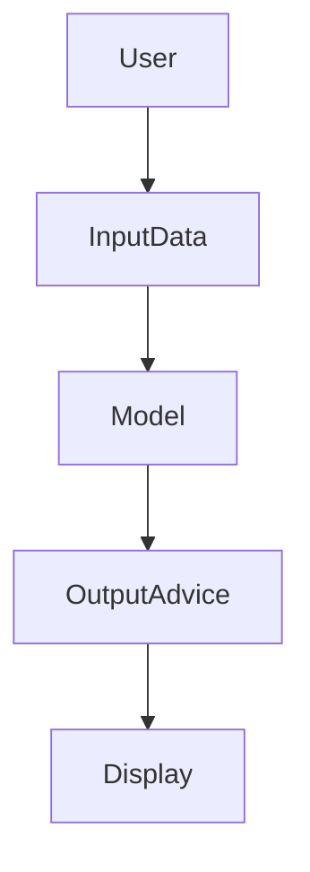
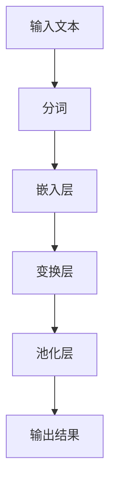
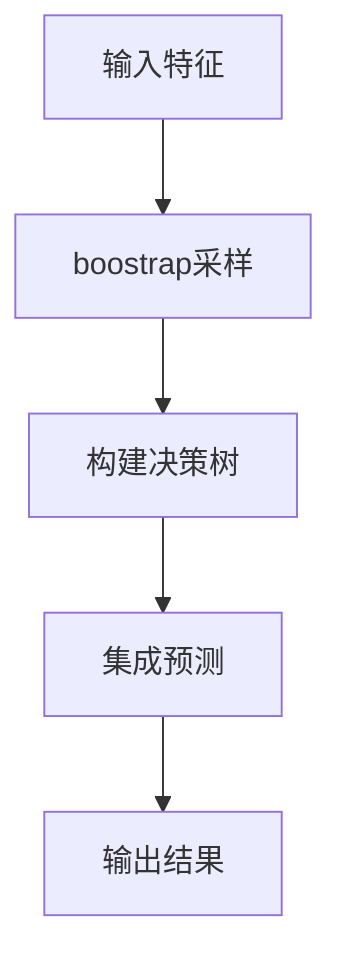
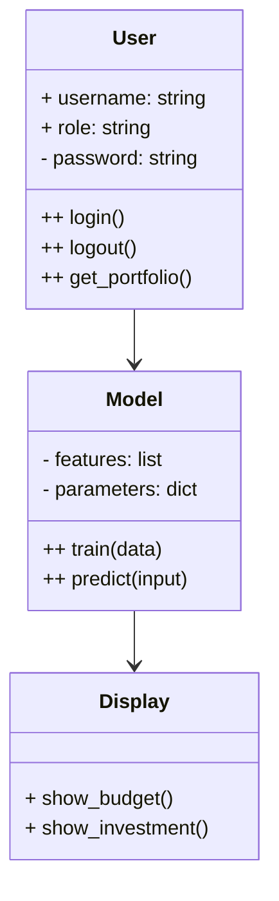

                 


# 构建企业级AI财务顾问：预算规划与投资建议

## 关键词：企业级AI、财务顾问、预算规划、投资建议、AI算法、系统架构、NLP技术

## 摘要：  
本文详细探讨了如何利用人工智能技术构建企业级财务顾问系统，重点分析预算规划与投资建议的核心算法与系统架构。文章从问题背景出发，深入解析了AI技术在财务领域的应用潜力，结合NLP和机器学习算法，构建了完整的系统架构，并通过实际案例展示了系统实现与应用价值。

---

## 第1章: 问题背景与需求分析

### 1.1 问题背景  
传统财务顾问主要依赖人工分析和经验判断，存在效率低、覆盖面有限、数据处理能力不足等问题。企业财务规划和投资决策需要快速处理海量数据、实时反馈和个性化建议，传统方法难以满足需求。AI技术的引入，特别是自然语言处理（NLP）和机器学习，为解决这些问题提供了新的可能性。

#### 1.1.1 传统财务顾问的局限性  
- 数据处理能力有限：传统财务顾问难以快速处理海量非结构化数据。  
- 个性化服务不足：难以针对不同企业的需求提供定制化建议。  
- 决策效率低下：人工分析耗时长，难以满足实时决策需求。  

#### 1.1.2 企业财务规划与投资决策的痛点  
- **预算规划**：企业需要在不确定的市场环境中制定合理的预算，但传统方法难以量化风险和不确定性。  
- **投资建议**：投资决策需要综合分析市场趋势、财务数据和企业战略，但传统方法难以实现动态调整。  
- **数据孤岛**：企业内部数据分散，难以形成统一的决策支持系统。  

#### 1.1.3 AI技术在财务领域的应用潜力  
- **自然语言处理（NLP）**：用于分析财务报告、新闻和市场评论，提取关键信息。  
- **机器学习**：用于预测市场趋势、优化投资组合和预算分配。  
- **深度学习**：用于构建复杂的财务模型，捕捉非线性关系。  

### 1.2 问题描述  
企业级AI财务顾问的目标是通过AI技术实现预算规划与投资建议的自动化、智能化和个性化。系统需要具备以下功能：  
1. **数据采集与处理**：整合企业内外部数据，包括财务报表、市场数据、新闻等。  
2. **智能分析**：利用NLP和机器学习技术，分析数据并生成预算建议和投资策略。  
3. **动态调整**：根据市场变化和企业内部数据，实时优化建议。  

#### 1.2.1 预算规划的核心挑战  
- 如何处理海量非结构化数据？  
- 如何量化市场波动对预算的影响？  
- 如何实现预算的动态调整？  

#### 1.2.2 投资建议的关键问题  
- 如何在复杂市场中选择最优投资组合？  
- 如何平衡风险与收益？  
- 如何实时跟踪市场变化并调整建议？  

#### 1.2.3 企业级AI财务顾问的系统边界  
- **输入数据**：企业财务数据、市场数据、政策信息等。  
- **输出结果**：预算规划方案、投资建议、风险评估报告。  
- **系统功能**：数据采集、分析、预测、优化和反馈。  

### 1.3 问题解决思路  
AI技术的核心在于数据处理、模式识别和决策优化。通过结合NLP和机器学习，系统能够从非结构化数据中提取关键信息，建立预测模型，并根据实时数据动态调整建议。

#### 1.3.1 数据驱动的财务分析  
- 数据预处理：清洗、转换和标注。  
- 数据建模：构建财务指标预测模型。  
- 数据可视化：通过图表展示分析结果。  

#### 1.3.2 AI技术在财务决策中的应用  
- **NLP**：用于分析财务报告和市场新闻，提取关键词和情感倾向。  
- **机器学习**：用于预测市场趋势和优化投资组合。  
- **深度学习**：用于构建复杂财务模型，捕捉非线性关系。  

#### 1.3.3 企业级AI财务顾问的实现路径  
1. 数据采集与整合：建立数据采集模块，整合企业内外部数据。  
2. 模型训练：基于历史数据训练NLP和机器学习模型。  
3. 系统集成：将模型集成到财务顾问系统中，提供实时建议。  

### 1.4 系统边界与外延  
系统边界是指财务顾问系统与其他系统的交互范围。  
- **数据层**：与企业ERP系统、金融市场数据源对接。  
- **服务层**：与企业内部的财务部门、投资部门交互。  
- **扩展方向**：未来可能扩展至税务优化、风险管理等领域。  

---

## 第2章: 核心概念与技术联系  

### 2.1 AI技术在财务领域的核心应用  
AI技术在财务领域的应用主要集中在NLP和机器学习两大领域。  

#### 2.1.1 自然语言处理（NLP）在财务文本分析中的应用  
- **财务报告分析**：提取财务数据和关键指标。  
- **市场新闻分析**：识别市场趋势和风险因素。  
- **文档分类**：将财务文档归类为预算、投资、税务等类别。  

#### 2.1.2 机器学习在财务预测中的应用  
- **市场预测**：基于历史数据预测股票价格、汇率波动。  
- **风险评估**：评估投资项目的潜在风险。  
- **预算优化**：根据历史数据优化预算分配。  

#### 2.1.3 深度学习在复杂财务模型中的应用  
- **复杂模型构建**：利用深度学习构建非线性财务模型。  
- **实时调整**：根据实时数据动态优化模型参数。  

### 2.2 核心技术对比分析  
以下是NLP、机器学习和深度学习在财务领域应用的对比分析：  

| **技术**       | **优点**                           | **缺点**                           |  
|----------------|------------------------------------|------------------------------------|  
| **NLP**        | 数据处理能力强，适合文本分析      | 对于结构化数据处理能力有限        |  
| **机器学习**    | 模型解释性强，适合中小规模数据    | 对于复杂非线性关系处理能力有限      |  
| **深度学习**    | 模型表达能力强，适合复杂任务      | 训练时间长，需要大量数据            |  

### 2.3 系统实体关系图  
以下是系统实体关系图：  


---

## 第3章: 算法原理与实现  

### 3.1 自然语言处理算法  

#### 3.1.1 基于BERT的财务文本分析  
BERT（Bidirectional Encoder Representations from Transformers）是一种预训练语言模型，广泛应用于NLP任务。  



#### 3.1.2 代码实现  
以下是基于BERT的文本分类代码示例：  

```python
import tensorflow as tf
from tensorflow.keras import layers

def build_model(max_length=128, num_classes=2):
    inputs = layers.Input(shape=(max_length,), dtype='int64')
    embedding_layer = layers.Embedding( vocab_size, 128)(inputs)
    transformer_layer = layers.Transformer( n_layer=2, n_head=4, d_model=128)(embedding_layer)
    pool_layer = layers.GlobalMaxPooling1D()(transformer_layer)
    dense_layer = layers.Dense(64, activation='relu')(pool_layer)
    output_layer = layers.Dense(num_classes, activation='softmax')(dense_layer)
    return Model(inputs=inputs, outputs=output_layer)
```

#### 3.1.3 应用场景  
- **财务报告分类**：将财务报告分类为盈利或亏损。  
- **市场新闻情感分析**：分析新闻情感，预测市场趋势。  

---

### 3.2 机器学习算法  

#### 3.2.1 基于随机森林的投资组合优化  
随机森林是一种基于树的集成学习算法，适合处理高维数据。  



#### 3.2.2 代码实现  
以下是随机森林实现投资组合优化的代码示例：  

```python
import numpy as np
from sklearn.ensemble import RandomForestRegressor

def investment_portfolio_optimization(data, target):
    X = data.drop(columns=target)
    y = data[target]
    model = RandomForestRegressor(n_estimators=100, random_state=42)
    model.fit(X, y)
    predictions = model.predict(X)
    return predictions
```

---

## 第4章: 系统分析与架构设计  

### 4.1 问题场景介绍  
企业级AI财务顾问系统需要处理复杂的财务数据，包括结构化和非结构化数据。  

### 4.2 系统功能设计  
以下是系统功能设计的领域模型图：  



---

## 第5章: 项目实战  

### 5.1 环境安装  
需要安装以下环境：  
- Python 3.8+  
- TensorFlow 2.0+  
- scikit-learn 0.24+  

### 5.2 核心代码实现  
以下是系统核心代码实现：  

```python
import numpy as np
import pandas as pd
from sklearn.ensemble import RandomForestRegressor
from transformers import BertTokenizer, TFBertModel
import tensorflow as tf

# 数据预处理
def preprocess_data(data):
    # 假设data是一个DataFrame，包含财务相关数据
    # 这里仅展示部分处理步骤
    data = data.dropna()
    data['label'] = data['label'].astype(int)
    return data

# 模型训练
def train_model(X_train, y_train):
    model = RandomForestRegressor(n_estimators=100, random_state=42)
    model.fit(X_train, y_train)
    return model

# 模型预测
def predict(model, X_test):
    return model.predict(X_test)

# BERT模型加载
tokenizer = BertTokenizer.from_pretrained('bert-base-uncased')
model = TFBertModel.from_pretrained('bert-base-uncased')

# 示例数据
data = pd.DataFrame({
    'text': ['Q2 revenue up by 10%', 'Earnings down by 5%'],
    'label': [1, 0]
})

# 数据处理
data = preprocess_data(data)

# 模型训练
X = data['text']
y = data['label']
tokenizer.encode_plus(X[0], add_special_tokens=True, return_tensors='tf')
```

---

## 第6章: 高级主题  

### 6.1 模型优化与部署  
- **模型优化**：使用超参数调优和模型压缩技术优化模型性能。  
- **模型部署**：将模型部署到企业云平台，提供API接口。  

### 6.2 监控与维护  
- **实时监控**：监控模型性能和数据源，及时发现异常。  
- **定期更新**：根据市场变化和新数据，定期更新模型。  

---

## 第7章: 总结与展望  

### 7.1 核心总结  
企业级AI财务顾问系统通过结合NLP和机器学习技术，能够显著提升预算规划和投资建议的效率和准确性。系统架构设计合理，功能模块清晰，具有较高的实用价值。  

### 7.2 未来展望  
未来，随着AI技术的不断发展，企业级AI财务顾问系统将更加智能化和个性化。可能出现的新趋势包括：  
1. **多模态分析**：结合文本、图像等多种数据源进行分析。  
2. **自适应学习**：模型能够根据实时数据自适应调整。  
3. **区块链技术**：结合区块链技术实现数据安全和可信度。  

---

## 作者：AI天才研究院/AI Genius Institute & 禅与计算机程序设计艺术 /Zen And The Art of Computer Programming

