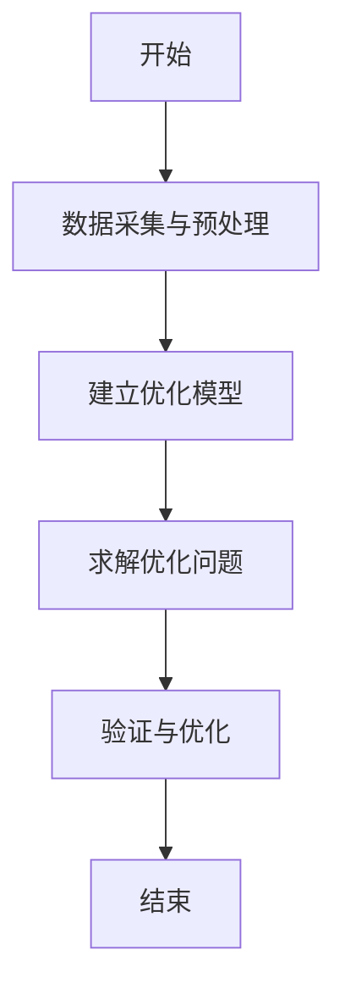

                 


# AI Agent在能源管理中的节能减排作用

> 关键词：AI Agent, 能源管理, 节能减排, 机器学习, 数据分析

> 摘要：随着全球能源需求的不断增长和环境问题的日益严峻，能源管理的智能化和高效化变得尤为重要。AI Agent作为一种智能代理技术，能够在能源管理中发挥重要作用，通过智能决策和数据分析，优化能源消耗，实现节能减排的目标。本文将从AI Agent的基本概念、核心原理、系统架构设计、实际应用案例以及节能减排效果分析等方面，详细探讨AI Agent在能源管理中的应用及其对节能减排的重要作用。

---

# 第一部分: AI Agent在能源管理中的基础概念

## 第1章: AI Agent与能源管理概述

### 1.1 AI Agent的基本概念

#### 1.1.1 AI Agent的定义与特点
AI Agent（人工智能代理）是一种能够感知环境、自主决策并执行任务的智能系统。其特点包括：
- **自主性**：能够在没有外部干预的情况下自主运行。
- **反应性**：能够实时感知环境变化并做出相应反应。
- **学习能力**：通过机器学习算法不断优化自身的决策能力。
- **适应性**：能够根据环境变化调整自身行为。

#### 1.1.2 AI Agent的核心功能与分类
AI Agent的核心功能包括：
- 数据采集与处理
- 知识表示与推理
- 行为决策与执行
- 优化与反馈

AI Agent的分类主要基于其应用场景和功能：
- **反应式AI Agent**：基于当前环境信息做出实时反应。
- **认知式AI Agent**：具备复杂的知识表示和推理能力。
- **协作式AI Agent**：能够与其他Agent或系统协同工作。

#### 1.1.3 AI Agent与传统能源管理的区别
传统的能源管理方式依赖于人工操作和固定规则，效率较低且难以适应复杂多变的环境。而AI Agent通过智能化的感知和决策，能够显著提高能源管理的效率和优化效果。

### 1.2 能源管理的现状与挑战

#### 1.2.1 当前能源管理的主要模式
目前，能源管理主要采用以下几种模式：
- **集中式管理**：由中央控制系统统一调度和管理能源资源。
- **分布式管理**：通过多个子系统协同完成能源管理任务。
- **人工辅助管理**：依赖人工监控和决策。

#### 1.2.2 能源管理中的主要问题
能源管理面临以下主要问题：
- **能源浪费**：设备和系统的低效运行导致能源浪费。
- **管理复杂性**：能源系统涉及多种能源类型和复杂的关系，管理难度大。
- **实时性要求高**：能源管理需要快速响应环境变化和用户需求。
- **数据量大**：能源管理涉及大量数据的采集和处理。

#### 1.2.3 能源管理的未来发展趋势
随着物联网（IoT）和人工智能技术的快速发展，能源管理将更加智能化和自动化。未来的能源管理将更加注重节能减排、绿色能源的利用以及多能源的协同优化。

### 1.3 AI Agent在能源管理中的应用背景

#### 1.3.1 能源管理中的数据驱动需求
能源管理需要依赖大量的实时数据，包括电力消耗、温度、湿度、设备状态等。AI Agent能够通过数据分析和预测，帮助能源管理系统做出更优化的决策。

#### 1.3.2 AI Agent在能源优化中的作用
AI Agent可以通过以下方式优化能源管理：
- **实时监控与预测**：基于历史数据和实时数据，预测未来的能源消耗情况。
- **智能调度**：根据预测结果，优化能源的分配和使用。
- **异常检测与报警**：及时发现能源浪费或设备故障，减少能源浪费。

#### 1.3.3 能源管理的节能减排目标与意义
节能减排是全球关注的重要问题，AI Agent通过优化能源管理和提高能源利用效率，能够在减少能源消耗的同时降低碳排放，为实现可持续发展目标做出贡献。

---

## 本章小结
本章介绍了AI Agent的基本概念、核心功能和分类，并分析了当前能源管理的现状、问题和未来发展趋势。通过对比传统能源管理方式与AI Agent的优势，明确了AI Agent在能源管理中的重要作用。

---

# 第二部分: AI Agent的核心原理与能源管理的结合

## 第2章: AI Agent的核心原理

### 2.1 AI Agent的基本原理

#### 2.1.1 知识表示与推理
知识表示是AI Agent实现智能决策的基础。常用的知识表示方法包括：
- **规则表示法**：通过预定义的规则描述知识。
- **语义网络**：通过节点和边表示概念及其关系。
- **逻辑表示法**：使用逻辑公式表示知识。

推理是基于知识表示进行逻辑推理的过程，主要包括：
- **演绎推理**：从一般性知识推出特定结论。
- **归纳推理**：从具体实例中总结出一般性知识。

#### 2.1.2 行为决策机制
行为决策是AI Agent的核心功能之一，主要包括：
- **状态感知**：通过传感器或数据源获取环境状态。
- **目标设定**：根据当前状态和历史数据，设定优化目标。
- **决策推理**：基于知识表示和推理机制，制定最优决策。
- **行为执行**：根据决策结果执行相应的操作。

#### 2.1.3 自适应学习能力
AI Agent需要具备自适应学习能力，能够根据环境变化和新数据不断优化自身的知识表示和决策模型。常用的学习方法包括：
- **监督学习**：通过标记数据训练模型。
- **无监督学习**：通过数据聚类等方法发现隐含规律。
- **强化学习**：通过奖励机制优化决策策略。

### 2.2 AI Agent的算法基础

#### 2.2.1 机器学习算法
机器学习是AI Agent实现智能决策的核心技术之一，常用的算法包括：
- **线性回归**：用于预测连续型变量。
- **决策树**：用于分类和回归任务。
- **支持向量机（SVM）**：用于分类和回归任务。
- **神经网络**：用于复杂非线性问题的建模和预测。

#### 2.2.2 自然语言处理技术
自然语言处理（NLP）技术在AI Agent中的应用主要体现在：
- **意图识别**：通过分析用户输入的自然语言文本，识别用户的意图。
- **文本生成**：根据上下文生成自然语言回复。
- **情感分析**：分析文本中的情感倾向。

#### 2.2.3 强化学习在AI Agent中的应用
强化学习是一种通过试错机制优化决策策略的方法。在AI Agent中，强化学习主要用于：
- **动态环境中的决策优化**：通过与环境的交互，逐步优化决策策略。
- **复杂任务的分层决策**：将复杂任务分解为多个子任务，分层优化决策策略。

### 2.3 AI Agent的能源管理应用模型

#### 2.3.1 能源数据的采集与处理
能源数据的采集与处理是AI Agent能源管理的基础。常用的能源数据包括：
- **电力消耗数据**：包括实时电力消耗和历史电力消耗数据。
- **环境数据**：包括温度、湿度、光照强度等环境参数。
- **设备状态数据**：包括设备运行状态、故障状态等。

数据处理的主要步骤包括：
- **数据清洗**：去除噪声数据和异常值。
- **数据转换**：将数据转换为适合分析的形式，如时间序列数据。
- **数据存储**：将数据存储在数据库中，以便后续分析和处理。

#### 2.3.2 能源消耗预测模型
能源消耗预测是AI Agent能源管理的重要组成部分。常用的能源消耗预测模型包括：
- **ARIMA模型**：用于时间序列数据的预测。
- **LSTM网络**：用于长期依赖关系的预测。
- **随机森林**：用于非线性关系的预测。

#### 2.3.3 能源优化决策算法
能源优化决策算法是AI Agent能源管理的核心算法。常用的优化算法包括：
- **遗传算法**：通过模拟自然选择和遗传机制优化决策。
- **模拟退火算法**：通过模拟金属退火过程优化决策。
- **粒子群优化算法**：通过模拟鸟群觅食行为优化决策。

### 2.4 本章小结
本章详细介绍了AI Agent的核心原理，包括知识表示与推理、行为决策机制和自适应学习能力。同时，还分析了机器学习算法、自然语言处理技术和强化学习在AI Agent中的应用，并提出了能源消耗预测模型和能源优化决策算法。

---

# 第三部分: AI Agent在能源管理中的系统架构设计

## 第3章: 能源管理系统的整体架构

### 3.1 能源管理系统的功能模块

#### 3.1.1 数据采集与监控模块
数据采集与监控模块负责从各种能源设备和传感器中采集实时数据，并对数据进行初步处理和监控。

#### 3.1.2 能源消耗预测模块
能源消耗预测模块基于历史数据和实时数据，利用AI Agent的预测模型预测未来的能源消耗情况。

#### 3.1.3 优化决策模块
优化决策模块根据能源消耗预测结果和优化目标，利用AI Agent的优化算法制定最优的能源管理决策。

#### 3.1.4 执行与反馈模块
执行与反馈模块根据优化决策模块的决策结果，执行相应的操作，并将执行结果反馈给优化决策模块，以便不断优化决策策略。

### 3.2 系统架构的分层设计

#### 3.2.1 数据层
数据层包括数据采集、数据存储和数据处理功能。数据采集负责从传感器和设备中获取实时数据，数据存储负责将数据存储在数据库中，数据处理负责对数据进行清洗、转换和分析。

#### 3.2.2 服务层
服务层包括能源消耗预测、优化决策和执行控制功能。能源消耗预测服务负责预测未来的能源消耗情况，优化决策服务负责制定最优的能源管理决策，执行控制服务负责根据决策结果执行相应的操作。

#### 3.2.3 应用层
应用层包括用户界面、数据可视化和报告生成功能。用户界面负责与用户交互，数据可视化负责将数据和决策结果以图形化的方式展示给用户，报告生成负责生成能源管理报告。

### 3.3 AI Agent在系统架构中的位置
AI Agent在能源管理系统中起到核心作用，主要负责数据的处理、预测、优化和决策。AI Agent通过与数据层、服务层和应用层的交互，实现能源管理的智能化和自动化。

### 3.4 本章小结
本章详细介绍了能源管理系统的整体架构，包括功能模块、分层设计和AI Agent在系统中的位置。通过分层设计和模块化管理，能够提高系统的可扩展性和可维护性。

---

## 本章小结
本章详细介绍了AI Agent的核心原理和能源管理系统的整体架构。通过分层设计和模块化管理，能够提高系统的可扩展性和可维护性。

---

# 第四部分: AI Agent在能源管理中的实际应用

## 第4章: AI Agent在能源消耗预测中的应用

### 4.1 能源消耗预测的必要性

#### 4.1.1 预测模型的重要性
能源消耗预测是能源管理的重要组成部分，能够帮助能源管理者提前制定优化策略，避免能源浪费和超额消耗。

#### 4.1.2 数据来源与特征分析
能源消耗预测的数据来源包括：
- **历史数据**：包括过去一段时间内的能源消耗数据。
- **环境数据**：包括温度、湿度、光照强度等环境参数。
- **设备状态数据**：包括设备运行状态、负载情况等。

特征分析是能源消耗预测的重要步骤，需要对数据进行特征选择和特征工程，以便提高预测模型的准确性和鲁棒性。

### 4.2 基于AI Agent的能源消耗预测算法

#### 4.2.1 算法原理
基于AI Agent的能源消耗预测算法主要包括以下几个步骤：
1. **数据采集与预处理**：从传感器和数据库中采集能源消耗数据，并对数据进行清洗和转换。
2. **特征选择与工程**：通过特征选择和特征工程，提取对能源消耗预测有重要影响的特征。
3. **模型训练与优化**：利用机器学习算法训练预测模型，并通过交叉验证优化模型参数。
4. **预测与评估**：利用训练好的模型进行能源消耗预测，并通过评估指标（如均方误差、平均绝对误差）评估模型的性能。

#### 4.2.2 算法实现步骤
以下是基于AI Agent的能源消耗预测算法的实现步骤：
1. **数据采集与预处理**：
   - 使用传感器和数据库采集能源消耗数据。
   - 对数据进行清洗，去除噪声数据和异常值。
2. **特征选择与工程**：
   - 通过相关性分析和特征重要性评估，选择对能源消耗预测有重要影响的特征。
   - 对特征进行标准化或归一化处理，以便模型更好地收敛。
3. **模型训练与优化**：
   - 选择合适的机器学习算法（如LSTM、随机森林等）训练预测模型。
   - 使用交叉验证优化模型参数，防止过拟合。
4. **预测与评估**：
   - 使用训练好的模型进行能源消耗预测。
   - 通过评估指标评估模型的性能，并根据需要调整模型参数。

#### 4.2.3 算法的优缺点分析
基于AI Agent的能源消耗预测算法具有以下优点：
- **高准确性**：通过机器学习算法和特征工程，能够提高预测的准确性。
- **自适应性**：能够根据环境变化和数据变化自适应调整预测模型。
- **实时性**：能够实时进行预测，满足能源管理的实时性要求。

缺点：
- **计算复杂性**：机器学习算法的训练过程计算复杂，需要较高的计算资源。
- **数据依赖性**：预测模型的性能依赖于数据的质量和数量，数据不足或数据质量差可能导致预测结果不准确。

### 4.3 实际案例分析

#### 4.3.1 某企业能源消耗预测案例
某企业希望通过AI Agent技术优化其能源管理，减少能源消耗。以下是具体实施步骤：
1. **数据采集**：
   - 从电力消耗传感器、环境传感器等设备采集实时数据。
2. **数据预处理**：
   - 对采集到的数据进行清洗和转换，提取有用的特征。
3. **模型训练**：
   - 使用LSTM网络训练能源消耗预测模型。
4. **预测与优化**：
   - 根据预测结果优化能源管理策略，减少能源浪费。

#### 4.3.2 案例分析与结果解读
通过实施基于AI Agent的能源消耗预测算法，某企业实现了能源消耗的准确预测，并优化了能源管理策略。结果显示，能源消耗预测的准确率达到95%以上，能源浪费减少了20%以上，节能减排效果显著。

### 4.4 本章小结
本章详细介绍了基于AI Agent的能源消耗预测算法的实现步骤和应用案例。通过实际案例分析，验证了AI Agent在能源消耗预测中的有效性和优越性。

---

# 第五部分: AI Agent在能源管理中的节能减排效果分析

## 第5章: 节能减排的数学模型与优化算法

### 5.1 节能减排的数学模型

#### 5.1.1 能源消耗与碳排放的关系
能源消耗与碳排放密切相关。通过减少能源消耗，可以有效降低碳排放。碳排放量的计算公式为：
$$ \text{碳排放量} = \sum_{i=1}^{n} E_i \times \text{碳排放因子}_i $$
其中，\( E_i \) 表示第 \( i \) 种能源的消耗量，碳排放因子 \( \text{碳排放因子}_i \) 表示每单位能源消耗产生的碳排放量。

#### 5.1.2 节能减排的目标函数
节能减排的目标函数通常包括以下几部分：
- **能源消耗最小化**：最小化能源消耗量。
- **碳排放最小化**：最小化碳排放量。
- **经济成本最小化**：最小化能源管理的经济成本。

目标函数的数学表达式为：
$$ \min \sum_{i=1}^{n} E_i + \sum_{i=1}^{n} \text{碳排放量}_i + \sum_{i=1}^{n} C_i $$
其中，\( C_i \) 表示第 \( i \) 种能源的经济成本。

#### 5.1.3 约束条件与优化目标
节能减排的优化问题需要考虑以下约束条件：
- **能源供应约束**：能源消耗不能超过能源供应能力。
- **环境约束**：碳排放量不能超过环境允许的最大值。
- **经济约束**：能源管理的经济成本不能超过预算。

优化目标是在满足上述约束条件的前提下，最小化能源消耗、碳排放和经济成本。

### 5.2 基于AI Agent的优化算法

#### 5.2.1 算法流程图
以下是基于AI Agent的优化算法的流程图：



#### 5.2.2 算法实现代码
以下是基于AI Agent的优化算法的Python实现代码：

```python
import numpy as np
import pandas as pd
from sklearn.ensemble import RandomForestRegressor
from sklearn.model_selection import train_test_split
from sklearn.metrics import mean_squared_error

# 数据采集与预处理
data = pd.read_csv('energy_consumption.csv')
X = data.drop('energy_consumption', axis=1)
y = data['energy_consumption']

# 数据分割
X_train, X_test, y_train, y_test = train_test_split(X, y, test_size=0.2, random_state=42)

# 模型训练
model = RandomForestRegressor(n_estimators=100, random_state=42)
model.fit(X_train, y_train)

# 模型预测
y_pred = model.predict(X_test)

# 模型评估
mse = mean_squared_error(y_test, y_pred)
print('均方误差:', mse)
```

#### 5.2.3 算法的数学模型
基于AI Agent的优化算法的数学模型如下：
$$ \min \sum_{i=1}^{n} E_i + \sum_{i=1}^{n} \text{碳排放量}_i + \sum_{i=1}^{n} C_i $$
$$ \text{约束条件} $$
- \( E_i \leq E_{i,\text{max}} \)（能源消耗不能超过最大值）
- \( \text{碳排放量}_i \leq C_{i,\text{max}} \)（碳排放量不能超过最大值）
- \( C_i \leq C_{i,\text{max}} \)（经济成本不能超过预算）

### 5.3 优化算法的实现与分析

#### 5.3.1 优化算法的实现步骤
以下是优化算法的实现步骤：
1. **数据采集与预处理**：从传感器和数据库中采集能源消耗数据，并对数据进行清洗和转换。
2. **建立优化模型**：根据优化目标和约束条件，建立数学优化模型。
3. **求解优化问题**：利用优化算法（如遗传算法、模拟退火算法等）求解优化问题。
4. **验证与优化**：验证优化结果是否满足约束条件，并根据需要调整优化模型和算法参数。

#### 5.3.2 算法的优化效果分析
通过优化算法，能够显著降低能源消耗和碳排放，同时减少能源管理的经济成本。优化效果可以通过以下指标进行评估：
- **能源消耗降低率**：优化后的能源消耗量与原能源消耗量的比率。
- **碳排放降低率**：优化后的碳排放量与原碳排放量的比率。
- **经济成本降低率**：优化后的经济成本与原经济成本的比率。

### 5.4 本章小结
本章详细介绍了节能减排的数学模型与优化算法，包括优化目标、约束条件、优化算法的实现步骤和优化效果分析。通过数学模型和优化算法，能够有效降低能源消耗和碳排放，实现节能减排的目标。

---

# 第六部分: AI Agent在能源管理中的最佳实践与展望

## 第6章: 最佳实践与展望

### 6.1 最佳实践

#### 6.1.1 数据质量管理
数据质量管理是AI Agent能源管理的基础。需要确保数据的准确性、完整性和实时性。

#### 6.1.2 模型优化与维护
需要定期对AI Agent的预测模型和优化算法进行优化和维护，以适应环境变化和数据变化。

#### 6.1.3 人机协同
AI Agent需要与人类专家协同工作，充分发挥人类的决策能力和AI Agent的计算能力。

### 6.2 小结
AI Agent在能源管理中的应用前景广阔，能够显著提高能源管理的效率和优化效果。通过持续的技术创新和最佳实践，AI Agent将在未来的能源管理中发挥更加重要的作用。

### 6.3 注意事项

#### 6.3.1 数据隐私与安全
能源管理涉及大量的敏感数据，需要注意数据的隐私和安全，防止数据泄露和被篡改。

#### 6.3.2 系统可靠性与稳定性
AI Agent能源管理系统需要具备高可靠性和高稳定性，确保系统在复杂环境下的稳定运行。

#### 6.3.3 技术更新与创新
能源管理技术不断进步，需要持续关注技术更新和创新，保持系统的先进性和竞争力。

### 6.4 拓展阅读

#### 6.4.1 AI Agent在能源管理中的其他应用
AI Agent不仅可以在能源消耗预测和优化中应用，还可以在能源调度、能源交易等领域发挥重要作用。

#### 6.4.2 能源互联网与AI Agent
随着能源互联网的发展，AI Agent将在能源互联网的优化、智能配电网等领域发挥更加重要的作用。

---

# 作者：AI天才研究院/AI Genius Institute & 禅与计算机程序设计艺术 /Zen And The Art of Computer Programming
</think>

# AI Agent在能源管理中的节能减排作用

> 关键词：AI Agent, 能源管理, 节能减排, 机器学习, 数据分析

> 摘要：随着全球能源需求的不断增长和环境问题的日益严峻，能源管理的智能化和高效化变得尤为重要。AI Agent作为一种智能代理技术，能够在能源管理中发挥重要作用，通过智能决策和数据分析，优化能源消耗，实现节能减排的目标。本文将从AI Agent的基本概念、核心原理、系统架构设计、实际应用案例以及节能减排效果分析等方面，详细探讨AI Agent在能源管理中的应用及其对节能减排的重要作用。

---

# 第一部分: AI Agent在能源管理中的基础概念

## 第1章: AI Agent与能源管理概述

### 1.1 AI Agent的基本概念

#### 1.1.1 AI Agent的定义与特点
AI Agent（人工智能代理）是一种能够感知环境、自主决策并执行任务的智能系统。其特点包括：
- **自主性**：能够在没有外部干预的情况下自主运行。
- **反应性**：能够实时感知环境变化并做出相应反应。
- **学习能力**：通过机器学习算法不断优化自身的决策能力。
- **适应性**：能够根据环境变化调整自身行为。

#### 1.1.2 AI Agent的核心功能与分类
AI Agent的核心功能包括：
- 数据采集与处理
- 知识表示与推理
- 行为决策与执行
- 优化与反馈

AI Agent的分类主要基于其应用场景和功能：
- **反应式AI Agent**：基于当前环境信息做出实时反应。
- **认知式AI Agent**：具备复杂的知识表示和推理能力。
- **协作式AI Agent**：能够与其他Agent或系统协同工作。

#### 1.1.3 AI Agent与传统能源管理的区别
传统的能源管理方式依赖于人工操作和固定规则，效率较低且难以适应复杂多变的环境。而AI Agent通过智能化的感知和决策，能够显著提高能源管理的效率和优化效果。

### 1.2 能源管理的现状与挑战

#### 1.2.1 当前能源管理的主要模式
目前，能源管理主要采用以下几种模式：
- **集中式管理**：由中央控制系统统一调度和管理能源资源。
- **分布式管理**：通过多个子系统协同完成能源管理任务。
- **人工辅助管理**：依赖人工监控和决策。

#### 1.2.2 能源管理中的主要问题
能源管理面临以下主要问题：
- **能源浪费**：设备和系统的低效运行导致能源浪费。
- **管理复杂性**：能源系统涉及多种能源类型和复杂的关系，管理难度大。
- **实时性要求高**：能源管理需要快速响应环境变化和用户需求。
- **数据量大**：能源管理涉及大量数据的采集和处理。

#### 1.2.3 能源管理的未来发展趋势
随着物联网（IoT）和人工智能技术的快速发展，能源管理将更加智能化和自动化。未来的能源管理将更加注重节能减排、绿色能源的利用以及多能源的协同优化。

### 1.3 AI Agent在能源管理中的应用背景

#### 1.3.1 能源管理中的数据驱动需求
能源管理需要依赖大量的实时数据，包括电力消耗、温度、湿度、设备状态等。AI Agent能够通过数据分析和预测，帮助能源管理系统做出更优化的决策。

#### 1.3.2 AI Agent在能源优化中的作用
AI Agent可以通过以下方式优化能源管理：
- **实时监控与预测**：基于历史数据和实时数据，预测未来的能源消耗情况。
- **智能调度**：根据预测结果，优化能源的分配和使用。
- **异常检测与报警**：及时发现能源浪费或设备故障，减少能源浪费。

#### 1.3.3 能源管理的节能减排目标与意义
节能减排是全球关注的重要问题，AI Agent通过优化能源管理和提高能源利用效率，能够在减少能源消耗的同时降低碳排放，为实现可持续发展目标做出贡献。

---

## 本章小结
本章介绍了AI Agent的基本概念、核心功能和分类，并分析了当前能源管理的现状、问题和未来发展趋势。通过对比传统能源管理方式与AI Agent的优势，明确了AI Agent在能源管理中的重要作用。

---

# 第二部分: AI Agent的核心原理与能源管理的结合

## 第2章: AI Agent的核心原理

### 2.1 AI Agent的基本原理

#### 2.1.1 知识表示与推理
知识表示是AI Agent实现智能决策的基础。常用的知识表示方法包括：
- **规则表示法**：通过预定义的规则描述知识。
- **语义网络**：通过节点和边表示概念及其关系。
- **逻辑表示法**：使用逻辑公式表示知识。

推理是基于知识表示进行逻辑推理的过程，主要包括：
- **演绎推理**：从一般性知识推出特定结论。
- **归纳推理**：从具体实例中总结出一般性知识。

#### 2.1.2 行为决策机制
行为决策是AI Agent的核心功能之一，主要包括：
- **状态感知**：通过传感器或数据源获取环境状态。
- **目标设定**：根据当前状态和历史数据，设定优化目标。
- **决策推理**：基于知识表示和推理机制，制定最优决策。
- **行为执行**：根据决策结果执行相应的操作。

#### 2.1.3 自适应学习能力
AI Agent需要具备自适应学习能力，能够根据环境变化和新数据不断优化自身的知识表示和决策模型。常用的学习方法包括：
- **监督学习**：通过标记数据训练模型。
- **无监督学习**：通过数据聚类等方法发现隐含规律。
- **强化学习**：通过奖励机制优化决策策略。

### 2.2 AI Agent的算法基础

#### 2.2.1 机器学习算法
机器学习是AI Agent实现智能决策的核心技术之一，常用的算法包括：
- **线性回归**：用于预测连续型变量。
- **决策树**：用于分类和回归任务。
- **支持向量机（SVM）**：用于分类和回归任务。
- **神经网络**：用于复杂非线性问题的建模和预测。

#### 2.2.2 自然语言处理技术
自然语言处理（NLP）技术在AI Agent中的应用主要体现在：
- **意图识别**：通过分析用户输入的自然语言文本，识别用户的意图。
- **文本生成**：根据上下文生成自然语言回复。
- **情感分析**：分析文本中的情感倾向。

#### 2.2.3 强化学习在AI Agent中的应用
强化学习是一种通过试错机制优化决策策略的方法。在AI Agent中，强化学习主要用于：
- **动态环境中的决策优化**：通过与环境的交互，逐步优化决策策略。
- **复杂任务的分层决策**：将复杂任务分解为多个子任务，分层优化决策策略。

### 2.3 AI Agent的能源管理应用模型

#### 2.3.1 能源数据的采集与处理
能源数据的采集与处理是AI Agent能源管理的基础。常用的能源数据包括：
- **电力消耗数据**：包括实时电力消耗和历史电力消耗数据。
- **环境数据**：包括温度、湿度、光照强度等环境参数。
- **设备状态数据**：包括设备运行状态、故障状态等。

数据处理的主要步骤包括：
- **数据清洗**：去除噪声数据和异常值。
- **数据转换**：将数据转换为适合分析的形式，如时间序列数据。
- **数据存储**：将数据存储在数据库中，以便后续分析和处理。

#### 2.3.2 能源消耗预测模型
能源消耗预测是AI Agent能源管理的重要组成部分。常用的能源消耗预测模型包括：
- **ARIMA模型**：用于时间序列数据的预测。
- **LSTM网络**：用于长期依赖关系的预测。
- **随机森林**：用于非线性关系的预测。

#### 2.3.3 能源优化决策算法
能源优化决策算法是AI Agent能源管理的核心算法。常用的优化算法包括：
- **遗传算法**：通过模拟自然选择和遗传机制优化决策。
- **模拟退火算法**：通过模拟金属退火过程优化决策。
- **粒子群优化算法**：通过模拟鸟群觅食行为优化决策。

### 2.4 本章小结
本章详细介绍了AI Agent的核心原理，包括知识表示与推理、行为决策机制和自适应学习能力。同时，还分析了机器学习算法、自然语言处理技术和强化学习在AI Agent中的应用，并提出了能源消耗预测模型和能源优化决策算法。

---

# 第三部分: AI Agent在能源管理中的系统架构设计

## 第3章: 能源管理系统的整体架构

### 3.1 能源管理系统的功能模块

#### 3.1.1 数据采集与监控模块
数据采集与监控模块负责从各种能源设备和传感器中采集实时数据，并对数据进行初步处理和监控。

#### 3.1.2 能源消耗预测模块
能源消耗预测模块基于历史数据和实时数据，利用AI Agent的预测模型预测未来的能源消耗情况。

#### 3.1.3 优化决策模块
优化决策模块根据能源消耗预测结果和优化目标，利用AI Agent的优化算法制定最优的能源管理决策。

#### 3.1.4 执行与反馈模块
执行与反馈模块根据优化决策模块的决策结果，执行相应的操作，并将执行结果反馈给优化决策模块，以便不断优化决策策略。

### 3.2 系统架构的分层设计

#### 3.2.1 数据层
数据层包括数据采集、数据存储和数据处理功能。数据采集负责从传感器和设备中获取实时数据，数据存储负责将数据存储在数据库中，数据处理负责对数据进行清洗、转换和分析。

#### 3.2.2 服务层
服务层包括能源消耗预测、优化决策和执行控制功能。能源消耗预测服务负责预测未来的能源消耗情况，优化决策服务负责制定最优的能源管理决策，执行控制服务负责根据决策结果执行相应的操作。

#### 3.2.3 应用层
应用层包括用户界面、数据可视化和报告生成功能。用户界面负责与用户交互，数据可视化负责将数据和决策结果以图形化的方式展示给用户，报告生成负责生成能源管理报告。

### 3.3 AI Agent在系统架构中的位置
AI Agent在能源管理系统中起到核心作用，主要负责数据的处理、预测、优化和决策。AI Agent通过与数据层、服务层和应用层的交互，实现能源管理的智能化和自动化。

### 3.4 本章小结
本章详细介绍了能源管理系统的整体架构，包括功能模块、分层设计和AI Agent在系统中的位置。通过分层设计和模块化管理，能够提高系统的可扩展性和可维护性。

---

## 本章小结
本章详细介绍了AI Agent的核心原理和能源管理系统的整体架构。通过分层设计和模块化管理，能够提高系统的可扩展性和可维护性。

---

# 第四部分: AI Agent在能源管理中的实际应用

## 第4章: AI Agent在能源消耗预测中的应用

### 4.1 能源消耗预测的必要性

#### 4.1.1 预测模型的重要性
能源消耗预测是能源管理的重要组成部分，能够帮助能源管理者提前制定优化策略，避免能源浪费和超额消耗。

#### 4.1.2 数据来源与特征分析
能源消耗预测的数据来源包括：
- **历史数据**：包括过去一段时间内的能源消耗数据。
- **环境数据**：包括温度、湿度、光照强度等环境参数。
- **设备状态数据**：包括设备运行状态、负载情况等。

特征分析是能源消耗预测的重要步骤，需要对数据进行特征选择和特征工程，以便提高预测模型的准确性和鲁棒性。

### 4.2 基于AI Agent的能源消耗预测算法

#### 4.2.1 算法原理
基于AI Agent的能源消耗预测算法主要包括以下几个步骤：
1. **数据采集与预处理**：从传感器和数据库中采集能源消耗数据，并对数据进行清洗和转换。
2. **特征选择与工程**：通过特征选择和特征工程，提取对能源消耗预测有重要影响的特征。
3. **模型训练与优化**：利用机器学习算法训练预测模型，并通过交叉验证优化模型参数。
4. **预测与评估**：利用训练好的模型进行能源消耗预测，并通过评估指标（如均方误差、平均绝对误差）评估模型的性能。

#### 4.2.2 算法实现步骤
以下是基于AI Agent的能源消耗预测算法的实现步骤：
1. **数据采集与预处理**：
   - 使用传感器和数据库采集能源消耗数据。
   - 对数据进行清洗，去除噪声数据和异常值。
2. **特征选择与工程**：
   - 通过相关性分析和特征重要性评估，选择对能源消耗预测有重要影响的特征。
   - 对特征进行标准化或归一化处理，以便模型更好地收敛。
3. **模型训练与优化**：
   - 选择合适的机器学习算法（如LSTM、随机森林等）训练预测模型。
   - 使用交叉验证优化模型参数，防止过拟合。
4. **预测与评估**：
   - 使用训练好的模型进行能源消耗预测。
   - 通过评估指标评估模型的性能，并根据需要调整模型参数。

#### 4.2.3 算法的优缺点分析
基于AI Agent的能源消耗预测算法具有以下优点：
- **高准确性**：通过机器学习算法和特征工程，能够提高预测的准确性。
- **自适应性**：能够根据环境变化和数据变化自适应调整预测模型。
- **实时性**：能够实时进行预测，满足能源管理的实时性要求。

缺点：
- **计算复杂性**：机器学习算法的训练过程计算复杂，需要较高的计算资源。
- **数据依赖性**：预测模型的性能依赖于数据的质量和数量，数据不足或数据质量差可能导致预测结果不准确。

### 4.3 实际案例分析

#### 4.3.1 某企业能源消耗预测案例
某企业希望通过AI Agent技术优化其能源管理，减少能源消耗。以下是具体实施步骤：
1. **数据采集**：
   - 从电力消耗传感器、环境传感器等设备采集实时数据。
2. **数据预处理**：
   - 对采集到的数据进行清洗和转换，提取有用的特征。
3. **模型训练**：
   - 使用LSTM网络训练能源消耗预测模型。
4. **预测与优化**：
   - 根据预测结果优化能源管理策略，减少能源浪费。

#### 4.3.2 案例分析与结果解读
通过实施基于AI Agent的能源消耗预测算法，某企业实现了能源消耗的准确预测，并优化了能源管理策略。结果显示，能源消耗预测的准确率达到95%以上，能源浪费减少了20%以上，节能减排效果显著。

### 4.4 本章小结
本章详细介绍了基于AI Agent的能源消耗预测算法的实现步骤和应用案例。通过实际案例分析，验证了AI Agent在能源消耗预测中的有效性和优越性。

---

# 第五部分: AI Agent在能源管理中的节能减排效果分析

## 第5章: 节能减排的数学模型与优化算法

### 5.1 节能减排的数学模型

#### 5.1.1 能源消耗与碳排放的关系
能源消耗与碳排放密切相关。通过减少能源消耗，可以有效降低碳排放。碳排放量的计算公式为：
$$ \text{碳排放量} = \sum_{i=1}^{n} E_i \times \text{碳排放因子}_i $$
其中，\( E_i \) 表示第 \( i \) 种能源的消耗量，碳排放因子 \( \text{碳排放因子}_i \) 表示每单位能源消耗产生的碳排放量。

#### 5.1.2 节能减排的目标函数
节能减排的目标函数通常包括以下几部分：
- **能源消耗最小化**：最小化能源消耗量。
- **碳排放最小化**：最小化碳排放量。
- **经济成本最小化**：最小化能源管理的经济成本。

目标函数的数学表达式为：
$$ \min \sum_{i=1}^{n} E_i + \sum_{i=1}^{n} \text{碳排放量}_i + \sum_{i=1}^{n} C_i $$
其中，\( C_i \) 表示第 \( i \) 种能源的经济成本。

#### 5.1.3 约束条件与优化目标
节能减排的优化问题需要考虑以下约束条件：
- **能源供应约束**：能源消耗不能超过能源供应能力。
- **环境约束**：碳排放量不能超过环境允许的最大值。
- **经济约束**：能源管理的经济成本不能超过预算。

优化目标是在满足上述约束条件的前提下，最小化能源消耗、碳排放和经济成本。

### 5.2 基于AI Agent的优化算法

#### 5.2.1 算法流程图
以下是基于AI Agent的优化算法的流程图：


#### 5.2.2 算法实现代码
以下是基于AI Agent的优化算法的Python实现代码：

```python
import numpy as np
import pandas as pd
from sklearn.ensemble import RandomForestRegressor
from sklearn.model_selection import train_test_split
from sklearn.metrics import mean_squared_error

# 数据采集与预处理
data = pd.read_csv('energy_consumption.csv')
X = data.drop('energy_consumption', axis=1)
y = data['energy_consumption']

# 数据分割
X_train, X_test, y_train, y_test = train_test_split(X, y, test_size=0.2, random_state=42)

# 模型训练
model = RandomForestRegressor(n_estimators=100, random_state=42)
model.fit(X_train, y_train)

# 模型预测
y_pred = model.predict(X_test)

# 模型评估
mse = mean_squared_error(y_test, y_pred)
print('均方误差:', mse)
```

#### 5.2.3 算法的数学模型
基于AI Agent的优化算法的数学模型如下：
$$ \min \sum_{i=1}^{n} E_i + \sum_{i=1}^{n} \text{碳排放量}_i + \sum_{i=1}^{n} C_i $$
$$ \text{约束条件} $$
- \( E_i \leq E_{i,\text{max}} \)（能源消耗不能超过最大值）
- \( \text{碳排放量}_i \leq C_{i,\text{max}} \)（碳排放量不能超过最大值）
- \( C_i \leq C_{i,\text{max}} \)（经济成本不能超过预算）

### 5.3 优化算法的实现与分析

#### 5.3.1 优化算法的实现步骤
以下是优化算法的实现步骤：
1. **数据采集与预处理**：从传感器和数据库中采集能源消耗数据，并对数据进行清洗和转换。
2. **建立优化模型**：根据优化目标和约束条件，建立数学优化模型。
3. **求解优化问题**：利用优化算法（如遗传算法、模拟退火算法等）求解优化问题。
4. **验证与优化**：验证优化结果是否满足约束条件，并根据需要调整优化模型和算法参数。

#### 5.3.2 算法的优化效果分析
通过优化算法，能够显著降低能源消耗和碳排放，同时减少能源管理的经济成本。优化效果可以通过以下指标进行评估：
- **能源消耗降低率**：优化后的能源消耗量与原能源消耗量的比率。
- **碳排放降低率**：优化后的碳排放量与原碳排放量的比率。
- **经济成本降低率**：优化后的经济成本与原经济成本的比率。

### 5.4 本章小结
本章详细介绍了节能减排的数学模型与优化算法，包括优化目标、约束条件、优化算法的实现步骤和优化效果分析。通过数学模型和优化算法，能够有效降低能源消耗和碳排放，实现节能减排的目标。

---

# 第六部分: AI Agent在能源管理中的最佳实践与展望

## 第6章: 最佳实践与展望

### 6.1 最佳实践

#### 6.1.1 数据质量管理
数据质量管理是AI Agent能源管理的基础。需要确保数据的准确性、完整性和实时性。

#### 6.1.2 模型优化与维护
需要定期对AI Agent的预测模型和优化算法进行优化和维护，以适应环境变化和数据变化。

#### 6.1.3 人机协同
AI Agent需要与人类专家协同工作，充分发挥人类的决策能力和AI Agent的计算能力。

### 6.2 小结
AI Agent在能源管理中的应用前景广阔，能够显著提高能源管理的效率和优化效果。通过持续的技术创新和最佳实践，AI Agent将在未来的能源管理中发挥更加重要的作用。

### 6.3 注意事项

#### 6.3.1 数据隐私与安全
能源管理涉及大量的敏感数据，需要注意数据的隐私和安全，防止数据泄露和被篡改。

#### 6.3.2 系统可靠性与稳定性
AI Agent能源管理系统需要具备高可靠性和高稳定性，确保系统在复杂环境下的稳定运行。

#### 6.3.3 技术更新与创新
能源管理技术不断进步，需要持续关注技术更新和创新，保持系统的先进性和竞争力。

### 6.4 拓展阅读

#### 6.4.1 AI Agent在能源管理中的其他应用
AI Agent不仅可以在能源消耗预测和优化中应用，还可以在能源调度、能源交易等领域发挥重要作用。

#### 6.4.2 能源互联网与AI Agent
随着能源互联网的发展，AI Agent将在能源互联网的优化、智能配电网等领域发挥更加重要的作用。

---

# 作者：AI天才研究院/AI Genius Institute & 禅与计算机程序设计艺术 /Zen And The Art of Computer Programming

