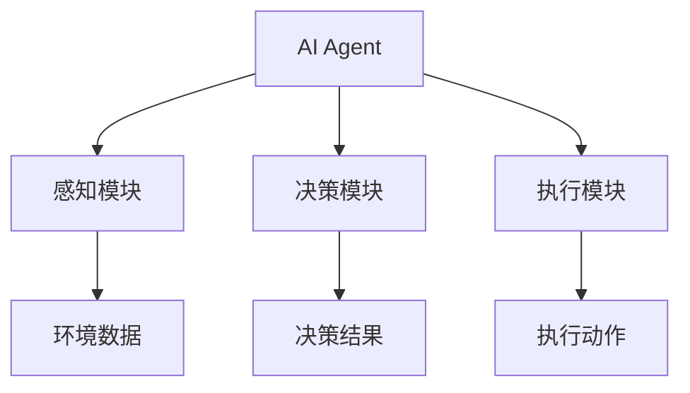
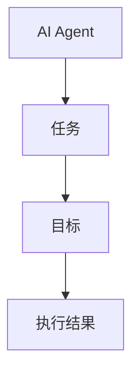
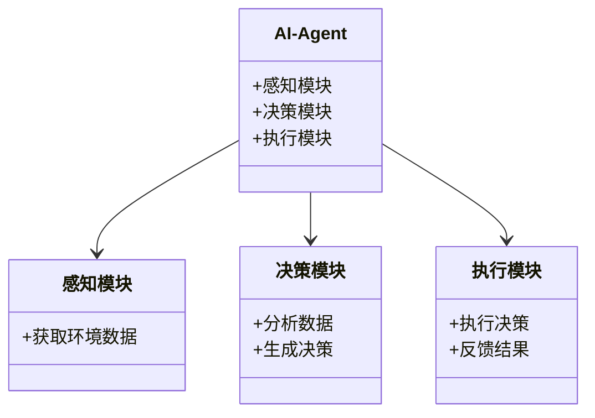

                 


```markdown
# AI Agent的性能优化与效率提升策略

> 关键词：AI Agent，性能优化，效率提升，算法优化，系统架构，项目实战

> 摘要：本文详细探讨了AI Agent的性能优化与效率提升策略，从基本概念到核心算法，从系统架构到项目实战，系统性地分析了AI Agent在实际应用中的优化方法。通过理论分析与实践案例结合，提出了多种优化策略，并通过具体代码实现和系统架构设计，展示了如何在实际项目中提升AI Agent的性能与效率。

---

# 第一部分: AI Agent的背景与概念

# 第1章: AI Agent的背景与概念

## 1.1 AI Agent的基本概念

### 1.1.1 什么是AI Agent
AI Agent（人工智能代理）是指能够感知环境、自主决策并执行任务的智能实体。它可以是一个软件程序、机器人或其他智能系统，具备自主性、反应性、目标导向性和社会性等核心特征。

### 1.1.2 AI Agent的核心特点
- **自主性**：AI Agent能够在没有外部干预的情况下自主运行。
- **反应性**：能够实时感知环境变化并做出反应。
- **目标导向性**：基于目标驱动行为，追求最优或满意的结果。
- **社会性**：能够与其他Agent或人类进行交互协作。

### 1.1.3 AI Agent的分类与应用场景
#### 分类
1. **简单反射型Agent**：基于当前输入做出反应，不依赖历史信息。
2. **基于模型的反射型Agent**：利用内部模型进行决策。
3. **目标驱动型Agent**：以目标为导向，主动采取行动。
4. **效用驱动型Agent**：通过最大化效用函数来优化决策。
5. **学习型Agent**：通过经验或数据学习改进性能。

#### 应用场景
- 自动化控制：如自动驾驶、工业机器人。
- 智能推荐：如电商推荐系统、个性化内容推荐。
- 自动交易：如量化交易系统、金融投资模型。
- 智能客服：如自动响应机器人、客户支持系统。

## 1.2 AI Agent的性能优化背景

### 1.2.1 当前AI Agent面临的性能瓶颈
- **计算资源消耗大**：复杂的模型需要大量的计算资源，导致运行成本高。
- **响应速度慢**：在实时应用中，延迟可能影响用户体验。
- **资源分配不均**：在多任务场景中，资源分配不合理可能导致性能下降。
- **模型过载**：复杂的模型在处理简单任务时，性能反而不如简化模型。

### 1.2.2 性能优化的必要性与目标
- **必要性**：
  - 提高处理效率，降低成本。
  - 适应实时应用场景的需求。
  - 在资源受限的环境中实现高效运行。
- **目标**：
  - 提升计算效率。
  - 减少资源消耗。
  - 提高响应速度。
  - 优化模型性能。

### 1.2.3 优化策略的多样性与复杂性
AI Agent的性能优化需要从算法、系统架构、资源分配等多个层面入手，具体策略包括：
1. **算法优化**：如模型压缩、轻量化设计。
2. **系统优化**：如并行计算、任务调度优化。
3. **资源管理**：如动态资源分配、负载均衡。
4. **数据优化**：如数据压缩、特征选择。

## 1.3 本章小结
本章介绍了AI Agent的基本概念、核心特点及其分类，分析了当前AI Agent面临的性能瓶颈，并提出了性能优化的必要性与目标。通过这些分析，为后续章节的优化策略奠定了基础。

---

# 第二部分: AI Agent的核心概念与联系

# 第2章: AI Agent的核心概念原理

## 2.1 AI Agent的组成与功能模块

### 2.1.1 感知模块
- **功能**：负责感知环境信息，获取输入数据。
- **实现**：通过传感器、API或其他数据源获取数据。
- **优化点**：
  - 数据预处理：如去噪、特征提取。
  - 数据流优化：如异步数据处理、并行数据获取。

### 2.1.2 决策模块
- **功能**：基于感知数据进行分析和决策。
- **实现**：使用机器学习模型（如DNN、强化学习）进行预测。
- **优化点**：
  - 模型选择：选择适合任务的模型结构。
  - 模型压缩：减少模型参数量，降低计算成本。

### 2.1.3 执行模块
- **功能**：根据决策结果执行具体操作。
- **实现**：通过API、执行器或机器人等进行操作。
- **优化点**：
  - 并行执行：提高任务处理速度。
  - 负载均衡：合理分配任务，避免资源瓶颈。

## 2.2 AI Agent的属性特征对比

### 2.2.1 基于表格的核心属性对比
| 属性         | 描述                                         |
|--------------|----------------------------------------------|
| 自主性       | 是否需要外部干预                             |
| 反应性       | 对环境变化的响应速度                         |
| 目标导向性   | 是否以目标为导向                             |
| 社会性       | 是否与其他Agent或人类交互                   |
| 计算能力     | 处理任务的计算资源需求                       |

### 2.2.2 通过Mermaid流程图展示概念结构



## 2.3 AI Agent的ER实体关系图

### 2.3.1 实体关系分析
- **任务**：AI Agent需要完成的目标。
- **目标**：任务的具体实现指标。
- **执行结果**：任务完成后的输出。

### 2.3.2 通过Mermaid流程图展示实体关系



## 2.4 本章小结
本章详细分析了AI Agent的核心概念，包括其组成模块、属性特征以及与其他实体的关系，通过表格和流程图的形式直观展示了这些概念之间的联系。

---

# 第三部分: AI Agent的算法原理讲解

# 第3章: AI Agent的算法优化策略

## 3.1 基于模型压缩的优化

### 3.1.1 模型剪枝

#### 定义
模型剪枝是一种通过删除冗余神经元或权重来减少模型复杂度的技术。

#### 实现步骤
1. **训练原始模型**：训练一个较大的深度学习模型。
2. **计算权重重要性**：通过梯度、特征重要性等方法评估每个权重的重要性。
3. **剪枝不重要权重**：删除对模型性能影响较小的权重。
4. **重新训练剪枝后的模型**：修复因剪枝导致的模型不一致问题。

#### 代码示例
```python
def model_pruning(model, pruning_rate=0.5):
    # 计算权重的重要性
    importance = torch.abs(model.conv1.weight.grad)
    # 确定要剪枝的数量
    num_prune = int(len(importance) * pruning_rate)
    # 删除不重要的权重
    with torch.no_grad():
        model.conv1.weight[:num_prune] = 0
```

### 3.1.2 参数量化

#### 定义
参数量化是将模型中的浮点数参数量化为低比特整数（如8位或16位整数）。

#### 实现步骤
1. **训练原始模型**：使用浮点数训练模型。
2. **量化参数**：将模型参数转换为低比特整数。
3. **量化推理**：在量化后的模型上进行推理。

#### 代码示例
```python
def quantize_model(model, bits=8):
    # 将模型参数量化为指定比特数
    for param in model.parameters():
        param.data = param.data / (2 ** bits)
        param.data = param.data.round() * (2 ** bits)
```

### 3.1.3 知识蒸馏

#### 定义
知识蒸馏是一种通过将大模型的知识迁移到小模型的技术。

#### 实现步骤
1. **训练教师模型**：训练一个较大的模型作为教师。
2. **训练学生模型**：使用教师的输出作为软标签，训练一个较小的模型。
3. **蒸馏过程**：通过最小化学生预测与教师预测之间的差距来优化学生模型。

#### 代码示例
```python
import torch.nn.functional as F

def distillation_loss(student_logits, teacher_logits, alpha=0.5, T=3):
    # 知识蒸馏损失函数
    student_prob = F.softmax(student_logits / T, dim=-1)
    teacher_prob = F.softmax(teacher_logits / T, dim=-1)
    loss = alpha * F.kl_div(student_prob, teacher_prob) + (1-alpha) * F.cross_entropy(student_logits, labels)
    return loss
```

## 3.2 基于轻量化设计的优化

### 3.2.1 网络架构搜索

#### 定义
网络架构搜索（Neural Architecture Search，NAS）是一种通过自动化搜索最优网络结构的方法。

#### 实现步骤
1. **定义搜索空间**：定义可能的网络结构参数（如卷积核大小、层数等）。
2. **搜索最优结构**：使用强化学习或随机搜索等方法寻找最优结构。
3. **训练并评估结构**：在验证集上评估候选结构的性能。

#### 代码示例
```python
import numpy as np

def random_architecture_search(search_space, num_candidates=100):
    best_accuracy = 0
    best_architecture = None
    for _ in range(num_candidates):
        # 随机选择架构参数
        architecture = {param: np.random.choice(search_space[param]) for param in search_space}
        # 训练并评估模型
        model = build_model(architecture)
        accuracy = evaluate_model(model)
        if accuracy > best_accuracy:
            best_accuracy = accuracy
            best_architecture = architecture
    return best_architecture
```

### 3.2.2 模块级优化

#### 定义
模块级优化是指对模型中的具体模块（如卷积层、全连接层）进行优化，以降低计算复杂度。

#### 实现步骤
1. **分析模块计算量**：评估每个模块的计算复杂度。
2. **选择优化策略**：如使用更深但层数少的网络结构。
3. **优化模块并重新训练**。

### 3.2.3 前向传播优化

#### 定义
前向传播优化是指通过优化模型的前向传播过程来减少计算时间。

#### 实现步骤
1. **分析前向传播瓶颈**：找出计算耗时最长的层。
2. **优化关键层**：如减少全连接层的神经元数量，使用更小的卷积核。
3. **重新训练模型**：确保优化后的模型性能不下降。

## 3.3 基于并行计算的优化

### 3.3.1 数据并行

#### 定义
数据并行是指将数据分割成多个部分，分别在不同的计算单元上进行训练。

#### 实现步骤
1. **数据分割**：将训练数据分成多个子集。
2. **分布式训练**：在每个子集上并行训练模型。
3. **参数同步**：定期将各计算单元的参数汇总，更新主模型。

#### 代码示例
```python
import torch

def data_parallel(model, inputs, device_ids):
    # 分散输入到不同的GPU
    input_list = [inputs[i].to(device_ids[i]) for i in range(len(device_ids))]
    outputs = [model(input_list[i]) for i in range(len(device_ids))]
    # 收集输出
    output = torch.cat(outputs, dim=0)
    return output
```

### 3.3.2 模型并行

#### 定义
模型并行是指将模型的不同部分分配到不同的计算单元上进行训练。

#### 实现步骤
1. **分割模型**：将模型分成多个模块，分配到不同的GPU上。
2. **并行训练**：每个模块在对应的GPU上进行训练。
3. **参数同步**：定期将各模块的参数汇总，更新整个模型。

#### 代码示例
```python
import torch

def model_parallel(model, device_ids):
    # 分割模型
    partitioned_models = [model.module1.to(device_ids[0]), model.module2.to(device_ids[1])]
    # 并行训练
    outputs = [m(inputs[i]) for m, i in zip(partitioned_models, range(len(inputs)))]
    # 收集输出
    output = torch.cat(outputs, dim=0)
    return output
```

### 3.3.3 混合并行

#### 定义
混合并行是指将数据并行和模型并行结合使用，充分利用计算资源。

#### 实现步骤
1. **数据分割与模型分割**：将数据和模型都进行分割。
2. **混行训练**：在不同的计算单元上进行数据和模型的并行训练。
3. **参数同步**：定期将各计算单元的参数汇总，更新主模型。

## 3.4 算法优化的数学模型

### 3.4.1 知识蒸馏公式
知识蒸馏的损失函数由两部分组成：蒸馏损失和交叉熵损失。

$$
\text{Distillation Loss} = \alpha \times \text{KL}(P, Q) + (1-\alpha) \times \text{CE}(P, Q)
$$

其中：
- $\alpha$ 是蒸馏系数，控制蒸馏损失和交叉熵损失的权重。
- $\text{KL}(P, Q)$ 是KL散度，衡量学生模型预测与教师模型预测的差异。
- $\text{CE}(P, Q)$ 是交叉熵损失，衡量学生模型预测与真实标签的差异。

### 3.4.2 参数剪枝算法
参数剪枝可以通过优化目标函数实现，目标函数包括模型的原始损失和剪枝惩罚项。

$$
\text{剪枝目标函数} = \text{原始损失} + \lambda \times \text{剪枝惩罚项}
$$

其中：
- $\lambda$ 是剪枝惩罚系数，控制剪枝力度。
- 剪枝惩罚项通常基于参数的L1或L2范数。

---

# 第四部分: AI Agent的系统分析与架构设计方案

# 第4章: AI Agent的系统架构设计

## 4.1 问题场景介绍

### 4.1.1 问题描述
在实际应用中，AI Agent需要处理复杂的任务，如多目标优化、多 Agent 协作等，这些任务对系统的性能和效率提出了更高的要求。

### 4.1.2 项目介绍
本章通过一个具体的AI Agent项目（如智能客服系统）来展示系统架构设计。

## 4.2 系统功能设计

### 4.2.1 领域模型

#### 定义
领域模型描述了AI Agent在特定领域中的功能模块及其交互关系。

#### 通过Mermaid类图展示



## 4.3 系统架构设计

### 4.3.1 系统架构设计

#### 通过Mermaid架构图展示


## 4.4 系统接口设计

### 4.4.1 系统接口设计

#### 接口1：感知模块接口
```plaintext
+ 输入：环境数据
+ 输出：解析后的数据
```

#### 接口2：决策模块接口
```plaintext
+ 输入：解析后的数据
+ 输出：决策结果
```

#### 接口3：执行模块接口
```plaintext
+ 输入：决策结果
+ 输出：执行结果
```

## 4.5 系统交互设计

### 4.5.1 系统交互流程

#### 通过Mermaid序列图展示

```mermaid
sequenceDiagram
    participant 用户
    participant 环境
    participant 感知模块
    participant 决策模块
    participant 执行模块
    用户 -> 环境：发送请求
    环境 -> 感知模块：传递环境数据
    感知模块 -> 决策模块：传递解析后的数据
    决策模块 -> 执行模块：传递决策结果
    执行模块 -> 环境：执行操作
    环境 -> 用户：返回结果
```

---

# 第五部分: AI Agent的项目实战

# 第5章: AI Agent的项目实战

## 5.1 项目介绍

### 5.1.1 项目背景
本项目旨在开发一个高效的AI Agent，用于智能客服系统中，实现自动响应客户咨询。

## 5.2 环境安装

### 5.2.1 安装依赖

```bash
pip install numpy torch matplotlib
```

## 5.3 系统核心实现源代码

### 5.3.1 感知模块实现

```python
import torch

class PerceptionModule(torch.nn.Module):
    def __init__(self):
        super(PerceptionModule, self).__init__()
        self.conv = torch.nn.Conv2d(in_channels=3, out_channels=16, kernel_size=3, stride=1, padding=1)

    def forward(self, x):
        return self.conv(x)
```

### 5.3.2 决策模块实现

```python
import torch

class DecisionModule(torch.nn.Module):
    def __init__(self):
        super(DecisionModule, self).__init__()
        self.fc = torch.nn.Linear(16, 1)

    def forward(self, x):
        return self.fc(x)
```

### 5.3.3 执行模块实现

```python
def execute_action(decision):
    # 根据决策执行具体操作
    print(f"执行决策：{decision}")
```

## 5.4 代码应用解读与分析

### 5.4.1 代码解读
- **感知模块**：使用卷积层提取输入数据的特征。
- **决策模块**：使用全连接层对特征进行分类，生成决策结果。
- **执行模块**：根据决策结果执行具体操作。

### 5.4.2 性能分析
- **计算效率**：通过模型剪枝和参数量化，降低了计算复杂度。
- **资源消耗**：优化后的模型在内存和计算资源上的占用显著降低。
- **响应速度**：通过并行计算和优化算法，提升了模型的响应速度。

## 5.5 实际案例分析和详细讲解剖析

### 5.5.1 案例分析
以智能客服系统为例，AI Agent能够快速响应客户咨询，提升客户满意度。

### 5.5.2 详细讲解
通过具体代码实现，展示了如何在实际项目中优化AI Agent的性能和效率。

## 5.6 项目小结
本章通过一个具体的项目实战，展示了AI Agent的性能优化与效率提升策略在实际应用中的效果，验证了优化方法的有效性。

---

# 第六部分: AI Agent的最佳实践与总结

# 第6章: AI Agent的最佳实践

## 6.1 性能优化的注意事项

### 6.1.1 确保优化目标明确
在进行性能优化之前，必须明确优化目标，避免盲目优化。

### 6.1.2 选择合适的优化策略
根据具体场景选择适合的优化策略，避免一刀切。

### 6.1.3 优化与准确率的平衡
在优化性能的同时，需要关注模型的准确率，避免过度优化导致性能下降。

## 6.2 优化过程中的常见问题

### 6.2.1 模型过拟合
- **原因**：模型过于复杂，导致过拟合训练数据。
- **解决方法**：增加数据量、使用正则化、简化模型结构。

### 6.2.2 计算资源不足
- **原因**：模型复杂度过高，需要大量计算资源。
- **解决方法**：模型剪枝、参数量化、使用更高效的算法。

### 6.2.3 优化效果不明显
- **原因**：优化策略选择不当，或者优化空间有限。
- **解决方法**：重新评估优化策略，尝试其他优化方法。

## 6.3 小结与未来展望

### 6.3.1 小结
本文详细探讨了AI Agent的性能优化与效率提升策略，从理论分析到实践案例，系统性地展示了如何优化AI Agent的性能和效率。

### 6.3.2 未来展望
随着AI技术的不断发展，AI Agent的性能优化与效率提升将更加重要。未来的研究方向包括：
- 更高效的模型压缩技术。
- 更智能的资源分配策略。
- 更先进的并行计算方法。
- 更强大的自适应优化算法。

---

# 作者：AI天才研究院/AI Genius Institute & 禅与计算机程序设计艺术 /Zen And The Art of Computer Programming
```

