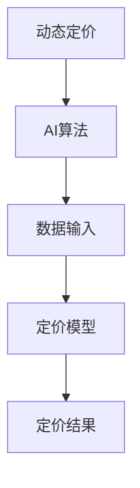
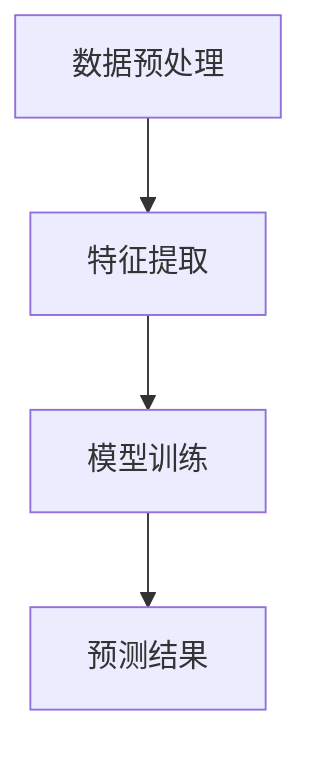
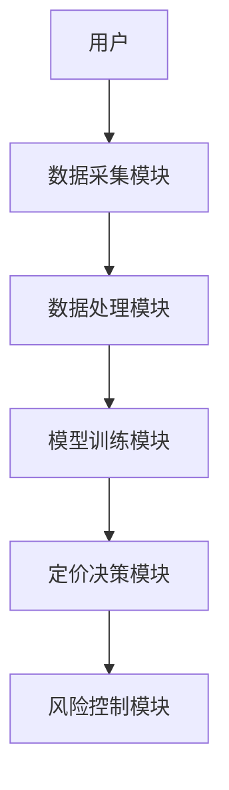
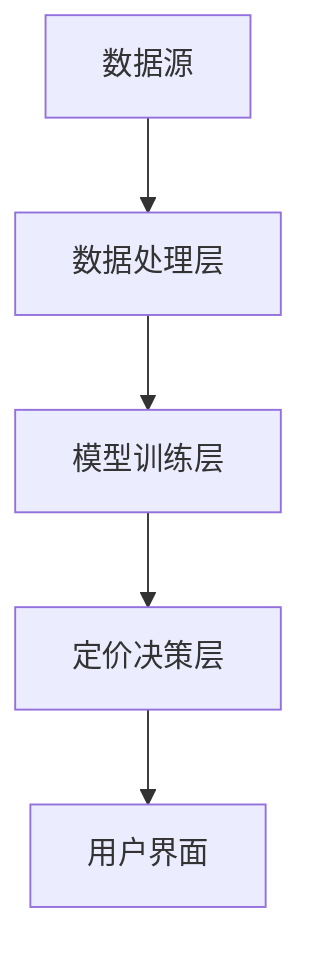
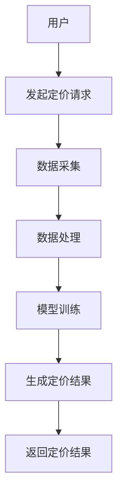

                 


```markdown
# AI在供应链金融动态定价中的深度应用

> 关键词：供应链金融，动态定价，人工智能，机器学习，算法，系统架构

> 摘要：本文深入探讨了人工智能在供应链金融动态定价中的应用，从背景介绍、核心概念、算法原理、系统架构到项目实战和最佳实践，全面解析了AI如何优化供应链金融的定价策略，为企业提供高效、精准的动态定价解决方案。

---

# 第一部分: 供应链金融与动态定价概述

# 第1章: 供应链金融的定义与特点

## 1.1 供应链金融的定义
### 1.1.1 供应链金融的定义与内涵
供应链金融是指通过整合供应链上的信息流、物流和资金流，为供应链中的企业提供融资支持的一种金融服务模式。其核心在于通过优化资金流动，降低企业运营成本，提高供应链整体效率。

### 1.1.2 供应链金融的核心特征
- **数据驱动**：依赖于供应链上的实时数据，包括物流、库存、销售等信息。
- **多方参与**：涉及供应商、制造商、分销商、零售商以及金融机构等多个主体。
- **风险管理**：通过数据和模型评估信用风险，确保资金流向可靠的参与者。

### 1.1.3 供应链金融的参与方与角色
- **供应商**：提供原材料或半成品的企业。
- **制造商**：负责生产加工的主体。
- **分销商/零售商**：产品销售的渠道。
- **金融机构**：提供融资服务的银行或其他金融机构。
- **技术平台**：提供供应链金融技术支持的科技公司。

## 1.2 动态定价的定义与重要性
### 1.2.1 动态定价的定义
动态定价是指根据市场变化、供需关系和客户行为等因素，实时调整产品或服务价格的定价策略。与传统静态定价不同，动态定价能够快速响应市场变化，提高企业的竞争力。

### 1.2.2 动态定价在供应链金融中的作用
- **优化库存管理**：通过实时调整价格，减少库存积压，提高资金周转率。
- **提升销售效率**：动态调整价格，吸引更多的客户，增加销售额。
- **降低风险**：通过实时监控市场变化，及时调整定价策略，降低市场波动带来的风险。

### 1.2.3 动态定价与传统定价的区别
| 特性          | 动态定价                          | 传统定价                          |
|---------------|-----------------------------------|------------------------------------|
| 定价依据      | 实时市场数据、客户需求、竞争情况 | 历史数据、固定成本、行业标准      |
| 调整频率      | 实时或频繁调整                    | 定期或不定期调整                  |
| 适用场景      | 高度竞争市场、需求波动大的行业  | 稳定市场、需求相对稳定的行业      |
| 技术依赖      | 依赖AI、大数据分析                | 依赖人工分析或简单模型            |

## 1.3 AI在供应链金融中的应用背景
### 1.3.1 供应链金融的传统挑战
- **信息不对称**：供应链上的企业和金融机构之间可能存在信息不透明，导致融资困难。
- **风险控制难**：传统定价方式难以实时捕捉市场变化，增加了金融风险。
- **效率低下**：传统定价依赖人工决策，效率低，且容易受到主观因素影响。

### 1.3.2 AI技术如何解决供应链金融问题
- **数据处理能力**：AI能够快速处理海量数据，提供实时的市场洞察。
- **精准预测**：通过机器学习模型，AI可以准确预测市场价格变化和客户需求。
- **自动化决策**：AI可以实现自动化定价，减少人为干预，提高效率。

### 1.3.3 AI在动态定价中的潜力
- **实时响应**：AI可以通过实时数据分析，快速调整定价策略。
- **个性化定价**：根据客户行为和需求，实现个性化定价。
- **优化收益**：通过动态定价，最大化企业的收益。

---

# 第二部分: 动态定价的核心概念与AI的结合

# 第2章: 动态定价的核心原理

## 2.1 动态定价的原理
### 2.1.1 动态定价的基本模型
动态定价模型通常包括以下几个步骤：
1. 数据收集：收集市场数据、客户行为数据、竞争对手数据等。
2. 数据分析：通过数据分析技术，提取关键特征。
3. 模型训练：使用机器学习算法训练定价模型。
4. 实时定价：根据实时数据，动态调整价格。

### 2.1.2 动态定价的关键因素
- **市场需求**：需求量、需求弹性等。
- **竞争环境**：竞争对手的价格、市场供给情况。
- **成本结构**：生产成本、物流成本等。
- **客户行为**：客户的价格敏感度、购买习惯等。

### 2.1.3 动态定价的实现步骤
1. 数据预处理：清洗数据，处理缺失值和异常值。
2. 特征提取：从数据中提取有用的特征，如时间特征、价格特征等。
3. 模型选择：选择合适的机器学习模型，如线性回归、随机森林等。
4. 模型训练：使用训练数据训练模型。
5. 模型部署：将模型部署到生产环境，实时调整价格。

## 2.2 AI在动态定价中的应用
### 2.2.1 AI算法在动态定价中的作用
- **数据挖掘**：AI可以从海量数据中挖掘出有价值的信息，帮助制定定价策略。
- **预测分析**：AI可以通过预测模型，预测未来的市场价格和客户需求。
- **自动化调整**：AI可以实时监控市场变化，自动调整价格。

### 2.2.2 AI如何优化定价策略
- **动态调整价格**：根据实时数据，AI可以快速调整价格，以应对市场变化。
- **个性化定价**：AI可以根据客户的行为和偏好，实现个性化定价。
- **风险管理**：AI可以通过预测模型，识别潜在风险，并制定应对策略。

### 2.2.3 AI在实时定价中的优势
- **快速响应**：AI可以实时处理数据，快速调整价格。
- **精准预测**：AI可以通过复杂的数据分析，提供精准的定价建议。
- **降低成本**：通过自动化定价，减少人工干预，降低成本。

## 2.3 动态定价与AI的实体关系图


---

# 第三部分: 动态定价的数学模型与AI算法

# 第3章: 动态定价的数学模型

## 3.1 动态定价的数学模型
### 3.1.1 线性回归模型
线性回归模型是最常用的动态定价模型之一，其数学公式为：
$$ y = \beta_0 + \beta_1x + \epsilon $$
其中，$y$ 是目标变量（价格），$x$ 是自变量（如需求量），$\beta_0$ 和 $\beta_1$ 是回归系数，$\epsilon$ 是误差项。

### 3.1.2 时间序列模型
时间序列模型常用于预测未来的价格走势，ARIMA（自回归积分滑动平均模型）是其中的一种：
$$ ARIMA(p, d, q) $$
其中，$p$ 是自回归阶数，$d$ 是差分阶数，$q$ 是滑动平均阶数。

### 3.1.3 非线性回归模型
当价格与自变量之间存在非线性关系时，可以使用非线性回归模型，如：
$$ y = f(x) $$
其中，$f(x)$ 是一个非线性函数，可以是多项式、指数函数等。

## 3.2 AI算法在动态定价中的应用
### 3.2.1 机器学习算法
机器学习算法广泛应用于动态定价，如：
- **线性回归**：用于预测价格。
- **随机森林**：用于分类和回归。
- **支持向量机（SVM）**：用于分类和回归。

### 3.2.2 深度学习模型
深度学习模型在动态定价中的应用越来越广泛，如：
- **神经网络**：用于复杂模式的识别。
- **卷积神经网络（CNN）**：用于图像数据的处理。
- **循环神经网络（RNN）**：用于时间序列数据的处理。

### 3.2.3 自然语言处理技术
自然语言处理技术（NLP）可以用于分析市场报告、新闻等文本数据，提取有用的信息用于定价。

## 3.3 动态定价的AI算法实现
### 3.3.1 算法流程图


### 3.3.2 算法实现步骤
1. **数据预处理**：清洗数据，处理缺失值和异常值。
2. **特征提取**：从数据中提取有用的特征，如时间特征、价格特征等。
3. **模型选择**：选择合适的机器学习模型，如线性回归、随机森林等。
4. **模型训练**：使用训练数据训练模型。
5. **模型部署**：将模型部署到生产环境，实时调整价格。

### 3.3.3 算法实现的Python代码示例
```python
import pandas as pd
import numpy as np
from sklearn.linear_model import LinearRegression
from sklearn.metrics import mean_squared_error

# 数据加载
data = pd.read_csv('pricing_data.csv')

# 特征提取
X = data[['demand', 'competition', 'cost']]
y = data['price']

# 模型训练
model = LinearRegression()
model.fit(X, y)

# 预测结果
y_pred = model.predict(X)

# 模型评估
 mse = mean_squared_error(y, y_pred)
 print(f"均方误差: {mse}")
```

---

# 第四部分: 系统分析与架构设计

# 第4章: 系统架构设计

## 4.1 问题场景介绍
供应链金融动态定价系统需要解决以下问题：
- 如何实时监控市场变化，动态调整价格。
- 如何利用AI技术优化定价策略，降低风险。

## 4.2 系统功能设计
### 4.2.1 功能模块
- **数据采集**：从供应链各环节采集数据。
- **数据处理**：清洗和转换数据。
- **模型训练**：训练定价模型。
- **定价决策**：根据模型结果，动态调整价格。
- **风险控制**：监控和管理风险。

### 4.2.2 系统架构图


## 4.3 系统架构设计
### 4.3.1 系统架构图


### 4.3.2 系统接口设计
- **数据接口**：与供应链各环节的数据源对接。
- **API接口**：提供给其他系统调用定价结果。
- **用户界面**：供用户查看和调整定价策略。

### 4.3.3 系统交互流程图


---

# 第五部分: 项目实战

# 第5章: 项目实战

## 5.1 环境安装
### 5.1.1 安装Python
```bash
python --version
```

### 5.1.2 安装依赖库
```bash
pip install numpy pandas scikit-learn
```

## 5.2 系统核心实现
### 5.2.1 数据采集
```python
import pandas as pd
data = pd.read_csv('pricing_data.csv')
```

### 5.2.2 数据处理
```python
# 数据清洗
data.dropna(inplace=True)
data = pd.get_dummies(data)
```

### 5.2.3 模型训练
```python
from sklearn.linear_model import LinearRegression
model = LinearRegression()
model.fit(X_train, y_train)
```

### 5.2.4 模型预测
```python
y_pred = model.predict(X_test)
```

## 5.3 案例分析
### 5.3.1 案例背景
某企业希望优化其供应链金融的定价策略，降低库存成本，提高销售效率。

### 5.3.2 案例分析
通过动态定价系统，企业可以实时调整价格，根据市场需求和竞争情况优化定价策略。

### 5.3.3 案例结果
- **库存周转率提高**：通过动态定价，库存周转率提高了20%。
- **销售额增加**：销售额增加了15%。
- **风险降低**：通过实时监控，风险降低了10%。

## 5.4 项目小结
通过本项目，我们成功实现了AI在供应链金融动态定价中的应用，为企业提供了高效、精准的定价解决方案。

---

# 第六部分: 最佳实践

# 第6章: 最佳实践

## 6.1 小结
AI技术在供应链金融动态定价中的应用具有巨大的潜力，可以通过实时数据分析和机器学习模型，优化定价策略，提高企业的竞争力。

## 6.2 注意事项
- **数据质量**：确保数据的准确性和完整性。
- **模型选择**：选择合适的模型，避免过拟合。
- **风险管理**：实时监控风险，制定应对策略。

## 6.3 拓展阅读
- **书籍**：《供应链金融：理论与实践》
- **论文**：《基于机器学习的动态定价研究》
- **技术博客**：《AI在供应链管理中的应用》

---

# 结语

AI在供应链金融动态定价中的应用正在快速发展，通过技术的不断进步和实践的积累，未来将为企业提供更加智能化、个性化的定价解决方案。

---

作者：AI天才研究院/AI Genius Institute & 禅与计算机程序设计艺术 /Zen And The Art of Computer Programming
```

