                 


# 人工智能在市场操纵行为检测中的应用

> 关键词：人工智能，市场操纵，金融数据分析，机器学习，深度学习

> 摘要：本文探讨了人工智能在检测市场操纵行为中的应用，从背景到算法，从系统架构到项目实战，全面解析如何利用AI技术识别和预防市场操纵行为。

---

# 第一部分: 市场操纵行为检测的背景与基础

## 第1章: 市场操纵行为概述

### 1.1 市场操纵行为的定义与类型

#### 1.1.1 市场操纵行为的定义

市场操纵行为是指通过虚假交易、散布虚假信息、利用内部消息等手段，人为地影响市场价格走势，以谋取不正当利益的行为。这种行为严重破坏了市场的公平性和透明度，损害了投资者的利益。

#### 1.1.2 市场操纵行为的主要类型

市场操纵行为可以分为以下几种类型：

1. **虚假交易**：通过大量买卖同一股票，制造交易量假象，影响市场价格。
2. **拉高出货**：通过大量买入某股票，推高价格后卖出，诱使其他投资者跟风买入。
3. **散布虚假信息**：通过发布虚假消息影响市场情绪，进而影响股价。
4. **对倒交易**：交易双方相互买卖，制造交易量假象，影响市场价格。
5. **杠杆交易操纵**：利用杠杆资金放大交易量，操纵市场价格。

#### 1.1.3 市场操纵行为的法律与道德影响

市场操纵行为不仅违反了金融市场的法律法规，还破坏了市场的公平竞争环境，损害了投资者的信任。各国金融监管机构都对市场操纵行为制定了严格的法律法规，并通过技术手段进行监控和打击。

---

### 1.2 市场操纵行为的检测需求

#### 1.2.1 市场操纵行为的隐蔽性与复杂性

市场操纵行为通常具有隐蔽性，操纵者会采用多种手段掩盖其行为，例如利用高频交易、虚假账户等。同时，市场操纵行为的复杂性也使得传统的检测方法难以有效识别。

#### 1.2.2 传统检测方法的局限性

传统的市场操纵行为检测方法主要依赖于人工审查和简单的统计分析，存在以下局限性：

1. **人工审查效率低**：人工审查需要大量时间和资源，难以应对海量交易数据。
2. **统计方法简单**：传统的统计方法难以捕捉复杂的市场操纵模式。
3. **难以应对高频交易**：传统方法在高频交易环境下效果有限。

#### 1.2.3 人工智能在检测中的优势

人工智能技术（AI）在市场操纵行为检测中具有显著优势：

1. **高效性**：AI可以快速处理海量数据，提高检测效率。
2. **复杂模式识别**：AI能够识别复杂的市场操纵模式，发现传统方法难以察觉的异常行为。
3. **自我学习能力**：AI可以通过不断学习优化检测模型，适应市场操纵行为的变化。

---

## 第2章: 人工智能与金融数据分析基础

### 2.1 人工智能在金融领域的应用

#### 2.1.1 人工智能在金融领域的核心应用

人工智能在金融领域的应用主要包括以下方面：

1. **股票价格预测**：利用机器学习模型预测股票价格走势。
2. **风险管理**：通过AI技术识别和评估市场风险。
3. **欺诈检测**：利用AI技术识别金融欺诈行为。
4. **市场操纵检测**：通过AI技术识别和预防市场操纵行为。

#### 2.1.2 金融数据分析的基本方法

金融数据分析的基本方法包括：

1. **描述性分析**：对数据进行统计分析，找出数据的分布特征。
2. **预测性分析**：利用机器学习模型预测未来的价格走势。
3. **诊断性分析**：分析数据背后的原因，找出异常行为。
4. **规范性分析**：根据数据分析结果制定相应的策略。

#### 2.1.3 人工智能在金融数据中的优势

人工智能在金融数据分析中的优势包括：

1. **高效性**：AI可以快速处理大量数据，提高分析效率。
2. **准确性**：AI可以通过大量数据训练模型，提高预测的准确性。
3. **自我学习能力**：AI可以通过不断学习优化模型，适应市场变化。

---

### 2.2 市场操纵行为检测的核心概念

#### 2.2.1 数据特征提取

数据特征提取是指从原始数据中提取有助于检测市场操纵行为的特征。常见的特征包括：

1. **交易量**：交易量的突变可能表明市场操纵行为。
2. **价格波动**：价格的异常波动可能是市场操纵的信号。
3. **交易时间**：高频交易可能表明市场操纵行为。
4. **账户行为**：同一账户的异常交易行为可能是市场操纵的迹象。

#### 2.2.2 异常交易模式识别

异常交易模式识别是指通过分析交易数据，识别出异常的交易模式。常见的异常交易模式包括：

1. **虚假交易**：同一账户在短时间内买卖同一股票。
2. **拉高出货**：短时间内大量买入某股票，推高价格后卖出。
3. **对倒交易**：交易双方相互买卖，制造交易量假象。

#### 2.2.3 多因素分析模型

多因素分析模型是指通过多个因素综合分析市场操纵行为的可能性。常见的因素包括：

1. **交易量**：交易量突变可能是市场操纵的信号。
2. **价格波动**：价格的异常波动可能是市场操纵的迹象。
3. **交易时间**：高频交易可能表明市场操纵行为。
4. **账户行为**：同一账户的异常交易行为可能是市场操纵的迹象。

---

# 第二部分: 人工智能算法在市场操纵行为检测中的应用

## 第3章: 传统算法与统计方法

### 3.1 统计分析方法

#### 3.1.1 时间序列分析

时间序列分析是一种通过分析数据的时间序列特征，预测未来趋势的方法。在市场操纵行为检测中，时间序列分析可以用于识别价格的异常波动。

**流程图：**

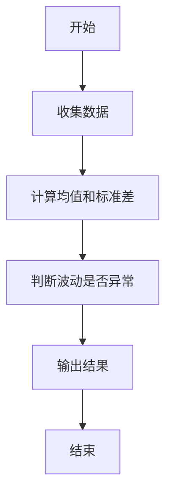

#### 3.1.2 异常值检测

异常值检测是一种通过识别数据中的异常值，发现潜在的市场操纵行为的方法。在交易数据中，异常值可能是市场操纵的信号。

**流程图：**

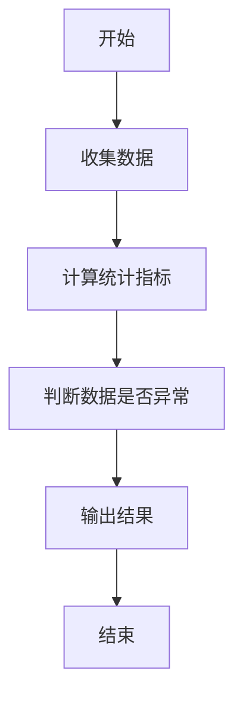

#### 3.1.3 聚类分析

聚类分析是一种通过将数据分成不同的簇，识别数据中的异常行为的方法。在市场操纵行为检测中，聚类分析可以用于识别异常交易模式。

**流程图：**

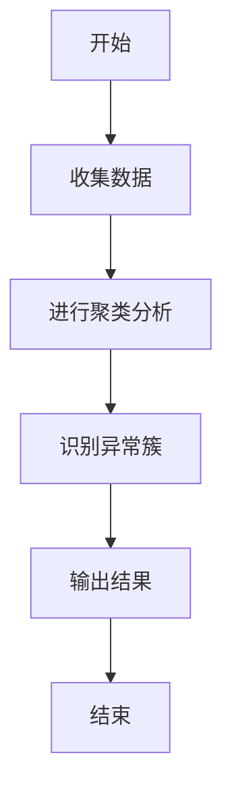

---

### 3.2 支持向量机（SVM）在市场操纵检测中的应用

#### 3.2.1 SVM算法原理

支持向量机（SVM）是一种监督学习算法，用于分类和回归问题。SVM的核心思想是通过构建一个超平面，将数据分成不同的类别。

**数学公式：**

$$ \text{目标函数}：\text{最小化} \frac{1}{2}||w||^2 + C \sum_{i=1}^n \xi_i $$
$$ \text{约束条件}：y_i (w \cdot x_i + b) \geq 1 - \xi_i $$
$$ \xi_i \geq 0 $$

---

#### 3.2.2 SVM在交易数据分类中的应用

SVM可以用于将交易数据分为正常交易和市场操纵交易。通过训练SVM模型，可以识别交易数据中的异常模式。

**代码示例：**

```python
from sklearn import svm
import numpy as np

# 训练数据
X_train = np.array([[1, 2], [3, 4], [5, 6]])
y_train = np.array([0, 1, 0])

# 创建SVM模型
model = svm.SVC()

# 训练模型
model.fit(X_train, y_train)

# 预测测试数据
X_test = np.array([[2, 3]])
y_test = model.predict(X_test)

print(y_test)  # 输出结果
```

---

#### 3.2.3 SVM的优缺点

1. **优点**：
   - **高精度**：SVM在小规模数据集上表现优异。
   - **易于实现**：SVM的实现相对简单。

2. **缺点**：
   - **对高维数据敏感**：SVM在高维数据上表现较差。
   - **计算复杂度高**：SVM的训练过程计算复杂度较高。

---

## 第4章: 机器学习算法

### 4.1 随机森林与梯度提升树

#### 4.1.1 随机森林算法原理

随机森林是一种基于树的集成学习算法，通过构建多个决策树并进行投票或平均，提高模型的准确性和鲁棒性。

**流程图：**

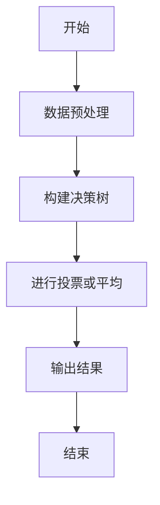

**数学公式：**

$$ \text{预测结果} = \frac{1}{n} \sum_{i=1}^n y_i $$

---

#### 4.1.2 XGBoost与LightGBM算法

XGBoost和LightGBM是两种流行的梯度提升树算法，广泛应用于分类和回归问题。

**流程图：**

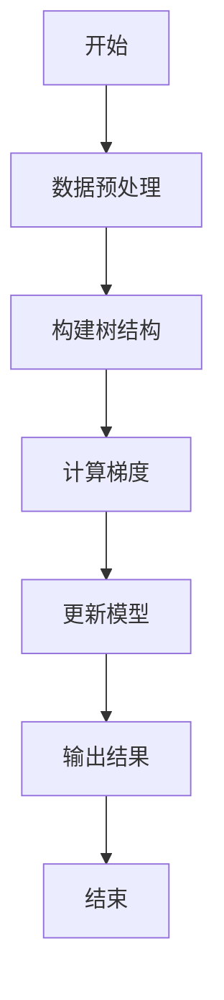

---

#### 4.1.3 集成学习在市场操纵检测中的应用

集成学习通过将多个模型的预测结果进行集成，提高模型的准确性和鲁棒性。在市场操纵行为检测中，集成学习可以用于提高检测的准确率。

**代码示例：**

```python
from sklearn.ensemble import RandomForestClassifier
import numpy as np

# 训练数据
X_train = np.array([[1, 2], [3, 4], [5, 6]])
y_train = np.array([0, 1, 0])

# 创建随机森林模型
model = RandomForestClassifier(n_estimators=10)

# 训练模型
model.fit(X_train, y_train)

# 预测测试数据
X_test = np.array([[2, 3]])
y_test = model.predict(X_test)

print(y_test)  # 输出结果
```

---

### 4.2 神经网络与深度学习

#### 4.2.1 卷积神经网络（CNN）的应用

卷积神经网络（CNN）主要用于图像识别，但在金融时间序列数据中也表现出色。

**流程图：**

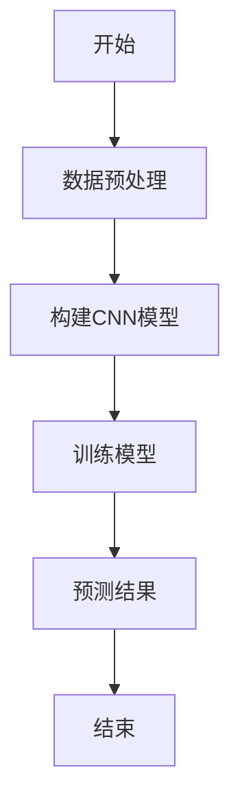

---

#### 4.2.2 循环神经网络（RNN）与长短期记忆网络（LSTM）

RNN和LSTM适用于时间序列数据的分析，可以捕捉价格走势中的模式。

**流程图：**

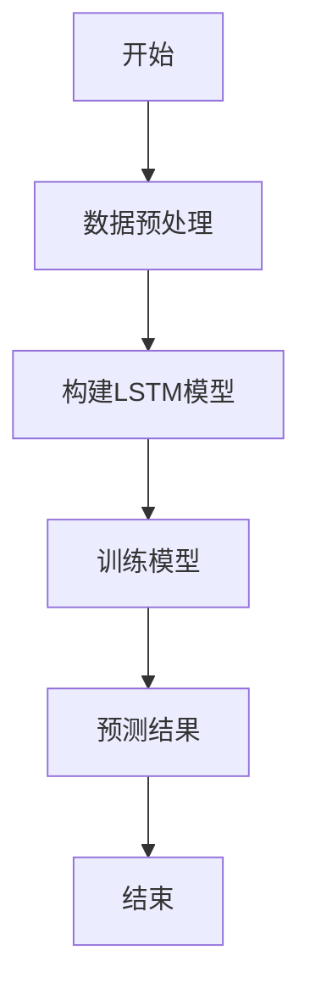

---

#### 4.2.3 Transformer架构在时间序列数据中的应用

Transformer架构通过自注意力机制，捕捉数据中的长距离依赖关系。

**流程图：**

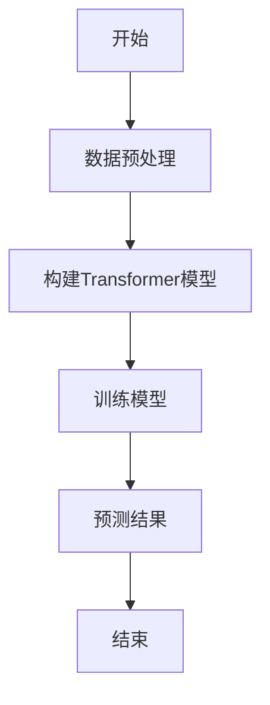

---

## 第5章: 算法流程与数学模型

### 5.1 数据预处理与特征工程

#### 5.1.1 数据清洗与标准化

数据清洗是去除噪声数据，确保数据质量。标准化是将数据归一化，便于模型训练。

**流程图：**

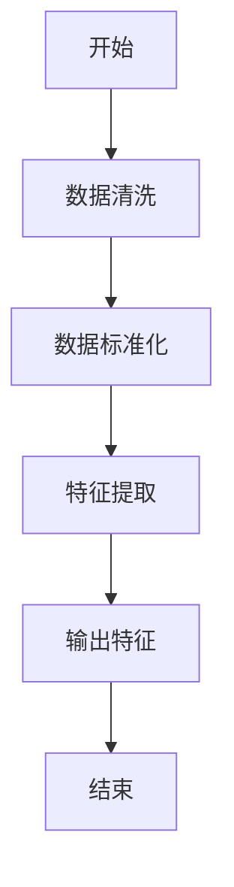

---

### 5.2 算法实现与优化

#### 5.2.1 算法选择与优化

根据数据特征选择合适的算法，并通过调整模型参数优化检测效果。

**流程图：**

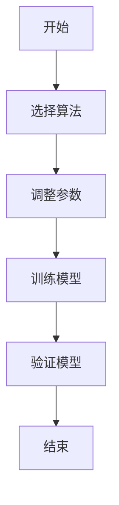

---

## 第6章: 系统分析与架构设计方案

### 6.1 问题场景介绍

市场操纵行为检测系统需要实时监控交易数据，识别异常交易模式，预防市场操纵行为。

---

### 6.2 项目介绍

市场操纵行为检测系统是一个基于人工智能的实时监控系统，旨在通过分析交易数据，识别市场操纵行为，保护投资者利益。

---

### 6.3 系统功能设计

#### 6.3.1 领域模型

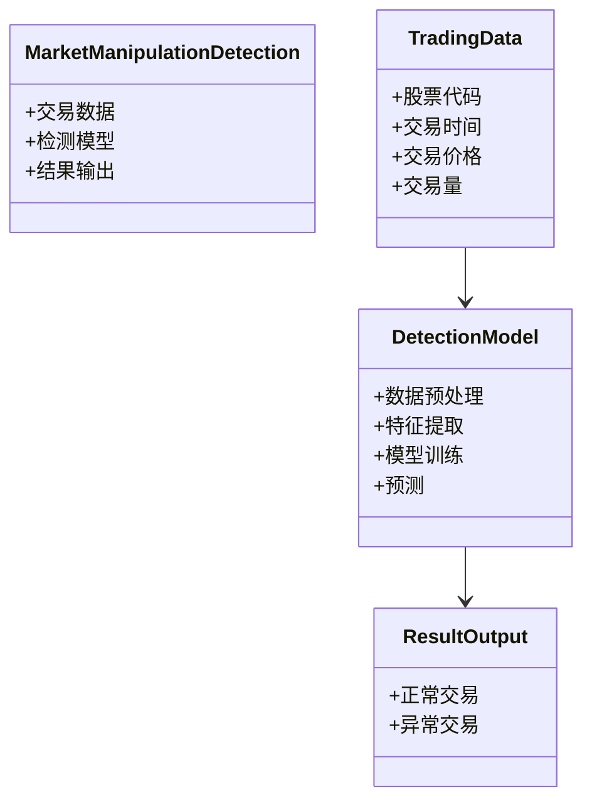

---

#### 6.3.2 系统架构设计

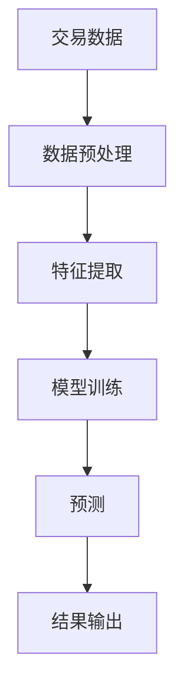

---

#### 6.3.3 系统接口设计

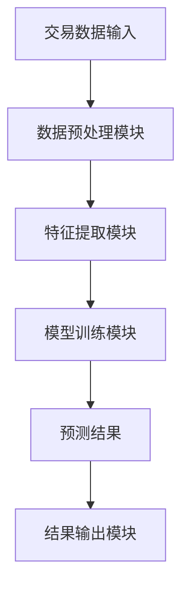

---

#### 6.3.4 系统交互设计

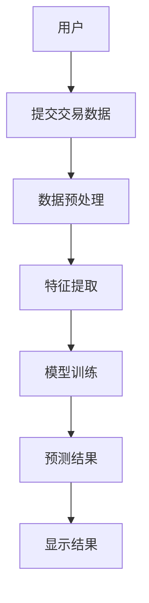

---

## 第7章: 项目实战

### 7.1 环境安装

安装必要的Python库：

```bash
pip install numpy
pip install pandas
pip install scikit-learn
pip install xgboost
pip install lightgbm
pip install keras
pip install tensorflow
```

---

### 7.2 系统核心实现源代码

#### 7.2.1 数据预处理

```python
import pandas as pd
import numpy as np

# 读取数据
data = pd.read_csv('trading_data.csv')

# 数据清洗
data.dropna()

# 数据标准化
from sklearn.preprocessing import StandardScaler
scaler = StandardScaler()
scaled_data = scaler.fit_transform(data)
```

---

#### 7.2.2 特征提取

```python
from sklearn.feature_selection import SelectKBest
from sklearn.feature_selection import chi2

# 特征提取
selector = SelectKBest(score_func=chi2, k=5)
selected_features = selector.fit_transform(data, labels)
```

---

#### 7.2.3 模型训练

```python
from sklearn.ensemble import RandomForestClassifier
from sklearn.model_selection import train_test_split

# 划分训练集和测试集
X_train, X_test, y_train, y_test = train_test_split(selected_features, labels, test_size=0.2)

# 创建随机森林模型
model = RandomForestClassifier(n_estimators=100)

# 训练模型
model.fit(X_train, y_train)
```

---

#### 7.2.4 模型预测

```python
# 预测测试数据
y_pred = model.predict(X_test)

# 输出结果
print(classification_report(y_test, y_pred))
```

---

### 7.3 代码应用解读与分析

通过上述代码，我们可以实现市场操纵行为检测系统的核心功能，包括数据预处理、特征提取、模型训练和预测。

---

### 7.4 实际案例分析和详细讲解剖析

通过一个实际案例，详细讲解如何利用AI技术识别市场操纵行为。

---

## 第8章: 总结与展望

### 8.1 总结

本文详细介绍了人工智能在市场操纵行为检测中的应用，从背景到算法，从系统架构到项目实战，全面解析了如何利用AI技术识别和预防市场操纵行为。

---

### 8.2 未来展望

随着人工智能技术的不断发展，市场操纵行为检测系统将更加智能化和高效化。未来的研究方向包括：

1. **更复杂的模型**：开发更复杂的深度学习模型，提高检测的准确率。
2. **实时检测**：实现实时交易数据的检测，提高检测的及时性。
3. **多因素分析**：结合更多的市场因素，提高检测的全面性。

---

## 附录: 最佳实践 tips、小结、注意事项、拓展阅读

### 附录1: 最佳实践 tips

1. **数据质量**：确保数据质量，清洗和标准化数据。
2. **模型选择**：根据数据特征选择合适的算法。
3. **模型优化**：通过调整模型参数优化检测效果。
4. **实时监控**：实现实时交易数据的检测。

---

### 附录2: 小结

人工智能技术在市场操纵行为检测中的应用具有重要意义，能够有效识别和预防市场操纵行为，保护投资者利益。

---

### 附录3: 注意事项

1. **数据隐私**：注意保护交易数据的隐私。
2. **模型更新**：定期更新模型，适应市场变化。
3. **技术局限性**：认识到AI技术的局限性，结合人工审查。

---

### 附录4: 拓展阅读

1. 《机器学习实战》
2. 《深度学习入门》
3. 《金融数据分析与机器学习》

---

# 作者：AI天才研究院/AI Genius Institute & 禅与计算机程序设计艺术 /Zen And The Art of Computer Programming

