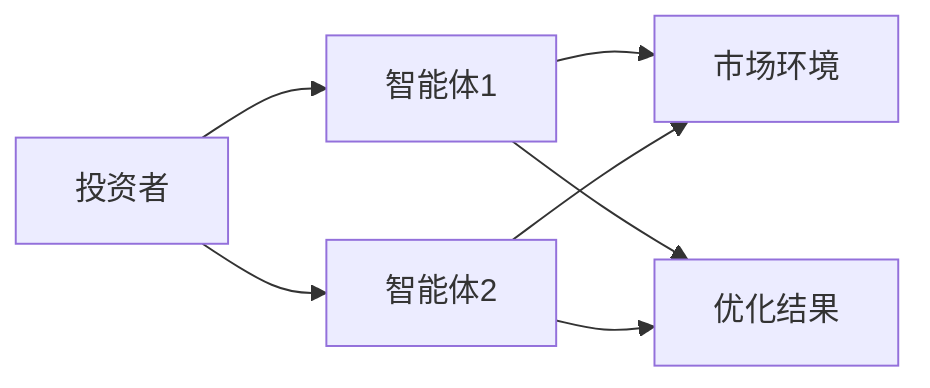
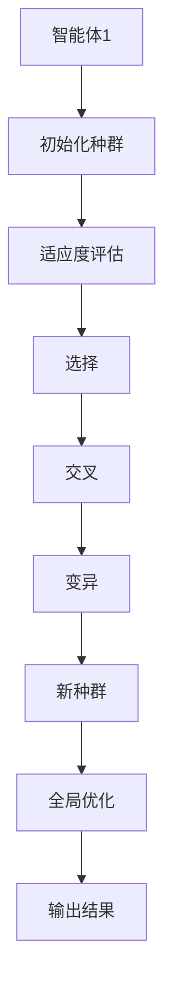
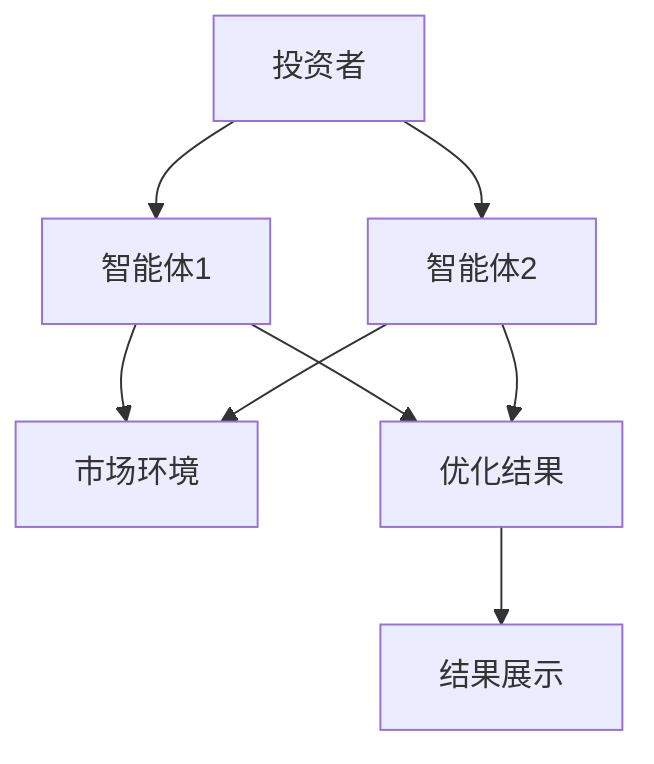
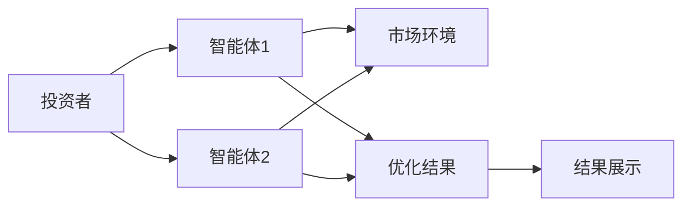
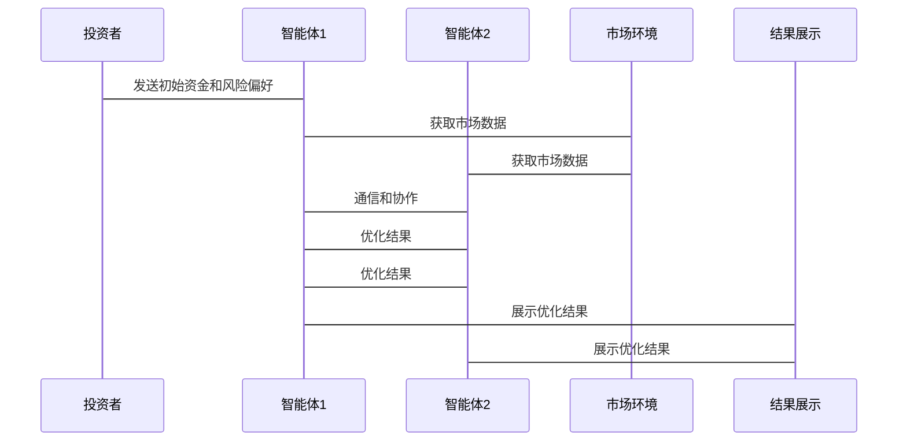

                 


# 使用多智能体系统优化投资组合配置

## 关键词：
- 多智能体系统
- 投资组合配置
- 优化算法
- 系统架构
- 分布式计算

## 摘要：
本文探讨了如何利用多智能体系统（Multi-Agent System, MAS）优化投资组合配置。首先，我们介绍了多智能体系统的基本概念及其在投资组合优化中的应用优势。接着，详细分析了多智能体系统与投资组合配置的核心概念，并通过ER实体关系图展示了系统架构。然后，我们讲解了基于多智能体系统的优化算法，包括分布式遗传算法的实现及其数学模型。随后，通过系统功能设计和架构设计，展示了如何构建一个多智能体投资组合优化系统。最后，通过实际案例分析，验证了该系统的有效性和优势，总结了最佳实践、注意事项和未来研究方向。

---

## 第1章: 多智能体系统与投资组合配置概述

### 1.1 多智能体系统概述
#### 1.1.1 多智能体系统的定义与特点
多智能体系统（MAS）是由多个智能体组成的分布式系统，每个智能体能够感知环境、自主决策并与其他智能体协作。其特点包括分布性、自主性、反应性和协作性。

#### 1.1.2 多智能体系统与传统单智能体系统的区别
- **分布性**：MAS由多个智能体组成，而单智能体系统只有一个决策主体。
- **协作性**：MAS中的智能体之间可以通过通信和协作解决问题，而单智能体系统独立运行。
- **适应性**：MAS能够更好地应对动态变化的环境。

#### 1.1.3 多智能体系统的应用场景
- 投资组合优化
- 自动化交易
- 风险管理

### 1.2 投资组合配置的背景与意义
#### 1.2.1 投资组合配置的定义
投资组合配置是指将资金分配到不同资产或资产类别中，以实现风险和收益的最佳平衡。

#### 1.2.2 投资组合配置的重要性
- 优化风险收益比
- 提高投资回报
- 降低市场波动对投资组合的影响

#### 1.2.3 当前投资组合配置的主要挑战
- 市场环境复杂多变
- 资产类别多样
- 风险偏好个性化

### 1.3 多智能体系统在投资组合优化中的应用前景
#### 1.3.1 多智能体系统在投资组合优化中的优势
- 分布式计算能力强
- 多智能体协作提高优化效率
- 能够应对复杂多变的市场环境

#### 1.3.2 多智能体系统在投资组合优化中的潜在应用场景
- 分散化投资策略
- 动态资产分配
- 风险管理

#### 1.3.3 多智能体系统在投资组合优化中的未来发展趋势
- 智能体间的协同优化
- 结合机器学习的增强优化
- 实时动态优化

---

## 第2章: 多智能体系统与投资组合配置的核心概念

### 2.1 多智能体系统的核心概念
#### 2.1.1 多智能体系统的组成要素
- 智能体（Agent）
- 通信机制
- 协作机制
- 共享知识库

#### 2.1.2 多智能体系统的通信机制
- 消息传递
- 事件驱动
- 基于黑板模型的通信

#### 2.1.3 多智能体系统的协作机制
- 协同规划
- 分层协作
- 分布式决策

### 2.2 投资组合配置的核心概念
#### 2.2.1 投资组合配置的目标函数
- 最大化收益
- 最小化风险
- 满足风险偏好

#### 2.2.2 投资组合配置的约束条件
- 资金分配限制
- 资产类别限制
- 风险承受能力

#### 2.2.3 投资组合配置的优化算法
- 均值-方差优化
- 遗传算法
- 蒙特卡洛模拟

### 2.3 多智能体系统与投资组合配置的结合
#### 2.3.1 多智能体系统在投资组合优化中的角色分工
- 每个智能体负责特定资产类别的优化
- 智能体之间共享市场信息
- 协作制定全局优化策略

#### 2.3.2 多智能体系统与投资组合配置的协同机制
- 智能体间的通信与协作
- 共享市场数据和优化结果
- 分层优化与全局优化的结合

#### 2.3.3 多智能体系统与投资组合配置的系统架构


---

## 第3章: 多智能体系统与投资组合配置的核心概念对比

### 3.1 多智能体系统与投资组合配置的核心概念对比
| 特性                | 多智能体系统                  | 投资组合配置                 |
|---------------------|-----------------------------|-----------------------------|
| 分布性              | 强分布性                     | 弱分布性                     |
| 协作性              | 高                          | 中                          |
| 自主性              | 高                          | 中                          |
| 适应性              | 高                          | 中                          |

### 3.2 多智能体系统与投资组合配置的ER实体关系图
```mermaid
erDiagram
    actor 投资者 {
        <属性> 资金
        <属性> 风险偏好
    }
    actor 资产经理 {
        <属性> 投资策略
        <属性> 资产分配
    }
    actor 市场环境 {
        <属性> 市场波动
        <属性> 经济指标
    }
    entity 多智能体系统 {
        <属性> 智能体角色
        <属性> 智能体目标
        <属性> 智能体协作机制
    }
    entity 投资组合配置 {
        <属性> 资产类别
        <属性> 资产权重
        <属性> 风险收益比
    }
    entity 优化结果 {
        <属性> 最优资产组合
        <属性> 风险最小化
        <属性> 收益最大化
    }
```

---

## 第4章: 多智能体系统优化投资组合配置的算法原理

### 4.1 多智能体系统优化算法概述
#### 4.1.1 多智能体系统优化算法的定义
多智能体系统优化算法是一种基于分布式计算的优化方法，利用多个智能体协同工作，完成全局优化目标。

#### 4.1.2 多智能体系统优化算法的特点
- 分布式计算
- 并行优化
- 协作式搜索

### 4.2 基于多智能体系统的优化算法
#### 4.2.1 分布式遗传算法


#### 4.2.2 分布式遗传算法的实现
```python
class Agent:
    def __init__(self, id):
        self.id = id
        self.population = []
    
    def initialize_population(self, size):
        for _ in range(size):
            self.population.append({'weights': self.random_weights(), 'fitness': 0})
    
    def random_weights(self):
        return [random.uniform(0, 1) for _ in range(3)]
    
    def evaluate_fitness(self, portfolio):
        # 计算投资组合的收益和风险
        return portfolio['weights'].dot(portfolio['returns'])
    
    def evolve_population(self):
        selected = self.select(self.population)
        crossed = self.crossover(selected)
        mutated = self.mutate(crossed)
        return mutated
    
    def select(self, population):
        # 简单选择法
        sorted_pop = sorted(population, key=lambda x: -x['fitness'])
        return sorted_pop[:int(len(population)/2)]
    
    def crossover(self, selected):
        # 单点交叉
        crossed = []
        for i in range(0, len(selected), 2):
            parent1 = selected[i]
            parent2 = selected[i+1]
            crossover_point = random.randint(1, len(parent1['weights'])-1)
            new_weight1 = parent1['weights'][0:crossover_point] + parent2['weights'][crossover_point:]
            new_weight2 = parent2['weights'][0:crossover_point] + parent1['weights'][crossover_point:]
            crossed.append({'weights': new_weight1, 'fitness': 0})
            crossed.append({'weights': new_weight2, 'fitness': 0})
        return crossed
    
    def mutate(self, crossed):
        mutated = []
        for weight in crossed:
            mutation_point = random.randint(0, len(weight['weights'])-1)
            weight['weights'][mutation_point] += random.uniform(-0.1, 0.1)
            mutated.append(weight)
        return mutated
```

### 4.3 投资组合优化的数学模型
投资组合优化的目标是最优化以下目标函数：
$$ \text{目标函数} = \max \left( \sum_{i=1}^n w_i r_i - \lambda \sum_{i=1}^n w_i^2 r_i^2 \right) $$
其中：
- \( w_i \) 是资产 \( i \) 的权重
- \( r_i \) 是资产 \( i \) 的预期收益率
- \( \lambda \) 是风险厌恶系数

### 4.4 分布式遗传算法的实现步骤
1. 初始化多个智能体，每个智能体负责一部分资产的优化。
2. 每个智能体生成初始种群。
3. 智能体之间共享市场数据和优化结果。
4. 每个智能体进行适应度评估和种群进化。
5. 全局优化结果由多个智能体的优化结果综合得出。

---

## 第5章: 系统分析与架构设计

### 5.1 系统功能设计
#### 5.1.1 系统功能模块
- 智能体模块
- 通信模块
- 优化模块
- 结果展示模块

#### 5.1.2 系统功能流程


### 5.2 系统架构设计
#### 5.2.1 系统架构图


#### 5.2.2 系统接口设计
- 智能体间的通信接口
- 与市场环境的数据接口
- 结果展示的接口

#### 5.2.3 系统交互流程图


---

## 第6章: 项目实战

### 6.1 环境安装
- Python 3.8+
- numpy, pandas, matplotlib
- networkx, mermaid

### 6.2 系统核心实现
```python
import numpy as np
import random

class PortfolioOptimizer:
    def __init__(self, assets, risk_free_rate=0.02):
        self.assets = assets
        self.risk_free_rate = risk_free_rate
    
    def calculate_return(self, weights, returns):
        return weights.dot(returns.mean())
    
    def calculate_variance(self, weights, returns):
        return weights.dot(returns.cov()).dot(weights)
    
    def optimize_portfolio(self, risk_tolerance=0.05):
        n = len(self.assets)
        returns = np.array([self.assets[i].return_ for i in range(n)])
        weights = np.array([0.0 for _ in range(n)])
        max_iterations = 100
        for _ in range(max_iterations):
            for i in range(n):
                # 计算每个资产的边际贡献
                marginal_contribution = returns[i] - self.risk_free_rate - 2 * self.risk_tolerance * weights.dot(returns.cov()[:, i])
                if marginal_contribution > 0:
                    weights[i] += 0.1 * marginal_contribution
                else:
                    weights[i] -= 0.1 * (-marginal_contribution)
            # 归一化权重
            weights = weights / np.sum(weights)
        return weights
```

### 6.3 代码应用解读
- 初始化投资组合优化器
- 计算资产的预期收益率和风险
- 使用分布式优化算法优化投资组合权重
- 展示优化结果

### 6.4 案例分析
假设我们有3种资产，A、B、C，预期收益率分别为0.1, 0.15, 0.08，风险分别为0.2, 0.3, 0.1。使用上述代码优化投资组合权重。

### 6.5 项目总结
通过多智能体系统的优化算法，我们能够更高效地优化投资组合配置，实现风险和收益的最佳平衡。

---

## 第7章: 总结与展望

### 7.1 最佳实践
- 合理设计多智能体系统的通信机制
- 确保智能体间的协作效率
- 定期更新优化算法和市场数据

### 7.2 小结
本文详细介绍了如何利用多智能体系统优化投资组合配置，通过分布式计算和协作优化，实现投资组合的高效优化。

### 7.3 注意事项
- 确保系统安全性和稳定性
- 定期更新市场数据和模型
- 考虑智能体间的博弈关系

### 7.4 拓展阅读
- 多智能体系统在金融领域的其他应用
- 更复杂的优化算法，如粒子群优化和模拟退火
- 多智能体系统的安全性与隐私保护

---

## 作者：AI天才研究院/AI Genius Institute & 禅与计算机程序设计艺术 /Zen And The Art of Computer Programming

---

希望这个目录大纲能为您提供清晰的指导，您可以根据需要进一步扩展每一部分的内容。

