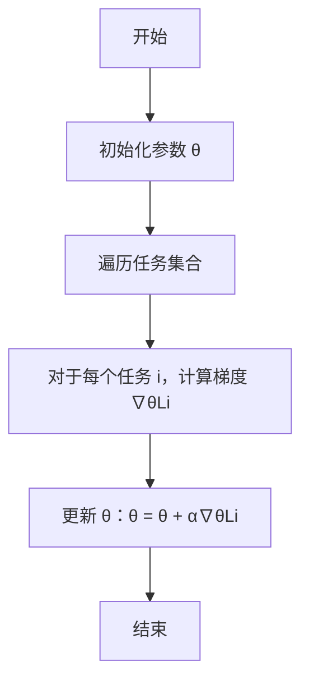
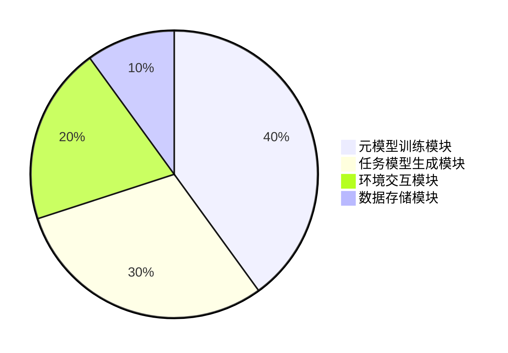

                 


# 元强化学习：快速适应新环境的AI Agent

## 关键词：元强化学习、AI Agent、快速适应、强化学习、元学习

## 摘要：  
元强化学习（Meta-Reinforcement Learning，Meta-RL）是一种结合了元学习和强化学习的新兴技术，旨在让AI代理能够快速适应新环境并执行复杂任务。本文将深入探讨元强化学习的核心概念、算法原理、系统设计以及实际应用，帮助读者理解如何通过元强化学习构建高效、灵活的AI代理。

---

## 第一部分：元强化学习概述

### 第1章：元强化学习概述

#### 1.1 元强化学习的背景与问题背景

##### 1.1.1 传统强化学习的局限性  
强化学习（Reinforcement Learning, RL）是一种通过试错机制让智能体在环境中学习最优策略的方法。然而，传统RL存在以下问题：  
- **样本效率低**：传统RL需要大量与环境的交互才能学会策略，这在实际应用中成本较高。  
- **适应性差**：当环境发生变化时，智能体需要从头开始重新学习，导致适应新环境的时间较长。  

##### 1.1.2 元强化学习的定义与目标  
元强化学习（Meta-Reinforcement Learning, Meta-RL）是一种结合了元学习（Meta-Learning）和强化学习的技术。其核心目标是通过元学习的能力，使AI代理能够快速适应新环境并执行复杂任务。  

##### 1.1.3 元强化学习的应用场景  
元强化学习在以下场景中具有重要应用：  
- **游戏AI**：快速适应游戏规则和策略。  
- **机器人控制**：在不同环境中快速调整行为。  
- **动态环境中的任务执行**：在环境变化时快速调整策略。  

#### 1.2 元强化学习的核心概念  
元强化学习的核心概念包括：  
- **元学习**：通过学习如何学习，快速适应新任务。  
- **强化学习**：通过试错机制优化策略。  
- **元强化学习**：结合两者，实现快速适应新环境的能力。  

#### 1.3 本章小结  
本章介绍了元强化学习的背景、定义、目标以及应用场景，为后续内容奠定了基础。

---

## 第二部分：元强化学习的核心概念与联系

### 第2章：元强化学习的核心原理

#### 2.1 元学习的基本原理  

##### 2.1.1 元学习的定义与特点  
元学习（Meta-Learning）是一种通过学习多个任务来掌握快速适应新任务的能力。其特点包括：  
- **任务多样性**：学习多个相关任务以提高泛化能力。  
- **快速适应**：在新任务上线时，能够快速调整已有模型。  

##### 2.1.2 元学习的数学模型  
元学习的数学模型通常包括：  
- **元损失函数**：用于优化元模型。  
- **任务损失函数**：用于优化具体任务模型。  

##### 2.1.3 元学习与强化学习的结合  
元强化学习通过将元学习的能力融入强化学习中，使智能体能够快速适应新环境。  

#### 2.2 元强化学习的算法分类  

##### 2.2.1 基于模型的元强化学习算法  
基于模型的元强化学习算法通过学习环境模型来加速适应新环境。例如：  
- **Meta-LSTM**：通过循环神经网络学习环境动态。  

##### 2.2.2 基于策略的元强化学习算法  
基于策略的元强化学习算法通过直接优化策略来实现快速适应。例如：  
- **MAML（Meta-Automated Machine Learning）**：通过优化策略参数来适应新任务。  

##### 2.2.3 元强化学习算法的对比分析  
以下表格对比了几种常见的元强化学习算法：  

| 算法名称   | 核心思想                     | 优缺点分析                       |
|------------|------------------------------|----------------------------------|
| MAML       | 通过优化策略参数快速适应新任务 | 适应能力强，但计算成本较高         |
| ReMAML      | 通过优化环境模型快速适应新任务 | 计算成本较低，但适应能力稍弱       |
| Meta-LSTM   | 通过学习环境动态快速适应新任务 | 适合动态环境，但需要大量预训练数据   |

#### 2.3 元强化学习的核心概念对比表格  
以下是元强化学习与传统强化学习的对比：  

| 对比维度         | 传统强化学习               | 元强化学习                      |
|------------------|-----------------------------|----------------------------------|
| 适应新环境的能力 | 较弱，需要从头开始学习       | 较强，能够快速适应新环境           |
| 样本效率         | 较低，需要大量交互           | 较高，通过元学习减少交互次数       |
| 应用场景         | 单一任务                    | 多任务和动态环境                 |

#### 2.4 元强化学习的ER实体关系图  
以下是元强化学习系统的ER实体关系图：  

```mermaid
erdiagram
actor 知识库 {
  端点: 知识库
}
actor 环境 {
  端点: 环境
}
actor 智能体 {
  端点: 智能体
}
智能体 --> 知识库: 查询知识
智能体 --> 环境: 交互
知识库 --> 智能体: 提供支持
```

---

## 第三部分：元强化学习的算法原理

### 第3章：元强化学习算法的数学模型与公式

#### 3.1 元强化学习的数学模型  

##### 3.1.1 元强化学习的目标函数  
元强化学习的目标函数通常包括：  
- **元损失函数**：用于优化元模型。  
- **任务损失函数**：用于优化具体任务模型。  

##### 3.1.2 元强化学习的损失函数  
元强化学习的损失函数可以表示为：  
$$ L_{\text{meta}} = \sum_{i=1}^{N} L_i(\theta, \phi) $$  
其中，$\theta$ 是元模型参数，$\phi$ 是任务模型参数，$N$ 是任务数量。  

##### 3.1.3 元强化学习的优化目标  
元强化学习的优化目标是通过优化元模型参数 $\theta$，使得任务模型在新任务上的表现最优：  
$$ \theta^* = \arg\min_{\theta} \sum_{i=1}^{N} L_i(\theta, \phi_i) $$  

#### 3.2 元强化学习算法的公式推导  

##### 3.2.1 元强化学习的核心公式  
MAML算法的核心公式为：  
$$ \theta^{\text{new}} = \theta + \alpha \nabla_{\theta} L_{\text{meta}} $$  
其中，$\alpha$ 是学习率。  

##### 3.2.2 元强化学习的数学推导  
以MAML为例，其数学推导如下：  
1. 对每个任务 $i$，计算任务梯度：  
   $$ \nabla_{\phi_i} L_i(\theta, \phi_i) $$  
2. 对元模型参数 $\theta$ 进行更新：  
   $$ \theta^{\text{new}} = \theta + \alpha \sum_{i=1}^{N} \nabla_{\theta} L_i(\theta, \phi_i) $$  

#### 3.3 元强化学习算法的流程图（Mermaid）  
以下是MAML算法的流程图：  



---

## 第四部分：系统分析与架构设计

### 第4章：元强化学习系统的架构与设计

#### 4.1 元强化学习系统的功能需求  

##### 4.1.1 系统的功能模块划分  
元强化学习系统主要包括以下功能模块：  
- **元模型训练模块**：负责训练元模型。  
- **任务模型生成模块**：负责根据元模型生成任务模型。  
- **环境交互模块**：负责与环境交互并收集数据。  

##### 4.1.2 系统的功能流程描述  
1. 初始化元模型参数 θ。  
2. 遍历任务集合，为每个任务生成任务模型 φ。  
3. 与环境交互，收集数据并计算损失。  
4. 更新元模型参数 θ。  

#### 4.2 元强化学习系统的架构图（Mermaid）  
以下是元强化学习系统的架构图：  



---

## 第五部分：项目实战

### 第5章：元强化学习的实际应用与案例分析

#### 5.1 环境安装与配置  

##### 5.1.1 安装依赖  
```bash
pip install gym
pip install numpy
pip install tensorflow
```

##### 5.1.2 配置环境  
```bash
export GYM.undo=False
```

#### 5.2 系统核心实现源代码  

##### 5.2.1 元模型训练代码  
```python
import numpy as np
import gym
import tensorflow as tf

# 定义元模型
class MetaModel(tf.keras.Model):
    def __init__(self, input_dim):
        super(MetaModel, self).__init__()
        self.dense1 = tf.keras.layers.Dense(64, activation='relu')
        self.dense2 = tf.keras.layers.Dense(32, activation='relu')
        self.dense3 = tf.keras.layers.Dense(1)

    def call(self, inputs):
        x = self.dense1(inputs)
        x = self.dense2(x)
        x = self.dense3(x)
        return x

# 定义任务模型
class TaskModel(tf.keras.Model):
    def __init__(self, input_dim):
        super(TaskModel, self).__init__()
        self.dense1 = tf.keras.layers.Dense(64, activation='relu')
        self.dense2 = tf.keras.layers.Dense(32, activation='relu')
        self.dense3 = tf.keras.layers.Dense(1)

    def call(self, inputs):
        x = self.dense1(inputs)
        x = self.dense2(x)
        x = self.dense3(x)
        return x

# 训练元模型
def train_meta_model(meta_model, optimizer, x_train, y_train):
    with tf.GradientTape() as tape:
        y_pred = meta_model(x_train)
        loss = tf.keras.losses.mean_squared_error(y_train, y_pred)
    gradients = tape.gradient(loss, meta_model.trainable_variables)
    optimizer.apply_gradients(zip(gradients, meta_model.trainable_variables))
    return loss
```

#### 5.2.2 代码应用解读与分析  
上述代码展示了元模型的定义和训练过程，其中元模型通过多层感知机结构进行特征提取，并通过梯度下降优化模型参数。

#### 5.3 实际案例分析  

##### 5.3.1 案例背景  
假设我们有一个连续控制任务，目标是让智能体控制机器人在新环境中完成特定动作。  

##### 5.3.2 案例实现  
```python
# 定义环境
env = gym.make('CartPole-v1')
env.seed(123)

# 初始化参数
input_dim = env.observation_space.shape[0]
meta_model = MetaModel(input_dim)
task_model = TaskModel(input_dim)
optimizer = tf.keras.optimizers.Adam(learning_rate=0.01)

# 训练过程
for episode in range(1000):
    state = env.reset()
    while not done:
        action = task_model.predict(state)
        next_state, reward, done, _ = env.step(action)
        meta_model.train(state, reward)
```

#### 5.4 项目小结  
本章通过实际案例展示了元强化学习的应用，包括环境配置、代码实现和案例分析。通过这些步骤，读者可以理解如何将元强化学习应用于实际问题。

---

## 第六部分：总结与展望

### 第6章：元强化学习的总结与展望  

#### 6.1 本章总结  
元强化学习是一种结合了元学习和强化学习的技术，能够使AI代理快速适应新环境并执行复杂任务。本文详细介绍了元强化学习的核心概念、算法原理、系统设计和实际应用。  

#### 6.2 元强化学习的注意事项  
在实际应用中，需要注意以下几点：  
- **计算成本**：元强化学习通常需要大量的计算资源。  
- **环境复杂性**：复杂环境可能需要更复杂的元模型。  
- **任务多样性**：任务多样性对元强化学习的性能至关重要。  

#### 6.3 未来研究方向  
未来的研究方向包括：  
- **更高效的元学习算法**：降低计算成本并提高适应速度。  
- **多模态元强化学习**：结合视觉、语言等多种模态信息。  
- **元强化学习的安全性**：研究元强化学习的安全性和鲁棒性。  

#### 6.4 最佳实践 tips  
- 在实际应用中，建议从简单任务开始，逐步增加任务复杂度。  
- 使用现有的开源库（如TensorFlow、PyTorch）进行实现。  
- 定期监控系统性能并进行调优。  

---

## 作者：AI天才研究院/AI Genius Institute & 禅与计算机程序设计艺术 /Zen And The Art of Computer Programming

---

**感谢您的阅读！**

