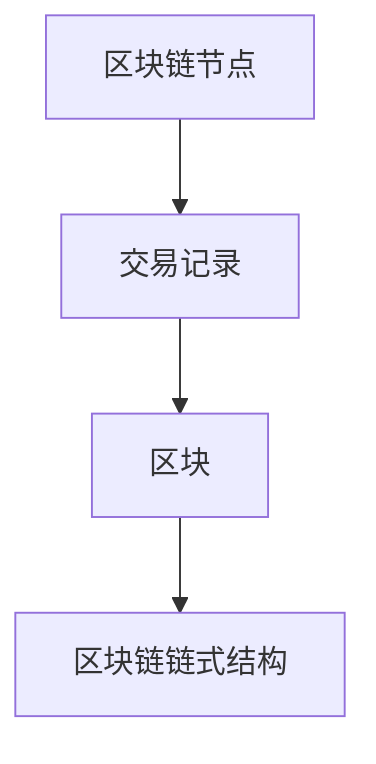
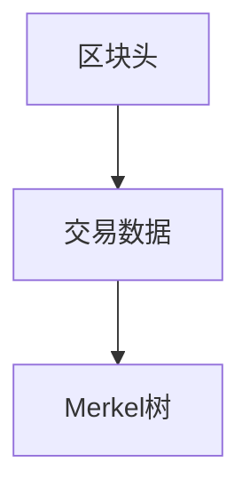
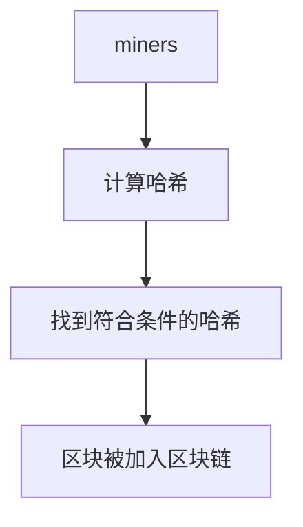
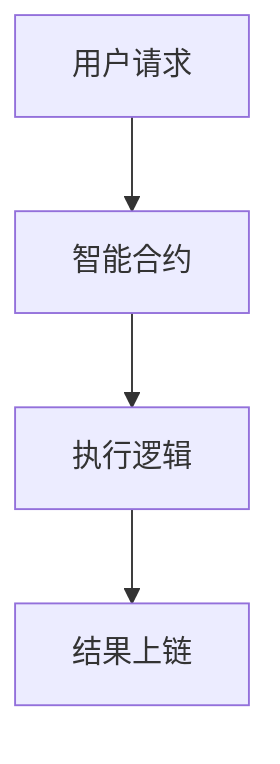
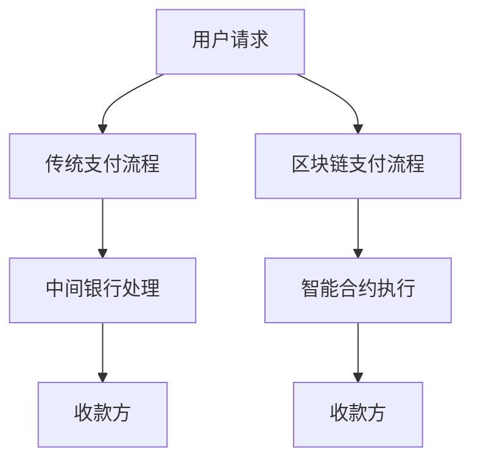
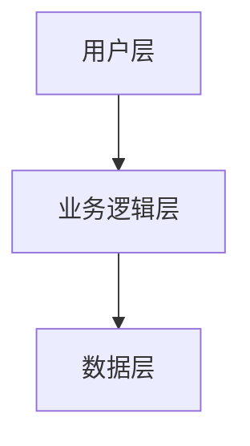
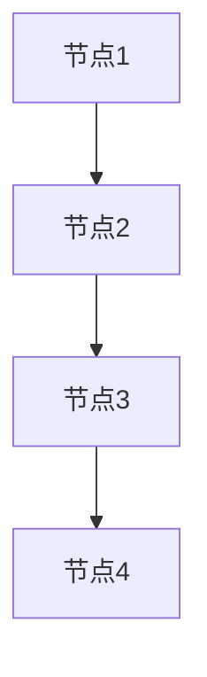
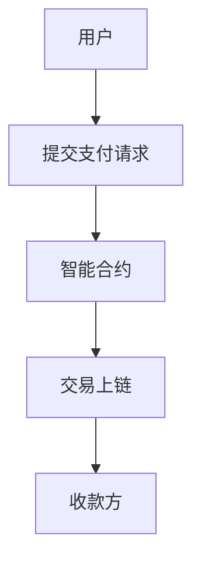
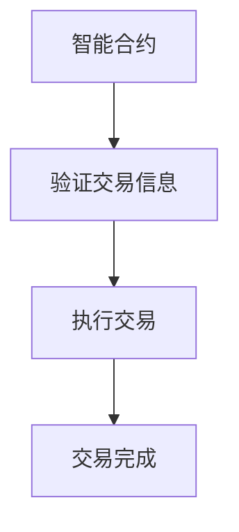
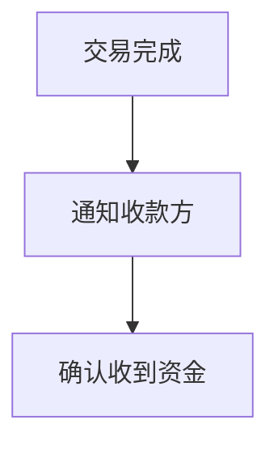

                 


# 区块链在跨境支付中的应用与挑战

> 关键词：区块链，跨境支付，分布式账本，智能合约，共识机制，跨境汇款，支付效率，支付成本，监管合规，去中心化

> 摘要：本文深入探讨了区块链技术在跨境支付中的应用与挑战。首先，我们介绍了区块链的基本概念及其在金融领域的潜力，分析了传统跨境支付的痛点，如高成本、低效率和复杂的监管问题。接着，我们详细阐述了区块链技术的核心原理，包括分布式账本、共识机制和智能合约等。然后，我们探讨了区块链在跨境支付中的应用场景，如优化支付流程、提高透明性和可追溯性。随后，我们分析了区块链跨境支付面临的挑战，如可扩展性、监管合规性和能源消耗问题，并提出了相应的解决方案。最后，我们从系统架构与设计的角度，详细讲解了区块链跨境支付系统的实现方案，包括功能设计、架构设计和接口设计等。本文通过理论与实践相结合的方式，为读者提供了全面的视角，帮助理解区块链在跨境支付中的潜力与实际应用。

---

# 第一部分: 区块链在跨境支付中的应用与挑战

---

# 第1章: 区块链与跨境支付概述

## 1.1 区块链的基本概念

### 1.1.1 区块链的定义与核心特点

区块链是一种去中心化的分布式账本技术，通过密码学和共识机制确保数据的安全性和一致性。其核心特点包括：

- **去中心化**：无需依赖中心机构，数据分布在网络中的多个节点上。
- **不可篡改**：数据一旦写入区块链，无法被修改或删除。
- **透明性**：所有交易记录在区块链上公开透明，可追溯。
- **去信任化**：通过技术手段实现信任，无需依赖第三方机构。

**图1-1：区块链的基本架构**



### 1.1.2 区块链的分类与应用场景

区块链主要分为公链、私链和联盟链三种类型：

- **公链**：完全去中心化的区块链，如比特币、以太坊。
- **私链**：仅限于特定组织或个人使用的区块链。
- **联盟链**：由多个机构共同维护的区块链，常用于企业级应用。

区块链在金融领域的典型应用包括跨境支付、供应链金融、智能合约等。

### 1.1.3 区块链在金融领域的潜力

区块链技术能够降低金融交易的成本，提高效率，增强透明度。在跨境支付中，区块链可以实现实时到账、降低手续费，并减少汇率损失。

---

## 1.2 跨境支付的现状与问题

### 1.2.1 跨境支付的传统模式与痛点

传统跨境支付流程复杂，涉及多个中间银行，导致支付成本高、时间长。具体痛点如下：

- **高成本**：每笔交易的手续费较高，尤其是小额交易。
- **低效率**：跨行转账需要多个机构协同，耗时较长。
- **复杂性**：涉及不同国家的货币、汇率和监管政策。

### 1.2.2 跨境支付的成本与效率分析

传统跨境支付的平均成本为交易金额的3-5%，而区块链技术可以将成本降低至1%以下。此外，传统支付的平均时间为2-3天，而区块链支付可以实现实时到账。

### 1.2.3 跨境支付的监管挑战

跨境支付涉及反洗钱（AML）、反恐融资（CFT）等监管要求，传统模式中难以追踪资金流向。区块链技术通过可追溯性，为监管机构提供了便利。

---

## 1.3 区块链技术如何解决跨境支付问题

### 1.3.1 区块链在跨境支付中的优势

- **去中心化**：减少对中间银行的依赖，降低成本。
- **实时到账**：区块链支持点对点支付，实现资金实时到账。
- **透明性**：所有交易记录可追溯，便于监管。
- **自动化**：智能合约自动执行支付指令，减少人为干预。

### 1.3.2 区块链如何提高支付效率

通过去中心化和自动化处理，区块链可以减少支付环节中的冗余流程，提高支付效率。例如，智能合约可以在收到支付指令后自动执行，无需人工审核。

### 1.3.3 区块链如何降低支付成本

区块链通过减少中间机构和自动化处理，大幅降低了支付成本。例如，传统的跨境支付手续费为交易金额的3-5%，而区块链支付的手续费通常为0.1%至1%。

---

## 1.4 本章小结

本章介绍了区块链的基本概念及其在金融领域的潜力，分析了传统跨境支付的痛点，并探讨了区块链技术如何解决这些问题。通过去中心化、透明性和自动化等特点，区块链为跨境支付提供了更高效、更低成本的解决方案。

---

# 第2章: 区块链技术原理

## 2.1 区块链的核心组件

### 2.1.1 区块链的区块结构

区块链由多个区块组成，每个区块包含以下内容：

- **交易数据**：记录的交易信息。
- **区块头**：包含当前区块的哈希值、时间戳、前一区块的哈希值等。
- ** Merkel树**：用于验证交易数据的完整性。

**图2-1：区块结构示意图**



### 2.1.2 区块链的共识机制

共识机制是区块链的核心技术之一，用于确保所有节点达成一致。常见的共识机制包括：

- **工作量证明（PoW）**：比特币采用的共识机制，通过计算哈希值来验证区块。
- **权益证明（PoS）**：以太坊2.0采用的共识机制，通过质押代币来获得记账权。
- **拜占庭容错（BFT）**：适用于联盟链的共识机制，通过投票方式达成共识。

### 2.1.3 区块链的分布式账本

分布式账本是区块链的核心数据结构，每个节点都有一份完整的账本副本。通过共识机制确保账本的一致性。

---

## 2.2 共识机制的种类与特点

### 2.2.1 工作量证明（PoW）

PoW通过计算哈希值来验证区块，确保网络安全。优点是安全性高，缺点是能源消耗大。

**图2-2：工作量证明流程**



### 2.2.2 权益证明（PoS）

PoS通过质押代币来获得记账权，减少能源消耗。优点是环保，缺点是安全性较低。

### 2.2.3 拜占庭容错（BFT）

BFT适用于联盟链，通过投票方式达成共识。优点是效率高，缺点是依赖节点的信用。

---

## 2.3 智能合约的原理与应用

### 2.3.1 智能合约的定义与特点

智能合约是区块链上的自动执行程序，用于自动执行合同条款。其特点包括：

- **自动化**：智能合约自动执行，无需人工干预。
- **不可篡改**：智能合约代码一旦部署，无法修改。
- **透明性**：智能合约代码公开透明。

### 2.3.2 智能合约的执行流程

1. 用户提交交易请求。
2. 智能合约根据预设逻辑自动执行。
3. 执行结果记录在区块链上。

**图2-3：智能合约执行流程**



### 2.3.3 智能合约在跨境支付中的应用

智能合约可以用于自动执行支付指令，例如在收到付款后自动释放资金给收款方。

---

## 2.4 区块链的安全性与隐私保护

### 2.4.1 区块链的安全威胁

区块链面临的主要安全威胁包括：

- **51%攻击**：恶意节点控制超过50%的算力，破坏区块链的安全性。
- **智能合约漏洞**：智能合约代码漏洞可能导致资金损失。
- **私钥泄露**：私钥泄露可能导致资金被盗。

### 2.4.2 隐私保护技术

区块链可以通过以下技术保护隐私：

- **零知识证明**：证明交易信息的存在性，而不泄露具体信息。
- **同态加密**：对数据进行加密后在区块链上进行计算，确保数据隐私。

### 2.4.3 零知识证明的应用

零知识证明可以用于验证交易信息的真实性，而不泄露具体信息。例如，用户可以证明自己拥有足够的余额，而不必透露具体的账户余额。

---

## 2.5 本章小结

本章详细讲解了区块链的核心组件，包括区块结构、共识机制和智能合约。同时，分析了区块链的安全性与隐私保护技术，为后续章节的应用分析奠定了基础。

---

# 第3章: 区块链在跨境支付中的应用场景

## 3.1 跨境支付的流程优化

### 3.1.1 跨境支付的传统流程

传统跨境支付流程包括以下步骤：

1. 用户提交支付请求。
2. 中间银行审核交易。
3. 资金通过多个银行系统转账。
4. 收款方收到资金。

### 3.1.2 区块链优化后的支付流程

区块链优化后的支付流程包括以下步骤：

1. 用户提交支付请求。
2. 智能合约自动执行交易。
3. 区块链网络确认交易。
4. 收款方收到资金。

**图3-1：传统支付流程 vs 区块链支付流程**



### 3.1.3 流程优化的具体步骤

1. 用户提交支付请求，区块链网络自动处理交易。
2. 智能合约验证交易信息，确保交易合法。
3. 区块链网络确认交易，资金实时到账。

---

## 3.2 跨境支付中的多方参与方

### 3.2.1 支付发起方

支付发起方是用户，提交支付请求。

### 3.2.2 中间银行

传统跨境支付中需要多个中间银行，而区块链支付中可以省去这一环节。

### 3.2.3 收款方

收款方是最终的资金接收方。

---

## 3.3 跨境支付中的智能合约应用

### 3.3.1 智能合约在支付确认中的作用

智能合约可以自动验证交易信息，确保支付合法。

### 3.3.2 智能合约的自动执行机制

智能合约可以根据预设逻辑自动执行交易，减少人为干预。

### 3.3.3 智能合约的安全性保障

智能合约代码需要经过严格审核，确保其安全性和正确性。

---

## 3.4 跨境支付的透明性与可追溯性

### 3.4.1 区块链的透明性特点

所有交易记录在区块链上公开透明，可随时查询。

### 3.4.2 区块链的可追溯性优势

区块链的可追溯性可以帮助监管机构追踪资金流向，防止洗钱等非法活动。

### 3.4.3 透明性对监管的意义

透明性有助于监管机构更好地监督跨境支付，确保合规性。

---

## 3.5 本章小结

本章通过实际案例分析，探讨了区块链在跨境支付中的应用场景，包括流程优化、智能合约应用和透明性与可追溯性等方面。通过区块链技术，跨境支付可以实现更高效、更安全的交易。

---

# 第4章: 区块链跨境支付的挑战与解决方案

## 4.1 区块链技术的挑战

### 4.1.1 区块链的可扩展性问题

区块链的可扩展性是制约其大规模应用的主要问题。目前，比特币和以太坊的交易吞吐量较低。

### 4.1.2 跨境支付的高并发需求

跨境支付通常需要处理大量的交易请求，对区块链的性能提出了更高要求。

### 4.1.3 区块链的能源消耗问题

PoW共识机制需要大量的计算资源，导致能源消耗巨大。

---

## 4.2 跨境支付的监管与合规挑战

### 4.2.1 跨境支付的监管框架

各国对跨境支付的监管政策不同，区块链技术需要满足不同国家的监管要求。

### 4.2.2 区块链技术与监管的冲突

区块链的去中心化特性与传统的监管模式存在冲突。

### 4.2.3 如何实现合规性

区块链企业需要与监管机构合作，设计符合监管要求的解决方案。

---

## 4.3 区块链跨境支付的解决方案

### 4.3.1 提高区块链的可扩展性

通过侧链、分片等技术提高区块链的交易吞吐量。

### 4.3.2 优化共识机制

采用更高效的共识机制，如PoS和BFT，减少能源消耗。

### 4.3.3 解决监管合规问题

与监管机构合作，设计合规的区块链解决方案，如KYC（了解你的客户）和AML（反洗钱）机制。

---

## 4.4 本章小结

本章分析了区块链在跨境支付中面临的挑战，并提出了相应的解决方案。通过技术优化和监管合作，区块链可以更好地应用于跨境支付。

---

# 第5章: 区块链跨境支付的系统架构与设计

## 5.1 系统功能设计

### 5.1.1 用户身份认证

用户需要通过身份认证才能进行支付操作。

### 5.1.2 支付请求发起

用户提交支付请求，系统生成交易记录。

### 5.1.3 智能合约执行

智能合约自动执行交易，确保支付合法。

### 5.1.4 支付确认与通知

支付完成后，系统通知收款方。

---

## 5.2 系统架构设计

### 5.2.1 分层架构设计

系统采用分层架构，包括用户层、业务逻辑层和数据层。

**图5-1：系统架构设计**



### 5.2.2 节点分布与通信

区块链网络中的节点分布在全球各地，通过P2P网络进行通信。

**图5-2：节点分布与通信**



### 5.2.3 数据存储与管理

数据存储在区块链上，每个节点都有一份完整的账本副本。

---

## 5.3 系统接口设计

### 5.3.1 API接口定义

系统提供以下API接口：

- `submitTransaction`：提交交易请求。
- `getTransactionStatus`：查询交易状态。
- `verifyTransaction`：验证交易信息。

### 5.3.2 接口调用流程

1. 用户调用`submitTransaction`接口提交支付请求。
2. 系统生成交易记录，并调用智能合约。
3. 智能合约执行交易，并返回交易状态。
4. 用户调用`getTransactionStatus`接口查询交易状态。

### 5.3.3 接口安全设计

接口采用加密通信和身份认证，确保数据安全。

---

## 5.4 系统交互流程图

### 5.4.1 用户发起支付请求

**图5-3：用户发起支付请求**



### 5.4.2 智能合约执行

**图5-4：智能合约执行**



### 5.4.3 支付确认

**图5-5：支付确认**



---

## 5.5 本章小结

本章从系统架构与设计的角度，详细讲解了区块链跨境支付系统的实现方案，包括功能设计、架构设计和接口设计等。通过图表和流程图，展示了系统的交互过程。

---

# 第6章: 项目实战

## 6.1 环境安装

### 6.1.1 安装区块链开发环境

安装以太坊开发环境，包括Geth、Solidity编译器等。

### 6.1.2 安装智能合约开发工具

安装Remix、MetaMask等智能合约开发工具。

---

## 6.2 系统核心实现源代码

### 6.2.1 智能合约实现

```solidity
// SPDX-License-Identifier: MIT
pragma solidity ^0.8.0;

contract CrossBorderPayment {
    mapping(address => uint256) public balances;

    function deposit() payable public returns (bool) {
        balances[msg.sender] += msg.value;
        return true;
    }

    function withdraw(address payable receiver, uint256 amount) public {
        require(balances[msg.sender] >= amount, "Insufficient balance");
        balances[msg.sender] -= amount;
        receiver.transfer(amount);
    }

    function getBalance(address addr) public view returns (uint256) {
        return balances[addr];
    }
}
```

### 6.2.2 后端接口实现

```python
from web3 import Web3
from eth_account import Account
import json

# 初始化Web3实例
web3 = Web3(Web3.HTTPProvider("http://localhost:8545"))

# 加载智能合约ABI
with open("cross_border_payment_abi.json") as f:
    abi = json.load(f)

# 创建智能合约实例
contract = web3.eth.contract(address="0xYourContractAddress", abi=abi)

# 提交支付请求
def submit_transaction(sender, receiver, amount):
    try:
        # 转账操作
        transaction = contract.functions.transfer(receiver, amount).buildTransaction({
            'from': sender,
            'gas': 200000,
            'gasPrice': web3.toWei(20, 'gwei'),
            'nonce': web3.eth.getTransactionCount(sender)
        })
        # 签名交易
        signed_transaction = web3.eth.account.signTransaction(transaction, 'your_private_key')
        # 发送交易
        web3.eth.sendRawTransaction(signed_transaction.rawTransaction)
        return True
    except Exception as e:
        print(f"Error submitting transaction: {e}")
        return False

# 查询交易状态
def get_transaction_status(transaction_hash):
    try:
        receipt = web3.eth.getTransactionReceipt(transaction_hash)
        if receipt is None:
            return "交易未完成"
        if receipt.status:
            return "交易成功"
        else:
            return "交易失败"
    except Exception as e:
        print(f"Error getting transaction status: {e}")
        return "交易状态查询失败"

# 验证交易信息
def verify_transaction(sender, receiver, amount):
    try:
        balance_before = contract.functions.balanceOf(sender).call()
        if balance_before < amount:
            return False
        # 调用智能合约进行验证
        result = contract.functions.verifyTransfer(sender, receiver, amount).call()
        return result
    except Exception as e:
        print(f"Error verifying transaction: {e}")
        return False
```

---

## 6.3 代码应用解读与分析

### 6.3.1 智能合约代码解读

智能合约`CrossBorderPayment`实现了用户余额的存取功能，用户可以通过`deposit`和`withdraw`函数进行资金的存取。

### 6.3.2 后端接口代码解读

后端代码通过以太坊Python库与智能合约交互，实现了提交交易请求、查询交易状态和验证交易信息等功能。

### 6.3.3 代码实现的注意事项

- 确保智能合约代码的安全性，避免漏洞。
- 后端代码需要处理异常情况，确保交易安全。

---

## 6.4 实际案例分析

### 6.4.1 案例背景

假设用户A需要向用户B汇款100美元，使用区块链技术实现跨境支付。

### 6.4.2 案例分析

1. 用户A通过后端接口提交支付请求。
2. 智能合约自动执行交易，扣除用户A的余额，增加用户B的余额。
3. 后端接口返回交易完成的通知。

---

## 6.5 项目小结

本章通过实际项目案例，展示了区块链在跨境支付中的实现方案。通过智能合约和后端接口的配合，实现了高效、安全的跨境支付。

---

# 第7章: 最佳实践、小结、注意事项与拓展阅读

## 7.1 最佳实践

### 7.1.1 选择合适的区块链平台

根据具体需求选择公链、私链或联盟链。

### 7.1.2 确保智能合约的安全性

智能合约代码需要经过严格测试和审计。

### 7.1.3 与监管机构合作

确保区块链应用符合各国的监管要求。

---

## 7.2 小结

通过本文的分析，我们了解了区块链在跨境支付中的应用与挑战。区块链技术能够提高支付效率、降低成本，并增强透明性和可追溯性。然而，区块链技术也面临可扩展性、监管合规性等挑战，需要通过技术创新和监管合作来解决。

---

## 7.3 注意事项

- 区块链技术的实现需要考虑性能、安全性和合规性。
- 智能合约代码需要严格测试，避免漏洞。
- 区块链项目需要与监管机构保持密切沟通，确保合规性。

---

## 7.4 拓展阅读

- [《区块链技术及应用》](#)
- [《智能合约开发实战》](#)
- [《跨境支付的现状与未来》](#)

---

# 作者：AI天才研究院/AI Genius Institute & 禅与计算机程序设计艺术 /Zen And The Art of Computer Programming

