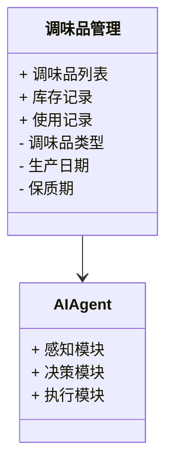
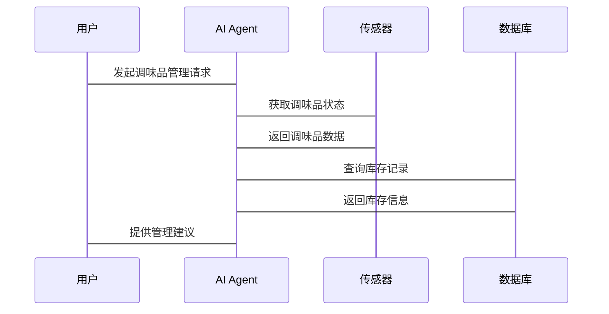

                 


# 智能厨房置物架：AI Agent的调味品使用指导

> 关键词：智能厨房，AI Agent，调味品管理，人工智能，智能家居

> 摘要：本文深入探讨了AI Agent在智能厨房置物架中的应用，特别是在调味品管理方面的指导。通过分析AI Agent的核心算法、系统架构和实际应用场景，本文展示了如何利用人工智能技术优化厨房调味品的使用和管理。文章内容涵盖背景介绍、核心概念、算法原理、系统设计、项目实战及未来展望，旨在为读者提供全面的技术指导。

---

## 第一部分：智能厨房置物架的背景与意义

### 第1章：智能厨房置物架的背景与意义

#### 1.1 智能厨房的背景

##### 1.1.1 智能家居的发展趋势

智能家居作为现代科技的重要组成部分，正在迅速改变我们的生活方式。随着物联网（IoT）、人工智能（AI）和大数据技术的快速发展，智能家居设备逐渐普及。厨房作为家庭中最重要的生活空间之一，智能化改造的需求日益增长。

智能家居的发展趋势主要体现在以下几个方面：
1. **设备的互联互通**：通过Wi-Fi、蓝牙等技术，厨房设备可以实现无缝连接，形成智能化的生态系统。
2. **智能化操作**：通过AI技术，设备能够自主学习用户习惯，提供个性化的服务。
3. **数据驱动决策**：通过大数据分析，设备能够优化操作流程，提高效率。

##### 1.1.2 厨房智能化的需求

厨房智能化的需求主要来源于以下几个方面：
1. **提高生活效率**：通过智能化设备，减少人工操作，节省时间。
2. **优化资源利用**：通过智能管理，合理使用能源和资源，降低浪费。
3. **提升安全性**：智能设备能够实时监测厨房环境，预防火灾、气体泄漏等安全隐患。

##### 1.1.3 调味品管理的痛点

在厨房中，调味品的管理是一个常见的问题。传统管理方式存在以下痛点：
- **过期问题**：调味品容易过期，但用户常常忘记检查，导致浪费或安全隐患。
- **用量不准确**：在烹饪过程中，用户常常因为不清楚调味品的使用量而影响菜品口味。
- **存储混乱**：调味品种类繁多，存储位置混乱，导致使用时效率低下。

#### 1.2 AI Agent的基本概念

##### 1.2.1 什么是AI Agent

AI Agent（人工智能代理）是一种能够感知环境、自主决策并执行任务的智能实体。它可以是一个软件程序，也可以是一个物理设备。AI Agent的核心能力包括感知、推理、规划和执行。

##### 1.2.2 AI Agent的核心特征

AI Agent具有以下核心特征：
1. **自主性**：能够在没有外部干预的情况下自主运行。
2. **反应性**：能够实时感知环境变化并做出相应反应。
3. **目标导向**：具有明确的目标，并能够采取行动以实现目标。
4. **学习能力**：能够通过数据学习，不断优化自身的决策能力。

##### 1.2.3 AI Agent在厨房中的应用场景

在厨房中，AI Agent可以应用于以下几个方面：
- **调味品管理**：通过AI Agent实时监测调味品的库存和使用情况，提供智能化的使用建议。
- **烹饪指导**：根据用户的饮食习惯和菜品需求，AI Agent可以提供个性化的烹饪建议。
- **环境监控**：实时监测厨房的温湿度、空气质量等参数，确保烹饪环境的安全和舒适。

---

## 第二部分：AI Agent在调味品管理中的应用

### 第2章：AI Agent在调味品管理中的应用

#### 2.1 调味品管理的常见问题

##### 2.1.1 调味品过期问题

调味品的过期问题是一个普遍存在的问题。传统管理方式中，用户需要手动检查每种调味品的生产日期和保质期，容易遗忘或疏忽，导致过期调味品的使用。

##### 2.1.2 调味品用量不准确

在烹饪过程中，调味品的用量直接影响菜品的口味。然而，用户常常因为缺乏精确的测量工具或经验不足，导致调味过重或不足。

##### 2.1.3 调味品存储混乱

调味品种类繁多，存储位置混乱，导致使用时效率低下，甚至遗忘某些调味品的存在。

#### 2.2 AI Agent如何解决调味品管理问题

##### 2.2.1 AI Agent的智能化管理

AI Agent通过传感器、RFID技术和数据库管理系统，可以实现对调味品的实时监测和智能化管理。具体功能包括：
- **库存管理**：实时监测调味品的库存量，提醒用户及时补充或更换过期产品。
- **用量控制**：根据菜品需求，自动调整调味品的使用量，确保最佳口味。
- **智能推荐**：根据用户的饮食习惯和菜品需求，推荐合适的调味品组合。

##### 2.2.2 AI Agent在调味品使用中的具体应用

AI Agent在调味品使用中的具体应用包括：
- **实时监测**：通过传感器监测调味品的温度、湿度等参数，确保存储环境的适宜性。
- **智能推荐**：根据用户的烹饪需求，推荐合适的调味品使用量和搭配。
- **数据记录**：记录每种调味品的使用历史和消耗情况，便于后续分析和优化。

##### 2.2.3 AI Agent的优势与局限性

**优势**：
- **高效性**：AI Agent能够快速响应用户需求，提高管理效率。
- **准确性**：通过实时监测和数据分析，确保调味品管理的准确性。
- **个性化**：根据用户的个性化需求，提供定制化的管理方案。

**局限性**：
- **成本较高**：AI Agent的开发和部署需要较高的技术和资金投入。
- **数据依赖性**：AI Agent的性能依赖于数据的准确性和完整性，数据不足可能导致决策失误。
- **隐私问题**：AI Agent需要采集和处理用户的大量数据，可能涉及隐私泄露风险。

---

## 第三部分：AI Agent的核心算法原理

### 第3章：AI Agent的核心算法原理

#### 3.1 AI Agent的基本算法

##### 3.1.1 机器学习基础

机器学习是AI Agent的核心技术之一。通过机器学习算法，AI Agent能够从数据中学习用户的行为模式和偏好，从而提供个性化的服务。

- **监督学习**：通过标记数据训练模型，使其能够预测新的数据。
- **无监督学习**：通过数据聚类等技术，发现数据中的潜在模式。
- **强化学习**：通过奖励机制，训练模型在复杂环境中做出最优决策。

##### 3.1.2 自然语言处理技术

自然语言处理（NLP）技术使得AI Agent能够理解和生成人类语言。在调味品管理中，NLP可以用于用户意图识别和对话交互。

##### 3.1.3 视觉识别技术

视觉识别技术通过摄像头和图像处理算法，识别调味品的种类、数量和状态。例如，AI Agent可以通过图像识别技术自动识别调味品的标签和生产日期。

#### 3.2 AI Agent的决策机制

##### 3.2.1 基于规则的决策

基于规则的决策是一种简单但有效的决策方法。通过预定义的规则，AI Agent可以快速做出决策。例如，当某种调味品的库存低于预设值时，触发补货提醒。

##### 3.2.2 基于机器学习的决策

基于机器学习的决策通过训练模型，使得AI Agent能够根据历史数据和当前状态，预测未来的趋势并做出最优决策。例如，通过预测用户的烹饪习惯，优化调味品的使用量。

##### 3.2.3 基于强化学习的决策

强化学习是一种通过试错机制优化决策的方法。AI Agent在复杂的环境中，通过不断尝试和调整，逐步接近最优决策。例如，在多调味品搭配的优化中，强化学习可以有效找到最佳组合。

---

## 第四部分：系统架构与实现

### 第4章：系统架构与实现

#### 4.1 系统功能设计

##### 4.1.1 领域模型设计

以下是调味品管理系统的领域模型：



##### 4.1.2 系统架构设计

以下是系统的总体架构图：

```mermaid
containerDiagram

container 智能厨房系统 {
    component 调味品管理模块 {
        use AI Agent
        use 数据库
    }
    component AI Agent {
        use 传感器
        use 网络通信
    }
    component 数据库 {
        use 调味品信息
        use 使用记录
    }
    component 传感器 {
        use 温湿度传感器
        use 重量传感器
    }
}
```

##### 4.1.3 系统接口设计

以下是系统的主要接口：



#### 4.2 核心代码实现

以下是AI Agent的核心代码示例：

```python
class AI-Agent:
    def __init__(self):
        self.sensor = Sensor()
        self.database = Database()

    def感知环境(self):
        # 获取传感器数据
        data = self.sensor.get_data()
        return data

    def决策(self, data):
        # 分析数据，做出决策
        if data['库存'] < 10:
            return '补货'
        else:
            return '正常'

    def执行(self, decision):
        # 执行决策
        if decision == '补货':
            self.database.update库存('补货')
            return '已补货'
        else:
            return '无需补货'

    def运行(self):
        while True:
            data = self.感知环境()
            decision = self.决策(data)
            self.执行(decision)
```

---

## 第五部分：项目实战与优化

### 第5章：项目实战与优化

#### 5.1 环境搭建

##### 5.1.1 硬件环境

- **传感器**：温湿度传感器、重量传感器。
- **通信模块**：Wi-Fi或蓝牙模块。
- **处理器**：Raspberry Pi或其他嵌入式处理器。

##### 5.1.2 软件环境

- **操作系统**：Raspbian或其他嵌入式系统。
- **编程语言**：Python。
- **开发工具**：Visual Studio Code、Jupyter Notebook。

#### 5.2 系统核心实现

##### 5.2.1 调味品管理模块

以下是调味品管理模块的核心代码：

```python
import datetime

class 调味品管理:
    def __init__(self, database):
        self.database = database

    def 查询库存(self):
        return self.database.get_inventory()

    def 更新库存(self, data):
        self.database.update_inventory(data)

class 数据库:
    def __init__(self):
        self.inventory = {}

    def get_inventory(self):
        return self.inventory

    def update_inventory(self, data):
        self.inventory.update(data)
```

##### 5.2.2 AI Agent模块

以下是AI Agent模块的核心代码：

```python
class AI-Agent:
    def __init__(self, 调味品管理):
        self.调味品管理 = 调味品管理

    def 感知环境(self):
        # 获取当前时间
        now = datetime.datetime.now()
        # 获取库存数据
        inventory = self.调味品管理.查询库存()
        return inventory

    def 决策(self):
        inventory = self.感知环境()
        # 判断是否有调味品过期
        for item in inventory:
            if item['保质期'] < now:
                return '需要处理'
        return '正常'

    def 执行(self, decision):
        if decision == '需要处理':
            self.调味品管理.更新库存({'状态': '过期', '处理建议': '丢弃或替换'})
            return '已处理'
        else:
            return '无需处理'

    def 运行(self):
        while True:
            decision = self.决策()
            self.执行(decision)
            time.sleep(60)
```

---

## 第六部分：总结与展望

### 第6章：总结与展望

#### 6.1 总结

本文深入探讨了AI Agent在智能厨房置物架中的应用，特别是在调味品管理方面的指导。通过分析AI Agent的核心算法、系统架构和实际应用场景，本文展示了如何利用人工智能技术优化厨房调味品的使用和管理。

#### 6.2 未来展望

未来，随着AI技术和物联网技术的不断发展，智能厨房置物架的应用前景将更加广阔。以下是未来的发展方向：
1. **更智能化的调味品管理**：通过更先进的AI算法，实现更精准的调味品使用和管理。
2. **多设备协同**：实现厨房设备之间的无缝协同，构建更完整的智能家居生态系统。
3. **更个性化的服务**：根据用户的个性化需求，提供更加定制化的调味品管理方案。

---

## 作者信息

作者：AI天才研究院/AI Genius Institute & 禅与计算机程序设计艺术 /Zen And The Art of Computer Programming

---

以上就是《智能厨房置物架：AI Agent的调味品使用指导》的技术博客文章大纲和内容。希望这篇文章能够为读者提供有价值的技术指导和启发。

