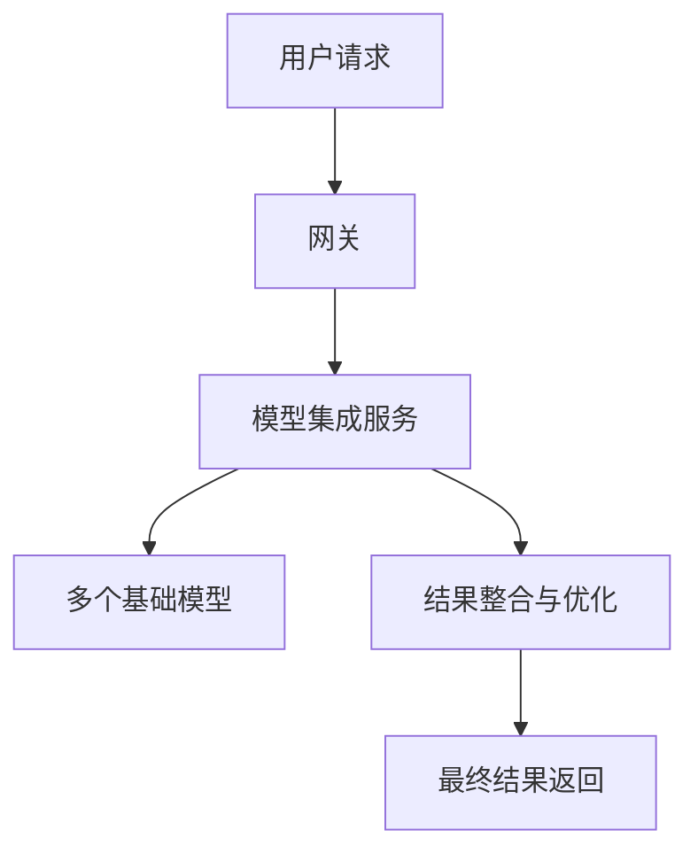
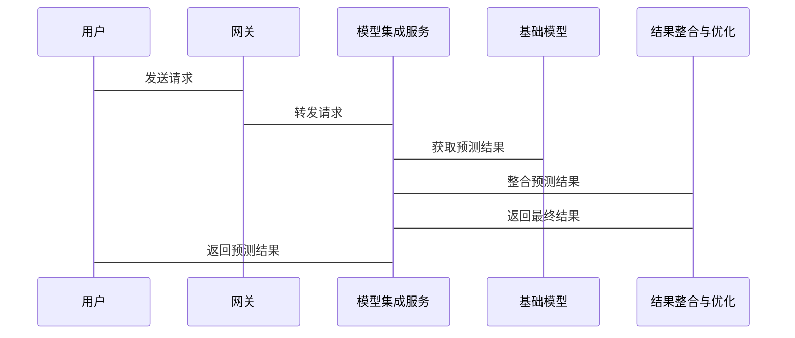

                 


# 模型集成与系统部署

> 关键词：模型集成、系统部署、机器学习、算法原理、系统架构、项目实战

> 摘要：本文详细探讨了模型集成与系统部署的核心概念、算法原理、系统架构设计以及实际项目实战。通过分析模型集成的背景、核心概念与联系、算法原理、系统分析与架构设计、项目实战以及最佳实践，为读者提供了一套完整的从理论到实践的指导方案。

---

## 第一部分: 模型集成与系统部署背景介绍

### 第1章: 模型集成的核心概念

#### 1.1 模型集成的定义与背景

##### 1.1.1 什么是模型集成
模型集成（Model Ensembling）是将多个独立训练的基础模型（Base Models）结合在一起，通过集成策略（Ensembling Strategy）生成最终预测结果的方法。基础模型可以是同一种算法的不同实例，也可以是不同的算法模型。

##### 1.1.2 模型集成的必要性
- **提升性能**：通过集成多个模型，可以有效降低单个模型的偏差（Bias）和方差（Variance），从而提升整体预测的准确性和稳定性。
- **鲁棒性增强**：模型集成能够有效减少过拟合（Overfitting）的风险，提高模型的泛化能力。
- **适应复杂场景**：在实际应用中，单一模型往往难以覆盖所有场景，模型集成能够更好地适应复杂多变的数据分布。

##### 1.1.3 模型集成的应用场景
- **分类任务**：如图像分类、文本分类等。
- **回归任务**：如房价预测、股票价格预测等。
- **推荐系统**：通过集成多个推荐算法，提升推荐的准确性和多样性。
- **自然语言处理**：如文本摘要、机器翻译等任务中，模型集成可以进一步优化结果。

#### 1.2 模型集成的背景与现状

##### 1.2.1 人工智能模型的发展历程
从早期的逻辑回归（Logistic Regression）和决策树（Decision Tree）到现在的深度学习（Deep Learning）模型，人工智能模型经历了从简单到复杂的演变。模型集成作为连接不同模型的重要桥梁，在这一过程中发挥了关键作用。

##### 1.2.2 模型集成在现代机器学习中的地位
模型集成是现代机器学习中不可或缺的一部分，尤其是在竞赛（如Kaggle）和工业界，集成方法（如投票法、堆叠法）常常被用来优化最终结果。

##### 1.2.3 当前模型集成的主要研究方向
- **异质性集成**：研究如何有效地结合不同算法或不同架构的模型。
- **自适应集成**：研究如何动态调整集成策略，以适应数据分布的变化。
- **模型压缩与轻量化**：研究如何在保证性能的前提下，降低集成模型的计算和存储成本。

---

### 第2章: 模型集成的核心概念与联系

#### 2.1 模型集成的原理

##### 2.1.1 基础模型的概念
基础模型（Base Model）是指用于集成的单个模型。常见的基础模型包括：
- **逻辑回归（Logistic Regression）**
- **支持向量机（Support Vector Machine, SVM）**
- **决策树（Decision Tree）**
- **随机森林（Random Forest）**
- **梯度提升树（Gradient Boosting Tree）**
- **深度学习模型（如CNN、RNN等）**

##### 2.1.2 模型集成的实现方式
- **投票法（Voting）**：将多个基础模型的预测结果进行投票，选择得票最多的类别。
- **加权投票法（Weighted Voting）**：根据每个基础模型的表现赋予不同的权重，加权求和后得到最终结果。
- **堆叠法（Stacking）**：通过元模型（Meta Model）对多个基础模型的预测结果进行二次集成。

##### 2.1.3 模型集成的数学基础
模型集成的本质是通过某种策略将多个基础模型的预测结果进行融合，从而得到一个更优的预测结果。其数学基础主要体现在以下几个方面：
- **概率论**：如投票法可以看作是对概率的加权求和。
- **统计学**：如加权投票法是基于统计学中的加权平均方法。
- **优化理论**：如堆叠法中元模型的训练目标是最小化整体损失函数。

#### 2.2 模型集成的核心要素

##### 2.2.1 基础模型的选择
选择合适的基础模型是模型集成成功的关键。常见的基础模型选择策略包括：
- **多样性原则**：选择具有不同预测模式的模型，以减少集成的偏差。
- **性能优先原则**：选择性能较高的模型，如在训练集和验证集上表现稳定的模型。
- **混合策略**：结合多样性和性能，选择一组互补的基础模型。

##### 2.2.2 集成策略的设计
集成策略的设计直接影响最终的预测结果。常见的集成策略包括：
- **硬投票（Hard Voting）**：直接投票选择最终结果。
- **软投票（Soft Voting）**：将基础模型的预测概率作为权重，加权求和后得到最终结果。
- **堆叠策略**：通过元模型对基础模型的预测结果进行二次优化。

##### 2.2.3 集成结果的评估
评估集成模型的性能是衡量模型集成效果的重要步骤。常用的评估指标包括：
- **准确率（Accuracy）**
- **精确率（Precision）**
- **召回率（Recall）**
- **F1分数（F1-Score）**
- **AUC曲线（Area Under Curve）**

---

### 第3章: 模型集成的算法原理

#### 3.1 模型集成的算法流程

##### 3.1.1 基础模型的训练与评估
基础模型的训练是模型集成的第一步。训练过程中需要注意以下几点：
- **数据划分**：确保训练集、验证集和测试集的划分合理。
- **超参数调优**：通过网格搜索（Grid Search）或随机搜索（Random Search）优化基础模型的超参数。
- **性能评估**：使用交叉验证等方法评估基础模型的性能。

##### 3.1.2 集成策略的实现步骤
集成策略的实现步骤通常包括以下内容：
1. **训练基础模型**：使用不同的算法或同一算法的不同参数设置，训练多个基础模型。
2. **生成预测结果**：对测试数据集进行预测，生成多个基础模型的预测结果。
3. **集成预测结果**：通过投票法、加权投票法或堆叠法等方法，将基础模型的预测结果整合为最终结果。

##### 3.1.3 集成结果的优化方法
优化集成结果的关键在于选择合适的集成策略和优化方法。常用的优化方法包括：
- **动态权重调整**：根据基础模型在不同数据上的表现，动态调整其权重。
- **元模型优化**：在堆叠法中，通过优化元模型的参数和结构，进一步提升集成效果。
- **数据增强**：在训练基础模型时，通过数据增强技术（Data Augmentation）提升模型的泛化能力。

#### 3.2 模型集成的数学模型

##### 3.2.1 投票法的数学表达
投票法是最简单的集成策略之一，其实现公式如下：
$$ y_{\text{集成}} = \arg\max_{i} \sum_{j=1}^{n} y_j^{(i)} $$
其中，$y_j^{(i)}$ 表示第 $i$ 个基础模型对第 $j$ 个样本的预测结果，$y_{\text{集成}}$ 表示集成模型的最终预测结果。

##### 3.2.2 加权投票法的数学表达
加权投票法通过为每个基础模型赋予不同的权重来提升集成效果，其实现公式如下：
$$ y_{\text{集成}} = \arg\max_{i} \sum_{j=1}^{n} w_j y_j^{(i)} $$
其中，$w_j$ 是第 $j$ 个基础模型的权重，通常根据其在验证集上的表现来确定。

##### 3.2.3 堆叠法的数学表达
堆叠法是一种更复杂的集成策略，其实现公式如下：
$$ P(y|x) = \sum_{i=1}^{n} \alpha_i P(y|x, \theta_i) $$
其中，$\alpha_i$ 是第 $i$ 个基础模型的权重，$P(y|x, \theta_i)$ 是第 $i$ 个基础模型的预测概率。

---

### 第4章: 模型集成的系统分析与架构设计

#### 4.1 系统部署的背景与目标

##### 4.1.1 系统部署的定义
系统部署是指将训练好的模型及其相关组件部署到实际生产环境中，使其能够为用户提供实时服务。

##### 4.1.2 模型集成在系统部署中的作用
- **提升系统性能**：通过模型集成，可以显著提升系统的预测准确性和响应速度。
- **增强系统稳定性**：模型集成能够有效降低单个模型失效对系统整体的影响。
- **支持复杂场景**：通过模型集成，系统能够更好地适应复杂的业务场景和数据分布。

##### 4.1.3 系统部署的目标与挑战
- **目标**：将模型集成技术成功应用于实际业务场景，提升用户体验和系统性能。
- **挑战**：包括模型的实时性、系统的可扩展性、数据的安全性和系统的可维护性等。

#### 4.2 系统架构设计方案

##### 4.2.1 系统功能模块划分
- **模型训练模块**：负责训练基础模型和元模型。
- **集成预测模块**：负责将基础模型的预测结果进行集成，生成最终预测结果。
- **系统管理模块**：负责系统的监控、维护和优化。

##### 4.2.2 系统架构图


##### 4.2.3 系统接口设计
- **输入接口**：接收用户的请求数据。
- **输出接口**：返回集成模型的预测结果。
- **管理接口**：用于系统管理员进行模型管理和系统配置。

##### 4.2.4 系统交互流程图


---

## 第五章: 项目实战

### 5.1 项目环境安装

#### 5.1.1 安装Docker
```bash
sudo apt-get update
sudo apt-get install docker.io
```

#### 5.1.2 安装Kubernetes
```bash
curl -fsSL https://get.docker.com | bash -s docker
sudo systemctl start docker
sudo systemctl enable docker
```

### 5.2 系统核心代码实现

#### 5.2.1 模型集成部分实现
```python
from sklearn.ensemble import VotingClassifier
from sklearn.linear_model import LogisticRegression
from sklearn.svm import SVC
from sklearn.tree import DecisionTreeClassifier

# 定义基础模型
model1 = LogisticRegression()
model2 = SVC()
model3 = DecisionTreeClassifier()

# 定义集成模型
ensemble_model = VotingClassifier(
    estimators=[('lr', model1), ('svc', model2), ('dt', model3)],
    voting='hard'
)
```

#### 5.2.2 系统部署部分实现
```python
import requests
import json

# 发送请求到模型集成服务
response = requests.post(
    'http://localhost:8000/predict',
    json={'data': {'input': '样本数据'}}
)
result = json.loads(response.text)
print(result)
```

### 5.3 实际案例分析与详细解读

#### 5.3.1 案例背景
以电商推荐系统为例，我们希望通过模型集成技术，提升推荐的准确性和用户体验。

#### 5.3.2 数据准备
- **训练数据**：包括用户的点击、浏览、购买记录等。
- **测试数据**：用于验证模型集成的效果。

#### 5.3.3 模型训练与集成
1. **训练基础模型**：分别训练逻辑回归、支持向量机和决策树模型。
2. **集成预测**：通过投票法对多个模型的预测结果进行集成，生成最终推荐结果。

#### 5.3.4 系统部署
1. **部署基础模型**：将基础模型部署到 Kubernetes 集群中，确保服务的高可用性。
2. **部署集成服务**：将集成服务部署到云服务器上，提供 RESTful API 接口。

### 5.4 项目总结

#### 5.4.1 项目小结
通过本项目，我们成功实现了模型集成与系统部署，验证了模型集成在实际应用中的有效性和优势。

#### 5.4.2 项目经验总结
- **技术总结**：模型集成能够显著提升系统的预测性能和稳定性。
- **经验总结**：在实际部署过程中，需要注意模型的实时性、系统的可扩展性和数据的安全性。

---

## 第六章: 最佳实践与注意事项

### 6.1 小结

- **理论部分**：深入理解模型集成的核心概念和算法原理，是成功部署模型集成系统的前提。
- **实践部分**：在实际项目中，需要根据具体需求选择合适的模型集成策略，并进行充分的实验验证。

### 6.2 注意事项

- **模型选择**：选择合适的基础模型是模型集成成功的关键。
- **权重调整**：根据基础模型的性能动态调整权重，可以进一步提升集成效果。
- **系统优化**：在系统部署过程中，需要注意系统的实时性、可扩展性和可维护性。

### 6.3 拓展阅读

- **推荐书籍**：
  - 《机器学习实战》
  - 《深度学习》
- **推荐论文**：
  - “Model Ensembling Made Fast and Scalable”
  - “Deep Ensemble: A Simple-to-Implement but Hard-to-Beat Baseline”

---

## 作者信息

作者：AI天才研究院/AI Genius Institute & 禅与计算机程序设计艺术/Zen And The Art of Computer Programming

---

这篇文章详细探讨了模型集成与系统部署的核心概念、算法原理、系统架构设计以及实际项目实战。通过理论与实践相结合的方式，为读者提供了一套完整的从理论到实践的指导方案。希望本文能够为从事人工智能和机器学习相关工作的读者提供有价值的参考和启发。

