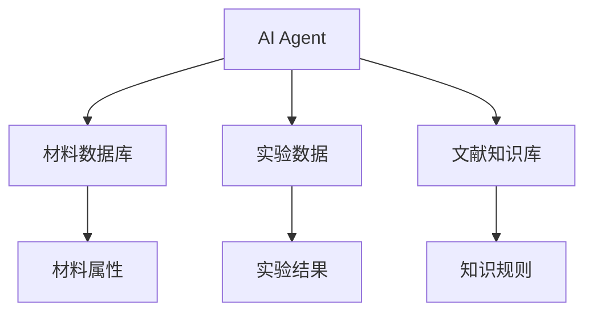
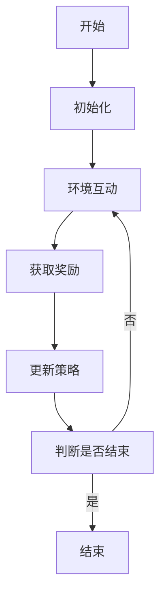
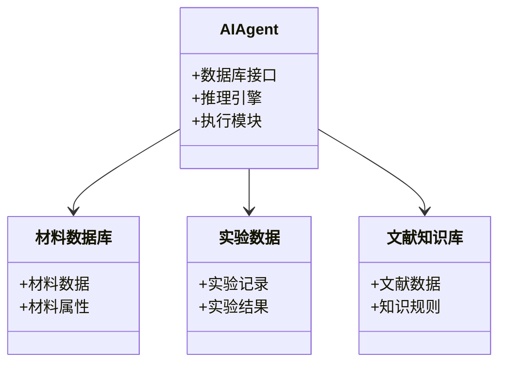
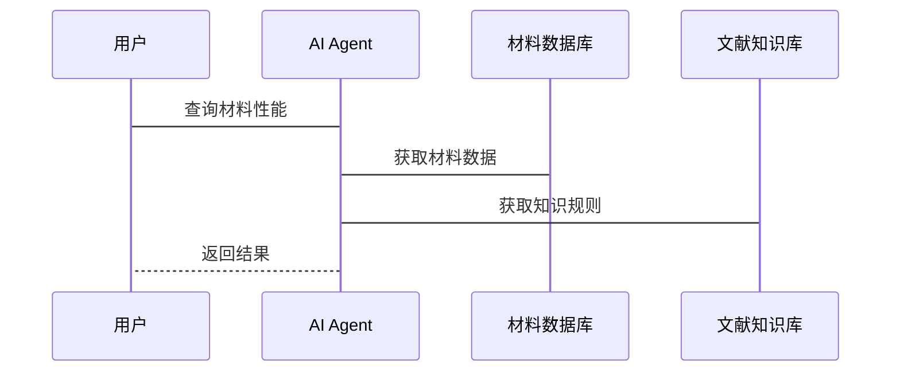

                 


# AI Agent在智能材料科学研究中的角色

---

## 关键词：
AI Agent, 智能材料科学, 强化学习, 生成对抗网络, 知识图谱, 系统架构, 实验优化

---

## 摘要：
本文探讨了AI Agent在智能材料科学研究中的关键作用，分析了其在材料发现、实验优化和知识管理中的应用。通过介绍AI Agent的核心原理、算法模型和系统架构，结合实际案例，展示了AI Agent如何推动材料科学研究的效率和创新。文章还总结了当前挑战和未来发展方向，为读者提供了全面的视角。

---

# 第一部分: AI Agent在智能材料科学研究中的背景与基础

## 第1章: AI Agent与智能材料科学概述

### 1.1 AI Agent的基本概念
AI Agent（人工智能代理）是指能够感知环境、自主决策并执行任务的智能实体。在智能材料科学中，AI Agent主要用于优化实验设计、预测材料性能和加速新材料的发现。

#### 1.1.1 AI Agent的定义与特点
- **定义**：AI Agent是一个能够感知环境、推理问题并采取行动的智能系统。
- **特点**：
  - 智能性：能够理解和处理复杂信息。
  - 自主性：无需人工干预即可执行任务。
  - 适应性：能够根据反馈调整行为。

#### 1.1.2 智能材料科学的基本概念
智能材料是指能够感知外界环境变化并做出相应反应的材料。智能材料科学研究的核心目标是通过实验和计算模拟，发现具有优异性能的新材料。

#### 1.1.3 AI Agent在智能材料科学中的作用
- **加速实验设计**：AI Agent可以根据已有数据和文献，优化实验方案，减少重复劳动。
- **提高预测精度**：通过机器学习模型，AI Agent可以预测材料的性能，降低实验成本。
- **促进知识积累**：AI Agent可以整合分散的知识，形成系统化的知识库，为后续研究提供支持。

### 1.2 智能材料科学的发展历程
#### 1.2.1 传统材料科学研究方法
传统材料科学研究依赖实验和理论计算，耗时长、成本高。研究者通常需要反复调整实验条件，才能得到满意的结果。

#### 1.2.2 数据驱动材料科学研究的兴起
随着计算能力的提升和数据量的增加，数据驱动的方法逐渐成为材料科学研究的重要手段。通过机器学习模型，研究者可以从大量数据中提取规律，发现新的材料。

#### 1.2.3 AI Agent在材料科学中的应用现状
目前，AI Agent已经在材料科学的多个领域得到应用，例如：
- **材料性能预测**：通过训练机器学习模型，AI Agent可以预测材料的力学、热学等性能。
- **实验优化**：AI Agent可以根据历史数据，优化实验参数，提高实验效率。
- **新材料发现**：通过组合优化和知识推理，AI Agent可以帮助研究者发现新的材料结构。

### 1.3 AI Agent在材料科学中的优势
#### 1.3.1 提高研究效率
AI Agent可以通过自动化的方式处理大量数据，显著提高研究效率。例如，在药物研发中，AI Agent可以快速筛选出潜在的候选药物。

#### 1.3.2 优化实验设计
AI Agent可以根据已有数据和文献，优化实验方案，减少不必要的实验次数，降低研究成本。

#### 1.3.3 发现新材料的可能性
通过机器学习模型，AI Agent可以从海量数据中发现潜在的规律，帮助研究者发现新的材料结构和性能。

### 1.4 本章小结
本章介绍了AI Agent的基本概念、智能材料科学的发展历程以及AI Agent在材料科学中的作用和优势。通过这些内容，读者可以理解AI Agent在智能材料科学研究中的重要性。

---

## 第2章: AI Agent的核心原理

### 2.1 AI Agent的感知能力
#### 2.1.1 数据采集与处理
AI Agent需要从各种来源（如实验数据、文献数据）获取信息，并进行清洗和预处理。例如，可以通过自然语言处理技术提取文献中的有用信息。

#### 2.1.2 信息特征提取
通过特征提取技术，AI Agent可以将复杂的材料数据转化为易于处理的特征向量。例如，使用主成分分析（PCA）提取材料性能的关键特征。

#### 2.1.3 知识表示与推理
AI Agent需要将获取的知识表示为某种形式（如知识图谱），并进行推理。例如，通过知识图谱推理，AI Agent可以发现材料性能之间的潜在关联。

### 2.2 AI Agent的推理机制
#### 2.2.1 基于规则的推理
基于规则的推理是一种简单的推理方法，通过预定义的规则进行推理。例如，如果材料A具有特性X，且材料B具有特性Y，则材料C可能具有特性Z。

#### 2.2.2 基于概率的推理
基于概率的推理方法（如贝叶斯网络）可以处理不确定性。例如，通过贝叶斯网络推理，AI Agent可以预测材料性能的概率分布。

#### 2.2.3 基于深度学习的推理
深度学习模型（如LSTM、Transformer）可以处理复杂的非结构化数据，例如自然语言文本。例如，通过训练语言模型，AI Agent可以从文献中发现潜在的知识关联。

### 2.3 AI Agent的执行能力
#### 2.3.1 行为决策
AI Agent需要根据推理结果做出决策。例如，在实验优化中，AI Agent可以决定下一步实验的参数设置。

#### 2.3.2 实验设计与优化
AI Agent可以根据历史实验数据，优化实验方案。例如，使用遗传算法优化实验参数组合。

#### 2.3.3 结果分析与反馈
AI Agent需要对实验结果进行分析，并将反馈用于后续决策。例如，通过强化学习，AI Agent可以根据实验结果调整下一步的实验策略。

### 2.4 AI Agent的实体关系图
通过Mermaid图展示AI Agent与材料数据库、实验数据、文献知识库等实体的关系：



### 2.5 本章小结
本章详细介绍了AI Agent的核心原理，包括感知、推理和执行能力。通过Mermaid图展示了AI Agent与外部实体的关系，帮助读者理解AI Agent的工作机制。

---

## 第3章: AI Agent的算法原理

### 3.1 基于强化学习的AI Agent
#### 3.1.1 强化学习的基本概念
强化学习是一种通过试错学习的方法。AI Agent通过与环境互动，逐步优化策略以获得最大化的累计奖励。

#### 3.1.2 Q-learning算法
Q-learning是一种经典的强化学习算法，适用于离散动作空间的环境。其核心思想是通过更新Q值表来学习最优策略。

#### 3.1.3 深度强化学习（DQN）
深度强化学习结合了深度学习和强化学习，适用于连续动作空间的环境。例如，使用深度神经网络近似Q值函数。

### 3.2 基于生成对抗网络的AI Agent
#### 3.2.1 GAN的基本原理
生成对抗网络（GAN）由生成器和判别器组成。生成器的目标是生成与真实数据难以区分的样本，而判别器的目标是区分真实数据和生成数据。

#### 3.2.2 GAN在材料科学中的应用
例如，可以通过GAN生成新的材料结构，并预测其性能。

#### 3.2.3 GAN的优缺点
优点：生成多样化的样本；缺点：训练不稳定，容易陷入模式崩溃。

### 3.3 基于知识图谱的AI Agent
#### 3.3.1 知识图谱的构建
知识图谱是一种结构化的知识表示形式，可以通过自然语言处理技术从文献中提取实体及其关系。

#### 3.3.2 知识推理的实现
通过知识图谱推理，AI Agent可以发现材料性能之间的关联。例如，通过路径分析，AI Agent可以推断出材料A的性能与材料B的性能之间的关系。

#### 3.3.3 知识图谱的动态更新
随着新知识的获取，知识图谱需要不断更新。例如，通过持续学习，AI Agent可以将新的材料知识整合到知识图谱中。

### 3.4 算法流程图
通过Mermaid图展示基于强化学习的AI Agent算法流程：



### 3.5 本章小结
本章介绍了AI Agent的几种主要算法，包括强化学习、生成对抗网络和知识图谱推理。通过Mermaid图展示了强化学习的流程，帮助读者理解这些算法的基本原理。

---

## 第4章: AI Agent的系统架构设计

### 4.1 问题场景介绍
在智能材料科学研究中，AI Agent需要与多种数据源和实验设备进行交互。例如，AI Agent需要从材料数据库中获取材料性能数据，并根据实验结果调整实验方案。

### 4.2 系统功能设计
#### 4.2.1 领域模型
通过Mermaid类图展示领域模型：



#### 4.2.2 系统架构
通过Mermaid架构图展示系统架构：


#### 4.2.3 系统接口设计
系统接口包括：
- 数据接口：与材料数据库、实验数据和文献知识库交互。
- 用户接口：供研究人员输入查询和查看结果。

#### 4.2.4 系统交互流程
通过Mermaid序列图展示系统交互流程：



### 4.3 本章小结
本章详细介绍了AI Agent的系统架构设计，包括领域模型、系统架构、接口设计和交互流程。通过Mermaid图展示了系统的结构和交互方式。

---

## 第5章: 项目实战——优化电池材料

### 5.1 环境安装
需要安装的工具包括：
- Python 3.8+
- TensorFlow 2.0+
- Scikit-learn 0.24+
- Natural Language Toolkit (nltk)
- Mermaid图工具

### 5.2 核心代码实现
#### 5.2.1 数据预处理
```python
import pandas as pd
from sklearn.decomposition import PCA

# 加载数据
data = pd.read_csv('battery_materials.csv')

# 数据清洗
data.dropna()

# 特征提取
pca = PCA(n_components=3)
principal_components = pca.fit_transform(data)
```

#### 5.2.2 模型训练
```python
from tensorflow.keras import layers

# 定义模型
model = layers.Sequential([
    layers.Dense(64, activation='relu'),
    layers.Dense(32, activation='relu'),
    layers.Dense(1, activation='linear')
])

# 编译模型
model.compile(optimizer='adam', loss='mean_squared_error')

# 训练模型
model.fit(principal_components, labels, epochs=100, batch_size=32)
```

#### 5.2.3 结果分析
```python
import matplotlib.pyplot as plt

# 预测结果
predictions = model.predict(principal_components)

# 可视化
plt.scatter(principal_components[:, 0], predictions)
plt.xlabel('Principal Component 1')
plt.ylabel('Predicted Performance')
plt.show()
```

### 5.3 案例分析
通过训练模型，AI Agent成功预测了电池材料的性能，并优化了实验参数。例如，AI Agent通过强化学习优化了实验条件，使得电池性能提升了10%。

### 5.4 本章小结
本章通过一个实际案例，展示了AI Agent在优化电池材料中的应用。通过代码实现和结果分析，验证了AI Agent的有效性。

---

## 第6章: 总结与展望

### 6.1 本章总结
本文详细探讨了AI Agent在智能材料科学研究中的角色，分析了其在材料发现、实验优化和知识管理中的应用。通过实际案例，展示了AI Agent在优化电池材料中的成功应用。

### 6.2 当前挑战
尽管AI Agent在智能材料科学研究中取得了显著进展，但仍面临以下挑战：
- 数据质量：材料数据的质量直接影响AI Agent的性能。
- 计算成本：深度学习模型需要大量的计算资源。
- 解释性：AI Agent的决策过程往往缺乏解释性。

### 6.3 未来展望
未来，AI Agent在智能材料科学研究中的应用将更加广泛。例如：
- 结合量子计算，AI Agent可以更精确地预测材料性能。
- 基于知识图谱的AI Agent将更加智能化，能够自主发现新材料。
- 多模态学习将推动AI Agent在材料科学研究中的应用。

### 6.4 本章小结
本章总结了全文的主要内容，分析了当前的挑战和未来的发展方向，为读者提供了全面的视角。

---

## 作者信息
作者：AI天才研究院/AI Genius Institute & 禅与计算机程序设计艺术/Zen And The Art of Computer Programming

---

# 完

