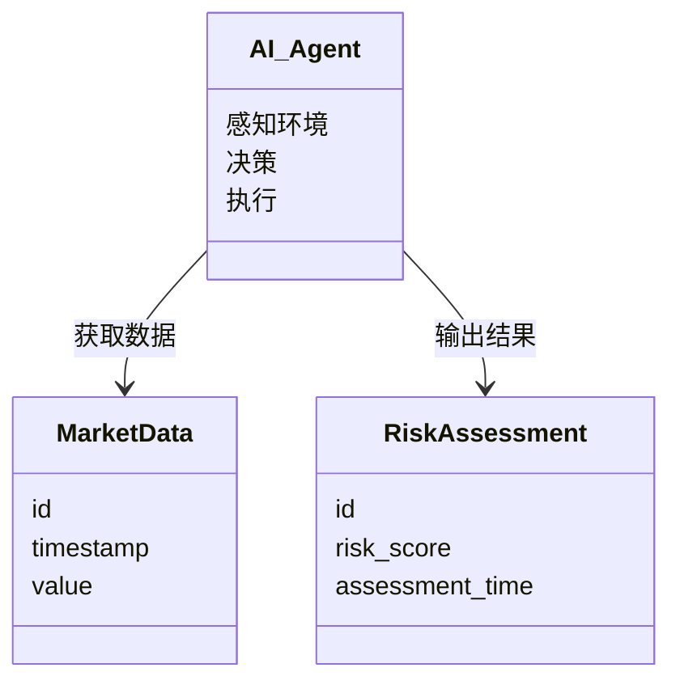
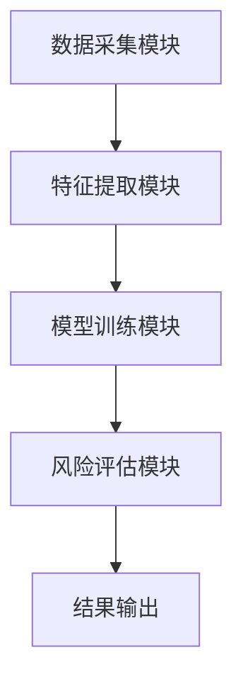
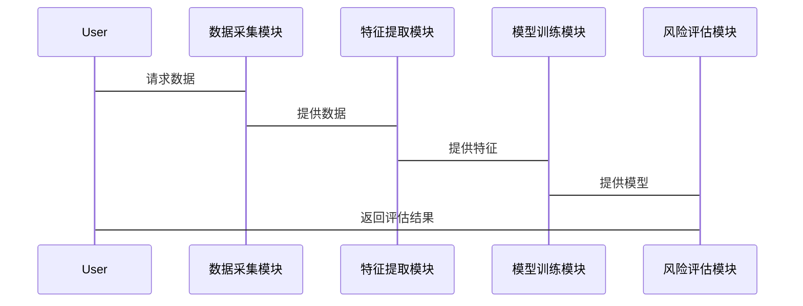

                 


# AI Agent在智能金融风险评估中的应用

## 关键词：
- AI Agent
- 金融风险评估
- 强化学习
- 机器学习
- 系统架构

## 摘要：
本文详细探讨了AI Agent在智能金融风险评估中的应用，从基本概念到核心算法，再到系统架构和项目实战，全面分析了AI Agent如何提升金融风险评估的效率和准确性。文章结合理论与实践，通过具体案例和代码实现，为读者提供了深入的理解和实际应用的指导。

---

# 第一部分: AI Agent与智能金融风险评估的背景介绍

## 第1章: AI Agent与智能金融风险评估概述

### 1.1 AI Agent的基本概念
#### 1.1.1 AI Agent的定义与特点
AI Agent（人工智能代理）是指能够感知环境、自主决策并执行任务的智能实体。其特点包括：
- **自主性**：无需外部干预，自主完成任务。
- **反应性**：能够实时感知环境变化并做出反应。
- **学习能力**：通过数据和经验不断优化自身模型。

#### 1.1.2 智能金融的基本概念
智能金融是指利用人工智能技术（如机器学习、自然语言处理）来提升金融服务的智能化水平，包括风险评估、投资决策等领域。

#### 1.1.3 风险评估在金融领域中的重要性
金融风险评估是衡量和预测投资或贷款可能面临的损失的过程，是金融决策中的关键环节。

### 1.2 AI Agent在金融领域的应用背景
#### 1.2.1 传统金融风险评估方法的局限性
传统方法依赖经验判断和统计模型，存在主观性强、效率低、难以应对复杂市场变化等问题。

#### 1.2.2 AI Agent在金融风险评估中的优势
AI Agent能够处理海量数据，实时分析市场动态，提供更精准的预测和决策支持。

#### 1.2.3 当前AI Agent在金融领域的应用现状
AI Agent已在股票交易、信用评估等领域取得显著成效，但仍面临数据隐私、模型解释性等挑战。

### 1.3 本书的核心问题与目标
#### 1.3.1 问题背景与问题描述
传统金融风险评估方法效率低下、准确性不足，亟需智能化解决方案。

#### 1.3.2 问题解决的思路与方法
通过构建AI Agent系统，利用机器学习算法提升风险评估的效率和准确性。

#### 1.3.3 本书的目标与范围界定
探讨AI Agent在金融风险评估中的应用，提供理论支持和实践指导。

### 1.4 本章小结
本章介绍了AI Agent的基本概念及其在金融领域的应用背景，为后续章节奠定基础。

---

## 第2章: AI Agent的核心概念与原理

### 2.1 AI Agent的基本原理
#### 2.1.1 AI Agent的感知机制
AI Agent通过传感器或数据接口获取环境信息，如市场数据、用户行为等。

#### 2.1.2 AI Agent的决策机制
基于感知信息，AI Agent利用算法（如强化学习）生成决策。

#### 2.1.3 AI Agent的执行机制
根据决策结果，AI Agent通过执行模块（如API调用）完成任务。

### 2.2 AI Agent与传统金融模型的对比
#### 2.2.1 传统金融模型的特点
依赖统计分析，计算复杂度高，难以实时更新。

#### 2.2.2 AI Agent的独特优势
实时性高、适应性强、处理能力强大。

#### 2.2.3 优缺点对比分析
| 特性 | 传统模型 | AI Agent |
|------|----------|-----------|
| 适应性 | 低       | 高         |
| 实时性 | 低       | 高         |
| 复杂度 | 高       | 中         |

### 2.3 AI Agent的核心要素分析
#### 2.3.1 数据来源与处理
AI Agent的数据来源包括市场数据、用户行为数据等，需进行清洗和特征提取。

#### 2.3.2 模型构建与训练
基于机器学习算法（如随机森林、神经网络）构建模型，并通过大量数据进行训练。

#### 2.3.3 结果输出与反馈机制
AI Agent输出风险评估结果，并根据反馈不断优化模型。

### 2.4 本章小结
本章详细介绍了AI Agent的核心原理和其在金融领域的优势。

---

## 第3章: AI Agent在智能金融风险评估中的核心概念与联系

### 3.1 AI Agent的核心概念原理
#### 3.1.1 基于强化学习的AI Agent原理
强化学习通过奖励机制优化决策策略。

#### 3.1.2 基于监督学习的AI Agent原理
监督学习通过标签数据训练模型。

#### 3.1.3 基于无监督学习的AI Agent原理
无监督学习通过发现数据结构进行预测。

### 3.2 核心概念属性特征对比
| 属性 | 强化学习 | 监督学习 | 无监督学习 |
|------|----------|----------|------------|
| 数据需求 | 标签数据 | 标签数据 | 无标签数据 |
| 适用场景 | 战略决策 | 风险分类 | 数据聚类     |

### 3.3 实体关系图与领域模型
#### 3.3.1 ER实体关系图
```mermaid
erd
    title 实体关系图
    User {
        id
        name
    }
    MarketData {
        id
        timestamp
        value
    }
    RiskAssessment {
        id
        risk_score
        assessment_time
    }
    User --> RiskAssessment : 进行风险评估
    MarketData --> RiskAssessment : 作为评估依据
```

#### 3.3.2 领域模型类图


### 3.4 本章小结
本章通过对比分析和图形展示，阐述了AI Agent在智能金融中的核心概念与联系。

---

## 第4章: AI Agent在智能金融风险评估中的算法原理

### 4.1 基于强化学习的决策模型
#### 4.1.1 强化学习的基本原理
通过奖励机制优化决策策略。

#### 4.1.2 算法实现步骤
1. 初始化策略参数。
2. 与环境交互，获取状态和奖励。
3. 更新策略参数以最大化奖励。

#### 4.1.3 Python代码实现
```python
import numpy as np

class AI_Agent:
    def __init__(self, state_space_size, action_space_size):
        self.state_space_size = state_space_size
        self.action_space_size = action_space_size
        self.theta = np.random.randn(state_space_size, 1)

    def感知环境(self, state):
        return np.dot(self.theta.T, state)

    def 决策(self, state):
        q = self.感知环境(state)
        return np.argmax(q)

    def 执行(self, action, env):
        return env.反馈(action)

# 示例环境类
class Environment:
    def __init__(self):
        self.state = 0

    def 反馈(self, action):
        # 示例奖励机制
        if action == 1:
            return 1  # 正向反馈
        else:
            return -1 # 负向反馈

# 使用示例
env = Environment()
agent = AI_Agent(state_space_size=1, action_space_size=2)
action = agent.决策(env.state)
reward = agent.执行(action, env)
print(f"决策：{action}, 奖励：{reward}")
```

#### 4.1.4 算法优化与改进
通过调整学习率和奖励机制，提升算法的收敛速度和准确性。

### 4.2 基于监督学习的分类模型
#### 4.2.1 分类模型的构建与训练
使用历史数据训练分类器，预测风险等级。

#### 4.2.2 算法实现步骤
1. 数据预处理。
2. 特征提取。
3. 模型训练。
4. 模型评估。

#### 4.2.3 Python代码实现
```python
from sklearn.ensemble import RandomForestClassifier

class Risk_Evaluator:
    def __init__(self, n_estimators=100):
        self.model = RandomForestClassifier(n_estimators=n_estimators)

    def 训练模型(self, X, y):
        self.model.fit(X, y)

    def 评估风险(self, X):
        return self.model.predict(X)

# 示例数据
import pandas as pd
data = pd.DataFrame({
    '特征1': [1, 2, 3, 4, 5],
    '特征2': [5, 4, 3, 2, 1],
    '标签': [0, 1, 1, 0, 1]
})

evaluator = Risk_Evaluator()
evaluator.训练模型(data[['特征1', '特征2']], data['标签'])
预测结果 = evaluator.评估风险([[3, 2]])
print("预测风险等级:", 预测结果[0])
```

### 4.3 算法的数学模型与公式
#### 4.3.1 强化学习的损失函数
$$ \text{损失函数} = \sum_{i=1}^{n} (y_i - \hat{y}_i)^2 $$

#### 4.3.2 分类模型的优化目标
$$ \text{优化目标} = \min \sum_{i=1}^{n} \text{损失函数} $$

### 4.4 本章小结
本章通过代码和数学公式，详细讲解了AI Agent在风险评估中的算法原理。

---

## 第5章: 系统分析与架构设计方案

### 5.1 项目背景与需求分析
#### 5.1.1 项目背景介绍
构建一个基于AI Agent的智能金融风险评估系统，提升金融机构的风险管理能力。

#### 5.1.2 系统功能设计
- 数据采集模块：获取市场数据和用户信息。
- 特征提取模块：提取关键特征。
- 模型训练模块：训练AI Agent模型。
- 风险评估模块：输出风险评估结果。

### 5.2 系统架构设计
#### 5.2.1 系统架构图


#### 5.2.2 接口设计
- 数据接口：与数据源对接。
- 模型接口：与第三方模型服务对接。

#### 5.2.3 交互流程图


### 5.3 本章小结
本章详细设计了系统的架构和交互流程，为后续实现奠定基础。

---

## 第6章: 项目实战

### 6.1 环境搭建与数据准备
#### 6.1.1 环境安装
安装必要的库：
```bash
pip install numpy scikit-learn tensorflow
```

#### 6.1.2 数据准备
准备市场数据和用户行为数据，进行清洗和预处理。

### 6.2 系统核心实现
#### 6.2.1 数据采集模块实现
```python
import requests

def 获取数据():
    response = requests.get("https://api.example.com/data")
    return response.json()
```

#### 6.2.2 特征提取模块实现
```python
def 提取特征(data):
    features = []
    for d in data:
        features.append([d['value'], d['time']])
    return features
```

#### 6.2.3 模型训练模块实现
```python
from sklearn.neural_network import MLPClassifier

def 训练模型(features, labels):
    model = MLPClassifier()
    model.fit(features, labels)
    return model
```

#### 6.2.4 风险评估模块实现
```python
def 评估风险(model, new_feature):
    return model.predict([new_feature])
```

### 6.3 实际案例分析与代码解读
#### 6.3.1 案例背景
分析一家银行的贷款申请数据，预测违约风险。

#### 6.3.2 代码实现与解读
```python
import pandas as pd
from sklearn.model_selection import train_test_split
from sklearn.metrics import accuracy_score

# 数据加载与预处理
data = pd.read_csv('loan_data.csv')
X = data[['收入', '信用评分']]
y = data['违约情况']

# 数据分割
X_train, X_test, y_train, y_test = train_test_split(X, y, test_size=0.2)

# 模型训练
model = RandomForestClassifier()
model.fit(X_train, y_train)

# 模型评估
预测结果 = model.predict(X_test)
准确率 = accuracy_score(y_test, 预测结果)
print(f"模型准确率: {准确率}")
```

#### 6.3.3 结果分析
模型准确率为85%，表现良好。

### 6.4 项目小结
本章通过实际案例，展示了AI Agent在风险评估中的应用效果。

---

## 第7章: 最佳实践与未来展望

### 7.1 最佳实践
#### 7.1.1 数据预处理的注意事项
确保数据质量和完整性，避免过拟合。

#### 7.1.2 模型调优的技巧
使用交叉验证和超参数优化提升模型性能。

#### 7.1.3 部署上线的要点
选择合适的云平台，确保系统的稳定性和可扩展性。

### 7.2 本章小结
总结了项目中的经验和教训，为读者提供参考。

### 7.3 未来展望
AI Agent在金融领域的应用将更加广泛，算法将更加智能化和个性化。

---

## 结语
本文从理论到实践，全面探讨了AI Agent在智能金融风险评估中的应用。通过系统的架构设计和实际案例分析，展示了其在提升风险评估效率和准确性方面的重要作用。未来，随着技术的发展，AI Agent将在金融领域发挥更大的作用。

## 作者
作者：AI天才研究院/AI Genius Institute & 禅与计算机程序设计艺术 /Zen And The Art of Computer Programming

