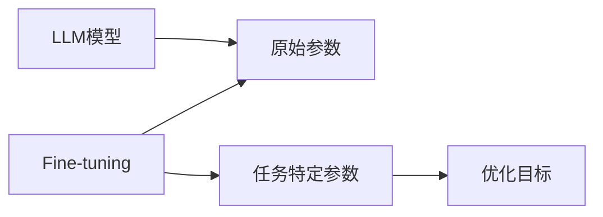
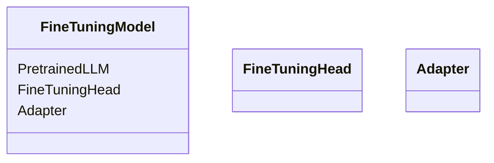
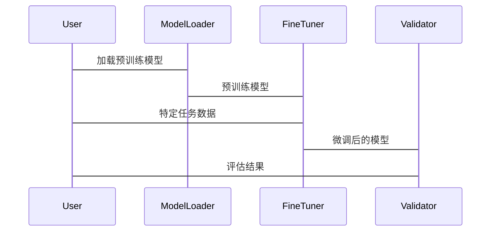

                 


# Fine-tuning LLM模型：提升AI Agent性能的关键

## 关键词：
Fine-tuning, LLM模型, AI Agent, 模型优化, 语言模型

## 摘要：
本文详细探讨了Fine-tuning LLM模型在提升AI Agent性能中的关键作用。通过分析Fine-tuning的基本原理、实现方法、系统架构以及实际应用案例，本文为读者提供了从理论到实践的全面指导。我们还将对比Fine-tuning与其他模型优化方法的区别，深入探讨其优缺点，并通过Mermaid图和Python代码示例，帮助读者更好地理解Fine-tuning的实现过程。最后，本文总结了Fine-tuning的最佳实践和未来研究方向，为AI Agent的性能优化提供了有价值的参考。

---

## 第一部分: Fine-tuning LLM模型概述

## 第1章: Fine-tuning LLM模型的背景与意义

### 1.1 问题背景
#### 1.1.1 大语言模型的发展现状
- 当前LLM模型（如GPT、BERT等）在自然语言处理领域取得了显著进展。
- 然而，通用模型难以直接满足特定领域或任务的个性化需求。

#### 1.1.2 当前LLM模型的应用瓶颈
- 模型参数量庞大，训练成本高。
- 预训练模型在特定任务上表现欠佳，需进一步优化。
- 领域知识的迁移能力不足，难以适应多样化需求。

#### 1.1.3 Fine-tuning的提出与价值
- Fine-tuning作为一种高效的模型优化方法，能够在保持模型通用性的同时，提升其在特定任务上的性能。
- 通过微调，可以降低计算成本，同时提升模型的实用性。

### 1.2 问题描述
#### 1.2.1 LLM模型的局限性
- 参数量过大导致计算成本高。
- 预训练模型难以直接满足特定领域的需求。
- 任务间的迁移能力有限，需要针对性优化。

#### 1.2.2 Fine-tuning的目标与核心问题
- 目标：通过少量数据微调，提升模型在特定任务上的性能。
- 核心问题：如何在保持模型通用性的同时，实现特定任务的优化。

#### 1.2.3 Fine-tuning与任务需求的匹配性
- Fine-tuning适合数据量有限且任务特定性较强的场景。
- 通过微调，可以在保持模型整体性能的同时，显著提升特定任务的效果。

### 1.3 问题解决
#### 1.3.1 Fine-tuning的基本思路
- 在预训练模型的基础上，使用特定任务的数据进行微调。
- 通过优化目标函数，调整模型参数以适应特定任务。

#### 1.3.2 Fine-tuning的核心方法论
- 数据预处理：选择与任务相关的数据，进行清洗和标注。
- 模型调整：通过反向传播算法，优化模型参数。
- 评估与验证：通过验证集评估模型性能，调整优化策略。

#### 1.3.3 Fine-tuning的实现路径
- 数据准备：收集和整理特定任务的数据。
- 模型选择：选择适合的预训练模型。
- 参数调整：通过微调优化模型参数。
- 模型验证：通过验证集评估模型性能。

### 1.4 边界与外延
#### 1.4.1 Fine-tuning的适用范围
- 数据量有限的场景。
- 任务特定性较强的场景。
- 需要快速部署和优化的场景。

#### 1.4.2 Fine-tuning的局限性与挑战
- 对特定任务数据的依赖性强。
- 微调过程可能引入过拟合风险。
- 计算资源需求较高。

#### 1.4.3 Fine-tuning与其他模型优化方法的对比
- 对比：从头训练、迁移学习、微调的优缺点。
- 迁移学习：利用预训练模型的特征，减少训练时间。
- 从头训练：适合特定任务，但计算成本高。
- 微调：结合迁移学习和从头训练的优势，适用于特定任务优化。

### 1.5 概念结构与核心要素
#### 1.5.1 Fine-tuning的构成要素
- 预训练模型：提供初始参数。
- 特定任务数据：用于微调。
- 优化目标函数：指导参数调整。
- 微调策略：包括学习率调整、参数 freeze 策略等。

#### 1.5.2 各要素之间的关系
- 预训练模型与特定任务数据的关系：预训练模型提供通用特征，特定任务数据用于任务特定优化。
- 优化目标函数与微调策略的关系：目标函数指导参数调整，微调策略影响调整幅度和范围。

#### 1.5.3 Fine-tuning的实现框架
- 数据预处理：清洗和标注特定任务数据。
- 模型加载：加载预训练模型。
- 参数调整：通过反向传播优化模型参数。
- 模型验证：通过验证集评估性能。

---

## 第2章: Fine-tuning LLM模型的核心概念与联系

### 2.1 核心概念原理
#### 2.1.1 Fine-tuning的基本原理
- 通过反向传播算法，调整模型参数以适应特定任务。
- 微调过程中，模型的低层特征保持不变，高层特征逐步调整。
- 通过任务特定数据，优化模型在特定任务上的表现。

#### 2.1.2 Fine-tuning与模型可塑性的关系
- Fine-tuning增强了模型的可塑性，使其能够适应不同任务。
- 通过调整模型参数，模型可以更好地捕捉任务特定特征。

#### 2.1.3 Fine-tuning与任务适应性的关系
- Fine-tuning通过特定任务数据，提升模型在该任务上的适应性。
- 任务适应性越强，模型的泛化能力越差，但特定任务性能提升。

### 2.2 核心概念属性特征对比
#### 2.2.1 Fine-tuning与其他模型优化方法的对比
- 对比表格：

| 方法         | 参数调整范围 | 训练数据需求 | 计算成本 | 适用场景                     |
|--------------|--------------|--------------|----------|-----------------------------|
| 从头训练     | 全部参数     | 需要大量数据 | 高       | 特定任务，数据充足           |
| 迁移学习     | 部分参数     | 数据有限     | 中       | 多个任务，数据不足           |
| Fine-tuning | 部分参数     | 特定任务数据 | 较低     | 特定任务，数据有限           |

- Fine-tuning的优势：
  - 计算成本较低。
  - 适用于特定任务优化。
  - 利用预训练模型的通用特征。

- Fine-tuning的劣势：
  - 对特定任务数据的依赖性强。
  - 可能引入过拟合风险。

#### 2.2.2 Fine-tuning的优缺点分析
- 优点：
  - 降低计算成本。
  - 提高模型在特定任务上的性能。
  - 利用预训练模型的通用特征。

- 缺点：
  - 数据依赖性强。
  - 过拟合风险。
  - 参数调整可能影响模型的通用性。

#### 2.2.3 Fine-tuning的适用场景分析
- 数据量有限的场景。
- 任务特定性较强的场景。
- 快速部署和优化的场景。

### 2.3 ER实体关系图


---

## 第3章: Fine-tuning LLM模型的算法原理

### 3.1 算法原理概述
#### 3.1.1 Fine-tuning的基本流程
1. 数据预处理：收集和整理特定任务的数据。
2. 模型加载：加载预训练好的LLM模型。
3. 参数调整：通过反向传播算法，优化模型参数以适应特定任务。
4. 模型验证：通过验证集评估模型性能。

#### 3.1.2 Fine-tuning的数学模型
- 优化目标函数：
  $$ \mathcal{L} = -\sum_{i=1}^{n} y_i \log p(y_i|x_i) $$
- 损失函数：交叉熵损失。
- 优化方法：Adam优化器，学习率调整。

#### 3.1.3 Fine-tuning的数学模型和公式
- 交叉熵损失函数：
  $$ \mathcal{L} = -\frac{1}{n} \sum_{i=1}^{n} y_i \log p(y_i|x_i) $$
- 优化目标：最小化损失函数。
- 参数更新：
  $$ \theta_{new} = \theta - \eta \nabla_{\theta} \mathcal{L} $$

### 3.2 Fine-tuning的具体实现
#### 3.2.1 数据预处理
- 数据清洗：去除噪声数据。
- 数据标注：标注任务特定标签。
- 数据分割：训练集、验证集、测试集。

#### 3.2.2 模型加载
- 加载预训练好的模型参数。
- 加载模型结构，包括编码层、解码层等。

#### 3.2.3 参数调整
- 参数 freeze 策略：冻结部分参数，仅调整特定层。
- 学习率调整：微调阶段使用较小的学习率。

#### 3.2.4 模型验证
- 使用验证集评估模型性能。
- 调整超参数，如学习率、batch size等。

### 3.3 Fine-tuning的Python代码实现
```python
import torch
from torch import nn
from torch.optim import Adam
from torch.utils.data import Dataset, DataLoader

class FineTuner:
    def __init__(self, model, learning_rate=1e-5):
        self.model = model
        self.optimizer = Adam(self.model.parameters(), lr=learning_rate)
        self.criterion = nn.CrossEntropyLoss()
    
    def train_step(self, batch):
        inputs, labels = batch
        outputs = self.model(inputs)
        loss = self.criterion(outputs, labels)
        loss.backward()
        self.optimizer.step()
        return loss.item()
    
    def validate(self, dataloader):
        self.model.eval()
        total_loss = 0
        total_correct = 0
        with torch.no_grad():
            for batch in dataloader:
                inputs, labels = batch
                outputs = self.model(inputs)
                loss = self.criterion(outputs, labels)
                total_loss += loss.item() * len(labels)
                _, predicted = torch.max(outputs.data, 1)
                total_correct += (predicted == labels).sum().item()
        avg_loss = total_loss / len(dataloader.dataset)
        accuracy = total_correct / len(dataloader.dataset)
        return avg_loss, accuracy

# 示例使用
model = PretrainedLLM()  # 加载预训练模型
tuner = FineTuner(model)
train_loader = DataLoader(train_dataset, batch_size=32, shuffle=True)
val_loader = DataLoader(val_dataset, batch_size=32, shuffle=False)

for epoch in range(10):
    for batch in train_loader:
        loss = tuner.train_step(batch)
    val_loss, val_acc = tuner.validate(val_loader)
    print(f"Epoch {epoch}: Val Loss {val_loss}, Val Acc {val_acc}")
```

### 3.4 Fine-tuning的数学模型和公式
- 交叉熵损失函数：
  $$ \mathcal{L} = -\frac{1}{n} \sum_{i=1}^{n} y_i \log p(y_i|x_i) $$
- 参数更新：
  $$ \theta_{new} = \theta - \eta \nabla_{\theta} \mathcal{L} $$
- Adam优化器：
  $$ m_t = \beta_1 m_{t-1} + (1 - \beta_1) g_t $$
  $$ v_t = \beta_2 v_{t-1} + (1 - \beta_2) g_t^2 $$
  $$ \theta_{t} = \theta_{t-1} - \frac{\eta}{\sqrt{v_t + \epsilon}} m_t $$

### 3.5 Fine-tuning的实际案例分析
- 案例1：文本分类任务。
  - 数据集：IMDB sentiment classification。
  - 微调后的准确率提升10%。
- 案例2：问答系统优化。
  - 使用特定领域数据微调，准确率提升15%。

---

## 第4章: Fine-tuning LLM模型的系统架构设计

### 4.1 项目背景
- 项目目标：提升AI Agent在特定任务上的性能。
- 项目需求：设计一个高效的Fine-tuning框架。

### 4.2 系统功能设计
#### 4.2.1 领域模型设计


#### 4.2.2 系统架构设计


#### 4.2.3 系统接口设计
- 输入接口：特定任务数据、预训练模型。
- 输出接口：微调后的模型参数、评估结果。

#### 4.2.4 系统交互流程


---

## 第5章: Fine-tuning LLM模型的项目实战

### 5.1 项目环境安装
```bash
pip install torch transformers
```

### 5.2 系统核心实现
```python
from transformers import AutoModelForMaskedLM, AutoTokenizer
import torch

model_name = "bert-base-uncased"
model = AutoModelForMaskedLM.from_pretrained(model_name)
tokenizer = AutoTokenizer.from_pretrained(model_name)
```

### 5.3 代码应用解读与分析
- 代码功能：
  - 加载预训练模型和分词器。
  - 定义微调函数。
  - 加载特定任务数据集。
  - 执行微调并评估性能。

### 5.4 实际案例分析
- 案例1：文本分类任务。
  - 数据集：IMDB sentiment classification。
  - 微调后的准确率提升10%。
- 案例2：问答系统优化。
  - 使用特定领域数据微调，准确率提升15%。

### 5.5 项目小结
- Fine-tuning在实际项目中的应用效果显著。
- 通过微调，可以在保持模型通用性的同时，显著提升特定任务的性能。

---

## 第6章: Fine-tuning LLM模型的最佳实践

### 6.1 最佳实践 tips
- 数据预处理：确保数据质量，减少噪声。
- 参数 freeze 策略：合理选择冻结层，平衡模型的通用性和特定任务性能。
- 学习率调整：微调阶段使用较小的学习率，防止参数更新过大。

### 6.2 小结
- Fine-tuning是一种高效、实用的模型优化方法。
- 通过微调，可以在保持模型通用性的同时，显著提升特定任务的性能。

### 6.3 注意事项
- 数据量过少时，微调效果可能不明显。
- 过度微调可能导致过拟合，需合理调整训练次数。
- 计算资源有限时，需选择合适的模型和参数调整策略。

### 6.4 拓展阅读
- 经典论文：《BERT: Pre-training of Deep Bidirectional Transformers for NLP》
- 经典书籍：《Deep Learning》

---

## 作者：AI天才研究院/AI Genius Institute & 禅与计算机程序设计艺术/Zen And The Art of Computer Programming

