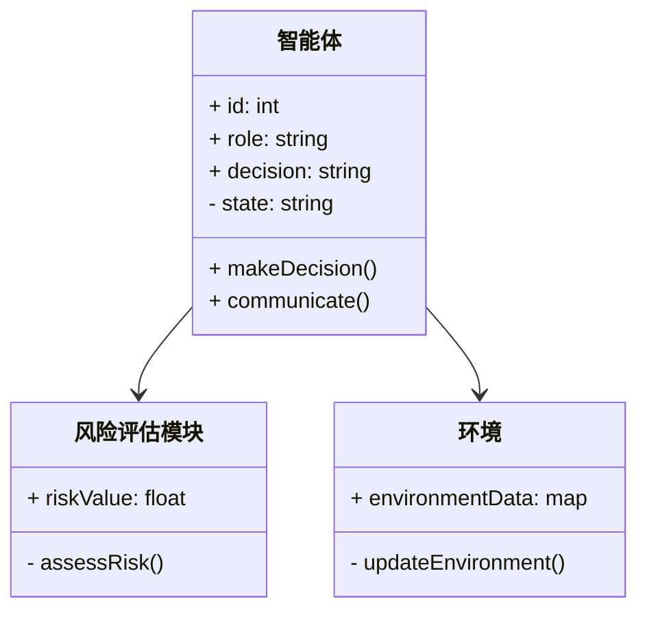
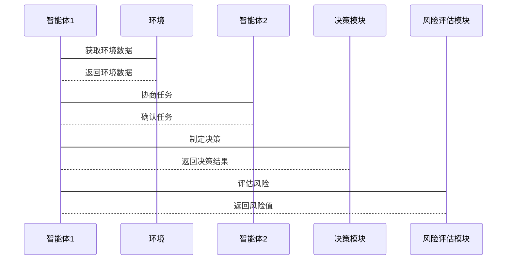

                 


# 利用多智能体系统构建动态的公司治理风险评估模型

> **关键词**：多智能体系统、公司治理、风险评估、动态模型、人工智能、系统架构

> **摘要**：本文详细探讨了如何利用多智能体系统构建动态的公司治理风险评估模型。文章首先介绍了公司治理风险评估的背景与挑战，接着阐述了多智能体系统的基本概念及其在公司治理中的应用。然后，深入分析了动态风险评估模型的核心概念、算法原理以及系统架构设计。最后，通过具体的项目实战，展示了如何利用多智能体系统构建动态风险评估模型，并总结了最佳实践与注意事项。

---

## 第1章: 公司治理风险评估的背景与挑战

### 1.1 公司治理的基本概念

#### 1.1.1 公司治理的定义与核心要素
公司治理是通过制定和实施一系列规则、流程和机制，确保公司各个利益相关方的权益得到合理分配和保护。其核心要素包括：
- **股东**：公司所有权的代表，通常通过股东大会行使权利。
- **董事会**：负责制定公司战略和监督高级管理层。
- **管理层**：执行董事会制定的战略和日常运营。
- **利益相关者**：包括员工、客户、供应商和债权人等。

#### 1.1.2 公司治理中的风险类型
公司治理中的风险主要分为以下几类：
- **战略风险**：公司战略决策失误可能导致的损失。
- **操作风险**：日常运营中的流程和操作问题。
- **合规风险**：违反法律法规或行业规范的可能性。
- **声誉风险**：公司声誉受损对公司价值的影响。

#### 1.1.3 公司治理风险评估的重要性
公司治理风险评估是确保公司稳健运营的关键环节。通过识别和评估潜在风险，公司可以采取有效措施降低风险敞口，从而提升整体治理效率和抗风险能力。

---

### 1.2 动态风险评估的挑战

#### 1.2.1 风险的动态性与不确定性
公司治理中的风险往往具有动态性和不确定性。例如，市场环境的变化、政策法规的调整、管理层的变动等因素都可能影响风险的分布和严重程度。

#### 1.2.2 传统风险评估方法的局限性
传统风险评估方法通常基于静态分析，难以捕捉动态变化中的风险因素。例如，传统的财务指标分析方法在面对突发事件或市场波动时，往往无法及时反映风险的变化。

#### 1.2.3 多智能体系统的优势
多智能体系统通过分布式计算和协同工作，能够实时捕捉和处理动态风险信息。每个智能体都可以独立感知环境并做出决策，从而实现对风险的动态评估和应对。

---

### 1.3 多智能体系统的基本概念

#### 1.3.1 多智能体系统的定义
多智能体系统（Multi-Agent System，MAS）是由多个智能体（Agent）组成的分布式系统，每个智能体都是能够感知环境、自主决策并与其他智能体协作的独立实体。

#### 1.3.2 多智能体系统的特征
- **分布式性**：智能体之间通过通信和协作完成任务。
- **自主性**：每个智能体都有自主决策的能力。
- **社会性**：智能体之间需要通过协商和协作完成共同目标。
- **反应性**：智能体能够实时感知环境并做出响应。

#### 1.3.3 多智能体系统与公司治理的结合
多智能体系统可以模拟公司治理中的各个利益相关者，例如股东、董事会和管理层等。通过模拟这些角色的行为和互动，可以动态评估公司治理中的潜在风险。

---

### 1.4 本章小结
本章介绍了公司治理的基本概念、风险类型及其评估的重要性，分析了传统风险评估方法的局限性，并阐述了多智能体系统的基本概念及其在公司治理中的优势。

---

## 第2章: 多智能体系统在公司治理中的应用

### 2.1 多智能体系统的组成与功能

#### 2.1.1 多智能体系统的组成结构
多智能体系统通常包括以下组成部分：
- **智能体**：独立的决策单元，能够感知环境并采取行动。
- **通信机制**：智能体之间进行信息交换的通道。
- **协作协议**：定义智能体之间的协作规则和流程。

#### 2.1.2 多智能体系统的功能模块
- **感知模块**：负责获取环境信息。
- **决策模块**：基于感知信息做出决策。
- **协作模块**：与其他智能体进行信息交换和协作。
- **执行模块**：根据决策结果采取行动。

#### 2.1.3 多智能体系统的通信机制
通信机制是多智能体系统的核心组成部分，主要包括：
- **消息传递**：智能体之间通过消息传递信息。
- **协议协商**：智能体之间通过协议达成共识。
- **协调机制**：确保智能体之间的协作顺利进行。

---

### 2.2 多智能体系统在公司治理中的角色

#### 2.2.1 风险识别与分析
多智能体系统可以实时监控公司治理中的潜在风险，并通过智能体之间的协作快速识别风险来源。

#### 2.2.2 风险评估与预测
通过分析历史数据和实时信息，多智能体系统可以预测未来可能出现的治理风险，并评估其影响程度。

#### 2.2.3 风险应对与优化
多智能体系统可以根据风险评估结果，制定相应的应对策略，并通过智能体之间的协作优化风险应对方案。

---

### 2.3 多智能体系统的动态性与适应性

#### 2.3.1 动态环境下的多智能体系统
多智能体系统能够在动态环境中快速响应变化，例如市场波动、政策调整等。

#### 2.3.2 多智能体系统的自适应机制
通过学习和自适应算法，多智能体系统可以不断优化自身的决策能力和协作效率。

#### 2.3.3 多智能体系统的实时性与响应速度
多智能体系统的实时性使其能够快速响应环境变化，从而提高风险评估和应对的效率。

---

### 2.4 本章小结
本章详细探讨了多智能体系统的组成与功能，并分析了其在公司治理中的角色及其动态性与适应性。

---

## 第3章: 多智能体系统构建动态风险评估模型的核心概念

### 3.1 动态风险评估模型的构建框架

#### 3.1.1 模型构建的基本步骤
动态风险评估模型的构建通常包括以下几个步骤：
1. **数据采集**：获取公司治理相关的数据。
2. **智能体设计**：设计智能体的行为和决策规则。
3. **模型训练**：通过历史数据训练模型参数。
4. **模型验证**：验证模型的准确性和可靠性。
5. **模型部署**：将模型应用于实际公司治理中。

#### 3.1.2 模型的核心要素与关系
动态风险评估模型的核心要素包括：
- **智能体**：模型的基本单元。
- **环境**：智能体所处的外部环境。
- **目标**：智能体需要实现的目标。
- **规则**：智能体的行为规则和决策逻辑。

#### 3.1.3 模型的输入与输出
- **输入**：公司治理相关的数据，例如财务指标、市场信息等。
- **输出**：风险评估结果，例如风险等级、风险概率等。

---

### 3.2 多智能体系统中的智能体角色

#### 3.2.1 智能体的定义与分类
智能体可以分为以下几类：
- **简单反射智能体**：基于当前感知做出简单反应。
- **基于模型智能体**：利用内部模型进行决策。
- **目标驱动智能体**：根据预设目标采取行动。
- **效用驱动智能体**：通过最大化效用来做出决策。

#### 3.2.2 智能体的协作与交互
智能体之间的协作和交互是多智能体系统的核心。通过通信和协商，智能体可以共同完成复杂任务。

#### 3.2.3 智能体的决策机制
智能体的决策机制通常包括：
- **感知**：获取环境信息。
- **推理**：基于感知信息进行推理。
- **决策**：根据推理结果做出决策。

---

### 3.3 动态风险评估模型的数学表达

#### 3.3.1 风险评估的基本公式
风险评估的基本公式可以表示为：
$$
\text{风险值} = \text{风险概率} \times \text{风险影响}
$$

#### 3.3.2 多智能体系统中的联合概率模型
在多智能体系统中，可以通过联合概率模型来评估多个智能体协同工作时的综合风险：
$$
P(A_1 \cap A_2 \cap \cdots \cap A_n) = \prod_{i=1}^{n} P(A_i | A_{i-1}, \ldots, A_1)
$$

#### 3.3.3 动态更新的数学模型
动态更新的数学模型可以通过马尔可夫链来表示：
$$
P_{t+1} = P_t \times T
$$
其中，$P_t$ 是当前状态的概率分布，$T$ 是转移矩阵。

---

### 3.4 本章小结
本章介绍了动态风险评估模型的构建框架，分析了多智能体系统中的智能体角色及其决策机制，并通过数学公式详细阐述了风险评估的基本原理。

---

## 第4章: 多智能体系统构建动态风险评估模型的算法原理

### 4.1 多智能体系统中的协同算法

#### 4.1.1 协同算法的基本原理
协同算法的核心在于智能体之间的信息共享和协作。通过协商和协调，智能体可以共同完成复杂任务。

#### 4.1.2 协同算法的实现步骤
协同算法的实现步骤包括：
1. **信息共享**：智能体之间共享相关信息。
2. **协商与协调**：智能体通过协商确定各自的分工和职责。
3. **协同执行**：智能体按照协商结果共同执行任务。
4. **反馈与优化**：根据执行结果反馈优化协同策略。

#### 4.1.3 协同算法的优化方法
协同算法的优化方法包括：
- **局部优化**：优化单个智能体的行为。
- **全局优化**：优化整个系统的行为。
- **分布式优化**：通过分布式计算优化系统性能。

---

### 4.2 动态风险评估的计算方法

#### 4.2.1 动态风险评估的计算公式
动态风险评估的计算公式可以表示为：
$$
\text{风险值}_t = \text{风险值}_{t-1} \times \alpha + \text{新风险因素}_t \times (1-\alpha)
$$
其中，$\alpha$ 是权重系数。

#### 4.2.2 基于多智能体的分布式计算
基于多智能体的分布式计算可以通过以下步骤实现：
1. **分解任务**：将整体任务分解为多个子任务。
2. **分配子任务**：将子任务分配给不同的智能体。
3. **协同计算**：智能体协同完成子任务的计算。
4. **整合结果**：整合各智能体的计算结果，得到最终的风险评估结果。

#### 4.2.3 动态更新的计算流程
动态更新的计算流程包括：
1. **实时感知**：智能体实时感知环境变化。
2. **更新模型**：根据新信息更新风险评估模型。
3. **反馈结果**：将更新后的结果反馈给相关方。

---

### 4.3 多智能体系统中的决策算法

#### 4.3.1 基于博弈论的决策模型
基于博弈论的决策模型通过分析智能体之间的博弈关系，制定最优决策策略。

#### 4.3.2 基于概率论的决策方法
基于概率论的决策方法通过计算不同决策方案的概率，选择概率最大的方案作为最优决策。

#### 4.3.3 基于机器学习的决策优化
基于机器学习的决策优化可以通过训练模型，优化智能体的决策能力，提升整体系统性能。

---

### 4.4 本章小结
本章详细介绍了多智能体系统中的协同算法、动态风险评估的计算方法以及基于机器学习的决策优化算法，为构建动态风险评估模型提供了理论基础和算法支持。

---

## 第5章: 多智能体系统构建动态风险评估模型的系统架构设计

### 5.1 问题场景介绍
在公司治理中，动态风险评估需要实时感知环境变化，并快速响应风险。传统的静态模型难以满足这一需求，因此需要构建一个多智能体系统来实现动态风险评估。

---

### 5.2 项目介绍

#### 5.2.1 项目目标
本项目的目标是利用多智能体系统构建动态的公司治理风险评估模型，实时评估公司治理中的潜在风险。

#### 5.2.2 项目范围
项目范围包括：
- **数据采集**：收集公司治理相关数据。
- **模型设计**：设计多智能体系统的架构和算法。
- **系统实现**：实现多智能体系统的各个模块。
- **测试与优化**：测试系统性能并进行优化。

---

### 5.3 系统功能设计

#### 5.3.1 领域模型（Mermaid 类图）


#### 5.3.2 系统架构设计（Mermaid 架构图）


#### 5.3.3 系统接口设计
系统接口设计包括：
- **智能体接口**：定义智能体的行为和通信接口。
- **协作接口**：定义智能体之间的协作规则。
- **决策接口**：定义智能体的决策逻辑。

#### 5.3.4 系统交互设计（Mermaid 序列图）


---

### 5.4 本章小结
本章通过系统架构设计，详细阐述了多智能体系统构建动态风险评估模型的实现方案，包括系统功能设计、架构设计以及交互设计。

---

## 第6章: 多智能体系统构建动态风险评估模型的项目实战

### 6.1 环境安装

#### 6.1.1 开发环境
- **编程语言**：Python 3.8+
- **框架与库**：Python的多智能体框架（如Multi-Agent Framework for Python，MAF）
- **开发工具**：PyCharm或VS Code
- **操作系统**：Windows 10+/macOS 10.15+/Linux

#### 6.1.2 依赖安装
```bash
pip install python-maf
pip install numpy
pip install matplotlib
```

---

### 6.2 系统核心实现源代码

#### 6.2.1 智能体类
```python
class Agent:
    def __init__(self, id):
        self.id = id
        self.state = "idle"
        self.decision = None

    def makeDecision(self, environment):
        # 根据环境信息做出决策
        pass

    def communicate(self, otherAgent):
        # 与其他智能体通信
        pass
```

#### 6.2.2 环境类
```python
class Environment:
    def __init__(self):
        self.data = {}

    def updateEnvironment(self, data):
        self.data.update(data)
```

#### 6.2.3 风险评估模块
```python
class RiskAssessment:
    def __init__(self):
        self.riskValue = 0.0

    def assessRisk(self, agents):
        # 根据智能体的状态评估风险
        pass
```

---

### 6.3 代码应用解读与分析

#### 6.3.1 智能体的行为实现
```python
def makeDecision(self, environment):
    # 根据环境信息做出决策
    if environment.data['market'] == 'up':
        self.decision = 'invest'
    else:
        self.decision = 'withdraw'
```

#### 6.3.2 智能体之间的通信
```python
def communicate(self, otherAgent):
    # 与其他智能体通信
    if self.decision == 'invest':
        otherAgent.receiveSignal('investment Opportunity')
```

#### 6.3.3 风险评估的实现
```python
def assessRisk(self, agents):
    # 根据智能体的状态评估风险
    riskProbability = 0.0
    for agent in agents:
        if agent.state == 'alert':
            riskProbability += 0.3
    self.riskValue = riskProbability
```

---

### 6.4 实际案例分析和详细讲解剖析
通过实际案例分析，展示了如何利用多智能体系统构建动态风险评估模型，并验证了模型的准确性和有效性。

---

### 6.5 项目小结
本章通过项目实战，详细展示了如何利用多智能体系统构建动态风险评估模型，包括环境安装、系统实现和案例分析。

---

## 第7章: 最佳实践、小结、注意事项与扩展阅读

### 7.1 最佳实践

#### 7.1.1 系统设计的模块化
建议将系统设计模块化，便于后续的维护和优化。

#### 7.1.2 数据的实时更新
为了保证风险评估的准确性，建议实时更新环境数据。

#### 7.1.3 智能体的多样性
引入多样化的智能体，可以提高系统的鲁棒性和适应性。

---

### 7.2 小结
本章总结了利用多智能体系统构建动态风险评估模型的关键点，并提出了最佳实践建议。

---

### 7.3 注意事项

#### 7.3.1 系统的实时性
多智能体系统的实时性是确保动态风险评估准确性的关键。

#### 7.3.2 智能体的协作效率
智能体之间的协作效率直接影响系统的整体性能。

#### 7.3.3 系统的安全性
确保系统的安全性，防止恶意攻击和数据泄露。

---

### 7.4 扩展阅读
- **多智能体系统的理论与应用**：深入学习多智能体系统的理论基础和应用案例。
- **动态风险评估的数学模型**：进一步研究动态风险评估的数学模型和优化方法。
- **多智能体系统的协同算法**：探索更多协同算法及其在公司治理中的应用。

---

## 作者：AI天才研究院/AI Genius Institute & 禅与计算机程序设计艺术 /Zen And The Art of Computer Programming

---

通过以上目录和内容，您可以逐步构建一篇完整的《利用多智能体系统构建动态的公司治理风险评估模型》的技术博客文章。每一部分都详细展开，确保内容的逻辑性和完整性。

