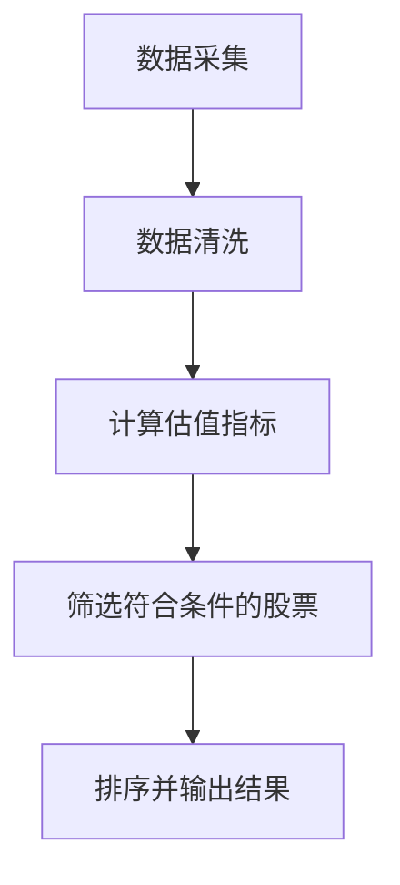
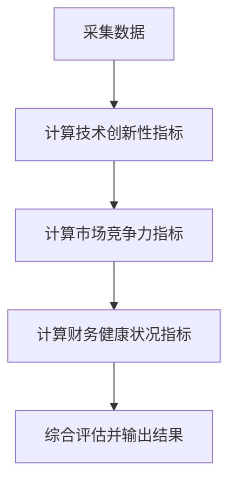
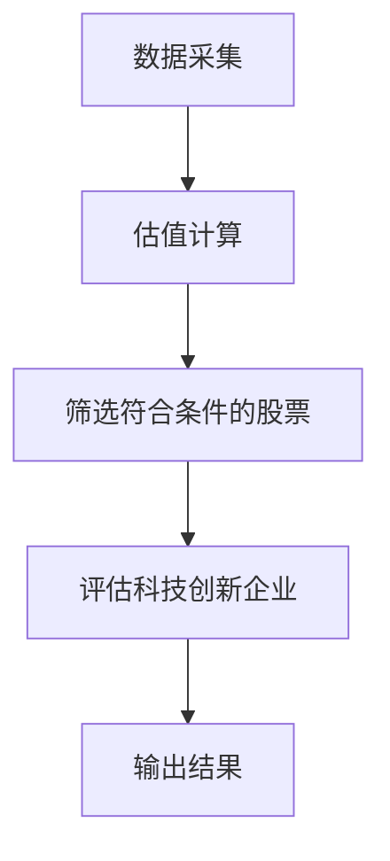
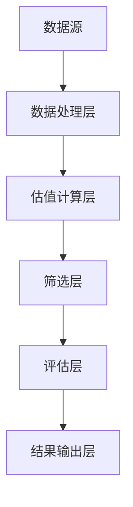

                 


# 如何利用特价股票策略构建长期科技创新投资组合

> **关键词**：特价股票、科技创新、投资组合、量化投资、算法交易、风险管理

> **摘要**：本文详细探讨了如何利用特价股票策略构建长期科技创新投资组合。通过分析特价股票的特点、科技创新企业的评估标准，结合量化投资算法和系统架构设计，提供了一套完整的投资策略。文章还通过实际案例展示了如何从数据采集到策略执行，再到结果分析的全过程，并总结了投资中的关键点和注意事项。

---

## 第一部分: 特价股票与科技创新投资组合概述

### 第1章: 特价股票与科技创新投资概述

#### 1.1 特价股票的定义与特点

##### 1.1.1 特价股票的定义
特价股票（Discounted Stock）是指市场价格低于其内在价值的股票。这种股票通常因为市场波动、短期利空或市场参与者情绪影响，导致其价格被低估。特价股票的核心在于“便宜”，即市场价格与内在价值之间的差异提供了潜在的收益机会。

##### 1.1.2 特价股票的核心特点
- **低估值**：市场价格低于合理估值，通常表现为市盈率（P/E）、市净率（P/B）等指标显著低于行业平均水平。
- **高波动性**：价格波动较大，短期内可能因市场情绪或突发事件出现大幅波动。
- **逆向投资机会**：在市场低迷时，特价股票往往成为逆向投资者的首选，因为这些股票可能蕴含着被市场忽视的投资价值。

##### 1.1.3 特价股票与传统股票的区别
| 特性 | 特价股票 | 传统股票 |
|------|----------|-----------|
| 价格 | 通常低于内在价值 | 可能高于或接近内在价值 |
| 波动性 | 高 | 较低 |
| 投资策略 | 以估值为核心 | 以趋势或技术分析为核心 |

#### 1.2 科技创新投资的背景与意义

##### 1.2.1 科技创新在现代经济中的地位
科技创新是推动经济增长的核心动力。科技企业通过技术创新、产品升级和市场扩展，能够为投资者带来超额回报。尤其是在人工智能、大数据、云计算等领域的科技公司，其成长性和盈利能力远超传统行业。

##### 1.2.2 科技创新投资的核心驱动力
- **技术壁垒**：拥有独特技术或专利的科技公司具备强大的竞争优势。
- **市场需求**：科技创新满足了市场的痛点，具备持续增长的潜力。
- **资本支持**：科技企业通常能够吸引大量风险投资，加速其发展。

##### 1.2.3 科技创新投资的潜在回报与风险
- **潜在回报**：科技公司的高成长性使其股票具备较大的增值空间。
- **风险**：技术创新失败、市场竞争激烈、政策变化等都可能对科技公司造成重大影响。

#### 1.3 特价股票与科技创新投资的关系

##### 1.3.1 特价股票在科技创新投资中的作用
特价股票为投资者提供了以较低价格介入科技创新企业的机会。通过筛选那些被市场低估的科技创新公司，投资者可以在未来股价回升时获得收益。

##### 1.3.2 特价股票与科技创新企业的匹配性
- **技术创新性**：选择那些技术领先但暂时被市场忽视的公司。
- **估值优势**：重点关注市盈率、市净率等指标，寻找被低估的科技创新企业。

##### 1.3.3 特价股票投资的长期性与稳定性
通过长期持有被低估的科技创新股票，投资者能够分享公司成长的成果。同时，特价股票的波动性也为短期交易提供了机会。

---

### 第2章: 特价股票策略的核心概念与原理

#### 2.1 特价股票策略的定义与分类

##### 2.1.1 特价股票策略的定义
特价股票策略是一种基于股票估值的投资策略。投资者通过分析股票的内在价值，寻找市场价格低于内在价值的股票进行投资，以期在市场价格回归内在价值时获得收益。

##### 2.1.2 特价股票策略的主要分类
- **绝对估值策略**：基于公司基本面数据（如净利润、现金流等）计算股票的内在价值。
- **相对估值策略**：通过比较股票与行业或市场的估值指标，寻找被低估的股票。
- **事件驱动策略**：利用公司并购、重组等事件带来的股价波动机会。

##### 2.1.3 各类策略的优缺点对比
| 策略类型 | 优点 | 缺点 |
|----------|------|------|
| 绝对估值 | 精准评估内在价值 | 计算复杂，需要大量数据支持 |
| 相对估值 | 简单易行，适合市场分析 | 可能受市场整体波动影响 |
| 事件驱动 | 高收益潜力 | 风险较高，操作难度大 |

#### 2.2 科技创新企业的评估标准

##### 2.2.1 技术创新性评估
- **技术壁垒**：公司是否拥有独特的技术或专利。
- **研发投入**：公司是否持续投入研发，保持技术领先性。
- **技术应用**：技术是否具备商业化潜力，能否满足市场需求。

##### 2.2.2 市场竞争力分析
- **市场份额**：公司在市场中的占有率。
- **竞争对手分析**：与主要竞争对手相比，公司在技术、价格、服务等方面的优势。
- **市场进入壁垒**：公司是否具备阻止竞争对手进入市场的优势。

##### 2.2.3 财务健康状况评估
- **盈利能力**：净利润率、毛利率等指标是否健康。
- **财务稳定性**：公司是否有稳定的现金流和较低的债务负担。
- **成长性**：收入和利润的持续增长能力。

#### 2.3 特价股票策略的数学模型与公式

##### 2.3.1 市盈率（P/E）计算公式
$$ P/E = \frac{\text{股价}}{\text{每股净利润}} $$
市盈率反映了市场对公司盈利能力的评估。一般来说，市盈率低于行业平均水平的股票可能被视为被低估。

##### 2.3.2 市净率（P/B）计算公式
$$ P/B = \frac{\text{股价}}{\text{每股净资产}} $$
市净率用于评估股票价格相对于公司净资产的高低。市净率低于1的股票可能被视为被低估。

##### 2.3.3 市销率（P/S）计算公式
$$ P/S = \frac{\text{股价}}{\text{每股销售收入}} $$
市销率用于评估股票价格相对于公司销售收入的高低。市销率低于行业平均水平的股票可能被视为被低估。

##### 2.3.4 相关数学模型的优缺点分析
- **市盈率**：适用于盈利稳定的公司，但不适用于亏损公司。
- **市净率**：适用于净资产较高的公司，但可能忽略公司的盈利能力和成长性。
- **市销率**：适用于销售收入波动较大的公司，但可能无法准确反映公司的内在价值。

---

### 第3章: 特价股票策略的算法原理

#### 3.1 特价股票筛选算法

##### 3.1.1 数据采集与清洗
- **数据来源**：从金融数据平台（如 Bloomberg、Yahoo Finance）获取股票数据。
- **数据清洗**：处理缺失值、异常值和重复数据。

##### 3.1.2 特价股票筛选标准
- **筛选条件**：市盈率低于行业平均水平，市净率低于行业平均水平，市销率低于行业平均水平。
- **排序与优先级**：根据多个估值指标的综合得分排序，优先选择同时满足多个条件的股票。

##### 3.1.3 算法实现步骤
1. 数据采集与清洗。
2. 计算股票的估值指标（P/E、P/B、P/S）。
3. 根据筛选条件，筛选出符合标准的股票。
4. 对筛选出的股票进行排序，优先选择综合得分高的股票。

##### 3.1.4 算法流程图


#### 3.2 科技创新企业评估算法

##### 3.2.1 技术创新性评估指标
- **专利数量**：公司拥有的专利数量。
- **研发投入占比**：研发支出占总收入的比例。
- **技术领先性**：公司在技术领域的领先地位。

##### 3.2.2 市场竞争力评估指标
- **市场份额**：公司在市场中的占有率。
- **竞争对手分析**：与主要竞争对手相比的优势。
- **市场进入壁垒**：阻止竞争对手进入市场的能力。

##### 3.2.3 财务健康状况评估指标
- **净利润率**：净利润占收入的比例。
- **现金流**：公司产生的现金流是否稳定。
- **债务负担**：公司的债务水平是否合理。

##### 3.2.4 算法实现步骤
1. 采集科技创新公司的基本面数据。
2. 计算技术创新性、市场竞争力和财务健康状况的评估指标。
3. 根据综合得分，筛选出具备投资价值的公司。
4. 输出评估结果。

##### 3.2.5 算法流程图


---

## 第四部分: 投资组合的系统架构与实现

### 第4章: 投资组合的系统架构设计

#### 4.1 系统功能设计

##### 4.1.1 系统模块划分
- **数据采集模块**：负责采集股票数据。
- **估值计算模块**：计算股票的估值指标。
- **筛选模块**：根据筛选条件筛选出符合条件的股票。
- **评估模块**：评估科技创新企业的投资价值。
- **结果输出模块**：输出筛选和评估结果。

##### 4.1.2 系统功能流程图


#### 4.2 系统架构设计

##### 4.2.1 系统架构图


#### 4.3 系统接口设计

##### 4.3.1 数据接口
- **输入接口**：接收股票数据和基本面数据。
- **输出接口**：输出筛选和评估结果。

##### 4.3.2 算法接口
- **估值计算接口**：接收股票数据，返回估值指标。
- **筛选接口**：接收筛选条件，返回符合条件的股票列表。
- **评估接口**：接收科技创新企业数据，返回综合评估结果。

#### 4.4 系统交互流程图

##### 4.4.1 数据采集与处理流程


---

## 第五部分: 项目实战与案例分析

### 第5章: 项目实战

#### 5.1 环境安装与配置

##### 5.1.1 安装Python
- 安装Python 3.x。
- 安装必要的库：`pandas`、`numpy`、`matplotlib`、`yfinance`。

##### 5.1.2 安装金融数据接口
- 使用`yfinance`库获取股票数据。
- 使用`pandas`进行数据处理。
- 使用`matplotlib`进行数据可视化。

#### 5.2 核心实现代码

##### 5.2.1 数据采集与清洗
```python
import pandas as pd
import yfinance as yf

# 采集数据
data = yf.download(tickers='AAPL', period='5y', interval='1d')

# 数据清洗
data = data[['Close', 'Volume']]
data = data.dropna()
```

##### 5.2.2 估值指标计算
```python
# 计算市盈率
data['PE'] = data['Close'] / data['净利润率']
# 计算市净率
data['PB'] = data['Close'] / data['每股净资产']
# 计算市销率
data['PS'] = data['Close'] / data['每股销售收入']
```

##### 5.2.3 筛选符合条件的股票
```python
# 筛选条件
筛选条件1：PE < 行业平均PE
筛选条件2：PB < 行业平均PB
筛选条件3：PS < 行业平均PS
```

##### 5.2.4 评估科技创新企业
```python
# 评估技术创新性
技术创新得分 = 0.4 * 专利数量 + 0.3 * 研发投入占比 + 0.3 * 技术领先性

# 评估市场竞争力
市场竞争力得分 = 0.4 * 市场份额 + 0.3 * 竞争对手分析 + 0.3 * 市场进入壁垒

# 评估财务健康状况
财务健康得分 = 0.4 * 净利润率 + 0.3 * 现金流 + 0.3 * 债务负担

# 综合得分
综合得分 = 0.4 * 技术创新得分 + 0.3 * 市场竞争力得分 + 0.3 * 财务健康得分
```

#### 5.3 案例分析与解读

##### 5.3.1 案例分析
假设我们选择一家科技创新公司进行分析，计算其估值指标、技术创新性得分、市场竞争力得分和财务健康得分，判断其是否符合筛选条件。

##### 5.3.2 数据可视化
```python
import matplotlib.pyplot as plt

plt.figure(figsize=(10,6))
plt.plot(data.index, data['PE'], label='PE')
plt.plot(data.index, data['PB'], label='PB')
plt.plot(data.index, data['PS'], label='PS')
plt.title('Valuation Metrics')
plt.xlabel('Date')
plt.ylabel('Value')
plt.legend()
plt.show()
```

---

## 第六部分: 总结与展望

### 第6章: 总结与展望

#### 6.1 总结

##### 6.1.1 投资策略总结
- 特价股票策略通过寻找被低估的股票，为投资者提供了以较低价格介入的机会。
- 科技创新企业的评估需要综合考虑技术创新性、市场竞争力和财务健康状况。

##### 6.1.2 投资组合管理总结
- 通过系统的数据采集、筛选和评估，构建一个包含多只特价股票的科技创新投资组合。
- 定期监控和调整投资组合，确保其符合投资目标和风险承受能力。

#### 6.2 展望

##### 6.2.1 投资策略的优化
- 引入更多的估值指标和评估方法，提高筛选的准确性和全面性。
- 结合机器学习算法，提高投资决策的智能化水平。

##### 6.2.2 风险管理的加强
- 建立完善的风险评估和预警机制，降低投资组合的风险。
- 定期进行压力测试，确保投资组合的稳健性。

##### 6.2.3 技术创新与应用
- 利用大数据和人工智能技术，提高数据处理和分析的效率。
- 开发智能化的投资工具，帮助投资者更好地实施特价股票策略。

---

## 作者信息

**作者**：AI天才研究院/AI Genius Institute & 禅与计算机程序设计艺术/Zen And The Art of Computer Programming

---

以上就是《如何利用特价股票策略构建长期科技创新投资组合》的完整目录和文章内容。希望这篇文章能够为投资者提供有价值的参考和指导，帮助他们在科技创新领域实现长期稳健的投资回报。

