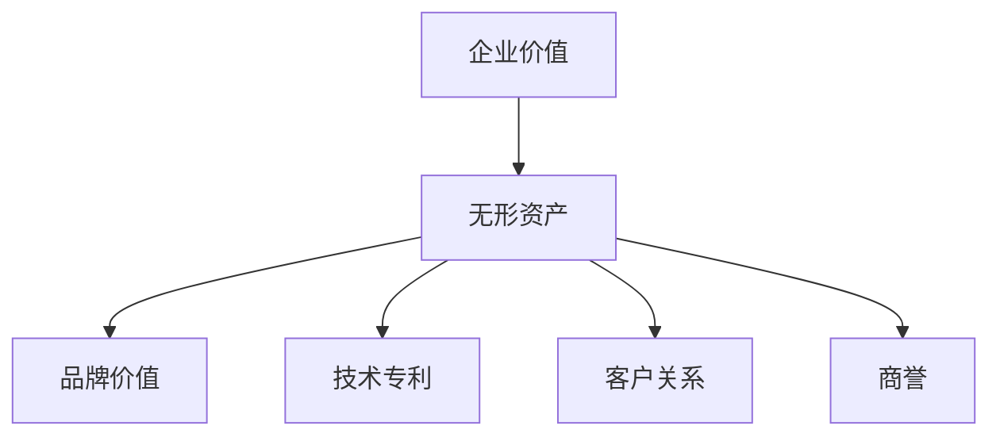
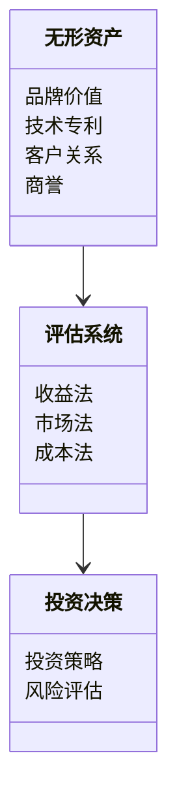
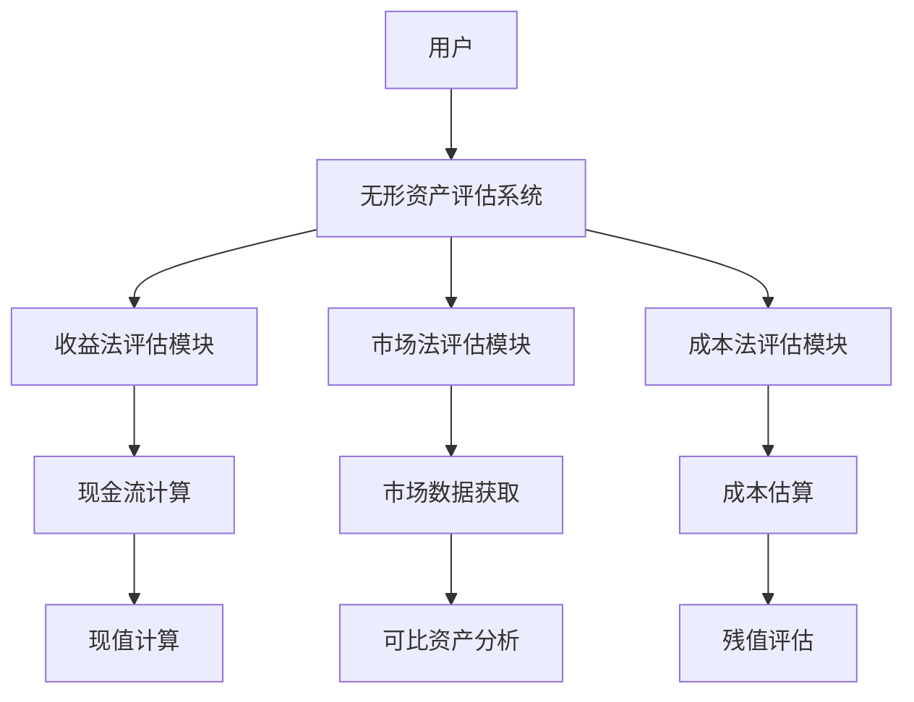

                 


# 彼得林奇如何看待公司的无形资产价值

> 关键词：彼得·林奇，无形资产，投资价值，企业价值评估，现金流折现法，市场比较法，算法原理，系统架构

> 摘要：本文深入探讨彼得·林奇对公司的无形资产价值的看法，从核心概念、评估方法到实际案例，结合数学模型和系统架构，分析无形资产在投资中的重要性及其对投资决策的影响。通过详细讲解算法原理和项目实战，帮助读者理解如何在实际投资中应用这些方法。

---

## 第1章：彼得·林奇与无形资产的价值观

### 1.1 彼得·林奇的背景与投资理念

#### 1.1.1 彼得·林奇的生平简介
彼得·林奇（Peter Lynch）是美国著名的投资专家，以其在富达投资集团（Fidelity Investments）的长期管理经验和卓越的投资业绩闻名。他以寻找被市场低估的股票而著称，尤其擅长分析公司的基本面，包括无形资产的价值。林奇的投资哲学强调长期增长和深入的企业分析，认为公司价值的核心不仅在于有形资产，更在于无形资产的潜力。

#### 1.1.2 彼得·林奇的投资哲学
林奇的投资哲学强调“深入研究企业”，他主张投资者应该像企业分析师一样，仔细研究公司的财务报表、市场地位、竞争优势和管理团队。他认为，无形资产是企业长期竞争优势的关键因素，例如品牌价值、技术专利、客户关系和企业文化等。

#### 1.1.3 无形资产在投资中的重要性
林奇认为，无形资产是企业价值的重要组成部分。例如，强大的品牌可以带来更高的定价能力，优秀的管理团队可以提升企业的运营效率，而技术专利则能为公司提供独特的市场竞争力。这些无形资产往往无法在资产负债表中完全体现，但它们对企业的长期价值和股价表现具有决定性影响。

---

### 1.2 无形资产的定义与分类

#### 1.2.1 无形资产的定义
无形资产是指企业拥有或控制的没有实物形态的长期资产，通常包括品牌价值、技术专利、客户关系、商誉、知识产权等。这些资产无法被触摸或看到，但它们能够为企业创造持续的经济价值。

#### 1.2.2 无形资产的分类
无形资产可以分为以下几类：
1. **品牌价值**：品牌是企业的核心资产，强大的品牌可以带来更高的客户忠诚度和市场影响力。
2. **技术专利**：专利技术是企业的独特竞争优势，能够保护企业的创新成果。
3. **客户关系**：优质的客户关系是企业长期稳定的收入来源。
4. **商誉**：商誉是企业整体价值超过有形资产的部分，反映了企业的市场地位和盈利能力。
5. **知识产权**：包括商标、版权、专利等，是企业的重要无形资产。

#### 1.2.3 无形资产与有形资产的区别
- **有形资产**：如土地、建筑物、设备等，具有实物形态，容易量化和评估。
- **无形资产**：没有实物形态，难以直接衡量，但对企业的长期价值贡献更大。

---

### 1.3 无形资产对投资决策的影响

#### 1.3.1 无形资产如何影响企业价值
无形资产能够通过提高企业的市场地位、降低成本、增加收入等方式，间接影响企业的盈利能力。例如，强大的品牌可以提高产品的售价，从而增加企业的利润。

#### 1.3.2 无形资产在企业竞争力中的作用
- 无形资产可以增强企业的竞争优势，例如技术创新、品牌影响力和客户忠诚度。
- 无形资产能够提高企业的市场进入壁垒，防止竞争对手的模仿。

#### 1.3.3 无形资产的风险与机会
- **风险**：无形资产的价值可能受到市场变化、竞争压力和技术进步的影响。例如，技术专利可能被替代，品牌价值可能因负面新闻而受损。
- **机会**：通过优化无形资产的管理和投资，企业可以实现持续的价值增长，例如通过创新保持技术领先地位。

---

## 第2章：无形资产的核心概念与属性

### 2.1 无形资产的核心要素

#### 2.1.1 无形资产的构成要素
- **品牌价值**：包括品牌知名度、品牌忠诚度和品牌声誉。
- **技术专利**：包括技术的先进性、实用性和独特性。
- **客户关系**：包括客户数量、客户忠诚度和客户满意度。
- **商誉**：包括企业的盈利能力、市场地位和管理团队的效率。

#### 2.1.2 核心概念的实体关系图（Mermaid流程图）



---

### 2.2 无形资产的属性对比表

| 属性           | 有形资产       | 无形资产       |
|----------------|---------------|----------------|
| 是否有形       | 有            | 无              |
| 可见性         | 高            | 低              |
| 评估难度       | 中            | 高              |
| 对企业价值影响 | 重要           | 更重要           |

---

## 第3章：无形资产的评估方法与数学模型

### 3.1 无形资产评估的原理

#### 3.1.1 无形资产评估的基本原理
无形资产评估通常基于以下几个方面：
1. **收益法**：通过预测未来现金流来评估资产价值。
2. **市场法**：通过比较类似资产的市场交易价格来评估。
3. **成本法**：通过估算资产的重置成本来评估。

#### 3.1.2 无形资产评估的数学模型

##### 3.1.2.1 现金流折现法（DCF模型）
DCF模型是评估无形资产价值的常用方法，其基本公式为：

$$
\text{现值} = \sum_{t=1}^{n} \frac{\text{现金流}_t}{(1 + r)^t} + \frac{\text{残值}}{(1 + r)^n}
$$

其中，\( r \) 是折现率，\( n \) 是资产的经济寿命。

##### 3.1.2.2 市场比较法
市场比较法基于类似资产的市场交易价格，通过调整可比资产的交易价格来评估目标资产的价值。公式如下：

$$
\text{目标资产价值} = \text{可比资产平均交易价格} \times \text{调整系数}
$$

---

### 3.2 常用无形资产评估算法

#### 3.2.1 现金流量折现法（DCF模型）

##### 3.2.1.1 实现步骤
1. **预测未来现金流**：估计无形资产在未来的现金流。
2. **确定折现率**：选择合适的折现率，通常使用资本成本或市场利率。
3. **计算现值**：将未来现金流折现，求和得到现值。
4. **评估残值**：考虑资产的残值或终止价值。

##### 3.2.1.2 Python代码实现

```python
def calculateDCF(cash_flows, discount_rate, residual_value):
    n = len(cash_flows)
    present_value = 0
    for t in range(n):
        cash_flow = cash_flows[t]
        pv = cash_flow / (1 + discount_rate) ** t
        present_value += pv
    if residual_value:
        present_value += residual_value / (1 + discount_rate) ** n
    return present_value

# 示例数据
cash_flows = [100, 200, 300, 400]
discount_rate = 0.1
residual_value = 500
n = len(cash_flows)

DCF_value = calculateDCF(cash_flows, discount_rate, residual_value)
print(f"DCF现值：{DCF_value:.2f}")
```

---

#### 3.2.2 市场比较法

##### 3.2.2.1 实现步骤
1. **收集可比资产的交易数据**：找到与目标资产相似的交易案例。
2. **计算可比资产的平均交易价格**：对可比资产的交易价格进行平均。
3. **确定调整系数**：根据目标资产与可比资产的差异进行调整。
4. **计算目标资产价值**：使用公式 \( \text{目标资产价值} = \text{可比资产平均交易价格} \times \text{调整系数} \)。

##### 3.2.2.2 Python代码实现

```python
def market_comparison_method(comparable_prices, adjustment_factor):
    average_price = sum(comparable_prices) / len(comparable_prices)
    target_value = average_price * adjustment_factor
    return target_value

# 示例数据
comparable_prices = [150, 200, 250]
adjustment_factor = 1.2

target_value = market_comparison_method(comparable_prices, adjustment_factor)
print(f"目标资产价值：{target_value:.2f}")
```

---

## 第4章：彼得·林奇的无形资产投资策略

### 4.1 彼得·林奇的投资策略

#### 4.1.1 识别具有强大无形资产的公司
林奇在选择投资标的时，特别关注那些具有强大无形资产的公司，例如具有强大品牌、技术领先和优质客户关系的企业。

#### 4.1.2 评估无形资产对投资决策的影响
林奇通过分析公司的财务报表、市场地位和管理团队，评估无形资产对投资价值的影响。他强调，无形资产是企业长期竞争优势的关键。

---

### 4.2 投资策略的案例分析

#### 4.2.1 案例一：可口可乐

##### 案例背景
可口可乐是一家全球知名的饮料公司，其品牌价值极高。林奇认为，可口可乐的品牌是其核心资产，能够为其带来持续的市场优势和盈利能力。

##### 分析过程
1. **品牌价值**：可口可乐的品牌在全球范围内具有极高的知名度和忠诚度。
2. **市场地位**：可口可乐是全球最大的饮料公司之一，拥有广泛的分销网络。
3. **财务表现**：可口可乐的财务报表显示，其品牌价值对其股价和市值有重要影响。

##### 结论
林奇认为，可口可乐的品牌价值是其长期竞争优势的核心，因此他将其视为具有长期投资价值的公司。

---

#### 4.2.2 案例二：微软

##### 案例背景
微软是一家全球领先的科技公司，其软件技术和知识产权是其核心资产。林奇认为，微软的技术专利和软件开发能力是其长期竞争优势的关键。

##### 分析过程
1. **技术专利**：微软拥有多项软件技术和专利，能够保护其创新成果。
2. **客户关系**：微软与全球众多企业和个人用户建立了稳定的客户关系。
3. **财务表现**：微软的财务报表显示，其技术专利和客户关系为其带来了持续的收入和利润。

##### 结论
林奇认为，微软的技术专利和客户关系是其长期竞争优势的核心，因此他将其视为具有长期投资价值的公司。

---

## 第5章：系统分析与架构设计方案

### 5.1 系统功能设计（领域模型）

#### 5.1.1 领域模型设计
以下是无形资产评估系统的领域模型：



---

### 5.2 系统架构设计

#### 5.2.1 系统架构图



---

## 第6章：项目实战

### 6.1 环境安装

#### 6.1.1 安装Python和相关库
需要安装Python 3.x及以上版本，并安装以下库：
- `numpy`
- `pandas`
- `scipy`
- `mermaid`

安装命令：
```bash
pip install numpy pandas scipy mermaid
```

---

### 6.2 系统核心实现源代码

#### 6.2.1 收益法评估模块

```python
import numpy as np
import pandas as pd

def calculateDCF(cash_flows, discount_rate, residual_value):
    n = len(cash_flows)
    present_value = 0
    for t in range(n):
        cash_flow = cash_flows[t]
        pv = cash_flow / (1 + discount_rate) ** t
        present_value += pv
    if residual_value:
        present_value += residual_value / (1 + discount_rate) ** n
    return present_value

# 示例数据
cash_flows = [100, 200, 300, 400]
discount_rate = 0.1
residual_value = 500
n = len(cash_flows)

DCF_value = calculateDCF(cash_flows, discount_rate, residual_value)
print(f"DCF现值：{DCF_value:.2f}")
```

---

#### 6.2.2 市场比较法评估模块

```python
def market_comparison_method(comparable_prices, adjustment_factor):
    average_price = sum(comparable_prices) / len(comparable_prices)
    target_value = average_price * adjustment_factor
    return target_value

# 示例数据
comparable_prices = [150, 200, 250]
adjustment_factor = 1.2

target_value = market_comparison_method(comparable_prices, adjustment_factor)
print(f"目标资产价值：{target_value:.2f}")
```

---

### 6.3 案例分析与详细解读

#### 6.3.1 案例分析
假设我们有一家科技公司，其未来五年的现金流分别为100万、150万、200万、250万和300万，折现率为10%，残值为500万。我们可以通过DCF模型计算其现值。

##### 计算过程
1. 计算各年的现值：
   - 第一年：100万 / 1.1 ≈ 90.91万
   - 第二年：150万 / 1.21 ≈ 123.96万
   - 第三年：200万 / 1.331 ≈ 150.57万
   - 第四年：250万 / 1.4641 ≈ 170.54万
   - 第五年：300万 / 1.6105 ≈ 186.48万
2. 计算现值总和：90.91 + 123.96 + 150.57 + 170.54 + 186.48 ≈ 722.46万
3. 加上残值现值：500万 / 1.6105 ≈ 310.50万
4. 总现值：722.46万 + 310.50万 ≈ 1032.96万

##### 结论
通过DCF模型计算，该无形资产的现值约为1032.96万元。

---

## 第7章：结论与展望

### 7.1 结论

彼得·林奇认为，无形资产是企业价值的重要组成部分，对投资决策具有重要影响。通过深入分析无形资产的核心概念、评估方法和实际案例，我们可以更好地理解如何在投资中识别和利用无形资产的价值。

---

### 7.2 最佳实践 tips

- **长期投资**：关注具有强大无形资产的公司，进行长期投资。
- **深入研究**：通过财务报表和市场分析，深入研究企业的无形资产。
- **风险控制**：合理评估无形资产的风险，避免过度依赖单一资产。

---

### 7.3 注意事项

- **数据来源**：确保数据的准确性和可靠性。
- **模型适用性**：根据具体情况选择合适的评估模型。
- **动态调整**：根据市场变化和企业情况，动态调整评估模型和投资策略。

---

### 7.4 拓展阅读

- **《彼得·林奇的成功投资》**：深入探讨彼得·林奇的投资哲学和策略。
- **《无形资产评估方法》**：详细介绍无形资产评估的数学模型和实际应用。

---

## 附录

### 附录A：现金流折现法的Python代码

```python
import numpy as np
import pandas as pd

def calculateDCF(cash_flows, discount_rate, residual_value):
    n = len(cash_flows)
    present_value = 0
    for t in range(n):
        cash_flow = cash_flows[t]
        pv = cash_flow / (1 + discount_rate) ** t
        present_value += pv
    if residual_value:
        present_value += residual_value / (1 + discount_rate) ** n
    return present_value

# 示例数据
cash_flows = [100, 200, 300, 400]
discount_rate = 0.1
residual_value = 500
n = len(cash_flows)

DCF_value = calculateDCF(cash_flows, discount_rate, residual_value)
print(f"DCF现值：{DCF_value:.2f}")
```

---

### 附录B：市场比较法的Python代码

```python
def market_comparison_method(comparable_prices, adjustment_factor):
    average_price = sum(comparable_prices) / len(comparable_prices)
    target_value = average_price * adjustment_factor
    return target_value

# 示例数据
comparable_prices = [150, 200, 250]
adjustment_factor = 1.2

target_value = market_comparison_method(comparable_prices, adjustment_factor)
print(f"目标资产价值：{target_value:.2f}")
```

---

## 作者

作者：AI天才研究院/AI Genius Institute & 禅与计算机程序设计艺术 /Zen And The Art of Computer Programming

---

**注意事项**：本文中的代码示例仅为教学用途，实际应用中需根据具体情况进行调整。

