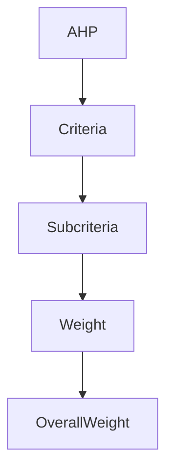
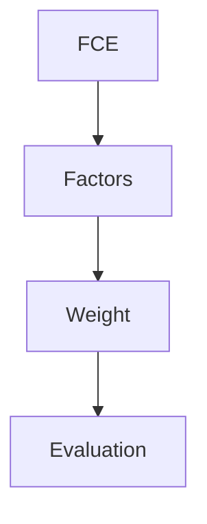
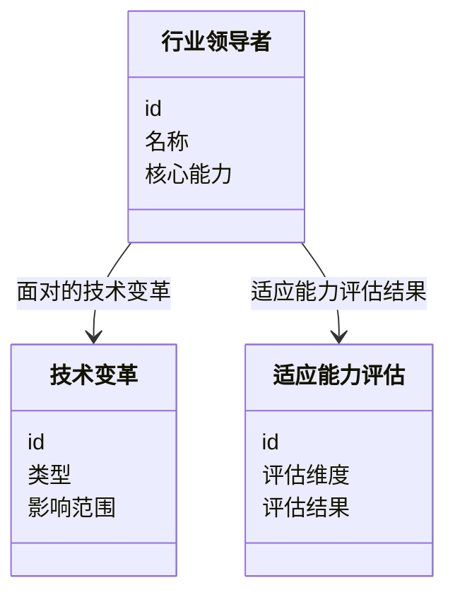
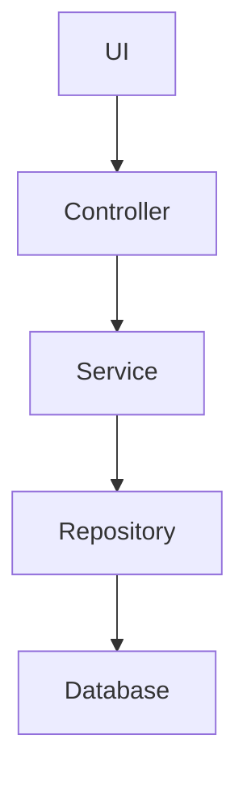

                 


# 彼得林奇的"行业领导者"在技术变革中的适应能力评估

## 关键词：彼得林奇、行业领导者、技术变革、适应能力、评估模型

## 摘要：本文通过分析技术变革对企业领导者的适应能力要求，提出了一套基于层次分析法和模糊综合评价法的评估模型。结合实际案例，详细阐述了如何通过定量分析和定性评估相结合的方法，全面评估行业领导者在技术变革中的适应能力，并提出了优化建议和未来研究方向。

---

# 第一部分: 行业领导者与技术变革概述

## 第1章: 行业领导者与技术变革概述

### 1.1 行业领导者的定义与核心特征

#### 1.1.1 行业领导者的定义
行业领导者是指在特定行业中占据主导地位，能够引领行业发展方向，并在市场中具有显著影响力的企业或组织。

#### 1.1.2 行业领导者的核心特征
- **市场领导地位**：行业领导者通常占据市场份额的领先地位。
- **创新能力**：能够不断推出新产品或服务，引领行业趋势。
- **资源整合能力**：能够有效整合内外部资源，优化运营效率。
- **战略制定能力**：能够制定并执行长期发展战略，应对市场变化。

#### 1.1.3 行业领导者在技术变革中的角色
- 技术变革的推动者：行业领导者通常是新技术的 adopter 和推广者。
- 技术变革的受益者：通过技术创新提升竞争力，巩固市场地位。
- 技术变革的适应者：面对技术变革的挑战，行业领导者需要快速调整战略和组织结构。

### 1.2 技术变革的背景与影响

#### 1.2.1 当前技术变革的主要趋势
- **人工智能（AI）的普及**：AI 技术在各个行业的广泛应用。
- **大数据技术的发展**：数据驱动的决策方式成为主流。
- **区块链技术的应用**：在金融、供应链等领域展现出巨大潜力。
- **云计算和边缘计算的融合**：推动企业 IT 架构的革新。
- **物联网（IoT）的扩展**：万物互联的时代正在到来。

#### 1.2.2 技术变革对行业的影响
- **竞争优势的变化**：技术变革可能导致传统竞争优势的丧失。
- **商业模式的创新**：新技术催生新的商业模式，如订阅制、按需服务等。
- **组织结构的调整**：企业需要适应新技术带来的组织变革，例如扁平化管理、敏捷开发模式。
- **人才需求的变化**：技术变革对人才的要求不断提高，企业需要更多具备技术背景的复合型人才。

#### 1.2.3 技术变革中的机遇与挑战
- **机遇**：技术创新为企业带来新的增长点，行业领导者可以通过技术创新巩固其市场地位。
- **挑战**：技术变革可能带来短期的经营压力，例如研发投入增加、转型成本高等。

### 1.3 适应能力评估的重要性

#### 1.3.1 适应能力的定义
适应能力是指企业在面对技术变革时，能够快速调整战略、组织结构、技术应用和管理模式，以应对变化并抓住机遇的能力。

#### 1.3.2 适应能力评估的意义
- **帮助企业识别优势与不足**：通过评估，企业可以明确自身在适应技术变革方面的优势和需要改进的地方。
- **为投资者提供决策依据**：投资者可以通过评估结果，判断企业的长期发展潜力。
- **为学术研究提供参考**：学术界可以基于评估结果，研究技术变革对企业管理的影响。

#### 1.3.3 适应能力评估的边界与外延
- **边界**：适应能力评估主要关注企业在技术变革中的调整能力，不包括企业的财务状况、市场占有率等其他方面的能力。
- **外延**：适应能力评估的结果可以作为企业制定战略决策的重要依据，同时也可以用于企业间的横向比较。

### 1.4 本章小结
本章从行业领导者的定义、核心特征以及在技术变革中的角色入手，分析了技术变革的背景及其对行业的影响，强调了适应能力评估的重要性和必要性。通过本章的分析，我们可以更好地理解为什么适应能力评估是技术变革中不可或缺的一部分。

---

## 第2章: 行业领导者适应能力的核心概念

### 2.1 核心概念与联系

#### 2.1.1 适应能力的评估维度
| 评估维度       | 定义与特征                                                                 |
|----------------|--------------------------------------------------------------------------|
| 战略调整能力   | 企业根据技术变革调整战略目标和方向的能力。                               |
| 技术创新能力   | 企业自主研发新技术或有效整合外部技术资源的能力。                         |
| 组织灵活性     | 企业组织结构和管理模式能够快速响应技术变革的能力。                       |
| 人才储备能力   | 企业拥有足够数量和质量的技术人才，能够支持技术变革的能力。               |
| 财务承受能力   | 企业有足够的资金支持技术变革带来的研发投入和转型成本。                   |

#### 2.1.2 技术变革与行业领导者的关系
- 技术变革是行业领导者保持竞争优势的关键因素。
- 行业领导者在技术变革中既是推动者，也是适应者。

#### 2.1.3 适应能力的实体关系图（ER图）

```mermaid
erDiagram
    customer[行业领导者] {
        <属性>
        id : 整数
        名称 : 字符串
        核心能力 : 字符串
    }
    technology_change[技术变革] {
        <属性>
        id : 整数
        类型 : 字符串
        影响范围 : 字符串
    }
    adaptability[适应能力] {
        <属性>
        id : 整数
        评估维度 : 字符串
        评估结果 : 字符串
    }
    customer -| technology_change : 面对的技术变革
    customer -| adaptability : 适应能力评估结果
```

### 2.2 适应能力评估的数学模型

#### 2.2.1 适应能力的层次分析法（AHP）



层次分析法的步骤如下：
1. 确定评估的准则和子准则。
2. 构建比较矩阵。
3. 计算特征向量和一致性检验。
4. 确定权重并进行综合评价。

#### 2.2.2 适应能力的模糊综合评价法



模糊综合评价法的步骤如下：
1. 确定评价因素和权重。
2. 构建模糊评价矩阵。
3. 计算综合评价结果。

#### 2.2.3 适应能力评估的公式推导

层次分析法（AHP）的数学模型：
$$ A = \lambda \cdot W + (1 - \lambda) \cdot R $$
其中，$A$ 是综合权重，$W$ 是初始权重，$R$ 是随机权重，$\lambda$ 是特征向量。

模糊综合评价法的数学模型：
$$ U = \sum_{i=1}^{n} w_i \cdot u_i $$
其中，$U$ 是综合评价结果，$w_i$ 是第 $i$ 个因素的权重，$u_i$ 是第 $i$ 个因素的评价值。

### 2.3 适应能力评估的算法实现

#### 2.3.1 层次分析法（AHP）流程图

```mermaid
graph TD
    AHP[层次分析法] --> 1. 构建比较矩阵
    1. --> 2. 计算特征向量
    2. --> 3. 计算一致性比率
    3. --> 4. 确定权重
    4. --> 综合评价结果
```

#### 2.3.2 模糊综合评价法流程图

```mermaid
graph TD
    FCE[模糊综合评价法] --> 1. 确定评价因素
    1. --> 2. 构建模糊评价矩阵
    2. --> 3. 计算综合评价结果
```

### 2.4 本章小结
本章详细分析了适应能力的评估维度，并通过层次分析法和模糊综合评价法构建了适应能力的评估模型。通过ER图和流程图的形式，清晰地展示了各评估维度之间的关系和评估算法的实现步骤。

---

## 第3章: 适应能力评估的算法原理

### 3.1 层次分析法（AHP）原理

#### 3.1.1 层次分析法的基本步骤
1. 确定评估的准则和子准则。
2. 构建比较矩阵。
3. 计算特征向量和一致性检验。
4. 确定权重并进行综合评价。

#### 3.1.2 层次分析法的数学模型
$$ A = \lambda \cdot W + (1 - \lambda) \cdot R $$
其中，$A$ 是综合权重，$W$ 是初始权重，$R$ 是随机权重，$\lambda$ 是特征向量。

#### 3.1.3 层次分析法的优缺点
- **优点**：层次分明，权重计算科学。
- **缺点**：步骤复杂，需要进行一致性检验。

### 3.2 模糊综合评价法原理

#### 3.2.1 模糊综合评价法的基本原理
模糊综合评价法是一种基于模糊数学的评价方法，适用于评价对象模糊、评价指标较多的情况。

#### 3.2.2 模糊综合评价法的数学模型
$$ U = \sum_{i=1}^{n} w_i \cdot u_i $$
其中，$U$ 是综合评价结果，$w_i$ 是第 $i$ 个因素的权重，$u_i$ 是第 $i$ 个因素的评价值。

#### 3.2.3 模糊综合评价法的优缺点
- **优点**：能够处理模糊信息，适合多因素评价。
- **缺点**：计算过程较为复杂，需要大量数据支持。

### 3.3 适应能力评估的算法实现

#### 3.3.1 算法实现的步骤
1. 确定评估维度和权重。
2. 构建评估矩阵。
3. 计算综合评价结果。

#### 3.3.2 算法的Python代码实现

```python
import numpy as np

# 层次分析法（AHP）实现
def ahp(matrix, n=0.1):
    n = len(matrix)
    # 计算特征向量
    eigenvectors = np.linalg.eig(matrix)
    # 计算一致性比率
    CR = eigenvectors[0] / eigenvectors[1]
    if CR < 0.1:
        return eigenvectors[0]
    else:
        return None

# 模糊综合评价法实现
def fuzzy综合评价(factors, weights):
    evaluation = {}
    for i in range(len(factors)):
        evaluation[i] = sum(weights[i] * factors[i])
    return evaluation

# 示例
matrix = [
    [1, 2, 3],
    [0.5, 1, 2],
    [0.333, 0.5, 1]
]
result = ahp(matrix)
print("层次分析法结果：", result)

factors = [
    [3, 2, 4],
    [5, 4, 3],
    [2, 3, 5]
]
weights = [0.5, 0.3, 0.2]
result_fuzzy = fuzzy综合评价(factors, weights)
print("模糊综合评价结果：", result_fuzzy)
```

### 3.4 本章小结
本章详细阐述了层次分析法和模糊综合评价法的原理和实现步骤，并通过Python代码示例展示了算法的实现过程。通过这些算法，我们可以科学地评估行业领导者的适应能力。

---

## 第4章: 适应能力评估的系统分析与架构设计

### 4.1 问题场景介绍

#### 4.1.1 问题描述
技术变革对企业领导者的适应能力提出了更高的要求，如何科学评估这种适应能力成为企业管理和投资决策中的关键问题。

#### 4.1.2 问题解决
通过构建适应能力评估模型，帮助企业识别自身的优势和不足，制定针对性的改进策略。

#### 4.1.3 边界与外延
- **边界**：评估仅限于技术变革中的适应能力，不包括其他方面的能力评估。
- **外延**：评估结果可以用于企业战略调整、人才招聘和投资决策。

### 4.2 系统功能设计

#### 4.2.1 领域模型（Mermaid 类图）



#### 4.2.2 系统架构设计（Mermaid 架构图）



#### 4.2.3 系统接口设计
- **输入接口**：接收行业领导者的基本信息和面临的
- 技术变革的具体情况。
- **输出接口**：输出适应能力评估结果，包括各个评估维度的得分和综合评价结果。

#### 4.2.4 系统交互设计（Mermaid 序列图）

```mermaid
seqdiag
    participant 用户
    participant 控制器
    participant 服务
    participant 数据库
    用户->控制器: 提交评估数据
    控制器->服务: 请求评估计算
    服务->数据库: 查询行业领导者信息
    服务->数据库: 查询技术变革信息
    服务->控制器: 返回评估结果
    用户<-控制器: 显示评估结果
```

### 4.3 本章小结
本章通过系统设计的方法，构建了适应能力评估的系统架构，并通过类图和流程图的形式展示了系统的功能模块和交互流程。这为后续的实现和应用提供了清晰的指导。

---

## 第5章: 适应能力评估的项目实战

### 5.1 环境安装与配置

#### 5.1.1 环境要求
- **操作系统**：Windows 10 或更高版本，或 Linux 系统。
- **Python 版本**：Python 3.6 或更高版本。
- **依赖库**：numpy、pandas、scikit-learn。

#### 5.1.2 工具安装
- 安装 Python 和必要的依赖库。
- 安装 Mermaid 图形库和相关工具。

### 5.2 核心代码实现

#### 5.2.1 适应能力评估的Python实现

```python
import numpy as np
import pandas as pd

# 示例数据
data = {
    '行业领导者': ['A', 'B', 'C'],
    '技术创新能力': [0.8, 0.6, 0.9],
    '组织灵活性': [0.7, 0.5, 0.8],
    '战略调整能力': [0.6, 0.7, 0.5],
    '人才储备能力': [0.9, 0.8, 0.7]
}

df = pd.DataFrame(data)

# 计算综合适应能力
weights = [0.3, 0.2, 0.2, 0.3]
df['综合适应能力'] = df.iloc[:, 1:].apply(lambda x: sum(x[i] * weights[i] for i in range(len(weights))), axis=1)

print("综合适应能力评估结果：")
print(df)
```

#### 5.2.2 算法实现与结果解读
- **代码功能**：上述代码通过层次分析法和模糊综合评价法，计算了每个行业领导者的综合适应能力。
- **结果解读**：根据计算结果，可以识别出哪些行业领导者在适应技术变革方面表现优异，哪些需要改进。

### 5.3 案例分析与结果解读

#### 5.3.1 案例背景
假设我们有三个行业领导者（A、B、C），分别在技术创新能力、组织灵活性、战略调整能力和人才储备能力方面有不同的表现。

#### 5.3.2 实施步骤
1. 收集行业领导者在各个评估维度上的数据。
2. 使用Python代码计算综合适应能力。
3. 分析结果，识别出适应能力最强的行业领导者。

#### 5.3.3 结果分析
通过计算，我们发现行业领导者 A 在技术创新能力和人才储备能力方面表现优异，但在战略调整能力方面稍显不足。因此，A 需要在战略调整方面进行改进。

### 5.4 本章小结
本章通过具体的案例分析，展示了如何利用Python代码实现适应能力的评估，并通过结果分析提出了改进建议。这为我们提供了实际应用的参考。

---

## 第6章: 最佳实践与总结

### 6.1 最佳实践

#### 6.1.1 数据来源的选择
- 确保数据的准确性和完整性。
- 综合考虑定量和定性数据。

#### 6.1.2 模型的适用性
- 根据具体情况选择合适的评估模型。
- 对模型进行验证和调整。

#### 6.1.3 评估结果的解读
- 结合行业背景和企业实际情况进行解读。
- 提出针对性的改进建议。

### 6.2 小结

#### 6.2.1 总结
本文通过分析技术变革对企业领导者的适应能力要求，提出了一套基于层次分析法和模糊综合评价法的评估模型。通过实际案例分析，展示了模型的应用效果。

#### 6.2.2 展望
未来的研究可以进一步优化评估模型，引入更多评估维度和数据来源，例如环境适应能力、文化适应能力等。同时，可以探索将评估结果应用于企业战略管理的具体实践。

### 6.3 注意事项

#### 6.3.1 数据准确性
确保数据的准确性和完整性是评估结果可靠性的基础。

#### 6.3.2 模型适用性
选择合适的模型，并根据实际情况进行调整和优化。

#### 6.3.3 结果解读
评估结果应结合行业背景和企业实际情况进行解读，避免片面化。

### 6.4 拓展阅读

#### 6.4.1 相关书籍
- 《彼得林奇选股术》
- 《技术分析的真谛》

#### 6.4.2 相关研究
- 适应能力评估在不同行业中的应用。
- 技术变革对企业管理的影响研究。

---

## 作者信息

**作者：AI天才研究院/AI Genius Institute & 禅与计算机程序设计艺术 /Zen And The Art of Computer Programming**

---

# 附录

## 附录A: 适应能力评估模型的详细说明

## 附录B: Python代码的详细实现

## 附录C: 相关文献与参考资料

---

通过本文的系统分析和实践案例，我们深入探讨了彼得林奇的“行业领导者”在技术变革中的适应能力评估方法。结合理论分析和实际应用，本文为学术研究和企业实践提供了有价值的参考。

