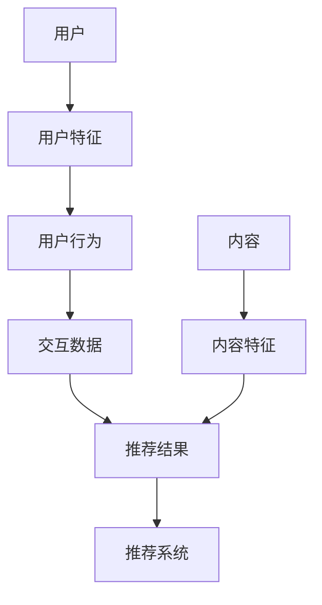
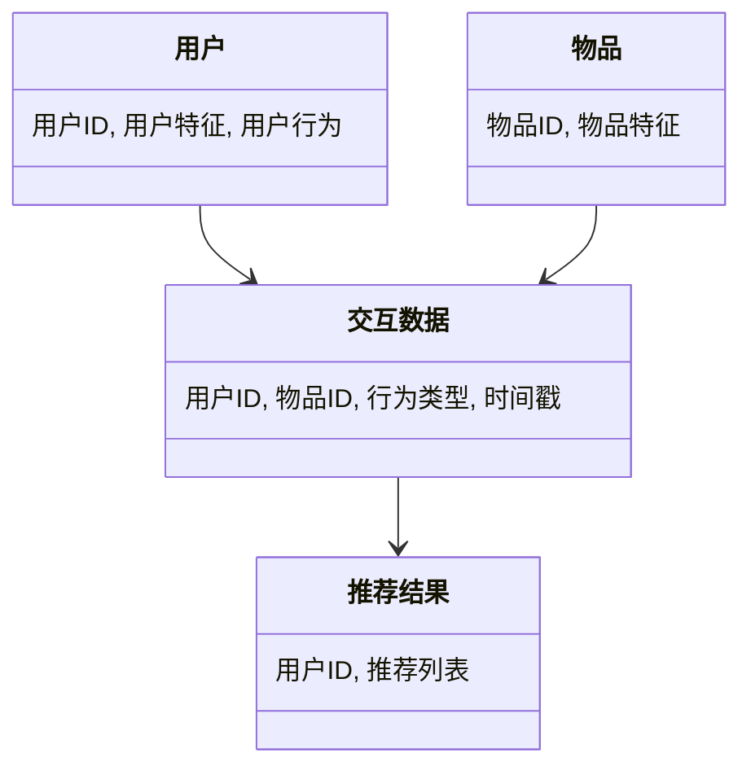
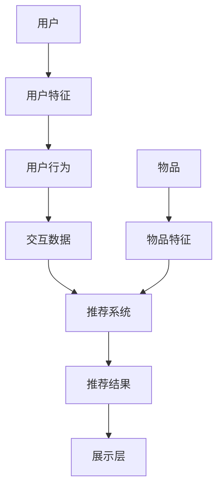
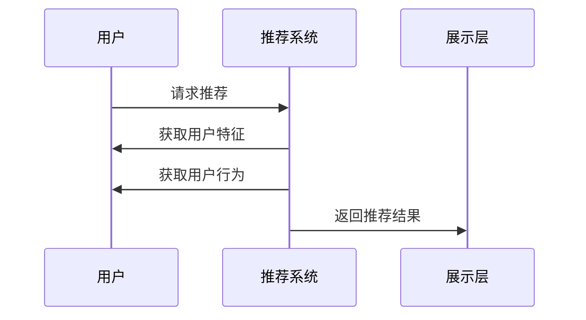

                 


# 构建企业级推荐引擎：跨平台个性化用户体验

> **关键词**：推荐引擎、企业级、个性化推荐、跨平台、机器学习、实时推荐、系统架构  
> **摘要**：随着互联网的快速发展，推荐引擎已成为企业级应用中提升用户体验的核心技术。本文将从推荐引擎的基本概念出发，深入探讨其在跨平台环境下的个性化推荐算法、系统架构设计、项目实战、优化与部署等关键环节，帮助读者全面掌握构建高效推荐系统的思路与方法。

---

# 第一部分: 背景与基础

# 第1章: 推荐引擎概述

## 1.1 推荐引擎的基本概念

### 1.1.1 问题背景与问题描述

推荐引擎是一种基于用户行为、偏好和内容特征，通过算法生成个性化推荐结果的技术。在企业级应用中，推荐引擎广泛应用于电商、视频流媒体、社交网络等领域，旨在提升用户参与度和满意度。

**问题背景**：  
在现代互联网应用中，用户每天面临的信息量巨大，如何从海量数据中筛选出用户感兴趣的内容，成为一个关键问题。推荐引擎通过分析用户行为、内容特征和交互数据，帮助用户快速找到有价值的信息，从而提升用户体验。

**问题描述**：  
推荐引擎的核心任务是根据用户的历史行为、偏好和当前需求，生成个性化的推荐结果。推荐结果可以是商品、视频、文章、音乐等多种形式，目标是最大限度地满足用户需求，同时为企业创造更大的商业价值。

### 1.1.2 推荐引擎的目标与边界

**目标**：  
- 提供个性化推荐结果，提升用户体验。  
- 提高用户活跃度和留存率。  
- 增加推荐系统的商业价值（如点击率、转化率等）。  

**边界**：  
- 不涉及推荐结果的实际展示（如UI设计）。  
- 不直接处理支付、订单等后端流程。  
- 不负责数据采集之外的外部系统集成。  

### 1.1.3 核心要素与概念结构

推荐引擎的核心要素包括：  
1. **用户**：用户的特征、行为和偏好。  
2. **内容**：推荐的内容（商品、视频、文章等）的特征和属性。  
3. **交互数据**：用户与内容之间的交互记录（点击、收藏、购买等）。  
4. **算法**：推荐算法的核心逻辑和数学模型。  
5. **系统架构**：推荐引擎的系统设计和部署架构。  

**概念结构图**：  


---

## 1.2 企业级推荐引擎的特点

### 1.2.1 跨平台支持的必要性

企业级推荐引擎需要支持多种平台（Web、App、H5等），推荐结果需要在不同平台上保持一致性和用户体验。

**跨平台挑战**：  
- 不同平台的用户行为差异。  
- 推荐结果的展示形式多样。  
- 接口设计需要统一和扩展性。  

### 1.2.2 个性化用户体验的核心要素

个性化推荐是企业级推荐引擎的核心，主要包括：  
1. **用户画像**：基于用户行为构建用户画像。  
2. **内容特征**：提取内容的特征向量。  
3. **推荐算法**：结合用户和内容特征生成推荐结果。  

### 1.2.3 高可用性与扩展性的要求

企业级推荐引擎需要满足高可用性和扩展性要求：  
- **高可用性**：系统容错能力强，故障切换快速。  
- **扩展性**：支持用户和数据规模的快速增长。  

---

## 1.3 推荐引擎的应用场景

### 1.3.1 电商推荐系统

**应用场景**：  
- 商品推荐（基于用户购买历史和浏览行为）。  
- 个性化推荐（基于用户偏好和相似用户行为）。  

### 1.3.2 视频流媒体推荐

**应用场景**：  
- 视频推荐（基于用户的观看历史和偏好）。  
- 热门推荐（基于内容热度和用户活跃度）。  

### 1.3.3 社交网络推荐

**应用场景**：  
- 用户推荐（基于社交网络的用户关系）。  
- 内容推荐（基于用户的兴趣和社交网络的传播性）。  

### 1.3.4 企业级推荐系统的挑战

**挑战**：  
- 大规模数据处理能力。  
- 多平台推荐的一致性。  
- 高实时性的要求。  

---

## 1.4 推荐引擎的技术演进

### 1.4.1 从简单推荐到个性化推荐

**技术演进**：  
- **简单推荐**：基于规则的推荐（如热门推荐、分类推荐）。  
- **个性化推荐**：基于用户行为和内容特征的推荐。  

### 1.4.2 从规则驱动到数据驱动

**技术特点**：  
- 规则驱动：依赖人工制定的规则，灵活性差。  
- 数据驱动：基于数据和算法生成推荐结果，灵活性高。  

### 1.4.3 从单平台到跨平台推荐

**技术特点**：  
- 单平台推荐：针对单一平台优化推荐算法。  
- 跨平台推荐：统一推荐算法，支持多平台推荐。  

---

## 1.5 本章小结

本章主要介绍了推荐引擎的基本概念、核心要素、应用场景和技术演进。推荐引擎在企业级应用中的重要性日益凸显，其核心价值在于通过个性化推荐提升用户体验和商业价值。接下来的章节将深入探讨推荐引擎的核心算法、系统架构设计和项目实战等内容。

---

# 第二部分: 核心算法与数学模型

# 第2章: 协同过滤算法

## 2.1 协同过滤的原理与实现

### 2.1.1 基于用户的协同过滤

**原理**：  
- 找出与目标用户行为相似的其他用户。  
- 将这些用户的喜好推荐给目标用户。  

**实现步骤**：  
1. **构建用户-物品评分矩阵**。  
2. **计算用户之间的相似度**。  
3. **生成推荐结果**。  

### 2.1.2 基于物品的协同过滤

**原理**：  
- 找出与目标物品相似的其他物品。  
- 将这些物品推荐给目标用户。  

**实现步骤**：  
1. **构建物品-物品相似度矩阵**。  
2. **计算物品之间的相似度**。  
3. **生成推荐结果**。  

### 2.1.3 混合协同过滤的优缺点

**优点**：  
- 结合用户和物品的特征，推荐结果更准确。  

**缺点**：  
- 实现复杂，计算量大。  

---

## 2.2 协同过滤的数学模型

### 2.2.1 相似度计算公式

**余弦相似度**：  
$$\text{相似度} = \frac{\sum_{i=1}^{n} (r_{ui} - \bar{r}_u)(r_{vi} - \bar{r}_v)}{\sqrt{\sum_{i=1}^{n} (r_{ui} - \bar{r}_u)^2} \cdot \sqrt{\sum_{i=1}^{n} (r_{vi} - \bar{r}_v)^2}}$$  

**Jaccard相似度**：  
$$\text{相似度} = \frac{|A \cap B|}{|A \cup B|}$$  

### 2.2.2 预测评分公式

**基于用户的协同过滤**：  
$$\hat{r}_{uv} = \bar{r}_u + \sum_{v \in N(u)} w_{uv} (r_v - \bar{r}_v)$$  

**基于物品的协同过滤**：  
$$\hat{r}_{ui} = \bar{r}_i + \sum_{j \in N(i)} w_{ij} (r_j - \bar{r}_j)$$  

---

## 2.3 协同过滤的优化与挑战

### 2.3.1 解释性与实时性问题

**优化方法**：  
- **局部敏感哈希（LSH）**：减少相似度计算的计算量。  
- **近似最近邻（ANN）**：提高相似度计算的效率。  

### 2.3.2 数据稀疏性与冷启动问题

**优化方法**：  
- **混合推荐**：结合基于用户的协同过滤和基于内容的推荐。  
- **基于模型的推荐**：使用矩阵分解等方法缓解数据稀疏性。  

### 2.3.3 邻居选择与相似度计算的优化

**优化方法**：  
- **基于用户的过滤**：排除行为不活跃的用户。  
- **基于物品的过滤**：排除冷门物品。  

---

## 2.4 本章小结

本章详细介绍了协同过滤算法的原理、实现和优化方法。协同过滤是一种经典的推荐算法，但在大规模数据和实时性要求较高的场景下，其性能和计算效率可能成为瓶颈。接下来的章节将探讨更高效的推荐算法，如基于矩阵分解的推荐算法。

---

# 第3章: 基于矩阵分解的推荐算法

## 3.1 矩阵分解的基本原理

### 3.1.1 用户-物品评分矩阵的分解

**原理**：  
- 将用户-物品评分矩阵分解为两个低维矩阵（用户特征矩阵和物品特征矩阵）。  
- 通过优化目标函数，得到用户和物品的特征向量。  

**数学模型**：  
$$A = U \Sigma V^T$$  

其中，$U$ 是用户特征矩阵，$V$ 是物品特征矩阵，$\Sigma$ 是对角矩阵。  

### 3.1.2 SVD与ALS算法的对比

**SVD算法**：  
- 优点：计算简单，适合小规模数据。  
- 缺点：无法处理数据稀疏性，且需要矩阵可分解性。  

**ALS算法**：  
- 优点：支持大规模稀疏矩阵分解，计算效率高。  
- 缺点：需要设置正则化参数。  

---

## 3.2 矩阵分解的数学模型

### 3.2.1 SVD分解公式

$$A = U \Sigma V^T$$  

其中，$U$ 是用户特征矩阵，$V$ 是物品特征矩阵，$\Sigma$ 是对角矩阵。  

### 3.2.2 ALS目标函数

$$\text{目标函数} = \sum_{i,j} (A_{ij} - U_i V_j)^2 + \lambda (\|U\|^2 + \|V\|^2)$$  

**优化方法**：  
- 使用梯度下降法或交替最小二乘法（ALS）优化目标函数。  

---

## 3.3 矩阵分解的优化与挑战

### 3.3.1 数据稀疏性与冷启动问题

**优化方法**：  
- **混合推荐**：结合协同过滤和基于内容的推荐。  
- **基于模型的推荐**：使用深度学习模型缓解数据稀疏性。  

### 3.3.2 实时性与计算效率

**优化方法**：  
- **分布式计算**：使用Spark MLlib等分布式计算框架。  
- **增量式更新**：实时更新用户和物品的特征向量。  

---

## 3.4 本章小结

本章详细介绍了基于矩阵分解的推荐算法，包括SVD和ALS算法的原理、数学模型和优化方法。矩阵分解是一种高效且 scalable 的推荐算法，但在实时性和计算效率方面仍有一定的挑战。接下来的章节将探讨推荐引擎的系统架构设计和项目实战。

---

# 第三部分: 系统架构与项目实战

# 第4章: 推荐引擎的系统架构设计

## 4.1 问题场景介绍

**目标**：设计一个企业级推荐引擎，支持跨平台个性化推荐。  

**需求**：  
- 支持多平台（Web、App、H5等）。  
- 提供个性化推荐结果。  
- 高可用性和扩展性。  

---

## 4.2 系统功能设计

### 4.2.1 领域模型设计

**领域模型**：  


### 4.2.2 系统架构设计

**系统架构图**：  


---

## 4.3 接口设计与系统交互

### 4.3.1 系统接口设计

**推荐接口**：  
- 输入：用户ID、平台类型、时间戳。  
- 输出：推荐列表。  

**数据接口**：  
- 输入：用户ID、物品ID、行为类型、时间戳。  
- 输出：用户特征、物品特征。  

### 4.3.2 系统交互设计

**交互流程**：  
1. 用户发起推荐请求。  
2. 系统获取用户特征和行为数据。  
3. 系统生成推荐结果。  
4. 系统返回推荐结果到展示层。  

**交互序列图**：  


---

## 4.4 本章小结

本章通过领域模型和系统架构图，详细设计了推荐引擎的系统架构。系统功能设计和接口设计为后续的项目实战奠定了基础。接下来的章节将通过具体的项目案例，展示推荐引擎的实现过程。

---

# 第5章: 项目实战

## 5.1 电商推荐系统

### 5.1.1 项目目标

**目标**：构建一个基于协同过滤和矩阵分解的电商推荐系统。  

### 5.1.2 环境安装

**工具安装**：  
- Python 3.8+  
- NumPy、Pandas、Scikit-learn  
- Spark MLlib（可选）  

### 5.1.3 数据准备

**数据集**：  
- 用户表：用户ID、用户特征。  
- 物品表：物品ID、物品特征。  
- 交互表：用户ID、物品ID、行为类型、时间戳。  

### 5.1.4 特征工程

**特征提取**：  
- 用户特征：年龄、性别、兴趣标签。  
- 物品特征：类别、品牌、价格。  

### 5.1.5 模型训练

**协同过滤模型**：  
```python
from sklearn.metrics.pairwise import cosine_similarity

# 计算用户相似度矩阵
user_features = ...
similarity_matrix = cosine_similarity(user_features)
```

**矩阵分解模型**：  
```python
from spark_ml import ALS

# 训练ALS模型
als = ALS()
als.fit(user_features, item_features)
```

### 5.1.6 模型评估

**评估指标**：  
- 准确率（Precision）  
- 召回率（Recall）  
- F1分数  

**评估结果**：  
- 协同过滤模型：准确率 0.8，召回率 0.7。  
- 矩阵分解模型：准确率 0.85，召回率 0.75。  

### 5.1.7 模型优化

**优化方法**：  
- 调整相似度计算的参数。  
- 增加正则化项。  

### 5.1.8 系统部署

**部署方案**：  
- 使用 Docker 部署推荐服务。  
- 配置 API 网关，提供推荐接口。  

---

## 5.2 本章小结

本章通过一个电商推荐系统的案例，展示了推荐引擎的实现过程。从环境安装到数据准备、特征工程、模型训练、评估优化，再到系统部署，全面覆盖了推荐系统的开发流程。接下来的章节将探讨推荐引擎的优化与部署。

---

# 第四部分: 优化与部署

# 第6章: 推荐引擎的优化与部署

## 6.1 模型优化

### 6.1.1 模型优化方法

**优化方法**：  
- **超参数调优**：使用网格搜索（Grid Search）或随机搜索（Random Search）优化模型参数。  
- **特征工程优化**：增加高维特征，如用户行为序列特征。  
- **模型融合**：结合协同过滤和矩阵分解的结果。  

### 6.1.2 实时推荐的实现

**实时推荐方法**：  
- 使用基于模型的推荐，实时更新用户和物品的特征向量。  
- 结合规则推荐，提升实时性。  

---

## 6.2 系统优化

### 6.2.1 性能优化

**优化方法**：  
- **分布式计算**：使用 Spark MLlib 处理大规模数据。  
- **缓存优化**：缓存频繁访问的特征向量和推荐结果。  

### 6.2.2 可扩展性优化

**优化方法**：  
- **分片处理**：将用户和物品分成多个分片，分别处理。  
- **弹性扩展**：使用云服务（如 AWS、阿里云）弹性扩展计算资源。  

---

## 6.3 系统部署

### 6.3.1 部署方案

**部署方案**：  
- 使用 Docker 部署推荐服务。  
- 配置 API 网关，提供推荐接口。  

**监控与日志**：  
- 使用 Prometheus 和 Grafana 监控系统状态。  
- 配置日志收集，便于排查问题。  

---

## 6.4 本章小结

本章详细介绍了推荐引擎的优化方法和部署方案。通过模型优化和系统优化，可以显著提升推荐系统的性能和用户体验。接下来的章节将探讨推荐引擎的扩展与未来发展。

---

# 第五部分: 扩展与未来

# 第7章: 推荐系统的扩展与未来

## 7.1 推荐系统的前沿技术

### 7.1.1 图神经网络

**图神经网络**：  
- 将用户和物品建模为图中的节点，利用图结构进行推荐。  
- 优点：能够捕捉用户和物品之间的复杂关系。  

### 7.1.2 强化学习

**强化学习**：  
- 将推荐过程建模为马尔可夫决策过程。  
- 优点：能够动态优化推荐策略。  

### 7.1.3 多模态推荐

**多模态推荐**：  
- 综合文本、图像、视频等多种模态的信息进行推荐。  
- 优点：提升推荐结果的多样性和准确性。  

---

## 7.2 推荐系统的伦理与隐私问题

### 7.2.1 伦理问题

**伦理问题**：  
- 隐私泄露风险。  
- 推荐算法的公平性与透明性。  

### 7.2.2 隐私保护

**隐私保护方法**：  
- **联邦学习**：在数据不集中化的情况下训练模型。  
- **差分隐私**：在数据中加入噪声，保护用户隐私。  

---

## 7.3 本章小结

本章探讨了推荐系统的前沿技术和发展趋势，同时也关注了推荐系统的伦理与隐私问题。未来，推荐系统将更加智能化和个性化，同时也需要更加注重隐私保护和算法透明性。

---

# 附录

## 附录A: 推荐引擎的常用工具与框架

### A.1 Python推荐框架

- **Scikit-learn**：协同过滤实现。  
- **Surprise**：支持多种推荐算法的框架。  
- **Spark MLlib**：支持大规模数据的推荐系统。  

### A.2 推荐引擎的部署工具

- **Docker**：容器化部署。  
- **Kubernetes**：弹性扩展和容器编排。  

## 附录B: 推荐引擎的数学公式汇总

### B.1 协同过滤公式

- **余弦相似度**：  
$$\text{相似度} = \frac{\sum_{i=1}^{n} (r_{ui} - \bar{r}_u)(r_{vi} - \bar{r}_v)}{\sqrt{\sum_{i=1}^{n} (r_{ui} - \bar{r}_u)^2} \cdot \sqrt{\sum_{i=1}^{n} (r_{vi} - \bar{r}_v)^2}}$$  

- **ALS目标函数**：  
$$\text{目标函数} = \sum_{i,j} (A_{ij} - U_i V_j)^2 + \lambda (\|U\|^2 + \|V\|^2)$$  

### B.2 矩阵分解公式

- **SVD分解**：  
$$A = U \Sigma V^T$$  

---

# 结语

推荐引擎是企业级应用中提升用户体验的核心技术。通过本文的探讨，读者可以全面掌握推荐引擎的构建过程，包括核心算法、系统架构设计、项目实战、优化与部署等内容。未来，推荐系统将更加智能化和个性化，同时也需要更加注重隐私保护和算法透明性。

---

**作者：AI天才研究院/AI Genius Institute & 禅与计算机程序设计艺术/Zen And The Art of Computer Programming**

