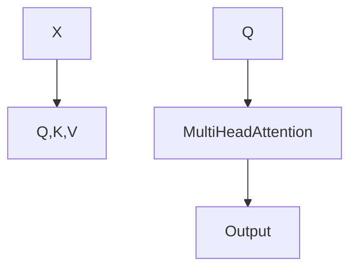
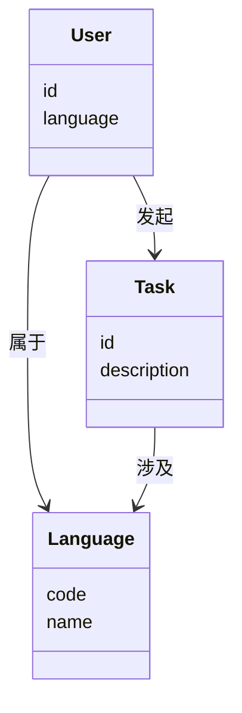
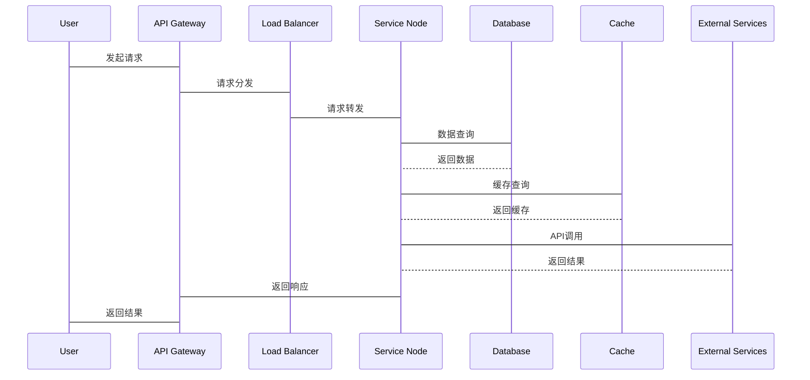

                 


# 构建跨语言理解的AI Agent系统

## 关键词：AI Agent, 跨语言理解, 多语言模型, 注意力机制, 系统架构, 项目实战

## 摘要：本文将详细探讨构建跨语言理解的AI Agent系统的各个方面，从背景介绍到核心概念，从算法原理到系统架构设计，再到项目实战，最后给出总结与展望。文章内容丰富，结构清晰，旨在为读者提供一个全面的跨语言AI Agent系统构建指南。

---

# 第1章: 背景与问题背景

## 1.1 跨语言理解的AI Agent系统背景
### 1.1.1 AI Agent的基本概念
AI Agent是一种智能体，能够感知环境并执行任务以实现目标。跨语言理解的AI Agent能够处理多种语言的信息，为多语言环境中的用户提供更高效的交互体验。

### 1.1.2 跨语言理解的重要性
在多语言环境下，AI Agent需要能够理解并处理不同语言的信息，这在国际商务、多语言客服、跨文化分析等领域尤为重要。

### 1.1.3 跨语言理解的应用场景
- **多语言客服系统**：为不同语言的用户提供支持。
- **跨文化数据分析**：分析多语言数据以提取洞察。
- **全球社交媒体监控**：实时监控多种语言的社交媒体内容。

## 1.2 问题背景与挑战
### 1.2.1 多语言处理的难点
- 不同语言的语法结构差异。
- 文化差异导致的语义歧义。
- 多语言数据的标注和处理复杂性。

### 1.2.2 跨语言理解的复杂性
- 语言间的语义差异。
- 处理多种语言时的计算资源需求。
- 不同语言模型的对齐问题。

### 1.2.3 当前技术的局限性
- 多语言模型的泛化能力有限。
- 训练数据的多样性和平衡性不足。
- 模型在小语种上的表现较差。

## 1.3 问题描述与目标
### 1.3.1 跨语言AI Agent系统的定义
构建一个能够理解并处理多种语言信息的智能系统，能够为用户提供多语言交互支持。

### 1.3.2 系统的核心目标
- 提供多语言的自然语言理解能力。
- 实现跨语言的信息提取和推理。
- 支持多语言对话交互。

## 1.4 系统的边界与外延
### 1.4.1 系统的功能边界
- 支持的语言种类和范围。
- 系统处理的任务类型（如信息查询、情感分析等）。

### 1.4.2 系统的外延部分
- 第三方API调用。
- 多模态数据的处理（如图像、视频）。

### 1.4.3 系统与其他模块的交互
- 与前端交互：接收用户输入。
- 与后端交互：数据存储和处理。
- 与其他服务交互：API调用和数据共享。

## 1.5 核心要素与概念结构
### 1.5.1 核心要素的组成
- **语言模型**：负责跨语言的理解和生成。
- **知识库**：存储多语言知识和数据。
- **推理引擎**：进行跨语言推理和决策。

### 1.5.2 概念结构的分析
跨语言AI Agent系统由语言模型、知识库和推理引擎组成，各部分协同工作以实现跨语言交互。

### 1.5.3 系统的模块划分
- **输入处理模块**：接收多语言输入。
- **语言理解模块**：解析输入并生成语义表示。
- **推理模块**：基于语义表示进行推理。
- **输出生成模块**：生成多语言输出。

---

# 第2章: 跨语言理解的核心原理

## 2.1 跨语言理解的模型结构
### 2.1.1 多语言模型的架构
- **多语言词嵌入**：共享词向量以减少参数量。
- **跨语言注意力机制**：利用不同语言的上下文信息进行对齐。

### 2.1.2 跨语言注意力机制
- **跨语言注意力**：在多语言模型中，注意力机制可以跨语言进行信息对齐。

### 2.1.3 跨语言词嵌入的对齐方法
- **对齐模型**：通过对比学习对齐不同语言的词向量。

## 2.2 跨语言理解的算法选择
### 2.2.1 基于Transformer的模型
- **Transformer架构**：适用于多语言任务，如翻译和问答。

### 2.2.2 多任务学习的应用
- **联合学习**：同时学习多种语言任务以提高模型的泛化能力。

### 2.2.3 对比学习的原理
- **对比对齐**：通过对比学习对齐不同语言的特征向量。

## 2.3 跨语言数据处理的特征对比
### 2.3.1 不同语言的特征分析
- **语言复杂性**：不同语言的语法和词汇复杂性不同。
- **语义相似性**：不同语言中某些词语的语义可能相似。

### 2.3.2 语言间的相似性与差异性
- **相似性**：如英语和法语在词汇和语法上有一定相似性。
- **差异性**：如中英在语序和语法结构上的差异。

### 2.3.3 数据预处理的对比表格
| 语言 | 语序 | 标点符号 | 名词单复数 |
|------|------|----------|----------|
| 英语 | 主谓宾 | . , ! ? | 有复数形式 |
| 中文 | 主谓宾 | 。、，！？ | 无复数形式 |

## 2.4 实体关系的ER图架构
### 2.4.1 实体关系的定义
- **实体**：系统中的基本概念，如用户、语言、任务。
- **关系**：实体之间的关联，如用户发起任务。

### 2.4.2 ER图的构建过程
1. 确定核心实体。
2. 分析实体之间的关系。
3. 设计关联表结构。

### 2.4.3 实体关系的可视化
```mermaid
erd
    User (用户)
    Language (语言)
    Task (任务)
    User -[发起]-> Task
    Task -[涉及]-> Language
```

---

# 第3章: 跨语言理解的算法原理

## 3.1 Transformer模型的工作原理
### 3.1.1 自注意力机制的数学公式
$$\text{Attention}(Q,K,V) = \text{softmax}(\frac{QK^T}{\sqrt{d}})V$$

### 3.1.2 多头注意力的流程图


### 3.1.3 Transformer的实现代码
```python
import torch
class MultiHeadAttention(nn.Module):
    def __init__(self, embed_size, num_heads):
        super().__init__()
        self.embed_size = embed_size
        self.num_heads = num_heads
        self.head_size = embed_size // num_heads
        self.query = nn.Linear(embed_size, embed_size)
        self.key = nn.Linear(embed_size, embed_size)
        self.value = nn.Linear(embed_size, embed_size)
        self.out = nn.Linear(embed_size, embed_size)
    def forward(self, x, mask=None):
        batch_size, seq_length, embed_size = x.size()
        x = x.view(batch_size, seq_length, self.num_heads, self.head_size)
        q = self.query(x).view(batch_size, seq_length, self.num_heads, self.head_size)
        k = self.key(x).view(batch_size, seq_length, self.num_heads, self.head_size)
        v = self.value(x).view(batch_size, seq_length, self.num_heads, self.head_size)
        # 计算注意力权重
        attention = (q @ k.transpose(-2, -1)) / (self.head_size ** 0.5)
        if mask is not None:
            attention = attention.masked_fill(mask == 0, float('-inf'))
        attention = attention.softmax(dim=-1)
        # 加权求和
        out = (attention @ v).transpose(-2, -1).reshape(batch_size, seq_length, embed_size)
        out = self.out(out)
        return out
```

---

# 第4章: 系统分析与架构设计

## 4.1 系统应用场景介绍
- **多语言客服**：支持多语言的客户支持系统。
- **跨文化分析**：分析不同文化背景下的文本数据。

## 4.2 领域模型设计
### 4.2.1 领域模型的Mermaid类图


### 4.2.2 系统架构设计


### 4.2.3 系统交互设计


---

# 第5章: 项目实战

## 5.1 环境安装与配置
```bash
pip install torch transformers
```

## 5.2 核心代码实现
### 5.2.1 数据预处理
```python
import pandas as pd
def preprocess_data(data):
    # 数据清洗和格式化
    df = pd.DataFrame(data)
    return df
```

### 5.2.2 模型构建与训练
```python
class MultiLanguageAgent(nn.Module):
    def __init__(self):
        super().__init__()
        self.language_embeddings = nn.Embedding(100, 50)
        self.transformer = MultiHeadAttention(50, 5)
    def forward(self, input, mask=None):
        embedded = self.language_embeddings(input)
        output = self.transformer(embedded, mask)
        return output
```

### 5.2.3 模型训练
```python
model = MultiLanguageAgent()
criterion = nn.CrossEntropyLoss()
optimizer = torch.optim.Adam(model.parameters(), lr=0.001)
for epoch in range(10):
    for batch in dataloader:
        inputs, labels = batch
        outputs = model(inputs)
        loss = criterion(outputs, labels)
        loss.backward()
        optimizer.step()
```

## 5.3 实际案例分析
### 5.3.1 案例描述
分析一个跨语言的客服请求，系统需要理解并生成多语言的响应。

### 5.3.2 代码解读
```python
input_text = "Yo need help with your account."
response = agent.generate_response(input_text, target_language='es')
print(response)  # "Necesita ayuda con su cuenta."
```

## 5.4 项目总结
- **优势**：支持多种语言，提高用户体验。
- **挑战**：模型训练需要大量数据，计算资源消耗大。
- **改进建议**：优化模型结构，引入多模态数据。

---

# 第6章: 总结与展望

## 6.1 总结
构建跨语言理解的AI Agent系统是一项复杂但极具挑战性的任务，需要结合自然语言处理、跨语言模型和系统架构设计的多方面知识。

## 6.2 最佳实践 tips
- 确保数据的多样性和平衡性。
- 选择合适的模型架构和算法。
- 优化系统的模块化和可扩展性。

## 6.3 未来展望
- **多模态融合**：结合视觉、听觉等多模态数据。
- **小语种支持**：提高模型在小语种上的表现。
- **动态适应**：实现动态语言切换和自适应学习。

---

# 作者：AI天才研究院/AI Genius Institute & 禅与计算机程序设计艺术 /Zen And The Art of Computer Programming

