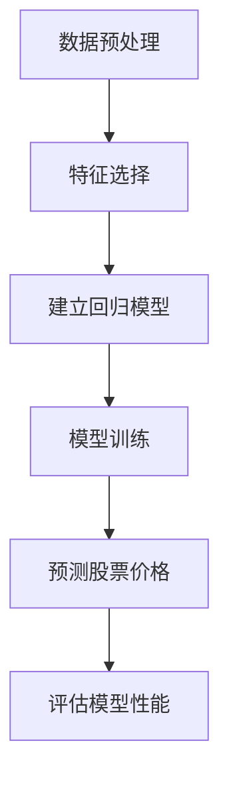
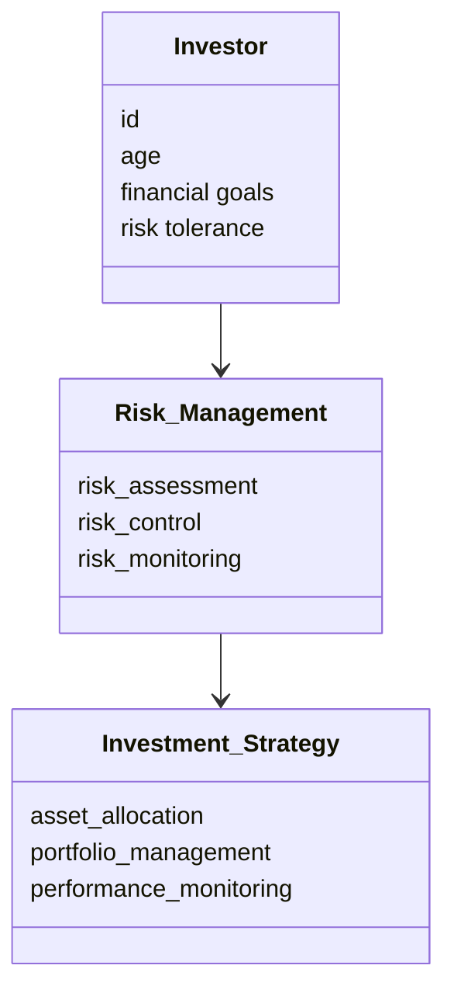
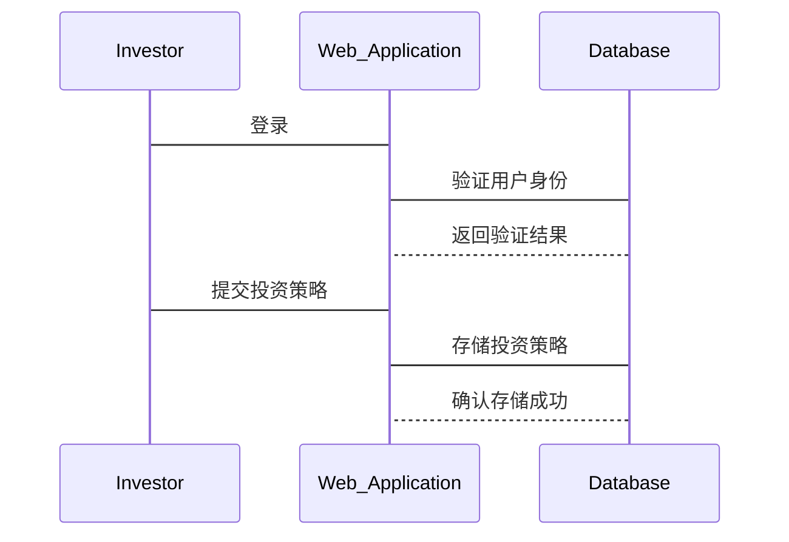

                 


```markdown
# 特价股票投资中的跨代际投资策略与风险管理

> 关键词：特价股票，跨代际投资，风险管理，股票投资，投资策略

> 摘要：本文探讨了特价股票投资中的跨代际投资策略与风险管理。首先，介绍了特价股票的定义、特点以及跨代际投资的背景与重要性。其次，详细分析了跨代际投资策略的核心概念、原理及其与风险管理的关系。通过对比分析和ER实体关系图，进一步阐述了跨代际投资与传统投资的区别。随后，从算法原理、系统架构、项目实战等多维度进行了深入探讨，结合Python代码和数学模型，展示了如何利用机器学习算法进行股票预测和投资策略优化。最后，通过实际案例分析，总结了跨代际投资策略与风险管理的最佳实践，为投资者提供了实用的指导建议。

---

## 第一章: 特价股票投资的背景与概述

### 1.1 特价股票的定义与特点

#### 1.1.1 特价股票的定义
特价股票是指价格低于面值的股票，通常被称为“打折股票”。这类股票可能由于市场波动、公司财务问题或其他因素导致其价格低于其实际价值。

#### 1.1.2 特价股票的特点
- **价格优势**：特价股票通常以低于面值的价格发行，具有较高的投资吸引力。
- **高波动性**：由于价格较低，特价股票往往具有较高的波动性，投资风险较大。
- **潜在收益**：如果公司扭亏为盈或市场环境改善，特价股票可能带来较高的收益。

#### 1.1.3 特价股票的投资价值
特价股票的投资价值主要体现在其价格优势和潜在收益上。然而，投资者需要具备一定的市场敏感性和风险承受能力。

### 1.2 跨代际投资策略的背景

#### 1.2.1 跨代际投资的定义
跨代际投资是指不同年龄段或不同阶段的投资策略。它强调根据投资者的生命周期阶段和风险承受能力，制定个性化的投资计划。

#### 1.2.2 跨代际投资的必要性
- **生命周期匹配**：不同年龄段的投资者有不同的财务目标和风险承受能力。
- **市场环境适应**：跨代际投资能够更好地适应不同市场环境的变化。
- **长期收益优化**：通过跨代际投资，投资者可以在不同生命周期阶段实现收益最大化。

#### 1.2.3 跨代际投资与传统投资的区别
| 特性 | 跨代际投资 | 传统投资 |
|------|------------|-----------|
| 投资目标 | 长期收益最大化 | 短期收益最大化 |
| 风险承受 | 根据生命周期调整 | 固定风险承受能力 |
| 投资策略 | 多样化策略 | 单一策略 |

### 1.3 风险管理在股票投资中的重要性

#### 1.3.1 风险管理的基本概念
风险管理是指识别、评估和控制投资中的潜在风险，以确保投资目标的实现。

#### 1.3.2 风险管理在股票投资中的作用
- **降低投资损失**：通过有效的风险管理，投资者可以减少因市场波动带来的损失。
- **提高投资收益**：合理管理风险可以提高投资收益，避免因过度冒险导致的亏损。
- **增强投资信心**：良好的风险管理能够增强投资者的信心，使其更从容地面对市场变化。

#### 1.3.3 风险管理的核心原则
- **分散投资**：通过多样化投资组合降低风险。
- **风险与收益匹配**：根据风险承受能力选择合适的投资标的。
- **动态调整**：根据市场变化及时调整投资策略。

### 1.4 本章小结
- **特价股票的核心特征**：价格低于面值，波动性高，潜在收益大。
- **跨代际投资的背景与意义**：根据生命周期阶段制定投资策略，适应不同市场环境，实现长期收益最大化。
- **风险管理的关键作用**：降低投资损失，提高收益，增强信心。

---

## 第二章: 跨代际投资策略的核心概念与联系

### 2.1 跨代际投资策略的原理

#### 2.1.1 跨代际投资的基本原理
跨代际投资通过分析不同生命周期阶段的财务需求和风险承受能力，制定个性化的投资策略。例如，年轻投资者可以承担更高风险以追求高收益，而年长投资者则更注重稳健投资以保障资金安全。

#### 2.1.2 跨代际投资的核心要素
- **财务目标**：明确不同阶段的投资目标。
- **风险承受能力**：根据生命周期阶段调整风险偏好。
- **投资组合优化**：通过多样化投资降低风险。

#### 2.1.3 跨代际投资的实现机制
跨代际投资通过动态调整投资组合，在不同生命周期阶段实现收益与风险的最佳匹配。

### 2.2 风险管理的核心概念

#### 2.2.1 风险识别与评估
- **风险识别**：识别投资中的潜在风险，如市场风险、流动性风险等。
- **风险评估**：量化各风险的影响程度，制定应对策略。

#### 2.2.2 风险量化与测量
- **风险量化**：通过数学模型量化风险，如VaR（在险价值）。
- **风险测量**：评估投资组合的波动性和潜在损失。

#### 2.2.3 风险控制与应对策略
- **风险控制**：通过分散投资、设定止损点等方法控制风险。
- **应对策略**：根据市场变化及时调整投资策略，减少风险损失。

### 2.3 跨代际投资与风险管理的关系

#### 2.3.1 跨代际投资中的风险管理
- **风险评估**：根据生命周期阶段评估风险承受能力。
- **风险控制**：通过多样化投资降低特定风险。
- **动态调整**：根据市场变化和生命周期阶段调整风险管理策略。

#### 2.3.2 风险管理对投資策略的影响
- **影响投资决策**：风险管理直接影响投资组合的选择和调整。
- **优化投资收益**：有效的风险管理可以提高投资组合的整体收益。

#### 2.3.3 跨代际投资与风险管理的协同作用
- **协同效应**：跨代际投资与风险管理的结合能够实现收益与风险的最佳匹配。
- **动态优化**：根据市场变化和生命周期阶段，动态优化投资策略和风险管理措施。

### 2.4 核心概念对比表

#### 2.4.1 跨代际投资与传统投资的对比
| 特性 | 跨代际投资 | 传统投资 |
|------|------------|-----------|
| 投资目标 | 长期收益最大化 | 短期收益最大化 |
| 风险承受 | 根据生命周期阶段调整 | 固定风险承受能力 |
| 投资策略 | 多样化策略 | 单一策略 |

#### 2.4.2 风险管理与收益管理的对比
| 特性 | 风险管理 | 收益管理 |
|------|----------|----------|
| 目标 | 减少损失 | 提高收益 |
| 方法 | 分散投资、设定止损 | 选择高收益资产、杠杆操作 |
| 影响 | 影响投资组合的整体表现 | 直接影响投资收益 |

#### 2.4.3 跨代际投资中的风险管理特点
- **动态调整**：根据生命周期阶段和市场环境调整风险管理策略。
- **个性化**：根据投资者的财务目标和风险承受能力制定个性化风险管理方案。
- **长期视角**：从长期角度出发，平衡风险与收益。

### 2.5 ER实体关系图

```mermaid
erDiagram
    investor ++<o- has> risk_management
    risk_management ++<o- has> investment_strategy
    investment_strategy ++<o- has> stock
    stock ++<o- has> risk_assessment
```

---

## 第三章: 跨代际投资策略的算法原理

### 3.1 算法原理

#### 3.1.1 机器学习在股票预测中的应用
机器学习可以通过分析历史数据，预测股票价格的变化趋势，帮助投资者制定投资策略。

#### 3.1.2 回归分析模型
回归分析是一种常用的统计方法，用于预测股票价格的变化趋势。

#### 3.1.3 时间序列分析
时间序列分析可以预测股票价格的未来走势，帮助投资者做出投资决策。

### 3.2 算法实现

#### 3.2.1 Python代码实现
```python
import pandas as pd
from sklearn.linear_model import LinearRegression
from sklearn.metrics import mean_squared_error

# 加载数据
data = pd.read_csv('stock_data.csv')

# 分割特征和目标变量
X = data[['open', 'high', 'low', 'volume']]
y = data['close']

# 建立线性回归模型
model = LinearRegression()
model.fit(X, y)

# 预测股票价格
y_pred = model.predict(X)

# 评估模型性能
mse = mean_squared_error(y, y_pred)
print(f"均方误差: {mse}")
```

#### 3.2.2 数学模型与公式
$$
\text{预测股票价格} = \beta_0 + \beta_1 \times \text{开盘价} + \beta_2 \times \text{最高价} + \beta_3 \times \text{最低价} + \beta_4 \times \text{成交量} + \epsilon
$$

### 3.3 算法流程图



---

## 第四章: 跨代际投资策略的系统架构

### 4.1 系统功能设计

#### 4.1.1 领域模型


#### 4.1.2 系统架构
```mermaid
containerDiagram
    container Web_Application {
        Investor_Interface
        Risk_Management_Module
        Investment_Strategy_Module
        Performance_Report_Module
    }
    container Database {
        Investor_Data
        Risk_Assessment_Data
        Investment_Strategy_Data
        Performance_Data
    }
```

#### 4.1.3 系统接口设计
- **API接口**：提供RESTful API接口，方便与其他系统集成。
- **数据接口**：支持多种数据格式的导入和导出。

#### 4.1.4 系统交互流程


### 4.2 系统架构图


---

## 第五章: 跨代际投资策略的项目实战

### 5.1 环境安装

#### 5.1.1 安装Python
```bash
python --version
pip install numpy pandas scikit-learn
```

#### 5.1.2 安装Jupyter Notebook
```bash
pip install jupyter-notebook
jupyter notebook
```

### 5.2 核心实现

#### 5.2.1 数据加载与预处理
```python
import pandas as pd
data = pd.read_csv('stock_data.csv')
data.head()
```

#### 5.2.2 特征选择与模型训练
```python
from sklearn.linear_model import LinearRegression
model = LinearRegression()
model.fit(X_train, y_train)
```

#### 5.2.3 模型预测与评估
```python
y_pred = model.predict(X_test)
print(mean_squared_error(y_test, y_pred))
```

### 5.3 案例分析

#### 5.3.1 案例背景
假设我们选择一只特价股票，分析其历史价格和市场趋势。

#### 5.3.2 投资策略制定
根据投资者的生命周期阶段和风险承受能力，制定相应的投资策略。

#### 5.3.3 风险管理实施
通过分散投资、设定止损点等方法，降低投资风险。

### 5.4 项目小结
- **环境安装**：安装必要的Python库和开发工具。
- **核心实现**：利用机器学习算法进行股票预测和投资策略优化。
- **案例分析**：通过具体案例分析，展示跨代际投资策略与风险管理的实际应用。

---

## 第六章: 跨代际投资策略的最佳实践

### 6.1 小结
- **跨代际投资的核心概念**：根据生命周期阶段制定投资策略。
- **风险管理的关键作用**：降低投资风险，提高投资收益。
- **算法与系统架构**：利用机器学习算法和系统架构优化投资策略。

### 6.2 注意事项
- **市场风险**：股票市场具有高波动性，投资者需具备风险意识。
- **数据质量**：数据质量直接影响模型的预测精度。
- **模型局限性**：机器学习模型具有局限性，需结合实际情况进行调整。

### 6.3 拓展阅读
- **相关书籍**：《股票投资实战策略》、《风险管理与投资组合优化》。
- **在线资源**：学习Python机器学习库的使用，如Scikit-learn、TensorFlow等。

---

## 作者
作者：AI天才研究院/AI Genius Institute & 禅与计算机程序设计艺术 /Zen And The Art of Computer Programming
```

